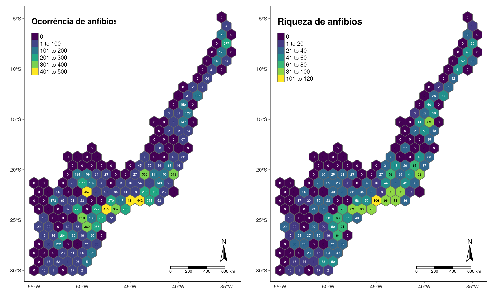

# Dados geoespaciais {#cap15}

## Pré-requisitos do capítulo {-}

Pacotes e dados que serão utilizados nesse capítulo.

```{r}
## Pacotes
library(ecodados)
library(here)
library(tidyverse)
library(sf) 
library(raster) 
library(rgdal) 
library(spData)
library(rnaturalearth)
library(geobr)
library(ggplot2)
library(ggspatial)
library(tmap)
library(tmaptools)
library(grid)
library(mapview)
library(leaflet)
library(viridis)
library(knitr)
library(sidrar)
library(landscapetools)

## Dados
# world <- world
# volcano <- volcano
# geo_anfibios_locais <- ecodados::geo_anfibios_locais
# geo_anfibios_especies <- ecodados::geo_anfibios_especies
# geo_vetor_nascentes <- ecodados::geo_vetor_nascentes
# geo_vetor_hidrografia <- ecodados::geo_vetor_hidrografia
# geo_vetor_cobertura <- ecodados::geo_vetor_cobertura
# geo_vetor_rio_claro <- ecodados::geo_vetor_rio_claro
# geo_vetor_brasil <- ecodados::geo_vetor_brasil
# geo_vetor_brasil_anos <- ecodados::geo_vetor_brasil_anos
# geo_vetor_am_sul <- ecodados::geo_vetor_am_sul
# geo_vetor_biomas <- ecodados::geo_vetor_biomas
# geo_vetor_mata_atlantica <- ecodados::geo_vetor_mata_atlantica
# geo_raster_srtm <- ecodados::geo_raster_srtm
# geo_raster_bioclim <- ecodados::geo_raster_bioclim
# geo_raster_globcover_mata_atlantica <- ecodados::geo_raster_globcover_mata_atlantica
```

## Contextualização

Nesta seção, vamos fazer uma breve introdução aos principais conceitos sobre a manipulação e visualização de dados geoespaciais no R. Iremos abordar temas de forma teórica e prática, utilizando a linguagem R, focando em: i) formatos de dados vetoriais e dados raster, ii) Sistemas de Referências de Coordenadas e unidades (geográficas e projetadas), iii) fontes de dados, iv) importar e exportar dados, v) descrição de objetos geoespaciais e vi) principais operações (atributos, espaciais e geométricas). Num segundo momento, criaremos mapas com seus principais elementos como mapas principal e secundário, título, legenda, barra de escala, indicador de orientação (Norte), gride de coordenadas, descrição do Sistema de Referência de Coordenadas e informações de origem dos dados. Por fim, apresentaremos exemplos de aplicações de análises geoespaciais para dados ecológicos, focadas em: i) agregar informações sobre a biodiversidade, ii) preparar dados para compor variáveis preditoras, e iii) como fazer predições espaciais de distribuição de uma espécie e riqueza de espécies.

Esse capítulo segue parte da estrutura organizada por Lovelace et al. [-@lovelace2019], principalmente os Capítulos 2 a 8, sendo adaptado para atender aos principais requisitos que julgamos necessários a estudos ecológicos. Entretanto, não foi possível cobrir todos os assuntos sobre o uso de dados geoespaciais no R, sendo um tema muito extenso que requer a leitura de livros especializados na área como: i) Mas et al. [-@mas2019] [Análise espacial com R](https://bit.ly/2KpSI7C), ii) Wegmann, Leutner & Dech [-@wegmann2016] *Remote Sensing and GIS for Ecologists: Using Open Source Software*, iii) Wegmann, Schwalb-Willmann & Dech [-@wegmann2020] *An Introduction to Spatial Data Analysis Remote Sensing and GIS with Open Source Software*, e iv) Fletcher & Fortin [-@fletcher2018] *Spatial ecology and conservation modeling: Applications with R*. Outros livros sobre a análise geoespacial no R podem ser consultados no Capítulo [11 - Geospatial](https://www.bigbookofr.com/geospatial.html) do [Big Book of R](https://www.bigbookofr.com/index.html).

## Vetor

Dados vetoriais são usados para mapear fenômenos ou objetos espacialmente explícitos que possuem localização ou dimensões bem definidas, representado a partir de formas geométricas (como pontos, linhas e polígonos) e possuem a possibilidade de ter associado a eles informações tabulares. A tabela de atributos é uma tabela que inclui dados geoespaciais e dados alfanuméricos. Os dados geoespaciais são representados por feições geolocalizada espacialmente (ponto, linha ou polígono), e os dados alfanuméricos (tabela de dados). Dessa forma, a tabela de atributos reúne informações sobre cada feição e pode ser utilizada para realizar de filtros ou agregações dos dados de cada feição (Figura \@ref(fig:fig-vetor-tipos).

```{r fig-vetor-tipos, echo=FALSE, fig.cap="Representação das geometrias de ponto, linha e polígono e atributos. Adaptado de Olaya [-@olaya2020])."}
knitr::include_graphics("img/cap15_fig01.png")
```

### sf: principal pacote no R para dados vetoriais

Atualmente o principal pacote para trabalhar com dados vetoriais no R é o [`sf`](https://r-spatial.github.io/sf/), que implementou o *Simple Feature* [@sf2018]. Entretanto, outro pacote pode ser tão versátil quanto o `sf`, no caso o [`terra`](https://rspatial.org/terra/index.html), com algumas mudanças na sintaxe que não abordaremos nesse livro por questões de redução de espaço.

Os tipos de geometrias apresentadas são representados por diferentes classes: `POINT`, `LINESTRING` e `POLYGON` para apenas uma feição de cada tipo de geometria; `MULTIPOINT`, `MULTILINESTRING` e `MULTIPOLYGON` para várias feições de cada tipo de geometria e; `GEOMETRYCOLLECTION` para várias feições e tipos de geometrias e classes.

Ao olharmos as informações de um objeto da classe `sf`, podemos notar diversas informações que descrevem o mesmo, numa espécie de cabeçalho:

-   **resumo do vetor**: indica o número de feições (linhas) e campos (colunas)
-   **tipo da geometria**: umas das sete classes (ou mais outras) listadas anteriormente
-   **dimensão**: número de dimensões, geralmente duas (XY)
-   **bbox (bordas)**: coordenadas mínimas e máximas da longitude e latitude
-   **informação do CRS**: `epsg` ou `proj4string` indicando o CRS (*Coordinate Reference System*)
-   **tibble**: tabela de atributos, com destaque para a coluna `geom` ou `geometry` que representa cada feição ou geometria

```{r}
## Dados vetoriais de polígonos do mundo
data(world)
world
```

Podemos fazer um mapa simples utilizando a função `plot()` desse objeto. Para facilitar, escolheremos apenas a primeira coluna `[1]` (Figura \@ref(fig:fig-vetor-mundo)). Caso não escolhermos apenas uma coluna, um mapa para cada coluna será plotado.

::: {.alert .alert-info}
<strong> 📝 Importante </strong>\
Faremos mapas mais elaborados na seção de visualização de dados geoespaciais deste capítulo.
:::

```{r fig-vetor-mundo, fig.cap="Mapa vetorial do mundo."}
## Plot dos polígonos do mundo
plot(world[1], col = viridis::viridis(100), main = "Mapa do mundo")
```

## Raster

Os dados no formato raster consistem em uma matriz (com linhas e colunas) em que os elementos representam células, geralmente igualmente espaçadas (pixels; Figura \@ref(fig:fig-raster). As células dos dados raster possuem duas informações: i) identificação das células (IDs das células) para especificar sua posição na matriz (Figura \@ref(fig:fig-raster) A) e; ii) valores das células (Figura \@ref(fig:fig-raster) B), que geralmente são coloridos para facilitar a interpretação da variação dos valores no espaço (Figura \@ref(fig:fig-raster) C). Além disso, valores ausentes ou não amostrados são representados por `NA`, ou seja, *not available* (Figura \@ref(fig:fig-raster) B e C).

```{r fig-raster, echo=FALSE, fig.cap="Raster: (A) IDs das células, (B) valores das células, (C) células coloridas. Adaptado de Lovelace et al. [-@lovelace2019])."}
library(gridExtra)

# Dados
set.seed(42)
small_ras <- raster(matrix(1:16, 4, 4, byrow = TRUE))
small_ras_val <- raster(matrix(sample.int(100, 16), 4, 4, byrow = TRUE))
small_ras_val[c(10, 15)] <- NA
polys <- rasterToPolygons(small_ras, na.rm = FALSE)

# ids das células
p_1 <- spplot(small_ras, colorkey = FALSE, col.regions = "white",
              main = "A. IDs das células",
              sp.layout = list(
                  list("sp.polygons", polys, first = FALSE),
                  list("sp.text", xyFromCell(small_ras_val, 1:ncell(small_ras)),
                       1:ncell(small_ras))
              )
)

# valor das células
p_2 <- spplot(small_ras_val, colorkey = FALSE, col.regions = "white",
              main = "B. Valores das céluas",
              sp.layout = list(
                  list("sp.polygons", polys, first = FALSE),
                  list("sp.text", xyFromCell(small_ras_val,
                                             1:ncell(small_ras_val)),
                       values(small_ras_val))
              )
)

# mapa colorido
p_3 <- spplot(small_ras_val, 
              col.regions = viridis::viridis(16),
              colorkey = FALSE,
              main = "C. Valores coloridos")

grid.arrange(p_1, p_2, p_3, ncol = 3)
```

Pode ainda fazer uma comparação com as representações de dados vetoriais vistos na Figura \@ref(fig:fig-vetor-tipos), mas agora no formato raster (Figura \@ref(fig:fig-raster-tipos).

```{r fig-raster-tipos, echo=FALSE, fig.cap="Representação das geometrias de ponto, linha e polígono no formato raster. Adaptado de Olaya [-@olaya2020])."}
knitr::include_graphics("img/cap15_fig02.png")
```

### raster: principal pacote no R para dados raster

Atualmente, o principal pacote para trabalhar com dados raster é o [*raster*](https://rspatial.org/raster/index.html), apesar de existir outros dois: [*terra*](https://rspatial.org/terra/index.html) e [*stars*](https://r-spatial.github.io/stars/), com algumas mudanças na sintaxe que não abordaremos neste livro.

O pacote `raster` fornece uma ampla gama de funções para criar, importar, exportar, manipular e processar dados raster no R. O objeto raster criado à partir do pacote `raster` pode assumir três classes: `RasterLayer`, `RasterStack` e `RasterBrick`.

A classe `RasterLayer` representa apenas uma camada raster. Para criar ou importar um raster no R podemos utilizar a função `raster::raster()`. Observando essa classe, podemos notar as seguintes informações:

-   **class**: classe raster do objeto raster
-   **dimensions**: número de linhas, colunas e células
-   **resolution**: largura e altura da célula
-   **extent**: coordenadas mínimas e máximas da longitude e latitude
-   **crs**: Sistema de Referência de Coordenadas (*CRS*)
-   **source**: fonte dos dados (memória ou disco)
-   **names**: nome das camadas
-   **values**: valores máximos e mínimos das células

Vamos utilizar os dados `volcano`, que possui informações topográficas (elevação) do vulcão Maunga Whau de Auckland na Nova Zelândia.

```{r}
## Dados de altitude de um vulcão
volcano[1:5, 1:5]
```

Vamos transformar essa matriz de dados em um raster com a função `raster::raster()`.

```{r}
## Rasterlayer
raster_layer <- raster::raster(volcano)
raster_layer
```

Um mapa simples do objeto raster pode ser obtido utilizando a função `plot()`, do próprio pacote `raster` (Figura \@ref(fig:fig-raster-layer)).

```{r fig-raster-layer, fig.cap="Mapa simples de um `RasterLayer`."}
## Plot raster layers
plot(raster_layer, col = viridis::viridis(n = 100))
```

Além da classe `RasterLayer`, há mais duas classes que trabalham com múltiplas camadas: `RasterBrick` e `RasterStack`. Elas diferem em relação ao número de formatos de arquivo suportados, tipo de representação interna e velocidade de processamento.

A classe `RasterBrick` geralmente corresponde à importação de um único arquivo de imagem de satélite multiespectral (multicamadas) ou a um único objeto com várias camadas na memória. A função `raster::brick()` cria um objeto `RasterBrick`.

```{r}
## Raster layers
raster_layer1 <- raster_layer
raster_layer2 <- raster_layer * raster_layer
raster_layer3 <- sqrt(raster_layer)
raster_layer4 <- log10(raster_layer)

## Raster brick
raster_brick <- raster::brick(raster_layer1, raster_layer2, 
                              raster_layer3, raster_layer4)
raster_brick
```

Ao utilizarmos a função `plot()` do pacote `raster`, podemos visualizar os raster contidos no objeto `RasterBrick` (Figura \@ref(fig:fig-raster-brick)).

```{r fig-raster-brick, fig.cap="Mapas simples de um raster `RasterBrick`."}
## Plot raster brick
plot(raster_brick, col = viridis::viridis(n = 25), main = "")
```

Já a classe `RasterStack` permite conectar vários objetos raster armazenados em arquivos diferentes ou vários objetos no ambiente do R. Um `RasterStack` é uma lista de objetos `RasterLayer` com a mesma extensão, resolução e CRS. Uma maneira de criá-lo é com a junção de vários objetos geoespaciais já existentes no ambiente do R ou listar vários arquivos raster em um diretório armazenado no disco. A função `raster::stack()` cria um objeto `RasterStack`.

Outra diferença é que o tempo de processamento, para objetos `RasterBrick` geralmente é menor do que para objetos `RasterStack`. A decisão sobre qual classe `Raster` deve ser usada depende principalmente do caráter dos dados de entrada.

```{r}
## Raster layers
raster_layer1 <- raster_layer
raster_layer2 <- raster_layer * raster_layer
raster_layer3 <- sqrt(raster_layer)
raster_layer4 <- log10(raster_layer)

## Raster stack
raster_stack <- raster::stack(raster_layer1, raster_layer2, 
                              raster_layer3, raster_layer4)
raster_stack
```

Da mesma forma, ao utilizar a função `plot()` do pacote `raster`, podemos visualizar os raster contidos no objeto `RasterStack` (Figura \@ref(fig:fig-raster-stack)).

```{r fig-raster-stack, fig.cap="Mapas simples de um raster `RasterStack`."}
## Plot raster stack
plot(raster_stack, col = viridis::viridis(n = 25), main = "")
```

## Sistema de Referência de Coordenadas e Unidades

Os dados geoespaciais (vetor e raster) possuem ainda um outro componente fundamental que é o Sistema de Referência de Coordenadas, ou do inglês *Coordinate Reference System (CRS)*. Esse componente define a referência espacial dos elementos geoespaciais (vetor e raster) na superfície da Terra. Esse componente é composto por dois principais conceitos: primeiro, que tipo de unidades estão sendo utilizadas para a representação geográfica, podendo assumir dois tipos - ângulos ou metros, que definem o Sistema de Coordenadas Geográficas e o Sistema de Coordenadas Projetadas, respectivamente. O segundo componente é o datum, que é a relação do sistema de coordenadas (geográfica ou projetada) com a superfície da Terra. Esse último componente faz parte de uma área da Cartografia denominada Geodésia que estuda a forma e dimensões da Terra, campo gravitacional e a localização de pontos fixos e sistemas de coordenadas. O livro de Lapaine & Usery [-@lapaine2017] é um excelente material para se aprofundar nesse assunto.

### Sistema de Coordenadas Geográficas

O Sistema de Coordenadas Geográficas utiliza ângulos (graus) para representar feições na superfície da Terra através de dois valores: longitude e latitude. A longitude representa o eixo Leste-Oeste e a latitudeo eixo Norte-Sul. Nesse sistema, a superfície da Terra é representada geralmente por uma superfície elipsoidal, pois a Terra é ligeiramente achatada nos polos devido ao seu movimento no entorno do seu eixo.

### Sistema de Coordenadas Projetadas

O Sistema de Coordenadas Projetadas utiliza um Sistema Cartesiano de Coordenadas em uma superfície plana. Dessa forma, a partir de uma origem traçam-se eixos X e Y e uma unidade linear é utilizada, como o metro. Todos as projeções feitas de sistemas geoespaciais convertem uma superfície tridimensional em uma superfície plana bidimensional. Sendo assim, essa conversão traz consigo algum tipo de distorção em relação à porção real, podendo ser distorções em: i) formas locais, ii) áreas, iii) distâncias, iv) flexão ou curvatura, v) assimetria ou vi) lacunas de continuidade. Dessa forma, um sistema de coordenadas projetadas pode preservar somente uma ou duas dessas propriedades.

Existem três grandes grupos de projeções: i) cilíndricos, ii) cônicos e iii) planares. Na projeção cilíndrica, a superfície da Terra é mapeada em um cilindro, criada tocando a superfície da Terra ao longo de uma ou duas linhas de tangência, sendo utilizada com mais frequência para mapear todo o globo tendo como exemplo mais conhecido a Projeção Universal Transversa de Mercator (UTM). Na projeção cônica, a superfície da Terra é projetada em um cone ao longo de uma linha ou duas linhas de tangência, de modo que as distorções são minimizadas ao longo das linhas e aumentam com a distância das mesmas, sendo portanto, mais adequada para mapear áreas de latitudes médias, tendo como exemplo mais conhecido a Projeção Cônica Equivalente de Albers e a Projeção Cônica Conforme de Lambert. E na projeção plana, também denominada Projeção Azimutal, o mapeamento toca o globo em um ponto ou ao longo de uma linha de tangência, sendo normalmente utilizado no mapeamento de regiões polares, sendo a mais comum a Projeção Azimutal Equidistante, a mesma utilizada na bandeira da ONU.

### Datum

Como dito anteriormente, o datum é a relação do sistema de coordenadas com a superfície da Terra. Ele representa o ponto de intersecção do elipsoide de referência com a superfície da Terra (geoide, a forma verdadeira da Terra), compensando as diferenças do campo gravitacional da Terra. Existem dois tipos de datum: i) local e ii) geocêntrico. Em um datum local, como o SAD69 - *South American Datum 1969*, o elipsoide de referência é deslocado para se alinhar com a superfície em um determinado local, por exemplo, na América do Sul. Já em um datum geocêntrico, como WGS84 - *World Geodetic System 1984*, o centro do elipsoide é o centro de gravidade da Terra e a precisão das projeções não é otimizada para um local específico do globo.

No Brasil, desde 2015, o [Instituto Brasileiro de Geografia e Estatística (IBGE)](https://www.ibge.gov.br/) ajudou a desenvolver e reafirmou o uso do datum SIRGAS2000 - *Sistema de Referencia Geocéntrico para las Américas 2000* para todos os mapeamentos realizados no Brasil, um esforço conjunto para adotar o mesmo datum em toda a América. Mais sobre esse datum pode ser lido aqui: [SIRGAS2000](http://www.sirgas.org/pt/sirgas-realizations/sirgas2000/).

### Sistema de Referência de Coordenadas (CRS) no R

No R, há duas formas principais de representar um Sistema de Referência de Coordenadas: i) código `epsg` e ii) `proj4string`. O código EPSG (*European Petroleum Survey Group*) é uma sequência de números curta, referindo-se apenas a um CRS. O site [epsg.io](http://epsg.io/) permite consultar diversas informações sobre um código, como procurar por um código, representação de mapas e fazer transformações de CRS.

Já o `proj4string` permite mais flexibilidade para especificar diferentes parâmetros, como o tipo de projeção, datum e elipsoide. Dessa forma, é possível especificar muitas projeções, ou mesmo modificar as projeções existentes, tornando a representação `proj4string` mais complexa e flexível.

Além disso, ainda é possível consultar uma extensa lista de CRSs no site [spatialreference.org](https://spatialreference.org/), que fornece descrições em diversos formatos, baseados em GDAL e Proj.4. Essa abordagem permite consultar uma URL que pode produzir uma referência espacial em um formato que seu software SIG ou o R pode utilizar como referência.

Os pacotes (geo)espaciais no R suportam uma ampla variedade de CRSs e usam a biblioteca [PROJ](https://proj.org/index.html#). A função `rgdal::make_EPSG()` retorna um `data frame` das projeções disponíveis, com informações dos códigos `epsg` e `proj4string` numa mesma tabela, facilitando a busca e uso de CRSs (Tabela \@ref(tab:tab-epsg)).

```{r eval=FALSE}
## Listagem dos Sistemas de Referências de Coordenadas no R
crs_data <- rgdal::make_EPSG()
head(crs_data)
```

```{r tab-epsg, echo=FALSE}
knitr::kable(
    head(rgdal::make_EPSG()),
    caption = "Listagem de Sistemas de Referências de Coordenadas disponíveis no R, com informações dos códigos `epsg` e `proj4string`"
)
```

## Principais fontes de dados geoespaciais

Existem diversas fontes de dados geoespaciais em diferentes bases de dados disponíveis gratuitamente. Geralmente essas bases de dados são disponibilizadas separadamente em apenas dados vetoriais e dados raster. Para dados vetoriais, grande parte dos dados disponibilizados são utilizados em mapas como limites políticos, limites de biomas ou distribuição de espécies para polígonos; estradas e rios para dados lineares, ou ainda pontos de ocorrência de espécies ou comunidades, ou medidas tomadas em campo sobre condições naturais como clima ou relevo, como pontos. Entretanto, é sempre recomendado o uso de bases oficiais, principalmente em relação a dados vetoriais de limites políticos. Para tanto, é fundamental buscar as bases oficiais de cada país, entretanto, há bases que podem ser utilizadas globalmente, como veremos.

Sobre as bases de dados raster, há uma infinidade de dados para diferentes objetivos, mas grande parte deles são relativos a condições ambientais, representando uma variável de interesse de forma contínua no espaço, como temperatura, precipitação, elevação, etc.

Há uma compilação de dados geoespaciais vetoriais e raster feita por Marcus Vinícius Alves de Carvalho e Angelica Carvalho Di Maio, chamada [GeoLISTA](http://www.clickgeo.com.br/wp-content/uploads/2018/05/GeoLISTA.pdf). Entretanto, como as bases de dados tendem a ser muito dinâmicas, é possível que muitas bases tenham surgido e desaparecido desde a listagem realizada.

Além das bases de dados, há pacotes específicos no R que fazem o download de dados vetoriais e rasters, facilitando a aquisição e reprodutibilidade. Para conferir uma listagem completa de pacotes para diversas análises espaciais, veja [CRAN Task View: Analysis of Spatial Data](https://cran.r-project.org/web/views/Spatial.html).

### Vetor

Dentre as bases vetoriais, destacamos as seguintes na Tabela \@ref(tab:tab-vetor-bases).

```{r tab-vetor-bases, echo=FALSE}
knitr::kable(
    tibble(
        `Bases de dados` = c("[IBGE](https://www.ibge.gov.br/geociencias/downloads-geociencias.html)",
                             "[FBDS](http://geo.fbds.org.br/)",
                             "[GeoBank](http://geosgb.cprm.gov.br/)",
                             "[Pastagem.org](http://maps.lapig.iesa.ufg.br)",
                             "[CanaSat](http://www.dsr.inpe.br/laf/canasat/)",
                             "[CSR Maps](http://maps.csr.ufmg.br)",
                             "[Ecoregions](https://ecoregions2017.appspot.com/)",
                             "[UN Biodiversity Lab](https://www.unbiodiversitylab.org/)",
                             "[Biodiversity Hotspots](https://zenodo.org/record/3261807#.YA8lpPv0nOY)",
                             "[IUCN Red List of Threatened Species](https://www.iucnredlist.org/resources/spatial-data-download)",
                             "[Map of Life (MOL)](https://mol.org/)",
                             "[Key Biodiversity Areas](http://www.keybiodiversityareas.org/kba-data/request)",
                             "[HydroSHEDS](https://www.hydrosheds.org/)",
                             "[Global Roads Inventory Project (GRIP)](https://www.globio.info/download-grip-dataset)",
                             "[Database of Global Administrative Areas (GADM)](https://gadm.org/)",
                             "[Natural Earth](https://www.naturaleatoriorthdata.com/)",
                             "[Protected Planet](https://www.protectedplanet.net)", 
                             "[Global Biological Information Facility (GBIF)](http://www.gbif.org)",
                             "[Species Link](http://www.splink.cria.org.br)",
                             "[Global Invasive Species Information Network (GISIN)](http://www.gisin.org)"),
        Descrição = c("Limites territoriais e censitários do Brasil", 
                      "Uso da terra, APP e hidrografia - Mata Atlântica e Cerrado",
                      "Dados geológicos do Brasil",
                      "Dados de pastagens e gado para o Brasil",
                      "Dados de cana-de-açúcar para o Brasil",
                      "Diversos dados vetoriais e raster para o Brasil",
                      "Dados de biorregiões e geo_vetor_biomas do mundo",
                      "Diversas bases de dados para o mundo",
                      "Dados dos limites dos Hotspots de Biodiversidade",
                      "Dados dos limites das distribuições das espécies para o mundo",
                      "Dados da distribuição de espécies e outros dados para o mundo",
                      "Dados dos limites das Key Biodiversity Areas",
                      "Informações hidrológicas do mundo",
                      "Dados de estradas do mundo todo",
                      "Limites de áreas administrativas do mundo",
                      "Diversos limites para o mundo",
                      "Limites de áreas protegidas para o mundo",
                      "Dados de ocorrências de espécies para o mundo",
                      "Dados de ocorrências de espécies para o Brasil",
                      "Dados de ocorrências de espécies invasoras para o Mundo")),
    caption = "Principais bases de dados vetoriais para o Brasil e o Mundo.",
    booktabs = TRUE
)
```

### Raster

Dentre as bases raster, destacamos as seguintes na Tabela \@ref(tab:tab-raster-bases).

```{r tab-raster-bases, echo=FALSE}
knitr::kable(tibble(
    `Bases de dados` = c("[Mapgeo_vetor_biomas](https://mapgeo_vetor_biomas.org/)",
                         "[Bahlu](ftp://madeira.dea.ufv.br/bdados/bhalu/)",
                         "[USGS](https://www.usgs.gov/)",
                         "[SRTM](http://srtm.csi.cgiar.org/)",
                         "[Geoservice Maps](https://geoservice.dlr.de/web/maps)",
                         "[Global Forest Watch](https://www.globalforestwatch.org/)",
                         "[GlobCover](http://due.esrin.esa.int/page_globcover.php)",
                         "[Landcover](https://www.earthenv.org/landcover)",
                         "[Global Human Footprint](https://wcshumanfootprint.org/)",
                         "[GHSL - Global Human Settlement Layer](https://ghsl.jrc.ec.europa.eu/download.php)",
                         "[Land-Use Harmonization (LUH2)](https://luh.umd.edu/)",
                         "[ESA Climate Change Initiative](https://climate.esa.int/en/odp/#/dashboard)",
                         "[WorldClim](https://www.worldclim.org/)",
                         "[CHELSA](https://chelsa-climate.org/)",
                         "[EarthEnv](https://www.earthenv.org/)",
                         "[SoilGrids](https://soilgrids.org/)",
                         "[Global Wetlands](https://www2.cifor.org/global-wetlands/)",
                         "[Global Surface Water Explorer](https://global-surface-water.appspot.com/#)",
                         "[MARSPEC](http://www.marspec.org/)",
                         "[Bio-ORACLE](http://www.oracle.ugent.be/)"), 
    Descrição = c("Uso e cobertura da terra para o Brasil, Panamazonia Legal e Chaco, de 1985 a 2019", 
                  "Distribuições históricas de terras agrícolas e pastagens para todo o Brasil de 1940 a 2012", 
                  "Dados de diversos satélites livres para o mundo",
                  "Dados de elevação para o mundo",
                  "Dados de elevação e florestas para o mundo",
                  "Dados de florestas para o mundo",
                  "Dados de uso e cobertura da terra para todo o planeta",
                  "Dados de uso e cobertura da terra para todo o planeta",
                  "Dados de pegada ecológica para o mundo",
                  "Dados e ferramentas abertos e gratuitos para avaliar a presença humana no planeta",
                  "Dados atuais e previsões de uso da terra",
                  "Arquivos globais de observação da Terra nos últimos 30 anos da Agência Espacial Europeia (ESA)",
                  "Dados climáticos para o mundo",
                  "Dados climáticos para o mundo",
                  "Dados de cobertura da terra, nuvens, relevo e hidrografia",
                  "Dados de solo para o mundo",
                  "Dados de áreas úmidas para o mundo",
                  "Dados de águas superficiais para o mundo",
                  "Dados de condições do oceano para o mundo",
                  "Dados de condições do oceano para o mundo")), 
    caption = "Principais bases de dados raster para o Brasil e o Mundo.",
    booktabs = TRUE
)
```

### Pacotes do R

Dentre os pacotes no R para download de dados geoespaciais, destacamos os seguintes na Tabela \@ref(tab:tab-packages-bases).

```{r tab-packages-bases, echo=FALSE}
knitr::kable(
    tibble(
        Pacotes = c("[geobr](https://cran.r-project.org/web/packages/geobr/index.html)",
                    "[rnaturalearth](https://cran.r-project.org/web/packages/rnaturalearth/index.html)",
                    "[rworldmap](https://cran.r-project.org/web/packages/rworldmap/index.html)",
                    "[spData](https://cran.r-project.org/web/packages/spData/index.html)",
                    "[OpenStreetMap](https://cran.r-project.org/web/packages/OpenStreetMap/index.html)",
                    "[osmdata](https://cran.r-project.org/web/packages/osmdata/index.html)",
                    "[geonames](https://cran.r-project.org/web/packages/geonames/index.html)",
                    "[rgbif](https://cran.r-project.org/web/packages/rgbif/index.html)",
                    "[maptools](https://cran.r-project.org/web/packages/maptools/index.html)",
                    "[marmap](https://cran.r-project.org/web/packages/marmap/index.html)",
                    "[oce](https://cran.r-project.org/web/packages/oce/index.html)",
                    "[envirem](https://cran.r-project.org/web/packages/envirem/index.html)",
                    "[sdmpredictors](https://cran.r-project.org/web/packages/sdmpredictors/index.html)",
                    "[metScanR](https://cran.r-project.org/web/packages/metScanR/index.html)",
                    "[ClimDown](https://cran.r-project.org/web/packages/ClimDown/index.html)",
                    "[rWBclimate](https://cran.r-project.org/web/packages/rWBclimate/index.html)",
                    "[rnoaa](https://cran.r-project.org/web/packages/rnoaa/index.html)",
                    "[RNCEP](https://cran.r-project.org/web/packages/RNCEP/index.html)",
                    "[smapr](https://cran.r-project.org/web/packages/smapr/index.html)"), 
        Descrição = c("Carrega Shapefiles de Conjuntos de Dados Espaciais Oficiais do Brasil", 
                      "Dados do mapa mundial da Natural Earth", 
                      "Mapeando Dados Globais",
                      "Conjuntos de dados para análise espacial",
                      "Acesso para abrir imagens raster de mapas de ruas",
                      "Baixe e importe dados do OpenStreetMap",
                      "Interface para o serviço da Web de consulta espacial 'Geonames'",
                      "Interface para o Global 'Biodiversity' Information Facility API",
                      "Ferramentas para lidar com objetos geoespaciais",
                      "Importar, traçar e analisar dados batimétricos e topográficos",
                      "Fonte e processamento de dados oceanográficos",
                      "Geração de Variáveis ENVIREM",
                      "Conjuntos de dados preditor de modelagem de distribuição de espécies",
                      "Encontre, Mapeie e Colete Dados e Metadados Ambientais",
                      "Biblioteca de redução de escala do clima para a produção diária do modelo climático",
                      "Acessa dados climáticos do Banco Mundial",
                      "Dados meteorológicos 'NOAA' de R",
                      "Obtenha, organize e visualize dados meteorológicos NCEP",
                      "Aquisição e processamento de dados ativos-passivos (SMAP) de umidade do solo da NASA")),
    caption = "Principais pacotes no R para download de dados vetoriais e raster.",
    booktabs = TRUE
)
```

## Importar e exportar dados geoespaciais

Agora que sabemos o que são dados geoespaciais e em quais bases de dados podemos buscar e baixar esses dados, veremos seus principais formatos e como importá-los e exportá-los do R.

### Principais formatos de arquivos geoespaciais

Há diversos formatos de arquivos geoespaciais, alguns específicos para dados vetoriais e raster, e outros no formato de banco de dados geoespaciais, como [PostGIS](https://postgis.net/), que podem armazenar ambos os formatos.

Entretanto, todos os formatos para serem importados para o R usam o [GDAL (*Geospatial Data Abstraction Library*)](https://gdal.org/), uma interface unificada para leitura e escrita de diversos formatos de arquivos geoespaciais, sendo utilizado também por uma série de softwares de GIS como QGIS, GRASS GIS e ArcGIS.

Dentre esses formatos, destacamos os seguintes na Tabela \@ref(tab:tab-formatos).

```{r tab-formatos, echo=FALSE}
knitr::kable(
    tibble::tibble(
        Nome = c("ESRI Shapefile", "GeoJSON", "KML", "GPX", "GeoTIFF", "Arc ASCII", "NetCDF", "BIL", "R-raster", "SQLite/SpatiaLite", "ESRI FileGDB", "GeoPackage"), 
        extensão = c(".shp (arquivo principal)", ".geojson", ".kml", ".gpx", ".tif/.tiff", ".asc", ".nc", ".bil/.hdr", ".gri/ .grd", ".sqlite", ".gdb", ".gpkg"),
        Descrição = c("Formato popular que consiste em pelo menos quatro arquivos: .shp (feição), .dbf (tabela de atributos), .shx (ligação entre .shp e .dbf) e .prj (projeção)", "Estende o formato de troca JSON incluindo um subconjunto da representação de recurso simples", "Formato baseado em XML para visualização espacial, desenvolvido para uso com o Google Earth. O arquivo KML compactado forma o formato KMZ", "Esquema XML criado para troca de dados de GPS", "Formato raster popular. Um arquivo TIFF contendo metadados espaciais adicionais.", "Formato de texto em que as primeiras seis linhas representam o cabeçalho raster, seguido pelos valores das células raster organizadas em linhas e colunas", "NetCDF (Network Common Data Form) é um conjunto de bibliotecas de software e formatos de dados independentes que suportam a criação, acesso e compartilhamento de dados científicos orientados a arrays", "BIL (Banda intercalada por linha) são métodos comuns de organização para imagens multibanda, geralmente acompanhados por um arquivo .hdr, descrevendo atributos específicos da imagem", "Formato raster nativo do raster do pacote R", "Banco de dados relacional autônomo", "objetos geoespaciais e não espaciais criados pelo ArcGIS. Permite: várias classes de recursos; topologia", "Contêiner de banco de dados leve baseado em SQLite permitindo uma troca fácil e independente de plataforma de geodados"),
        Tipo = c("Vetor", "Vetor", "Vetor", "Vetor", "Raster", "Raster", "Raster", "Raster", "Raster", "Vetor e raster", "Vetor e raster", "Vetor e raster"),
        Modelo = c("Parcialmente aberto", "Aberto", "Aberto", "Aberto", "Aberto", "Aberto", "Aberto", "Aberto", "Aberto", "Aberto", "Proprietário", "Aberto")), 
    caption = "Principais formatos de arquivos geoespaciais. Adaptado de: Lovelace et al. [-@lovelace2019]."
)
```

O formato mais comum para arquivos vetoriais é o [ESRI Shapefile](https://doc.arcgis.com/en/arcgis-online/reference/shapefiles.htm); para arquivos raster é o [GeoTIFF](https://gdal.org/drivers/raster/gtiff.html); e para dados climáticos em múltiplas camadas, geralmente há a disponibilização de dados no formato [NetCDF](https://www.unidata.ucar.edu/software/netcdf/). Entretanto, recentemente tivemos o surgimento do [GeoPackage](https://www.geopackage.org/), que possui diversas vantagens em relação aos formatos anteriores, podendo armazenar em apenas um arquivo, dados no formato vetorial, raster e também dados não-espaciais (e.g., tabelas), além de possuir uma grande integração com diversos softwares e bancos de dados.

### Importar dados

As principais funções para importar dados no R são: i) para vetores a função `sf::st_read()`, e ii) para raster a função `raster::raster()` e suas variações `raster::brick()` e `raster::stack()` para múltiplas camadas. Essas funções atribuem objetos ao seu espaço de trabalho, armazenando-os na memória RAM disponível em seu hardware, sendo essa a maior limitação para trabalhar com dados geoespaciais no R. Por exemplo, se um arquivo raster possui mais de 8 Gb de tamanho, e seu computador possui exatamente 8 Gb de RAM, é muito provável que ele não seja importado ou mesmo criado como um objeto dentro do ambiente R. Existem soluções para esses problemas, mas não as abordaremos neste capítulo.

**Vetor**

Como vimos, os arquivos vetoriais são disponibilizados em diversos formatos. Para sabermos se um determinado formato pode ser importado ou exportado utilizando o pacote `sf`, podemos utilizar a função `sf::st_drivers()`. Uma amostra desses formatos é apresentado na Tabela \@ref(tab:tab-vetor-formatos).

```{r eval=FALSE}
## Formatos vetoriais importados e exportados pelo pacote sf
head(sf::st_drivers())
```

```{r tab-vetor-formatos, echo=FALSE}
da <- head(st_drivers())
rownames(da) <- NULL
knitr::kable(
    da,
    caption = "Alguns formatos vetoriais importados e exportados pelo pacote `sf`."
)
```

**Importar dados vetoriais existentes**

Para importar vetores existentes para o R, utilizaremos a função `sf::st_read()`. A estrutura é semelhante para todos os formatos descritos na Tabela \@ref(tab:tab-vetor-formatos), de modo que sempre preencheremos o argumento `dsn` (*data source name*) com o nome do arquivo a ser importado. Entretanto, para banco de dados, como *GeoPackage*, pode ser necessário especificar a camada que se tem interesse com um segundo argumento chamado `layer`, com o nome da camada.

Para quase todas as operações vetoriais nesse capítulo, usaremos os dados disponíveis para o município de Rio Claro/SP. Primeiramente, baixaremos esses dados da [FBDS (Fundação Brasileira para o Desenvolvimento Sustentável)](https://www.fbds.org.br/), através desse [repositório de dados](http://geo.fbds.org.br/). Em 2013, a FBDS deu início ao Projeto de Mapeamento em Alta Resolução dos Biomas Brasileiros, mapeando a cobertura da terra, hidrografia (nascentes, rios e lagos) e Áreas de Preservação Permanente (APPs). O mapeamento foi concluído para os municípios dos Biomas Mata Atlântica e Cerrado, e mais recentemente para os outros biomas. Para fazer o download dos arquivos de interesse, utilizaremos o R, através da função `download.file()`.

Primeiramente, criaremos um diretório com a função `create.dir()`, usando a função `here::here()` para indicar o repositório (ver o Capítulo \@ref(cap5)).

```{r eval=TRUE}
## Criar diretório
dir.create(here::here("dados"))
dir.create(here::here("dados", "vetor"))
```

Em seguida, vamos fazer o download de pontos de nascentes, linhas de hidrografia e polígonos de cobertura da terra para o município de Rio Claro/SP.

```{r eval=FALSE}
## Aumentar o tempo de download
options(timeout = 1e3)

## Download
for(i in c(".dbf", ".prj", ".shp", ".shx")){
    
    # Pontos de nascentes
    download.file(
        url = paste0("http://geo.fbds.org.br/SP/RIO_CLARO/HIDROGRAFIA/SP_3543907_NASCENTES", i),
        destfile = here::here("dados", "vetor", paste0("SP_3543907_NASCENTES", i)), mode = "wb")
    
    # Linhas de hidrografia
    download.file(
        url = paste0("http://geo.fbds.org.br/SP/RIO_CLARO/HIDROGRAFIA/SP_3543907_RIOS_SIMPLES", i),
        destfile = here::here("dados", "vetor", paste0("SP_3543907_RIOS_SIMPLES", i)), mode = "wb")
    
    # Polígonos de cobertura da terra
    download.file(
        url = paste0("http://geo.fbds.org.br/SP/RIO_CLARO/USO/SP_3543907_USO", i),
        destfile = here::here("dados", "vetor", paste0("SP_3543907_USO", i)), mode = "wb")
}
```

Caso o download não funcione ou haja problemas com a importação, disponibilizamos os dados também no pacote `ecodados`.

```{r eval=FALSE}
## Importar os dados pelo pacote ecodados
ecodados::geo_vetor_nascentes
ecodados::geo_vetor_hidrografia
ecodados::geo_vetor_cobertura
```

Agora podemos importar esses dados para o R. Primeiro vamos importar as nascentes (Figura \@ref(fig:fig-vetor-nascentes)).

```{r}
## Importar nascentes
geo_vetor_nascentes <- sf::st_read(
    here::here("dados", "vetor", "SP_3543907_NASCENTES.shp"), quiet = TRUE)
```

```{r fig-vetor-nascentes, fig.cap="Mapa de nascentes de Rio Claro/SP."}
## Plot
plot(geo_vetor_nascentes[1], pch = 20, col = "blue", main = NA, 
     axes = TRUE, graticule = TRUE)
```

Agora vamos importar a hidrografia (Figura \@ref(fig:fig-vetor-hidrografia)).

```{r}
## Importar hidrografia
geo_vetor_hidrografia <- sf::st_read(
    here::here("dados", "vetor", "SP_3543907_RIOS_SIMPLES.shp"), quiet = TRUE)
```

```{r fig-vetor-hidrografia, fig.cap="Mapa da hidrografia de Rio Claro/SP."}
## Plot
plot(geo_vetor_hidrografia[1], col = "steelblue", main = NA, axes = TRUE, graticule = TRUE)
```

E por fim, vamos importar a cobertura da terra (Figura \@ref(fig:fig-vetor-cobertura)).

```{r}
## Importar cobertura da terra
geo_vetor_cobertura <- sf::st_read(
    here::here("dados", "vetor", "SP_3543907_USO.shp"), quiet = TRUE)
```

```{r fig-vetor-cobertura, fig.cap="Mapa de cobertura da terra de Rio Claro/SP."}
## Plot
plot(geo_vetor_cobertura[5], 
     col = c("blue", "orange", "gray30", "forestgreen", "green"), 
     main = NA, axes = TRUE, graticule = TRUE)
legend(x = .1, y = .3, pch = 15, cex = .7, pt.cex = 2.5, 
       legend = (geo_vetor_cobertura$CLASSE_USO), 
       col = c("blue", "orange", "gray30", "forestgreen", "green"))
```

**Importar utilizando pacotes**

Além de dados existentes, podemos importar dados vetoriais de pacotes, como listado anteriormente na Tabela \@ref(tab:tab-packages-bases). Para o Brasil, o pacote mais interessante trata-se do [`geobr`](https://ipeagit.github.io/geobr/), do [Instituto de Pesquisa Econômica Aplicada (IPEA)](https://www.ipea.gov.br/portal/), que possui dados oficiais do [Instituto Brasileiro de Geografia e Estatística (IBGE)](https://www.ibge.gov.br/).

É possível listar todos os dados disponíveis no pacote através da função `geobr::list_geobr()`. Na Tabela \@ref(tab:tab-vetor-dados-geobr) é possível ver alguns desses dados.

```{r eval=FALSE}
## Listar todos os dados do geobr
geobr::list_geobr()
```

```{r tab-vetor-dados-geobr, echo=FALSE}
knitr::kable(
    head(geobr::list_geobr()),
    caption = "Alguns dados disponíveis no pacote `geobr`."
)
```

Como exemplo, vamos fazer o download o limite do município de Rio Claro/SP, utilizando o código do município (3543907) (Figura \@ref(fig:fig-vetor-rio-claro)).

::: {.alert .alert-info}
<strong> 📝 Importante </strong>\
Para saber todos os códigos dos municípios do Brasil, recomendamos a verificação no [site do IBGE](https://www.ibge.gov.br/explica/codigos-dos-municipios.php).
:::

```{r}
## Polígono do limite do município de Rio Claro
geo_vetor_rio_claro <- geobr::read_municipality(code_muni = 3543907, 
                                                year = 2020, showProgress = FALSE)
```

Caso o download não funcione ou haja problemas com a importação, disponibilizamos os dados também no pacote `ecodados`.

```{r eval=FALSE}
## Importar os dados pelo pacote ecodados
ecodados::geo_vetor_rio_claro
```

```{r fig-vetor-rio-claro, fig.cap="Limite do município de Rio Claro/SP."}
## Plot
plot(geo_vetor_rio_claro[1], col = "gray", main = NA, axes = TRUE, graticule = TRUE)
```

Já para o mundo, o pacote mais interessante trata-se do [`rnaturalearth`](https://docs.ropensci.org/rnaturalearth/), que faz o download de dados do [Natural Earth](https://www.naturaleatoriorthdata.com/). Vamos fazer o download do limite do Brasil (Figura \@ref(fig:fig-vetor-brasil)).

```{r}
## Polígono do limite do Brasil
geo_vetor_brasil <- rnaturalearth::ne_countries(scale = "large", 
                                                country = "Brazil", returnclass = "sf")
```

Caso o download não funcione ou haja problemas com a importação, disponibilizamos os dados também no pacote `ecodados`.

```{r eval=FALSE}
## Importar os dados pelo pacote ecodados
ecodados::geo_vetor_brasil
```

```{r fig-vetor-brasil, fig.cap="Limite do Brasil."}
## Plot
plot(geo_vetor_brasil[1], col = "gray", main = NA, axes = TRUE, graticule = TRUE)
```

**Criar um objeto espacial de uma tabela de coordenadas**

É muito comum em coletas de campo ou bases de dados, ter coordenadas de locais de estudo ou de ocorrências de espécies organizadas em tabelas. Essas tabelas devem possuir duas colunas: longitude e latitude, ou X e Y para dados UTM, por exemplo. Ao importá-las para o R, o formato que assumem pode ser de uma das classes: `matrix`, `data frame` ou `tibble`, ou seja, ainda não são da classe vetorial `sf`. Nesta seção iremos ver como fazer essa conversão.

Para tanto, vamos usar os dados de comunidades de anfíbios da Mata Atlântica (Atlantic Amphibians, Vancine et al. [-@vancine2018]). Faremos o download diretamente do site da fonte dos dados. Antes vamos criar um diretório.

```{r eval=TRUE}
## Criar diretório
dir.create(here::here("dados", "tabelas"))
```

Em seguida, vamos fazer o download de um arquivo `.zip` e vamos extrair usando a função `unzip()` nesse mesmo diretório.

```{r eval=FALSE}
## Download
download.file(url = "https://esajournals.onlinelibrary.wiley.com/action/downloadSupplement?doi=10.1002%2Fecy.2392&file=ecy2392-sup-0001-DataS1.zip",
              destfile = here::here("dados", "tabelas", "atlantic_amphibians.zip"), mode = "wb")

## Unzip
unzip(zipfile = here::here("dados", "tabelas", "atlantic_amphibians.zip"),
      exdir = here::here("dados", "tabelas"))
```

Agora podemos importar a tabela de dados com a função `readr::read_csv()`.

```{r}
## Importar tabela de locais
geo_anfibios_locais <- readr::read_csv(
    here::here("dados", "tabelas", "ATLANTIC_AMPHIBIANS_sites.csv"),
    locale = readr::locale(encoding = "latin1")
)
geo_anfibios_locais
```

Caso o download não funcione ou haja problemas com a importação, disponibilizamos os dados também no pacote `ecodados`.

```{r eval=FALSE}
## Importar os dados pelo pacote ecodados
ecodados::geo_anfibios_locais
```

Por fim, podemos facilmente criar um objeto espacial do tipo `MULTIPOINT` utilizando a função `sf::st_as_sf()`. Podemos ver essas coordenadas plotadas no mapa simples da Figura \@ref(fig:fig-vetor-pontos-atlantic-amphibians) [@vancine2018].

É necessário antes se ater ao argumento `coords` que deve indicar as colunas de longitude e latitude, nessa ordem; e também ao argumento `crs` para indicar o CRS correspondente dessas coordenadas, que aqui sabemos se tratar de coordenadas geográficas e datum WGS84. Então podemos facilmente utilizar o código EPSG 4326. Entretanto, se as coordenadas estiverem em metros, por exemplo, teremos de nos ater a qual CRS as mesmas foram coletadas, ou seja, se forem coordenadas de GPS, é preciso saber como o GPS estava configurado (projeção e datum).

```{r}
## Converter dados tabulares para sf
geo_anfibios_locais_vetor <- geo_anfibios_locais %>% 
    sf::st_as_sf(coords = c("longitude", "latitude"), crs = 4326)
geo_anfibios_locais_vetor
```

```{r fig-vetor-pontos-atlantic-amphibians, fig.cap="Coordenadas das comunidades do Atlantic Amphibians."}
## Plot
plot(geo_anfibios_locais_vetor[1], pch = 20, col = "black", 
     main = NA, axes = TRUE, graticule = TRUE)
```

**Converter dados espaciais sp para sf**

O pacote `sf` é mais recente e mais fácil de manipular objetos vetoriais no R. Seu predecessor, o pacote `sp` possui uma classe própria e homônima. Entretanto, muitos pacotes de análises espaciais ainda utilizam essa classe em suas funções, apesar dessa migração ter ocorrido rapidamente recentemente. Dessa forma, a conversão entre essas classes pode ser necessária em alguns momentos.

Abaixo, veremos como podemos fazer essa conversão facilmente. Primeiramente, vamos importar dados `sp`.

```{r}
## Polígonos países sp
co110_sp <- rnaturalearth::countries110
class(co110_sp)
```

Agora, podemos converter facilmente com a função `sf::st_as_sf()`.

```{r}
## Polígonos países sf
co110_sf <- sf::st_as_sf(co110_sp)
class(co110_sf)
```

Podemos facilmente converter esse objeto novamente para a classe `sp` com a função `sf::as_Spatial()`.

```{r}
## Polígonos países sp
co110_sp <- sf::as_Spatial(co110_sf)
class(co110_sp)
```

**Raster**

Para importar dados raster no R, utilizaremos a função `raster::raster()`, `raster::brick()` ou `raster::stack()`. Para apenas uma camada raster, usaremos a função `raster::raster()`, com o argumento `x` sendo o nome do arquivo. Já para mais camadas, usaremos `raster::brick()` para um arquivo que possua múltiplas camadas, ou ainda a função `raster::stack()` para vários arquivos em diferentes camadas também no argumento `x`, sendo necessário listar os arquivos no diretório, geralmente utilizando a função `dir()` ou `list.files()`. Entretanto, para especificar uma camada, podemos utilizar o argumento `band` ou `layer` e o nome dessa camada.

**Raster Layer**

Primeiramente, vamos criar um diretório para os dados raster que fazeremos o download.

```{r eval=TRUE}
## Criar diretório
dir.create(here::here("dados", "raster"))
```

Em seguida, vamos fazer o download de dados de elevação, na verdade dados de Modelo Digital de Elevação (*Digital Elevation Model* - DEM), localizados também para o município de Rio Claro. Utilizaremos os dados do [*Shuttle Radar Topography Mission - SRTM*](https://srtm.csi.cgiar.org/). Para saber mais sobre esses dados, recomendamos a leitura do artigo de Farr et al. [-@farr_shuttle_2007].

```{r eval=FALSE}
## Aumentar o tempo de download
options(timeout = 1e3)

## Download
download.file(url = "https://srtm.csi.cgiar.org/wp-content/uploads/files/srtm_5x5/TIFF/srtm_27_17.zip",
              destfile = here::here("dados", "raster", "srtm_27_17.zip"), mode = "wb")

## Unzip
unzip(zipfile = here::here("dados", "raster", "srtm_27_17.zip"),
      exdir = here::here("dados", "raster"))
```

Caso o download não funcione ou haja problemas com a importação, disponibilizamos os dados também no pacote `ecodados`.

```{r eval=FALSE}
## Importar os dados pelo pacote ecodados
ecodados::geo_raster_srtm
```

Agora podemos importar essa camada para o R, e visualizá-la em relação ao limite do município de Rio Claro/SP (Figura \@ref(fig:fig-raster-dem)).

```{r}
## Importar raster de altitude
geo_raster_srtm <- raster::raster(here::here("dados", "raster", "srtm_27_17.tif"))
geo_raster_srtm
```

```{r fig-raster-dem, fig.cap="Camada raster do DEM em relação ao limite do município de Rio Claro/SP."}
## Plot
plot(geo_raster_srtm, col = viridis::viridis(10))
plot(geo_vetor_rio_claro$geom, col = NA, border = "red", lwd = 2, add = TRUE)
```

**Raster Stack**

Além dos dados de elevação, dados de temperatura e precipitação podem ser obtidos do [WorldClim](https://www.worldclim.org/). Para saber mais sobre esses dados, recomendamos a leitura do artigo Fick & Hijmans [-@fick_worldclim_2017].

```{r eval=FALSE}
## Aumentar o tempo de download
options(timeout = 1e3)

## Download
download.file(url = "https://biogeo.ucdavis.edu/data/worldclim/v2.1/base/wc2.1_10m_bio.zip",
              destfile = here::here("dados", "raster", "wc2.0_10m_bio.zip"), mode = "wb")

## Unzip
unzip(zipfile = here::here("dados", "raster", "wc2.0_10m_bio.zip"),
      exdir = here::here("dados", "raster"))
```

Caso o download não funcione ou haja problemas com a importação, disponibilizamos os dados também no pacote `ecodados`.

```{r eval=FALSE}
## Importar os dados pelo pacote ecodados
ecodados::geo_raster_bioclim
```

Para importar essa série de camadas, primeiramente listaremos os arquivos e depois importar no formato `RasterStack` (Figura \@ref(fig:fig-raster-wc)).

```{r}
## Listar arquivos
arquivos_raster <- dir(path = here::here("dados", "raster"), pattern = "wc") %>% 
    grep(".tif", ., value = TRUE)
arquivos_raster

## Importar vários rasters como stack
geo_raster_bioclim <- raster::stack(here::here("dados", "raster", arquivos_raster))
geo_raster_bioclim
```

```{r fig-raster-wc, fig.cap="Camadas rasters do WorldClim (BIO01 e BIO12) para o mundo."}
## Plot
plot(geo_raster_bioclim[[c(1, 4)]], col = viridis::viridis(10))
```

### Exportar dados

Saber a melhor forma de exportar dados geoespaciais de objetos recém-criados no R é fundamental, principalmente porque essa ação dependerá do tipo de dado (vetor ou raster), classe do objeto (por exemplo, `MULTIPOINT` ou `RasterLayer`) e tipo e quantidade de informações armazenadas (por exemplo, tamanho do objeto, intervalo de valores, etc.).

**Vetor**

Para dados vetoriais, a principal função utilizada é a `sf::st_write()`. Essa função permite gravar objetos `sf` em vários formatos de arquivos vetoriais, como `.shp`, `.gpkg` ou `.geojson`. O formato a ser exportado vai influenciar na velocidade do processo de gravação.

Os argumentos dessa função será o `obj` que é o objeto `sf` criado no ambiente R, e o `dsn` (*data source name*), ou seja, o nome que o arquivo terá ao ser exportado do R, de modo que o complemento `.shp` no nome de saída, por exemplo, definirá que o arquivo terá a extensão `ESRI Shapefile`. Entretanto, essa extensão pode ser definida também utilizando o argumento `driver`, com as possibilidades listadas nesse [site](https://gdal.org/drivers/vector/index.html).

```{r eval=FALSE}
## Exportar o polígono de Rio Claro na extensão ESRI Shapefile
sf::st_write(obj = geo_vetor_rio_claro, 
             dsn = here::here("dados", "vetor", "geo_vetor_rio_claro.shp"))
```

Ou podemos ainda exportar o objeto vetorial na extensão `GeoPackage`. Entretanto, aqui é interessante acrescentar um argumento chamado `layer` para definir o nome das camadas a serem exportadas no mesmo arquivo `GeoPackage`, por exemplo.

```{r eval=FALSE}
## Exportar o polígono de Rio Claro na extensão Geopackage
sf::st_write(obj = geo_vetor_rio_claro, 
             dsn = here::here("dados", "vetor", "vetores.gpkg"), 
             layer = "rio_claro")
```

Ainda sobre o formato `GeoPackage`, há algo muito interessante que podemos fazer: podemos acrescentar outros arquivos vetoriais ao mesmo arquivo já criado. Como exemplo, exportaremos o limite do Brasil para o mesmo arquivo.

```{r eval=FALSE}
## Exportar o polígono do Brasil na extensão Geopackage
sf::st_write(obj = geo_vetor_brasil, 
             dsn = here::here("dados", "vetor", "vetores.gpkg"), 
             layer = "brasil")
```

**Raster**

Para exportar dados raster utilizamos geralmente a função `raster::writeRaster()`. Exportar dados raster é um pouco mais complexo que exportar dados vetoriais. Teremos de definir se exportaremos arquivos em uma ou várias camadas, quantidade de informações por pixel, e ainda diferentes extensões de saída. 

::: {.alert .alert-info}
<strong> 📝 Importante </strong>\
Arquivos raster escritos em discos geralmente ocupam bastante espaço, e dessa forma, há parâmetros específicos para certos tipos de dados, que detalharemos a seguir para contornar esse problema e comprimir os arquivos.
:::

Na função `raster::writeRaster()`, o argumento `x` diz respeito ao objeto raster no ambiente R. O argumento `filename` é nome do arquivo que será exportado do R, podendo ou não possuir a extensão que se pretende que o arquivo tenha. O argumento `format` é o formato do arquivo, sendo as principais possibilidades resumidas na Tabela \@ref(tab:tab-raster-formatos), e para saber das possibilidades suportadas, use a função `raster::writeFormats()`. O argumento `bylayer` diz se múltiplas camadas serão exportada em arquivos diferentes ou em apenas um arquivo.

```{r tab-raster-formatos, echo=FALSE}
knitr::kable(
    tibble(
        `Tipo de arquivo` = c("raster", "ascii", "SAGA", "IDRISI", "CDF", "GTiff", "ENVI", "EHdr", "HFA"), 
        `Nome longo` = c("Formato pacote raster", "ESRI Ascii", "SAGA GIS", "IDRISI", "netCDF (requer ncdf4)", "GeoTiff (requer rgdal)", "ENVI .hdr", "ESRI .hdr", "Erdas imagem (.img)"),
        Extensão = c(".grd", ".asc", ".sdat", ".rst", ".nc", ".tif", ".envi", ".bil", ".img"),
        `Suporte a múltiplas camadas` = c("Sim", "Não", "Não", "Não", "Sim", "Sim", "Sim", "Sim", "Sim")), 
    caption = "Principais formatos de arquivos raster exportados do R.")
```

Dentre os argumentos adicionais, temos ainda o `datatype`, que faz referência a um dos nove tipos de formato de dados detalhados na Tabela \@ref(tab:tab-raster-tipos), sendo que o tipo de dado determina a representação em bits (quantidade de informação) na célula do objeto raster exportado e depende da faixa de valores do objeto raster em cada pixel. Quanto mais valores um tipo de dado puder representar, maior será o arquivo exportado no disco. Dessa forma, é interessante utilizar um tipo de dado que diminua o tamanho do arquivo a ser exportado, dependendo do tipo de dado em cada pixel. Para a função `raster::writeRaster()`, o default é `FLT4S`, o que pode ocupar mais espaço em disco do que o necessário.

```{r tab-raster-tipos, echo=FALSE}
knitr::kable(
    tibble(
        `Tipo de dado` = c("LOG1S", "INT1S", "INT1U", "INT2S", "INT2U", "INT4S", "INT4U", "FLT4S", "FLT8S"), 
        `Valor mínimo` = c("FALSE (0)",	"-127",	"0", "-32.767", "0", "-2.147.483.647", "0", "-3,4e+38", "-1,7e+308"),
        `Valor máximo` = c("TRUE (1)",	"127",	"255", "32.767", "65534", "2.147.483.647", "42.94.967.296", "3,4e+38", "1,7e+308")), 
    caption = "Tipos de dados suportados pelo pacote `raster`."
)
```

Outros argumentos de suporte são: `overwrite` para sobrescrever um arquivo que já exista, `progress` para mostrar uma barra de progresso da exportação como "text" ou "window", e `options` que permite opções do GDAL. Para esse último , quando exportar especificamente na extensão `GeoTIFF`, podemos utilizar `options = c("COMPRESS=DEFLATE", "TFW=YES")` para que haja compressão do arquivo, diminuindo consideravelmente seu tamanho (cerca de um terço), aliado à criação de um arquivo auxiliar `.tfw`, para ser carregado em softwares específicos de SIG, como o ArcGIS.

Para exportar apenas uma camada `RasterLayer`, podemos utilizar a função `raster::writeRaster()` em um formato mais simples.

```{r eval=FALSE}
## Criar diretório
dir.create(here::here("dados", "raster", "exportados"))

## Exportar raster layer
raster::writeRaster(geo_raster_srtm, 
                    filename = here::here("dados", "raster", "exportados", "elevation"),
                    format = "GTiff",
                    datatype = "INT2S",
                    options = c("COMPRESS=DEFLATE", "TFW=YES"),
                    progress = "text",
                    overwrite = TRUE)
```

Para mais de uma camada `RasterBrick` ou `RasterStack`, podemos utilizar a função `raster::writeRaster()` com mais s, como o `bylayer = TRUE`.

```{r eval=FALSE}
## Exportar raster stack
raster::writeRaster(x = geo_raster_bioclim, 
                    filename = here::here("dados", "raster", "exportados", names(geo_raster_bioclim)),
                    bylayer = TRUE, 
                    format = "GTiff",
                    datatype = "INT2S",
                    options = c("COMPRESS=DEFLATE", "TFW=YES"),
                    progress = "text",
                    overwrite = TRUE)
```

## Descrição de objetos geoespaciais

Muitas vezes precisaremos verificar as informações dos objetos geoespaciais importados para o R. Apesar de chamar o objeto trazer grande parte das informações que precisamos consultar, existem funções específicas que nos auxiliam nesse processo de descrição dos objetos.

### Vetor

Podemos acessar as informações geoespaciais e a tabela de atributos de um objeto importado como vetor simplesmente chamando o nome do objeto no R.

```{r}
## Município de Rio Claro
geo_vetor_rio_claro
```

Mas também podemos acessar informações geoespaciais com funções específicas, como tipo de geometria, limites geoespaciais do vetor (extensão), sistema de referência de coordenadas (CRS), e a tabela de atributos.

```{r}
## Tipo de geometria
sf::st_geometry_type(geo_vetor_rio_claro)

## Extensão
sf::st_bbox(geo_vetor_rio_claro)

## CRS
sf::st_crs(geo_vetor_rio_claro)

## Acessar a tabela de atributos
geo_vetor_rio_claro_tab <- sf::st_drop_geometry(geo_vetor_rio_claro)
geo_vetor_rio_claro_tab
```

### Raster

Da mesma forma, podemos acessar as informações objetos raster chamando o nome do objeto.

```{r}
## Raster layer
geo_raster_srtm
```

Além disso, podemos selecionar informações desse objeto com funções específicas, tanto para `RasterLayer`, quanto para `RasterBrick` ou `RasterStack` como: classe, dimensões (número de linhas, colunas e camadas), número de camadas, número de linhas, número de colunas, número de células, resolução (largura e altura do tamanho do pixel), extensão (limites geoespaciais), sistema de referência de coordenadas (CRS), nome das camadas e extrair os valores de todos os pixels.

```{r}
## Classe
class(geo_raster_srtm)

## Dimensões
dim(geo_raster_srtm)

## Número de camadas
nlayers(geo_raster_srtm)

## Número de linhas
nrow(geo_raster_srtm)

## Número de colunas
ncol(geo_raster_srtm)

## Número de células
ncell(geo_raster_srtm)

## Resolução
res(geo_raster_srtm)

## Extensão
extent(geo_raster_srtm)

## Projeção ou CRS
projection(geo_raster_srtm)

## Nomes
names(geo_raster_srtm)

## Valores
getValues(geo_raster_srtm) %>% head
values(geo_raster_srtm) %>% head
geo_raster_srtm[] %>% head
```

## Reprojeção de dados geoespaciais

Em algumas situações é necessário alterar o CRS de um objeto espacial para um novo CRS. A reprojeção é justamente a transformação de coordenadas de um CRS para outro: geoespaciais ('lon/lat', com unidades em graus de longitude e latitude) e projetados (normalmente com unidades de metros a partir de um datum).

Geralmente precisaremos fazer essa operação para transformar camadas vetoriais ou rasters para o mesmo CRS, de modo que possam ser exibidas conjuntamente, ou ainda que as camadas possuem CRS projetado para realizar alguma operação espacial entre camadas, ou quando precisamos calcular áreas, formatos ou distâncias, como métricas de paisagem, por exemplo. Existe uma infinidade de projeções e um excelente material de consulta é o livro de Lapaine & Usery [-@lapaine2017].

Podemos verificar o CRS de uma camada através da função `sf::st_crs()` ou `raster::projection()` e `raster::crs()`, ou ainda, saber se a mesma possui um CRS geográfico ou não, com a função `sf::st_is_longlat()`.

Já para reprojetar um objeto `sf` usamos a função `sf::st_transform()` e para um objeto `raster` usamos a função `raster::projectRaster()`.

```{r}
## Projeção de vetores
sf::st_crs(geo_vetor_rio_claro)

## Projeção de raster
raster::projection(geo_raster_srtm)
raster::crs(geo_raster_srtm)

## Verificar se o CRS é geográfico
sf::st_is_longlat(geo_vetor_rio_claro)
```

As funções `sf::st_transform()` e `raster::projectRaster()` possuem dois argumentos importantes: `x` que é o objeto a ser reprojetado e o `crs` que é o CRS alvo. O argumento `crs` pode ser especificado de quatro maneiras: i) código EPSG (por exemplo, 4326), ii) string PROJ4 (por exemplo, `+ proj = longlat + datum = WGS84 + no_defs`), iii) string WKT, ou iv) objeto `crs` de outra camada, conforme retornado por `sf::st_crs()` ou `raster::crs()`. Esas informações de EPSG, PROJ4 e WKT podem ser acessadas nas bases: [epsg.io](http://epsg.io/) e [spatialreference.org](https://spatialreference.org/).

Dentre os possíveis CRSs a serem utilizados, alguns são mais comuns para CRSs geoespaciais e projetados. Para CRSs geoespaciais, o mais comum para o mundo é o World Geodetic System 1984 (WGS84), ou seja, geográfico com datum WGS84. Para o Brasil, o CRS adotado é o [Sistema de Referencia Geocéntrico para las Américas 2000 (SIRGAS 2000)](http://www.sirgas.org/pt/sirgas-realizations/sirgas2000/), ou seja, geográfico com datum SIRGAS2000.

Para CRSs projetados, essa escolha vai depender da extensão e localização da área de interesse no globo terrestre. Aqui destacaremos os principais, para três escalas: global, regional e local. Para a escala global, geralmente usa-se umas dessas projeções, dependendo do objetivo: i) Projeção de Mollweide, ii) Projeção de Winkel Tripel, iii) Projeção de Eckert IV, iv) Projeção Azimutal de Lambert. Para a escala regional, como um hemisfério, geralmente usa-se a Projeção Cônica de Albers. Por fim, para a escala local, usa-se geralmente a Projeção Universal Transverse Mercator (UTM), um conjunto de CRSs que divide a Terra em 60 cunhas longitudinais e 20 segmentos latitudinais, como pode ser visto neste [link](http://www.dmap.co.uk/utmworld.htm).

Os principais CRSs são descritos na Tabela \@ref(tab:tab-crs).

```{r tab-crs, echo=FALSE}
knitr::kable(
    tibble(
        CRS = c("World Geodetic System 1984 (WGS84)", 
                "Sistema de Referencia Geocéntrico para las Américas 2000 (SIRGAS 2000)",
                "Projeção de Mollweide", 
                "Projeção de Winkel Tripel", 
                "Projeção de Eckert IV", 
                "Projeção Azimutal de Lambert",
                "Projeção Cônica de Albers",
                "Projeção Universal Transverse Mercator (UTM)"),
        `Tipo de CRS` = c("Geográfico", 
                          "Geográfico", 
                          "Projetado", 
                          "Projetado", 
                          "Projetado", 
                          "Projetado", 
                          "Projetado", 
                          "Projetado"),
        Descrição = c("CRS geográfico mais comum para o mundo", 
                      "CRS geográfico oficial para o Brasil", 
                      "CRS projetado que  preserva as relações de área", 
                      "CRS projetado com mínimo de distorção para área, direção e distância", 
                      "CRS projetado que preserva a área e com meridianos elípticos", 
                      "CRS projetado que preserva os tamanhos relativos e senso de direção a partir do centro", 
                      "CRS projetado para escala regional, mantendo a área constante em toda sua superfície", 
                      "CRS projetado para escala local, distorcendo áreas e distâncias com gravidade crescente com a distância do centro da zona UTM"),
        epsg.io = c("[EPSG:4326](http://epsg.io/4326)", 
                    "[EPSG:4674](http://epsg.io/4674)",
                    "[ESRI:54009](https://epsg.io/54009)", 
                    NA, 
                    "[EPSG:54012](https://epsg.io/54012)", 
                    NA, 
                    NA, 
                    "[EPSG:31983](https://epsg.io/31983)"),
        spatialreference.org = c("[EPSG:4326](https://spatialreference.org/ref/epsg/4326/)",
                                 "[EPSG:4674](https://spatialreference.org/ref/epsg/4674/)",
                                 "[SR-ORG:7099](https://spatialreference.org/ref/sr-org/7099/)",
                                 "[SR-ORG:7291](https://spatialreference.org/ref/sr-org/7291/)",
                                 "[ESRI:54012](https://spatialreference.org/ref/esri/54012/)",                      
                                 NA,
                                 "[SR-ORG:7823](https://spatialreference.org/ref/sr-org/7823/)",
                                 "[EPSG:31983](https://spatialreference.org/ref/epsg/31983/)")), 
    caption = "Principais CRSs utilizados."
)
```

### Vetor

Como dissemos, para reprojetar um vetor, utilizamos a função `sf::st_transform()`, observando os argumentos `x` que é a camada a ser reprojetada, e o `crs` que é o CRS alvo.

Vamos reprojetar o limite do município de Rio Claro/SP do CRS SIRGAS2000/geográfico para o CRS projetado SIRGAS2000/UTM23S, com os efeitos da transformação podendo ser notados na Figura \@ref(fig:fig-vetor-crs-trans).

```{r}
## Converter CRS
geo_vetor_rio_claro_sirgas2000_utm23s <- sf::st_transform(x = geo_vetor_rio_claro, 
                                                          crs = 31983)
```

```{r fig-vetor-crs-trans, echo=FALSE, fig.cap="Limites do município de Rio Claro/SP com CRS SIRGAS2000/geográfico e com CRS SIRGAS2000/UTM23S."}
p1 <- ggplot() +
    geom_sf(data = geo_vetor_rio_claro) +
    coord_sf(datum = sf::st_crs(4674)) +
    labs(x = "Longitude", y = "Latitude", title = "SIRGAS2000/Geográfico") + 
    theme_bw() +
    theme(axis.text.x = element_text(size = 7),
          axis.text.y = element_text(size = 7, angle = 90, hjust = .5),
          panel.grid = element_line(size = .3, color = "black", linetype = 2))

p2 <- ggplot() +
    geom_sf(data = geo_vetor_rio_claro) +
    coord_sf(datum = sf::st_crs(31983)) +
    labs(x = "X", y = "Y", title = "SIRGAS2000/UTM23S") + 
    theme_bw() +
    theme(axis.text.x = element_text(size = 7),
          axis.text.y = element_text(size = 7, angle = 90, hjust = .5),
          panel.grid = element_line(size = .3, color = "black", linetype = 2))

gridExtra::grid.arrange(p1, p2, nrow = 1)
```

Podemos ainda utilizar o formato `proj4string` no argumento `crs` para fazer a transformação. Vamos primeiramente plotar o mundo em WGS84/Geográfico (Figura \@ref(fig:fig-vetor-mundo-wgs84)).

```{r fig-vetor-mundo-wgs84, fig.cap="Camada BIO01 para o mundo com CRS geográfico e datum WGS84."}
## Plot
plot(co110_sf[1], col = "gray",  main = "WGS84/Geográfio", graticule = TRUE)
```

Agora, reprojetaremos utilizando a Projeção de Mollweide (Figura \@ref(fig:fig-vetor-mundo-moll)).

```{r}
## Projeção de Mollweide 
co110_sf_moll <- sf::st_transform(x = co110_sf, crs = "+proj=moll")
```

```{r fig-vetor-mundo-moll, fig.cap="Camada BIO01 para o mundo com CRS Projeção de Mollweide."}
## Plot
plot(co110_sf_moll[1], col = "gray", main = "Projeção de Mollweide", graticule = TRUE)
```

Ou ainda podemos utilizar a Projeção Azimutal de Lambert com alguns parâmetros ajustados para centralizar a projeção no Brasil (\@ref(fig:fig-vetor-mundo-laea)).

```{r}
## Projeção Azimutal de Lambert
co110_sf_laea <- sf::st_transform(x = co110_sf, 
                                  crs = "+proj=laea +x_0=0 +y_0=0 +lon_0=-50 +lat_0=0")
```

```{r fig-vetor-mundo-laea, fig.cap="amada BIO01 para o mundo com CRS Projeção Azimutal de Lambert centrado no Brasil."}
## Plot
plot(co110_sf_laea[1], col = "gray", main = "Projeção Azimutal de Lambert", graticule = TRUE)
```

### Raster

A reprojeção de objetos raster não é uma tarefa tão simples quanto a reprojeção de vetores. Em vetores, a reprojeção altera as coordenadas de cada vértice. Entretanto, como rasters são compostos de células retangulares do mesmo tamanho, a reprojeção do raster envolve a criação de um novo objeto raster, envolvendo duas operações espaciais separadas: i) reprojeção vetorial dos centroides celulares para outro CRS (i.e., muda a posição e tamanho do pixel) e, ii) cálculo de novos valores do pixel por meio de reamostragem (i.e., muda o valor do pixel).

A função `raster::projectRaster()` possui alguns parâmetros que necessitam de algumas especificações. O argumento `from` que é o objeto raster de entrada que sofre a reprojeção. O argumento `to` é um objeto raster do qual todas as propriedades dos CRSs, como extensão e resolução serão associadas ao objeto raster indicado no argumento `from`. O argumento `res` permite ajustar a resolução do pixel de saída do objeto raster reprojetado.

O argumento `crs` aceita apenas as definições de `proj4string` extensas de um CRS em vez de códigos EPSG concisos. Contudo, é possível usar um código `EPSG` em uma definição de `proj4string` com `+init=epsg:EPSG`. Por exemplo, pode-se usar a definição `+init=epsg:4326` para definir CRS para WGS84 (código EPSG de 4326). A biblioteca `PROJ` adiciona automaticamente o resto dos parâmetros e os converte em `+init=epsg:4326 +proj=longlat +datum=WGS84 + no_defs + ellps=WGS84 + towgs84=0,0,0`.

O argumento `method` permite escolher entre os métodos `ngb` (vizinho mais próximo) ou `biliniar` (interpolação bilinear), sendo o primeiro mais indicado para reprojeção de rasters categóricos, pois os valores estimados devem ser iguais aos do raster original. O método `ngb` define cada novo valor de célula para o valor da célula mais próxima (centro) do raster de entrada. Já o método `biliniar` é indicado para raster contínuos e calcula o valor da célula de saída com base nas quatro células mais próximas no raster original, sendo a média ponderada da distância dos valores dessas quatro células. Existem outras formas de interpolação, mas não as abordaremos aqui.

Aqui, vamos reprojetar os dados de elevação para Rio Claro/SP. Para que esse processo seja mais rápido, iremos antes ajustar a extensão do raster para o limite do município usando a função `raster::crop()` (Figura \@ref(fig:fig-raster-crop)). Essa função é melhor explicada na seção de cortes e máscaras, mais adiante.

```{r}
## Ajuste do limite
geo_raster_srtm_rio_claro <- raster::crop(x = geo_raster_srtm, 
                                          y = geo_vetor_rio_claro)
geo_raster_srtm_rio_claro
```

```{r fig-raster-crop, fig.cap="Ajuste da extensão do raster de elevação para o município de Rio Claro/SP."}
## Plot
plot(geo_raster_srtm_rio_claro, col = viridis::viridis(10))
plot(geo_vetor_rio_claro$geom, col = NA, border = "red", lwd = 2, add = TRUE)
```

Primeiramente, vamos reprojetar indicando uma projeção e sem especificar o tamanho da célula. Note que o tamanho da célula vai se ajustar para valores diferentes, sendo portanto, pixels retangulares e não quadrados.

```{r}
## Reprojeção
geo_raster_srtm_rio_claro_sirgas2000_utm23s <- raster::projectRaster(
    from = geo_raster_srtm_rio_claro, 
    crs = "+init=epsg:31983", 
    method = "bilinear")
geo_raster_srtm_rio_claro_sirgas2000_utm23s
```

Agora vamos reprojetar especificando o tamanho da célula (Figura \@ref(fig:fig-raster-reproj)). Dessa forma, todas as células terão o mesmo, i.e., quadrados de 90 metros.

```{r}
## Reprojeção
geo_raster_srtm_rio_claro_sirgas2000_utm23s <- raster::projectRaster(
    from = geo_raster_srtm_rio_claro, 
    crs = "+init=epsg:31983", 
    method = "bilinear", 
    res = 90)
geo_raster_srtm_rio_claro_sirgas2000_utm23s
```

```{r fig-raster-reproj, fig.cap="Reprojeção do raster de elevação para SIRGAS2000/UTM23S especificado por um objeto e informando o tamanho da célula."}
## Plot
plot(geo_raster_srtm_rio_claro_sirgas2000_utm23s, 
     col = viridis::viridis(10))
plot(geo_vetor_rio_claro_sirgas2000_utm23s$geom,
     col = NA, border = "red", lwd = 2, add = TRUE)
```

Vamos também reprojetar uma camada mundial da média de temperatura anual (BIO01), indicando o tamanho da célula para 25.000 m (Figura \@ref(fig:fig-raster-reproj-celula-mundo)).

```{r}
## Reprojeção
geo_raster_bioclim_moll <- raster::projectRaster(
    from = geo_raster_bioclim[[1]], 
    crs = "+proj=moll",
    res = 25000, 
    method = "bilinear")
geo_raster_bioclim_moll
```

```{r fig-raster-reproj-celula-mundo, fig.cap="Reprojeção do raster de média de temperatura anual (BIO01) para Projeção de Mollweide informando o tamanho da célula."}
## Plot
plot(geo_raster_bioclim_moll, col = viridis::viridis(10))
plot(co110_sf_moll[1], col = NA, add = TRUE)
```

## Principais operações com dados geoespaciais

Nesta seção veremos as principais funções para realizar operações com dados geoespaciais. Essas operações são separadas conforme Lovelace et al. [-@lovelace2019] em: **Operações de atributos**, **Operações espaciais**, e **Operações geométricas**.

### Operações de atributos

São modificação de objetos geoespaciais baseado em informações não espaciais associadas a dados geoespaciais, como a tabela de atributos ou valores das células e nome das camadas dos rasters.

**Vetor**

As principais operações de atributos vetoriais são com respeito à tabela de atributos, sendo as principais: i) filtro, ii) junção, iii) agregação e iv) manipulação da tabela de atributos. A lista de possíveis operações é longa, dessa forma, apresentaremos algumas operações utilizando as principais funções e listamos as demais funções e suas operações, que dependerão de objetivos específicos.

Quase todas as operações serão as mesmas realizadas pelo pacote `dplyr` em uma tabela de dados (ver o Capítulo \@ref(cap5)), sendo algumas operações específicas para alterar apenas campos da tabela de atributos e outras que refletem operações nas feições, ou seja, alterarão através da tabela de atributos as características das feições. Essas funções e suas operações são descritas com detalhes na Tabela (\@ref(tab:tab-vetor-operacoes-atributos)).

```{r tab-vetor-operacoes-atributos, echo=FALSE}
knitr::kable(
    tibble(
        Funções = c("`filter()`", 
                    "`slice()`", 
                    "`n_sample()`", 
                    "`group_by()`", 
                    "`summarise()`", 
                    "`select()`", 
                    "`pull()`", 
                    "`rename()`", 
                    "`mutate()`", 
                    "`*_join()`"),
        `Onde atua` = c("Feições", 
                        "Feições", 
                        "Feições", 
                        "Feições", 
                        "Feições", 
                        "Atributos",
                        "Atributos",
                        "Atributos",
                        "Atributos",
                        "Atributos"),
        Descrição = c("Selecionar feições por valores",
                      "Selecionar feições pela posição na tabela de atributos",
                      "Amostrar feições na tabela de atributos",
                      "Agrupar feições por valores da tabela de atributos",
                      "Operações com valores das feições na tabela de atributos, que acabam por dissolver as feições",
                      "Selecionar colunas da tabela de atributos",
                      "Selecionar uma coluna da tabela de atributos como vetor",
                      "Renomear uma coluna da tabela de atributos",
                      "Criar uma coluna ou alterar os valores da tabela de atributos",
                      "Diversas funções para juntar dados de outras tabelas de dados à tabela de atributos")), 
    caption = "Principais funções para realizar operações de atributos e suas descrições."
)
```

Para exemplificar as operações de atributos, vamos utilizar os dados de nascentes, hidrologia e cobertura da terra para o município de Rio Claro/SP.

**Filtro**

Vamos iniciar as operações fazendo o filtro de feições pela tabela de atributos, que permite selecionar feições pelos seus valores atribuídos, utilizando a função `dplyr::filter()`. Aqui vamos selecionar as feições de floresta do mapa de cobertura da terra para Rio Claro/SP (Figura \@ref(fig:fig-vetor-opat-filtro)).

```{r}
## Filtro
geo_vetor_cobertura_floresta <- geo_vetor_cobertura %>% 
    dplyr::filter(CLASSE_USO == "formação florestal")
```

```{r fig-vetor-opat-filtro, fig.cap="Filtro da classe floresta para o mapeamento de cobertura da terra para o município de Rio Claro/SP."}
## Plot
plot(geo_vetor_rio_claro_sirgas2000_utm23s$geom, col = "gray", main = NA, axes = TRUE, graticule = TRUE)
plot(geo_vetor_cobertura_floresta$geometry, col = "forestgreen", add = TRUE)
```

**Junção**

Uma das funções mais úteis de operações de atributos é a junção, referida em inglês como *join*, realizada através das funções `dplyr::*_join()` (ver detalhes do Capítulo \@ref(cap5)). Nela, usamos uma coluna identificadora para atribuir dados de outra tabela de dados. Como exemplo, vamos criar uma tabela de dados com novos nomes das classes de cobertura da terra e atribuir esses novos nomes à tabela de atributos do objeto vetorial. É fundamental destacar que para que essa função funcione, precisamos de uma coluna identificadora dos valores para que a junção seja possível.

```{r}
## Dados
dados_classes <- tibble::tibble(
    CLASSE_USO = geo_vetor_cobertura$CLASSE_USO, 
    classe = c("agua", "antropico", "edificado", "floresta", "silvicultura"))
dados_classes
```

```{r}
## Junção
geo_vetor_cobertura_classes <- dplyr::left_join(
    x = geo_vetor_cobertura, 
    y = dados_classes, 
    by = "CLASSE_USO") %>% 
    sf::st_drop_geometry()
geo_vetor_cobertura_classes
```

**Agregação**

Outra função bastante útil é a agregação de atributos. Apesar de existir uma função que realiza a união de feições que veremos na próxima seção, o uso conjunto das funções `dplyr::group_by()` e `dplyr::summarise()` realizam uma tarefa semelhante. Aqui vamos agregar as nascentes para Rio Claro/SP, i.e., juntar cada ponto que estava numa linha da tabela de atributos de modo que todos fiquem numa mesma linha, com o valor da quantidade de nascentes (Figura \@ref(fig:fig-vetor-opat-agregar)).

```{r}
## Agregar
geo_vetor_nascentes_n <- geo_vetor_nascentes %>% 
    dplyr::group_by(MUNICIPIO, HIDRO) %>% 
    dplyr::summarise(n = n())
geo_vetor_nascentes_n
```

```{r fig-vetor-opat-agregar, fig.cap="Agregação e contagem das nascentes para o município de Rio Claro/SP."}
## Plot
plot(geo_vetor_rio_claro_sirgas2000_utm23s$geom, 
     col = "gray", main = NA, axes = TRUE, graticule = TRUE)
plot(geo_vetor_nascentes_n$geometry, pch = 20, 
     col = "blue", add = TRUE)
```

**Manipulação da tabela de atributos**

Por fim, é muito comum em análises de softwares SIG a criação ou atualização dos valores de colunas na tabela de atributos. Aqui, podemos utilizar a função `dplyr::mutate()` para criar essas novas colunas, assim como atualizar os valores de colunas existentes. Em nosso exemplo, fazeremos uma composição das colunas `CLASSE_USO` e `AREA_HA` numa nova coluna chamada `classe_area`.

```{r}
## Criar coluna
geo_vetor_cobertura_cob_col_area <- geo_vetor_cobertura %>% 
    dplyr::mutate(classe_area = paste0(CLASSE_USO, " (", AREA_HA, " ha)")) %>% 
    sf::st_drop_geometry()
geo_vetor_cobertura_cob_col_area
```

Duas funções são bastante interessantes de serem integradas junto à manipulação de tabelas de atributos. Elas calculam propriedades geométricas numéricas dos vetores de linhas (comprimento) e polígonos (área): `sf::st_length()` e `sf::st_area()`. Essas funções calculam essas propriedades em metros para comprimento e em metros quadrados para área, independentemente do CRS. Para tanto, vamos utilizar as linhas de hidrografia e os polígonos de cobertura da terra para Rio Claro/SP, e atribuir esses valores à tabela de atributos de ambos os objetos geoespaciais, utilizando em conjunto a função `dplyr::mutate()`.

```{r}
## Comprimento das linhas
geo_vetor_hidrografia_comp <- geo_vetor_hidrografia %>% 
    dplyr::mutate(comprimento = sf::st_length(.))
geo_vetor_hidrografia_comp
```

```{r}
## Área dos polígonos
geo_vetor_cobertura_area <- geo_vetor_cobertura %>% 
    dplyr::mutate(area_m2 = sf::st_area(.))
geo_vetor_cobertura_area
```

**Raster**

Devido à estrutura espacial do raster ser formada por uma ou mais superfícies contínuas, as manipulações como subconjunto e outras operações em objetos raster funcionam de uma maneira diferente do que em objetos vetoriais. Veremos aqui as três principais: i) subconjunto de células usando o operador `[]` ou subconjunto de camadas `RasterStack` ou `RasterBrick` utilizando os operadores `[[]]` e `$`, ii) renomear nomes das camadas, e iii) resumir informações de todos os pixels.

**Subconjunto**

Podemos fazer um subconjunto de células utilizando dentro dos operadores `[]` valores para indicar a posição da linha e da coluna de um raster, ou ainda a posição de uma célula utilizando apenas um número. Essas operações resultarão em valores diferentes para `RasterLayer` e `RasterBrick` ou `RasterStack`.

```{r}
## Raster - linha 1 e columna 1
geo_raster_srtm[1, 1]

## Raster - célula 1
geo_raster_srtm[1]

## Stack - linha 1 e columna 1
geo_raster_bioclim[1, 1]

## Stack - célula 1
geo_raster_bioclim[1]
```

Para selecionar uma camada de um `RasterBrick` ou `RasterStack`, podemos utilizar as funções `raster::subset()` ou `raster::raster()` com o argumento `layer` indicando a ordem ou o nome da camada, além dos operadores `[[]]` e `$` (Figura \@ref(fig:fig-raster-stack-subset)).

```{r}
## Seleção de camada num objeto stack utilizando a função subset
geo_raster_bioclim_bio01 <- raster::subset(geo_raster_bioclim, "wc2.1_10m_bio_1")
geo_raster_bioclim_bio01

## Seleção de camada num objeto stack utilizando a função raster
geo_raster_bioclim_bio01 <- raster::raster(geo_raster_bioclim, layer = 1)
geo_raster_bioclim_bio01

## Seleção de camada num objeto stack utilizando os operadores [[]] e o nome
geo_raster_bioclim_bio01 <- geo_raster_bioclim[["wc2.1_10m_bio_1"]]
geo_raster_bioclim_bio01

## Seleção de camada num objeto stack utilizando os operadores [[]] e a posicao
geo_raster_bioclim_bio01 <- geo_raster_bioclim[[1]]
geo_raster_bioclim_bio01

## Seleção de camada num objeto stack utilizando o operador $
geo_raster_bioclim_bio01 <- geo_raster_bioclim$wc2.1_10m_bio_1
geo_raster_bioclim_bio01
```

```{r fig-raster-stack-subset, fig.cap="Camada BIO01 selecionada pelas operações de subconjunto."}
# Plot
plot(geo_raster_bioclim_bio01, col = viridis::viridis(10))
```

**Renomear**

Podemos ainda renomear camadas dos raster `RasterLayer` utilizando a função `names()`.

```{r}
## Raster - nomes
names(geo_raster_srtm_rio_claro)

## Raster - renomear
names(geo_raster_srtm_rio_claro) <- "elevacao"

## Raster - nomes
names(geo_raster_srtm_rio_claro)
```

E essa operação também funciona para `RasterBrick` e `RasterStack`.

```{r}
## Stack - nomes
names(geo_raster_bioclim)

## Stack - renomear
names(geo_raster_bioclim) <- c("bio01", paste0("bio", 10:19), paste0("bio0", 2:9))

## Stack - nomes
names(geo_raster_bioclim)
```

**Resumir**

Muitas vezes queremos fazer cálculos para todos as células de um raster. Podemos resumir informações de todos os pixels fazendo cálculos simples com todos os pixels de cada camada com a função `raster::cellStats()`, sendo `x` o argumento do objeto raster e `stat` o nome da função resumo, como "mean" ou "sum".

```{r}
## Raster - média de todas as células de altitude
raster::cellStats(x = geo_raster_srtm_rio_claro, stat = mean)

## Stack - média de todas as células de cada camada bioclimática
raster::cellStats(x = geo_raster_bioclim, stat = mean)
```

Ou ainda, podemos analisar a frequência com que cada valor dos pixels ocorre, utilizando a função `raster::freq()`.

```{r}
## Raster - frequência das células
raster::freq(x = geo_raster_srtm_rio_claro) %>% head()

## Stack - frequência das células
raster::freq(x = geo_raster_bioclim[[1]]) %>% head()
```

### Operações espaciais

As operações espaciais são modificações de objetos geoespaciais baseado em informações espaciais, como localização e formato. Seria quase impossível abordar todas as operações realizáveis nesse capítulo, então demonstraremos as principais para dados vetoriais e raster.

**Vetor**

As principais operações espaciais para dados vetoriais são: i) filtro espacial, ii) junção espacial, iii) agregação espacial e iv) distância espacial. Apresentaremos essas operações utilizando as principais funções utilizando os dados de nascentes, hidrologia e cobertura da terra para o município de Rio Claro/SP.

**Filtro espacial**

Filtros espaciais são operações que realizam seleção de feições espaciais entre dois objetos geoespaciais (x e y). Existe uma grande quantidade de funções para realizar filtros espaciais no R, como podemos ver na Tabela (\@ref(tab:tab-filtro-espacial)). Essas funções verificam se cada feição em x mantém sua relação em y. Ao especificar o parâmetro `sparse = FALSE`, as funções retornam uma matriz lógica (composta por `TRUE` e `FALSE`).

```{r tab-filtro-espacial, echo=FALSE}
knitr::kable(
    tibble::tibble(
        Função = c("`sf::st_contains()`", 
                   "`sf::st_contains_properly()`", 
                   "`sf::st_covers()`", 
                   "`sf::st_covered_by()`", 
                   "`sf::st_crosses()`", 
                   "`sf::st_disjoint()`", 
                   "`sf::st_equals()`", 
                   "`sf::st_equals_exact()`", 
                   "`sf::st_intersects()`", 
                   "`sf::st_is_within_distance()`", 
                   "`sf::st_within()`", 
                   "`sf::st_touches()`", 
                   "`sf::st_overlaps()`", 
                   "`sf::st_relate()`"), 
        Descrição = c("Nenhum dos pontos de x está fora de y", 
                      "x contém y, e y não tem pontos em comum com a fronteira de x", 
                      "Nenhum ponto de y se encontra no exterior de x", 
                      "Inverso de `sf::st_covers()`", 
                      "x e y têm alguns, mas não todos os pontos internos em comum", 
                      "x e y não têm pontos em comum", 
                      "x e y são geometricamente iguais; o número de pedido dos nós pode ser diferente", 
                      "x e y são geometricamente iguais e têm ordem de nó idêntica", 
                      "x e y não são separados", 
                      "x está mais perto de y do que uma determinada distância", 
                      "Nenhum dos pontos de y está fora de x", 
                      "x e y têm pelo menos um ponto limite em comum, mas nenhum ponto interno", 
                      "x e y têm alguns pontos em comum; a dimensão destes é idêntica à de x e y", 
                      "Dado um padrão, retorna se x e y aderem a este padrão"),
        `Função inversa` = c("`st_within`", 
                             NA,
                             "`st_covered_by`", 
                             NA, 
                             NA, 
                             "`st_intersects`", 
                             NA, 
                             NA, 
                             "`st_disjoint`", 
                             NA, 
                             "`st_contains`", 
                             NA, 
                             NA, 
                             NA)),
    caption = "Principais pacotes para composição de mapas no R."
)
```

Em nosso exemplo, utilizaremos a função `sf::intersects()` para filtrar as nascentes dentro de floresta para Rio Claro/SP. Essa função vai retornar a resposta binária se as nascentes estão (1) ou não (empty) dentro dos polígonos de floresta.

```{r}
## Filtro espacial
sf::st_intersects(x = geo_vetor_nascentes, y = geo_vetor_cobertura_floresta)
```

Podemos usar essa mesma função em conjunto com a função `dplyr::filter()` para filtrar as nascentes dentro de florestas, mas agora com o argumento `sparse = FALSE` para valores lógicos funcionarem com o filtro.

```{r}
## Filtro espacial - interno
geo_vetor_nascentes_floresta_int <- geo_vetor_nascentes %>% 
    dplyr::filter(sf::st_intersects(x = ., y = geo_vetor_cobertura_floresta, sparse = FALSE))
```

Ou ainda podemos utilizar o operador `[]` para realizar esse filtro, como podemos notar na Figura \@ref(fig:fig-vetor-filtro-espacial-interno).

```{r}
## Filtro espacial com [] - interno
geo_vetor_nascentes_floresta_int <- geo_vetor_nascentes[geo_vetor_cobertura_floresta, ]
```

```{r fig-vetor-filtro-espacial-interno, fig.cap="Nascentes dentro de florestas no município de Rio Claro/SP."}
## Plot
plot(geo_vetor_rio_claro_sirgas2000_utm23s$geom, col = "gray", main = NA, axes = TRUE, graticule = TRUE)
plot(geo_vetor_cobertura_floresta$geometry, col = "forestgreen", add = TRUE)
plot(geo_vetor_nascentes_floresta_int$geometry, col = "blue", pch = 20, cex = 1, add = TRUE)
```

Entretanto, muitas vezes queremos fazer o filtro de feições que estão fora de feições de outro objeto espacial. Para isso, podemos usar a função `sf::st_disjoint()` ou ainda utilizando o operador `[]`, mas com o argumento `op`, nesse caso utilizando a mesma função `sf::st_disjoint()` como operação (Figura \@ref(fig:fig-vetor-filtro-espacial-externo)). Atentar o segundo vazio nesse filtro.

```{r}
## Filtro espacial - externo
geo_vetor_nascentes_floresta_ext <- geo_vetor_nascentes %>% 
    dplyr::filter(sf::st_disjoint(x = ., y = geo_vetor_cobertura_floresta, sparse = FALSE))

## Filtro espacial com [] - externo
geo_vetor_nascentes_floresta_ext <- geo_vetor_nascentes[geo_vetor_cobertura_floresta, , op = st_disjoint]
```

```{r fig-vetor-filtro-espacial-externo, fig.cap="Nascentes fora de florestas no município de Rio Claro/SP."}
## Plot
plot(geo_vetor_rio_claro_sirgas2000_utm23s$geom, col = "gray", main = NA, axes = TRUE, graticule = TRUE)
plot(geo_vetor_cobertura_floresta$geometry, col = "forestgreen", add = TRUE)
plot(geo_vetor_nascentes_floresta_ext$geometry, col = "steelblue", pch = 20, cex = 1, add = TRUE)
```

**Junção espacial**

Outra operação muito usada dentro de análises espaciais é a junção espacial ou do inglês *spatial join*. A ideia base é muito semelhante com a junção baseada em atributos, mas aqui atribuiremos o valor da tabela de atributos das feições de um objeto espacial y às feições que fazem intersecção com um objeto espacial x, de modo que esses valores sejam armazenados na tabela de atributos do primeiro objeto espacial.

Para exemplificar, vamos atribuir os valores dos polígonos de cobertura da terra aos pontos de nascentes para Rio Claro/SP, fazendo um agrupamento pela tabela de atributos para permitir criar o mapa da Figura \@ref(fig:fig-vetor-juncao-espacial).

```{r}
## Junção espacial
geo_vetor_nascentes_cob_jun <- geo_vetor_nascentes %>% 
    sf::st_join(x = ., y = geo_vetor_cobertura) %>% 
    dplyr::group_by(CLASSE_USO) %>% 
    dplyr::summarise(n = n())
```

```{r fig-vetor-juncao-espacial, fig.cap="Junção espacial da cobertura da terra para as nascentes no município de Rio Claro/SP."}
## Plot
plot(geo_vetor_rio_claro_sirgas2000_utm23s$geom, col = "gray", main = NA, axes = TRUE, graticule = TRUE)
plot(geo_vetor_nascentes_cob_jun[1], col = c("blue", "orange", "gray30", "forestgreen", "green"),
     pch = 20, add = TRUE)
legend(x = 209000, y = 7520000, pch = 15, cex = .7, pt.cex = 2.5, 
       legend = (geo_vetor_nascentes_cob_jun$CLASSE_USO), 
       col = c("blue", "orange", "gray30", "forestgreen", "green"))
```

**Agregação espacial**

Muitas vezes queremos contabilizar quantas feições ou agregar valores de feições para polígonos. Podemos realizar essa operação usando as funções `dplyr::group_by()` e `dplyr::summarise`, ou utilizar a função `aggregate()`. Nesse exemplo, vamos contabilizar quantas nascentes há por polígono de cobertura da terra para o município de Rio Claro/SP (Figura \@ref(fig:fig-vetor-agregacao-espacial)).

```{r}
## Agregação espacial
geo_vetor_cobertura_nas_agre <- geo_vetor_nascentes %>% 
    aggregate(x = ., by = geo_vetor_cobertura, FUN = length)
```

```{r fig-vetor-agregacao-espacial, fig.cap="Agregação espacial contabilizando o número de nascentes para cada classe de cobertura da terra no município de Rio Claro/SP."}
## Plot
plot(geo_vetor_cobertura_nas_agre[1], axes = TRUE, graticule = TRUE, main = NA)
```

**Distância espacial**

A distância espacial é a distância calculada em duas dimensões (2D) entre um objeto espacial x e y baseado no CRS e para cada feição dos objetos geoespaciais. Para realizar esse cálculo, utilizamos a função `sf::st_distance()`. Em nosso exemplo, vamos calcular a distância das nascentes até a floresta mais próxima, e adicionando essa informação para cada ponto na tabela de atributos com a função `dplyr::mutate()`, para o município de Rio Claro/SP (Figura \@ref(fig:fig-vetor-distancia-espacial)).

```{r}
## Distância espacial
geo_vetor_nascentes_dist_flo <- geo_vetor_nascentes %>% 
    dplyr::mutate(dist_flo = sf::st_distance(geo_vetor_nascentes, geo_vetor_cobertura_floresta))
```

```{r fig-vetor-distancia-espacial, fig.cap="Distância espacial das nascentes até o fragmento de floresta mais próxima no município de Rio Claro/SP."}
## Plot
plot(geo_vetor_nascentes_dist_flo[7], pch = 20, axes = TRUE, graticule = TRUE, main = NA)
```

**Raster**

As principais operações espaciais para dados raster podem ser classificas, segundo Lovelace et al. [-@lovelace2019], em: i) operações locais (por célula), ii) operações focais (por bloco de múltiplas células regulares - e.g. 3x3), iii) operações zonais (por bloco de múltiplas células irregulares) e iv) operações globais (por um ou vários rasters inteiros). Cada uma delas é aplicada para objetivos e escalas espaciais específicas. Para os exemplos desta seção, utilizaremos o dado raster de elevação para o município de Rio Claro/SP.

**Operações locais**

As operações locais contemplam todas as operações realizadas célula a célula em uma ou várias camadas de um objeto raster. A álgebra de raster é uma das mais comuns, simples e poderosas operações no R envolvendo rasters. Com ela podemos fazer operações simples através de operadores aritméticos (soma, subtração, multiplicação, divisão ou potenciação) entre dois ou mais objetos raster, ou utilizar funções para alterar todos os valores dos pixels como, por exemplo, as funções `lo10()` ou `sqrt()`, ou ainda a função `raster::scale()` para padronizar ou centralizar os valores dos rasters (Figura \@ref(fig:fig-raster-local-aritmetico)).

```{r}
## Soma
geo_raster_srtm_rio_claro2 <- geo_raster_srtm_rio_claro + geo_raster_srtm_rio_claro

## Log10
geo_raster_srtm_rio_claro_log10 <- log10(geo_raster_srtm_rio_claro)
```

```{r fig-raster-local-aritmetico, fig.cap="Rasters de soma e log10 do mapa de elevação para Rio Claro/SP."}
## Plot
old_par <- par(mfrow = c(1, 2))
plot(geo_raster_srtm_rio_claro2, col = viridis::viridis(10))
plot(geo_vetor_rio_claro$geom, col = NA, border = "red", lwd = 2, add = TRUE)

plot(geo_raster_srtm_rio_claro_log10, col = viridis::viridis(10))
plot(geo_vetor_rio_claro$geom, col = NA, border = "red", lwd = 2, add = TRUE)
par(old_par)
```

Além das operações aritméticas, a álgebra de rasters também permite operações lógicas, como criar um raster (binário - composto por 1 quando a operação lógica é verdadeira, e 0 quanto é falsa). Em nosso caso, buscamos todos os pixels acima de 600 metros para o raster de elevação de Rio Claro/SP (Figura \@ref(fig:fig-raster-local-logico)).

```{r}
## Acima de 600
geo_raster_srtm_rio_claro_acima_600 <- geo_raster_srtm_rio_claro > 600
```

```{r fig-raster-local-logico, fig.cap="Operação local lógica mostrando todos os pixels acima de 600 metros de elevação para Rio Claro/SP."}
## Plot
plot(geo_raster_srtm_rio_claro_acima_600, col = viridis::viridis(10))
plot(geo_vetor_rio_claro$geom, col = NA, border = "red", lwd = 2, add = TRUE)
```

Além dos operadores aritméticos, também podemos usar as funções `raster::calc()` (uma camada) e `raster::overlay()` (duas ou mais camadas) para realizar operações em todas as células. Elas funcionam com a criação de uma função específica através da função `function()` (Capítulo \@ref(cap4)), para que esta seja aplicada em todas as células do raster. Essas funções são muito eficientes, portanto, são preferíveis para grandes conjuntos de dados raster. Exemplificaremos essa operação calculando o produto de todos os pixels por eles mesmos do raster de elevação de Rio Claro/SP (Figura \@ref(fig:fig-raster-local-calc)).

```{r}
## Produto dos pixel - calc
geo_raster_srtm_rio_claro_prod <- raster::calc(x = geo_raster_srtm_rio_claro, fun = function(x){x * x})
geo_raster_srtm_rio_claro_prod 
```

```{r fig-raster-local-calc, fig.cap="Operação local de multiplicação de todos os pixels por eles mesmos do raster de elevação para Rio Claro/SP."}
## Plot
plot(geo_raster_srtm_rio_claro_prod, col = viridis::viridis(10))
plot(geo_vetor_rio_claro$geom, col = NA, border = "red", lwd = 2, add = TRUE)
```

A predição de objetos raster (utilizando a função `raster::predict()`) é outra aplicação extremamente útil em operações locais, nós a veremos mais à frente nesse capítulo. Essa função possui basicamente dois argumentos: `object` que é os rasters preditores e `model` com o modelo ajustado para o qual os valores serão preditos com base nos valores dos rasters. A partir da relação entre variáveis respostas (e.g, pontos no espaço, como ocorrência ou riqueza de espécies), e variáveis preditoras (rasters contínuos de elevação, pH, precipitação, temperatura, cobertura da terra ou classe de solo), criamos modelos usando funções como `lm()`, `glm()`, `gam()` ou uma técnica de aprendizado de máquina, e fazemos predições espaciais aplicando os coeficientes estimados aos valores dos raster preditores (consulte od Capítulos \@ref(cap7) e \@ref(cap8)).

Por fim, a reclassificação de rasters é outra operação muito comum quando trabalhamos com rasters. Nela é realizada a classificação de intervalos de valores numéricos em grupos, e.g. agrupar um modelo digital de elevação em classes de valores. A função que faz essa operação é a `raster::reclassify()`. Ela possui dois argumentos: `x` que é o raster a ser reclassificado, e o segundo `rcl` para o qual devemos construir uma matriz de reclassificação, onde a primeira coluna é a extremidade inferior, a segunda coluna é a extremidade superior, e a terceira coluna representa o novo valor para os intervalos das colunas um e dois. Vamos reclassificar o raster de elevação de Rio Claro/SP para os intervalos 400--600, 600--800 e 800--1000 que são reclassificados para os valores 1, 2 e 3, respectivamente (Figura \@ref(fig:fig-raster-local-reclassificacao)).

```{r}
## Matriz de reclassificação
rcl  <- matrix(c(400,600,1, 
                 600,800,2, 
                 800,1000,3), 
               ncol = 3, byrow = TRUE)

## Reclassifição
geo_raster_srtm_rio_claro_rcl <- raster::reclassify(x = geo_raster_srtm_rio_claro, rcl = rcl)
```

```{r fig-raster-local-reclassificacao, fig.cap="Operação local de reclassificação para três classes de elevação para Rio Claro/SP."}
## Plot
plot(geo_raster_srtm_rio_claro_rcl, col = viridis::viridis(3))
plot(geo_vetor_rio_claro$geom, col = NA, border = "red", lwd = 2, add = TRUE)
```

**Operações focais**

As operações focais levam em consideração uma célula central e seus vizinhos. A vizinhança (também chamada de janela móvel - *moving window*) tipicamente é composta de células de 3 por 3 (célula central e seus oito vizinhos), mas pode assumir outra forma. A operação focal aplica uma função de agregação a todas as células dentro da vizinhança especificada, e usa a saída correspondente como o novo valor para a célula central, e segue para a próxima célula central e seus vizinhos. Essa operação é realizada através da função `raster::focal()`. O parâmetro `x` especifica o raster de entrada, o parâmetro `w` define a janela móvel por uma matriz cujos valores correspondem a pesos, e por fim, o parâmetro `fun` especifica a função que desejamos aplicar às células, como `min()`, `max()`, `sum()`, `mean()`, `sd()` ou `var()`. Existem diversas aplicações dessa operação para dados raster, como no processamento de imagens de satélite (ver mais em Wegmann et al. [-@wegmann2016]). Outra utilidade é para o cálculo de características topográficas, como declividade, aspecto e direções de fluxo. Para calcular essas métricas específicas, podemos utilizar a função `raster::terrain()`.

Para nosso exemplo, vamos realizar o cálculo do desvio padrão da elevação e a métrica de aspecto (orientação da vertente) para o raster de elevação em Rio Claro/SP (Figura \@ref(fig:fig-raster-focal)).

```{r}
## Janela móvel - moving window
geo_raster_srtm_rio_claro_focal_sd <- raster::focal(
    x = geo_raster_srtm_rio_claro, 
    w = matrix(data = 1, nrow = 3, ncol = 3), 
    fun = sd)

## Declividade
geo_raster_srtm_rio_claro_asp <- raster::terrain(x = geo_raster_srtm_rio_claro, opt = "aspect")
```

```{r fig-raster-focal, fig.cap="Cálculo do desvio padrão da elevação para uma janela de 3x3 e do aspecto para Rio Claro/SP."}
## Plot
old_par <- par(mfrow = c(1, 2))
plot(geo_raster_srtm_rio_claro_focal_sd, col = viridis::viridis(10))
plot(geo_vetor_rio_claro$geom, col = NA, border = "red", lwd = 2, add = TRUE)

plot(geo_raster_srtm_rio_claro_asp, col = viridis::viridis(10))
plot(geo_vetor_rio_claro$geom, col = NA, border = "red", lwd = 2, add = TRUE)
par(old_par)
```

**Operações zonais**

As operações zonais aplicam uma função de agregação para várias células de um raster. Geralmente usa-se um segundo raster categórico para definir as zonas, de modo que as células raster que definem a zona não precisam ser vizinhas, como na operação focal. O resultado de uma operação zonal é uma tabela de resumo agrupada por zona, explicando porque essa operação também é conhecida como estatística zonal. Isso é um contraste com as operações focais que retornam um objeto raster.

A operação zonal é realizada através da função `raster::zonal()`, que recebe de entrada no `x` o raster contínuo, em `z` o raster categórico, e em `fun` a função que resumirá as células. Em nosso exemplo, vamos calcular diversas medidas resumo da elevação com a função `summary()` para cada classe de elevação que criamos anteriormente.

```{r}
## Estatística zonal
geo_raster_srtm_rio_claro_zonal <- data.frame(raster::zonal(geo_raster_srtm_rio_claro, geo_raster_srtm_rio_claro_rcl, fun = "summary"))
colnames(geo_raster_srtm_rio_claro_zonal) <- c("zona", "min", "1qt", "mediana", "media", "3qt", "max")
geo_raster_srtm_rio_claro_zonal
```

**Operações globais**

As operações globais usam todo o conjunto de dados raster representando uma única zona. As operações globais mais comuns são estatísticas descritivas para todos os pixels do raster, utilizando a função `raster::cellStats()` ou `raster::freq()`, já vistas. Além das estatísticas descritivas, podemos gerar rasters de distância, que calcula a distância de cada célula a uma ou um grupo células-alvo específica, utilizando a função `raster::distance()`.

Em nosso exemplo, vamos selecionar os pixels abaixo de 500 m do raster de elevação e calcular a Distância Euclidiana (Figura \@ref(fig:fig-raster-global)).

```{r}
## Distância euclidiana
geo_raster_srtm_rio_claro_abaixo_500 <- raster::calc(
    x = geo_raster_srtm_rio_claro, 
    fun = function(x) ifelse(x < 500, 1, NA))
geo_raster_srtm_rio_claro_global_dist <- raster::distance(geo_raster_srtm_rio_claro_abaixo_500)
```

```{r fig-raster-global, fig.cap="Raster de distância Euclidiana dos pixels abaixo de 500 m de elevação para Rio Claro/SP."}
## Plot
plot(geo_raster_srtm_rio_claro_global_dist, col = viridis::viridis(10))
plot(geo_raster_srtm_rio_claro_abaixo_500, add = TRUE, col = "white", legend = FALSE)
plot(geo_vetor_rio_claro$geom, col = NA, border = "red", lwd = 2, add = TRUE)
```

### Operações geométricas

As operações geométricas realizam modificações em objetos geoespaciais baseado na geometria do vetor ou do raster e na interação e conversão entre vetor-raster. As operações geométricas vetoriais podem ser unárias (funcionam em uma única geometria) ou binárias (modificam uma geometria com base na forma de outra geometria). Ainda podemos fazer transformações para alterar os tipos vetores, que refletirá se as feições são únicas ou múltiplas, inclusive na tabela de atributos. As operações geométricas em rasters envolvem mudar a posição, tamanho e número dos pixels subjacentes e atribuir-lhes novos valores. Por fim, podemos ainda fazer operações de interações e conversões entre raster-vetor para ajustar rasters a vetores, assim como converter um objeto espacial vetorial para raster e vice-versa.

**Vetor**

Como dissemos, as operações geométricas em vetores criarão ou alterar a geometria de objetos da classe `sf`, podendo fazer alterações em única geometria (unárias): i) simplificação, ii) centroides, iii) pontos aleatórios, iv) buffers, v) polígono convexo, vi) polígonos de Voronoi, vii) quadrículas e hexágonos; ou modificar uma geometria com base na forma de outra geometria (binárias), viii) união e ix) recortes; ou ainda fazer transformações de tipo de geometrias.

Para exemplificar as operações geométricas com vetores, vamos utilizar os dados do limite, nascentes, hidrologia e cobertura da terra para o município de Rio Claro/SP.

**Simplificação**

A simplificação possui o intuito de generalizar linhas ou polígonos, diminuindo assim suas complexidades em relação ao número de vértices. É utilizada para representação em mapas menores ou mapas interativos ou ainda quando um objeto vetorial é muito grande. A função utilizada é a `sf::st_simplify()`, que usa o argumento `x` para uma geometria de entrada e `dTolerance` para controlar o nível de generalização nas unidades do mapa. Em nosso exemplo, simplificaremos a hidrografia de Rio Claro/SP (Figura \@ref(fig:fig-vetor-simplificacao)).

```{r}
## Simplificação
geo_vetor_hidrografia_simplificado <- sf::st_simplify(x = geo_vetor_hidrografia, dTolerance = 1000)
```

```{r fig-vetor-simplificacao, fig.cap="Simplificação da hidrografia para Rio Claro/SP."}
## Plot
plot(geo_vetor_rio_claro_sirgas2000_utm23s$geom, col = "gray", main = NA, axes = TRUE, graticule = TRUE)
plot(geo_vetor_hidrografia$geometry, col = "steelblue", lwd = 2, add = TRUE)
plot(geo_vetor_hidrografia_simplificado$geometry, col = adjustcolor("black", .7), add = TRUE)
```

**Centroides**

A operação de centroides identifica o centro de objetos geoespaciais, geralmente o centro de massa das feições. É utilizado para gerar um ponto simples para representações complexas ou para estimar a distância entre polígonos utilizando esse centroide. Podemos calculá-los com a função `sf::st_centroids()` ou com a função `sf::st_point_on_surface()` para garantir que esses centroides caiam dentro das geometrias. Aqui calcularemos o centroide do município de Rio Claro/SP (Figura \@ref(fig:fig-vetor-centroide)).

```{r}
## Centroides
geo_vetor_rio_claro_sirgas2000_utm23s_cent <- sf::st_centroid(geo_vetor_rio_claro_sirgas2000_utm23s)
```

```{r fig-vetor-centroide, fig.cap="Centroide do limite do município de Rio Claro/SP."}
## Plot
plot(geo_vetor_rio_claro_sirgas2000_utm23s$geom, col = "gray", main = NA, axes = TRUE, graticule = TRUE)
plot(geo_vetor_rio_claro_sirgas2000_utm23s_cent$geom, cex = 3, pch = 20, add = TRUE)
```

**Pontos aleatórios**

Por vezes precisamos criar algum padrão aleatório dentro de um contexto espacial. Isso pode ser realizado de diversas formas. Uma delas é a criação de pontos aleatórios dentro de um polígono. Podemos realizar essa operação com a função `sf::st_sample()`. Para essa função, dois argumentos são utilizados: `x` uma geometria de entrada e o `size` indicando o número de pontos à seres criados. Outro argumento bastante interessante é o `type`, indicando o tipo de amostragem espacial (aleatório, regular ou triangular). Para nosso exemplo, vamos fixar a amostragem utilizando a função `set.seed()` e sortear 30 pontos para o limite do município de Rio Claro/SP (\@ref(fig:fig-vetor-pontos-aleatorios)). Para mais detalhes da função `set.seed()`, consultar o Capítulo \@ref(cap4).

```{r}
## Fixar amostragem
set.seed(42)

## Pontos aleatórios
geo_vetor_rio_claro_sirgas2000_utm23s_pontos_aleatorios <- sf::st_sample(geo_vetor_rio_claro_sirgas2000_utm23s, size = 30)
```

```{r fig-vetor-pontos-aleatorios, fig.cap="Sorteio de 30 pontos aleatório para Rio Claro/SP."}
## Plot
plot(geo_vetor_rio_claro_sirgas2000_utm23s$geom, col = "gray", main = NA, axes = TRUE, graticule = TRUE)
plot(geo_vetor_rio_claro_sirgas2000_utm23s_pontos_aleatorios, pch = 20, add = TRUE)
```

**Buffer**

Buffers são polígonos que representam a área dentro de uma determinada distância de um elemento geométrico, independentemente de ser um ponto, linha ou polígono. O buffer é comumente utilizado para análise de dados geoespaciais, geralmente sendo entendio como uma unidade amostral, delimitando uma porção no entorno de algum elemento ou evento, como as condições climáticas ou da estrutura da paisagem para uma amostragem, ou as características de cobertura da terra ao longo de um corpo d'água, e.g., Áreas de Preservação Permanente (APPs).

A função utilizada para criar buffers é a `sf::st_buffer()`, que requer pelo menos dois argumentos: `x` uma geometria de entrada e o `dist` uma distância para o buffer, fornecido nas unidades do CRS da geometria de entrada. Em nosso exemplo, vamos criar buffers circulares de 1000 metros para os 30 pontos aleatórios criados anteriormente para o município de Rio Claro/SP (Figura \@ref(fig:fig-vetor-buffer)).

```{r}
## Buffer
geo_vetor_rio_claro_sirgas2000_utm23s_pontos_aleatorios_buffer <- sf::st_buffer(
    x = geo_vetor_rio_claro_sirgas2000_utm23s_pontos_aleatorios, dist = 1000)
```

```{r fig-vetor-buffer, fig.cap="Buffers de 1000 metros para os 30 pontos aleatórios no município de Rio Claro/SP."}
## Plot
plot(geo_vetor_rio_claro_sirgas2000_utm23s$geom, col = "gray", main = NA, axes = TRUE, graticule = TRUE)
plot(geo_vetor_rio_claro_sirgas2000_utm23s_pontos_aleatorios_buffer, col = NA, lwd = 2, border = "red", add = TRUE)
plot(geo_vetor_rio_claro_sirgas2000_utm23s_pontos_aleatorios, pch = 20, cex = 1, add = TRUE)
```

Podemos ainda criar buffers quadrados acrescentando o argumento `uendCapStyle = "SQUARE"` (Figura \@ref(fig:fig-vetor-buffer-quad)).

```{r}
## Buffer
geo_vetor_rio_claro_sirgas2000_utm23s_pontos_aleatorios_buffer_quad <- sf::st_buffer(
    x = geo_vetor_rio_claro_sirgas2000_utm23s_pontos_aleatorios, dist = 1000, endCapStyle = "SQUARE")
```

```{r fig-vetor-buffer-quad, fig.cap="Buffers quadrados de 1000 metros para os 30 pontos aleatórios no município de Rio Claro/SP."}
## Plot
plot(geo_vetor_rio_claro_sirgas2000_utm23s$geom, col = "gray", main = NA, axes = TRUE, graticule = TRUE)
plot(geo_vetor_rio_claro_sirgas2000_utm23s_pontos_aleatorios_buffer_quad, col = NA, lwd = 2, border = "red", add = TRUE)
plot(geo_vetor_rio_claro_sirgas2000_utm23s_pontos_aleatorios, pch = 20, cex = 1, add = TRUE)
```


**Polígono convexo**

Uma análise bastante comum, principalmente realizada pela IUCN, é a criação de polígonos convexos, para definir a extensão de ocorrência de uma espécie (*Extent of occurrence* - EOO). Nesse sentido, essa operação ligará os pontos externos de um conjunto de pontos e cria um polígono a partir deles. Podemos criar esse polígono com a função `sf::st_convex_hull()`. Um único passo que precisamos adiantar é utilizar a função `sf::st_union()` para unir todos os pontos e criar um objeto `sf` `MULTIPOINT`, já iremos explicar com mais detalhes adiante. Vamos utilizar os pontos aleatórios que criamos anteriormente para criar o polígono convexo (Figura \@ref(fig:fig-vetor-convexo)).

```{r}
## Polígono convexo
geo_vetor_rio_claro_sirgas2000_utm23s_convexo <- geo_vetor_rio_claro_sirgas2000_utm23s_pontos_aleatorios %>% 
    sf::st_union() %>% 
    sf::st_convex_hull()
```

```{r fig-vetor-convexo, fig.cap="Polígono convexo para os 30 pontos criados aleatoriamente para Rio Claro/SP."}
## Plot
plot(geo_vetor_rio_claro_sirgas2000_utm23s$geom, col = "gray", main = NA, axes = TRUE, graticule = TRUE)
plot(geo_vetor_rio_claro_sirgas2000_utm23s_convexo, col = NA, lwd = 2, border = "red", add = TRUE)
plot(geo_vetor_rio_claro_sirgas2000_utm23s_pontos_aleatorios, pch = 20, cex = 1, add = TRUE)
```

**Polígonos de Voronoi**

Uma outra forma de criar polígonos para resumir dados espaciais é através dos Polígonos de Voronoi ou Diagrama de Voronoi. Nele, polígonos irregulares são criados a partir da proximidade de pontos, de modo a estimar uma área de abrangência no entorno dos mesmos [@okabe_spatial_2000]. Esses polígonos podem ser criados com a função `sf::st_voronoi()`, mas precisamos novamente utilizar a função `sf::st_union()` para unir todos os pontos e criar um objeto `sf` do tipo `MULTIPOINT`. Vamos utilizar os pontos aleatórios que criamos anteriormente para criar o polígono de Voronoi (Figura \@ref(fig:fig-vetor-voronoi)).

```{r}
## Polígonos de Voronoi
geo_vetor_rio_claro_sirgas2000_utm23s_voronoi <- geo_vetor_rio_claro_sirgas2000_utm23s_pontos_aleatorios %>% 
    sf::st_union() %>% 
    sf::st_voronoi()
```

```{r fig-vetor-voronoi, fig.cap="Polígonos de Voronoi para os 30 pontos criados aleatoriamente para Rio Claro/SP."}
## Plot
plot(geo_vetor_rio_claro_sirgas2000_utm23s$geom, col = "gray", main = NA, axes = TRUE, graticule = TRUE)
plot(geo_vetor_rio_claro_sirgas2000_utm23s_voronoi, col = NA, lwd = 2, border = "red", add = TRUE)
plot(geo_vetor_rio_claro_sirgas2000_utm23s_pontos_aleatorios, pch = 20, cex = 1, add = TRUE)
```

**Quadrículas e hexágonos**

Muitas vezes precisamos criar unidades espaciais idênticas e igualmente espaçadas para resumir informações dispersas por toda a nossa área de estudo. Uma prática muito comum é a criação de um gride de pontos ou quadrículas em toda a área de estudo, e depois utilizar essas geometrias para associar ou resumir informações espacializadas, como a IUCN utiliza para a análise de área de ocupação (*Are of occupancy* - AOO). Além das quadrículas, uma outra geometria que se tornou bastante comum para as finalidades descritas, é a criação de hexágonos, que além de serem mais esteticamente atraentes, possuem uma explicação matemática de sua melhor funcionalidade para análises espaciais em Ecologia [@birch_rectangular_2007].

A função utilizada para criar esses grides é a `sf::st_make_grid()`, que requer pelo menos dois argumentos: `x` uma geometria de entrada e o `cellsize` indicando o tamanho do gride a ser criado, fornecido nas unidades do CRS da geometria de entrada. Há diversos outros argumentos, mas os mais importantes são o `square` que definirá se o gride será de quadriculas ou de hexágonos, e o `what` que definirá se geraremos polígonos, cantos ou centroides.

Em nosso exemplo, vamos criar quadrículas e hexágonos de 2000 metros (i.e. 4000000 metros quadrados) para o município de Rio Claro/SP (Figura \@ref(fig:fig-vetor-quad) e Figura \@ref(fig:fig-vetor-hex)). Podemos ainda utilizar as funções de filtros espaciais (Tabela \@ref(tab:tab-filtro-espacial)) para definir como selecionaremos esses elementos para a área de estudo. Aqui utilizamos a função `sf::st_intersects()`.

```{r}
## Quadrículas
geo_vetor_rio_claro_sirgas2000_utm23s_grid <- sf::st_make_grid(
    x = geo_vetor_rio_claro_sirgas2000_utm23s, cellsize = 2000, what = "polygons") %>%
    sf::st_as_sf() %>%
    dplyr::filter(sf::st_intersects(x = ., y = geo_vetor_rio_claro_sirgas2000_utm23s, sparse = FALSE))

## Centroides das quadrículas
geo_vetor_rio_claro_sirgas2000_utm23s_grid_cent <- geo_vetor_rio_claro_sirgas2000_utm23s %>% 
    sf::st_make_grid(cellsize = 2000, what = "centers") %>%
    sf::st_as_sf() %>%
    dplyr::filter(sf::st_intersects(x = ., y = sf::st_union(geo_vetor_rio_claro_sirgas2000_utm23s_grid), sparse = FALSE))
```

```{r fig-vetor-quad, fig.cap="Quadrículas de 2000 metros de arestas e centroides para Rio Claro/SP."}
## Plot
plot(geo_vetor_rio_claro_sirgas2000_utm23s$geom, col = "gray", main = NA, axes = TRUE, graticule = TRUE)
plot(geo_vetor_rio_claro_sirgas2000_utm23s_grid, col = NA, border = "red", lwd = 2, add = TRUE)
plot(geo_vetor_rio_claro_sirgas2000_utm23s_grid_cent, pch = 20, add = TRUE)
```

```{r}
## Hexágonos
geo_vetor_rio_claro_sirgas2000_utm23s_hex <- geo_vetor_rio_claro_sirgas2000_utm23s %>% 
    sf::st_make_grid(cellsize = 2000, square = FALSE) %>% 
    sf::st_as_sf() %>%
    dplyr::filter(sf::st_intersects(x = ., 
                                    y = geo_vetor_rio_claro_sirgas2000_utm23s, 
                                    sparse = FALSE))

## Centroides de hexágonos
geo_vetor_rio_claro_sirgas2000_utm23s_hex_cent <- geo_vetor_rio_claro_sirgas2000_utm23s %>% 
    sf::st_make_grid(cellsize = 2000, square = FALSE, what = "centers") %>% 
    sf::st_as_sf() %>% 
    dplyr::filter(sf::st_intersects(x = ., 
                                    y = sf::st_union(geo_vetor_rio_claro_sirgas2000_utm23s_hex),
                                    sparse = FALSE))
```

```{r fig-vetor-hex, fig.cap="Hexágonos equivalentes a quadrículas de 2000 metros de arestas e centroides para Rio Claro/SP."}
## Plot
plot(geo_vetor_rio_claro_sirgas2000_utm23s$geom, col = "gray", main = NA, axes = TRUE, graticule = TRUE)
plot(geo_vetor_rio_claro_sirgas2000_utm23s_hex, col = NA, border = "red", lwd = 2, add = TRUE)
plot(geo_vetor_rio_claro_sirgas2000_utm23s_hex_cent, pch = 20, add = TRUE)
```

**União ("dissolver")**

Como vimos, na agregação por atributos podemos dissolver as geometrias de polígonos do mesmo grupo pelos valores da tabela de atributos, onde, naquele exemplo, contabilizamos quantas nascentes haviam por polígono de cobertura da terra para o município de Rio Claro/SP (Figura \@ref(fig:fig-vetor-agregacao-espacial)).

Nesta seção, vamos utilizar a função `sf::st_union()` para unir diversas feições em uma só, dissolvendo os limites entre elas. Vamos utilizar de exemplo os buffers que criamos a partir dos 30 pontos aleatórios (Figura \@ref(fig:fig-vetor-uniao)).

```{r}
## União
geo_vetor_rio_claro_sirgas2000_utm23s_pontos_aleatorios_buffer_uniao <- sf::st_union(geo_vetor_rio_claro_sirgas2000_utm23s_pontos_aleatorios_buffer)
```

```{r fig-vetor-uniao, fig.cap="União - dissolução - dos buffers criados a partir de pontos aleatórios para Rio Claro/SP."}
## Plot
plot(geo_vetor_rio_claro_sirgas2000_utm23s$geom, col = "gray", main = NA, axes = TRUE, graticule = TRUE)
plot(geo_vetor_rio_claro_sirgas2000_utm23s_pontos_aleatorios_buffer_uniao, col = adjustcolor("blue", .1), add = TRUE)
```

**Recorte e apagar ("clipar" e "erase")**

O recorte realiza um subconjunto espacial envolvendo dois objetos geoespaciais. O recorte é aplicado somente a linhas e polígonos, ou seja, usaremos linhas e polígonos para recortar linhas ou polígonos. Esse recorte pode ser realizado de três formas: i) intersecção (subconjunto das geometrias sobrepostas entre os dois objetos), ii) diferença (subconjunto das geometrias do primeiro objeto sem sobreposição com o segundo objeto), e iii) diferença simétrica (apenas as geometrias não sobrepostas entre os dois objetos). Respectivamente para cada uma dessas operações temos funções específicas: `sf::st_intersection()`, `sf::st_difference()` e `sf::st_sym_difference()`.

Para nosso exemplo, faremos o recorte da hidrografia em relação aos buffers criados e unidos para os 30 pontos aleatórios em Rio Claro/SP. Primeiramente, fazeremos o recorte para dentro dos buffers com a função `sf::st_intersection()` (Figura \@ref(fig:fig-vetor-interseccao)).

```{r}
## Recorte - intersecção
geo_vetor_hidrografia_interseccao <- sf::st_intersection(x = geo_vetor_hidrografia, y = geo_vetor_rio_claro_sirgas2000_utm23s_pontos_aleatorios_buffer_uniao)
```

```{r fig-vetor-interseccao, fig.cap="Recorte da hidrografia para dentro dos buffers dos 30 aleatórios para Rio Claro/SP."}
## Plot
plot(geo_vetor_rio_claro_sirgas2000_utm23s$geom, col = "gray", main = NA, axes = TRUE, graticule = TRUE)
plot(geo_vetor_rio_claro_sirgas2000_utm23s_pontos_aleatorios_buffer_uniao, col = adjustcolor("blue", .1), add = TRUE)
plot(geo_vetor_hidrografia_interseccao$geometry, col = "blue", add = TRUE)
```

Para nosso segundo exemplo, realizamos o recorte da hidrografia em relação aos buffers, mas agora para fora dos buffers utilizando a função `sf::st_difference()` (Figura \@ref(fig:fig-vetor-difereca)), que seria semelhando a operação de apagar ("erase").

```{r}
## Recorte - diferença
geo_vetor_hidrografia_diferenca <- sf::st_difference(x = geo_vetor_hidrografia, y = geo_vetor_rio_claro_sirgas2000_utm23s_pontos_aleatorios_buffer_uniao)
```

```{r fig-vetor-difereca, fig.cap="Recorte da hidrografia para fora dos buffers dos 30 aleatórios para Rio Claro/SP."}
## Plot
plot(geo_vetor_rio_claro_sirgas2000_utm23s$geom, col = "gray", main = NA, axes = TRUE, graticule = TRUE)
plot(geo_vetor_rio_claro_sirgas2000_utm23s_pontos_aleatorios_buffer_uniao, col = adjustcolor("blue", .1), add = TRUE)
plot(geo_vetor_hidrografia_diferenca$geometry, col = "blue", add = TRUE)
```

**Transformações de tipo**

Esse tópico possui muitas funcionalidades, que são exploradas no tópico "5.2.7 Type transformations" de Lovelace et al. [-@lovelace2019]. Aqui, nosso interesse principal é em relação à transformação dos tipos de objetos geoespaciais da classe `sf`: `MULTIPOINT`, `MULTILINESTRING` e `MULTIPOLYGON`, para `POINT`, `LINESTRING` e `POLYGON`. Muitas vezes as feições de nossos objetos, i.e., as linhas da tabela de atributos estão agrupadas em apenas uma linha da tabela. Quando o objeto espacial está nesse formato, geralmente em alguma classe dessas (`MULTIPOINT`, `MULTILINESTRING` e `MULTIPOLYGON`), não temos como realizar operações espaciais ou geométricas para cada feição, e precisamos separá-las em linhas diferentes para que operações como o cálculo de comprimento ou área seja possível para cada feição.

Dessa forma, podemos utilizar a função `sf::st_cast()` para fazer essas transformações e atribuir cada feição a uma linha da tabela de atributos. Como exemplo, vamos separar os fragmentos de floresta e calcular a área para cada feição em hectares (Figura \@ref(fig:fig-vetor-tipo)).

```{r}
## Transformação de tipo
geo_vetor_cobertura_floresta_polygon <- geo_vetor_cobertura_floresta %>% 
    sf::st_cast("POLYGON") %>% 
    dplyr::mutate(area_ha = sf::st_area(.)/1e4 %>% round(2))
```

```{r fig-vetor-tipo, fig.cap="Transformação do vetor de florestas em `POLYGON` e cálculo da área para cada feição para Rio Claro/SP."}
## Plot
plot(geo_vetor_rio_claro_sirgas2000_utm23s$geom, col = "gray", main = NA, axes = TRUE, graticule = TRUE)
plot(geo_vetor_cobertura_floresta_polygon["area_ha"], col = viridis::viridis(100),  add = TRUE)
```

**Raster**

As operações geométricas em rasters envolvem mudar a posição, tamanho e número dos pixels e atribuir novos valores, geralmente aumentando ou diminuindo o tamanho desses pixels. Essas operações permitem alinhar rasters de diversas fontes, fazendo com que compartilhem uma correspondência entre seus pixels, permitindo que eles sejam processados todos juntos, ou simplesmente permite a realização de análises que demorariam muito, caso os rasters possuam um tamanho de pixel muito pequeno.

::: {.alert .alert-info}
<strong> 📝 Importante </strong>\
Essas operações funcionam para as três classes dos objetos raster: `RasterLayer`, `RasterBrick` e `RasterStack`.
:::

Para exemplificar as operações geométricas com rasters, vamos utilizar os dados de elevação para o município de Rio Claro/SP e bioclimáticos para o mundo.

**Agregação**

Na agregação de rasters, aumentaremos o tamanho dos pixels (diminuindo a resolução), agregando os valores dos pixels em um pixel maior. Podemos realizar essa operação com a função `raster::aggregate()`, que possui três argumentos: `x` corresponde ao objeto raster de entrada, `fact` é o fator de agregação e corresponde ao número que definirá o novo tamanho do pixel (e.g. se um raster tem resolução de 90 m, um fator de agregação de 10 fará com o novo raster tenha a resolução de 900 m), e `fun` é a função utilizada para realizar a agregação dos pixels (Figura \@ref(fig:fig-raster-agregacao)).

Em nosso exemplo, vamos aumentar o tamanho dos pixels para 900 metros do raster de elevação para Rio Claro/SP.

```{r}
## Agregação - aumentar o tamanho do pixel
geo_raster_srtm_rio_claro_sirgas2000_utm23s_agre_media <- raster::aggregate(x = geo_raster_srtm_rio_claro_sirgas2000_utm23s, fact = 10, fun = "mean")
geo_raster_srtm_rio_claro_sirgas2000_utm23s_agre_media
```

```{r fig-raster-agregacao, fig.cap="Agregação (aumento do pixel para 900 metros) utilizando a média para o raster de elevação para Rio Claro/SP."}
## Plot
plot(geo_raster_srtm_rio_claro_sirgas2000_utm23s_agre_media, col = viridis::viridis(10))
plot(geo_vetor_rio_claro_sirgas2000_utm23s$geom, col = NA, border = "red", lwd = 2, add = TRUE)
```

**Desagregação**

De modo contrário, na desagregação de rasters, diminuiremos o tamanho dos pixels (aumentando a resolução), preenchendo com novos valores. Podemos realizar essa operação com a função `raster::desaggregate()`, que assim como a função anterior, possui três argumentos: `x` corresponde ao objeto raster de entrada, `fact` é o fator de desagregação e corresponde ao número que definirá o novo tamanho do pixel (e.g. se um raster tem resolução de 90 m, um fator de desagregação de 2 fará com que o novo raster tenha a resolução de 45 m), e `method` é a função utilizada para realizar a desagregação dos pixels (Figura \@ref(fig:fig-raster-desagregacao)).

Nesse exemplo, vamos diminuir o tamanho dos pixels para 45 metros do raster de elevação para Rio Claro/SP.

```{r}
## Desagregação - diminuir o tamanho do pixel
geo_raster_srtm_rio_claro_desg_bil <- raster::disaggregate(x = geo_raster_srtm_rio_claro_sirgas2000_utm23s, fact = 2, method = "bilinear")
geo_raster_srtm_rio_claro_desg_bil
```

```{r fig-raster-desagregacao, fig.cap="Desagregação (diminuição do pixel para 45 metros) utilizando o método bilinear para o raster de elevação para Rio Claro/SP."}
## Plot
plot(geo_raster_srtm_rio_claro_desg_bil, col = viridis::viridis(10))
plot(geo_vetor_rio_claro_sirgas2000_utm23s$geom, col = NA, border = "red", lwd = 2, add = TRUE)
```

**Alinhamento de rasters**

Muitas vezes queremos ir além de ajustar o tamanho do pixel, ajustando também a extensão, número e origem dos pixels para várias camadas rasters, principalmente se precisamos criar objetos das classes `RasterBrick` ou `RasterStack`. Dessa forma, podemos utilizar a função `raster::compareRaster()` para comparar os rasters em relação a extensão, número de linhas e colunas, projeção, resolução e origem (ou um subconjunto dessas comparações).

Podemos utilizar a função `raster::resample()` para fazer esse alinhamento, ou ainda a função `gdalUtils::align_rasters()`. Para a primeira função, os argumentos são `x` para o raster de entrada, `y` para o raster de alinhamento e `method` para o método utilizado no alinhamento. Para nosso exemplo, vamos ajustar uma camada bioclimática (BIO01) à camada de elevação para Rio Claro/SP (Figura \@ref(fig:fig-raster-reamostragem)).

```{r}
## Reamostragem
geo_raster_bioclim_rc <- raster::resample(x = geo_raster_bioclim$bio01, 
                                          y = geo_raster_srtm_rio_claro, 
                                          method = "bilinear")
geo_raster_bioclim_rc
```

```{r fig-raster-reamostragem, fig.cap="Reamostragem (alinhamento dos rasters) utilizando o método bilinear para alinhar o raster bioclimático (BIO01) ao de elevação para Rio Claro/SP."}
## Plot
plot(geo_raster_bioclim, col = viridis::viridis(10))
plot(geo_vetor_rio_claro$geom, col = NA, border = "red", lwd = 2, add = TRUE)
```

**Interações raster-vetor**

Podemos fazer operações da interação entre objetos vetoriais e raster, como ajustes da extensão e limite do raster para vetores (corte e máscara), extração dos valores dos pixels para vetores (pontos, linhas e polígonos), e estatísticas zonais dos valores dos pixels dos raster para um vetor (polígonos).

**Cortes e máscaras**

Muitas vezes precisamos ajustar o tamanho de um objeto raster a uma área menor de interesse, geralmente definido por um objeto vetorial. Para realizar essa operação, dispomos de duas funções: `raster::crop()` e `raster::mask()`.

::: {.alert .alert-info}
<strong> 📝 Importante </strong>\
É fundamental que ambos os objetos raster a ser reduzido e o vetor como molde precisam estar no mesmo CRS.
:::

A função `raster::crop()` ajusta o raster à extensão do vetor. Como exemplo, vamos retomar o raster de elevação original baixado e importado anteriormente (Figura \@ref(fig:fig-raster-dem)). Primeiramente, vamos usar a função `raster::crop()` para ajustar esse raster à extensão do limite do município de Rio Claro/SP (Figura \@ref(fig:fig-raster-corte)).

```{r}
## Crop - adjuste da extensão
geo_raster_srtm_rio_claro_crop <- raster::crop(geo_raster_srtm, geo_vetor_rio_claro)
```

```{r fig-raster-corte, fig.cap="Ajuste da extensão do raster de elevação para a extensão de Rio Claro/SP."}
## Plot
plot(geo_raster_srtm_rio_claro_crop, col = viridis::viridis(10))
plot(geo_vetor_rio_claro$geom, col = NA, border = "red", lwd = 2, add = TRUE)
```

Para ajustar o raster ao limite do município de Rio Claro/SP, vamos usar a função `raster::mask()`. É importante notar que essa função preenche com `NAs` os pixels que estão fora do limite do polígono e não ajusta a extensão (Figura \@ref(fig:fig-raster-corte)).

```{r}
## Mask - adjuste ao limite
geo_raster_srtm_rio_claro_mask <- raster::mask(geo_raster_srtm, geo_vetor_rio_claro)
```

```{r fig-raster-mascara, fig.cap="Ajuste do raster de elevação para o limite de Rio Claro/SP."}
## Plot
plot(geo_raster_srtm_rio_claro_mask, col = viridis::viridis(10))
plot(geo_vetor_rio_claro$geom, col = NA, border = "red", lwd = 2, add = TRUE)
```

Para ajustar o raster à extensão e ao limite do município de Rio Claro/SP, precisamos utilizar conjuntamente as funções `raster::crop()` e `raster::mask()` (Figura \@ref(fig:fig-raster-corte-mascara)).

```{r}
## Crop e mask - ajuste da extensão e do limite
geo_raster_srtm_rio_claro_crop_mask <- geo_raster_srtm %>% 
    raster::crop(geo_vetor_rio_claro) %>% 
    raster::mask(geo_vetor_rio_claro)
```

```{r fig-raster-corte-mascara, fig.cap="Ajuste da extensão e do limite do raster de elevação para Rio Claro/SP."}
## Plot
plot(geo_raster_srtm_rio_claro_crop_mask, col = viridis::viridis(10))
plot(geo_vetor_rio_claro$geom, col = NA, border = "red", lwd = 2, add = TRUE)
```

A função `raster::mask()` possui ainda um argumento chamado `inverse`, que cria uma máscara inversa ao limite, preenchendo com `NA` o pixels internos ao limite do polígono, como podemos ver para o raster de elevação e o limite de Rio Claro/SP (Figura \@ref(fig:fig-raster-corte-mascara-inverso)).

```{r}
## Crop e mask inversa - ajuste da extensão e do limite inverso
geo_raster_srtm_rio_claro_crop_mask_inv <- geo_raster_srtm %>% 
    raster::crop(geo_vetor_rio_claro) %>% 
    raster::mask(geo_vetor_rio_claro, inverse = TRUE)
```

```{r fig-raster-corte-mascara-inverso, fig.cap="Ajuste da extensão e do limite externo do raster de elevação para Rio Claro/SP."}
## Plot
plot(geo_raster_srtm_rio_claro_crop_mask_inv, col = viridis::viridis(10))
plot(geo_vetor_rio_claro$geom, col = NA, border = "red", lwd = 2, add = TRUE)
```

**Extração**

A interação entre raster-vetor de extração é o processo que identifica e retorna valores associados de pixels de um raster com base em um objeto vetorial. É uma operação extremamente comum em análises espaciais, principalmente para associar valores de raster ambientais (contínuos ou categóricos) a pontos de ocorrência ou amostragem. Os valores retornados dependerão do tipo vetor (pontos, linhas ou polígonos) e de argumentos da função `raster::extract()` que alteram o funcionamento da extração.

Em nosso exemplo, vamos extrair os valores do raster de elevação para as nascentes do município de Rio Claro/SP (Figura \@ref(fig:fig-raster-extracao)).

```{r}
## Extração
geo_vetor_nascentes_ele <- geo_vetor_nascentes %>% 
    dplyr::mutate(elev = raster::extract(x = geo_raster_srtm_rio_claro_sirgas2000_utm23s, y = .))
```

```{r fig-raster-extracao, fig.cap="Extração dos valores de elevação para as nascentes de Rio Claro/SP."}
## Plot
plot(geo_vetor_nascentes_ele["elev"], 
     pch = 20, main = NA, axes = TRUE, graticule = TRUE)
```

Além da extração dos valores totais, podemos resumir os valores dos pixels com a mesma operação de extração, utilizando ainda a função `raster::extract()`, mas utilizando uma outra função para resumir os valores dos pixels para um polígono, operação também denominada de estatística zonal (agora para vetores). Já vimos que ela pode ser realizada entre rasters na seção de operações zonais, mas aqui a realizaremos para rasters e vetores.

Para o exemplo, vamos calcular a elevação média dos valores para os hexágonos que criamos para o limite de Rio Claro/SP( Figura \@ref(fig:fig-raster-zonas)).

```{r}
## Extração - estatística por zonas
geo_vetor_rio_claro_sirgas2000_utm23s_hex_alt <- geo_vetor_rio_claro_sirgas2000_utm23s_hex %>% 
    dplyr::mutate(elev_mean = raster::extract(x = geo_raster_srtm_rio_claro_sirgas2000_utm23s, 
                                              y = geo_vetor_rio_claro_sirgas2000_utm23s_hex, 
                                              fun = mean, 
                                              na.rm = TRUE))
```

```{r fig-raster-zonas, fig.cap="Extração dos valores de elevação e resumo pela média para os hexágonos de Rio Claro/SP."}
## Plot
plot(geo_vetor_rio_claro_sirgas2000_utm23s_hex_alt["elev_mean"], 
     pch = 20, main = NA, axes = TRUE, graticule = TRUE)
```

**Conversões raster-vetor**

Por fim, podemos ainda fazer operações de conversão entre objetos vetoriais para raster e vice-versa. Nessas operações, podemos resumir ou transformar objetos vetoriais (pontos, linhas ou polígonos) para rasters, escolhendo um raster previamente existente, processo denominado rasterização. Também podemos realizar o processo inverso, i.e., transformar o raster em um vetor, podendo esse vetor ser um gride pontos, linhas ou polígonos, operação chamada de vetorização.

**Rasterização**

A conversão de vetor para raster pode ser realizada de pontos, linhas ou polígonos para rasters. Nesse processo, podemos utilizar uma função para resumir os dados pontuais para os pixels do raster que criaremos. Para essa operação, podemos utilizar a função `raster::rasterize()`, com o argumento `x` sendo o vetor de pontos de entrada, `y` o raster base, `field` a coluna ou campo da tabela de atributos do objeto vetorial para os quais os valores serão utilizados e `fun` a função utilizada para agregação dos dados.

Aqui, vamos contabilizar a quantidade de nascentes por pixel, utilizando como base o raster para o qual mudamos a resolução para 900 metros (\@ref(fig:fig-raster-rasterizacao-pontos)).

```{r}
## Rasterizar pontos
geo_vetor_nascentes_rasterizacao <- raster::rasterize(x = geo_vetor_nascentes, y = geo_raster_srtm_rio_claro_sirgas2000_utm23s_agre_media, field = 1, fun = "count")
```

```{r fig-raster-rasterizacao-pontos, fig.cap="Rasterização das nascentes, com a operação de contabilização de pontos para Rio Claro/SP."}
## Plot
plot(geo_vetor_nascentes_rasterizacao, col = viridis::viridis(10))
plot(geo_vetor_nascentes$geometry, pch = 20, cex = .5, col = adjustcolor("gray", .5), add = TRUE)
plot(geo_vetor_rio_claro_sirgas2000_utm23s$geom, col = NA, border = "red", lwd = 2, add = TRUE)
```

Além de pontos, podemos também rasterizar linhas. Aqui vamos contabilizar as linhas da hidrografia simplificada para Rio Claro/SP (Figura \@ref(fig:fig-raster-rasterizacao-linhas)).

```{r}
## Rasterizar linhas
geo_vetor_hidrografia_rasterizacao <- raster::rasterize(
    x = geo_vetor_hidrografia_simplificado,
    y = geo_raster_srtm_rio_claro_sirgas2000_utm23s_agre_media,
    field = 1, fun = "count")
```

```{r fig-raster-rasterizacao-linhas, fig.cap="Rasterização da hidrografia, com a operação de contabilização de linhas para Rio Claro/SP."}
## Plot
plot(geo_vetor_hidrografia_rasterizacao, col = viridis::viridis(10))
plot(geo_vetor_hidrografia_simplificado$geom, col = "gray", add = TRUE)
plot(geo_vetor_rio_claro_sirgas2000_utm23s$geom, col = NA, border = "red", lwd = 2, add = TRUE)
```

Podemos ainda rasterizar polígonos, de modo que cada pixel do raster a ser criado receberáo valor da tabela de atributos, ou uma análise pelo vizinho mais próximo no caso de um campo categórico, como a cobertura da terra, que também vai depender da resolução do raster base e do tamanho da feição do polígono. Para nosso exemplo, antes de criar o raster vamos transforma a coluna de classe de cobertura da terra em `factor` (Figura \@ref(fig:fig-raster-rasterizacao-poligonos)). Entretanto, essa operação de rasterização tende a demorar muito no caso de polígonos muito detalhados ou um raster com pixels muito pequenos, sendo que dois pacotes aceleram esse processamento (`fasterize` e `gdalUtils`), com suas respectivas funções: `fasterize::fasterize()` e `gdalUtils::gdal_rasterize()`.

```{r}
## Rasterizar polígonos
geo_vetor_cobertura_rasterizacao <- geo_vetor_cobertura %>% 
    dplyr::mutate(classe = as.factor(CLASSE_USO)) %>% 
    raster::rasterize(x = ., y = geo_raster_srtm_rio_claro_sirgas2000_utm23s_agre_media, field = "classe")
```

```{r fig-raster-rasterizacao-poligonos, fig.cap="Rasterização da cobertura da terra para Rio Claro/SP."}
## Plot
plot(geo_vetor_cobertura_rasterizacao, col = viridis::viridis(10))
plot(geo_vetor_cobertura$geom, add = TRUE)
plot(geo_vetor_rio_claro_sirgas2000_utm23s$geom, col = NA, border = "red", lwd = 2, add = TRUE)
```

**Vetorização**

A operação inversa à rasterização é a vetorização, na qual convertemos um raster em um vetor, sendo que esse vetor receberá os valores dos pixels. O vetor em questão pode ser pontos (geralmente um gride de pontos), linhas (geralmente isolinhas ou linhas de contorno), ou polígonos (podendo esses polígonos ser ou não dissolvidos pelos valores dos pixels). Existem funções específicas para cada uma dessas conversões, sendo elas: `raster::rasterToPoints()`, `raster::rasterToContour()` e `raster::rasterToPolygons()`, respectivamente. Para a última função, ainda dispomos de uma alternativa mais veloz `spex::polygonize()`.

Em nosso exemplo, vamos vetorizar o raster de elevação para Rio Claro/SP, criando um gride de pontos, sendo os pontos os centroides de cada pixels (Figura \@ref(fig:fig-raster-vetorizacao-pontos)).

```{r}
## Vetorização de pontos
geo_raster_srtm_rio_claro_sirgas2000_utm23s_agre_media_pontos <- raster::rasterToPoints(geo_raster_srtm_rio_claro_sirgas2000_utm23s_agre_media, spatial = TRUE) %>% 
    sf::st_as_sf()
```

```{r fig-raster-vetorizacao-pontos, fig.cap="Vetorização do raster de elevação criando um gride de pontos para Rio Claro/SP."}
## Plot
plot(geo_raster_srtm_rio_claro_sirgas2000_utm23s_agre_media, 
     col = viridis::viridis(10, alpha = .8))
plot(geo_raster_srtm_rio_claro_sirgas2000_utm23s_agre_media_pontos, 
     pch = 20, cex = .7, main = FALSE, add = TRUE)
plot(geo_vetor_rio_claro_sirgas2000_utm23s$geom, col = NA, 
     border = "red", lwd = 2, add = TRUE)
```

Nesse outro exemplo, vamos vetorizar o raster de elevação para Rio Claro/SP novamente, mas agora criando isolinhas \@ref(fig:fig-raster-vetorizacao-linhas)).

```{r}
## Vetorização de linhas
geo_raster_srtm_rio_claro_sirgas2000_utm23s_agre_media_linhas <- raster::rasterToContour(
    x = geo_raster_srtm_rio_claro_sirgas2000_utm23s_agre_media) %>% 
    sf::st_as_sf()
```

```{r fig-raster-vetorizacao-linhas, fig.cap="Vetorização do raster de elevação criando isolinhas para Rio Claro/SP."}
## Plot
plot(geo_raster_srtm_rio_claro_sirgas2000_utm23s_agre_media,
     col = viridis::viridis(10, alpha = .8))
contour(geo_raster_srtm_rio_claro_sirgas2000_utm23s_agre_media, 
        labcex = 1, main = FALSE, add = TRUE)
plot(geo_vetor_rio_claro_sirgas2000_utm23s$geom, 
     col = NA, border = "red", lwd = 2, add = TRUE)
```

Por fim, vamos vetorizar o raster de cobertura da terra criado anteriormente para Rio Claro/SP, criando polígonos não dissolvendo e dissolvidos \@ref(fig:fig-raster-vetorizacao-poligonos)).

```{r}
## Vetorização de polígonos
geo_vetor_cobertura_rasterizacao_poligonos <- raster::rasterToPolygons(geo_vetor_cobertura_rasterizacao) %>%
    sf::st_as_sf()

## Vetorização de polígonos dissolvendo
geo_vetor_cobertura_rasterizacao_poligonos_dissolvidos <- raster::rasterToPolygons(geo_vetor_cobertura_rasterizacao, dissolve = TRUE) %>% 
    sf::st_as_sf()
```

```{r fig-raster-vetorizacao-poligonos, fig.cap="Vetorização do raster de cobertura da terra para Rio Claro/SP, não dissolvendo e dissolvendos os polígonos gerados."}
## Plot
old_par <- par(mfrow = c(1, 2))
plot(geo_vetor_cobertura_rasterizacao, col = viridis::viridis(10))
plot(geo_vetor_cobertura_rasterizacao_poligonos$geometry, 
     col = NA, border = "gray", lwd = 1, main = FALSE, add = TRUE)
plot(geo_vetor_rio_claro_sirgas2000_utm23s$geom, 
     col = NA, border = "red", lwd = 2, add = TRUE)

plot(geo_vetor_cobertura_rasterizacao, col = viridis::viridis(10))
plot(geo_vetor_cobertura_rasterizacao_poligonos_dissolvidos$geometry, 
     col = NA, border = "gray", lwd = 1, main = FALSE, add = TRUE)
plot(geo_vetor_rio_claro_sirgas2000_utm23s$geom, 
     col = NA, border = "red", lwd = 2, add = TRUE)
par(old_par)
```

## Visualização de dados geoespaciais

Um dos pontos finais de toda a análise envolvendo a manipulação de dados geoespaciais será a apresentação de um mapa com as informações de interesse geoespacializadas. Mas antes, é necessário ter conhecimento de alguns dos elementos principais para a composição de um mapa relativamente bem informativo. Além disso, o R nos permite criar tipos diferentes de mapas: estáticos, animados e interativos. Os mais comuns são os estáticos, mas podemos por vezes melhorar a apresentação dos dados geoespaciais criando mapas animados e/ou interativos, com o auxílio de páginas web. Por fim, veremos as melhores formas de exportar mapas para diferentes formatos.

### Principais elementos de um mapa

Um mapa pode ser composto de vários elementos, tendo estes o intuito de auxiliar a visualização e entendimento de seu conteúdo. Apesar disso, nem todos os elementos necessitam estar presentes em todos os *layouts* de mapas, sendo que os mesmos devem atendem à necessidade das representações, podendo ser muitas vezes omitidos ou outros podem ser acrescentados.

Os principais elementos de um mapa geralmente são compostos por:

1.  Mapa principal (ocupando quase toda a área da figura)
2.  Mapa secundário (geralmente muito menor que o mapa principal e com o intuito de mostrar a localização do mapa principal num contexto mais amplo, como país ou continente)
3.  Título (para resumir o intuito do mapa)
4.  Legenda (apresentando as informações detalhadas das classes ou escala de valores, geralmente identificando as cores e/ou texturas),
5.  Barra de escala (representando quantas unidades do mapa representam do mundo real)
6.  Indicador de orientação (Norte) (indicando o norte geográfico, podendo ser representado por uma flecha, bússola ou compasso)
7.  Gride de coordenadas (coordenadas presentes nas laterais)
8.  Descrição do CRS (indicando qual o CRS)
9.  Informações de origem (informações sobre a fonte dos dados representados no mapa)
10. Além de outros elementos auxiliares (como elementos textuais e figuras extras)

Podemos visualizar todos esses elementos resumidos na Figura \@ref(fig:fig-mapa-elementos).

```{r fig-mapa-elementos, echo=FALSE, fig.cap="Principais elementos de um mapa."}
tmap::tmap_mode(mode = "plot")

geo_vetor_am_sul <- rnaturalearth::ne_countries(continent = "South America")
geo_vetor_brasil <- rnaturalearth::ne_countries(country = "Brazil")
geo_vetor_biomas <- geobr::read_biomes(showProgress = FALSE) %>%
    dplyr::filter(name_biome != "Sistema Costeiro")

mapa_am_sul <- tm_shape(geo_vetor_am_sul) +
    tm_polygons() +
    tm_shape(geo_vetor_brasil) +
    tm_polygons(col = "gray50")

tm_shape(geo_vetor_biomas, bbox = c(-74, -35, -27, 10)) +
    tm_polygons(col = "name_biome",
                pal = c("darkgreen", "orange", "orange4", 
                        "forestgreen", "yellow", "yellow3"),
                border.col = "black",
                title = "Legenda") +
    tm_compass() +
    tm_scale_bar(text.size = .6) +
    tm_graticules(lines = FALSE) +
    tm_credits("CRS: SIRGAS2000/Geo", position = c(.63, .13)) +
    tm_credits("Fonte: IBGE (2019)", position = c(.63, .09)) +
    tm_layout(title = "Biomas do Brasil",
              title.position = c(.25, .95),
              title.size = 1.8,
              title.fontface = "bold",
              legend.frame = TRUE,
              legend.position = c("left", "bottom"),
              legend.title.fontface = "bold")
print(mapa_am_sul, vp = grid::viewport(.815, .875, wi = .2, he = .2))
```

### Principais pacotes para a composição de mapas

Há uma grande quantidade de pacotes para a composição de mapas no R. Aqui listamos os principais (Tabela \@ref(tab:tab-mapa-pacotes)).

```{r tab-mapa-pacotes, echo=FALSE}
knitr::kable(
    tibble::tibble(
        Pacote = c("[`ggplot2`](https://cran.r-project.org/web/packages/ggplot2/index.html)", 
                   "[`ggspatial`](https://cran.r-project.org/web/packages/ggspatial/index.html)", 
                   "[`ggmap`](https://cran.r-project.org/web/packages/ggmap/index.html)", 
                   "[`tmap`](https://cran.r-project.org/web/packages/tmap/index.html)", 
                   "[`leaflet`](https://cran.r-project.org/web/packages/leaflet/index.html)",
                   "[`plotly`](https://cran.r-project.org/web/packages/plotly/index.html)",
                   "[`cartography`](https://cran.r-project.org/web/packages/cartography/index.html)",
                   "[`googleway`](https://cran.r-project.org/web/packages/googleway/index.html)",
                   "[`mapview`](https://cran.r-project.org/web/packages/mapview/index.html)",
                   "[`rasterVis`](https://cran.r-project.org/web/packages/rasterVis/index.html)",
                   "[`cartogram`](https://cran.r-project.org/web/packages/cartogram/index.html)",
                   "[`mapsf`](https://cran.r-project.org/web/packages/mapsf/index.html)",
                   "[`geogrid`](https://cran.r-project.org/web/packages/geogrid/index.html)",
                   "[`geofacet`](https://cran.r-project.org/web/packages/geofacet/index.html)",
                   "[`globe`](https://cran.r-project.org/web/packages/globe/index.html)",
                   "[`linemap`](https://cran.r-project.org/web/packages/linemap/index.html)"), 
        Descrição = c("Cria visualizações de dados elegantes usando a gramática de gráficos",
                      "Estrutura de dados espaciais para ggplot2",
                      "Visualização espacial com ggplot2",
                      "Mapas temáticos",
                      "Cria mapas da web interativos com a biblioteca JavaScript 'Leaflet'",
                      "Cria gráficos interativos da Web por meio de 'plotly.js'",
                      "Cartografia temática",
                      "Cartografia temática",
                      "Acessa APIs do Google Maps para recuperar dados e mapas de plotagem",
                      "Visualização interativa de dados espaciais em R",
                      "Métodos de visualização para dados raster",
                      "Crie cartogramas com R",
                      "Transforme polígonos geoespaciais em grades regulares ou hexagonais",
                      "'ggplot2' Utilitários de facetação para dados geoespaciais",
                      "Plot 2D and 3D Views of the Earth, Including Major Coastline",
                      "Line Maps")),
    caption = "Principais pacotes para composição de mapas no R."
)
```

### Mapas estáticos

Mapas estáticos são mapas simples e fixos para visualização de dados, sendo o tipo mais comum de saída visual. No início da composição de mapas no R, esse era o único tipo de mapa que a linguagem permitia produzir, principalmente utilizando o pacote `sp` [@pebesma_roger_2005]. No entanto, com o advento de ferramentas de visualização dinâmicas no R, como componentes HTML, os mapas puderam ser compostos de forma dinâmica (animados e interativos).

Neste tópico abordaremos funções simples para composição de mapas estáticos, como o `plot()`, além de pacotes para composição de mapas mais elaborados, como os pacotes `ggplot2` [@R-ggplot2] e `tmap` [@R-tmap].

**Função `plot()`**

A função genérica `plot()` é a maneira mais rápida de compor mapas estáticos utilizando objetos geoespaciais vetoriais e raster, funcionando para ambos os pacotes que apresentamos anteriormente (`sf` e `raster`). Apesar da simplicidade, essa função geralmente tende a criar mapas com relativa velocidade, nos auxiliando principalmente em fases iniciais de desenvolvimento de um projeto. Essa função oferece dezenas de argumentos em Base R, permitindo alguns ajustes limitados, com resultados bastante interessantes.

Como dito anteriormente, a função `plot()` vai funcionar diferentemente dependendo da classe do objeto geoespacial. Para objetos geoespaciais `sf`, a função vai plotar um mapa para cada coluna da tabela de atributos. Vamos usar de exemplo nosso mapa de biomas mostrado com os principais elementos de um mapa, podendo inclusive selecionar apenas a coluna de características geoespaciais (`geom`).

Primeiramente, vamos fazer o download dos dados de limites de biomas, retirando os sistemas costeiros, usando o pacote `geobr` [@R-geobr].

```{r}
## Download de polígonos dos geo_vetor_biomas Brasileiros
geo_vetor_biomas <- geobr::read_biomes(showProgress = FALSE) %>%
    dplyr::filter(name_biome != "Sistema Costeiro") %>% 
    dplyr::rename(nome_bioma = name_biome,
                  codigo_bioma = code_biome,
                  ano = year)
```

Caso o download não funcione ou haja problemas com a importação, disponibilizamos os dados também no pacote `ecodados`.

```{r eval=FALSE}
## Importar os dados pelo pacote ecodados
ecodados::geo_vetor_biomas
```

Agora, quando utilizamos a função `plot()` para um objeto da classe `sf`, temos os três mapas, cada um indicando uma coluna da tabela de atritos (Figura \@ref(fig:fig-vetor-map-plot)).

```{r fig-vetor-map-plot, fig.cap="Mapa feito com a função `plot()` de um objeto `sf` para os Biomas do Brasil."}
## Plot
plot(geo_vetor_biomas)
```

Selecionando as colunas desse objeto, podemos escolher a informação que queremos plotar, por exemplo, apenas a geometria `geom`. Além disso, podemos acrescentar os argumentos `col` para colorir e `main` para o título, além dos argumentos `axes` e `graticule` para adicionar as coordenadas e quadrículas, respectivamente. A legenda pode ser adicionada com a função `legend()` (Figura \@ref(fig:fig-vetor-map-plot-selecao)).

```{r fig-vetor-map-plot-selecao, fig.cap="Mapa feito com a função `plot()` de um objeto vetor."}
## Plot
plot(geo_vetor_biomas$geom, 
     col = c("darkgreen", "orange", "orange4", "forestgreen",
             "yellow", "yellow3"),
     main = "Biomas do Brasil", axes = TRUE, graticule = TRUE)
legend(x = -75, y = -20, pch = 15, cex = .7, pt.cex = 2.5,
       legend = geo_vetor_biomas$nome_bioma, 
       col = c("darkgreen", "orange", "orange4", "forestgreen", 
               "yellow", "yellow3"))
```

Para a classe dos objetos geoespaciais raster, a função `plot()` vai plotar um mapa para o tipo `RasterLayer` e quantos mapas houverem no objeto e couberem no espaço de plot para `RasterBrick` e `RasterStack`. Além disso, para essas classes do objeto raster, essa função provê também uma legenda e uma escala de cores automática (`terrain`). Vamos fazer o mapa da camada raster de elevação para o limite do município de Rio Claro/SP (Figura \@ref(fig:fig-raster-layer-mapa)).

```{r fig-raster-layer-mapa, fig.cap="Mapa feito com a função `plot()` de um objeto raster com uma camada."}
## Plot
plot(geo_raster_srtm_rio_claro)
plot(geo_vetor_rio_claro$geom, col = NA, border = "red", lwd = 2, add = TRUE)
```

Agora vamos plotar objetos da classe `RasterStack`, alterando a cor para `viridis`, usando a função `viridis::viridis()` do pacote homônimo. Vamos fazer o mapa de duas camadas raster bioclimáticas para o mundo (Figura \@ref(fig:fig-raster-stack-mapa)).

```{r fig-raster-stack-mapa, fig.cap="Mapa feito com a função `plot()` de um objeto raster com várias camadas."}
## Plot
plot(geo_raster_bioclim[[1:2]], col = viridis::viridis(10))
```

Para exportar esses mapas podemos utilizar as funções `png()` ou `pdf()`, indicando os argumentos para ter as configurações que desejamos, e finalizando com a função `dev.off()`. Vamos exportar, a título de exemplo, a última figura (mais detalhes no Capítulo \@ref(cap6)).

```{r eval=FALSE}
## Criar diretório
dir.create(here::here("dados", "mapas"))

## Exportar mapa
png(filename = here::here("dados", "mapas", "elev_rc.png"), 
    width = 20, height = 20, units = "cm", res = 300)
plot(geo_raster_srtm_rio_claro)
plot(geo_vetor_rio_claro$geom, col = NA, border = "red", lwd = 2, add = TRUE)
dev.off()
```

**Pacotes ggplot2 e ggspatial**

Como discutimos no Capítulo \@ref(cap6) sobre gráficos, o pacote `ggplot2` utiliza a gramática de gráficos para composição de figuras no R [@wilkinson2005; @wickham2016]. Para cada classe de objeto geográfico há funções específicas para os dados: para objetos sf `geom_sf()` e para objetos raster `geom_raster()` e `geom_tile()`.

Além do pacote `ggplot2`, podemos utilizar o pacote `ggspatial` para acrescentar elementos geoespaciais como a barra de escala e o indicador de orientação (Norte), através das funções `annotation_scale()` e `annotation_north_arrow()`, respectivamente, além de outras funções específicas que não abordaremos nesta seção.

A estrutura de composição das funções do pacote `ggplot2` vai funcionar parecido com a estruturação de gráficos já vista no Capítulo \@ref(cap6), de modo que a cada função iremos utilizando o sinal de `+` para acrescentar outra camada. Indicaremos os dados com a função `ggplot()` e a coluna da tabela de atributos que queremos representar com a função `aes()`. Em seguida, utilizamos a função `geom_sf()` para indicar que trata-se de um objeto `sf`.

Além dessas funções, podemos ainda fazer alterações nos mapas através das funções: `scale_*()` que vai alterar as características indicadas em `aes()`, `coord_*()` que vai alterar construção do mapa em relação às coordenadas, `facet_*()` que altera a disposição de vários mapas, e `theme_*()` e `theme()` que alterarão características relacionadas ao tema, como cores de fundo, fontes e legenda. Podemos ainda utilizar as funções `annotate()` para adicionar textos e `labs()` para alterar o texto do título, legenda e eixos.

Vamos demonstrar esse funcionamento para compor o mapa de geo_vetor_biomas, apresentado no início desta seção (Figura \@ref(fig:fig-vetor-mapa-ggplot2)).

```{r fig-vetor-mapa-ggplot2, fig.cap="Mapa de Biomas do Brasil com o pacote `ggplot2`."}
## Plot
mapa_vetor_biomas_ggplot2 <- ggplot(data = geo_vetor_biomas) +
    aes(fill = nome_bioma) +
    geom_sf(color = "black") +
    scale_fill_manual(values = c("darkgreen", "orange", "orange4", 
                                 "forestgreen", "yellow", "yellow3")) +
    annotation_scale(location = "br") +
    annotation_north_arrow(location = "br", which_north = "true",
                           pad_x = unit(0, "cm"), pad_y = unit(.5, "cm"),
                           style = north_arrow_fancy_orienteering) +
    annotate(geom = "text", label = "CRS: SIRGAS2000/Geo", x = -38, y = -31, size = 2.5) +
    annotate(geom = "text", label = "Fonte: IBGE (2019)", x = -39, y = -32.5, size = 2.5) +
    labs(title = "Biomas do Brasil", fill = "Legenda", x = "Longitude", y = "Latitude") +
    theme_bw() +
    theme(title = element_text(size = 15, face = "bold"),
          legend.title = element_text(size = 10, face = "bold"),
          legend.position = c(.15, .25),
          legend.background = element_rect(colour = "black"),
          axis.title = element_text(size = 10, face = "plain"))
mapa_vetor_biomas_ggplot2
```

Para objetos raster, o uso do pacote `ggplot2` para compor mapas requer um passo preliminar. Primeiramente, vamos criar um `data frame` com os dados do raster, com as linhas sendo os pixels e as colunas sendo as coordenadas centrais da longitude e latitude, além dos valores de cada camada em cada coluna. Esse passo pode ser realizado com a função `raster::rasterToPoints()`.

Uma vez que temos esses dados organizados, podemos utilizar as funções `ggplot()` para indicar o `data frame`, e as colunas com a função `aes()`. Em seguida, utilizamos a função `geom_raster()` para indicar que trata-se de um objeto raster. Além dessas funções, podemos ainda utilizar as demais funções para alterar as características do mapa, como comentamos acima. Entretanto, devemos nos atentar para a função `coord_*()` e escolher aquela que vai fazer a construção do mapa em relação à coordenadas e resolução das células.

Como exemplo, vamos compor o mapa de elevação para Rio Claro/SP, adicionando também o limite do município (Figura \@ref(fig:fig-raster-mapa-ggplot2)).

```{r fig-raster-mapa-ggplot2, fig.cap="Mapa raster com o pacote `ggplot2`."}
## Dados
geo_raster_srtm_rio_claro_dados <- raster::rasterToPoints(geo_raster_srtm_rio_claro) %>% 
    tibble::as_tibble()
head(geo_raster_srtm_rio_claro_dados)

## Mapa
mapa_srtm_rio_claro_ggplot2 <- ggplot() +
    geom_raster(data = geo_raster_srtm_rio_claro_dados, aes(x = x, y = y, fill = elevacao)) +
    geom_sf(data = geo_vetor_rio_claro, color = "red", fill = NA, size = 1.3) +
    scale_fill_viridis_c() +
    coord_sf() +
    annotation_scale(location = "br",
                     pad_x = unit(.5, "cm"), pad_y = unit(.7, "cm"),) +
    annotation_north_arrow(location = "br", which_north = "true",
                           pad_x = unit(.4, "cm"), pad_y = unit(1.3, "cm"),
                           style = north_arrow_fancy_orienteering) +
    annotate(geom = "text", label = "CRS: WGS84/Geo", 
             x = -47.51, y = -22.53, size = 3) +
    labs(title = "Elevação de Rio Claro/SP", fill = "Elevação (m)", 
         x = "Longitude", y = "Latitude") +
    theme_bw() +
    theme(title = element_text(size = 15, face = "bold"),
          legend.title = element_text(size = 10, face = "bold"),
          legend.position = c(.2, .25),
          legend.background = element_rect(colour = "black"),
          axis.title = element_text(size = 10, face = "plain"),
          axis.text.y = element_text(angle = 90, hjust = .4))
mapa_srtm_rio_claro_ggplot2
```

Para exportar mapas criados com o pacote `ggplot2`, podemos utilizar a função `ggplot2::ggsave()`, indicando os argumentos para ter as configurações que desejamos. Vamos exportar, a título de exemplo, a última figura.

```{r eval=FALSE}
## Exportar mapa ggplot2
ggsave(filename = here::here("dados", "mapas", "srtm_rio_claro_ggplot2.png"),
       plot = mapa_srtm_rio_claro_ggplot2, width = 20, height = 20, units = "cm", dpi = 300)
```

**Pacote tmap**

O pacote `tmap` é um pacote direcionado à criação de mapas temáticos, com uma sintaxe concisa que permite a criação de mapas com o mínimo de códigos, mas muito similar à sintaxe do pacote `ggplot2` [@tmap2018]. Ele também pode gerar mapas estáticos ou interativos usando o mesmo código, apenas mudando a forma de visualização com a função `tmap_mode()`, com o argumento `mode` igual a "plot" para estático e "view" para interativo. Por fim, o pacote `tmap` aceita diversas classes espaciais, incluindo objetos raster, de forma bastante simples. Mais sobre o pacote pode ser lido [aqui](https://mtennekes.github.io/tmap/). 

::: {.alert .alert-info}
<strong> 📝 Importante </strong>\
Atentar para a instalação extra em Sistemas Operacionais [GNU/Linux](https://geocompr.github.io/post/2020/installing-r-spatial-ubuntu/) e [MacOS](http://www.kyngchaos.com).
:::

Todas as funções do pacote `tmap` iniciam-se com `tm_*`, facilitando seu uso. A cada função iremos utilizar o sinal de `+` para acrescentar outra camada, da mesma forma que o pacote `ggplot2`. A principal função, em que todos os objetos geoespaciais são dados de entrada, é `tm_shape()`. A partir dela, podemos seguir com funções específicas para vizualização de objetos `sf`, como `tm_polygons()`, `tm_borders()`, `tm_fill()`, `tm_lines()`, `tm_dots()` ou `tm_bubbles()`, ou com funções para objetos raster como `tm_raster()`. Ainda há funções como `tm_text()` para representação de textos das colunas da tabela de atributos, e `tm_scale_bar()`, `tm_compass()` e `tm_graticules()`, para adicionar barra de escala, indicador de orientação (Norte) e gride de coordenadas, respectivamente. Por fim, a função `tm_credits()` adiciona um texto descritivo e a função `tm_layout()` faz diversas mudanças nos detalhes e apresentação do mapa.

Uma funcionalidade muito interessante do pacote `tmap` é o uso da função `tmaptools::palette_explorer()` para escolher as paletas de cores disponíveis. Essa função requer que os pacotes `shiny` e `shinyjs` estejam instalados, e quando executada, retorna uma aba onde é possível editar e escolher algumas paletas de cores nativas do `tmap`.

Diversos parâmetros podem ser acrescentados às funções de composição do tmap, mas não as detalharemos aqui, pois todas são descritas nos vignettes do pacote: [tmap: get started!](https://cran.r-project.org/web/packages/tmap/vignettes/tmap-getstarted.html) e [tmap: version changes](https://cran.r-project.org/web/packages/tmap/vignettes/tmap-changes.html).

Vamos seguir com a composição do mapa de biomas para o Brasil apresentado no início dessa seção (Figura \@ref(fig:fig-vetor-mapa-tmap)).

```{r fig-vetor-mapa-tmap, fig.cap="Mapa de Biomas do Brasil com o pacote `tmap`."}
## Mudar o modo de exibição do tmap
tmap::tmap_mode(mode = "plot")

## Mapa
mapa_vetor_biomas_tmap <- tm_shape(geo_vetor_biomas, bbox = c(-74, -35, -27, 10)) +
    tm_polygons(col = "nome_bioma",
                pal = c("darkgreen", "orange", "orange4", "forestgreen", "yellow", "yellow3"),
                border.col = "black",
                title = "Legenda") +
    tm_compass() +
    tm_scale_bar(text.size = .6) +
    tm_graticules(lines = FALSE) +
    tm_credits("CRS: SIRGAS2000/Geo", position = c(.63, .13)) +
    tm_credits("Fonte: IBGE (2019)", position = c(.63, .09)) +
    tm_layout(title = "Biomas do Brasil",
              title.position = c(.25, .95),
              title.size = 1.8,
              title.fontface = "bold",
              legend.frame = TRUE,
              legend.position = c("left", "bottom"),
              legend.title.fontface = "bold")
mapa_vetor_biomas_tmap
```

Além disso, o pacote `tmap` nos permite adicionar de forma simples um mapa secundário, provendo uma localização regional de interesse (Figura \@ref(fig:fig-vetor-mapa-sec-tmap)).

```{r}
## Dados
geo_vetor_am_sul <- rnaturalearth::ne_countries(continent = "South America")
geo_vetor_brasil <- rnaturalearth::ne_countries(country = "Brazil")
geo_vetor_biomas <- geobr::read_biomes(showProgress = FALSE) %>%
    dplyr::filter(name_biome != "Sistema Costeiro")
```

Caso o download não funcione ou haja problemas com a importação, disponibilizamos os dados também no pacote `ecodados`.

```{r eval=FALSE}
## Importar os dados pelo pacote ecodados
ecodados::geo_vetor_am_sul
ecodados::geo_vetor_brasil
ecodados::geo_vetor_biomas
```

```{r fig-vetor-mapa-sec-tmap, fig.cap="Mapa vetorial primário e secundário com o pacote `tmap`."}
## Mudar o modo de exibição do tmap
tmap::tmap_mode(mode = "plot")

## Mapa secundário
mapa_am_sul <- tm_shape(geo_vetor_am_sul) +
    tm_polygons() +
    tm_shape(geo_vetor_brasil) +
    tm_polygons(col = "gray50")

## Juntando os mapas
mapa_vetor_biomas_tmap
print(mapa_am_sul, vp = grid::viewport(.815, .875, wi = .2, he = .2))
```

Como exemplo de mapa raster, vamos compor novamente o mapa de elevação para Rio Claro/SP, adicionando também o limite do município (Figura \@ref(fig:fig-raster-mapa-tmap)).

```{r fig-raster-mapa-tmap, fig.cap="Mapa raster de elevação com o pacote `tmap`."}
## Mudar o modo de exibição do tmap
tmap::tmap_mode(mode = "plot")

## Mapa
mapa_srtm_rio_claro_tmap <- tm_shape(geo_raster_srtm_rio_claro) +
    tm_raster(pal = "viridis", title = "Elevação (m)") +
    tm_shape(geo_vetor_rio_claro) +
    tm_borders(col = "red", lwd = 2) +
    tm_compass(position = c(.9, .08)) +
    tm_scale_bar(text.size = .6, position = c(.67, 0)) +
    tm_graticules(lines = FALSE) +
    tm_credits("CRS: WGS84/Geo", position = c(.67, .06)) +
    tm_layout(title = "Elevação Rio Claro/SP",
              title.size = 1,
              title.fontface = "bold",
              legend.title.size = .7,
              legend.text.size = .6,
              legend.frame = TRUE,
              legend.position = c(.01, .01),
              legend.title.fontface = "bold")
mapa_srtm_rio_claro_tmap
```

Para exportar mapas criados com o pacote `tmap` podemos utilizar a função `tmap::tmap_save()`, indicando os argumentos para ter as configurações que desejamos. Vamos exportar, a título de exemplo, a última figura.

```{r eval=FALSE}
## Exportar mapa tmap
tmap::tmap_save(tm = mapa_srtm_rio_claro_tmap, 
                filename = here::here("dados", "mapas", "srtm_rio_claro_tmap.png"),
                width = 20, height = 20, units = "cm", dpi = 300)
```

### Mapas animados

Podemos montar mapas facetados para mostrar como padrões espaciais variam ao longo do tempo, como por exemplo, os limites do Brasil ao longo dos anos (Figura \@ref(fig:fig-vetor-brasil-tmap-facted)). Entretanto, essa abordagem possui algumas desvantagens, de modo que as facetas podem ficar muito pequenas quando há muitas delas.

```{r}
## Dados
geo_vetor_brasil_anos <- NULL
for(i in c(1872, 1900, 1911, 1920, 1933, 1940, 1950, 1960, 1970,
           1980, 1991, 2001, 2010, 2019)){
    geo_vetor_brasil_anos <- geobr::read_state(code_state = "all",
                                               year = i, showProgress = FALSE) %>% 
        sf::st_geometry() %>% 
        sf::st_as_sf() %>%
        dplyr::mutate(year = i) %>% 
        dplyr::bind_rows(geo_vetor_brasil_anos, .)
}
```

Caso o download não funcione ou haja problemas com a importação, disponibilizamos os dados também no pacote `ecodados`.

```{r eval=FALSE}
## Importar os dados pelo pacote ecodados
ecodados::geo_vetor_brasil_anos
```

```{r fig-vetor-brasil-tmap-facted, fig.cap="Mapa vetor facetado dos estados brasileiros ao longo do tempo com o pacote `tmap`."}
## Mudar o modo de exibição do tmap
tmap::tmap_mode(mode = "plot")

## Mapa facetado
mapa_brasil_tmap <- tm_shape(geo_vetor_brasil_anos) + 
    tm_polygons() + 
    tm_facets(by = "year", nrow = 4)
mapa_brasil_tmap
```

Uma solução é a composição de mapas animados. Apesar de dependerem da publicação digital, os mapas animados podem aprimorar relatórios físicos à medida que o vínculo a uma página da web contendo a versão animada torna-se simples. Existem várias maneiras de gerar animações em R, e uma forma é com o pacote `gganimate` e `ggplot2`. Entretanto, aqui veremos a criação de mapas animados com `tmap`.

Podemos criar mapas animados alterando dois argumentos da função `tm_facets()`:

-   trocando o `by = year` por `along = year`
-   indicando o `free.coords = FALSE`

Por fim, podemos exportar o mapa animado no formato de `.gif` utilizando a função `tmap::tmap_animation()`, indicando a taxa de atualização com o argumento `delay` (Figura \@ref(fig:fig-vetor-brasil-tmap-animated)). Alguns pacotes extras são requeridos dependendo do sistema operacional utilizado.

```{r eval=FALSE}
## Mudar o modo de exibição do tmap
tmap::tmap_mode(mode = "plot")

## Mapa animado
mapa_brasil_tmap_ani <- tm_shape(geo_vetor_brasil_anos) + 
    tm_polygons() + 
    tm_facets(along = "year", free.coords = FALSE)

## Exportar mapa tmap animado
tmap::tmap_animation(tm = mapa_brasil_tmap_ani, 
                     filename = here::here("dados", "mapas",
                                           "srtm_rio_claro_tmap_ani.gif"), 
                     delay = 30)
```

```{r fig-vetor-brasil-tmap-animated, echo=FALSE, fig.cap="Mapa vetorial animado mostrando os estados brasileiros ao longo do tempo com o pacote `tmap`."}
knitr::include_graphics("img/cap15_fig75.gif")
```

### Mapas interativos

Mapas interativos podem assumir muitas formas, sendo que a mais comum e útil é a capacidade de deslocar e ampliar qualquer parte de um conjunto de dados geoespaciais sobreposto em um "mapa da web". Diversos pacotes nos permitem criar esse tipo de mapa, sendo os mais comuns o `tmap`, `mapview` e `leaflet`.

::: {.alert .alert-info}
<strong> 📝 Importante </strong>\
Destacamos que esses mapas irão ser compostos numa janela especial de "Viewer".
:::

**pacote tmap**

Um recurso exclusivo do `tmap` é sua capacidade de criar mapas estáticos e interativos usando o mesmo código. Os mapas podem ser visualizados interativamente em qualquer ponto mudando para o modo de visualização, usando a função `tmap::tmap_mode(mode = "view")` (Figura \@ref(fig:fig-raster-mapa-tmap-int)).

```{r}
## Mudar o modo de exibição do tmap
tmap::tmap_mode(mode = "view")

## Atribuir novo mapa interativo
mapa_srtm_rio_claro_tmap_int <- mapa_srtm_rio_claro_tmap
```

```{r fig-raster-mapa-tmap-int, echo=FALSE, fig.cap="Mapa vetorial interativo com o pacote `tmap`."}
knitr::include_url("img/cap15_fig76.png")
```

Para exportar mapas interativos criados com o pacote `tmap`, podemos utilizar novamente a função `tmap::tmap_save()`, indicando a extensão como `.html`.

```{r eval=FALSE}
## Exportar mapa tmap interativo
tmap::tmap_save(tm = mapa_srtm_rio_claro_tmap_int, 
                filename = here::here("dados", "mapas", "srtm_rio_claro_tmap_int.html"))
```

**Pacote mapview**

O pacote `mapview` cria rapidamente mapas interativos simples com a função `mapvew::mapview()` (Figura \@ref(fig:fig-raster-mapa-mapview-int)). Entretanto, outras características podem ser mudadas para criar mapas mais elaborados, como pode ser visto através do [site do pacote](https://r-spatial.github.io/mapview).

```{r}
## Mapa
mapa_srtm_rio_claro_mapview_int <- mapview::mapview(
    geo_raster_srtm_rio_claro, col.regions = viridis::viridis(100))
```

```{r fig-raster-mapa-mapview-int, echo=FALSE, fig.cap="Mapa vetorial interativo com o pacote `mapview`."}
knitr::include_url("img/cap15_fig77.png")
```

Para exportar mapas interativos criados com o pacote `mapview`, podemos utilizar a função `mapivew::mapshot()`, indicando a extensão como `.html`.

```{r eval=FALSE}
## Exportar mapa mapview interativo
mapview::mapshot(x = mapa_srtm_rio_claro_mapview_int, 
                 url = here::here("dados", "mapas", "srtm_rio_claro_mapview_int.html"))
```

**Pacote leaflet**

O `leaflet` é um dos pacotes de mapeamento interativo mais utilizados e completos em R. Esse pacote fornece uma interface utilizando a biblioteca JavaScript e muitos argumentos podem ser compreendidos lendo a documentação da [biblioteca original](leafletjs.com).

Mapas interativos usando esse pacote são criados utilizando a função `leaflet::leaflet()`. O resultado dessa função é um objeto da classe leaflet, que pode ser alterado por outras funções deste mesmo pacote, permitindo que várias camadas e configurações de controle sejam adicionadas interativamente (Figura \@ref(fig:fig-raster-mapa-leaflet-int)).

Mais sobre o pacote `leaflet` pode ser consultado em seu [site](https://rstudio.github.io/leaflet/) e [CheatSheet](https://raw.githubusercontent.com/rstudio/cheatsheets/master/leaflet.pdf).

```{r}
## Paleta de cores
pal <- colorNumeric(viridis::viridis(10), raster::values(geo_raster_srtm_rio_claro))

## Mapa
mapa_srtm_rio_claro_leaflet_int <- leaflet() %>%
    addProviderTiles("CartoDB.Positron") %>% 
    addRasterImage(geo_raster_srtm_rio_claro, colors = pal, opacity = .8) %>%
    addLegend(pal = pal, values = raster::values(geo_raster_srtm_rio_claro), 
              title = "Elevação (m)") %>% 
    addPolygons(data = geo_vetor_rio_claro, col = "red", fill = NA)
```

```{r fig-raster-mapa-leaflet-int, fig.cap="Mapa vetorial interativo com o pacote `leaflet`."}
knitr::include_url("img/cap15_fig78.png")
```

Para exportar mapas interativos criados com o pacote `leaflet`, podemos utilizar novamente a função `mapivew::mapshot()`, indicando a extensão como `.html`.

```{r eval=FALSE}
## Exportar mapa leaflet interativo
mapview::mapshot(x = mapa_srtm_rio_claro_leaflet_int, 
                 url = here::here("dados", "mapas", "srtm_rio_claro_leaflet_int.html"))
```

## Exemplos de aplicações de análises geoespaciais para dados ecológicos

Agora que vimos os principais conceitos e aplicações do manejo e visualização de dados geoespaciais, podemos avançar para realizar quatro exemplos de aplicações para dados ecológicos. Para isso, usaremos novamente os dados de comunidades de anfíbios da Mata Atlântica [@vancine2018]. Primeiramente, veremos como resumir informações de biodiversidade (número de ocorrências e riqueza) para hexágonos. Num segundo momento, veremos como associar dados ambientais a coordenadas de espécies ou comunidades. Depois, como resumir dados de rasters para buffers. Por fim, realizaremos predições espaciais contínuas de adequabilidade de habitat para uma espécie e do número de espécies.

### Resumir informações de biodiversidade para unidades espaciais

Resumir informações para unidades espaciais é um passo muito frequente em análises de Macroecologia, Biogeografia ou Ecologia da Paisagem. Nesta seção, contabilizaremos o número de ocorrências e riqueza de anfíbios para hexágonos na Mata Atlântica.

Primeiramente, vamos importar e preparar os dados de biodiversidade que usaremos nesses exemplos. Vamos começar importando os locais de amostragens de anfíbios na Mata Atlântica e selecionando apenas as colunas de interesse.

```{r}
## Importar locais
geo_anfibios_locais <- readr::read_csv(
    here::here("dados", "tabelas", "ATLANTIC_AMPHIBIANS_sites.csv"),
    col_types = cols()) %>%
    dplyr::select(id, longitude, latitude, species_number)
```

Agora vamos importar as espécies das comunidades, selecionando apenas as espécies com nomes válidos e transformando a coluna de indivíduos para 1, para compor posteriormente uma matriz de comunidade de espécies.

```{r}
## Importar espécies
geo_anfibios_especies <- readr::read_csv(
    here::here("dados", "tabelas", "ATLANTIC_AMPHIBIANS_species.csv"), 
    col_types = cols()) %>%
    tidyr::drop_na(valid_name) %>% 
    dplyr::select(id, valid_name, individuals) %>% 
    dplyr::distinct(id, valid_name, .keep_all = TRUE) %>% 
    dplyr::mutate(individuals = tidyr::replace_na(individuals, 1),
                  individuals = ifelse(individuals > 0, 1, 1))
```

Caso o download não funcione ou haja problemas com a importação, disponibilizamos os dados também no pacote `ecodados`.

```{r eval=FALSE}
## Importar os dados pelo pacote ecodados
ecodados::geo_anfibios_locais
ecodados::geo_anfibios_especies
```

Podemos agora juntar a tabela de locais, que possui as coordenadas à tabela de espécies. Em seguida convertemos essa única tabela na classe vetor `sf`.

```{r}
## Junção das coordenadas e conversão para classe sf
geo_anfibios_especies_locais_vetor <- geo_anfibios_especies %>% 
    dplyr::left_join(geo_anfibios_locais, by = "id") %>% 
    dplyr::relocate(longitude, latitude, .after = 1) %>% 
    dplyr::mutate(lon = longitude, lat = latitude) %>% 
    sf::st_as_sf(coords = c("lon", "lat"), crs = 4326)
```

Agora vamos baixar o limite do Bioma da Mata Atlântica para o Brasil, converter o GCS para WGS84/Geo e ajustar sua extensão para remover as ilhas no Oceano Atlântico.

```{r warning=FALSE, message=FALSE}
## Download do Bioma da Mata Atlântica
geo_vetor_mata_atlantica <- geobr::read_biomes(year = 2019, showProgress = FALSE) %>% 
    dplyr::filter(name_biome == "Mata Atlântica") %>% 
    sf::st_transform(crs = 4326) %>% 
    sf::st_crop(xmin = -55, ymin = -30, xmax = -34, ymax = -5)
```

Caso o download não funcione ou haja problemas com a importação, disponibilizamos os dados também no pacote `ecodados`.

```{r eval=FALSE}
## Importar os dados pelo pacote ecodados
ecodados::geo_vetor_mata_atlantica
```

Podemos verificar se as coordenadas e o limite do bioma estão todos corretos compondo um mapa preliminar, usando o pacote `tmap` (Figura \@ref(fig:fig-vetor-aa-ma)).

```{r fig-vetor-aa-ma, fig.cap="Mapa dos locais do Atlantic Amphibians e do limite da Mata Atlântica."}
## Mudar o modo de exibição do tmap
tmap::tmap_mode(mode = "plot")

## Mapa
tm_shape(geo_vetor_mata_atlantica, 
         bbox = geo_anfibios_especies_locais_vetor) +
    tm_polygons() +
    tm_shape(geo_anfibios_especies_locais_vetor) +
    tm_dots(size = .1, col = "forestgreen")
```

Como o limite utilizado para reunir informações das comunidades de anfíbios foi o mais abrangente possível [@muylaert2018; @vancine2018], selecionaremos apenas os locais que caem dentro do limite da Mata Atlântica que estamos utilizando aqui.

```{r}
## Selecionar os locais dentro do limite
geo_anfibios_especies_locais_vetor_mata_atlantica <- geo_anfibios_especies_locais_vetor[geo_vetor_mata_atlantica, ]
```

Podemos refazer o mapa mostrando as coordenadas retiradas em vermelho e as que ficaram em verde (Figura \@ref(fig:fig-vetor-aa-ma-sel)).

```{r fig-vetor-aa-ma-sel, fig.cap="Mapa dos locais do Atlantic Amphibians que caem dentro do limite da Mata Atlântica."}
## Mudar o modo de exibição do tmap
tmap::tmap_mode(mode = "plot")

## Mapa
tm_shape(geo_vetor_mata_atlantica,
         bbox = geo_anfibios_especies_locais_vetor) +
    tm_polygons() +
    tm_shape(geo_anfibios_especies_locais_vetor) +
    tm_bubbles(size = .1, col = "red") +
    tm_shape(geo_anfibios_especies_locais_vetor_mata_atlantica) +
    tm_bubbles(size = .1, col = "forestgreen")
```

O próximo passo é criar um gride de hexágonos para o Bioma da Mata Atlântica. Usaremos a função `sf::st_make_grid()` que pode criar quadrículas ou hexágonos. Esses hexágonos terão a área equivalente à quadrículas de 1º de tamanho (aproximadamente 10000 km²). Usaremos a função `sf::st_area()` para calcular as áreas dos hexágonos e a função `tibble::rowid_to_column()` para criar uma identificação para cada feição.

```{r}
## Mudar o modo de exibição do tmap
tmap::tmap_mode(mode = "plot")

## Criar hexágonos de ~110 km
geo_vetor_mata_atlantica_hex <- sf::st_make_grid(
    x = geo_vetor_mata_atlantica, cellsize = 1, square = FALSE) %>% 
    sf::st_as_sf() %>% 
    dplyr::mutate(areakm2 = sf::st_area(.)/1e6) %>% 
    tibble::rowid_to_column("id_hex")

## Selecionar os hexágonos dentro do limite da Mata Atlântica
geo_vetor_mata_atlantica_hex <- geo_vetor_mata_atlantica_hex[geo_vetor_mata_atlantica, ]
```

Podemos conferir os hexágonos criados fazendo um mapa preliminar (Figura \@ref(fig:fig-vetor-aa-ma-sel-hex)).

```{r fig-vetor-aa-ma-sel-hex, fig.cap="Mapa dos hexágonos para o limite da Mata Atlântica."}
## Mudar o modo de exibição do tmap
tmap::tmap_mode(mode = "plot")

## Mapa
tm_shape(geo_vetor_mata_atlantica, 
         bbox = geo_vetor_mata_atlantica_hex) +
    tm_polygons() +
    tm_shape(geo_vetor_mata_atlantica_hex) +
    tm_borders()
```

Podemos ser mais restritos e selecionar apenas os hexágonos dentro do limite do Bioma da Mata Atlântica utilizando o operador `st_within()` (Figura \@ref(fig:fig-vetor-aa-ma-sel-hex-total).

```{r}
## Selecionar os hexágonos totalmente dentro do limite da Mata Atlântica
geo_vetor_mata_atlantica_hex_total <- geo_vetor_mata_atlantica_hex[geo_vetor_mata_atlantica, , op = st_within]
```

```{r fig-vetor-aa-ma-sel-hex-total, fig.cap="Mapa dos hexágonos totalmente dentro do limite da Mata Atlântica."}
## Mudar o modo de exibição do tmap
tmap::tmap_mode(mode = "plot")

## Mapa
tm_shape(geo_vetor_mata_atlantica, 
         bbox = geo_vetor_mata_atlantica_hex) +
    tm_polygons() +
    tm_shape(geo_vetor_mata_atlantica_hex_total) +
    tm_borders()
```

Podemos agora associar as espécies aos hexágonos fazendo um "join" espacial, utilizando a função `sf::st_join()`.

```{r}
## Junção espacial dos locais com os hexágonos
geo_vetor_mata_atlantica_hex_especies <- sf::st_join(
    x = geo_vetor_mata_atlantica_hex, 
    y = geo_anfibios_especies_locais_vetor_mata_atlantica,
    left = TRUE)
```

Por fim, podemos agregar os dados para ter o número de ocorrências e de espécies por hexágono.

```{r}
## Agregar dados de ocorrências e número de espécies por hexágono
geo_vetor_mata_atlantica_hex_especies_oco_riq <- geo_vetor_mata_atlantica_hex_especies %>% 
    dplyr::group_by(id_hex) %>% 
    dplyr::summarise(ocorrencias = length(valid_name[!is.na(valid_name)]),
                     riqueza = n_distinct(valid_name, na.rm = TRUE))
```

Finalmente podemos compor os mapas finais, mostrando os hexágonos com cores e valores do número de ocorrências e de espécies \@ref(fig:fig-vetor-aa-ma-sel-hex-oco-riq)).

```{r eval=FALSE}
## Mudar o modo de exibição do tmap
tmap::tmap_mode(mode = "plot")

## Mapa de ocorrências
mapa_oco <- tm_shape(geo_vetor_mata_atlantica_hex_especies_oco_riq) +
    tm_polygons(title = "Ocorrência de anfíbios", col = "ocorrencias", 
                pal = "viridis", style = "pretty") +
    tm_text("ocorrencias", size = .4) +
    tm_graticules(lines = FALSE) +
    tm_compass() +
    tm_scale_bar() +
    tm_layout(legend.title.size = 2,
              legend.title.fontface = "bold",
              legend.position = c("left", "top"))

## Mapa de riqueza
mapa_riq <- tm_shape(geo_vetor_mata_atlantica_hex_especies_oco_riq) +
    tm_polygons(title = "Riqueza de anfíbios", col = "riqueza", 
                pal = "viridis", style = "pretty") +
    tm_text("riqueza", size = .4) +
    tm_graticules(lines = FALSE) +
    tm_compass() +
    tm_scale_bar() +
    tm_layout(legend.title.size = 2,
              legend.title.fontface = "bold",
              legend.position = c("left", "top"))

## União dos mapas
tmap_arrange(mapa_oco, mapa_riq)
```

```{r fig-vetor-aa-ma-sel-hex-oco-riq, echo=FALSE, fig.cap="Mapa com o número de ocorrências e riqueza de anfíbios para hexágonos no limite da Mata Atlântica."}

```

### Extrair dados raster para pontos

Atribuir informações ambientais a ocorrências é um passo fundamental para diversas análises. Nesta seção, atribuiremos os valores das variáveis bioclimáticas aos locais de amostragem de anfíbios na Mata Atlântica.

Já realizamos o download das variáveis bioclimáticas na seção de raster. Vamos importar novamente esses dados, primeiramente listando as camadas e depois importando com a função `raster:stack()`.

```{r}
## Listar arquivos
arquivos_raster <- dir(path = here::here("dados", "raster"), pattern = "wc") %>% 
    grep(".tif", ., value = TRUE)

## Importar rasters
geo_raster_bioclim <- raster::stack(here::here("dados", "raster", arquivos_raster))

## Renomear rasters
names(geo_raster_bioclim) <- c("bio01", paste0("bio", 10:19), paste0("bio0", 2:9))
```

Caso o download não funcione ou haja problemas com a importação, disponibilizamos os dados também no pacote `ecodados`.

```{r eval=FALSE}
## Importar os dados pelo pacote ecodados
ecodados::geo_raster_bioclim
```

Da seção anterior, já temos o objeto com a tabela de coordenadas dos locais de amostragem das comunidades de anfíbios. Vamos agora criar um objeto vetorial das coordenadas e em seguida selecionar os locais dentro do limite do bioma da Mata Atlântica.

```{r}
## Importar locais e converter em sf
geo_anfibios_locais_vetor <- geo_anfibios_locais %>% 
    dplyr::mutate(lon = longitude, lat = latitude) %>% 
    sf::st_as_sf(coords = c("lon", "lat"), crs = 4326)
geo_anfibios_locais_vetor
```

Usaremos agora a função `raster::extract()` para extrair e associar os valores das variáveis bioclimáticas para os locais de amostragem.

```{r}
## Extrair valores das variáveis para os locais
geo_anfibios_locais_vetor_bioclim <- geo_anfibios_locais_vetor %>% 
    dplyr::mutate(raster::extract(geo_raster_bioclim, ., df = TRUE)) %>% 
    dplyr::select(-ID) %>% 
    dplyr::relocate(bio02:bio09, .after = bio01)
```

Podemos ver esses dados na Tabela \@ref(tab:tab-aa-var).

```{r tab-aa-var, echo=FALSE}
## Visualizar os dados
geo_anfibios_locais_vetor_bioclim %>% 
    sf::st_drop_geometry() %>% 
    dplyr::select(id:bio05) %>% 
    dplyr::slice(1:6) %>% 
    knitr::kable(caption = "Dados extraídos e atribuídos aos locais
               de amostragens de comunidades de anfíbios na Mata Atlântica")
```

Podemos ainda fazer alguns mapas para espacializar essas variáveis (Figura \@ref(fig:fig-vetor-aa-var)).

```{r fig-vetor-aa-var, fig.cap="Mapa mostrando os valores das variáveis bioclimáticas (BIO01:BIO06) para os locais amostrados de comunidades de anfíbios para hexágonos no limite da Mata Atlântica."}
## Mudar o modo de exibição do tmap
tmap::tmap_mode(mode = "plot")

## Mapa
geo_anfibios_locais_vetor_bioclim %>% 
    dplyr::select(bio01:bio06) %>% 
    tidyr::gather(var, val, -geometry) %>% 
    tm_shape() +
    tm_bubbles(size = .1, col = "val", pal = "viridis") +
    tm_facets("var", free.scales = TRUE) +
    tm_layout(legend.outside = FALSE)
```

### Resumir dados de rasters para buffers

Muitas análises requerem que façamos um resumo da composição da paisagem para buffers, sendo o buffer uma unidade de análise espacial no entorno de um ponto de amostragem.

Aqui, usaremos os dados do [GlobCover v.2.3](http://due.esrin.esa.int/page_globcover.php) de 2009 [@arino2012] como raster de cobertura da terra. O arquivo é grande (\~400 Mb) e pode demorar muito, dependendo da velocidade da sua internet.

```{r eval=FALSE}
## Aumentar o tempo de download
options(timeout = 1e5)

## Download dos dados do GlobCover
download.file(url = "http://due.esrin.esa.int/files/Globcover2009_V2.3_Global_.zip",
              destfile = here::here("dados", "raster", "Globcover2009_V2.3_Global.zip"), 
              mode = "wb", extra = "c")

## Unzip
unzip(zipfile = here::here("dados", "raster", "Globcover2009_V2.3_Global.zip"),
      exdir = here::here("dados", "raster"))
```

Depois de fazer o download, vamos importar e ajustar esse raster para o limite da Mata Atlântica (Figura \@ref(fig:fig-raster-globcover)).

```{r}
## Importar raster do GlobCover
geo_raster_globcover <- raster::raster(
    here::here("dados", "raster", "GLOBCOVER_L4_200901_200912_V2.3.tif"))

## Ajustar para o limite do bioma da Mata Atlântica
geo_raster_globcover_mata_atlantica <- geo_raster_globcover %>% 
    raster::crop(geo_vetor_mata_atlantica) %>% 
    raster::mask(geo_vetor_mata_atlantica)
geo_raster_globcover_mata_atlantica
```

Caso o download não funcione ou haja problemas com a importação, disponibilizamos os dados também no pacote `ecodados`.

```{r eval=FALSE}
## Importar os dados pelo pacote ecodados
ecodados::geo_raster_globcover_mata_atlantica
```

```{r fig-raster-globcover, fig.cap="Camada raster do GlobCover 2.3 para o Bioma da Mata Atlântica."}
# Plot
plot(geo_raster_globcover_mata_atlantica, col = viridis::viridis(n = 200))
```

Vamos agora transformar a tabela de locais em vetor, selecionar aleatoriamente 50 amostragens das comunidades de anfíbios e criar buffers de \~10 km.

```{r}
## Fixar a amostragem
set.seed(42)

## Pontos
geo_anfibios_especies_locais_vetor_mata_atlantica <- geo_anfibios_locais %>% 
    sf::st_as_sf(coords = c("longitude", "latitude"), crs = 4326) %>%
    dplyr::filter(sf::st_intersects(x = ., y = geo_vetor_mata_atlantica, sparse = FALSE)) %>% 
    dplyr::slice_sample(n = 50)

## Buffers de ~1 km
geo_anfibios_especies_locais_vetor_mata_atlantica_buffer10km <-
    sf::st_buffer(geo_anfibios_especies_locais_vetor_mata_atlantica,
                  dist = 1000)
```

Podemos conferir no mapa da Figura \@ref(fig:fig-vetor-aa-ma-buffer).

```{r fig-vetor-aa-ma-buffer, fig.cap="Distribuição de 50 localidades aleatórios e buffers de ~1 km (fora de escala)."}
## Mudar o modo de exibição do tmap
tmap::tmap_mode(mode = "plot")

## Mapa
tm_shape(geo_vetor_mata_atlantica) +
    tm_polygons() +
    tm_shape(geo_anfibios_especies_locais_vetor_mata_atlantica_buffer10km) +
    tm_bubbles(size = .3, border.col = "red", alpha = 0) +
    tm_shape(geo_anfibios_especies_locais_vetor_mata_atlantica) +
    tm_dots(size = .01, col = "forestgreen")
```

Agora podemos utilizar a função `raster::extract()` para fazer a contabilização, já em porcentagem, de pixels de cada classe para cada buffer.

```{r}
## Estatística zonal 
geo_anfibios_locais_vetor_ma_buffer10km_ext <- raster::extract(
    x = geo_raster_globcover_mata_atlantica,
    y = geo_anfibios_especies_locais_vetor_mata_atlantica_buffer10km,
    df = TRUE, na.rm = TRUE) %>% 
    dplyr::rename(id = ID, classe = 2) %>% 
    tidyr::drop_na(classe) %>% 
    dplyr::mutate(classe = paste0("classe_", classe)) %>%
    dplyr::group_by(id, classe) %>% 
    dplyr::summarise(n = n()) %>% 
    tidyr::pivot_wider(id_cols = id, names_from = classe, values_from = n) %>% 
    dplyr::mutate(across(everything(), ~replace_na(.x, 0))) %>% 
    janitor::adorn_totals("col") %>% 
    janitor::adorn_percentages("row") %>% 
    janitor::adorn_pct_formatting(rounding = "half up", digits = 1)
head(geo_anfibios_locais_vetor_ma_buffer10km_ext)
```

Agora podemos combinar esses dados aos dados dos buffers.

```{r}
## Combinação
geo_anfibios_locais_vetor_ma_buffer10km_ext_bind  <- dplyr::bind_cols(
    x = geo_anfibios_especies_locais_vetor_mata_atlantica_buffer10km,
    y = geo_anfibios_locais_vetor_ma_buffer10km_ext[, -1]) %>% 
    sf::st_drop_geometry()
geo_anfibios_locais_vetor_ma_buffer10km_ext_bind
```

### Predições espaciais de objetos raster

O pacote `raster` além de permitir realizar a manipulação e visualização de dados raster no R, também permite a extrapolação do ajuste de análises, como `LMs`, `GLMs`, `GAMs` dentre outras (Capítulos \@ref(cap7) e \@ref(cap8)). Aqui, faremos uma pequena demostração utilizando a função `raster::predict()`, predizendo o resultado de dois ajustes de GLMs para a presença/ausência de uma espécie de anuro e a extrapolação do número de espécies de anfíbios para o Bioma da Mata Atlântica.

Para ajustar um GLM para dados de presença/ausência, podemos usar a tabela já criada anteriormente, com as espécies e as coordenadas, e fazer uma junção com a última tabela que criamos com os dados bioclimáticos.

```{r}
## Junção dos dados ambientais aos dados de espécies
geo_anfibios_locais_especies_vetor_bioclim <- geo_anfibios_especies %>% 
    dplyr::left_join(., sf::st_drop_geometry(geo_anfibios_locais_vetor_bioclim), by = "id")
```

Agora, vamos selecionar ocorrências da espécie *Haddadus binotatus*, atribuindo **1** quando ela ocorre e **0** quando ela não ocorre. Essa espécie é relativamente comum na serrapilheira de fragmentos florestais da Mata Atlântica, e recebe esse nome em homenagem a um grande pesquisador de anfíbios da Mata Atlântica, o **Prof. Célio Fernando Baptista Haddad**.

```{r}
## Seleção da espécie Haddadus binotatus
geo_anfibios_locais_especies_vetor_bioclim_hb <- geo_anfibios_locais_especies_vetor_bioclim %>% 
    dplyr::mutate(pa = ifelse(valid_name == "Haddadus binotatus", 1, 0), .after = individuals) %>% 
    dplyr::distinct(id, .keep_all = TRUE)
```

Vamos utilizar apenas as variáveis não correlacionadas para o índice de correlação de Pearson para r \< 0,7 (Capítulo \@ref(cap7)).

```{r message=FALSE, warning=FALSE}
## Correlação entre as variáveis
corr <- geo_anfibios_locais_especies_vetor_bioclim_hb %>% 
    dplyr::select(bio01:bio19) %>% 
    cor() %>% 
    caret::findCorrelation(.7, names = TRUE)

## Seleção das variáveis não correlacionadas
geo_anfibios_locais_especies_vetor_bioclim_hb_cor <- geo_anfibios_locais_especies_vetor_bioclim_hb %>% 
    dplyr::select(pa, bio01:bio19) %>% 
    dplyr::select(-c(corr))
```

Agora sim, podemos ajustar um modelo simples da presença e ausência dessa espécie, utilizando as variáveis não correlacionadas, através de um GLM para a família binomial. Nosso intuito não analisar se o modelo atende à todos os pressupostos, e sim exemplificar a predição espacial, para esses detalhes, consulte o Capítulo \@ref(cap8).

```{r}
## Ajustar um modelo GLM binomial
modelo_pa <- glm(formula = pa ~ ., 
                 data = geo_anfibios_locais_especies_vetor_bioclim_hb_cor, 
                 family = binomial("logit"))
```

Antes de fazermos a predição da distribuição potencial da espécie é fundamental que o objeto raster esteja ajustado para o limite da Mata Atlântica. Para isso vamos utilizar as funções `raster::crop()` e `raster::mask()` para fazer esse ajuste \@ref(fig:fig-raster-bio-ajuste)).

```{r}
## Ajuste da extensão e limite
geo_raster_bioclim_mata_atlantica <- geo_raster_bioclim %>% 
    raster::crop(geo_vetor_mata_atlantica) %>% 
    raster::mask(geo_vetor_mata_atlantica)
```

```{r fig-raster-bio-ajuste, fig.cap="Mapa de dois rasters (BIO01 e BIO12) ajustados ao limite da Mata Atlântica."}
## Mudar o modo de exibição do tmap
tmap::tmap_mode(mode = "plot")

## Mapa
tm_shape(geo_raster_bioclim_mata_atlantica[[c(1, 4)]]) +
    tm_raster(pal = "viridis", title = c("bio01", "bio12")) +
    tm_facets(free.scales.raster = TRUE)
```

Agora podemos fazer a predição desse modelo para todo o Bioma da Mata Atlântica. Essa função vai utilizar os coeficientes do modelo ajustado para gerar um raster de predição para todos os pixels da Mata Atlântica. Vamos usar o argumento `type = "response"` para que os valores da predição sejam ajustados a 0 a 1.

::: {.alert .alert-info}
<strong> 📝 Importante </strong>\
Para que a predição funcione, os nomes das camadas raster `geo_raster_bioclim_mata_atlantica` devem possuir o mesmo nome das colunas das variáveis preditoras ajustadas no modelo `modelo_pa`.
:::

```{r}
## Predições
modelo_pa_pred <- raster::predict(
    object = geo_raster_bioclim_mata_atlantica, 
    model = modelo_pa,
    type = "response")
modelo_pa_pred
```

Por fim, no último passo podemos tornar esse modelo binário, ou seja, apenas com valores 0 ou 1. Para isso vamos adotar arbitrariamente o valor de 0,01 como ponto de corte. A partir desse valor consideraremos o pixels acima como 1 e abaixo como 0.

```{r}
## Seleção dos pixels de presença/ausência potencial
modelo_pa_pred_corte <- modelo_pa_pred >= .01
```

Por fim, vamos produzir dois mapas mostrando os valores das predições, o mapa binário e as ocorrências da espécie \@ref(fig:fig-raster-pred-modelo-bin)).

```{r fig-raster-pred-modelo-bin, fig.cap="Mapa da predição contínua e binária do modelo ajustado para a presença/ausência da espécie *Haddadus binotatus* na Mata Atlântica e suas ocorrências."}
## Mudar o modo de exibição do tmap
tmap::tmap_mode(mode = "plot")

## Combinar os dois raster
modelo_pa_pred <- raster::stack(modelo_pa_pred, modelo_pa_pred_corte)
names(modelo_pa_pred) <- c("Contínuo", "Binário")

## Mapas de predição contínua e binária
tm_shape(modelo_pa_pred) +
    tm_raster(pal = "viridis", title = c("Predição", "Predição"),
              style = "fisher") +
    tm_facets(free.scales.raster = TRUE)
```

::: {.alert .alert-info}
<strong> 📝 Importante </strong>\
Essa análise foi realizada com o intuito de exemplificar o funcionamento da função `raster::predict()`, para mais detalhes, consultar livros específicos da área de Modelagem de Distribuição de Espécies ou Modelagem de Nicho Ecológico [@franklin_mapping_2009; @peterson_ecological_2011; @guisan_habitat_2017 e @fletcher2018].
:::

Em nossa segunda análise, vamos predizer os dados de riqueza para todo o bioma da Mata Atlântica. Para isso, temos de retirar novamente as variáveis correlacionadas.

```{r}
## Correlação
corr <- geo_anfibios_locais_vetor_bioclim %>% 
    sf::st_drop_geometry() %>% 
    dplyr::select(bio01:bio19) %>% 
    cor() %>% 
    caret::findCorrelation(.7, names = TRUE)

## Seleção das variáveis não correlacionadas
geo_anfibios_locais_bioclim_cor <- geo_anfibios_locais_vetor_bioclim %>% 
    sf::st_drop_geometry() %>% 
    dplyr::select(species_number, bio01:bio19) %>% 
    dplyr::select(-c(corr))
```

Agora sim, podemos criar os GLMs com famílias de distribuição apropriadas para dados de contagem como Poisson e Binomial Negativa. Nosso intuito não analisar se o modelo atende à todos os pressupostos, e sim exemplificar a predição espacial, para esses detalhes, consulte o Capítulo \@ref(cap8).

```{r}
## Modelo Poisson
modelo_riq_pois <- glm(
    formula = species_number ~ ., 
    data = geo_anfibios_locais_bioclim_cor, 
    family = poisson)

## Modelo Binomial Negativo
modelo_riq_nb <- MASS::glm.nb(
    formula = species_number ~ .,
    data = geo_anfibios_locais_bioclim_cor)
```

Com os modelos ajustados, podemos fazer as predições utilizando os objetos raster com as variáveis ambientais.

```{r}
## Predição do modelo Poisson
modelo_riq_pois_pred <- raster::predict(
    object = geo_raster_bioclim_mata_atlantica,
    model = modelo_riq_pois,
    type = "response")
modelo_riq_pois_pred

## Predição do modelo Binomial Negativo
modelo_riq_nb_pred <- raster::predict(
    object = geo_raster_bioclim_mata_atlantica,
    model = modelo_riq_nb,
    type = "response")
modelo_riq_nb_pred
```

Por fim, podemos compor os dois mapas de predições (Figura \@ref(fig:fig-raster-pred-modelo-riq)).

```{r fig-raster-pred-modelo-riq, fig.cap="Mapa da predição de riqueza utilizando o modelo Poisson e Binomial Negativa para a Mata Atlântica."}
## Mudar o modo de exibição do tmap
tmap::tmap_mode(mode = "plot")

## Combinar os dois raster
modelo_riq_pred <- raster::stack(modelo_riq_pois_pred, modelo_riq_nb_pred)
names(modelo_riq_pred) <- c("Poisson", "Binomial Negativa")

## Mapas da predição Poisson e Binomial Negativa
tm_shape(modelo_riq_pred) +
    tm_raster(pal = "viridis", title = c("Número de espécies", "Número de espécies"),
              style = "fisher") +
    tm_facets(free.scales.raster = TRUE)
```

::: {.alert .alert-info}
<strong> 📝 Importante </strong>\
Essa análise foi realizada com o intuito de exemplificar o funcionamento da função `raster::predict()`, para mais detalhes, consultar livros específicos da área de Ecologia Espacial [@fletcher2018].
:::

## Para se aprofundar

### Livros

Listamos aqui as principais referências sobre manipulação, visualização de dados geoespaciais e análises geoespaciais no R. Recomendamos aos interessados os livros: i) Lovelace, Nowosad & Muenchow [-@lovelace2019] [Geocomputation with R](https://geocompr.robinlovelace.net/), ii) Mas et al. [-@mas2019] [Análise espacial com R](https://bit.ly/2KpSI7C), iii) Olaya [-@olaya2020] [Sistemas de Información Geográfica](http://volaya.github.io/libro-sig/), iv) Moraga [-@moraga_geospatial_2019] [Geospatial Health Data: Modeling and Visualization with R-INLA and Shiny](https://www.paulamoraga.com/book-geospatial/), v) Brunsdon & Comber [-@brunsdon_introduction_2015] [An Introduction to Spatial Analysis and Mapping in R](https://bookdown.org/lexcomber/brunsdoncomber2e/), vi) Wegmann, Leutner & Dech [-@wegmann2016] Remote Sensing and GIS for Ecologists: Using Open Source Software, vii)  Wegmann, Schwalb-Willmann & Dech [-@wegmann2020] An Introduction to Spatial Data Analysis Remote Sensing and GIS with Open Source Software, viii) Fletcher & Fortin [-@fletcher2018] Spatial ecology and conservation modeling: Applications with R, ix) Lapaine, Miljenko, Usery, E. Lynn [-@lapaine2017] Choosing a Map Projection.

### Links

[Awesome Geospatial](https://github.com/sacridini/Awesome-Geospatial#r)

[Spatial Data Science](https://keen-swartz-3146c4.netlify.app/)

[Intro to GIS and Spatial Analysis](https://mgimond.github.io/Spatial/index.html)

[Introduction to Spatial Data Programming with R](https://geobgu.xyz/r/)

[R for Geographic Data Science](https://sdesabbata.github.io/r-for-geographic-data-science)

[Spatial Data Science with R](https://rspatial.org/#)

[Spatial Modelling for Data Scientists](https://gdsl-ul.github.io/san/)

[Predictive Soil Mapping with R](https://soilmapper.org/)

## Exercícios

**15.1**
Importe o limite dos estados brasileiros no formato `sf` com o nome `br`. Para isso, use a função `ne_states` do pacote `rnaturalearth`. Crie um mapa simples cinza utilizando a função `plot()`, selecionando a coluna  `geometry` com o operador `$` e com os argumentos `axes` e `graticule` verdadeiros.

**15.2**
Dados vetoriais podem ser criados com diversos erros de topologia, e.g., sobreposição de linhas ou polígonos ou buracos. Algumas funções exigem que os objetos vetoriais aos quais são atribuídos esses dados não possuam esses wrros para que o algoritmo funcione. Para verificar se há erros, podemos usar a função `st_is_valid()` do pacote `sf`. Há diversas forma de correções desses erros, mas vamos usar uma correção simples do R, com a função `st_make_valid()`. Vamos fazer essa correção para o `br` importado anteriormente e atribuindo ao objeto `br_valid`. Podemos conferir para saber se há erros e fazer um plot.

**15.3**
Crie um objeto RasterLayer vazio chamado `ra` com resolução de 5º (~600 km). Atribua um sistema de referência de coordendas com o código `4326`. Atribua valores aleatórios de uma distribuição normal e plote o mesmo.

**15.4**
Reprojete o limite dos estados brasileiros do exercício anterior para o CRS SIRGAS 2000/Brazil Polyconic, utilizando o código EPSG:5880 e chamando de `br_poly`. Faça um mapa simples como no exercício 1. Atente para as curvaturas das linhas.

**15.5**
Utilizando a função `st_centroid` do pacote `sf`, crie um vetor chamado  `br_valid_cen` que armazenará o centroide de cada estado brasileiro do objeto `br_valid` do exercício 2 e plot o resultado.

**15.6**
Ajuste o limite e máscara do objeto raster criado no exercício 3 para o  limite do Brasil, atribuindo ao objeto `ra_br`. Depois reprojete esse raster para a mesma projeção utilizada no exercício 4 com o nome `ra_br_poly` e plote o mapa resultante.

**15.7**
Extraia os valores de cada pixel do raster criado no exercício 6 para os centroides dos estados do Brasil criado no exercício 5, atribuindo à coluna `val` do objeto espacial chamado `br_valid_poly_cent_ra`. 

**15.8**
Crie um mapa final usando os resultados dos exercícios 4, 5 e 6. Utilize o pacote `tmap` e inclua todos os principais elementos de um mapa.

[Soluções dos exercícios](https://exercicios-livro-aer.netlify.app/cap.-15---dados-geoespaciais.html).
