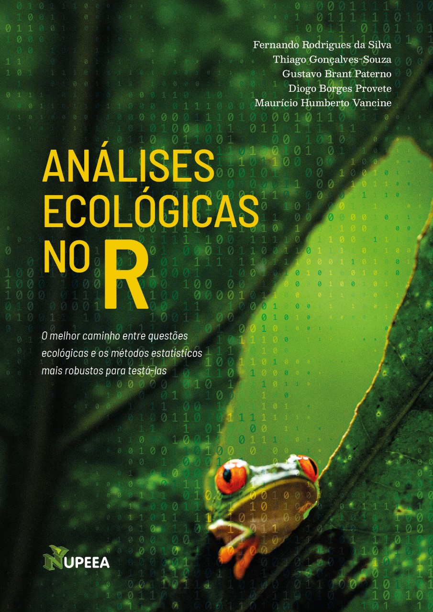

--- 
title: "Análises Ecológicas no R"
author: "Fernando Rodrigues da Silva, Thiago Gonçalves-Souza, Gustavo Brant Paterno, <br> Diogo Borges Provete, Maurício Humberto Vancine"
description: "Este livro oferece uma introdução compreensiva aos métodos estatísticos mais utilizados em Ecologia."
date: "`r Sys.Date()`"
cover-image: img/capa.jpeg
site: bookdown::bookdown_site
url: 'https://analises-ecologicas.netlify.app/'
bibliography: ["all_references.bib"]
biblio-style: "apalike"
link-citations: true
---

# Bem-vindos {.unnumbered}

[{.cover width="250"}](https://analises-ecologicas.netlify.app/) Essa é a página online do livro **Análises Ecológicas no R**. Este livro contém 15 capítulos que vão desde como baixar e instalar o R, passando por manipulação de dados, análises de diversidade, estatística básica, métodos multidimensionais e visualização de dados geoespaciais. Este é um material introdutório destinado principalmente a estudantes de graduação e cursos de pós-graduação em ecologia e áreas correlatas. Esperamos que ele seja utilizado tanto por quem quer se aprofundar em análises comumente utilizadas em ecologia, quanto por quem não tem nenhuma ou poucas habilidades quantitativas. Este livro é um dos poucos, senão único, material em português com essa abrangência e visa ser o principal manual de entrada para aprendizagem de R e suas aplicações em ecologia, conservação e ciências ambientais. Para isso, propomos uma estratégia que facilite a escolha do teste estatístico, por meio da seleção de questões/hipóteses claras e da ligação dessas hipóteses com a teoria e o método. Ainda, cada capítulo contém exercícios propostos, e suas soluções, recomendações de literatura e links especializados para cada capítulo do livro, e uma sessão sobre como utilizar o livro em grupos de discussão e sala de aula. 
 
A versão on-line está disponível **gratuitamente** e o código fonte necessário para reproduzir todo o conteúdo do livro está depositado no [Github](https://github.com/paternogbc/livro_aer). 

Este livro foi escrito em [Rmarkdown](https://rmarkdown.rstudio.com/) e compilado utilizando o pacote [bookdown](https://bookdown.org/). 

## Como contribuir {.unnumbered}

Caso encontre erros no livro ou tenha sugestões para melhorar seu conteúdo, abra um chamado no [repositório](https://github.com/paternogbc/livro_aer/issues/new) (é necessário que você se cadastre no[GitHub](https://github.com/)) e descreva o problema encontrado ou apresente suas sugestões. Caso encontre erros de digitação, você pode corrigi-los clicando em **"Edite esta página"** na barra lateral direita. Depois de corrigir os erros, submeta um *pull request* pelo Github. Sua contribuição é muito importante e bem-vinda para que possamos aprimorar o conteúdo do livro para as próximas edições

## Suporte ao projeto {.unnumbered}

Mesmo com a explosão de ferramentas de tradução automática, bem como livros, blogs e tutoriais, ainda temos a impressão de que este material é necessário e poderá impactar positivamente o ensino de estatística para discentes e  profissionais de ecologia e áreas correlatas. Por esse motivo, criamos um projeto para atualizar e ampliar o livro ao longo do tempo. A ideia mais interessante é que não pretendemos investir somente na produção do livro, mas também oferecer cursos em universidades e regiões com pouco ou nenhum investimento, criar podcasts e vídeos no YouTube, entre outras ideias.

É importante ressaltar que tudo isso é (e será!) feito de graça, em um projeto totalmente aberto e sem fins lucrativos. Além disso, para manter essa ideia funcionando, temos a necessidade de adquirir computadores e outros equipamentos. Assim, para que esse nosso sonho vire realidade, usuários(as) que têm interesse em ajudar o projeto podem fazê-lo de diferentes formas.

- Você pode recomendar o livro para outras pessoas e dizendo que essa iniciativa existe

- Você divulgar o livro e o projeto em suas redes sociais por meio da hashtag [`#ecologiaR`](https://twitter.com/hashtag/ecologiaR) para ajudar a dar visibilidade

- Se você é divulgador(a) científico(a) e pretende usar nosso livro em seu canal, fale brevemente do nosso projeto e indique para seus seguidores(as)

- Você pode citar ou linkar o livro em seus trabalhos acadêmicos

- Marcando com um estretla ('Starring') o repositório [GitHub livro_aer](https://github.com/paternogbc/livro_aer)

- Você pode adquirir o livro físico e, desse modo, ajudar com os direitos autorais que retornam para o projeto [Clube dos Autores]() e [Amazon]()

- Se você tem condições de "adotar" uma universidade, é possível adquirir o livro físico nas plataformas indicadas, comprar o livro e indicar a biblioteca onde o livro será entregue/depositado

- Você pode fazer doações diretas, em qualquer quantia, para o pix XXXXX.UUUUU ou via PayPal (para Maurício Humberto Vancine, um dos coautores)

```{r echo=FALSE, fig.align='center', out.width="20%"}
knitr::include_graphics("img/qr_code_doacao.png")
```

<form action="https://www.paypal.com/donate" method="post" target="_top" align="center" >
<input align="center"  type="hidden" name="hosted_button_id" value="WA462V932A4AQ" />
<input align="center" type="image" src="https://www.paypalobjects.com/pt_BR/BR/i/btn/btn_donateCC_LG.gif" border="0" name="submit" title="PayPal - The safer, easier way to pay online!" alt="Faça doações com o botão do PayPal" />

</form>

**Observação**: O valor arrecadado com a venda dos livros físicos e doações, bom como utilizaremos esses valores sempre serão informados no site do livro e nas mídias sociais com a hashtag [`#ecologiaR`](https://twitter.com/hashtag/ecologiaR).

## Licença {.unnumbered}

A versão online deste livro será sempre **gratuita** e distribuída sob a liceça [XXX]().

*** 

A página online do livro está hospedada pela plataforma [Netlify](https://www.netlify.com/).

<a href="https://www.netlify.com"></a>

\newpage

# Prefácio {-}

A evolução dos computadores pessoais e a ampliação do acesso a estes e à Internet têm transformado o jeito como aprendemos e ensinamos. Especificamente sobre a investigação da natureza através de métodos científicos, a maior oferta de ferramentas gratuitas para análise de dados e maior facilidade de acesso a dados talvez estejam entre as maiores transformações ocorridas nos últimos 20 anos. Hoje é relativamente comum, mesmo entre cientistas em formação, conversar sobre novos pacotes, códigos de programação, repositório de dados de acesso público e reprodutibilidade de análises. Para isso ter acontecido, além da evolução tecnológica, também foi preciso que muitas pessoas estivessem dispostas a ensinar como usar essas ferramentas. Este livro é uma dessas contribuições para o contínuo avanço do ensino de métodos computacionais, com um foco específico em análise de dados ecológicos através da linguagem R.

Além da abrangência dos tópicos abordados (desde teste T até análises geoespaciais, passando por diversidade filogenética), há outro aspecto marcante neste livro – e que o torna diferente em relação ao material comumente encontrado em sites, listas, blogs e manuais: a visão dos autores sobre como os códigos devem ser consequências das perguntas que a pesquisa pretende responder (veja detalhes no cap. 1). Essa visão tem como consequência um livro que do começo ao fim conecta teoria ecológica, métodos científicos, análises quantitativas e programação. Isso é feito de modo explícito através de exemplos claros e didáticos que apresentam contexto e dados reais, um ou mais exemplos de perguntas que poderiam ser feitas, predições relacionadas às perguntas e a teoria em questão, além das variáveis que poderiam ser utilizadas nas análises. O texto que descreve essas partes é intercalado com pedaços organizados e claros de código e gráficos, o que torna a leitura dos capítulos bastante fluida e dinâmica, principalmente para quem gosta de executar os códigos no seu computador conforme lê os capítulos. É como uma aula prática guiada. Um terceiro aspecto marcante do livro é que boa parte das análises também é explicada conceitualmente. Por exemplo, quando o teste T é introduzido, isso não é feito somente com códigos que permitem o cálculo da estatística. Há explicações sobre o funcionamento e premissas da análise. Isso nos estimula a tentarmos entender o que acontece por trás dos códigos.

Quando eu comecei a ensinar análise de dados ecológicos para discentes de graduação em Ecologia em 2012, na UNESP de Rio Claro, eu dizia para as turmas que nós tínhamos um grande privilégio: um livro texto específico para nossa área e em português – “Princípios de Estatística em Ecologia” (Gotelli e Ellison) e uma apostila de onde eu tirava algumas instruções e alguns exercícios em R também em português. A apostila, elaborada pelos pesquisadores Diogo B. Provete, Fernando R. da Silva e Thiago Gonçalves-Souza, era o embrião deste livro (veja detalhes sobre o histórico do livro no cap. 1) e um dos alunos para quem eu dizia sobre o privilégio era o Maurício Vancine. Portanto, é uma satisfação pessoal enorme escrever este prefácio, não só por conhecer quatro dos cinco autores e ter usado uma versão anterior do material, como também por considerar o livro uma das fontes mais abrangentes sobre análise de dados em R. Eu sugiro que você marque o link do livro como um favorito no seu navegador de Internet.

Apesar de os autores não terem separado os capítulos em partes, podemos considerar que há dois grupos de capítulos. No primeiro grupo – que inclui dos capítulos 1 ao 6, nós somos apresentados aos aspectos mais gerais da estrutura do livro, seus objetivos e sobre o funcionamento da linguagem R. Neste grupo, nós aprendemos desde como instalar o R e o RStudio (cap. 3), até como produzir gráficos bonitos e informativos (cap. 6). No segundo grupo de capítulos (do 7 ao 15), temos contato com análises específicas e atualmente usadas em ecologia, incluindo desde modelos lineares simples (cap. 7), até análise de dados geoespaciais complexos (cap. 15), passando por diferentes tipos de estratégia para descrever a biodiversidade (cap. 10-14).

Este tipo de estrutura permite que o livro possa ser usado como um curso completo ou como guia que consultamos quando esquecemos de como fazer algo. Por exemplo, eu sempre consulto o capítulo 5, principalmente quando vou usar a função map do pacote purrr. Ou seja, é possível ler quase todos os capítulos de modo independente, pois todos têm uma seção de pré-requisitos ou uma seção de introdução/contextualização em que os objetivos do capítulo são apresentados.

Entretanto, se você está começando a aprender R, sugiro que leia os capítulos conforme eles são apresentados, principalmente do capítulo 1 ao 6. Depois, você pode ir para os capítulos que mais te interessam. E já que o assunto é aprendizagem, no capítulo 1 os autores apresentam ideias criativas e úteis para quem tem interesse em ensinar e aprender com o livro. Gostei bastante das sugestões para grupos de pessoas que querem aprender de forma autônoma, por meio de grupos de estudo. O capítulo 2 apresenta uma maneira bastante interessante de se usar um dos métodos científicos mais usados – o método hipotético-dedutivo – com fluxogramas para: (a) identificar variáveis relevantes e como elas afetam umas às outras, (b) melhorar (quando necessário) o desenho amostral, (c) facilitar a escolha de análises estatísticas, e (d) melhorar a interpretação e comunicação dos dados e análises. Os capítulos 4 e 5 são essenciais para quem ainda não tem muita familiaridade com o uso do R ou para quem quer revisitar aspectos fundamentais do funcionamento da linguagem. O capítulo 4 inclui, por exemplo, explicações sobre console, script, operadores, objetos, funções, pacotes, ajuda e principais erros. O capítulo 5 apresenta uma das maiores inovações surgidas nos últimos anos na comunidade que trabalha com R, “uma filosofia de design, gramática e estruturas” agrupadas em conjuntos de pacotes sob nome guarda-chuva “tidyverse”. Podemos entender o tidyverse como um “dialeto novo” para a linguagem R, onde tidy quer dizer “organizado, arrumado, ordenado”, e verse é “universo” (cap. 5). Para quem não usa ou não se acostumou a usar o operador pipe %>% para o encadeamento de funções, o capítulo 5 é bastante útil, pois uma parte subsequente do livro usa essa abordagem. O capítulo 6 é uma consequência natural do capítulo 5, pois usa a lógica da gramática dos gráficos, que está fortemente ligada ao tidyverse, e a porta de entrada para os próximos capítulos mais específicos sobre análise de dados. Afinal, não fazemos (ou pelo menos não devemos fazer) nenhuma análise de dados sem antes explorá-los graficamente.

Para quem já tem pelo menos alguma familiaridade com a linguagem R, o segundo conjunto de capítulos (do 7 ao 15) pode ser acessado mais diretamente. Aqui também é possível pensar numa estrutura. Do capítulo 7 ao 9, o foco é em métodos estatísticos usados para explorar e estimar a associação entre variáveis. Enquanto o capítulo 7 e 8 são totalmente focados em modelos lineares univariados – em que a variável resposta é um único vetor numérico, o capítulo 9 trata de métodos em que a variável resposta ou variável de interesse é uma matriz – i.e., as chamadas técnicas multidimensionais ou multivariadas. Eu gostei de ler estes três capítulos na sequência em que são apresentados. É assim que eu ensino também – começamos com uma variável resposta e uma variável explanatória e vamos adicionando variáveis e tipos de variáveis, primeiro no lado direito da equação (a parte explanatória) e depois na parte esquerda da equação (a parte que está sendo modelada).

Do capítulo 10 ao 14, aprendemos como estimar as diferentes facetas da biodiversidade – taxonômica, funcional e filogenética, e os componentes alfa, beta e gama – e como podemos usar algumas dessas medidas para fazer inferências sobre processos de montagem de comunidades. O capítulo 13 sobre diversidade filogenética merece ser destacado; é um dos mais completos e abrangentes do livro. Apesar de não ser exatamente minha área de atuação, acho que boa parte dos métodos atualmente mais usados está contemplada ali. Em todos estes capítulos há explicações sobre aspectos teóricos que suportam o uso das técnicas em diferentes situações. Tudo é feito com dados que podem ser acessados. Portanto, se você ainda não coletou os dados do seu projeto, mas já sabe quais análises pretende usar, estes capítulos são uma fonte excelente para sua aprendizagem. Não precisa esperar até ter todos os dados em mãos.

Finalmente, o capítulo 15 fecha o livro nos apresentado uma introdução aos principais conceitos sobre a manipulação e visualização de dados geoespaciais no R. Ainda é comum para quem trabalha com ecologia e quer usar técnicas de análises de dados geoespaciais como algo complementar convidar especialistas da área para uma parceria. O Maurício Vancine já não deve nem conseguir atender todos os pedidos de parceria. Aqui está então uma boa oportunidade para você aprender a dar os primeiros passos, produzir os primeiros mapas, fazer predições espaciais sem ter de depender da ajuda de pessoal especializado. Mas mais importante que isso, o capítulo fornece a base conceitual e terminologia apropriada para o bom uso deste tipo de análise – eu sempre me confundo com a terminologia associada ao sistema de referência de coordenadas e unidades.

Há quem diga que a velocidade com que a tecnologia e a ciência avançam tende a tornar livros e manuais sobre métodos rapidamente obsoletos. Não acho que isso vai acontecer com o livro “Análises Ecológicas no R”. Os métodos apresentados são bem estabelecidos e (alguns) aceitos pela comunidade científica há muitos anos e incluem técnicas modernas que ainda estão sendo entendidas e absorvidas por profissionais que atuam em ecologia. Que privilégio ter um livro como este em português e gratuito! Obrigado aos autores por isso. Boa leitura e prática.

Tadeu Siqueira  
Instituto de Biociências  
Universidade Estadual Paulista - UNESP

\newpage
