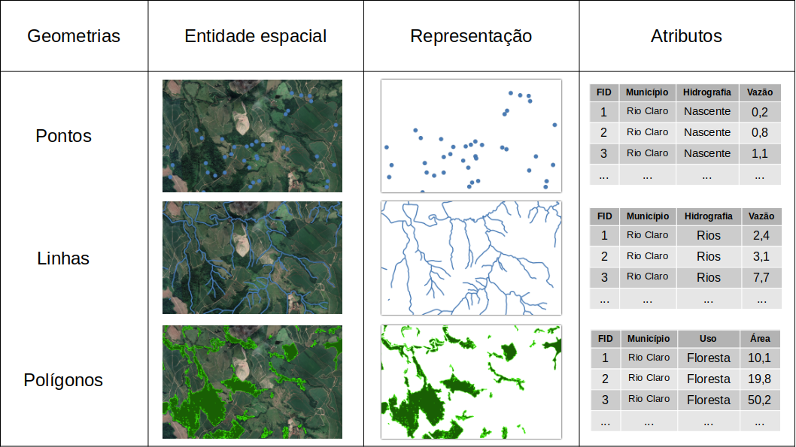

--- 
title: "Análises Ecológicas no R"
author: ""
date: "`r Sys.Date()`"
site: bookdown::bookdown_site
bibliography: ["all_references.bib"]
biblio-style: "apalike"
link-citations: true
---
```{r include=FALSE, cache=FALSE}
set.seed(1014)

knitr::opts_chunk$set(
  bookdown.clean_book = TRUE,
  tinytex.verbose = TRUE,
  echo = TRUE,
  message = FALSE,
  warning = FALSE,
  comment = "#>",
  collapse = TRUE,
  cache = FALSE,
  out.width = "100%",
  out.height = "100%",
  fig.align = 'center',
  #fig.width = 6,
  #fig.asp = 0.618,  # 1 / phi
  fig.show = "hold",
  tidy=FALSE,
  tidy.opts=list(width.cutoff=80)
)
```


# Capa {-}

\newpage

# Prefácio {-}

\newpage

<!--chapter:end:index.Rmd-->

```{r include=FALSE, cache=FALSE}
set.seed(1014)

knitr::opts_chunk$set(
  bookdown.clean_book = TRUE,
  tinytex.verbose = TRUE,
  echo = TRUE,
  message = FALSE,
  warning = FALSE,
  comment = "#>",
  collapse = TRUE,
  cache = FALSE,
  out.width = "100%",
  out.height = "100%",
  fig.align = 'center',
  #fig.width = 6,
  #fig.asp = 0.618,  # 1 / phi
  fig.show = "hold",
  tidy=FALSE,
  tidy.opts=list(width.cutoff=80)
)
```
# Sobre os autores {-}

**Fernando Rodrigues da Silva**

Piadista descomedido de Barueri/SP, pai da Ária, companheiro da Winter, responsável pela Filomena (gata), Zé (gato), Cenoura (cachorra) e Chica (cachorra), admirador de botecos, viagens, mato, cerveja, poker, basquete e prosa com os amigos. Formado em Ciências Biológicas na UNESP-Assis e com mestrado e doutorado em Biologia Animal pela UNESP-São José do Rio Preto. Realizou doutorado sanduíche na SUNY – College of Environmental Science and Forest. Atualmente é Professor Associado II no Departamento de Ciências Ambientais, UFSCAR-Sorocaba e trabalha na linha de pesquisa de ecologia de comunidades, metacomunidades, macroecologia, biogeografia e história natural de anfíbios. 

Site: http://fernandoecologia.wix.com/fernandorodrigues

**Thiago Gonçalves-Souza**

Capixaba de Cachoeiro do Itapemirim/ES, pai do Lucas, companheiro da Natália, praticante de Muay Thai, Boxe e da arte de provar cervejas. Formado em Ciências Biológicas na Escola Superior São Francisco de Assis/ES e com mestrado e doutorado em Biologia Animal pela UNESP-São José do Rio Preto. Realizou doutorado sanduíche na University of Guelph (Canadá) e pós-doutorado na UNICAMP. Atualmente é Professor Adjunto III no Departamento de Biologia da Universidade Federal Rural de Pernambuco, trabalhando nas linhas de pesquisa de ecologia de comunidades, ecologia funcional, macroecologia e metacomunidades.

Site: https://thiagocalvesouza.wixsite.com/ecofun

**Gustavo Brant Paterno**

Compositor de cantigas e violeiro, nascido em Ribeirão Preto/SP, pai do Rudá e da Maria Flor, e apaixonado por Mila. Admira profundamente a incrível diversidade da vida na Terra. Gosta de trilha, música, skate, surf, fotografia de estrelas e programação. É Ecólogo com muito orgulho pela formação na UFRN/Natal, com mestrado e doutorado em Ecologia pela mesma universidade. Realizou sanduíche na Macquarie University (Austrália). Possui grande interesse em Ciência aberta e software livre e é embaixador do projeto Open Science Framework (OSF). Atualmente é pesquisador de pós-doutorado na Faculty of Forest Sciences and Forest Ecology da Universidade de Gottingen (Alemanha). Atua na interface entre ecologia evolutiva, biodiversidade-funcionamento de ecossistemas e ecologia da restauração.

Site: https://gustavopaterno.netlify.app/

**Diogo Borges Provete**

Capixaba da gema, nascido em Bom Jesus do Norte/ES (na verdade registrado nessa cidade e nascido em Bom Jesus do Itabapoana/RJ do outro lado da ponte, porque no ES não tinha hospital :D ), pai orgulhoso da Manuela e esposo apaixonado da Lilian. Apreciador das boas Ale Belgas e Inglesas e vinhos Chilenos e Brasileiros. Já fui nadador, jogador de futebol, mas nunca batedor de carteira. Dizem que gosto de livros e HQs. Graduado em Ciências Biológicas na Universidade Federal de Alfenas-MG, com mestrado em Biologia Animal na UNESP-São José do Rio Preto e Doutorado em Ecologia e Evolução na Universidade Federal de Goiás. Atualmente é Professor Adjunto I na Universidade Federal de Mato Grosso do Sul. Meu programa de pesquisa tenta integrar evolução fenotípica e processos micro- e macroevolutivos para entender padrões de distribuição de espécies em escala de metacomunidades, especialmente em ambientes de água doce.

Site: http://diogoprovete.weebly.com

**Maurício Humberto Vancine**

Caipira do interior de Socorro/SP, pai do Dudu, companheiro da Japa, amante de softwares livres, GNU/Linux, música, livros, games, uma boa cerveja, além de um dedo de cachaça e uma boa prosa. Mais recentemente tenta não levar muitos tombos ao aprender a andar de skate depois dos 30. Graduado em Ecologia e com mestrado em Zoologia, ambos pela UNESP-Rio Claro. Atualmente é Doutorando no PPG de Ecologia, Evolução e Biodiversidade da UNESP-Rio Claro e trabalha na linha de pesquisa de Ecologia Espacial, Ecologia da Paisagem, Modelagem Ecológica e Ecologia de Anfíbios.

Site: https://mauriciovancine.github.io/

<!--chapter:end:00_autores.Rmd-->

```{r include=FALSE, cache=FALSE}
set.seed(1014)

knitr::opts_chunk$set(
  bookdown.clean_book = TRUE,
  tinytex.verbose = TRUE,
  echo = TRUE,
  message = FALSE,
  warning = FALSE,
  comment = "#>",
  collapse = TRUE,
  cache = FALSE,
  out.width = "100%",
  out.height = "100%",
  fig.align = 'center',
  #fig.width = 6,
  #fig.asp = 0.618,  # 1 / phi
  fig.show = "hold",
  tidy=FALSE,
  tidy.opts=list(width.cutoff=80)
)
```
# Revisores e colaboradores {-}

Expressamos nossos sinceros agradecimentos aos pesquisadores, alunos e colegas indicados abaixo, pelo imprescindível trabalho de avaliação, revisão e crítica do conteúdo deste livro.

- **André Padial** - Setor de Ciências Biológicas, Universidade Federal do Paraná, Curitiba, Paraná

- **Adriano Sanches Melo** - Instituto de Biociências, Universidade Federal do Rio Grande do Sul (UFRGS), campus do Vale, Porto Alegre, Rio Grande do Sul

- **Beatriz Milz** - Programa de Pós-Graduação em Ciência Ambiental, Instituto de Energia e Ambiente, Universidade de São Paulo (PROCAM/IEE/USP), São Paulo, São Paulo

- **Felipe Sodré Mendes Barros** - Departamento de Geografia, Instituto Superior Antonio Ruiz de Montoya, Instituto Misionero de Biodiversidad - IMiBio, Ambiental Analytics, Misiones, Argentina

- **Ingrid da Silva Lima** -  Programa de Etnobiologia e Conservação da Natureza (PPGEtno), Universidade Federal Rural de Pernambuco (UFRPE), Recife, Pernambuco

- **Maurício Cetra** - Departamento de Ciências Ambientais, Universidade Federal de São Carlos (UFSCar), campus Sorocaba, São Paulo

- **Marcos Rafael Severgnini** - Programa de Pós Graduação em Ecologia e Conservação, Universidade Federal de Mato Grosso do Sul, Campo Grande, Mato Grosso do Sul

- **Marcos Robalinho Lima** - Departamento de Biologia Animal e Plantas, Universidade Estadual de Londrina, Londrina, Paraná

- **Michel Varajão Garey** - Instituto Latino Americano de Ciências da Vida e da Natureza (ILACVN), Universidade Federal da Integração Latino-Americana (UNILA), Foz do Iguaçu, Paraná

- **Paulo Mateus Martins Sobrinho** - Programa de Etnobiologia e Conservação da Natureza (PPGEtno), Universidade Federal Rural de Pernambuco (UFRPE), Recife, Pernambuco

- **Paulo Sérgio Monteiro Ferreira** - Secretaria do Estado da Educação da Paraíba, Paraíba

- **Pedro Henrique Albuquerque Sena** - Centro de Pesquisas Ambientais do Nordeste (Cepan), Recife, Pernambuco

- **Reginaldo Augusto Farias de Gusmão** - Programa de Etnobiologia e Conservação da Natureza (PPGEtno), Universidade Federal Rural de Pernambuco (UFRPE), Recife, Pernambuco

- **Victor Satoru Saito** - Departamento de Ciências Ambientais, Universidade Federal de São Carlos (UFSCar), campus São Carlos, São Paulo

<!--chapter:end:00_agradecimentos_revisores.Rmd-->

```{r include=FALSE, cache=FALSE}
set.seed(1014)

knitr::opts_chunk$set(
  bookdown.clean_book = TRUE,
  tinytex.verbose = TRUE,
  echo = TRUE,
  message = FALSE,
  warning = FALSE,
  comment = "#>",
  collapse = TRUE,
  cache = FALSE,
  out.width = "100%",
  out.height = "100%",
  fig.align = 'center',
  #fig.width = 6,
  #fig.asp = 0.618,  # 1 / phi
  fig.show = "hold",
  tidy=FALSE,
  tidy.opts=list(width.cutoff=80)
)
```
# Introdução {#cap1}

## Histórico deste livro

Este livro foi estruturado a partir da apostila elaborada pelos pesquisadores Diogo B. Provete, Fernando R. da Silva e Thiago Gonçalves-Souza para ministrar o curso *Estatística aplicada à ecologia usando o R* no PPG em Biologia Animal da UNESP de São José Rio Preto/SP, em abril de 2011. Os três pesquisadores eram então alunos do PPG em Biologia Animal quando elaboraram o material disponibilizado na apostila [Estatística aplicada à ecologia usando o R](https://cran.r-project.org/doc/contrib/Provete-Estatistica_aplicada.pdf). A proposta de transformar a apostila em livro sempre foi um tópico recorrente desde 2011, e concretizado agora, um pouco mais de 10 anos depois.

Neste período, Diogo, Fernando e Thiago foram contratados pela Universidade Federal de Mato Grosso do Sul, Universidade Federal de São Carlos campus Sorocaba, e Universidade Federal Rural de Pernambuco, respectivamente. Nestes anos eles ofertaram diferentes versões do curso *Estatística aplicada à ecologia usando o R* para alunos de graduação e pós-graduação em diferentes instituições do Brasil. A possibilidade da oferta destes novos cursos fortaleceu a ideia de trasformar a apostila em um livro com base nas experiências dos pesquisadores em sala de aula.

Considerando que novas abordagens ecológicas vêm sendo descritas e criadas a uma taxa elevada nos últimos anos, era de se esperar que as informações disponíveis na apostila estivessem defasadas após uma década. Por este motivo, Diogo, Fernando e Thiago convidaram outros dois pesquisadores, Gustavo B. Paterno da Georg-August-University of Göttingen e Maurício H. Vancine do PPG em Ecologia, Evolução e Biodiversidade da UNESP de Rio Claro/SP, que são referências no uso de estatística em ecologia usando o R. Com o time completo, passaram mais de um ano realizando reuniões, compartilhando scripts e pagando cerveja para os coautores por capítulos atrasados até chegarem nesta primeira versão do livro.

## Objetivo deste livro

Nossa proposta com este livro é traçar o melhor caminho, pelo menos do nosso ponto de vista, entre questões ecológicas e os métodos estatísticos mais robustos para testá-las. Guiar seus passos nesse caminho (nem sempre linear) necessita que você utilize um requisito básico: o de se esforçar para caminhar. O nosso esforço, em contrapartida, será o de indicar as melhores direções para que você adquira certa independência em análises ecológicas. Um dos nossos objetivos é mostrar que o conhecimento de teorias ecológicas e a formulação de questões apropriadas são o primeiro passo na caminhada rumo à compreensão da lógica estatística. Não deixe que a estatística se torne a "pedra no seu caminho". Em nossa opinião, programas com ambiente de programação favorecem o entendimento da lógica estatística, uma vez que cada passo (lembre-se de que você está caminhando em uma estrada desconhecida e cheia de pedras) precisa ser coordenado, ou seja, as linhas de código (detalhes abaixo) precisam ser compreendidas para que você teste suas hipóteses. No entanto, tome cuidado ao copiar deliberadamente scripts sem entender cada um dos passos da análise ou gráfico realizado.

A primeira parte deste livro pretende utilizar uma estratégia que facilita a escolha do teste estatístico apropriado, por meio da seleção de questões/hipóteses claras e da ligação dessas hipóteses com a teoria e o método (veja Figura \@ref(fig:fig-statistical-thinking) no Capítulo \@ref(cap2)). Enfatizamos que é fundamental ter em mente aonde se quer chegar, para poder escolher o que deve ser feito. Posteriormente à escolha de suas questões, é necessário transferir o contexto ecológico para um contexto meramente estatístico (hipótese nula/alternativa). A partir da definição de uma hipótese nula, partiremos para a aplicação de cada teste estatístico (de modelos lineares generalizados à análises multivariadas) utilizando a linguagem R.

Antes de detalhar cada análise estatística, apresentaremos o funcionamento básico da utilização da linguagem R e os tipos de distribuição estatística que são essenciais para a compreensão dos testes estatísticos. Para isso, organizamos um esquema que chamamos de "estrutura lógica" que facilita a compreensão dos passos necessários para testar suas hipóteses (veja Figura \@ref(fig:fig-statistical-thinking) no Capítulo \@ref(cap2)) [@albuquerque_going_2019].

## O que você não encontrará neste livro

Aprofundamento teórico, detalhes matemáticos e explicação dos algoritmos são informações que infelizmente não serão abordadas neste livro. O foco aqui é a explicação de como cada teste funciona (teoria e procedimentos matemáticos básicos) e sua aplicação em testes ecológicos usando scripts na linguagem R. Recomendamos a leitura de livro *Analysing Ecological Data* [@zuur_analysing_2007] para conceitos detalhados em análises univariadas e o livro *Numerical Ecology* [@legendre_numerical_2012] é uma leitura que permite o aprofundamento de cada uma das análises multivariadas propostas aqui. Além disso, são de fundamental importância para o amadurecimento em análises ecológicas as seguintes leituras: @manly_randomization_1991, @pinheiro_mixed-effects_2000, @scheiner_design_2001, @burnham_pvalues_2014, @quinn_experimental_2002, @venables_modern_2002, @magurran_biological_2011, @gotelli_primer_2012, @zar_biostatistical_2010, @zuur_protocol_2009, @crawley_r_2012, @james_introduction_2013, @fox_ecological_2015, @thioulouse_multivariate_2018 e @touchon_applied_2021.

## Por que usar o R?

Os criadores do R o chamam de uma linguagem e ambiente de programação estatística e gráfica [@venables_modern_2002]. A linguagem R também é chamada de programação "orientada ao objeto" (*object oriented programming*), o que significa que utilizar o R envolve basicamente a criação e manipulação de objetos em um terminal, em que o usuário tem de dizer exatamente o que deseja que o programa execute, ao invés de simplesmente clicar em botões. E vem daí uma das grandes vantagens em se usar o R: o usuário tem total controle sobre o que está acontecendo e também tem de compreender o que deseja antes de executar uma análise. Além disso, o R permite integração com outros programas escritos em Fortran, C++, Python e Java, permitindo que os usuários possam aplicar novas metodologias sem ter que aprender novas linguagens.

Na página pessoal do Prof. Nicolas J. Gotelli ([link](http://www.uvm.edu/~ngotelli/GradAdvice.html)) existem vários conselhos para um estudante iniciante de ecologia. Dentre esses conselhos, o Prof. Gotelli menciona que o domínio de uma linguagem de programação é uma das habilidades mais importantes, porque dá liberdade ao ecólogo para executar tarefas que vão além daquelas disponíveis em pacotes estatísticos comerciais. Além disso, a maioria das novas análises propostas nos mais reconhecidos periódicos em ecologia normalmente são implementadas na linguagem R, e os autores geralmente incluem o código fonte no material suplementar dos artigos, tornando a análise acessível e reprodutível. A partir do momento que essas análises ficam disponíveis (seja por código fornecido pelo autor ou por implementação em pacotes pré-existentes), é mais simples entendermos a lógica de análises complexas, especialmente as multivariadas, utilizando nossos próprios dados, realizando-as passo a passo. Sem a utilização do R, normalmente temos que contatar os autores que nem sempre são tão acessíveis.

Especificamente em Ecologia, o uso da linguagem R para análise de dados cresceu enormemente nas duas últimas décadas. Em um artigo de revisão, Lai et al. [-@lai_evaluating_2019] analisaram mais de 60.000 artigos revisados por pares publicados em 30 periódicos de Ecologia durante um período de 10 anos. O número de estudos usando R aumentou linearmente de 11,4% em 2008 para 58,0% em 2017, e os 10 principais pacotes utilizados e ordenados por maior frequência de uso foram: `lme4`, `vegan`, `nlme`, `ape`, `MuMIn`, `MASS`, `mgcv`, `ade4`, `multcomp` e `car`. Os autores afirmam que a crescente popularidade do R promoveu a ciência aberta na pesquisa ecológica,  melhorando a reprodutibilidade das análises e o fluxo de trabalho, principalmente quando scripts e códigos foram incluídos e compartilhados nos artigos. Eles finalizam dizendo que a partir dos resultados encontrados, a linguagem R é um componente significativo das análises no campo da Ecologia.

Uma última vantagem é que por ser um software livre, a citação do R em artigos é permitida e até aconselhável. Para saber como citar o R, digite `citation()` na linha de comando. Para citar um pacote específico, digite `citation()` com o nome do pacote entre aspas dentro dos parênteses. Mais detalhes sobre citações podem ser vistos no Capítulo \@ref(cap4). Neste ponto, esperamos ter convencido você leitor(a), de que aprender a utilizar o R tem inúmeras vantagens. Entretanto, provavelmente vai ser difícil no começo, mas continue e perceberá que o investimento vai valer à pena no futuro.

## Indo além da linguagem de progração para a Ecologia

Um ponto em comum em que todos os autores deste livro concordaram em conversas durante sua estruturação, foi a dificuldade que todos tivemos quando estávamos aprendendo a linguagem:

1.  Como transcrever os objetivos (manipulação de dados, análises e gráficos) em linguagem R
2.  Como interpretar os resultados das análises estatísticas do R para os objetivos ecológicos

Num primeiro momento, quando estamos aprendendo a linguagem R é muito desafiador pensar em como estruturar nossos códigos para que eles façam o que precisamos: importar dados, selecionar linhas ou colunas, qual pacote ou função usar para uma certa análise ou como fazer um gráfico que nas nossas anotações são simples, mas no código parece impossível. Bem, não há um caminho fácil nesse sentido e ele depende muito da experiência e familiaridade adquirida com o tempo de uso da linguagem, assim como outra língua qualquer, como inglês ou espanhol. Entretanto, uma dica pode ajudar: estruture seus códigos antes de partir para o R. Por exemplo, escreva um papel os pontos que deseja executar em seus códigos, como se estivesse explicando para alguém os passos que precisa para realizar as tarefas. Depois disso, transcreva para o script (arquivo onde os códigos são escritos, mas não se preocupe, iremos explicar esse conceito no Capítulo \@ref(cap4)) esses pontos em formato de texto. Por fim, traduza isso em linguagem R. Pode parecer massante e cansativo no começo, mas isso o ajudará a ter maior domínio da linguagem, sendo que esse passo se tornará desnecessário quando se adquire bastante experiência.

Uma vez que esta barreira inicial foi transposta e você conseguiu obter os primeiros resultados de suas análises com valores de estatísticas, parâmetros estimados, valores de p e R², gráficos, e etc., como interpretamos à luz da teoria ecológica? Esse ponto é talvez um dos mais complicados. Com o tempo, ter um valor final de uma estatística ou gráfico à partir da linaguagem R é relativamente simples, mas o que esse valor ou gráfico significam para nossa hipótese ecológica é o ponto mais complexo. Essa dificuldade por ser por inexperiência teórica (ainda não lemos muito sobre um aspecto ecológico) ou inexperiência científica (ainda temos dificuldade para expandir nossos argumentos de forma indutiva). Destacamos esse ponto porque ele é fundamental no processo científico e talvez seja o principal aspecto que diferencia os cientistas de outros profissionais: sua capacidade de entendimento dos padrões à partir dos processos e mecanismos atrelados. Nesse ponto, quase sempre recorremos aos nossos orientadores ou colegas mais experientes para nos ajudar, mas é natural e faz parte do processo de aprendizado de uso da linguagem R junto à Ecologia como Ciência. Entretanto, contrapomos a importância dessa extrapolação para não nos tornarmos apenas especialistas em linguagem R sem a fundamental capacidade de entendimento do sistema ecológico que estamos estudando.

## Como usar este livro

Os conteúdos apresentados em cada capítulo são independentes entre si. Portanto, você pode utilizar este livro de duas formas. A primeira é seguir uma ordem sequencial (capítulos 1, 2, 3, ...) que recomendamos, principalmente, para as pessoas que não possuem familiaridade com a linguagem R. A segunda forma, é selecionar o capítulo que contém a análise de seu interesse e mudar de um capítulo para outro sem seguir a sequência apresentada no livro.

Com exceção dos capítulos 2, 3, 4, 5, 6 e 15, os outros capítulos foram elaborados seguindo a mesma estrutura, contendo uma descrição da análise estatística (aspectos teóricos) e exemplos relacionados com questões ecólogicas que podem ser respondidas por esta análise. Todos os exemplos são compostos por: i) uma descrição dos dados utilizados, ii) pergunta e predição do trabalho, iii) descrição das variáveis resposta(s) e preditora(s), e iv) descrição e explicação das linhas de código do R necessárias para realização das análises. A maioria dos exemplos utilizados são baseados em dados reais que já foram publicados em artigos científicos ou são dados coletados por um dos autores deste livro. Nós recomendamos que primeiro você utilize estes exemplos para se familiarizar com as análises e a formatação das linhas e colunas das planilhas. Em seguida, utilize seus próprios dados para realizar as análises. Esta é a melhor maneira de se familiarizar com as linhas de código do R.

Muitas das métricas ou índices apresentados neste livro não foram traduzidas para o português, porque seus acrônimos são clássicos e bem estabelecidos na literatura ecológica. Nestes casos, consideramos que a tradução poderia confundir as pessoas que estão começando a se familiarizar com a literatura específica. Realçamos que não estamos abordando todas as possibilidades disponíveis, e existem muito outros pacotes e funções no R que realizam as mesmas análises. Contudo, esperamos que o conteúdo apresentado permita que os leitores(as) adquiram independência e segurança para que possam caminhar sozinhos(as) na exploração de novos pacotes e funções para responderem suas perguntas biológicas e ecológicas.

## Como ensinar e aprender com esse livro

Uma forma bastante interessante de aprender ou aprofundar seu conhecimento sobre um tema é a partir de grupos de estudo. Aproveitando as dinâmicas de estudos que os próprios autores fizeram em seus laboratórios (seja como discente ou professor), sugerimos abaixo alguns formatos que podem ser usados por um grupo de discentes (sem a presença de um orientador) ou pelo laboratório. É importante ressaltar que esses formatos não são os únicos que podem ser testados. O leitor pode juntar ideias de diferentes propostas ou mesmo usar parte das propostas e inserir suas próprias ideias, tendo como base as características do grupo que irá se reunir. 

### Em laboratórios ou grupos de pesquisa

**Líder aleatório**

Cada capítulo é sorteado para um integrante do grupo que ficará responsável por estudar, apresentar e enviar outros materiais que julgar necessário. Neste formato, existem duas possibilidades interessantes. A primeira é de um grupo de estudantes que é iniciante em determinado tema (e.g., análise multivariada) e, desse modo, todos integrantes serão estimulados a participarem do processo de ensino e de aprendizagem. O segundo ponto interessante é para grupos heterogêneos onde pessoas diferentes possuem domínio de diferentes ferramentas. Neste caso, é importante que mesmo que determinado integrante seja especialista na análise X, ele poderá aleatoriamente ter que aprender e ensinar a análise Y. Como resultado, espera-se que os grupos de estudo neste formato tenham ampla discussão, uma vez que integrantes com baixo, médio ou alto conhecimento em determinada análise serão tanto professores como aprendizes.  

**Líder especialista I (discentes como líderes)**

Cada capítulo é liderado pelo “maior especialista” naquele determinado assunto, que ficará responsável por organizar toda dinâmica do grupo. O ideal é que especialistas distintos liderem a discussão de diferentes capítulos, para que todos os membros do grupo sejam líderes em no mínimo um capítulo. 

**Líder especialista II (orientador ou pós-doc)**

O orientador (ou pós-doc ou ambos) selecionam os capítulos sobre o assunto de interesse (ou todos os capítulos do livro) e se reúne regularmente para discussão com discentes. Além da leitura dos capítulos, o líder pode enviar atividades extras ou desafios para estimular que os discentes leiam o conteúdo e também executem comandos no R. Por exemplo, em cada capítulo, o desafio pode ser criar hipóteses sobre um tema de estudo, gerar dados fictícios (ou usar dados reais disponíveis) e analisar os dados com determinado teste estatístico no R. 
Líder especialista I ou II integrando com teoria (específico para capítulos 8 a 15):
Esta proposta expande o Líder especialista I uma vez que não estará focada somente na análise estatística apresentada no livro. Além de inserir este componente analítico, o líder irá apresentar o arcabouço teórico ecológico que é geralmente usado em estudos que utilizaram determinada análise. Por exemplo, o capítulo que apresenta regressão linear seria combinado com a teoria de biogeografia de ilhas para entender a relação espécies-área. Desse modo, não seria apresentado somente as especificidades da regressão linear, mas também a teoria de biogeografia de ilhas.

### Em disciplinas da graduação ou pós-graduação

**Atividade em grupo em sala invertida**

O professor pode sortear diferentes grupos que ficarão responsáveis por cada capítulo do livro (a depender do conteúdo da disciplina). Cada componente do grupo pode ficar responsável por diferentes partes do capítulo. Por exemplo, se a disciplina for de gráficos, um discente pode discutir a estrutura das funções do pacote ggplot2, outro discente pode apresentar a conexão entre tipos de variáveis e gráficos, enquanto um terceiro discente se responsabiliza por executar os comandos dos gráficos no R. As atividades devem ser realizadas e apresentadas antes da aula teórica/prática sobre aquela temática, e o docente ficará responsável por mediar as apresentações e discussões.   

**Sala convencional**

O professor pode usar o livro como material didático seguindo o conteúdo de acordo com a disciplina em questão, seja ela da linguagem R, de análises univariadas, multivariadas ou espaciais. Além disso, o professor pode fornecer dados para os discentes (ou estimular que discentes usem os próprios dados) e replicar gráficos e análises usando os scripts fornecidos no livro.

<!--chapter:end:01_introducao.Rmd-->

```{r include=FALSE, cache=FALSE}
set.seed(1014)

knitr::opts_chunk$set(
  bookdown.clean_book = TRUE,
  tinytex.verbose = TRUE,
  echo = TRUE,
  message = FALSE,
  warning = FALSE,
  comment = "#>",
  collapse = TRUE,
  cache = FALSE,
  out.width = "100%",
  out.height = "100%",
  fig.align = 'center',
  #fig.width = 6,
  #fig.asp = 0.618,  # 1 / phi
  fig.show = "hold",
  tidy=FALSE,
  tidy.opts=list(width.cutoff=80)
)
```
# Voltando ao básico: como dominar a arte de fazer perguntas cientificamente relevantes {#cap2}

*Capítulo originalmente publicado por Gonçalves-Souza, Provete, Garey, da Silva & Albuquerque [-@albuquerque_going_2019], in Methods and Techniques in Ethnobiology and Ethnoecology (publicação autorizada por Springer, licença 5230220198680).*

## Introdução

> *Aquele que ama a prática sem teoria é como um marinheiro que embarca em um barco sem um leme e uma bússola e nunca sabe onde pode atracar - Leonardo da Vinci.*

Qual é a sua pergunta? Talvez esta seja a frase que pesquisadores mais jovens ouvem quando começam suas atividades científicas. Apesar de aparentemente simples, responder a esta pergunta se torna um dos maiores desafios da formação científica. Seja na pesquisa quantitativa ou qualitativa, todo processo de busca de conhecimento parte de uma questão/problema formulada pelo pesquisador no início desse processo. Esta questão guiará o pesquisador em todas as etapas da pesquisa. No caso específico de pesquisa quantitativa, a questão é a porta de entrada de uma das formas mais poderosas de pensar cientificamente: o método hipotético-dedutivo (MHD) definido por Karl Popper [-@popper_logic_1959]. Este capítulo propõe uma maneira de pensar sobre hipóteses (geradas dentro do MHD) para melhorar o pensamento estatístico usando um fluxograma que relaciona variáveis por ligações causais. Além disso, argumentamos que você pode facilmente usar fluxogramas para: i) identificar variáveis relevantes e como elas afetam umas às outras; ii) melhorar (quando necessário) o desenho experimental/observacional; iii) facilitar a escolha de análises estatísticas; e iv) melhorar a interpretação e comunicação dos dados e análises.

## Perguntas devem preceder as análises estatísticas

### Um bestiário[^perguntas_ecologia-1] para o teste de hipóteses (Você está fazendo a pergunta certa?)

[^perguntas_ecologia-1]: O bestiário é uma literatura do Século XII que descrevia animais (reais ou imaginários) com uma visão divertida e fantasiosa. Parte da interpretação continha lições de moral dos monges católicos que escreviam e ilustravam os bestiários. Longe de ser uma lição de moral ou mesmo uma descrição fantasiosa, usamos o termo bestiário neste livro para expressar o que há de mais importante e fantástico (na visão dos autores) para fazer um bom teste de hipóteses.

A maioria dos alunos e professores de ciências biológicas possuem aversão à palavra "estatística". Não surpreendentemente, enquanto a maioria das disciplinas acadêmicas que compõem o "STEM" (termo em inglês para aglomerar *Ciência, Tecnologia, Engenharia e Matemática*) têm uma sólida formação estatística durante a graduação, cursos de ciências biológicas têm um currículo fraco ao integrar o pensamento estatístico dentro de um contexto biológico [@metz_teaching_2008]. Esses cursos têm sido frequentemente ministrados sem qualquer abordagem prática para integrar os alunos em uma plataforma de solução de problemas [@horgan_teaching_1999]. Infelizmente, a Etnobiologia, Ecologia e Conservação (daqui em diante EEC) não são exceções. Talvez mais importante, uma grande preocupação durante o treinamento estatístico de estudantes de EEC é a necessidade de trabalhar com problemas complexos e multidimensionais que exigem soluções analíticas ainda mais complicadas para um público sem experiência em estatística e matemática. Por este motivo, muitos pesquisadores consideram a estatística como a parte mais problemática de sua pesquisa científica. Argumentamos neste capítulo que a dificuldade de usar estatística em EEC está associada à ausência de uma plataforma de solução de problemas gerando hipóteses claras que são derivadas de uma teoria. No entanto, concordamos que há um grande desafio em algumas disciplinas como a Etnobiologia para integrar esta abordagem direcionada por hipóteses, uma vez que foi introduzida apenas recentemente [veja @phillips_useful_1993; @albuquerque_five_2009]. Devido à falta de uma plataforma de solução de problemas, frequentemente percebemos que alunos/pesquisadores na EEC geralmente têm dificuldades de responder perguntas básicas para uma pesquisa científica, tais como:

1.  Qual é a principal teoria ou raciocínio lógico do seu estudo?
2.  Qual é a questão principal do seu estudo?
3.  Qual é a sua hipótese? Quais são suas predições?
4.  Qual é a unidade amostral, variável independente e dependente do seu trabalho? Existe alguma covariável?
5.  Qual é o grupo controle?

Como selecionar qualquer teste estatístico sem responder a essas cinco perguntas? A estrutura estatística frequentista fornece uma maneira de ir progressivamente suportando ou falseando uma hipótese [@neyman__problem_1933; @popper_logic_1959]. A decisão de rejeitar uma hipótese nula é feita usando um valor de probabilidade (geralmente P \< 0,05) calculado pela comparação de eventos observados com observações repetidas obtidas a partir de uma distribuição nula.

Agora, vamos ensinar através de um exemplo e apresentar um "guia para o pensamento estatístico" que conecta alguns elementos essenciais para executar qualquer análise multivariada (ou univariada) (Fig. \@ref(fig:fig-statistical-thinking). Primeiro, imagine que você observou os seguintes fenômenos na natureza: i) "indivíduos de uma população tradicional selecionar algumas plantas para fins médicos" e ii) "manchas monodominantes da árvore *Prosopis juliflora*, uma espécie invasora em várias regiões". Do lado da etnobiologia, para entender como e porque o conhecimento tradicional é construído, existe uma teoria ou hipótese (por exemplo, hipótese de aparência: @goncalves_most_2016) explicando os principais processos que ditam a seleção da planta (Fig. \@ref(fig:fig-statistical-thinking)a). Então, você pode fazer uma ou mais perguntas relacionadas àquele fenômeno observado (Fig. \@ref(fig:fig-statistical-thinking)b). Por exemplo, como a urbanização afeta o conhecimento das pessoas sobre o uso de plantas medicinais em diferentes biomas? Do lado ecológico/conservação, para entender por que espécies introduzidas afetam as espécies nativas locais, você precisa entender as teorias do nicho ecológico e evolutiva [@macdougall_plant_2009; @saul_eco-evolutionary_2015]. Você pode perguntar, por exemplo, como as plantas exóticas afetam a estrutura de comunidades de plantas nativas? Questões complexas ou vagas dificultam a construção do fluxograma de pesquisa (ver descrição abaixo) e a seleção de testes estatísticos. Em vez disso, uma pergunta útil deve indicar as variáveis relevantes do seu estudo, como as independentes e dependentes, covariáveis, unidade amostral e a escala espacial de interesse (Fig. \@ref(fig:fig-statistical-thinking)b). No exemplo etnobiológico fornecido, a urbanização e o conhecimento das pessoas são as variáveis independentes e dependentes, respectivamente. Além disso, este estudo tem uma escala ampla, pois compara biomas diferentes. A próxima etapa é construir a hipótese biológica (Fig. \@ref(fig:fig-statistical-thinking)c), que indicará a associação entre variáveis independentes e dependentes. No exemplo etnobiológico, a hipótese é que i) "a urbanização afeta o conhecimento das pessoas sobre o uso de plantas medicinais", enquanto a hipótese ecológica é que ii) "espécies exóticas afetam a estrutura de comunidades de plantas nativas". Observe que isso é muito semelhante à questão principal. Mas você pode ter múltiplas hipóteses [@platt_strong_1964] derivado de uma teoria. Depois de selecionar a hipótese biológica (ou científica), é hora de pensar sobre a derivação lógica da hipótese, que é chamada de predição ou previsão (Fig. \@ref(fig:fig-statistical-thinking)d). Os padrões preditos são uma etapa muito importante, pois após defini-los você pode operacionalizar suas variáveis e visualizar seus dados. Por exemplo, a variável teórica "Urbanização" pode ser medida como "grau de urbanização ao longo das áreas urbanas, periurbanas e rurais" e "conhecimento das pessoas" como "o número e tipo de espécies de plantas úteis usadas para diferentes doenças". Assim, a predição é que o grau de urbanização diminua o número e tipo de espécies de plantas conhecidas utilizadas para fins medicinais. No exemplo ecológico, a variável "espécies exóticas" pode ser medida como "a densidade da planta exótica *Prosopis juliflora*" e "Estrutura da comunidade" como "riqueza e composição de espécies nativas". Depois de operacionalizar o seu trabalho à luz do método hipotético-dedutivo (HDM), o próximo passo é "pensar estatisticamente" sobre a hipótese biológica formulada (ver Figura \@ref(fig:fig-statistical-thinking)e, f).

```{r fig-statistical-thinking, fig.align='center', fig.cap="Um guia para o pensamento estatístico combinando o método hipotético-dedutivo (a -- d, i) e estatística frequentista (e -- i). Veja também a Fig. 1 em Underwood 1997, Fig. 1 em [@ford_scientific_2004] e Fig. 1.3 em [@legendre_numerical_2012].", out.width="70%", echo=FALSE}
knitr::include_graphics("img/cap02_fig01.png")
```

Então, você precisa definir as hipótese estatística nula (H<sub>0</sub>) e a alternativa (H<sub>1</sub>). Duas "hipóteses estatísticas" diferentes podem ser derivadas de uma hipótese biológica (Fig. \@ref(fig:fig-statistical-thinking)e). Portanto, nós usamos o termo "hipótese estatística" entre aspas, porque as chamadas hipóteses estatísticas são predições *sensu stricto*, e muitas vezes confundem jovens estudantes. A hipótese estatística nula representa uma ausência de relacão entre as variáveis independentes e dependentes. Depois de definir a hipótese estatística nula, você pode derivar uma ou várias hipóteses estatísticas alternativas, que demonstram a(s) associação(ões) esperada(s) entre suas variáveis (Fig. \@ref(fig:fig-statistical-thinking)e). Em nosso exemplo, a hipótese nula é que "o grau de urbanização não afeta o número de espécies de plantas úteis conhecidas pela população local". Por sua vez, a hipótese alternativa é que "o grau de urbanização afeta o número de espécies de plantas úteis conhecidas pela população local". Depois de operacionalizar suas variáveis e definir o valor nulo e hipóteses alternativas, é hora de visualizar o resultado esperado (Fig. \@ref(fig:fig-box), Caixa 1) e escolher um método estatístico adequado. Por exemplo, se você deseja comparar a diferença na composição de plantas úteis entre áreas urbanas, periurbanas e rurais, você pode executar uma PERMANOVA [@albuquerque_multidimensional_2019] que usa uma estatística de teste chamada *pseudo-F*. Então, você deve escolher o limite de probabilidade (o valor P) do teste estatístico para decidir se a hipótese nula deve ou não deve ser rejeitada [@gotelli_primer_2012]. Se você encontrar um P \< 0,05, você deve rejeitar a hipótese estatística nula (urbanização não afeta o número e a composição das plantas). Por outro lado, um P \> 0,05 indica que você não pode rejeitar a hipótese nula estatística. Assim, a estatística do teste e o valor P representam a última parte do teste de hipótese estatística, que é a decisão e conclusões apropriadas que serão usadas para retroalimentar a teoria principal (Figura \@ref(fig:fig-statistical-thinking)g -- i). Generalizando seus resultados e falseando (ou não) suas hipóteses, o estudo busca refinar a construção conceitual da teoria, que muda constantemente [Fig. 1i, @ford_scientific_2004]. No entanto, há um ponto crítico nesta última frase, porque a significância estatística não significa necessariamente relevância biológica [ver discussão em Gotelli e Ellison [-@gotelli_primer_2012] e Martínez-Abraín [-@martinez-abrain_statistical_2008]. Nas palavras de Ford [-@ford_scientific_2004]: "as estatísticas são usadas para iluminar o problema, e não para apoiar uma posição". Além disso, o procedimento de teste de hipótese tem alguma incerteza, que pode influenciar resultados "falso-positivos" (erro tipo 1) e "falso-negativos" (erro tipo 2) [@whitlock_analysis_2015]. Para simplificar, não discutiremos em detalhes os prós e contras da estatística frequentista, bem como métodos alternativos (por exemplo, Bayesiano e Máxima Verossimilhança), e questões filosóficas relativas ao "valor P" [para uma discussão sobre esses tópicos, consulte o fórum em @ellison_p_2014].

> **Caixa 1. Tipo de variáveis e visualização de dados**. Conforme descrito na Seção 2.3, o fluxograma é essencial para conectar variáveis relevantes para a pesquisa. Para aproveitar ao máximo esta abordagem, você pode desenhar suas próprias predições gráficas para te ajudar a pensar sobre diferentes possibilidades analíticas. Aqui, nós fornecemos uma descrição completa dos tipos de variáveis que você deve saber antes de executar qualquer análise estatística e representar seus resultados. Além disso, mostramos uma breve galeria (Fig. \@ref(fig:fig-box)) com exemplos de boas práticas em visualização de dados [Fig. \@ref(fig:fig-research-flowchart)b, veja também figuras em @albuquerque_multidimensional_2019]. Além de conectar diferentes variáveis no fluxograma, você deve distinguir o tipo de variável. Primeiro você deve identificar as variáveis independentes (também conhecidos como explicativas ou preditoras) e dependentes (também conhecidas como resposta). A variável independente é aquela (ou aquelas) que prevê ou afeta a variável resposta (por exemplo, a fertilidade do solo é a variável independente capaz de afetar a abundância de uma espécie de planta focal, a variável dependente). Além disso, uma covariável é uma variável contínua que pode afetar tanto a variável resposta quanto a independente (ou ambos), mas geralmente não é do interesse do pesquisador. Depois de definir as variáveis relevantes, conectando-as no fluxograma, é hora de diferenciar seu tipo: i) quantitativa ou contínua, e ii) categórica ou qualitativa (Fig. \@ref(fig:fig-box), Caixa 1). O tipo de variável irá definir que tipo de figura você pode selecionar. Por exemplo, se você está comparando duas variáveis contínuas ou uma variável contínua e uma binária, a melhor maneira de visualizá-los (Fig. \@ref(fig:fig-box)) é um gráfico de dispersão (Fig. \@ref(fig:fig-box)). A linha representa os valores preditos pelo modelo estatístico usado (por exemplo, linear ou logístico). Se você está interessado em comparar a gama de diferentes atributos (ou a descrição de qualquer variável numérica) entre as variáveis categóricas (por exemplo, espécies ou populações locais), um gráfico de halteres (do inglês Dumbbell plot) é uma boa opção (Fig. \@ref(fig:fig-box)). Histogramas também podem ser usados para mostrar a distribuição de duas variáveis contínuas de dois grupos ou fatores (Fig. \@ref(fig:fig-box)). No entanto, se você quiser testar o efeito de uma variável categórica independente (como em um desenho de ANOVA) sobre uma variável dependente, boxplots (Fig. \@ref(fig:fig-box)) ou gráficos de violino podem resumir essas relações de maneira elegante. Conjuntos de dados multivariados, por sua vez, podem ser visualizados com ordenação (Fig. \@ref(fig:fig-box)) ou gráficos de agrupamento (não mostrados). Existe um site abrangente apresentando várias maneiras de visualizar dados chamado [datavizproject](https://www.datavizproject.com).

```{r fig-box, fig.align='center', fig.cap="(A) Tipos de variáveis e (B) visualização de dados para representar a relação entre variáveis independentes e dependentes ou covariáveis.", out.width="100%", echo=FALSE}
knitr::include_graphics("img/cap02_fig02.png")
```

## Fluxograma: Conectando variáveis para melhorar o desenho experimental e as análises estatísticas

McIntosh e Pontius [-@mcintosh_science_2017] afirmaram que o pensamento estatístico (representado na Fig. \@ref(fig:fig-statistical-thinking) inclui quatro etapas importantes: i) quais perguntas você investigaria (Seção 2.4), ii) como e onde coletar os dados [@ruxton_experimental_2016], iii) quais fatores devem ser considerados e como eles afetam suas variáveis de interesse (e como elas afetam umas às outras), e iv) qual análise estatística você deve usar e como interpretar e comunicar os resultados (Seção 2.4). No entanto, a etapa (3) deve ser feita antes de coletar os dados. Por exemplo, se você está interessado na investigação dos benefícios das matas ciliares para as espécies nativas de peixes, quais variáveis devem ser incluídas no estudo? Se você escolher rios com e sem mata ciliar como única variável preditora, seu projeto de amostragem irá omitir outras variáveis de confusão, como ordem do rio e carbono orgânico do solo a montante. Vellend [-@vellend_theory_2016] nomeou este problema como o "problema de três caixas" [ver também @ruxton_experimental_2016], que se refere à limitação em inferir que X (variável independente) causa variação em Y (variável depende) quando outras variáveis criam ou ampliam a correlação entre X e Y [ver Fig. 2 em @ruxton_experimental_2016]. Uma ferramenta útil para compreender a relação entre todas as variáveis relevantes do seu estudo é um fluxograma. No "fluxograma de pesquisa" [ver também @magnusson_statistics_2004] proposto aqui, variáveis dependentes (também conhecidas como resposta) e independentes (ou preditora), bem como covariáveis são representadas como caixas (com formas distintas: Fig. \@ref(fig:fig-research-flowchart)). Além disso, você pode usar uma seta para representar uma (possível) via causal indicando força e sinal (positivo ou negativo) da variável preditora na variável dependente (Fig. \@ref(fig:fig-research-flowchart)). Ao fazer isso, você pode melhorar o desenho experimental ou observacional incluindo ou controlando variáveis de confusão o que, por sua vez, pode ajudar a separar a contribuição relativa de diferentes variáveis preditoras em seu sistema. Mais importante, fazer conexões entre variáveis melhora sua capacidade de visualizar o "Quadro geral" de sua pesquisa, o que pode afetar seu experimento, análise estatística e revisão da literatura. Na verdade, Arlidge et al. [-@arlidge_using_2017] argumentam que fluxogramas facilitam a construção de narrativas, melhorando: i) a definição de múltiplas hipóteses, ii) coleta, interpretação e disseminação de dados e iii) a comunicação do conteúdo do estudo. Você também pode ler os livros de Magnusson et al. [-@magnusson_statistics_2004] para entender mais como usar fluxogramas para auxiliar análises estatísticas e Ford [-@ford_scientific_2004] que recomenda o uso de uma abordagem analítica para fomentar o desenvolvimento da pesquisa. Além disso, o fluxograma de pesquisa pode ser usado como uma ferramenta forte para contemplar os conselhos de Ford [-@ford_scientific_2004], que foram: i) definir a pergunta da pesquisa, ii) definir a teoria a ser usada, iii) definir a técnica de investigação (por exemplo, experimento, observação de campo), iv) definir as medições, v) definir como fazer inferência, e vi) interpretar, generalizar,e sintetizar a partir de dados que, por sua vez, são usados para refinar a teoria e modificar (quando necessário) questões futuras (Fig. \@ref(fig:fig-statistical-thinking)).

```{r fig-research-flowchart, fig.align='center', fig.cap='Exemplo de como usar um fluxograma para melhorar o entendimento do sistema estudado. A pergunta teórica "Qual é o impacto da invasão na comunidade nativa e nas propriedades do ecossistema?" pode gerar duas predições: i) a planta exótica *Prosopis juliflora* reduz a diversidade beta de comunidades de plantas nativas, e ii) *Prosopis juliflora* modifica a composição das comunidades de plantas e reduz o estoque de carbono e as taxas de decomposição. Após selecionar suas predições, você pode construir um fluxograma conectando as variáveis relevantes e as associações entre elas. Além disso, você pode usar as informações na **Caixa 1** para identificar que tipo de variável você irá coletar e quais figuras podem ser usadas (b).', out.width="100%", echo=FALSE}
knitr::include_graphics("img/cap02_fig03.png")
```

## Questões fundamentais em etnobiologia, ecologia e conservação

> *As teorias são generalizações. As teorias contêm perguntas. Para algumas teorias, as perguntas são explícitas e representam o que a teoria pretende explicar. Para outras, as questões são implícitas e se relacionam com a quantidade e tipo de generalização, dada a escolha de métodos e exemplos usados por pesquisadores na construção da teoria. As teorias mudam continuamente, à medida que exceções são encontradas às suas generalizações e como questões implícitas sobre método e opções de estudos são expostas. - E. David Ford [-@ford_scientific_2004]*

Como argumentamos antes, uma questão relevante e testável precede as análises estatísticas. Assim, apresentamos a seguir 12 questões que podem estimular pesquisas futuras na ECC. Observe, no entanto, que não queremos dizer que eles são as únicas questões relevantes a serem testadas na EEC - ver, por exemplo, Sutherland et al. [-@sutherland_identification_2013] para uma avaliação completa da pesquisa de ponta em Ecologia; e Caixa 6.1 em Pickett et al. [-@pickett_ecological_2007][^perguntas_ecologia-2]. Especificamente, essas questões são muito amplas e podem ser desenvolvidas em perguntas, hipóteses e predições mais restritas. Depois de cada questão teórica, apresentamos um estudo que testou essas hipóteses bem como as variáveis relevantes que podem estimular estudos futuros.

[^perguntas_ecologia-2]: Após a publicação original deste capítulo, Ulysses Albuquerque e colaboradores publicaram artigo sugerindo questões fundamentais em Etnobiologia: Albuquerque et al. 2019, Acta Bot. Bras. 33, 2.

(a) **Como o uso da terra afeta a manutenção da biodiversidade e a distribuição de espécies em diferentes escalas espaciais?**

*Exemplo*: Vários estudos em diferentes ecossistemas e escalas investigaram como o uso da terra afeta a biodiversidade. No entanto, destacamos um estudo comparando os efeitos globais do uso da terra (por exemplo, densidade populacional humana, paisagem para usos humanos, tempo desde a conversão da floresta) em espécies terrestres (por exemplo, mudança líquida na riqueza local, dissimilaridade composicional média) [@newbold_global_2015].

(b) **Qual é o impacto da invasão biótica nas comunidades nativas e propriedades do ecossistema?**

*Exemplo*: Investigar como o estabelecimento de espécies exóticas afetam a riqueza de espécies do receptor, comunidades nativas, bem como isso afeta a entrega do serviços ecossitêmicos. Estudos anteriores controlaram a presença de espécies invasoras ou registros históricos comparados (estudos observacionais) dessas espécies e como elas impactam a biodiversidade. Além disso, há algum esforço em compreender os preditores de invasibilidade (por exemplo, produto interno bruto de regiões, densidade populacional humana, litoral continental e ilhas) [@dawson_global_2017].

(c) **Como o declínio do predador de topo afeta a entrega de serviços ecossistêmicos?**

*Exemplo*: Investigar como a remoção de grandes carnívoros afeta o fornecimento de serviços ecossistêmicos, como o sequestro de carbono, doenças e controle de danos às colheitas. Estudos anteriores investigaram esta questão controlando a presença de predadores de topo ou comparando registros históricos (estudo observacionais) de espécies e vários preditores (por exemplo, perda e fragmentação de habitat, conflito entre humanos e espécies caçadas, utilização para a medicina tradicional e superexploração de presas) [@ripple_status_2014].

(d) **Como a acidificação dos oceanos afeta a produtividade primária e teias alimentares em ecossistemas marinhos?**

*Exemplo*: Estudos recentes testaram os efeitos individuais e interativos da acidificação e do aquecimento do oceano nas interações tróficas em uma teia alimentar. A acidificação e o aquecimento foram manipulados pela mudança dos níveis de CO<sub>2</sub> e temperatura, respectivamente. Estudos anteriores demonstraram que elevação de CO<sub>2</sub> e temperatura aumentou a produtividade primária e afetou a força do controle de cima para baixo exercido por predadores [@goldenberg_boosted_2017].

(e) **Como podemos reconciliar as necessidades da sociedade por recursos naturais com conservação da Natureza?**

*Exemplo*: Existe uma literatura crescente usando abordagens de paisagem para melhorar a gestão da terra para reconciliar conservação e desenvolvimento econômico. Os estudos possuem diversos objetivos, mas em geral eles usaram o engajamento das partes interessadas, apoio institucional, estruturas eficazes de governança como variáveis preditoras e melhorias ambientais (por exemplo, conservação do solo e da água, cobertura vegetal) e socioeconômicas (renda, capital social, saúde pública, emprego) como variáveis dependentes [@reed_have_2017].

(f) **Qual é o papel das áreas protegidas (UCs) para a manutenção da biodiversidade e dos serviços ecossistêmicos?**

*Exemplo*: Houve um trabalho considerável na última década comparando a eficácia das UCs para a conservação da biodiversidade. Embora esta questão não esteja completamente separada da questão anterior, o desenho dos estudos é relativamente distinto. Em geral, os pesquisadores contrastam o número de espécies e o fornecimento de serviços ecossistêmicos (por exemplo, retenção de água e solo, sequestro de carbono) entre áreas legalmente protegidas (UCs) e não protegidas [@xu_strengthening_2017].

(g) **Como integrar o conhecimento científico e das pessoas locais para mitigar os impactos negativos das mudanças climáticas e do uso da terra na biodiversidade?**

*Exemplo*: Eventos climáticos extremos podem ter forte impacto sobre rendimento agrícola e produção de alimentos. Autores recentes têm argumentado que esse efeito pode ser mais forte para os pequenos agricultores. Estudos futuros podem investigar como a precipitação e a temperatura afetam o rendimento agrícola e como os agricultores tradicionais ou indígenas lidam com esse impacto negativo. Sistemas de agricultura tradicional têm menor erosão do solo e emissões de N<sub>2</sub>O / CO<sub>2</sub> do que as monoculturas e, portanto, podem ser vistos como uma atividade de mitigação viável em um mundo em constante mudança [@niggli_low_2009; @altieri_adaptation_2017].

(h) **Como as mudanças climáticas afetam a resiliência e estratégias adaptativas em sistemas socioecológicos?**

*Exemplo*: A mudança do clima altera tanto a pesca quanto a agricultura em todo o mundo, o que por sua vez obriga os humanos a mudar suas estratégias de cultivo. Estudos recentes têm argumentado que a agricultura em alguns países enfrentará riscos com as mudanças climáticas. Esses estudos comparam diferentes sistemas de produção, de agricultura convencional a outros tipos empregados por populações locais. Por exemplo, há uma forte conexão entre i) espécies ameaçadas e sobrepesca, ii) índice de desenvolvimento humano (IDH) e dependência média da pesca e aquicultura. Além disso, há evidências de que a biodiversidade pode amortecer os impactos das mudanças climáticas aumentando a resiliência da terra [@niggli_low_2009; @altieri_adaptation_2017; @blanchard_linked_2017]. Uma abordagem interessante é investigar como as populações locais lidam com esses desafios em termos de percepções e comportamento.

(i) **Como a invasão biológica afeta espacial e temporalmente a estrutura e funcionalidade dos sistemas sócio-ecológicos?**

*Exemplo*: Muitos estudos demonstraram que espécies invasoras têm consequências biológicas, econômicas e sociais negativas. Aqui, da mesma forma que a pergunta B, os pesquisadores controlaram a presença de espécies invasoras ou utilizaram registros históricos. No entanto, trabalhos recentes quantificam não apenas a riqueza e composição de espécies nativas, mas também atributos funcionais de animais/vegetais que afetam diretamente o fornecimento de serviços ecossistêmicos como abastecimento (comida, água), regulação (clima, controle de inundações), suporte (ciclagem de nutrientes, formação do solo) e cultural (ecoturismo, patrimônio cultural) [@chaffin_biological_2016]. Mas, espécies invasoras podem provocar efeitos positivos no sistema sócio-ecológico aumentando a disponibilidade de recursos naturais, impactando como as pessoas gerenciam e usam a biodiversidade local.

(j) **Qual é a relação entre as diversidades filogenética e taxonômica com a diversidade biocultural?**

*Exemplo*: Estudos recentes mostraram que existe um padrão filogenético e taxonômico nos recursos que as pessoas incorporam em seus sistemas sócio-ecológicos, especialmente em plantas medicinais. Existe uma tendência para as pessoas, em diferentes partes do mundo, para usar plantas próximas filogeneticamente para os mesmos propósitos. Aqui, os pesquisadores podem testar o quanto isso afeta a diversidade de práticas em um sistema sócio-ecológico considerando o ambiente, bem como sua estrutura e funções [@saslis-lagoudakis_phylogenies_2012; @saslis-lagoudakis_evolution_2014].

(k) **Quais variáveis ambientais e sócio-políticas mudam a estrutura e funcionalidade dos sistemas sócio-ecológicos tropicais?**

*Exemplo*: Testar a influência das mudanças ambientais afetadas pela espécie humana (por exemplo, fogo, exploração madeireira, aquecimento) em espécies-chave e, consequentemente, como esse efeito em cascata pode afetar outras espécies e serviços ecossistêmicos (por exemplo, armazenamento de carbono, ciclo da água e dinâmica do fogo) [@lindenmayer_hidden_2018].

(l) **Os atributos das espécies influenciam como as populações locais distinguem plantas ou animais úteis e não-úteis?**

*Exemplo*: Investigar se a população local possui preferência ao selecionar espécies de animais ou plantas. Você pode avaliar se grupos diferentes (por exemplo, turistas) ou populações locais (por exemplo, pescadores) selecionam espécies com base em atributos das espécies. Estudos recentes têm mostrado uma ligação potencial entre planta (por exemplo, cor, folha, floração) e pássaro (por exemplo, cor, vocalização) e alguns serviços culturais do ecossistema, como estética, recreativa e espiritual/religiosa [@goodness_exploring_2016].

Como você notou, as questões eram mais teóricas e, consequentemente, você pode derivar predições testáveis (usando variáveis) a partir delas (Figuras \@ref(fig:fig-statistical-thinking), \@ref(fig:fig-research-flowchart)). Por exemplo, da questão *"Como o uso da terra afeta a manutenção da biodiversidade e distribuição de espécies em diferentes escalas?"* podemos derivar duas predições diferentes: i) densidade populacional (variável operacional de uso da terra) muda a composição de espécies e reduz a riqueza de espécies na escala da paisagem [predição derivada da hipótese da homogeneização biótica: @solar_how_2015]; ii) a composição dos atributos funcionais das plantas é diferente em remanescentes florestais com diferentes matrizes (cana-de-açúcar, gado, cidade, etc.).

## Considerações Finais

> *Conte-me seus segredos*\
> *E faça-me suas perguntas*\
> *Oh, vamos voltar para o início*\
> *Correndo em círculos, perseguindo caudas*\
> *Cabeças em uma ciência à parte*\
> *Ninguém disse que seria fácil*\
> *(...) Desfazendo enigmas*\
> *Questões da ciência, ciência e progresso*\
> *- O Cientista, Coldplay*

Este é um trecho de uma música da banda britânica de rock Coldplay, do álbum de 2002 *A Rush of Blood to the Head*. A letra é uma comparação incrível entre a ciência e os altos e baixos de um relacionamento fadado ao fracasso. A banda traz uma mensagem surpreendentemente clara de que como cientistas, nós deveríamos frequentemente fazer perguntas, voltar ao início após descobrir que estávamos errados (ou não) e que corremos em círculos tentando melhorar nosso conhecimento. A banda descreveu de uma forma tão precisa o quão cíclico (mas não repetitivo) é o método científico. Como disse a canção: não é fácil, mas aprender como fazer boas perguntas é um passo essencial para a consolidação do conhecimento. Ao incluir o teste de hipótese no EEC, podemos ser mais precisos. Definitivamente, isso não significa que a ciência descritiva seja inútil. Ao contrário, o desenvolvimento da ECC e principalmente da Etnobiologia, foi construído sobre uma linha de frente descritiva, o que significa que foi valioso para a fundação da Etnobiologia como disciplina consolidada [@ethnobiology_working_group_intellectual_2003; @stepp_advances_2005]. No entanto, estudos recentes defendem que a etnobiologia deve dialogar com disciplinas com maior respaldo teórico, como ecologia e biologia evolutiva para melhorar a pesquisa sobre biodiversidade [@albuquerque_what_2017]. Por sua vez, incorporando o conhecimento local em ecologia e evolução irá certamente refinar seu próprio desenvolvimento, que em última análise beneficia a conservação biológica [@saslis-lagoudakis_ethnobiology_2013]. Além disso, há uma necessidade urgente de formar jovens pesquisadores em filosofia e metodologia da ciência, bem como comunicação e produção científica [@albuquerque_how_2013]. Como comentário final, acreditamos que a formação dos alunos em EEC precisa de uma reavaliação que necessariamente volta aos conceitos e métodos básicos. Assim, os pesquisadores podem combinar o método hipotético-dedutivo com pensamento estatístico usando um fluxograma de pesquisa para ir além da descrição básica.

+------------------------------+-----------------------------------------------------------------------------------------------------------------------------------------------------------------------------------------------+
| Termo[^perguntas_ecologia-3] | Definição                                                                                                                                                                                     |
+==============================+===============================================================================================================================================================================================+
| Pressuposto                  | Condições necessárias para sustentar uma hipótese ou construção da teoria                                                                                                                     |
+------------------------------+-----------------------------------------------------------------------------------------------------------------------------------------------------------------------------------------------+
| Hipótese                     | Afirmação testável derivada ou representando vários componentes de uma teoria                                                                                                                 |
+------------------------------+-----------------------------------------------------------------------------------------------------------------------------------------------------------------------------------------------+
| Mecanismo                    | Interação direta de uma relação causal que resulta em um fenômeno                                                                                                                             |
+------------------------------+-----------------------------------------------------------------------------------------------------------------------------------------------------------------------------------------------+
| Padrão                       | Eventos repetidos, entidades recorrentes ou relações replicadas no tempo ou no espaço                                                                                                         |
+------------------------------+-----------------------------------------------------------------------------------------------------------------------------------------------------------------------------------------------+
| Fenômeno                     | Um evento, entidade ou relação observável                                                                                                                                                     |
+------------------------------+-----------------------------------------------------------------------------------------------------------------------------------------------------------------------------------------------+
| Predição                     | Uma declaração de expectativa deduzida da estrutura lógica ou derivada da estrutura causal de uma teoria                                                                                      |
+------------------------------+-----------------------------------------------------------------------------------------------------------------------------------------------------------------------------------------------+
| Processo                     | Um subconjunto de fenômenos em que os eventos seguem uns aos outros no tempo ou espaço, que podem ou não serem causalmente conectados. É a causa, mecanismo ou limitação explicando um padrão |
+------------------------------+-----------------------------------------------------------------------------------------------------------------------------------------------------------------------------------------------+

[^perguntas_ecologia-3]: Glossário [adaptado de @pickett_ecological_2007]

<!--chapter:end:02_perguntas_ecologia.Rmd-->

```{r include=FALSE, cache=FALSE}
set.seed(1014)

knitr::opts_chunk$set(
  bookdown.clean_book = TRUE,
  tinytex.verbose = TRUE,
  echo = TRUE,
  message = FALSE,
  warning = FALSE,
  comment = "#>",
  collapse = TRUE,
  cache = FALSE,
  out.width = "100%",
  out.height = "100%",
  fig.align = 'center',
  #fig.width = 6,
  #fig.asp = 0.618,  # 1 / phi
  fig.show = "hold",
  tidy=FALSE,
  tidy.opts=list(width.cutoff=80)
)
```
# Pré-requisitos {#cap3}

## Introdução

O objetivo deste capítulo é informar como fazer a instalação dos Programas R e RStudio, além de descrever os pacotes e dados necessários para reproduzir os exemplos do livro.

## Instalação do R

Abaixo descrevemos os sete passos necessários para a instalação do programa R no seu computador (Figura \@ref(fig:fig-r-instalacao)):

1.  Para começarmos a trabalhar com o R é necessário baixá-lo na página do R Project. Então, acesse esse [http://www.r-project.org](http://www.r-project.org)
2.  Clique no link **download R**
3.  Na página *CRAN Mirros (Comprehensive R Archive Network)*, escolha uma das páginas espelho do Brasil mais próxima de você para baixar o programa
4.  Escolha agora o sistema operacional do seu computador (passos adicionais existem para diferentes distribuições Linux ou MacOS). Aqui faremos o exemplo com o Windows
5.  Clique em **base** para finalmente chegar à página de download com a versão mais recente do R
6.  Clique no arquivo **Download R (versão mais recente) for Windows** que será instalado no seu computador
7.  Abra o arquivo que foi baixado no seu computador e siga os passos indicados para finalizar a instalação do programa R

```{r fig-r-instalacao, echo=FALSE, fig.cap="Esquema ilustrativo demonstrando os passos necessários para instalação do programa R no computador. Fonte das figuras: imagem [computador](https://pt.wikipedia.org/wiki/Computador_pessoal) e imagem da [lupa](https://openclipart.org/detail/185356/magnifier)."}
knitr::include_graphics(path = "img/cap03_fig01.jpg")
```

::: {.alert .alert-info}
<strong> 📝 Importante </strong>\
Para o Sistema Operacional (SO) Windows, alguns pacotes são dependentes da instalação separada do [Rtools40](https://cran.rstudio.com/bin/windows/Rtools/). Da mesma forma, GNU/Linux e MacOS também possuem dependências de outras bibliotecas para pacotes específicos, mas que não abordaremos aqui. Essas informações de dependência geralmente são retornadas como erros ou você pode procurar ajuda em fórum específicos.
:::

## Instalação do RStudio

O RStudio possui algumas características que o tornam popular: várias janelas de visualização, marcação e preenchimento automático do script, integração com controle de versão, dentre outras funcionalidades.

Abaixo descrevemos os cinco passos necessários para a instalação do RStudio no seu computador (Figura \@ref(fig:fig-rstudio-instalacao)):

1.  Para fazer o download do RStudio, acessamos o [site](https://www.rstudio.com/)
2.  Clique em **download**
3.  Escolha a versão gratuita
4.  Escolha o instalador com base no seu sistema operacional
5.  Abra o arquivo que foi baixado no seu computador e siga os passos indicados para finalizar a instalação do programa RStudio

```{r fig-rstudio-instalacao, echo=FALSE, fig.cap="Esquema ilustrativo demonstrando os passos necessários para instalação do programa RStudio no computador. Fonte das figuras: imagem [computador](https://pt.wikipedia.org/wiki/Computador_pessoal) e imagem da [lupa](https://openclipart.org/detail/185356/magnifier)."}
knitr::include_graphics(path = "img/cap03_fig02.jpg")
```

## Versão do R

Todas os códigos, pacotes e análises disponibilizados no livro foram realizos no Programa R versão 4.1.2 (10-12-2021).

## Pacotes

Descrevemos no Capítulo \@ref(cap4) o que são e como instalar os pacotes para realizar as análises estatísticas no R.

::: {.alert .alert-info}
<strong> 📝 Importante </strong>\
Criamos o pacote `ecodados` que contém todas as informações e dados utilizados neste livro. Assim, recomendamos que você instale e carregue este pacote no início de cada capítulo para ter acesso aos dados necessários para executar as funções no R.
:::

Abaixo, listamos todos os pacotes utilizados no livro. Você pode instalar os pacotes agora ou esperar para instalá-los quando ler o Capítulo \@ref(cap4) e entender o que são as funções `install.packages()`, `library()` e `install_github()`. Para fazer a instalação, você vai precisar estar conectado à internet.

```{r eval=FALSE}
install.packages(c("ade4", "adespatial", "ape", "bbmle", "betapart", "BiodiversityR", "car", "cati", "datasauRus", "devtools", "DHARMa", "dplyr", "emmeans", "factoextra", "FactoMineR", "fasterize", "FD", "forcats", "geobr", "GGally", "ggExtra", "ggforce", "ggplot2", "ggpubr", "ggrepel", "ggspatial", "glmmTMB", "grid", "gridExtra", "here", "hillR", "iNEXT", "janitor", "kableExtra", "knitr", "labdsv", "lattice", "leaflet", "lmtest", "lsmeans", "lubridate", "mapview", "MASS", "MuMIn", "nlme", "ordinal", "palmerpenguins", "performance", "pez", "phyloregion", "phytools", "picante", "piecewiseSEM", "purrr", "pvclust", "raster", "readr", "reshape2", "rgdal" , "rnaturalearth", "RVAideMemoire", "sciplot", "sf", "sidrar", "sjPlot", "spData", "spdep", "stringr", "SYNCSA", "tibble", "tidyr", "tidyverse", "tmap", "tmaptools", "TPD", "vegan", "viridis", "visdat", "mvabund", "rdist", "udunits2"), dependencies = TRUE)
```

Diferente dos pacotes anteriores que são baixados do CRAN, alguns pacotes são baixados do GitHub dos pesquisadores responsáveis pelos pacotes. [GitHub](https://github.com/) é um repositório remoto de códigos que permite controle de versão, muito utilizado por desenvolvedores e programadores. Nestes casos, precisamos carregar o pacote `devtools` para acessar a função `install_github`. Durante as instalações deste pacotes, algumas vezes o R irá pedir para você digitar um número indicando os pacotes que você deseja fazer update. Neste caso, digite 1 para indicar que ele deve atualizar os pacotes dependenste antes de instalar os pacotes requeridos.

```{r eval=FALSE}
library(devtools) 
install_github("paternogbc/ecodados")
install_github("mwpennell/geiger-v2")
install_github("fawda123/ggord")
install_github("jinyizju/V.PhyloMaker")
```

## Dados

A maioria dos exemplos utilizados são baseados em dados reais que já foram publicados em artigos científicos ou são dados coletados por um dos autores deste livro. Em alguns casos, os dados foram simulados para facilitar a interpretação dos resultados de algumas análises estatísticas. Todos os dados, publicados ou simulados, estão disponíveis no pacote [`ecodados`](https://paternogbc.github.io/ecodados/). Além disso, em cada capítulo fazemos uma breve descrição dos dados para facilitar a compreensão sobre o que é variável resposta ou preditora, como essas variáveis estão relacionadas com as perguntas e predições do exemplo.

<!--chapter:end:03_pre_requisitos.Rmd-->

```{r include=FALSE, cache=FALSE}
set.seed(1014)

knitr::opts_chunk$set(
  bookdown.clean_book = TRUE,
  tinytex.verbose = TRUE,
  echo = TRUE,
  message = FALSE,
  warning = FALSE,
  comment = "#>",
  collapse = TRUE,
  cache = FALSE,
  out.width = "100%",
  out.height = "100%",
  fig.align = 'center',
  #fig.width = 6,
  #fig.asp = 0.618,  # 1 / phi
  fig.show = "hold",
  tidy=FALSE,
  tidy.opts=list(width.cutoff=80)
)
```
# Introdução ao R {#cap4}

## Pré-requisitos do capítulo {-}

Pacotes e dados que serão utilizados nesse capítulo.

```{r eval=FALSE}
## Pacotes
library(ecodados)

## Dados necessários
intror_anfibios_locais <- ecodados::intror_anfibios_locais
```

## Contextualização

O objetivo deste capítulo é apresentar os aspectos básicos da linguagem R para a realização dos principais passos para a manipulação, visualização e análise de dados. Abordaremos aqui as questões básicas sobre a linguagem R, como: i) R e RStudio, ii) funcionamento da linguagem, iii) estrutura e manipulação de objetos, iv) exercícios e v) principais livros e material para se aprofundar nos seus estudos.

Todo processo de aprendizagem torna-se mais efetivo quando a teoria é combinada com a prática. Assim, recomendamos fortemente que você, leitor(a) acompanhe os códigos e exercícios deste livro, ao mesmo tempo que os executa em seu computador e não só os leia passivamente. Além disso, se você tiver seus próprios dados é muito importante tentar executar e/ou replicar as análises e/ou gráficos. Por motivos de espaço, não abordaremos todas as questões relacionadas ao uso da linguagem R neste capítulo. Logo, aconselhamos que você consulte o material sugerido no final do capítulo para se aprofundar.

Este capítulo, na maioria das vezes, pode desestimular as pessoas que estão iniciando, uma vez que o mesmo não apresenta os códigos para realizar as análises estatísticas. Contudo, ele é essencial para o entendimento e interpretação do que está sendo informado nas linhas de código, além de facilitar a manipulação dos dados antes de realizar as análises estatísticas. Você perceberá que não usará este capítulo para fazer as análises, mas voltará aqui diversas vezes para relembrar qual é o código ou o que significa determinada expressão ou função usada nos próximos capítulos.

## R e RStudio

Com o R, é possível manipular, analisar e visualizar dados, além de escrever desde pequenas linhas de códigos até programas inteiros. O R é a versão em código aberto de uma linguagem de programação  chamada de S, criada por John M. Chambers (Stanford University, CA, EUA) nos anos 1980 no Bell Labs, que contou com três versões: Old S (1976-1987), New S (1988-1997) e S4 (1998), utilizada na IDE S-PLUS (1988-2008). Essa linguagem tornou-se bastante popular e vários produtos comerciais que a usam ainda estão disponíveis, como o SAS.

No final dos anos 1990, Robert Gentleman e Ross Ihaka (ambos da Universidade de Auckland, Nova Zelândia), iniciaram o desenvolvimento da versão livre da linguagem S, a linguagem R, com o seguinte histórico: Desenvolvimento (1997-2000), Versão 1 (2000-2004), Versão 2 (2004-2013), Versão 3 (2013-2020) e Versão 4 (2020). Para mais detalhes do histórico de desenvolvimento das linguagens S e R, consultar [@wickham2013]. Atualmente a linguagem R é mantida por uma rede de colaboradores denominada *R Core Team*. A origem do nome R é desconhecida, mas reza a lenda que ao lançarem o nome da linguagem os autores se valeram da letra que vinha antes do S, uma vez que a linguagem R foi baseada nela e utilizaram a letra "R". Outra história conta que pelo fato do nome dos dois autores iniciarem por "R", batizaram a linguagem com essa letra, vai saber.

Um aspecto digno de nota é que a linguagem R é uma linguagem de programação interpretada, assim como o [Python](https://www.python.org/), mas contrária a outras linguagens como C e Java, que são compiladas. Isso a faz ser mais fácil de ser utilizada, pois processa linhas de código e as transforma em linguagem de máquina (código binário que o computador efetivamente lê), apesar desse fato diminuir a velocidade de processamento.

Para começarmos a trabalhar com o R é necessário baixá-lo na página do **R Project**. Os detalhes de instalação são apresentados no Capítulo \@ref(cap3). Reserve algum tempo para explorar esta página do R-Project. Existem vários [livros](http://www.r-project.org/doc/bib/R-books.html) dedicados a diversos assuntos baseados no R. Além disso, estão disponíveis [manuais](http://cran.r-project.org/manuals.html) em [diversas línguas](http://cran.r-project.org/other-docs.html) para serem baixados gratuitamente.

Como o R é um software livre, não existe a possibilidade de o usuário entrar em contato com um serviço de suporte de usuários, muito comuns em softwares pagos. Ao invés disso, existem várias listas de e-mails que fornecem suporte à [comunidade de usuários](http://www.r-project.org/mail.html). Nós, particularmente, recomendamos o ingresso nas seguintes listas: R-help, R-sig-ecolog, [R-br](http://www.leg.ufpr.br/doku.php/software:rbr) e [discourse.curso-r](https://discourse.curso-r.com/). Este último reúne um grupo de pessoas usuárias brasileiras do programa R.

Apesar de podermos utilizar o R com o IDE (Ambiente de Desenvolvimento Integrado - *Integrated Development Environment*) RGui que vem com a instalação da linguagem R para usuários Windows (Figura \@ref(fig:fig-rgui)) ou no próprio terminal para usuários Linux e MacOS, existem alguns IDEs específicos para facilitar nosso uso dessa linguagem.

```{r fig-rgui, echo=FALSE, fig.cap="Interface do RGui. Os números indicam: (1) R Script, (2) R Console, e (3) R Graphics."}
knitr::include_graphics("img/cap04_fig01.png")
```

Dessa forma, nós que escrevemos este livro utilizamos o IDE RStudio e assumimos que você que está lendo fará o mesmo.

O RStudio permite diversas personalizações, grande parte delas contidas em `Tools > Global options`. Incentivamos as leitoras e leitores a "fuçar" com certa dose de cuidado, nas opções para personalização. Dentre essas mudanças, destacamos duas:

1. `Tools > Global options > Appearance > Editor theme`: para escolher um tema para seu RStudio
1. `Tools > Global options > Code > [X] Soft-wrap R source files`: com essa opção habilitada, quando escrevemos comentários longos ou mudamos a largura da janela que estamos trabalhando, todo o texto e o código se ajustam a janela automaticamente
1. `Tools > Global options > Code > Display > [X Show Margis] e Margin column (80)`: com essa opção habilitada e para esse valor (80), uma linha vertical irá aparecer no script marcando 80 caracteres, um comprimento máximo recomendado para padronização dos scripts

::: {.alert .alert-info}
<strong> 📝 Importante </strong>\
Para evitar possíveis erros é importante instalar primeiro o software da linguagem R e depois o IDE RStudio.
:::

## Funcionamento da linguagem R

Nesta seção, veremos os principais conceitos para entender como a linguagem R funciona ou como geralmente utilizamos o IDE RStudio no dia a dia, para executar nossas rotinas utilizando a linguagem R. Veremos então: i) console, ii) script, iii) operadores, iv) objetos, v) funções, vi) pacotes, vii) ajuda (*help*), viii) ambiente (*environment/workspace*), ix) citações e x) principais erros.

Antes de iniciarmos o uso do R pelo RStudio é fundamental entendermos alguns pontos sobre as janelas e o funcionamento delas no RStudio (Figura \@ref(fig:fig-rstudio)).

```{r fig-rstudio, echo=FALSE, fig.cap="Interface do RStudio. Os números indicam: (1) janela com abas de Script, R Markdown, dentre outras; (2) janela com abas de Console, Terminal e Jobs; (3) janela com abas de Environment, History, Conections e Tutorial; e (4) janela com abas de Files, Plots, Packages, Help e Viewer."}
knitr::include_graphics("img/cap04_fig02.png")
```

Detalhando algumas dessas janelas e abas, temos:

-   **Console**: painel onde os códigos são rodados e vemos as saídas
-   **Editor/Script**: painel onde escrevemos nossos códigos em R, R Markdown ou outro formato
-   **Environment**: painel com todos os objetos criados na sessão
-   **History**: painel com o histórico dos códigos rodados
-   **Files**: painel que mostra os arquivos no diretório de trabalho
-   **Plots**: painel onde os gráficos são apresentados
-   **Packages**: painel que lista os pacotes
-   **Help**: painel onde a documentação das funções é exibida

No RStudio, alguns atalhos são fundamentais para aumentar nossa produtividade:

-   **F1**: abre o painel de *Help* quando digitado em cima de uma função
-   **Ctrl + Enter**: roda a linha de código selecionada no script
-   **Ctrl + Shift + N**: abre um novo script
-   **Ctrl + S**: salva um script
-   **Ctrl + Z**: desfaz uma operação
-   **Ctrl + Shift + Z**: refaz uma operação
-   **Alt + -**: insere um sinal de atribuição (<-)
-   **Ctrl + Shift + M**: insere um operador pipe (%>%)
-   **Ctrl + Shift + C**: comenta uma linha no script - insere um (#)
-   **Ctrl + I**: indenta (recuo inicial das linhas) as linhas
-   **Ctrl + Shift + A**: reformata o código
-   **Ctrl + Shift + R**: insere uma sessão (# ----------------------)
-   **Ctrl + Shift + H**: abre uma janela para selecionar o diretório de trabalho
-   **Ctrl + Shift + F10**: reinicia o console
-   **Ctrl + L**: limpa os códigos do console
-   **Alt + Shift + K**: abre uma janela com todos os atalhos disponíveis

### Console

O console é onde a versão da linguagem R instalada é carregada para executar os códigos da linguagem R (Figura \@ref(fig:fig-rstudio) janela 2). Na janela do console aparecerá o símbolo `>`, seguido de uma barra vertical `|` que fica piscando (cursor), onde digitaremos ou enviaremos nossos códigos do script. Podemos fazer um pequeno exercício: vamos digitar `10 + 2`, seguido da tecla `Enter` para que essa operação seja executada.

```{r}
10 + 2
```

O resultado retorna o valor `12`, precedido de um valor entre colchetes. Esses colchetes demonstram a posição do elemento numa sequência de valores. Se fizermos essa outra operação `1:42`, o R vai criar uma sequência unitária de valores de 1 a 42. A depender da largura da janela do console, vai aparecer um número diferente entre colchetes indicando sua posição na sequência: antes do número 1 vai aparecer o `[1]`, depois quando a sequência for quebrada, vai aparecer o número correspondente da posição do elemento, por exemplo, `[37]`.

```{r}
1:42
```

Podemos ver o histórico dos códigos executados no console na aba **History** (Figura \@ref(fig:fig-rstudio) janela 3).

### Scripts

Scripts são arquivos de texto simples, criados com a extensão (terminação) `.R` (Figura \@ref(fig:fig-rstudio) janela 1). Para criar um script, basta ir em `File > New File > R Script`, ou clicando no ícone com uma folha branca e um círculo verde com um sinal de `+`, logo abaixo de `File`, ou ainda usando o atalho `Ctrl + Shift + N`.

Uma vez escrito os códigos no script podemos rodar esses códigos de duas formas: i) todo o script de uma vez, clicando em **Source** ou usando o atalho `Ctrl + Shift + Enter`; ou ii) apenas a linha onde o cursor estiver posicionado, independente de sua posição naquela linha, clicando em **Run** ou usando o atalho `Ctrl + Enter`.

Devemos sempre salvar nossos scripts, tomando por via de regra: primeiro criar o arquivo e depois ir salvando nesse mesmo arquivo a cada passo de desenvolvimento das análises (não é raro o RStudio fechar sozinho e você perder algum tempo de trabalho). Há diversos motivos para criar um script: continuar o desenvolvimento desse script em outro momento ou em outro computador, preservar trabalhos passados, ou ainda compartilhar seus códigos com outras pessoas. Para criar ou salvar um script basta ir em `File > Save`, escolher um diretório e nome para o script e salvá-lo. Podemos ainda utilizar o atalho `Ctrl + S`.

Em relação aos scripts, há ainda os comentários, representados pelos símbolos `#` (hash), `#'` (hash-linha) e `#>` (hash-maior). A diferença entre eles é que para o segundo e terceiro, quando precionamos a tecla `Enter` o comentário `#'` e `#>` são inseridos automaticamente na linha seguinte. Linhas de códigos do script contendo comentários em seu início não são lidos pelo console do R. Se o comentário estiver no final da linha, essa linha de código ainda será lida. Os comentários são utilizados geralmente para: i) descrever informações sobre dados ou funções e/ou ii) suprimir linhas de código. 

É interessante ter no início de cada script um cabeçalho identificando o objetivo ou análise, autor e data para facilitar o compartilhamento e reprodutibilidade. Os comentários podem ser inseridos ou retirados das linhas com o atalho: `Ctrl + Shift + C`.

```{r}
#' ---
#' Título: Capítulo 04 - Introdução ao R
#' Autor: Maurício Vancine
#' Data: 11-11-2021
#' ---
```

Além disso, podemos usar comentários para adicionar informações sobre os códigos.

```{r}
## Comentários
# O R não lê a linha do código depois do # (hash).
42 # Essas palavras não são executadas, apenas o 42, a resposta para questão fundamental da vida, o universo e tudo mais.
```

Por fim, outro ponto fundamental é ter boas práticas de estilo de código. Quanto mais organizado e padronizado estiver seus scripts, mais fácil de entendê-los e de procurar possíveis erros. Existem dois guias de boas práticas para adequar seus scripts: [Hadley Wickham](http://adv-r.had.co.nz/Style.html) e [Google](https://google.github.io/styleguide/Rguide.xml).

Ainda em relação aos scripts, temos os *Code Snippets* (Fragmentos de código), que são macros de texto usadas para inserir rapidamente fragmentos comuns de código. Por exemplo, o snippet `fun` insere uma definição de função R. Para mais detalhes, ler o artigo do RStudio: [link](https://support.rstudio.com/hc/en-us/articles/204463668-Code-Snippets).

```{r eval=FALSE}
# fun {snippet}
fun
name <- function(variables) {
    
}
```

Uma aplicação bem interessante dos *Code Snippets* no script é o `ts`. Basta digitar esse código e em seguida completar um a tecla `Tab` para inserir rapidamente a data e horário atuais no script em forma de comentário.

```{r}
# ts {snippet}
# Thu Nov 11 18:19:26 2021 ------------------------------
```

### Operadores

No R, podemos agrupar os operadores em cinco tipos: aritméticos, relacionais, lógicos, atribuição e diversos. Grande parte deles são descritos na Tabela \@ref(tab:tab-operadores).

```{r tab-operadores, echo=FALSE}
 knitr::kable(data.frame(Operador = c("+", "-", "*", "/", "%%", "%/%", "^ ou **", ">", "<", ">=", "<=", "==", "!=", "!", "&", "|", "&&", "||", "<- ou =", "<<-", "->", "->>", ":", "%in%", "%*%", "%>%", "|>", "%--%"),
 Tipo = c(
  rep("Aritmético", 7),
  rep("Relacional", 6),
  rep("Lógico", 5),
  rep("Atribuição", 4),
  rep("Diversos", 6)), 
 Descrição = c(
  "Adição", "Subtração", "Multiplicação", "Divisão", "Resto da divisão", "Divisão inteira", "Expoente",
  "Maior", "Menor", "Maior ou igual", "Menor ou igual", "Igualdade", "Diferença",
  "Lógico NÃO", "Lógico elementar E", "Lógico elementar OU", "Lógico E", "Lógico OU", 
  "Atribuição à esquerda", "Super atribuição à esquerda", "Atribuição à direita", "Super atribuição à direita",
  "Sequência unitária", "Elementos que pertencem a um vetor", "Multiplicar matriz com sua transposta", "Pipe (pacote magrittr)", "Pipe (R base nativo)", "Intervalo de datas (pacote lubridate)")),
 align = "c",
 caption = "Principais operadores no R.")
```

Como exemplo, podemos fazer operações simples usando os operadores aritméticos.

```{r}
## Operações aritméticas
10 + 2 # adição
10 * 2 # multiplicação
```

Precisamos ficar atentos à prioridade dos operadores aritméticos: 

> **`PRIORITÁRIO`** `()` > `^` > `* ou /` > `+ ou -` **`NÃO PRIORITÁRIO`**

Veja no exemplo abaixo como o uso dos parênteses muda o resultado.

```{r}
## Sem especificar a ordem
# Segue a ordem dos operadores.
1 * 2 + 2 / 2 ^ 2

## Especificando a ordem
# Segue a ordem dos parenteses.
((1 * 2) + (2 / 2)) ^ 2
```

### Objetos

Objetos são palavras às quais são atribuídos dados. A atribuição possibilita a manipulação de dados ou armazenar os resultados de análises. Utilizaremos os símbolos `<` (menor), seguido de `-` (menos), sem espaço, dessa forma `<-`. Também podemos utilizar o símbolo de igual (`=`), mas não recomendamos, por não fazer parte das boas práticas de escrita de códigos em R. Podemos inserir essa combinação de símbolos com o atalho `Alt + -`. Para demonstrar, vamos atribuir o valor `10` à palavra `obj_10`, e chamar esse objeto novamente para verificar seu conteúdo.

```{r}
## Atribuição - símbolo (<-)
obj_10 <- 10
obj_10
```

::: {.alert .alert-info}
<strong> 📝 Importante </strong>\
Recomendamos sempre verificar o conteúdo dos objetos chamando-os novamente para confirmar se a atribuição foi realizada corretamente e se o conteúdo corresponde à operação realizada.
:::

Todos os objetos criados numa sessão do R ficam listados na aba **Environment** (Figura \@ref(fig:fig-rstudio) janela 3). Além disso, o RStudio possui a função *autocomplete*, ou seja, podemos digitar as primeiras letras de um objeto (ou função) e em seguida apertar `Tab` para que o RStudio liste tudo que começar com essas letras.

Dois pontos importantes sobre atribuições: primeiro, o R sobrescreve os valores dos objetos com o mesmo nome, deixando o objeto com o valor da última atribuição.

```{r}
## Sobrescreve o valor dos objetos
obj <- 100
obj

## O objeto 'obj' agora vale 2
obj <- 2
obj
```

Segundo, o R tem limitações ao nomear objetos:

-   nome de objetos só podem começar por letras (`a-z` ou `A-Z`) ou pontos (`.`)
-   nome de objetos só podem conter letras (`a-z` ou `A-Z`), números (`0-9`), underscores (`_`) ou pontos (`.`)
-   R é *case-sensitive*, i.e., ele reconhece letras maiúsculas como diferentes de letras minúscula. Assim, um objeto chamado "resposta" é diferente do objeto "RESPOSTA"
-   devemos evitar acentos ou cedilha (`ç`) para facilitar a memorização dos objetos e também para evitar erros de codificação (*encoding*) de caracteres
-   nome de objetos não podem ser iguais a nomes especiais, reservados para programação (`break`, `else`, `FALSE`, `for`, `function`, `if`, `Inf`, `NA`, `NaN`, `next`, `repeat`, `return`, `TRUE`, `while`)

Podemos ainda utilizar objetos para fazer operações e criar objetos. Isso pode parecer um pouco confuso para os iniciantes, mas é fundamental aprender essa lógica para passar para os próximos passos.

```{r}
## Definir dois objetos
va1 <- 10
va2 <- 2

## Operações com objetos e atribuicão
adi <- va1 + va2
adi
```

### Funções

Funções são códigos preparados para realizar uma tarefa específica de modo simples. Outra forma de entender uma função é: códigos que realizam operações em argumentos. Devemos retomar ao conceito do ensino médio de funções: os dados de entrada são argumentos e a função realizá alguma operação para modificar esses dados de entrada. A estrutura de uma função é muito similar à sintaxe usada em planilhas eletrônicas, sendo composta por:

> nome_da_função(argumento1, argumento2, ...)

1.  **Nome da função**: remete ao que ela faz
2.  **Parênteses**: limitam a função
3.  **Argumentos**: valores, parâmetros ou expressões onde a função atuará
4.  **Vírgulas**: separam os argumentos

Os argumentos de uma função podem ser de dois tipos:

1.  **Valores ou objetos**: a função alterará os valores em si ou os valores atribuídos aos objetos
2.  **Parâmetros**: valores fixos que informam um método ou a realização de uma operação. Informa-se o nome desse argumento, seguido de "=" e um número, texto ou TRUE ou FALSE

Alguns exemplos de argumentos como valores ou objetos.

```{r}
## Funções - argumentos como valores
sum(10, 2)

## Funções - argumentos como objetos
sum(va1, va2)
```

Vamos ver agora alguns exemplos de argumentos usados como parâmetros. Note que apesar do valor do argumento ser o mesmo (10), seu efeito no resultado da função `rep()`` muda drasticamente. Aqui também é importante destacar um ponto: i) podemos informar os argumentos sequencialmente, sem explicitar seus nomes, ou ii) independente da ordem, mas explicitando seus nomes. Entretanto, como no exemplo abaixo, devemos informar o nome do argumento (i.e., parâmetro), para que seu efeito seja o que desejamos.

```{r}
## Funções - argumentos como parâmetros
## Repetição - repete todos os elementos
rep(x = 1:5, times = 10)

## Repetição - repete cada um dos elementos
rep(x = 1:5, each = 10)
```

Um ponto fundamental e que deve ser entendido nesse ponto, é o fluxo de atribuições do resultado da operação de funções a novos objetos. No desenvolvimento de qualquer script na linguagem R, grande parte da estrutura do mesmo será dessa forma: atribuição de dados a objetos > operações com funções > atribuição dos resultados a novos objetos > operações com funções desses novos objetos > atribuição dos resultados a novos objetos. Ao entender esse funcionamento, começamos a entender como devemos pensar na organização do nosso script para montar as análises que precisamos.

```{r}
## Atribuicão dos resultados
## Repetição
rep_times <- rep(1:5, times = 10)
rep_times

## Somar e atribuir
rep_times_soma <- sum(rep_times)
rep_times_soma

## Raiz e atribuir
rep_times_soma_raiz <- sqrt(rep_times_soma)
rep_times_soma_raiz
```

Por fim, é fundamental também entender a origem das funções que usamos no R. Todas as funções são advindas de pacotes. Esses pacotes possuem duas origens.

1.  pacotes já instalados por padrão e que são carregados quando abrimos o R (*R Base*)
2.  pacotes que instalamos e carregamos com funções

### Pacotes

Pacotes são conjuntos extras de funções para executar tarefas específicas, além dos pacotes instalados no *R Base*. Existe literalmente milhares de pacotes (~19,000 enquanto escrever esse livro) para as mais diversas tarefas: estatística, ecologia, geografia, sensoriamento remoto, econometria, ciências sociais, gráficos, *machine learning*, etc. Podemos verificar este vasto conjunto de pacotes pelo [link](https://cran.r-project.org/web/packages/available_packages_by_name.html) que lista por nome os pacotes oficiais, ou seja, que passaram pelo crivo do **CRAN**. Existem ainda muito mais pacotes em desenvolvimento, geralmente disponibilizados em repositórios do **GitHub** ou **GitLab**.

Podemos listar esses pacotes disponíveis no **CRAN** com esse código.

```{r}
## Número atual de pacotes no CRAN
nrow(available.packages())
```

Primeiramente, com uma sessão do R sem carregar nenhum pacote extra, podemos verificar pacotes carregados pelo *R Base* utilizando a função `search()`.

```{r eval=FALSE}
## Verificar pacotes carregados
search()
```

Podemos ainda verificar todos pacotes instalados em nosso computador com a função `library()`.

```{r eval=FALSE}
## Verificar pacotes instalados
library()
```

No R, quando tratamos de pacotes, devemos destacar a diferença de dois conceitos: instalar um pacote e carregar um pacote. A instalação de pacotes possui algumas características:

-   Instala-se um pacote apenas uma vez
-   Precisamos estar conectados à internet
-   O nome do pacote precisa estar entre aspas na função de instalação
-   Função (CRAN): `install.packages()`

Vamos instalar o pacote `vegan` diretamente do CRAN, que possui funções para realizar uma série de análise em ecologia (veja mais no Capítulo \@ref(cap10)). Para isso, podemos ir em `Tools > Install Packages...`, ou ir na aba **Packages** (Figura \@ref(fig:fig-rstudio) janela 4), procurar o pacote e simplesmente clicar em "Install". Podemos ainda utilizar a função `install.packages()`.

```{r eval=FALSE}
## Instalar pacotes
install.packages("vegan")
```

Podemos conferir em que diretórios um pacote será instalado com a função `.libPaths()`.

```{r}
## Diretórios de intalação dos pacotes
.libPaths()
```

::: {.alert .alert-info}
<strong> 📝 Importante </strong>\
Uma vez instalado um pacote, não há necessidade de instalá-lo novamente. Entretanto, todas às vezes que iniciarmos uma sessão no R, precisamos carregar os pacotes com as funções que precisamos utilizar.
:::

O carregamento de pacotes possui algumas características:

-   Carrega-se o pacote toda vez que se abre uma nova sessão do R
-   Não precisamos estar conectados à internet
-   O nome do pacote não precisa estar entre aspas na função de carregamento
-   Funções: `library()` ou `require()`

Vamos carregar o pacote `vegan` que instalamos anteriormente. Podemos ir na aba **Packages** (Figura \@ref(fig:fig-rstudio) janela 4) e assinalar o pacote que queremos carregar ou utilizar a função `library()`.

```{r message=TRUE}
## Carregar pacotes
library(vegan)
```

Como dissemos, alguns pacotes em desenvolvimento encontram-se disponíveis em repositórios do [GitHub](https://github.com/), [GitLab](https://gitlab.com) e [Bioconductor](https://www.bioconductor.org/). Para instalar pacotes do GitHub, por exemplo, precisamos instalar e carregar o pacote `devtools`.

```{r eval=FALSE}
## Instalar pacote devtools
install.packages("devtools")

## Carregar pacote devtools
library(devtools)
```

Uma vez instalado e carregado esse pacote, podemos instalar o pacote do GitHub, utilizando a função `devtools::install_github()`. Precisamos atentar para usar essa forma "nome_usuario/nome_repositorio", retirados do link do repositório de interesse. Como exemplo, podemos instalar o pacote `ecodados` do repositório do GitHub [paternogbc/ecodados](https://github.com/paternogbc/ecodados) e depois utilizar a função `library()` para carregá-lo.

```{r eval=FALSE}
## Instalar pacote do github
devtools::install_github("paternogbc/ecodados")

## Carregar pacote do github
library("ecodados")
```

Pode ser que em algumas circunstâncias iremos precisar instalar pacotes com versões específicas para algumas análises. A forma mais simples de fazer isso é instalar um pacote a partir de um arquivo compactado `.tar.gz`. Para isso podemos ir à base do CRAN e realizar o download: <https://cran.r-project.org/src/contrib/Archive/>. Para exemplificar, vamos instalar o pacote `vegan 2.4.0`.

```{r eval=FALSE}
## Download do arquivo .tar.gz
download.file(url = "https://cran.r-project.org/src/contrib/Archive/vegan/vegan_2.4-0.tar.gz",
              destfile = "vegan_2.4-0.tar.gz", mode = "auto")

## Instalar o pacote vegan 2.4.0
install.packages("vegan_2.4-0.tar.gz", repos = NULL, type = "source")
```

Podemos ver a descrição de um pacote com a função `packageDescription()`.

```{r}
## Descrição de um pacote
packageDescription("vegan")
```

A maioria dos pacotes possui conjuntos de dados que podem ser acessados pela função `data()`. Esses conjuntos de dados podem ser usados para testar as funções do pacote. Se estiver com dúvida na maneira como você deve preparar a planilha para realizar uma análise específica, entre na Ajuda (*Help*) da função e veja os conjuntos de dados que estão no exemplo desta função. Como exemplo, vamos carregar os dados `dune` do pacote `vegan`, que são dados de observações de 30 espécies vegetais em 20 locais.

```{r}
## Carregar dados de um pacote
library(vegan)
data(dune)
dune[1:6, 1:6]
```

Se por algum motivo precisarmos desinstalar um pacote, podemos utilizar a função `remove.packages()`. Já para descarregar um pacote de uma sessão do R, podemos usar a função `detach()`.

```{r eval=FALSE}
## Desinstalar um pacote
remove.packages("vegan")

## Descarregar um pacote
detach("package:vegan", unload = TRUE)
```

E um último ponto fundamental sobre pacotes, diz respeito à atualização dos mesmos. Os pacotes são atualizados com frequência, e infelizmente (ou felizmente, pois as atualizações podem oferecer algumas quebras entre pacotes), não se atualizam sozinhos. Muitas vezes, a instalação de um pacote pode depender da versão dos pacotes dependentes, e geralmente uma janela com diversas opções numéricas se abre perguntando se você quer que todos os pacotes dependentes sejam atualizados. Podemos ir na aba **Packages** (Figura \@ref(fig:fig-rstudio) janela 4) e clicar em "Update" ou usar a função `update.packages(checkBuilt = TRUE, ask = FALSE)` para atualizá-los, entretanto, essa é uma função que costuma demorar muito para terminar de ser executada.

```{r eval=FALSE}
## Atualização dos pacotes
update.packages(checkBuilt = TRUE, ask = FALSE)
```

Para fazer a atualização dos pacotes instalados pelo GitHub, recomendamos o uso do pacote [`dtupdate`](https://github.com/hrbrmstr/dtupdate).

```{r eval = FALSE}
## Atualização dos pacotes instalados pelo GitHub
dtupdate::github_update(auto.install = TRUE, ask = FALSE)
```

Destacamos e incentivamos ainda uma prática que achamos interessante para aumentar a reprodutibilidade de nossos códigos e scripts: a de chamar as funções de pacotes carregados dessa forma `pacote::função()`. Com o uso dessa prática, deixamos claro o pacote em que a função está implementada. Esta prática é importante por que com frequência pacotes diferentes criam funções com mesmo nome, mas com características internas (argumentos) diferentes. Assim, não expressar o pacote de interesse pode gerar erros na execução de suas análises. Destacamos aqui o exemplo de como instalar pacotes do GitHub do pacote `devtools`.

```{r eval=FALSE}
## Pacote seguido da função implementada daquele pacote
devtools::install_github()
```

### Ajuda (*Help*)

Um importante passo para melhorar a usabilidade e ter mais familiaridade com a linguagem R é aprender a usar a ajuda (*help*) de cada função. Para tanto, podemos utilizar a função `help()` ou o operador `?`, depois de ter carregado o pacote, para abrir uma nova aba (Figura \@ref(fig:fig-rstudio) janela 4) que possui diversas informações sobre a função de interesse. O arquivo de ajuda do R possui geralmente nove ou dez tópicos, que nos auxiliam muito no entendimento dos dados de entrada, argumentos e que operações estão sendo realizadas. Abaixo descrever esses tópicos:

-   **Description**: resumo da função
-   **Usage**: como utilizar a função e quais os seus argumentos
-   **Arguments**: detalha os argumentos e como os mesmos devem ser especificados
-   **Details**: detalhes importantes para se usar a função
-   **Value**: mostra como interpretar a saída (*output*) da função (os resultados)
-   **Note**: notas gerais sobre a função
-   **Authors**: autores da função
-   **References**: referências bibliográficas para os métodos usados para construção da função
-   **See also**: funções relacionadas
-   **Examples**: exemplos do uso da função. Às vezes pode ser útil copiar esse trecho e colar no R para ver como funciona e como usar a função.

Vamos realizar um exemplo, buscando o `help` da função `aov()`, que realiza uma análise de variância (veja detalhes no Capítulo \@ref(cap8)).

```{r eval=FALSE}
## Ajuda
help(aov)
?aov
```

Além das funções, podemos buscar detalhes de um pacote específico, para uma página simples do `help` utilizando a função `help()` ou o operador `?`. Entretanto, para uma opção que ofereça uma descrição detalhada e um índice de todas as funções do pacote, podemos utilizar a função `library()`, mas agora utilizando o argumento `help`, indicando o pacote de interesse entre aspas.

```{r eval=FALSE}
## Ajuda do pacote
help(vegan)
?vegan

## Help detalhado
library(help = "vegan")
```

Podemos ainda procurar o nome de uma função para realizar uma análise específica utilizando a função `help.search()` com o termo que queremos em inglês e entre aspas.

```{r eval=FALSE}
## Procurar por funções que realizam modelos lineares
help.search("linear models")
```

Outra ferramenta de busca é a página [rseek](http://www.rseek.org), na qual é possível buscar por um termo não só nos pacotes do R, mas também em listas de emails, manuais, páginas na internet e livros sobre o programa.

### Ambiente (*Environment*)

O ambiente *Environment* como vimos é onde os objetos criados são armazenados. É fundamental entender que um objeto é uma alocação de um pequeno espaço na memória RAM do nosso computador, onde o R armazenará um valor ou o resultado de uma função, utilizando o nome dos objetos que definimos na atribuição. Sendo assim, se fizermos uma atribuição de um objeto maior que o tamanho da memória RAM do nosso computador, esse objeto não será alocado, e a atribuição não funcionará, retornando um erro. Existem opções para contornar esse tipo de limitação, mas não a abordaremos aqui. Entretanto, podemos utilizar a função `object.size()` para saber quanto espaço nosso objeto criado está alocando de memória RAM.

```{r}
## Tamanho de um objeto
object.size(adi)
```

Podemos listar todos os objetos criados com a função `ls()` ou `objects()`.

```{r eval=FALSE}
## Listar todos os objetos
ls()
```

Podemos ainda remover todos os objetos criados com a função `rm()` ou `remove()`. Ou ainda fazer uma função composta para remover todos os objetos do *Environment*.

```{r}
## Remover um objeto
rm(adi)

## Remover todos os objetos criados
rm(list = ls())
```

Quando usamos a função `ls()` agora, nenhum objeto é listado.

```{r}
## Listar todos os objetos
ls()
```

Toda a vez que fechamos o R os objetos criados são apagados do **Environment**. Dessa forma, em algumas ocasiões, por exemplo, análises estatísticas que demoram um grande tempo para serem realizadas, pode ser interessante exportar alguns ou todos os objetos criados. 

Para salvar todos os objetos, ou seja, todo o *Workspace*, podemos ir em `Session -> Save Workspace As...` e escolher o nome do arquivo do *Workspace*, por exemplo, "meu_workspace.RData". Podemos ainda utilizar funções para essas tarefas. A função `save.image()` salva todo *Workspace* com a extensão `.RData`.

```{r eval=FALSE}
## Salvar todo o workspace
save.image(file = "meu_workspace.RData")
```

Depois disso, podemos fechar o RStudio tranquilamente e quando formos trabalhar novamente, podemos carregar os objetos criados indo em `Session -> Load Workspace...` ou utilizando a função `load()`.

```{r eval=FALSE}
## Carregar todo o workspace
load("meu_workspace.RData")
```

Entretanto, em algumas ocasiões, não precisamos salvar todos os objetos. Dessa forma, podemos salvar apenas alguns objetos específicos usando a função `save()`, também com a extensão `.RData`.

```{r eval=FALSE}
## Salvar apenas um objeto
save(obj1, file = "meu_obj.RData")

## Salvar apenas um objeto
save(obj1, obj2, file = "meus_objs.RData")

## Carregar os objetos
load("meus_objs.RData")
```

Ou ainda podemos salvar apenas um objeto com a extensão `.rds`. Para isso, usamos as funções `saveRDS()` e `readRDS()`, para exportar e importar esses dados, respectivamente. É importante ressaltar que nesse formato `.rds`, apenas um objeto é salvo por arquivo criado e que para que o objeto seja criado no *Workspace* do R, ele precisa ser lido e atribuído à um objeto.

```{r eval=FALSE}
## Salvar um objeto para um arquivo
saveRDS(obj, file = "meu_obj.rds")

## Carregar esse objeto
obj <- readRDS(file = "meu_obj.rds")
```

### Citações

Ao utilizar o R para realizar alguma análise em nossos estudos, é fundamental a citação do mesmo. Para saber como citar o R em artigos, existe uma função denominada `citation()`, que provê um formato genérico de citação e um BibTeX para arquivos LaTeX e R Markdown.

```{r}
## Citação do R
citation()
```

No resultado dessa função, há uma mensagem muito interessante: "See also 'citation("pkgname")' for citing R packages.". Dessa forma, aconselhamos, sempre que possível, claro, citar também os pacotes utilizados nas análises para dar os devidos créditos aos desenvolvedores e desenvolvedoras das funções implementadas nos pacotes. Como exemplo, vamos ver como fica a citação do pacote `vegan`.

```{r}
## Citação do pacote vegan
citation("vegan")
```

Podemos ainda utilizar a função `write_bib()` do pacote `knitr` para exportar a citação do pacote no formato `.bib`.

```{r eval=FALSE}
## Exportar uma citação em formato .bib
knitr::write_bib("vegan", file = "vegan_ex.bib")
```

### Principais erros de iniciantes

Errar quando está começando a usar o R é muito comum e faz parte do aprendizado. Entretanto, os erros nunca devem ser encarados como uma forma de desestímulo, mas sim como um desafio para continuar tentando. Todos nós, autores desse livro, e provavelmente usuários mais ou menos experientes, já passaram por um momento em que se quer desistir de tudo. Jovem aprendiz de R, a única diferença entre você que está iniciando agora e nós que usamos há mais tempo são as horas a mais de uso (e ódio). O que temos a mais é experiência para olhar o erro, lê-lo e conseguir interpretar o que está errado e saber buscar ajuda.

Dessa forma, o ponto mais importante de quem está iniciando é ter paciência, calma, bom humor, ler e entender as mensagens de erros. Recomendamos uma prática que pode ajudar: caso não esteja conseguindo resolver alguma parte do seu código, deixe ele de lado um tempo, descance, faça uma caminhada, tome um banho, converse com seus animais de estimação ou plantas, tenha um pato de borracha ou outro objeto inanimado (um dos autores tem um sapinho de madeira), explique esse código para esse pato (processo conhecido como [Debug com Pato de Borracha](https://pt.wikipedia.org/wiki/Debug_com_Pato_de_Borracha)), logo a solução deve aparecer.

Listaremos aqui o que consideramos os principais erros dos iniciantes no R.

**1. Esquecer de completar uma função ou bloco de códigos**

Esquecer de completar uma função ou bloco de códigos é algo bem comum. Geralmente esquecemos de fechar aspas `""` ou parênteses `()`, mas geralmente o R nos informa isso, indicando um símbolo de `+` no console. Se você cometeu esse erro, lembre-se de apertar a tecla esc do seu computador clicando antes com o cursor do mouse no console do R.

```{r error=TRUE}
sum(1, 2
  +
```

**2. Esquecer de vírgulas dentro de funções**

Outro erro bastante comum é esquecer de acrescentar a vírgula `,` para separar argumentos dentro de uma função, principalmente se estamos compondo várias funções acopladas, i.e., uma função dentro da outra.

```{r error=TRUE}
sum(1 2)
```

**3. Chamar um objeto pelo nome errado**

Pode parecer simples, mas esse é de longe o erro mais comum que pessoas iniciantes comentem. Quando temos um script longo, é de se esperar que tenhamos atribuído diversos objetos e em algum momento atribuímos um nome do qual não lembramos. Dessa forma, quando chamamos o objeto ele não existe e o console informa um erro. Entretanto, esse tipo de erro pode ser facilmente identificado, como o exemplo abaixo.

```{r error=TRUE}
obj <- 10
OBJ
```

**4. Esquecer de carregar um pacote**

Esse também é um erro recorrente, mesmo para usuários mais experientes. Em scripts de análises complexas, que requerem vários pacotes, geralmente esquecemos de um ou outro pacote. A melhor forma de evitar esse tipo de erro é listar os pacotes que vamos precisar usar logo no início do script.

```{r echo=FALSE}
detach("package:vegan", unload = TRUE, force = TRUE)
```

```{r error=TRUE}
## Carregar dados
data(dune)

## Função do pacote vegan
decostand(dune[1:6, 1:6], "hell")
```

Geralmente a mensagem de erro será de que a função não foi encontrada ou algo nesse sentido. Carregando o pacote, esse erro é contornado.

```{r}
## Carregar o pacote
library(vegan)

## Carregar dados
data(dune)

## Função do pacote vegan
decostand(dune[1:6, 1:6], "hell")
```

**5. Usar o nome da função de forma errônea**

Esse erro não é tão comum, mas pode ser incômodo às vezes. Algumas funções possuem nomes no padrão "Camel Case", i.e., com letras maiúsculas no meio do nome da função. Isso às vezes pode confundir, ou ainda, as funções podem ou não ser separadas com `.`, como `row.names()` e `rownames()`. No Capítulo \@ref(cap5) sobre *tidyverse*, veremos que houve uma tentativa de padronização nos nomes das funções para "Snake Case", i.e, todas as funções possuem letras minúsculas, com palavras separadas por *underscore* `_`.

```{r error=TRUE}
## Soma das colunas
colsums(dune)
```

```{r}
## Soma das colunas
colSums(dune)
```

**6. Atentar para o diretório correto**

Muitas vezes o erro é simplesmente porque o usuário(a) não definiu o diretório correto onde está o arquivo a ser importado ou exportado. Por isso é fundamental sempre verificar se o diretório foi definido corretamente, geralmente usando as funções `dir()` ou `list.files()` para listar no console a lista de arquivos no diretório. Podemos ainda usar o argumento `pattern` para listar arquivos por um padrão textual.

```{r eval=FALSE}
## Listar os arquivos do diretório definido
dir()
list.files()

## Listar os arquivos do diretório definido por um padrão
dir(pattern = ".csv")
```

Além disso, é fundamental ressaltar a importância de verificar se o nome do arquivo que importaremos foi digitado corretamente, atentando-se também para a extensão: `.csv`, `.txt`, `.xlsx`, etc.

## Estrutura e manipulação de objetos

O conhecimento sobre a estrutura e manipulação de objetos é fundamental para ter domínio e entendimento do funcionamento da linguagem R. Nesta seção, trataremos da estrutura e manipulação de dados no R, no que ficou conhecido como modo *R Base*, em contrapartida ao *tidyverse*, tópico tratado no Capítulo \@ref(cap5). Abordaremos aqui temas chaves, como: i) atributos de objetos, ii) manipulação de objetos unidimensionais e multidimensionais, iii) valores faltantes e especiais, iv) diretório de trabalho e v) importar, conferir e exportar dados tabulares.

### Atributo dos objetos

Quando fazemos atribuições de dados no R (`<-`), os objetos gerados possuem três características.

1.  **Nome**: palavra que o R reconhece os dados atribuídos
2.  **Conteúdo**: dados em si
3.  **Atributos**: modos (*natureza*) e estruturas (*organização*) dos elementos

Vamos explorar mais a fundo os **modos** e **estruturas** dos objetos. Vale ressaltar que isso é uma simplificação, pois há muitas classes de objetos, como funções e saídas de funções que possuem outros atributos.

Podemos verificar os atributos dos objetos com a função `attributes()`.

```{r}
## Atributos
attributes(dune)
```

**Modo dos objetos**

A depender da natureza dos elementos que compõem os dados e que foram atribuídos aos objetos, esses objetos podem ser, de forma simples um dos cinco modos: numérico do tipo inteiro (*integer*), numérico do tipo flutuante (*double*), texto (*character*), lógico (*logical*) ou complexo (*complex*).

A atribuição de números no R podem gerar dois tipos de modos: integer para números inteiros e double para números flutuantes ou com decimais.

```{r}
## Numérico double
obj_numerico_double <- 1

## Modo
mode(obj_numerico_double)

## Tipo
typeof(obj_numerico_double)
```

A título de praticidade, ambos são incorporados como o modo numeric, com o tipo double, a menos que especifiquemos que seja inteiro com a letra `L` depois do número, representando a palavra *Larger*, geralmente usando para armazenar números muito grandes.

```{r}
## Numérico integer
obj_numerico_inteiro <- 1L

## Modo
mode(obj_numerico_inteiro)

## Tipo
typeof(obj_numerico_inteiro)
```

Além de números, podemos atribuir textos, utilizando para isso aspas `""`.

```{r}
## Caracter ou string
obj_caracter <- "a" # atencao para as aspas

## Modo
mode(obj_caracter)
```

Em algumas situações, precisamos indicar a ocorrência ou não de um evento ou uma operação. Para isso, utilizamos as palavras reservadas (`TRUE` e `FALSE`), chamadas de variáveis booleanas, pois assumem apenas duas possibilidades: falso (0) ou verdadeiro (1). Devemos nos ater para o fato dessas palavras serem escritas com letras maiúsculas e sem aspas.

```{r}
## Lógico
obj_logico <- TRUE # maiusculas e sem aspas

## Modo
mode(obj_logico)
```

Por fim, existe um modo pouco utilizado que cria números complexos (raiz de números negativos).

```{r}
## Complexo
obj_complexo <- 1+1i

## Modo
mode(obj_complexo)
```

Podemos verificar o modo dos objetos ou fazer a conversão entre esses modos com diversas funções.

```{r eval=FALSE}
## Verificar o modo dos objetos
is.numeric()
is.integer()
is.character()
is.logical()
is.complex()

## Conversões entre modos
as.numeric()
as.integer()
as.character()
as.logical()
as.complex()

## Exemplo
num <- 1:5
num
class(num)

fac <- as.factor(num)
fac
class(fac)
```

**Estrutura dos objetos**

Uma vez entendido a natureza dos modos dos elementos dos objetos no R, podemos passar para o passo seguinte e entender como esses elementos são estruturados dentro dos objetos.

Essa estruturação irá nos contar sobre a organização dos elementos, com relação aos modos e dimensionalidade da disposição dos elementos (Figura \@ref(fig:fig-r-estruturas)). De modo bem simples, os elementos podem ser estruturados em cinco tipos:

1.  **Vetores e fatores**: homogêneo (*um modo*) e unidimensional (*uma dimensão*). Um tipo especial de vetor são os fatores, usados para designar variáveis categóricas
2.  **Matrizes**: homogêneo (*um modo*) e bidimensional (*duas dimensões*)
3.  **Arrays**: homogêneo (*um modo*) e multidimensional (*mais de duas dimensões*)
4.  **Data frames**: heterogêneo (*mais de um modo*) e bidimensional (*duas dimensões*)
5.  **Listas**: heterogêneo (*mais de um modo*) e unidimensional (*uma dimensão*)

```{r fig-r-estruturas, echo=FALSE, fig.cap="Estruturas de dados mais comuns no R: vetores, matrizes, arrays, listas e data frames. Adaptado de: [@grolemund2014]."}
knitr::include_graphics("img/cap04_fig03.png")
```

**Vetor**

Vetores representam o encadeamento de elementos numa sequência unidimensional. No Capítulo \@ref(cap2) na Figura \@ref(fig:fig-box), vimos o conceito de variável aleatória e seus tipos. No R, essas variáveis podem ser operacionalizadas como vetores. Dessa forma, essa estrutura de dados pode ser traduzida como medidas de uma variável numérica (discretas ou contínuas), variável binária (booleana - TRUE e FALSE) ou descrição (informações em texto).

Há diversas formas de se criar um vetor no R:

1.  Concatenando elementos com a função `c()`
2.  Criando sequências unitárias `:` ou com a função `seq()`
3.  Criando repetições com a função `rep()`
4.  "Colar" palavras com uma sequência numérica com a função `paste()` ou `paste0()`
5.  Amostrando aleatoriamente elementos com a função `sample()`

```{r}
## Concatenar elementos numéricos
concatenar <- c(15, 18, 20, 22, 18)
concatenar

## Sequência unitária (x1:x2)
sequencia <- 1:10
sequencia

## Sequência com diferentes espaçamentos 
sequencia_esp <- seq(from = 0, to = 100, by = 10) 
sequencia_esp

## Repetição
repeticao <- rep(x = c(TRUE, FALSE), times = 5)
repeticao

## Cola palavra e sequência numérica
colar <- paste("amostra", 1:5)
colar

## Amostragem aleatória
amostragem <- sample(x = 1:100, size = 10)
amostragem
```

Como os vetores são homogêneos, i.e., só comportam um modo, quando combinamos mais de um modo no mesmo objeto ocorre uma dominância de modos. Existe, dessa forma, uma **coerção** dos elementos combinados para que todos fiquem iguais. Essa dominância segue essa ordem:

> **`DOMINANTE`** character > double > integer > logical **`RECESSIVO`**

Além disso, podemos utilizar as conversões listadas anteriormente para alterar os modos. Vamos exemplificar combinando os vetores criados anteriormente e convertendo-os.

```{r}
## Coerção
c(colar, amostragem)

## Conversão
as.numeric(repeticao)
```

**Fator**

O fator representa medidas de uma variável categórica, podendo ser nominal ou ordinal. É fundamental destacar que fatores no R devem ser entendidos como um vetor de **integer**, i.e., ele é composto por números inteiros representando os níveis da variável categórica.

Para criar um fator no R usamos uma função específica `factor()`, na qual podemos especificar os **níveis** com o argumento `level`, ou fazemos uma conversão usando a função `as.factor()`. Trabalhar com fatores no *R Base* não é das tarefas mais agradáveis, sendo assim, no Capítulo \@ref(cap5) usamos a versão *tidyverse* usando o pacote `forcats`. Destacamos ainda a existência de fatores nominais para variáveis categóricas nominais e fatores ordinais para variáveis categóricas ordinais, quando há ordenamento entre os níveis, como dias da semana ou classes de altura.

```{r}
## Fator nominal
fator_nominal <- factor(x = sample(x = c("floresta", "pastagem", "cerrado"), 
                                   size = 20, replace = TRUE),
                        levels = c("floresta", "pastagem", "cerrado"))
fator_nominal

## Fator ordinal
fator_ordinal <- factor(x = sample(x = c("baixa", "media", "alta"), 
                                   size = 20, replace = TRUE),
                        levels = c("baixa", "media", "alta"), ordered = TRUE)
fator_ordinal

## Conversão
fator <- as.factor(x = sample(x = c("floresta", "pastagem", "cerrado"), 
                              size = 20, replace = TRUE))
fator
```

**Matriz**

A matriz representa dados no formato de tabela, com linhas e colunas. As linhas geralmente representam unidades amostrais (locais, transectos, parcelas) e as colunas representam variáveis numéricas (discretas ou contínuas), variáveis binárias (TRUE ou FALSE) ou descrições (informações em texto).

Podemos criar matrizes no R de duas formas. A primeira delas dispondo elementos de um vetor em um certo número de linhas e colunas com a função `matrix()`, podendo preencher essa matriz com os elementos do vetor por linhas ou por colunas alterando o argumento `byrow`.

```{r}
## Vetor
ve <- 1:12

## Matrix - preenchimento por linhas - horizontal
ma_row <- matrix(data = ve, nrow = 4, ncol = 3, byrow = TRUE)
ma_row

## Matrix - preenchimento por colunas - vertical
ma_col <- matrix(data = ve, nrow = 4, ncol = 3, byrow = FALSE)
ma_col
```

A segundo forma, podemos combinar vetores, utilizando a função `rbind()` para combinar vetores por linha, i.e., um vetor embaixo do outro, e `cbind()` para combinar vetores por coluna, i.e., um vetor ao lado do outro.

```{r}
## Criar dois vetores
vec_1 <- c(1, 2, 3)
vec_2 <- c(4, 5, 6)

## Combinar por linhas - vertical - um embaixo do outro
ma_rbind <- rbind(vec_1, vec_2)
ma_rbind

## Combinar por colunas - horizontal - um ao lado do outro
ma_cbind <- cbind(vec_1, vec_2)
ma_cbind
```

**Array**

O array representa combinação de tabelas, com linhas, colunas e dimensões. Essa combinação pode ser feita em múltiplas dimensões, mas apesar disso, geralmente é mais comum o uso em Ecologia para três dimensões, por exemplo: linhas (unidades amostrais), colunas (espécies) e dimensão (tempo). Isso gera um "cubo mágico" ou "cartas de um baralho", onde podemos comparar, nesse caso, comunidades ao longo do tempo. Além disso, arrays também são muito comuns em morfometria geométrica ou sensoriamento remoto.

Podemos criar arrays no R dispondo elementos de um vetor em um certo número de linhas, colunas e dimensões com a função `array()`. Em nosso exemplo, vamos compor cinco comunidades de cinco espécies ao longo de três períodos.

```{r}
## Array
ar <- array(data = sample(x = c(0, 1), size = 75, rep = TRUE), 
            dim = c(5, 5, 3))
ar
```

**Data frame**

O data frame também representa dados no formato de tabela, com linhas e colunas, muito semelhante à matriz. Mas diferentemente das matrizes, os data frames comportam mais de um modo em suas colunas. Dessa forma, as linhas do data frame ainda representam unidades amostrais (locais, transectos, parcelas), mas as colunas agora podem representar descrições (informações em texto), variáveis numéricas (discretas ou contínuas), variáveis binárias (TRUE ou FALSE) e variáveis categóricas (nominais ou ordinais).

A forma mais simples de se criar data frames no R é através da combinação de vetores. Essa combinação é feita com a função `data.frame()` e ocorre de forma horizontal, semelhante à função `cbind()`. Sendo assim, todos os vetores precisam ter o mesmo número de elementos, ou seja, o mesmo comprimento. Podemos ainda nomear as colunas de cada vetor. Outra forma, seria converter uma matriz em um data frame, utilizando a função `as.data.frame()`.

```{r}
## Criar três vetores
vec_ch <- c("sp1", "sp2", "sp3")
vec_nu <- c(4, 5, 6)
vec_fa <- factor(c("campo", "floresta", "floresta"))

## Data frame - combinar por colunas - horizontal - um ao lado do outro
df <- data.frame(vec_ch, vec_nu, vec_fa)

df

## Data frame - nomear as colunas
df <- data.frame(especies = vec_ch, 
                 abundancia = vec_nu, 
                 vegetacao = vec_fa)
df

## Data frame - converter uma matriz
ma <- matrix(data = ve, nrow = 4, ncol = 3, byrow = TRUE)
ma

df_ma <- as.data.frame(ma)
df_ma
```

**Lista**

A lista é um tipo especial de vetor que aceita objetos como elementos. Ela é a estrutura de dados utilizada para agrupar objetos, e é geralmente a saída de muitas funções.

Podemos criar listas através da função `list()`. Essa função funciona de forma semelhante à função `c()` para a criação de vetores, mas agora estamos concatenando objetos. Podemos ainda nomear os elementos (objetos) que estamos combinando.

Um ponto interessante para entender data frames, é que eles são listas, em que todos os elementos (colunas) possuem o mesmo número de elementos, ou seja, mesmo comprimento.

```{r}
## Lista
lista <- list(rep(1, 20), # vector
              factor(1, 1), # factor
              cbind(c(1, 2), c(1, 2))) # matrix
lista

## Lista - nomear os elementos
lista_nome <- list(vector = rep(1, 20), # vector
              factor = factor(1, 1), # factor
              matrix = cbind(c(1, 2), c(1, 2))) # matrix
lista_nome
```

**Funções**

Uma última estrutura de objetos criados no R são as funções. Elas são objetos criados pelo usuário e reutilizados para fazer operações específicas. A criação de funções geralmente é um tópico tratado num segundo momento, quando o usuário de R adquire certo conhecimento da linguagem. Aqui abordaremos apenas seu funcionamento básico, diferenciando sua estrutura para entendimento e sua diferenciação das demais estruturas. 

Vamos criar uma função simples que retorna a multiplicação de dois termos. Criaremos a função com o nome `multi`, à qual será atribuída uma função com o nome `function()`, com dois argumentos `x` e `y`. Depois disso abrimos chaves `{}`, que é onde iremos incluir nosso bloco de código. Nosso bloco de código é composto por duas linhas, a primeira contendo a operação de multiplicação dos argumento com a atribuição ao objeto `mu` e a sugunda contendo a função `return()` para retornar o valor da multiplicação.

```{r}
## Criar uma função
multi <- function(x, y){
  
  mu <- (x * y)
  return(mu)
 
}
multi

## Uso da função
multi(42, 23)
```

### Manipulação de objetos unidimensionais

Vamos agora explorar formas de manipular elementos de objetos unidimensionais, ou seja, vetores, fatores e listas.

A primeira forma de manipulação é através da **indexação**, utilizando os operadores `[]`. Com a indexação podemos acessar elementos de vetores e fatores por sua posição. Utilizaremos números, sequência de números ou operações booleanas para retornar partes dos vetores ou fatores. Podemos ainda retirar elementos dessas estruturas com o operador aritmético `-`.

No exemplo a seguir, iremos fixar o ponto de partida da amostragem da função `sample()`, utilizando a função `set.seed(42)` (usamos 42 porque é a resposta para a vida, o universo e tudo mais - O Guia do Mochileiro das Galáxias, mas poderia ser outro número qualquer). Isso permite que o resultado da amostragem aleatória seja igual em diferentes computadores.

```{r}
## Fixar a amostragem
set.seed(42)

## Amostrar 10 elementos de uma sequência
ve <- sample(x = seq(0, 2, .05), size = 10)
ve

## Seleciona o quinto elemento
ve[5]

## Seleciona os elementos de 1 a 5
ve[1:5]

## Retira o decimo elemento
ve[-10]

## Retira os elementos 2 a 9
ve[-(2:9)]
```

Podemos ainda fazer uma seleção condicional do vetor. Ao utilizarmos operadores relacionais, teremos como resposta um vetor lógico. Esse vetor lógico pode ser utilizado dentro da indexação para seleção de elementos.

```{r}
## Quais valores sao maiores que 1?
ve > 1

## Selecionar os valores acima de 1 no vetor ve
ve[ve > 1]
```

Além da indexação, temos algumas funções que nos auxiliam em algumas operações com objetos unidimensionais, listadas na Tabela \@ref(tab:tab-tab-funcoes-conf-uni).

```{r tab-tab-funcoes-conf-uni, echo=FALSE}
knitr::kable(data.frame(
 Função = c(
  "`max()`",
  "`min()`", 
  "`range()`", 
  "`length()`", 
  "`sum()`",
  "`cumsum()`",
  "`prod()`",
  "`sqrt()`",
  "`abs()`",
  "`exp()`",
  "`log()`",
  "`log1p()`",
  "`log2()`", 
  "`log10()`",
  "`mean()`", 
  "`mean.weighted()`",
  "`var()`",
  "`sd()`", 
  "`mediam()`",
  "`quantile()`", 
  "`quarters()`",
  "`IQR()`", 
  "`round()`",
  "`sort()`",
  "`order()`",
  "`rev()`",
  "`unique()`",
  "`summary()`", 
  "`cut()`",
  "`pretty()`",
  "`scale()`", 
  "`sub()`",
  "`grep()`",
  "`any()`", 
  "`all()`",
  "`which()`",
  "`subset()`", 
  "`ifelse()`"),
 Descrição = c(
  "Valor máximo", 
  "Valor mínimo", 
  "Amplitude", 
  "Comprimento",
  "Soma", 
  "Soma cumulativa", 
  "Produto",
  "Raiz quadrada",
  "Valor absoluto",
  "Expoente",
  "Logaritmo natural", 
  "Logaritmo natural mais 1 *log(x + 1)*", 
  "Logaritmo base 2", 
  "Logaritmo base 10", 
  "Média", 
  "Média ponderada", 
  "Variância", 
  "Desvio Padrão",
  "Mediana", 
  "Quantil", 
  "Quartil", 
  "Amplitude interquartil", 
  "Arredondamento", 
  "Ordenação",
  "Posição ordenada",
  "Reverso",
  "Únicos",
  "Resumo estatístico", 
  "Divide variável contínua em fator",
  "Divide variável contínua em intervalos",
  "Padronização e centralização", 
  "Substitui caracteres", 
  "Posição de caracteres", 
  "Algum valor?", 
  "Todos os valores?", 
  "Quais valores?",
  "Subconjunto", 
  "Operação condicional")),
 align = "c",
 caption = "Funções para verificação e resumo de dados unidimensionais.")
```

Para listas, também podemos usar a indexação `[]` para acessar ou retirar elementos.

```{r}
## Lista
li <- list(elem1 = 1, elem2 = 2, elem3 = 3)

## Acessar o primeiro elemento
li[1]

## Retirar o primeiro elemento
li[-1]
```

Podemos ainda usar a indexação dupla `[[]]` para acessar os valores desses elementos.

```{r}
## Acessar o valor do primeiro elemento
li[[1]]

## Acessar o valor do segundo elemento
li[[2]]
```

Para listas nomeadas, podemos ainda utilizar o operador `$` para acessar elementos pelo seu nome.

```{r}
## Acessar o primeiro elemento
li$elem1
```

E ainda podemos utilizar funções para medir o comprimento dessa lista, listar os nomes dos elementos ou ainda renomear os elementos: `length()` e `names()`.

```{r}
## Comprimento
length(li)

## Nomes
names(li)

## Renomear
names(li) <- paste0("elemento0", 1:3)
li
```

### Manipulação de objetos multidimensionais

Da mesma forma que para objetos unidimensionais, podemos manipular elementos de objetos multidimensionais, ou seja, matrizes, data frames e arrays.

Novamente, a primeira forma de manipulação é através da indexação, utilizando os operadores `[]`. Com a indexação podemos acessar elementos de matrizes, data frames e arrays por sua posição. Podemos ainda retirar elementos dessas estruturas com o operador aritmético `-`.

Entretanto, agora temos mais de uma dimensão na estruturação dos elementos dentro dos objetos. Assim, utilizamos números, sequência de números ou operação booleanas para retornar partes desses objetos, mas as dimensões têm de ser explicitadas e separadas por **vírgulas** para acessar linhas e colunas. Essa indexação funciona para matrizes e data frames. Para arrays, especificamos também as dimensões, também separadas por vírgulas para acessar essas dimensões.

```{r}
## Matriz
ma <- matrix(1:12, 4, 3)
ma

## Indexação
ma[3, ] # linha 3
ma[, 2] # coluna 2
ma[1, 2] # elemento da linha 1 e coluna 2
ma[1, 1:2] # elementos da linha 1 e coluna 1 e 2
ma[1, c(1, 3)] # elementos da linha 1 e coluna 1 e 3
ma[-1, ] # retirar a linha 1
ma[, -3] # retirar a coluna 3
```

Para data frames, além de utilizar números e/ou sequências de números dentro do operador `[]` simples, podemos utilizar o operador `[[]]` duplo para retornar apenas os valores de uma linha ou uma coluna. Se as colunas estiverem nomeadas, podemos utilizar o nome da coluna de interesse entre aspas dentro dos operadores `[]` (retornar coluna) e `[[]]` (retornar apenas os valores), assim como ainda podemos utilizar o operador `$` para data frames. Essas últimas operações retornam um vetor, para o qual podemos fazer operações de vetores ou ainda atualizar o valor dessa coluna selecionada ou adicionar outra coluna.

```{r}
## Criar três vetores
sp <- paste("sp", 1:10, sep = "")
abu <- 1:10
flo <- factor(rep(c("campo", "floresta"), each = 5))

## data frame
df <- data.frame(sp, abu, flo)
df

## [] - números
df[, 1]

## [] - nome das colunas - retorna coluna
df["flo"]

## [[]] - nome das colunas - retorna apenas os valores
df[["flo"]]

## $ funciona apenas para data frame 
df$sp

## Operação de vetors
length(df$abu)

## Converter colunas
df$abu <- as.character(df$abu)
mode(df$abu)

## Adicionar ou mudar colunas
set.seed(42)
df$abu2 <- sample(x = 0:1, size = nrow(df), rep = TRUE)
df
```

Podemos ainda fazer seleções condicionais para retornar linhas com valores que temos interesse, semelhante ao uso de filtro de uma planilha eletrônica.

```{r}
## Selecionar linhas de uma matriz ou data frame 
df[df$abu > 4, ]

df[df$flo == "floresta", ]
```

Além disso, há uma série de funções para conferência e manipulação de dados que listamos na Tabela \@ref(tab:tab-funcoes-conf-multi).

```{r tab-funcoes-conf-multi, echo=FALSE}
knitr::kable(data.frame(
 Função = c(
  "`head()`", 
  "`tail()`", 
  "`nrow()`", 
  "`ncol()`", 
  "`dim()`", 
  "`rownames()`",
  "`colnames()`", 
  "`str()`", 
  "`summary()`", 
  "`rowSums()`", 
  "`colSums()`", 
  "`rowMeans()`", 
  "`colMeans()`", 
  "`table()`",
  "`t()`"),
 Descrição = c(
   "Mostra as primeiras 6 linhas", 
   "Mostra as últimas 6 linhas", 
   "Mostra o número de linhas", 
   "Mostra o número de colunas", 
   "Mostra o número de linhas e de colunas", 
   "Mostra os nomes das linhas (locais)",
   "Mostra os nomes das colunas (variáveis)", 
   "Mostra as classes de cada coluna (estrutura)", 
   "Mostra um resumo dos valores de cada coluna", 
   "Calcula a soma das linhas (horizontal)",
   "Calcula a soma das colunas (vertical)", 
   "Calcula a média das linhas (horizontal)",
   "Calcula a média das colunas (vertical)",
   "Tabulação cruzada",
   "Matriz ou data frame transposto")),
 align = "c",
 caption = "Funções para verificação e resumo de dados multidimensionais.")
```

### Valores faltantes e especiais

Valores faltantes e especiais são valores reservados que representam dados faltantes, indefinições matemáticas, infinitos e objetos nulos.

1.  **NA (*Not Available*)**: significa dado faltante ou indisponível
2.  **NaN (*Not a Number*)**: representa indefinições matemáticas
3.  **Inf (*Infinito*)**: é um número muito grande ou um limite matemático
4.  **NULL *(Nulo*)**: representa um objeto nulo, sendo útil para preenchimento em aplicações de programação

```{r}
## Data frame com elemento NA
df <- data.frame(var1 = c(1, 4, 2, NA), var2 = c(1, 4, 5, 2))
df

## Resposta booleana para elementos NA
is.na(df)

## Algum elemento é NA?
any(is.na(df))

## Remover as linhas com NAs
df_sem_na <- na.omit(df)
df_sem_na

## Substituir NAs por 0
df[is.na(df)] <- 0
df

## Desconsiderar os NAs em funções com o argumento rm.na = TRUE
sum(1, 2, 3, 4, NA, na.rm = TRUE)

## NaN - not a number
0/0
log(-1)

## Limite matemático
1/0

## Número grande
10^310

## Objeto nulo
nulo <- NULL
nulo
```

### Diretório de trabalho

O diretório de trabalho é o endereço da pasta (ou diretório) de onde o R importará ou exportar nossos dados.

Podemos utilizar o próprio RStudio para tal tarefa, indo em `Session > Set Work Directory > Choose Directory...` ou simplesmente utilizar o atalho `Ctrl + Shift + H`.

Podemos ainda utilizar funções do R para definir o diretório. Para tanto, podemos navegar com o aplicativo de gerenciador de arquivos (e.g., Windows Explorer) até nosso diretório de interesse e copiar o endereço na barra superior. Voltamos para o R e colamos esse endereço entre aspas como um argumento da função `setwd()`. É fundamental destacar que em no Windows é necessário inverter as barras (`\` por `/` ou duplicar elas `\\`).

Aconselhamos ainda utilizar as funções `getwd()` para retornar o diretório definido na sessão do R, assim como as funções `dir()` ou `list.files()` para listagem dos arquivos no diretório, ambas medidas de conferência do diretório correto.

```{r eval=FALSE}
## Definir o diretório de trabalho
setwd("/home/mude/data/github/livro_r_ecologia/dados")

## Verificar o diretório
getwd()

## Listar os arquivos no diretório
dir()
list.files()
```

Outra forma de definir o diretório é digitar a tecla `tab` dentro da função `setwd("tab")`. Quando apertamos a `tab` dentro das aspas conseguimos selecionar o diretório manualmente, pois abre-se uma lista de diretório que podemos ir selecionando até chegar no diretório de interesse.

```{r eval=FALSE}
## Mudar o diretório com a tecla tab
setwd("`tab`")
```

### Importar dados

Uma das operações mais corriqueiras do R, antes de realizar alguma análise ou plotar um gráfico, é a de importar dados que foram tabulados numa planilha eletrônica e salvos no formato .csv, .txt ou .xlsx. Ao importar esse tipo de dado para o R, o formato que o mesmo assume, se nenhum parâmetro for especificado, é o da classe `data frame`, prevendo que a planilha de dados possua colunas com diferentes modos.

Existem diversas formas de importar dados para o R. Podemos importar utilizando o RStudio, indo na janela **Environment** (Figura \@ref(fig:fig-rstudio) janela 3) e clicar em "Importar Dataset".

Entretanto, aconselhamos o uso de funções que fiquem salvas em um script para aumentar a reprodutibilidade do mesmo. Dessa forma, as três principais funções para importar os arquivos nos três principais extensões (.csv, .txt ou .xlsx) são, respectivamente: `read.csv()`, `read.table()` e `openxlsx::read.xlsx()`, sendo o último do pacote `openxlsx`.

Para exemplificar como importar dados no R, vamos usar os dados de comunidades de anfíbios da Mata Atlântica [@vancine2018]. Faremos o download diretamente do site da fonte dos dados.

Vamos antes escolher um diretório de trabalho com a função `setwd()`, e em seguida criar um diretório com a função `dir.create()` chamado "dados". Em seguida, vamos mudar nosso diretório para essa pasta e criar mais um diretório chamado "tabelas", e por fim, definir esse diretório para que o conteúdo do download seja armazenado ali.

```{r eval=FALSE}
## Escolher um diretório
setwd("/home/mude/data/github/livro_aer")

## Criar um diretório 'dados'
dir.create("dados")

## Escolher diretório 'dados'
setwd("dados")

## Criar um diretório 'tabelas'
dir.create("tabelas")

## Escolher diretório 'tabelas'
setwd("tabelas")
```

Agora podemos fazer o download do arquivo `.zip` e extrair as tabelas usando a função `unzip()` nesse mesmo diretório.

```{r eval=FALSE}
## Download
download.file(url = "https://esajournals.onlinelibrary.wiley.com/action/downloadSupplement?doi=10.1002%2Fecy.2392&file=ecy2392-sup-0001-DataS1.zip",
              destfile = "atlantic_amphibians.zip", mode = "auto")

## Unzip
unzip(zipfile = "atlantic_amphibians.zip")
```

Agora podemos importar a tabela de dados com a função `read.csv()`, atribuindo ao objeto `intror_anfibios_locais`. Devemos atentar para o argumento `encoding`, que selecionamos aqui como `latin1` para corrigir um erro de caracteres, que o autor dos dados cometeu quando publicou esse data paper. Geralmente não precisamos especificar esse tipo de informação, mas caso depois de importar os dados e na conferência, os caracteres como acento estiverem desformatados, procure especificar no argumento `encoding` um padrão para corrigir esse erro.

```{r}
## Importar a tabela de locais
intror_anfibios_locais <- read.csv("dados/tabelas/ATLANTIC_AMPHIBIANS_sites.csv", encoding = "latin1")
```

Esse arquivo foi criado com separador de decimais sendo `.` e separador de colunas sendo `,`. Caso tivesse sido criado com separador de decimais sendo `,` e separador de colunas sendo `;`, usaríamos a função `read.csv2()`.

Para outros formatos, basta usar as outras funções apresentadas, atentando-se para os argumentos específicos de cada função.

Outra forma de importar dados, principalmente quando não sabemos exatamente o nome do arquivo e também para evitar erros de digitação, é utilizar a tecla `tab` dentro das aspas da função de importação. Dessa forma, conseguimos ter acesso aos arquivos do nosso diretório e temos a possibilidade de selecioná-los sem erros de digitação.

```{r eval=FALSE}
## Importar usando a tecla tab
intror_anfibios_locais <- read.csv("`tab`")
intror_anfibios_locais
```

Caso o download não funcione ou haja problemas com a importação, disponibilizamos os dados também no pacote `ecodados`.

```{r}
## Importar os dados pelo pacote ecodados
intror_anfibios_locais <- ecodados::intror_anfibios_locais
head(intror_anfibios_locais)
```

### Conferência dos dados importados

Uma vez importados os dados para o R, geralmente antes de iniciarmos qualquer manipulação, visualização ou análise de dados, fazemos a conferência desses dados. Para isso, podemos utilizar as funções listadas na Tabela \@ref(tab:tab-funcoes-conf-multi).

Dentre todas essas funções de verificação, destacamos a importância destas funções apresentadas abaixo para saber se as variáveis foram importadas e interpretadas corretamente e reconhecer erros de digitação, por exemplo.

```{r}
## Primeiras linhas
head(intror_anfibios_locais)

## Últimas linhas
tail(intror_anfibios_locais)

## Número de linhas e colunas
nrow(intror_anfibios_locais)
ncol(intror_anfibios_locais)
dim(intror_anfibios_locais)
```

```{r eval=FALSE}
## Nome das linhas e colunas
rownames(intror_anfibios_locais)
colnames(intror_anfibios_locais)

## Estrutura dos dados
str(intror_anfibios_locais)

## Resumo dos dados
summary(intror_anfibios_locais)

## Verificar NAs
any(is.na(intror_anfibios_locais))
which(is.na(intror_anfibios_locais))

## Remover as linhas com NAs
intror_anfibios_locais_na <- na.omit(intror_anfibios_locais)
```

::: {.alert .alert-info}
<strong> 📝 Importante </strong>\
A função `na.omit()` retira a **linha inteira** que possui algum `NA`, inclusive as colunas que possuem dados que você não tem interesse em excluir. Dessa forma, tenha em mente quais dados você realmente quer remover da sua tabela.
:::

Além das funções apresentadas, recomendamos olhar os seguintes pacotes que ajudam na conferência dos dados importados: [`Hmisc`](https://cran.r-project.org/web/packages/Hmisc/index.html), [`skimr`](https://cran.r-project.org/web/packages/skimr.html) e [`inspectDF`](https://alastairrushworth.github.io/inspectdf).

### Exportar dados

Uma vez realizado as operações de manipulação ou tendo dados que foram analisados e armazenados num objeto no formato de data frame ou matriz, podemos exportar esses dados do R para o diretório que definimos anteriormente.

Para tanto, podemos utilizar funções de escrita de dados, como `write.csv()`, `write.table()` e `openxlsx::write.xlsx()`. Dois pontos são fundamentais: i) o nome do arquivo tem de estar entre aspas e no final dele deve constar a extensão que pretendemos que o arquivo tenha, e ii) é interessante utilizar os argumentos **row.names = FALSE** e **quote=FALSE**, para que o arquivo escrito não tenha o nome das linhas ou aspas em todas as células, respectivamente.

```{r eval=FALSE}
## Exportar dados na extensão .csv
write.csv(intror_anfibios_locais_na, "ATLANTIC_AMPHIBIAN_sites_na.csv", 
          row.names = FALSE, quote = FALSE)

## Exportar dados na extensão .txt
write.table(intror_anfibios_locais_na, "ATLANTIC_AMPHIBIAN_sites_na.txt", 
            row.names = FALSE, quote = FALSE)

## Exportar dados na extensão .xlsx
openxlsx::write.xlsx(intror_anfibios_locais_na, "ATLANTIC_AMPHIBIAN_sites_na.xlsx", 
                     row.names = FALSE, quote = FALSE)
```

## Para se aprofundar

Listamos a seguir livros e links com material que recomendamos para seguir com sua aprendizagem em R Base.

### Livros

Recomendamos aos interessados os livros: i) Crawley [-@crawley_r_2012] The R Book, ii) Davies [-@davies_book_2016] The Book of R: A First Course in Programming and Statistics, iii) Gillespie e Lovelace [-@gillespie_efficient_2017] Efficient R programming, iv) Holmes e Huber [-@holmes_modern_2019] Modern Statistics for Modern Biology, v) Irizarry e Love [-@irizarry_data_2017] Data Analysis for the Life Sciences with R, vi) James e colaboradores [-@james_introduction_2013] An Introduction to Statistical Learning: with Applications in R, vii) Kabacoff [-@kabacoff_r_2011] R in Action: Data analysis and graphics with R, viii) Matloff [-@matloff_art_2011] The Art of R Programming: A Tour of Statistical Software Design, ix) Long e Teetor [-@long_r_2019] R Cookbook e x) Wickham [-@wickham_advanced_2019] Advanced R.

### Links

[Ciência de Dados em R - Curso-R](https://livro.curso-r.com/)

[Estatística Computacional com R - Mayer F. P., Bonat W. H., Zeviani W. M., Krainski E. T., Ribeiro Jr. P. J](http://cursos.leg.ufpr.br/ecr/index.html)

[An Introduction to R - Douglas A, Roos D, Mancini F, Couto A, Lusseau D](https://intro2r.com/)

[Materiais sobre R - Beatriz Milz](https://materiais-estudo-r.netlify.app/)

[R resources (free courses, books, tutorials, & cheat sheets) - Paul van der Laken](https://paulvanderlaken.com/2017/08/10/r-resources-cheatsheets-tutorials-books)

[Data Science for Ecologists and Environmental Scientists - Coding Club](https://ourcodingclub.github.io/course)

[Data Analysis and Visualization in R for Ecologists - Data Carpentry](https://datacarpentry.org/R-ecology-lesson/index.html)

[A (very) shortintroduction to R - Paul Torfs & Claudia Brauer](https://cran.r-project.org/doc/contrib/Torfs+Brauer-Short-R-Intro.pdf)

[R for Beginners - Emmanuel Paradis](https://rbasicsworkshop.weebly.com/uploads/1/8/6/0/18603232/paradis_2005_r-forbeginners.pdf)

## Exercícios

1. Use o R para verificar o resultado da operação `7 + 7 ÷ 7 + 7 x 7 - 7`.

2. Verifique através do R se `3x2³` é maior que `2x3²`.

3. Crie dois objetos (qualquer nome) com os valores 100 e 300. Multiplique esses objetos (função `prod()`) e atribuam ao objeto **mult**. Faça o logaritmo natural (função `log()`) do objeto **mult** e atribuam ao objeto **ln**.

4. Quantos pacotes existem no CRAN nesse momento? Execute essa combinação no Console: `nrow(available.packages(repos = "http://cran.r-project.org"))`.

5. Instale o pacote `tidyverse` do CRAN.

6. Escolha números para jogar na mega-sena usando o R, nomeando o objeto como **mega**. Lembrando: são 6 valores de 1 a 60 e atribuam a um objeto.

7. Crie um fator chamado **tr**, com dois níveis ("cont" e "trat") para descrever 100 locais de amostragem, 50 de cada tratamento. O fator deve ser dessa forma `cont, cont, cont, ...., cont, trat, trat, ...., trat`.

8. Crie uma matriz chamada **ma**, resultante da disposição de um vetor composto por 1000 valores aleatórios entre 0 e 10. A matriz deve conter 100 linhas e ser disposta por colunas.

9. Crie um data frame chamado **df**, resultante da composição desses vetores:

-   `id: 1:50`
-   `sp: sp01, sp02, ..., sp49, sp50`
-   `ab: 50 valores aleatórios entre 0 a 5`

10. Crie uma lista com os objetos criados anteriormente: **mega**, **tr**, **ma** e **df**.

11. Selecione os elementos ímpares do objeto **tr** e atribua ao objeto **tr_impar**.

12. Selecione as linhas com ids pares do objeto **df** e atribua ao objeto **df_ids_par**.

13. Faça uma amostragem de 10 linhas do objeto **df** e atribua ao objeto **df_amos10**.

14. Amostre 10 linhas do objeto **ma**, mas utilizando as linhas amostradas do **df_amos10** e atribua ao objeto **ma_amos10**.

15. Una as colunas dos objetos **df_amos10** e **ma_amos10** e atribua ao  objeto **dados_amos10**.

<!--chapter:end:04_introducao_r.Rmd-->

```{r include=FALSE, cache=FALSE}
set.seed(1014)

knitr::opts_chunk$set(
  bookdown.clean_book = TRUE,
  tinytex.verbose = TRUE,
  echo = TRUE,
  message = FALSE,
  warning = FALSE,
  comment = "#>",
  collapse = TRUE,
  cache = FALSE,
  out.width = "100%",
  out.height = "100%",
  fig.align = 'center',
  #fig.width = 6,
  #fig.asp = 0.618,  # 1 / phi
  fig.show = "hold",
  tidy=FALSE,
  tidy.opts=list(width.cutoff=80)
)
```
# Tidyverse {#cap5}

## Pré-requisitos do capítulo {-}

Pacotes e dados que serão utilizados nesse capítulo.

```{r eval=FALSE}
## Pacotes
library(tidyverse)
library(here)
library(ggplot2)
library(purrr)
library(tibble)
library(dplyr)
library(tidyr)
library(stringr)
library(readr)
library(forcats)
library(palmerpenguins)
library(lubridate)

## Dados
penguins <- palmerpenguins::penguins
penguins_raw <- palmerpenguins::penguins_raw
tidy_anfibios_locais <- ecodados::tidy_anfibios_locais
```

## Contextualização

Como todo idioma, a linguagem R vem passando por transformações nos últimos anos. Grande parte dessas mudanças estão dentro do paradigma de Ciência de Dados (*Data Science*), uma nova área de conhecimento que vem se moldando a partir do desenvolvimento da sociedade em torno da era digital e da grande quantidade de dados gerados e disponíveis pela internet, de onde advém os pilares das inovações tecnológicas: *Big Data*, *Machine Learning* e *Internet of Things*. A grande necessidade de computação para desenvolver esse novo paradigma colocaram o [R](https://www.r-project.org/) e o [python](https://www.python.org/) como as principais linguagens de programação frente a esses novos desafios. Apesar de não serem as únicas ferramentas utilizadas para esse propósito, elas rapidamente se tornaram uma das melhores escolhas, dado vários fatores como: ser de código-aberto e gratuitas, possuír grandes comunidades contribuidoras, ser linguagens de interpretação (orientadas a objeto) e relativamente fáceis de serem aprendidas e aplicadas.

Essas mudanças e expanções na utilização da linguagem R para a Ciência de Dados começaram a ser implementadas principalmente devido a um pesquisador: [Hadley Wickham](http://hadley.nz/), que iniciou sua contribuição à comunidade R com o desenvolvimento do já consagrado pacote `ggplot2` [@wickham2016] para a composição de gráficos no R (ver mais no Capítulo \@ref(cap6)), baseado na gramática de gráficos [@wilkinson2005]. Depois disso, Wickham dedicou-se ao desenvolvimento do pensamento de uma nova abordagem dentro da manipulação de dados, denominada **Tidy Data** (Dados organizados) [@wickham2014], na qual focou na limpeza e organização dos mesmos. A ideia postula que dados estão `tidy` quando: i) variáveis estão nas colunas, ii) observações estão nas linhas e iii) valores estão nas células, sendo que para esse último, não deve haver mais de um valor por célula (Figura \@ref(fig:fig-r-dados-tidy)).

A partir dessas ideias, o [*tidyverse*](https://www.tidyverse.org/) foi operacionalizado no R como uma coleção de pacotes que atuam no fluxo de trabalho comum da ciência de dados: importação, manipulação, exploração, visualização, análise e comunicação de dados e análises [@tidyverse2019] (Figura \@ref(fig:fig-r-tidyverse)). O principal objetivo do *tidyverse* é aproximar a linguagem para melhorar a interação entre ser humano e computador sobre dados, de modo que os pacotes compartilham uma filosofia de design de alto nível e gramática, além da estrutura de dados de baixo nível [@tidyverse2019]. As principais leituras sobre o tema no R são os artigos "Tidy Data" [@wickham2014] e "Welcome to the Tidyverse" [@tidyverse2019], e o livro ["R for Data Science"](https://r4ds.had.co.nz/) [@wickham2017], além do [Tidyverse](https://www.tidyverse.org/) que possui muito mais informações.

```{r fig-r-tidyverse, echo=FALSE, fig.cap="Modelo das ferramentas necessárias em um projeto típico de ciência de dados: importar, organizar, entender (transformar, visualizar, modelar) e comunicar, envolto à essas ferramentas está a programação. Adaptado de: Wickham & Grolemund [-@wickham2017]."}
knitr::include_graphics("img/cap05_fig01.png")
```

## *tidyverse*

Uma vez instalado e carregado, o pacote `tidyverse` disponibiliza um conjunto de ferramentas através de vários pacotes. Esses pacotes compartilham uma filosofia de design, gramática e estruturas. Podemos entender o *tidyverse* como um "dialeto novo" para a linguagem R, onde *tidy* quer dizer organizado, arrumado, ordenado, e *verse* é universo. A seguir, listamos os principais pacotes e suas funcionalidades.

- [`readr`](https://readr.tidyverse.org/): importa dados tabulares (e.g. `.csv` e `.txt`)
- [`tibble`](https://tibble.tidyverse.org/): implementa a classe `tibble`
- [`tidyr`](https://tidyr.tidyverse.org/): transformação de dados para `tidy`
- [`dplyr`](https://dplyr.tidyverse.org/): manipulação de dados
- [`stringr`](https://github.com/tidyverse/stringr): manipulação de caracteres
- [`forcats`](https://github.com/hadley/forcats): manipulação de fatores
- [`ggplot2`](https://ggplot2.tidyverse.org/): possibilita a visualização de dados
- [`purrr`](https://purrr.tidyverse.org/): disponibiliza ferramentas para programação funcional

Além dos pacotes principais, fazemos também menção a outros pacotes que estão dentro dessa abordagem e que trataremos ainda neste capítulo, em outro momento do livro, ou que você leitor(a) deve se familiarizar. Alguns pacotes compõem o tidyverse outros são mais gerais, entretanto, todos estão envolvidos de alguma forma com ciência de dados.

- [`readxl`](https://readxl.tidyverse.org/) e [`writexl`](https://cran.r-project.org/package=writexl): importa e exporta dados tabulares (.xlsx)
- [`janitor`](http://sfirke.github.io/janitor/): examinar e limpar dados sujos
- [`DBI`](https://github.com/rstats-db/DBI): interface de banco de dados R
- [`haven`](https://github.com/tidyverse/haven): importa e exporta dados do SPSS, Stata e SAS
- [`httr`](https://github.com/r-lib/httr): ferramentas para trabalhar com URLs e HTTP
- [`rvest`](https://github.com/tidyverse/rvest): coletar facilmente (raspe) páginas da web
- [`xml2`](https://github.com/r-lib/xml2): trabalhar com arquivos XML
- [`jsonlite`](https://github.com/jeroen/jsonlite): um analisador e gerador JSON simples e robusto para R
- [`hms`](https://github.com/rstats-db/hms): hora do dia
- [`lubridate`](https://github.com/tidyverse/lubridate): facilita o tratamento de datas
- [`magrittr`](https://magrittr.tidyverse.org/): provê os operadores pipe (`%>%`, `%$%`, `%<>%`)
- [`glue`](https://github.com/tidyverse/glue): facilita combinar dados e caracteres
- [`rmarkdown`](https://rmarkdown.rstudio.com/): cria documentos de análise dinâmica que combinam código, saída renderizada (como figuras) e texto
- [`knitr`](https://yihui.org/knitr/): projetado para ser um mecanismo transparente para geração de relatórios dinâmicos com R
- [`shiny`](https://shiny.rstudio.com/): framework de aplicativo Web para R
- [`flexdashboard`](https://rmarkdown.rstudio.com/flexdashboard/): painéis interativos para R
- [`here`](https://here.r-lib.org/): facilita a definição de diretórios
- [`usethis`](https://usethis.r-lib.org/): automatiza tarefas durante a configuração e desenvolvimento de projetos (Git, 'GitHub' e Projetos RStudio)
- [`data.table`](https://rdatatable.gitlab.io/data.table/): pacote que fornece uma versão de alto desempenho do `data.frame` (importar, manipular e expotar)
- [`reticulate`](https://rstudio.github.io/reticulate/): pacote que fornece ferramentas para integrar Python e R
- [`sparklyr`](https://spark.rstudio.com/): interface R para Apache Spark
- [`broom`](https://github.com/tidymodels/broom): converte objetos estatísticos em tibbles organizados
- [`modelr`](https://github.com/tidyverse/modelr): funções de modelagem que funcionam com o pipe
- [`tidymodels`](https://www.tidymodels.org/): coleção de pacotes para modelagem e aprendizado de máquina usando os princípios do tidyverse

Destacamos a grande expansão e aplicabilidade dos pacotes [rmarkdown](https://rmarkdown.rstudio.com/), [knitr](https://yihui.org/knitr/) e [bookdown](https://bookdown.org/), que permitiram a escrita desse livro usando essas ferramentas e linguagem de marcação, chamada [Markdown](https://daringfireball.net/projects/markdown/).

Para instalar os principais pacotes que integram o *tidyverse* podemos instalar o pacote `tidyverse`.

```{r eval=FALSE}
## Instalar o pacote tidyverse
install.packages("tidyverse")
```

Quando carregamos o pacote `tidyverse` podemos notar uma mensagem indicando quais pacotes foram carregados, suas respectivas versões e os conflitos com outros pacotes.

```{r message=TRUE}
## Carregar o pacote tidyverse
library(tidyverse)
```

Podemos ainda listar todos os pacotes do *tidyverse* com a função `tidyverse::tidyverse_packages()`.

```{r}
## Listar todos os pacotes do tidyverse 
tidyverse::tidyverse_packages()
```

Também podemos verificar se os pacotes estão atualizados, senão, podemos atualizá-los com a função `tidyverse::tidyverse_update()`.

```{r eval=FALSE}
## Verificar e atualizar os pacotes do tidyverse 
tidyverse::tidyverse_update(repos = "http://cran.us.r-project.org")
```

Todas as funções dos pacotes tidyverse usam **fonte minúscula** e **`_` (*underscore*)** para separar os nomes internos das funções, seguindo a mesma sintaxe do Python ("Snake Case"). Neste sentido de padronização, é importante destacar ainda que existe um guia próprio para que os scripts sigam a recomendação de padronização, o [The tidyverse style guide](https://style.tidyverse.org/), criado pelo próprio Hadley Wickham. Para pessoas que desenvolvem funções e pacotes existe o [Tidyverse design guide](https://design.tidyverse.org/) criado pelo *Tidyverse team*.

```{r eval=FALSE}
## Funções no formato snake case
read_csv()
read_tsv()
as_tibble()
left_join()
group_by()
```

Por fim, para evitar possíveis conflitos de funções com o mesmo nome entre pacotes, recomendamos fortemente o hábito de usar as funções precedidas do operador `::` e o respectivo pacote. Assim, garante-se que a função utilizada é referente ao pacote daquela função. Segue um exemplo com as funções apresentadas anteriormente.

```{r eval=FALSE}
## Funções seguidas de seus respectivos pacotes
readr::read_csv()
readr::read_tsv()
tibble::as_tibble()
dplyr::left_join()
dplyr::group_by()
```

Seguindo essas ideias do novo paradigma da **Ciência de Dados**, outro conjunto de pacotes foi desenvolvido, chamado de [`tidymodels`](https://www.tidymodels.org/) que atuam no fluxo de trabalho da análise de dados em ciência de dados: separação e reamostragem, pré-processamento, ajuste de modelos e métricas de performasse de ajustes. Por razões de espaço e especificidade, não entraremos em detalhes desses pacotes.

Seguindo a estrutura da Figura \@ref(fig:fig-r-tidyverse), iremos ver nos itens das próximas seções como esses passos são realizados com funções de cada pacote.

## here

Dentro do fluxo de trabalho do tidyverse, devemos sempre trabalhar com **Projetos do RStudio**. Junto com o projeto, também podemos fazer uso do pacote `here`. Ele permite construir caminhos para os arquivos do projeto de forma mais simples e com maior reprodutibilidade.

Esse pacote cobre o ponto de mudarmos o diretório de trabalho que discutimos no capítulo \@ref(cap4), dado que muitas vezes mudar o diretório com a função `setwd()` tende a ser demorado e tedioso, principalmente quando se trata de um script em que várias pessoas estão trabalhando em diferentes computadores e sistemas operacionais. Além disso, ele elimina a questão da fragilidade dos scripts, pois geralmente um script está com os diretórios conectados exatamente a um lugar e a um momento. Por fim, ele também simplifica o trabalho com subdiretórios, facilitando importar ou exportar arquivos para subpastas.

Seu uso é relativamente simples: uma vez criado e aberto o RStudio pelo Projeto do RStudio, o diretório automaticamente é definido para o diretório do projeto. Depois disso, podemos usar a função `here::here()` para definir os subdiretórios onde estão os dados. O exemplo da aplicação fica para a seção seguinte, quando iremos de fato importar um arquivo tabular para o R. Logo abaixo, mostramos como instalar e carregar o pacote `here`.

```{r eval=FALSE}
## Instalar
install.packages("here")

## Carregar
library(here)
```

## readr, readxl e writexl

Dado que possuímos um conjunto de dados e que geralmente esse conjunto de dados estará no formato tabular com umas das extensões: .csv, .txt ou .xlsx, usaremos o pacote `readr` ou `readxl` para importar esses dados para o R. Esses pacotes leem e escrevem grandes arquivos de forma mais rápida, além de fornecerem medidores de progresso de importação e exportação, e imprimir a informação dos modos das colunas no momento da importação. Outro ponto bastante positivo é que também classificam automaticamente o modo dos dados de cada coluna, i.e., se uma coluna possui dados numéricos ou apenas texto, essa informação será considerada para classificar o modo da coluna toda. A classe do objeto atribuído quando lido por esses pacotes é automaticamente um `tibble`, que veremos melhor na seção seguinte. Todas as funções deste pacote são listadas na [página de referência](https://readr.tidyverse.org/reference/index.html) do pacote.

Usamos as funções `readr::read_csv()` e `readr::write_csv()` para importar e exportar arquivos .csv do R, respectivamente. Para dados com a extensão .txt, podemos utilizar as funções `readr::read_tsv()` ou ainda `readr::read_delim()`. Para arquivos tabulares com a extensão .xlsx, temos de instalar e carregar dois pacotes adicionais: `readxl` e `writexl`, dos quais usaremos as funções `readxl::read_excel()`, `readxl::read_xlsx()` ou `readxl::read_xls()` para importar dados, atentado para o fato de podermos indicar a aba com os dados com o argumento `sheet`, e `writexl::write_xlsx()` para exportar.

Se o arquivo .csv foi criado com separador de decimais sendo `.` e separador de colunas sendo `,`, usamos as funções listadas acima normalmente. Caso seja criado com separador de decimais sendo `,` e separador de colunas sendo `;`, devemos usar a função `readr::read_csv2()` para importar e `readr::write_csv2()` para exportar nesse formato, que é mais comum no Brasil.

Para exemplificar como essas funções funcionam, vamos importar novamente os dados de comunidades de anfíbios da Mata Atlântica [@vancine2018], que fizemos o download no Capítulo \@ref(cap4). Estamos usando a função `readr::read_csv()`, indicando os diretórios com a função `here::here()`, e a classe do arquivo é `tibble`. Devemos atentar para o argumento `locale = readr::locale(encoding = "latin1")`,que selecionamos aqui como `latin1` para corrigir um erro de caracteres, que o autor dos dados cometeu quando publicou esse data paper.

```{r message=TRUE}
## Importar locais
tidy_anfibios_locais <- readr::read_csv(
    here::here("dados", "tabelas", "ATLANTIC_AMPHIBIANS_sites.csv"),
    locale = readr::locale(encoding = "latin1")
)
```

Caso o download não funcione ou haja problemas com a importação, disponibilizamos os dados também no pacote `ecodados`.

```{r eval=FALSE}
## Importar os dados pelo pacote ecodados
tidy_anfibios_locais <- ecodados::tidy_anfibios_locais
head(tidy_anfibios_locais)
```

Para se aprofundar no tema, recomendamos a leitura do Capítulo [11 Data import](https://r4ds.had.co.nz/data-import.html) de Wickham & Grolemund [-@wickham2017].

## tibble

O `tibble` (`tbl_sf`) é uma versão aprimorada do data frame (`data.frame`). Ele é a classe aconselhada para que as funções do tidyverse funcionem melhor sobre conjuntos de dados tabulares importados para o R.

Geralmente, quando utilizamos funções tidyverse para importar dados para o R, é essa classe que os dados adquirem depois de serem importados. Além da importação de dados, podemos criar um tibble no R usando a função `tibble::tibble()`, semelhante ao uso da função `data.frame()`. Podemos ainda converter um `data.frame` para um `tibble` usando a função `tibble::as_tibble()`. Entretanto, em alguns momentos precisaremos da classe `data.frame` para algumas funções específicas, e podemos converter um `tibble` para `data.frame` usando a função `tibble::as_data_frame()`.

Existem duas diferenças principais no uso do `tibble` e do `data.frame`: impressão e subconjunto. Objetos da classe `tibbles` possuem um método de impressão que mostra a contagem do número de linhas e colunas, e apenas as primeiras 10 linhas e todas as colunas que cabem na tela no console, além dos modos ou tipos das colunas. Dessa forma, cada coluna ou variável, pode ser do modo numbers (`int` ou `dbl`), character (`chr`), logical (`lgl`), factor (`fctr`), date + time (`dttm`) e date (`date`), além de outras [inúmeras possibilidades](https://tibble.tidyverse.org/articles/types.html).

Todas as funções deste pacote são listadas na [página de referência](https://tibble.tidyverse.org/reference/index.html) do pacote.

```{r}
## Tibble - impressão
tidy_anfibios_locais
```

Para o subconjunto, como vimos no Capítulo \@ref(cap4), para selecionar colunas e linhas de objetos bidimensionais podemos utilizar os operadores `[]` ou `[[]]`, associado com números separados por vírgulas ou o nome da coluna entre aspas, e o operador `$` para extrair uma coluna pelo seu nome. Comparando um `data.frame` a um `tibble`, o último é mais rígido na seleção das colunas: eles nunca fazem correspondência parcial e geram um aviso se a coluna que você está tentando acessar não existir.

```{r, error=TRUE, warning=TRUE}
## Tibble - subconjunto
tidy_anfibios_locais$ref
```

Por fim, podemos "espiar" os dados utilizando a função `tibble::glimpse()` para ter uma noção geral de número de linhas, colunas, e conteúdo de todas as colunas. Essa é função *tidyverse* da função R Base `str()`.

```{r}
## Espiar os dados
tibble::glimpse(tidy_anfibios_locais[, 1:10])
```

Para se aprofundar no tema, recomendamos a leitura do Capítulo [10 Tibbles](https://r4ds.had.co.nz/tibbles.html) de Wickham & Grolemund [-@wickham2017].

## magrittr (pipe - %>%)

O operador pipe `%>%` permite o encadeamento de várias funções, eliminando a necessidade de criar objetos para armazenar resultados intermediários. Dessa forma, pipes são uma ferramenta poderosa para expressar uma sequência de múltiplas operações.

O operador pipe `%>%` vem do pacote `magrittr`, entretanto, todos os pacotes no tidyverse automaticamente tornam o pipe disponível. Essa função torna os códigos em R mais simples, pois realizamos múltiplas operações em uma única linha. Ele captura o resultado de uma declaração e o torna a primeira entrada da próxima declaração, então podemos pensar como "EM SEGUIDA FAÇA" ao final de cada linha de código.

Todas as funções deste pacote são listadas na [página de referência](https://maggritr.tidyverse.org/reference/index.html) do pacote.

A principal vantagem do uso dos pipes é facilitar a depuração (*debugging* - achar erros) nos códigos, porque seu uso torna a linguagem R mais próxima do que falamos e pensamos, uma vez que evita o uso de funções dentro de funções (funções compostas, lembra-se do fog e gof do ensino médio? Evitamos eles aqui também).

Digitar `%>%` é um pouco chato, dessa forma, existe um atalho para sua inserção nos scripts: `Ctrl + Shift + M`.

Para deixar esse tópico menos estranho a quem possa ver essa operação pela primeira vez, vamos fazer alguns exemplos.

```{r}
## Base R - sem pipe
sqrt(sum(1:100))

## Tidyverse - com pipe
1:100 %>% 
    sum() %>% 
    sqrt()
```

Essas operações ainda estão simples, vamos torná-las mais complexas com várias funções compostas. É nesses casos que a propriedade organizacional do uso do pipe emerge: podemos facilmente ver o encadeamento de operações, onde cada função é disposta numa linha. Apenas um adendo: a função `set.seed()` que fixa a amostragem de funções que geram valores aleatórios, como é o caso da função `rpois()`.

```{r}
## Fixar amostragem
set.seed(42)

## Base R - sem pipe
ve <- sum(sqrt(sin(log10(rpois(100, 10)))))
ve

## Fixar amostragem
set.seed(42)

## Tidyverse - com pipe
ve <- rpois(100, 10) %>% 
    log10() %>%
    sin() %>% 
    sqrt() %>% 
    sum()
ve
```

O uso do pipe vai se tornar especialmente útil quando seguirmos para os pacotes das próximas duas seções: `tidyr` e `dplyr`. Com esses pacotes faremos operações em linhas e colunas de nossos dados tabulares, então podemos encadear uma série de funções para manipulação, limpeza e análise de dados.

Há ainda três outras variações do pipe que podem ser úteis em alguns momentos, mas que para funcionar precisam que o pacote `magrittr` esteja carregado:

- `%T>%`: retorna o lado esquerdo em vez do lado direito da operação
- `%$%`: "explode" as variáveis em um quadro de dados
- `%<>%`: permite atribuição usando pipes

Para se aprofundar no tema, recomendamos a leitura do Capítulo [18 Pipes](https://r4ds.had.co.nz/pipes.html) de Wickham & Grolemund [-@wickham2017].

::: {.alert .alert-info}
<strong> 📝 Importante </strong>\
A partir da versão do R 4.1+ (18/05/2021), o operador pipe se tornou nativo do R. Entretanto, o operador foi atualizado para `|>`, podendo ser inserido com o mesmo atalho `Ctrl + Shift + M`, mas necessitando uma mudança de opção em `Tools > Global Options > Code > [x] Use native pipe operator, |> (requires R 4.1+)`, necessitando que o RStudio esteja numa versão igual ou superior a 1.4.17+.
:::

## tidyr

Os conjuntos de dados `tidy` (organizados) são mais fáceis de manipular, modelar e visualizar. Um conjunto de dados está no formato `tidy` ou não, dependendo de como linhas, colunas e células são combinadas com observações, variáveis e valores. Nos dados tidy, as variáveis estão nas colunas, observações estão nas linhas e valores estão nas células, sendo que para esse último, não deve haver mais de um valor por célula (Figura \@ref(fig:fig-r-dados-tidy)).

1. Cada variável em uma coluna
2. Cada observação em uma linha
3. Cada valor como uma célula

```{r fig-r-dados-tidy, echo=FALSE, fig.cap="As três regras que tornam um conjunto de dados *tidy*. Adaptado de: Wickham & Grolemund [-@wickham2017]."}
knitr::include_graphics("img/cap05_fig02.png")
```

Todas as funções deste pacote são listadas na [página de referência](https://tidyr.tidyverse.org/reference/index.html) do pacote.

Para realizar diversas transformações nos dados, a fim de ajustá-los ao formato `tidy` existe uma série de funções para: unir colunas, separar colunas, lidar com valores faltantes (`NA`), transformar a base de dados de formato longo para largo (ou vice-e-versa), além de outras [funções específicas](https://tidyr.tidyverse.org/reference/index.html).

- `unite()`: junta dados de múltiplas colunas em uma coluna
- `separate()`: separa caracteres em múltiplas colunas
- `separate_rows()`: separa caracteres em múltiplas colunas e linhas
- `drop_na()`: retira linhas com `NA` do conjunto de dados
- `replace_na()`: substitui `NA` do conjunto de dados
- `pivot_wider()`: transforma um conjunto de dados longo (*long*) para largo (*wide*)
- `pivot_longer()`: transforma um conjunto de dados largo (*wide*) para longo (*long*)

### palmerpenguins

Para exemplificar o funcionamento dessas funções, usaremos os dados de medidas de pinguins chamados [*palmerpenguins*](https://allisonhorst.github.io/palmerpenguins), disponíveis no pacote `palmerpenguins`.

```{r eval=FALSE}
## Instalar o pacote
install.packages("palmerpenguins")
```

Esses dados foram coletados e disponibilizados pela [Dra. Kristen Gorman](https://www.uaf.edu/cfos/people/faculty/detail/kristen-gorman.php) e pela [Palmer Station, Antarctica LTER](https://pal.lternet.edu/), membro da Long Term Ecological Research Network.

O pacote `palmerpenguins` contém dois conjuntos de dados. Um é chamado de `penguins` e é uma versão simplificada dos dados brutos. O segundo conjunto de dados é `penguins_raw` e contém todas as variáveis e nomes originais baixados. Ambos os conjuntos de dados contêm dados para 344 pinguins, de três espécies diferentes, coletados em três ilhas no arquipélago de Palmer, na Antártica. Destacamos também a versão traduzida desses dados para o português, disponível no pacote [`dados`](https://cienciadedatos.github.io/dados/).

Vamos utilizar principalmente o conjunto de dados `penguins_raw`, que é a versão dos dados brutos.

```{r}
## Carregar o pacote palmerpenguins
library(palmerpenguins)
```

Podemos ainda vericar os dados, pedindo uma ajuda de cada um dos objetos.

```{r eval=FALSE}
## Ajuda dos dados
?penguins
?penguins_raw
```

### glimpse()

Primeiramente, vamos observar os dados e utilizar a função `tibble::glimpse()` para ter uma noção geral dos dados.

```{r}
## Visualizar os dados
penguins_raw

## Espiar os dados
dplyr::glimpse(penguins_raw)
```

### unite()

Primeiramente, vamos exemplificar como juntar e separar colunas. Vamos utilizar a função `tidyr::unite()` para unir as colunas. Há diversos parâmetros para alterar como esta função funciona, entretanto, é importante destacar três deles: `col` nome da coluna que vai receber as colunas unidas, `sep` indicando o caracter separador das colunas unidas, e `remove` para uma resposta lógica se as colunas unidas são removidas ou não. Vamos unir as colunas "Region" e "Island" na nova coluna "region_island".

```{r}
## Unir colunas
penguins_raw_unir <- tidyr::unite(data = penguins_raw, 
                                  col = "region_island",
                                  Region:Island, 
                                  sep = ", ",
                                  remove = FALSE)
head(penguins_raw_unir[, c("Region", "Island", "region_island")])
```

### separate()

De forma contrária, podemos utilizar as funções `tidyr::separate()` e `tidyr::separate_rows()` para separar elementos de uma coluna em mais colunas. Respectivamente, a primeira função separa uma coluna em novas colunas conforme a separação, e a segunda função separa uma coluna, distribuindo os elementos nas linhas. Novamente, há diversos parâmetros para mudar o comportamento dessas funções, mas destacaremos aqui quatro deles: `col` coluna a ser separada, `into` os nomes das novas colunas, `sep` indicando o caractere separador das colunas, e `remove` para uma resposta lógica se as colunas separadas são removidas ou não. Vamos separar a coluna "Stage" nas colunas "stage" e "egg_stage".

```{r}
## Separar colunas
penguins_raw_separar <- tidyr::separate(data = penguins_raw, 
                                        col = Stage,
                                        into = c("stage", "egg_stage"), 
                                        sep = ", ",
                                        remove = FALSE)
head(penguins_raw_separar[, c("Stage", "stage", "egg_stage")])

## Separar colunas em novas linhas
penguins_raw_separar_linhas <- tidyr::separate_rows(data = penguins_raw,
                                                    Stage,
                                                    sep = ", ")
head(penguins_raw_separar_linhas[, c("studyName", "Sample Number", "Species", 
                                     "Region", "Island", "Stage")])
```

### drop_na() e replace_na()

*Valores faltantes* (`NA`) é um tipo especial de elemento que discutimos no Capítulo \@ref(cap4) e são relativamente comuns em conjuntos de dados. Em Base R, vimos algumas formas de lidar com esse tipo de elemento. No formato `tidyverse`, existem também várias formas de lidar com eles, mas aqui focaremos nas funções `tidyr::drop_na()` e `tidyr::replace_na()`, para retirar linhas e substituir esses valores, respectivamente.

```{r, cache=TRUE}
## Remover todas as linhas com NAs
penguins_raw_todas_na <- tidyr::drop_na(data = penguins_raw)
head(penguins_raw_todas_na)

## Remover linhas de colunas específicas com NAs
penguins_raw_colunas_na <- tidyr::drop_na(data = penguins_raw,
                                          any_of("Comments"))
head(penguins_raw_colunas_na[, "Comments"])

## Substituir NAs por outro valor
penguins_raw_subs_na <- tidyr::replace_na(data = penguins_raw,
                                          list(Comments = "Unknown"))
head(penguins_raw_subs_na[, "Comments"])
```

### pivot_longer() e pivot_wider()

Por fim, trataremos da pivotagem ou remodelagem de dados. Veremos como mudar o formato do nosso conjunto de dados de longo (*long*) para largo (*wide*) e vice-versa. Primeiramente, vamos ver como partir de um dados longo (*long*) e criar um dados largo (*wide*). Essa é uma operação semelhante à "Tabela Dinâmica" das planilhas eletrônicas. Consiste em usar uma coluna para distribuir seus valores em outras colunas, de modo que os valores dos elementos são preenchidos corretamente, reduzindo assim o número de linhas e aumentando o número de colunas. Essa operação é bastante comum em Ecologia de Comunidades, quando queremos transformar uma lista de espécies em uma matriz de comunidades, com várias espécies nas colunas. Para realizar essa operação, usarmos a função `tidyr::pivot_wider()`. Dos diversos parâmetros que podem compor essa função, dois deles são fundamentais: `names_from` que indica a coluna de onde os nomes serão usados e `values_from` a coluna com os valores.

```{r}
## Selecionar colunas
penguins_raw_sel_col <- penguins_raw[, c(2, 3, 13)]
head(penguins_raw_sel_col)

## Pivotar para largo
penguins_raw_pivot_wider <- tidyr::pivot_wider(data = penguins_raw_sel_col, 
                                               names_from = Species, 
                                               values_from = `Body Mass (g)`)
head(penguins_raw_pivot_wider)
```

De modo oposto, podemos partir de um conjunto de dados largo (*wide*), ou seja, com várias colunas, e queremos que essas colunas preencham uma única coluna, e que os valores antes espalhados nessas várias colunas sejam adicionados um embaixo do outro, numa única coluna, no formato longo (*long*). Para essa operação, podemos utilizar a função `tidyr::pivot_longer()`. Novamente, dos diversos parâmetros que podem compor essa função, três deles são fundamentais: `cols` indicando as colunas que serão usadas para serem pivotadas, `names_to` que indica a coluna de onde os nomes serão usados e `values_to` a coluna com os valores.

```{r}
## Selecionar colunas
penguins_raw_sel_col <- penguins_raw[, c(2, 3, 10:13)]
head(penguins_raw_sel_col)

## Pivotar para largo
penguins_raw_pivot_longer <- tidyr::pivot_longer(data = penguins_raw_sel_col, 
                                                 cols = `Culmen Length (mm)`:`Body Mass (g)`,
                                                 names_to = "medidas", 
                                                 values_to = "valores")
head(penguins_raw_pivot_longer)
```

Para se aprofundar no tema, recomendamos a leitura do Capítulo 12 [Tidy data](https://r4ds.had.co.nz/tidy-data.html) de Wickham & Grolemund [-@wickham2017].

## dplyr

O `dplyr` é um pacote que facilita a manipulação de dados, com uma gramática simples e flexível (por exemplo, como filtragem, reordenamento, seleção, entre outras). Ele foi construído com o intuito de obter uma forma mais rápida e expressiva de manipular dados tabulares. O `tibble` é a versão de data frame mais conveniente para se usar com pacote `dplyr`.

Todas as funções deste pacote são listadas na [página de referência](https://dplyr.tidyverse.org/reference/index.html) do pacote.

### Gramática

Sua gramática simples contém funções verbais para manipulação de dados, baseada em:

-   Verbos: `mutate()`, `select()`, `filter()`, `arrange()`, `summarise()`, `slice()`, `rename()`, etc.
-   Replicação: `across()`, `if_any()`, `if_all()`, `where()`, `starts_with()`, `ends_with()`, `contains()`, etc.
-   Agrupamento: `group_by()` e `ungroup()`
-   Junções: `inner_join()`, `full_join()`, `left_join()`, `right_join()`, etc.
-   Combinações: `bind_rows()` e `bind_cols()`
-   Resumos, contagem e seleção: `n()`, `n_distinct()`, `first()`, `last()`, `nth()`, etc.

Existe uma série de funções para realizar a manipulação dos dados, com diversas finalidades: manipulação de uma tabela, manipulação de duas tabelas, replicação, agrupamento, funções de vetores, além de muitas outras [funções específicas](https://dplyr.tidyverse.org/reference/index.html).

-   `relocate()`: muda a ordem das colunas
-   `rename()`: muda o nome das colunas
-   `select()`: seleciona colunas pelo nome ou posição
-   `pull()`: seleciona uma coluna como vetor
-   `mutate()`: adiciona novas colunas ou resultados em colunas existentes
-   `arrange()`: reordena as linhas com base nos valores de colunas
-   `filter()`: seleciona linhas com base em valores de colunas
-   `slice()`: seleciona linhas de diferente formas
-   `distinct()`: remove linhas com valores repetidos com base nos valores de colunas
-   `count()`: conta observações para um grupo
-   `group_by()`: agrupa linhas pelos valores das colunas
-   `summarise()`: resume os dados através de funções considerando valores das colunas
-   `*_join()`: funções que juntam dados de duas tabelas através de uma coluna chave

### Sintaxe

As funções do `dplyr` podem seguir uma mesma sintaxe: o `tibble` será sempre o primeiro argumento dessas funções, seguido de um operador pipe (`%>%`) e pelo nome da função que irá fazer a manipulação nesses dados. Isso permite o encadeamento de várias operações consecutivas mantendo a estrutura do dado original e acrescentando mudanças num encadeamento lógico.

Sendo assim, as funções verbais não precisam modificar necessariamente o tibble original, sendo que as operações de manipulações podem e devem ser atribuídas a um novo objeto.

```{r eval=FALSE}
## Sintaxe
tb_dplyr <- tb %>% 
    funcao_verbal1(argumento1, argumento2, ...) %>% 
    funcao_verbal2(argumento1, argumento2, ...) %>% 
    funcao_verbal3(argumento1, argumento2, ...)
```

Além de `data.frames` e `tibbles`, a manipulação pelo formato `dplyr` torna o trabalho com outros formatos de classes e dados acessíveis e eficientes como `data.table`, SQL e Apache Spark, para os quais existem pacotes específicos.

-   [*dtplyr*](https://dtplyr.tidyverse.org/): manipular conjuntos de dados `data.table`
-   [*dbplyr*](https://dbplyr.tidyverse.org/): manipular conjuntos de dados SQL
-   [*sparklyr*](https://spark.rstudio.com/): manipular conjuntos de dados no Apache Spark

### palmerpenguins

Para nossos exemplos, vamos utilizar novamente os dados de pinguins [*palmerpenguins*](https://allisonhorst.github.io/palmerpenguins). Esses dados estão disponíveis no pacote `palmerpenguins`. Vamos utilizar principalmente o conjunto de dados `penguins`, que é a versão simplificada dos dados brutos `penguins_raw`.

```{r}
## Carregar o pacote palmerpenguins
library(palmerpenguins)
```

### relocate()

Primeiramente, vamos reordenar as colunas com a função `dplyr::relocate()`, onde simplesmente listamos as colunas que queremos mudar de posição e para onde elas devem ir. Para esse último passo há dois argumentos: `.before` que indica a coluna onde a coluna realocada deve se mover antes, e o argumento `.after` indicando onde deve se mover depois. Ambos podem ser informados com os nomes ou posições dessas colunas com números.

```{r}
## Reordenar colunas - nome
penguins_relocate_col <- penguins %>% 
    dplyr::relocate(sex, year, .after = island)
head(penguins_relocate_col)

## Reordenar colunas - posição
penguins_relocate_ncol <- penguins %>% 
    dplyr::relocate(sex, year, .after = 2)
head(penguins_relocate_ncol)
```

### rename()

Podemos renomear colunas facilmente com a função `dplyr::rename()`, onde primeiramente informamos o nome que queremos que a coluna tenha, seguido do operador `=` e a coluna do nosso dado ("nova_coluna = antiga_coluna"). Também podemos utilizar a função `dplyr::rename_with()`, que faz a mudança do nome em múltiplas colunas, que pode depender ou não de resultados booleanos.

```{r}
## Renomear as colunas
penguins_rename <- penguins %>% 
    dplyr::rename(bill_length = bill_length_mm,
                  bill_depth = bill_depth_mm,
                  flipper_length = flipper_length_mm,
                  body_mass = body_mass_g)
head(penguins_rename)

## mudar o nome de todas as colunas
penguins_rename_with <- penguins %>% 
    dplyr::rename_with(toupper)
head(penguins_rename_with)
```

### select()

Outra operação bastante usual dentro da manipulação de dados tabulares é a seleção de colunas. Podemos fazer essa operação com a função `dplyr::select()`, que seleciona colunas pelo nome ou pela sua posição. Aqui há uma série de possibilidades de seleção de colunas, desde utilizar operadores como `:` para selecionar intervalos de colunas, `!` para tomar o complemento (todas menos as listadas), além de funções como `dplyr::starts_with()`, `dplyr::ends_with()`, `dplyr::contains()` para procurar colunas com um padrão de texto do nome da coluna.

```{r}
## Selecionar colunas por posição
penguins_select_position <- penguins %>% 
    dplyr::select(3:6)
head(penguins_select_position)

## Selecionar colunas por nomes
penguins_select_names <- penguins %>% 
    dplyr::select(bill_length_mm:body_mass_g)
head(penguins_select_names)

## Selecionar colunas por padrão
penguins_select_contains <- penguins %>% 
    dplyr::select(contains("_mm"))
head(penguins_select_contains)
```

### pull()

Quando usamos a função `dplyr::select()`, mesmo que para apenas uma coluna, o retorno da função é sempre um `tibble`. Caso precisemos que essa coluna se torne um vetor dentro do encadeamento dos `pipes`, usamos a função `dplyr::pull()`, que extrai uma única coluna como vetor.

```{r}
## Coluna como vetor
penguins_select_pull <- penguins %>% 
    dplyr::pull(bill_length_mm)
head(penguins_select_pull, 15)
```

### mutate()

Uma das operações mais úteis dentre as operações para colunas é adicionar ou atualizar os valores de colunas. Para essa operação, usaremos a função `dplyr::mutate()`. Podemos ainda usar os argumentos `.before` e `.after` para indicar onde a nova coluna deve ficar, além do parâmetro `.keep` com diversas possibilidades de manter colunas depois de usar a função `dplyr::mutate()`. Por fim, é fundamental destacar o uso das funções de replicação: `dplyr::across()`, `dplyr::if_any()` e `dplyr::if_all()`, para os quais a função fará alterações em múltiplas colunas de uma vez, dependendo de resultados booleanos.

```{r}
## Adicionar colunas
penguins_mutate <- penguins %>% 
    dplyr::mutate(body_mass_kg = body_mass_g/1e3, .before = sex)
head(penguins_mutate)

## Modificar várias colunas
penguins_mutate_across <- penguins %>% 
    dplyr::mutate(across(where(is.factor), as.character))
head(penguins_mutate_across)
```

### arrange()

Além de operações em colunas, podemos fazer operações em linhas. Vamos começar com a reordenação das linhas com base nos valores das colunas. Para essa operação, usamos a função `dplyr::arrange()`. Podemos reordenar por uma ou mais colunas de forma crescente ou decrescente usando a função `desc()` ou o operador `-` antes da coluna de interesse. Da mesma forma que na função `dplyr::mutate()`, podemos usar as funções de replicação para ordenar as linhas para várias colunas de uma vez, dependendo de resultados booleanos.

```{r}
## Reordenar linhas - crescente
penguins_arrange <- penguins %>% 
    dplyr::arrange(body_mass_g)
head(penguins_arrange)

## Reordenar linhas - decrescente
penguins_arrange_desc <- penguins %>% 
    dplyr::arrange(desc(body_mass_g))
head(penguins_arrange_desc)

## Reordenar linhas - decrescente
penguins_arrange_desc_m <- penguins %>% 
    dplyr::arrange(-body_mass_g)
head(penguins_arrange_desc_m)

## Reordenar linhas - multiplas colunas
penguins_arrange_across <- penguins %>% 
    dplyr::arrange(across(where(is.numeric)))
head(penguins_arrange_across)
```

### filter()

Uma das principais e mais usuais operações que podemos realizar em linhas é a seleção de linhas através do filtro por valores de uma ou mais colunas, utilizando a função `dplyr::filter()`. Para realizar os filtros utilizaremos grande parte dos operadores relacionais e lógicos que listamos na Tabela \@ref(tab:tab-operadores) no Capítulo \@ref(cap4), especialmente os lógicos para combinações de filtros em mais de uma coluna. Além desses operadores, podemos utilizar a função `is.na()` para filtros em elementos faltantes, e as funções `dplyr::between()` e `dplyr::near()` para filtros entre valores, e para valores próximos com certa tolerância, respectivamente. Por fim, podemos usar as funções de replicação para filtro das linhas para mais de uma coluna, dependendo de resultados booleanos.

```{r}
## Filtrar linhas
penguins_filter <- penguins %>% 
    dplyr::filter(species == "Adelie")
head(penguins_filter)

## Filtrar linhas
penguins_filter_two <- penguins %>% 
    dplyr::filter(species == "Adelie" & sex == "female")
head(penguins_filter_two)

## Filtrar linhas
penguins_filter_in <- penguins %>% 
    dplyr::filter(species %in% c("Adelie", "Gentoo"),
                  sex == "female")
head(penguins_filter_in)

## Filtrar linhas - NA
penguins_filter_na <- penguins %>% 
    dplyr::filter(!is.na(sex) == TRUE)
head(penguins_filter_na)

## Filtrar linhas - intervalos
penguins_filter_between <- penguins %>% 
    dplyr::filter(between(body_mass_g, 3000, 4000))
head(penguins_filter_between)

## Filtrar linhas por várias colunas
penguins_filter_if <- penguins %>% 
    dplyr::filter(if_all(where(is.integer), ~ . > 200))
head(penguins_filter_if)
```

### slice()

Além da seleção de linhas por filtros, podemos fazer a seleção das linhas por intervalos, indicando quais linhas desejamos, usando a função `dplyr::slice()`, e informando o argumento `n` para o número da linha ou intervalo das linhas. Essa função possui variações no sufixo muito interessantes: `dplyr::slice_head()` e `dplyr::slice_tail()` seleciona as primeiras e últimas linhas, `dplyr::slice_min()` e `dplyr::slice_max()` seleciona linhas com os maiores e menores valores de uma coluna, e `dplyr::slice_sample()` seleciona linhas aleatoriamente.

```{r}
## Seleciona linhas
penguins_slice <- penguins %>% 
    dplyr::slice(n = c(1, 3, 300:n()))
head(penguins_slice)

## Seleciona linhas - head
penguins_slice_head <- penguins %>% 
    dplyr::slice_head(n = 5)
head(penguins_slice_head)

## Seleciona linhas - max
penguins_slice_max <- penguins %>% 
    dplyr::slice_max(body_mass_g, n = 5)
head(penguins_slice_max)

## Seleciona linhas - sample
penguins_slice_sample <- penguins %>% 
    dplyr::slice_sample(n = 30)
head(penguins_slice_sample)
```

### distinct()

A última operação que apresentaremos para linhas é a retirada de linhas com valores repetidos com base nos valores de uma ou mais colunas, utilizando a função `dplyr::distinct()`. Essa função por padrão retorna apenas a(s) coluna(s) utilizada(s) para retirar as linhas com valores repetidos, sendo necessário acrescentar o argumento `.keep_all = TRUE` para retornar todas as colunas. Por fim, podemos usar as funções de replicação para retirar linhas com valores repetidos para mais de uma coluna, dependendo de resultados booleanos.

```{r}
## Retirar linhas com valores repetidos
penguins_distinct <- penguins %>% 
    dplyr::distinct(body_mass_g)
head(penguins_distinct)

## Retirar linhas com valores repetidos - manter as outras colunas
penguins_distinct_keep_all <- penguins %>% 
    dplyr::distinct(body_mass_g, .keep_all = TRUE)
head(penguins_distinct_keep_all)

## Retirar linhas com valores repetidos para várias colunas
penguins_distinct_keep_all_across <- penguins %>% 
    dplyr::distinct(across(where(is.integer)), .keep_all = TRUE)
head(penguins_distinct_keep_all_across)
```

### count()

Agora entraremos no assunto de resumo das observações. Podemos fazer contagens resumos dos nossos dados, utilizando para isso a função `dplyr::count()`. Essa função contará valores de uma ou mais colunas, geralmente para variáveis categóricas, semelhante à função Base R `table()`, mas num contexto *tidyverse*.

```{r}
## Contagens de valores para uma coluna
penguins_count <- penguins %>% 
    dplyr::count(species)
penguins_count

## Contagens de valores para mais de uma coluna
penguins_count_two <- penguins %>% 
    dplyr::count(species, island)
penguins_count_two
```

### group_by()

Uma grande parte das operações feitas nos dados são realizadas em grupos definidos por valores de colunas com dados categóricas. A função `dplyr::group_by()` transforma um `tibble` em um `tibble grouped`, onde as operações são realizadas "por grupo". Essa função é utilizada geralmente junto com a função `dplyr::summarise()`, que veremos logo em seguida. O agrupamento não altera a aparência dos dados (além de informar como estão agrupados). A função `dplyr::ungroup()` remove o agrupamento. Podemos ainda usar funções de replicação para fazer os agrupamentos para mais de uma coluna, dependendo de resultados booleanos.

```{r}
## Agrupamento
penguins_group_by <- penguins %>% 
    dplyr::group_by(species)
head(penguins_group_by)

## Agrupamento de várias colunas
penguins_group_by_across <- penguins %>% 
    dplyr::group_by(across(where(is.factor)))
head(penguins_group_by_across)
```

### summarise()

Como dissemos, muitas vezes queremos resumir nossos dados, principalmente para ter uma noção geral das variáveis (colunas) ou mesmo começar a análise exploratória resumindo variáveis contínuas por grupos de variáveis categóricas. Dessa forma, ao utilizar a função `dplyr::summarise()` teremos um novo `tibble` com os dados resumidos, que é a agregação ou resumo dos dados através de funções. Da mesma forma que outras funções, podemos usar funções de replicação para resumir valores para mais de uma coluna, dependendo de resultados booleanos.

```{r}
## Resumo
penguins_summarise <- penguins %>% 
    dplyr::group_by(species) %>% 
    dplyr::summarize(body_mass_g_mean = mean(body_mass_g, na.rm = TRUE),
                     body_mass_g_sd = sd(body_mass_g, na.rm = TRUE))
penguins_summarise

## Resumo para várias colunas
penguins_summarise_across <- penguins %>% 
    dplyr::group_by(species) %>% 
    dplyr::summarize(across(where(is.numeric), ~ mean(.x, na.rm = TRUE)))
penguins_summarise_across
```

### bind_rows() e bind_cols()

Muitas vezes teremos de combinar duas ou mais tabelas de dados. Podemos utilizar as funções Base R `rbind()` e `cbind()`, como vimos no Capítulo \@ref(cap4). Entretanto, pode ser interessante avançar para as funções `dplyr::bind_rows()` e `dplyr::bind_cols()` do formato *tidyverse*. A ideia é muito semelhante: a primeira função combina dados por linhas e a segunda por colunas. Entretanto, há algumas vantagens no uso dessas funções, como a identificação das linhas pelo argumento `.id` para a primeira função, e a conferência do nome das colunas pelo argumento `.name_repair` para a segunda função.

```{r}
## Selecionar as linhas para dois tibbles
penguins_01 <- dplyr::slice(penguins, 1:5)
penguins_02 <- dplyr::slice(penguins, 51:55)

## Combinar as linhas
penguins_bind_rows <- dplyr::bind_rows(penguins_01, penguins_02, .id = "id")
head(penguins_bind_rows)

## Combinar as colunas
penguins_bind_cols <- dplyr::bind_cols(penguins_01, penguins_02, .name_repair = "unique")
head(penguins_bind_cols)
```

### *_join()

Finalmente, veremos o último conjunto de funções do pacote `dplyr`, a junção de tabelas. Nessa operação, fazemos a combinação de pares de conjunto de dados tabulares por uma ou mais colunas chaves. Há dois tipos de junções: junção de modificação e junção de filtragem. A junção de modificação primeiro combina as observações por suas chaves e, em seguida, copia as variáveis (colunas) de uma tabela para a outra. É fundamental destacar a importância da coluna chave, que é indicada pelo argumento `by`. Essa coluna deve conter elementos que sejam comuns às duas tabelas para que haja a combinação dos elementos.

Existem quatro tipos de junções de modificações, que são realizadas pelas funções: `dplyr::inner_join()`, `dplyr::left_join()`, `dplyr::full_join()` e `dplyr::right_join()`, e que podem ser representadas na Figura \@ref(fig:fig-r-join).

```{r fig-r-join, echo=FALSE, fig.cap="Diferentes tipos de joins, representados com um diagrama de Venn. Adaptado de: Wickham & Grolemund [-@wickham2017]."}
knitr::include_graphics("img/cap05_fig03.png")
```

Considerando a nomenclatura de duas tabelas de dados por `x` e `y`, temos:

-   `inner_join(x, y)`: mantém apenas as observações em `x` e em `y`
-   `left_join(x, y)`: mantém todas as observações em `x`
-   `right_join(x, y)`: mantém todas as observações em `y`
-   `full_join(x, y)`: mantém todas as observações em `x` e em `y`

Aqui, vamos demostrar apenas a função `dplyr::left_join()`, combinando um `tibble` de coordenadas geográficas das ilhas com o conjunto de dados do penguins.

```{r}
## Adicionar uma coluna chave de ids
penguin_islands <- tibble(
    island = c("Torgersen", "Biscoe", "Dream", "Alpha"),
    longitude = c(-64.083333, -63.775636, -64.233333, -63),
    latitude = c(-64.766667, -64.818569, -64.733333, -64.316667))

## Junção - left
penguins_left_join <- dplyr::left_join(penguins, penguin_islands, by = "island")
head(penguins_left_join)
```

Já o segundo tipo de junção, a junção de filtragem combina as observações da mesma maneira que as junções de modificação, mas afetam as observações (linhas), não as variáveis (colunas). Existem dois tipos.

-   `semi_join(x, y)`: mantém todas as observações em `x` que têm uma correspondência em `y`
-   `anti_join(x, y)`: elimina todas as observações em `x` que têm uma correspondência em `y`

De forma geral, *semi-joins* são úteis para corresponder tabelas de resumo filtradas de volta às linhas originais, removendo as linhas que não estavam antes do join. Já *anti-joins* são úteis para diagnosticar incompatibilidades de junção, por exemplo, ao verificar os elementos que não combinam entre duas tabelas de dados.

### Operações de conjuntos e comparação de dados

Temos ainda operações de conjuntos e comparação de dados.

-   `union(x, y)`: retorna todas as linhas que aparecem em `x`, `y` ou mais dos conjuntos de dados
-   `interesect(x, y)`: retorna apenas as linhas que aparecem em `x` e em `y`
-   `setdiff(x, y)`: retorna as linhas que aparecem `x`, mas não em `y`
-   `setequal(x, y)`: retorna se `x` e `y` são iguais e quais suas diferenças

Para se aprofundar no tema, recomendamos a leitura do Capítulo [13 Relational data](https://r4ds.had.co.nz/relational-data.html) de Wickham & Grolemund [-@wickham2017].

## stringr

O pacote `stringr` fornece um conjunto de funções para a manipulação de caracteres ou strings. O pacote concentra-se nas funções de manipulação mais importantes e comumente usadas. Para funções mais específicas, recomenda-se usar o pacote `stringi`, que fornece um conjunto mais abrangente de funções. As funções do `stringr` podem ser agrupadas em algumas operações para tarefas específicas como i) correspondência de padrões, ii)retirar e acrescentar espaços em branco, iii) mudar maiúsculas e minúsculas, além de muitas outras operações com caracteres.

Todas as funções deste pacote são listadas na [página de referência](https://stringr.tidyverse.org/reference/index.html) do pacote.

Demonstraremos algumas funções para algumas operações mais comuns, utilizando um vetor de um elemento, com o string "penguins".

Podemos explorar o comprimento de strings com a função `stringr::str_length()`.

```{r}
## Comprimento
stringr::str_length(string = "penguins")
```

Extrair um string por sua posição usando a função `stringr::str_sub()` ou por um padrão com `stringr::str_extract()`.

```{r}
## Extrair pela posição
stringr::str_sub(string = "penguins", end = 3)

## Extrair por padrão
stringr::str_extract(string = "penguins", pattern = "p")
```

Substituir strings por outros strings com `stringr::str_replace()`.

```{r}
## Substituir
stringr::str_replace(string = "penguins", pattern = "i", replacement = "y")
```

Separar strings por um padrão com a função `stringr::str_split()`.

```{r}
## Separar
stringr::str_split(string = "p-e-n-g-u-i-n-s", pattern = "-", simplify = TRUE)
```

Inserir espaços em brancos pela esquerda, direita ou ambos com a função `stringr::str_pad()`.

```{r}
## Inserir espacos em branco
stringr::str_pad(string = "penguins", width = 10, side = "left")
stringr::str_pad(string = "penguins", width = 10, side = "right")
stringr::str_pad(string = "penguins", width = 10, side = "both")
```

Também podemos remover espaços em branco da esquerda, direita ou ambos, utilizando `stringr::str_trim()`.

```{r}
## Remover espacos em branco
stringr::str_trim(string = " penguins ", side = "left")
stringr::str_trim(string = " penguins ", side = "right")
stringr::str_trim(string = " penguins ", side = "both")
```

Podemos também alterar minúsculas e maiúsculas em diferentes posições do string, com várias funções.

```{r}
## Alterar minúsculas e maiúsculas
stringr::str_to_lower(string = "Penguins")
stringr::str_to_upper(string = "penguins")
stringr::str_to_sentence(string = "penGuins")
stringr::str_to_title(string = "penGuins")
```

Podemos ainda ordenar os elementos de um vetor por ordem alfabética de forma crescente ou decrescente, usando `stringr::str_sort()`.

```{r}
## Ordenar
stringr::str_sort(x = letters)
stringr::str_sort(x = letters, dec = TRUE)
```

Podemos ainda utilizar essas funções em complemento com o pacote `dplyr`, para alterar os strings de colunas ou nome das colunas.

```{r}
## Alterar valores das colunas
penguins_stringr_valores <- penguins %>% 
    dplyr::mutate(species = stringr::str_to_lower(species))

## Alterar nome das colunas
penguins_stringr_nomes <- penguins %>% 
    dplyr::rename_with(stringr::str_to_title)
```

Para se aprofundar no tema, recomendamos a leitura do Capítulo [14 Strings](https://r4ds.had.co.nz/strings.html) de Wickham & Grolemund [-@wickham2017].

## forcats

O pacote `forcats` fornece um conjunto de ferramentas úteis para facilitar a manipulação de fatores. Como dito no Capítulo \@ref(cap4), usamos fatores geralmente quando temos dados categóricos, que são variáveis que possuem um conjunto de valores fixos e conhecidos. As funções são utilizadas principalmente para: i) mudar a ordem dos níveis, ii) mudar os valores dos níveis, iii) adicionar e remover níveis, iv) combinar múltiplos níveis, além de outras operações.

Todas as funções deste pacote são listadas na [página de referência](https://forcats.tidyverse.org/reference/index.html) do pacote.

Vamos utilizar ainda os dados `penguins` e `penguins_raw` para exemplificar o uso do pacote `forcats`.

```{r}
## Carregar o pacote palmerpenguins
library(palmerpenguins)
```

Primeiramente, vamos converter dados de string para fator, utilizando a função `forcats::as_factor()`.

```{r}
## String
forcats::as_factor(penguins_raw$Species) %>% head()
```

Podemos facilmente mudar o nome dos níveis utilizando a função `forcats::fct_recode()`.

```{r}
## Mudar o nome dos níveis
forcats::fct_recode(penguins$species, a = "Adelie", c = "Chinstrap", g = "Gentoo") %>% head()
```

Para inverter os níveis, usamos a função `forcats::fct_rev()`.

```{r}
## Inverter os níveis
forcats::fct_rev(penguins$species) %>% head()
```

Uma operação muito comum com fatores é mudar a ordem dos níveis. Quando precisamos especificar a ordem dos níveis, podemos fazer essa operação manualmente com a função `forcats::fct_relevel()`.

```{r}
## Especificar a ordem dos níveis
forcats::fct_relevel(penguins$species, "Chinstrap", "Gentoo", "Adelie") %>% head()
```

Como vimos, a reordenação dos níveis pode ser feita manualmente. Mas existem outras formas automáticas de reordenação seguindo algumas regras, para as quais existem funções específicas.

-   `forcats::fct_inorder()`: pela ordem em que aparecem pela primeira vez
-   `forcats::fct_infreq()`: por número de observações com cada nível (decrescente, i.e., o maior primeiro)
-   `forcats::fct_inseq()`: pelo valor numérico do nível

```{r}
## Níveis pela ordem em que aparecem
forcats::fct_inorder(penguins$species) %>% head()

## Ordem (decrescente) de frequência
forcats::fct_infreq(penguins$species) %>% head()
```

Por fim, podemos fazer a agregação de níveis raros em um nível utilizando a função `forcats::fct_lump()`.

```{r}
## Agregação de níveis raros em um nível
forcats::fct_lump(penguins$species) %>% head()
```

Podemos ainda utilizar essas funções em complemento com o pacote `dplyr` para fazer manipulações de fatores nas colunas de `tibbles`.

```{r}
## Transformar várias colunas em fator
penguins_raw_multi_factor <- penguins_raw %>% 
    dplyr::mutate(across(where(is.character), forcats::as_factor))
```

Para se aprofundar no tema, recomendamos a leitura do Capítulo [15 Factors](https://r4ds.had.co.nz/factors.html) de Wickham & Grolemund [-@wickham2017].

## lubridate

O pacote `lubridate` fornece um conjunto de funções para a manipulação de dados de data e horário. Dessa forma, esse pacote facilita a manipulação dessa classe de dado no R, pois geralmente esses dados não são intuitivos e mudam dependendo do tipo de objeto de data e horário. Além disso, os métodos que usam datas e horários devem levar em consideração fusos horários, anos bissextos, horários de verão, além de outras particularidades. Existem diversas funções nesse pacote, sendo as mesmas focadas em: i) transformações de data/horário, ii) componentes, iii) arredondamentos, iv) durações, v) períodos, vi) intervalos, além de muitas outras funções específicas.

Todas as funções deste pacote são listadas na [página de referência](https://lubridate.tidyverse.org/reference/index.html) do pacote.

Apesar de estar inserido no escopo do *tidyverse*, este pacote não é carregado com os demais, requisitando seu carregamento solo.

```{r}
## Carregar
library(lubridate)
```

Existem três tipos de dados data/horário:

- **Data**: tempo em dias, meses e anos `<date>`
- **Horário**: tempo dentro de um dia `<time>`
- **Data-horário**: tempo em um instante (data mais tempo) `<dttm>`

Para trabalhar exclusivamente com horários, podemos utilizar o pacote `hms`.

É fundamental também destacar que algumas letras terão um significado temporal, sendo abreviações de diferentes períodos em inglês: **y**ear (ano), **m**onth (mês), **w**eak (semana), **d**ay (dia), **h**our (hora), **m**inute (minuto), e **s**econd (segundo).

Para acessar a informação da data e horários atuais podemos utilizar as funções `lubridate::today()` e `lubridate::now()`.

```{r}
## Extrair a data nesse instante
lubridate::today()

## Extrair a data e tempo nesse instante
lubridate::now()
```

Além dessas informações instantâneas, existem três maneiras de criar um dado de data/horário.

-   De um string
-   De componentes individuais de data e horário
-   De um objeto de data/horário existente

Os dados de data/horário geralmente estão no formato de strings. Podemos transformar os dados especificando a ordem dos seus componentes, ou seja, a ordem em que ano, mês e dia aparecem no string, usando as letras `y` (ano), `m` (mês) e `d` (dia) na mesma ordem, por exemplo, `lubridate::dmy()`.

```{r}
## Strings e números para datas
lubridate::dmy("03-03-2021")
```

Essas funções também aceitam números sem aspas, além de serem muito versáteis e funcionarem em outros diversos formatos.

```{r, eval=FALSE}
## Strings e números para datas
lubridate::dmy("03-Mar-2021")
lubridate::dmy(03032021)
lubridate::dmy("03032021")
lubridate::dmy("03/03/2021")
lubridate::dmy("03.03.2021")
```

Além da data, podemos especificar horários atrelados a essas datas. Para criar uma data com horário adicionamos um underscore (`_`) e `h` (hora), `m` (minuto) e `s` (segundo) ao nome da função, além do argumento `tz` para especificar o *fuso horário* (tema tratado mais adiante nessa seção).

```{r}
## Especificar horários e fuso horário
lubridate::dmy_h("03-03-2021 13")
lubridate::dmy_hm("03-03-2021 13:32")
lubridate::dmy_hms("03-03-2021 13:32:01")
lubridate::dmy_hms("03-03-2021 13:32:01", tz = "America/Sao_Paulo")
```

Podemos ainda ter componentes individuais de data/horário em múltiplas colunas. Para realizar essa transformação, podemos usar as funções `lubridate::make_date()` e `lubridate::make_datetime()`.

```{r}
## Dados com componentes individuais
dados <- tibble::tibble(
    ano = c(2021, 2021, 2021),
    mes = c(1, 2, 3),
    dia = c(12, 20, 31),
    hora = c(2, 14, 18), 
    minuto = c(2, 44, 55))

## Data de componentes individuais
dados %>% 
    dplyr::mutate(data = lubridate::make_datetime(ano, mes, dia, hora, minuto))
```

Por fim, podemo criar datas modificando entre data/horário e data, utilizando as funções `lubridate::as_datetime()` e `lubridate::as_date()`.

```{r}
## Data para data-horário
lubridate::as_datetime(today())

## Data-horário para data
lubridate::as_date(now())
```

Uma vez que entendemos como podemos criar dados de data/horário, podemos explorar funções para acessar e definir componentes individuais. Para essa tarefa existe uma grande quantidade de funções para acessar de partes específicas de datas e horários.

-   `year()`: acessa o ano
-   `month()`: acessa o mês
-   `month()`: acessa o dia
-   `yday()`: acessa o dia do ano
-   `mday()`: acessa o dia do mês
-   `wday()`: acessa o dia da semana
-   `hour()`: acessa as horas
-   `minute()`: acessa os minutos
-   `second()`: acessa os segundos

```{r}
## Extrair
lubridate::year(now())
lubridate::month(now())
lubridate::month(now(), label = TRUE)
lubridate::day(now())
lubridate::wday(now())
lubridate::wday(now(), label = TRUE)
lubridate::second(now())
```

Além de acessar componentes de datas e horários, podemos usar essas funções para fazer a inclusão de informações de datas e horários.

```{r}
## Data
data <- dmy_hms("04-03-2021 01:04:56")

## Incluir
lubridate::year(data) <- 2020
lubridate::month(data) <- 01
lubridate::hour(data) <- 13
```

Mais convenientemente, podemos utilizar a função `update()` para alterar vários valores de uma vez.

```{r}
## Incluir vários valores
update(data, year = 2020, month = 1, mday = 1, hour = 1)
```

Muitas vezes precisamos fazer operações com datas, como a aritmética: adição, subtração, multiplicação e divisão. Para tanto, é preciso entender três classes importantes que representam intervalos de tempo.

-   **Durações**: representam um número exato de segundos
-   **Períodos**: representam unidades humanas como semanas e meses
-   **Intervalos**: representam um ponto inicial e final

Quando fazemos uma subtração de datas, criamos um objeto da classe `difftime`. Essa classe pode ser um pouco complicada de trabalhar, então dentro do *lubridate* usamos funções que convertem essa classe em duração, da classe `Duration`. As durações sempre registram o intervalo de tempo em segundos, com alguma unidade de tempo maior entre parênteses. Há uma série de funções para tratar dessa classe.

-   `duration()`: cria data em duração
-   `as.duration()`: converte datas em duração
-   `dyears()`: duração de anos
-   `dmonths()`: duração de meses
-   `dweeks()`: duração de semanas
-   `ddays()`: duração de dias
-   `dhours()`: duração de horas
-   `dminutes()`: duração de minutos
-   `dseconds()`: duração de segundos

```{r}
## Subtração de datas
tempo_estudando_r <- lubridate::today() - lubridate::dmy("30-11-2011")

## Conversão para duração
tempo_estudando_r_dur <- lubridate::as.duration(tempo_estudando_r)

## Criando durações
lubridate::duration(90, "seconds")
lubridate::duration(1.5, "minutes")
lubridate::duration(1, "days")

## Transformação da duração
lubridate::dseconds(100)
lubridate::dminutes(100)
lubridate::dhours(100)
lubridate::ddays(100)
lubridate::dweeks(100)
lubridate::dyears(100)
```

Podemos ainda utilizar as durações para fazer operações aritméticas com datas como adição, subtração e multiplicação.

```{r}
## Somando durações a datas
lubridate::today() + lubridate::ddays(1)

## Subtraindo durações de datas
lubridate::today() - lubridate::dyears(1)

## Multiplicando durações
2 * dyears(2)
```

Além das durações, podemos usar períodos, que são extensões de tempo não fixados em segundos como as durações, mas flexíveis, com o tempo em dias, semanas, meses ou anos, permitindo uma interpretação mais intuitiva das datas. Novamente, há uma série de funções para realizar essas operações.

-   `period()`: cria data em período
-   `as.period()`: converte datas em período
-   `seconds()`: período em segundos
-   `minutes()`: período em minutos
-   `hours()`: período em horas
-   `days()`: período em dias
-   `weeks()`: período em semanas
-   `months()`: período em meses
-   `years()`: período em anos

```{r}
## Criando períodos
period(c(90, 5), c("second", "minute"))
period(c(3, 1, 2, 13, 1), c("second", "minute", "hour", "day", "week"))

## Transformação de períodos
lubridate::seconds(100)
lubridate::minutes(100)
lubridate::hours(100)
lubridate::days(100)
lubridate::weeks(100)
lubridate::years(100)
```

Além disso, podemos fazer operações com os períodos, somando e subtraindo.

```{r}
## Somando datas
lubridate::today() + lubridate::weeks(10)

## Subtraindo datas
lubridate::today() - lubridate::weeks(10)

## Criando datas recorrentes
lubridate::today() + lubridate::weeks(0:10)
```

Por fim, intervalos são períodos de tempo limitados por duas datas, possuindo uma duração com um ponto de partida, que o faz preciso para determinar uma duração. Intervalos são objetos da classe `Interval`. Da mesma forma que para duração e períodos, há uma série de funções para realizar essas operações.

-   `interval()`: cria data em intervalo
-   `%--%`: cria data em intervalo
-   `as.interval()`: converte datas em intervalo
-   `int_start()`: acessa ou atribui data inicial de um intervalo
-   `int_end()`: acessa ou atribui data final de um intervalo
-   `int_length()`: comprimento de um intervalo em segundos
-   `int_flip()`: inverte a ordem da data de início e da data de término em um intervalo
-   `int_shift()`: desloca as datas de início e término de um intervalo
-   `int_aligns()`: testa se dois intervalos compartilham um ponto final
-   `int_standardize()`: garante que todos os intervalos sejam positivos
-   `int_diff()`: retorna os intervalos que ocorrem entre os elementos de data/horário
-   `int_overlaps()`: testa se dois intervalos se sobrepõem
-   `%within%`: testa se o primeiro intervalo está contido no segundo

```{r}
## Criando duas datas - início de estudos do R e nascimento do meu filho
r_inicio <- lubridate::dmy("30-11-2011")
filho_nascimento <- lubridate::dmy("26-09-2013")
r_hoje <- lubridate::today()

## Criando intervalos - interval
r_intervalo <- lubridate::interval(r_inicio, r_hoje)

## Criando intervalos - interval %--%
filho_intervalo <- filho_nascimento %--% lubridate::today()

## Operações com intervalos
lubridate::int_start(r_intervalo)
lubridate::int_end(r_intervalo)
lubridate::int_length(r_intervalo)
lubridate::int_flip(r_intervalo)
lubridate::int_shift(r_intervalo, duration(days = 30))
```

Uma operação de destaque é verificar a sobreposição entre dois intervalos.

```{r}
## Verificar sobreposição - int_overlaps
lubridate::int_overlaps(r_intervalo, filho_intervalo)

## Verificar se intervalo está contido
r_intervalo %within% filho_intervalo
filho_intervalo %within% r_intervalo
```

Podemos ainda calcular quantos períodos existem dentro de um intervalo, utilizando as operações de `/` e `%/%`.

```{r}
## Períodos dentro de um intervalo - anos
r_intervalo / lubridate::years()
r_intervalo %/% lubridate::years()

## Períodos dentro de um intervalo - dias e semandas
filho_intervalo / lubridate::days()
filho_intervalo / lubridate::weeks()
```

Ainda podemos fazer transformações dos dados para períodos e ter todas as unidades de data e tempo que o intervalo compreende.

```{r}
## Tempo total estudando R
lubridate::as.period(r_intervalo)

## Idade do meu filho
lubridate::as.period(filho_intervalo)
```

Por fim, fusos horários tendem a ser um fator complicador quando precisamos analisar informações instantâneas de tempo (horário) de outras partes do planeta, ou mesmo fazer conversões dos horários. No `lubridate` há funções para ajudar nesse sentido. Para isso, podemos utilizar a função `lubridate::with_tz()` e no argumento `tzone` informar o fuso horário para a transformação do horário.

Podemos descobrir o fuso horário que o R está considerando com a função `Sys.timezone()`.

```{r}
## Fuso horário no R
Sys.timezone()
```

No R há uma listagem dos nomes dos fusos horários que podemos utilizar no argumento `tzone` para diferentes fusos horários.

```{r}
## Verificar os fuso horários
length(OlsonNames())
head(OlsonNames())
```

Podemos nos perguntar que horas são em outra parte do globo ou fazer as conversões facilmente no *lubridate*.

```{r}
## Que horas são em...
lubridate::with_tz(lubridate::now(), tzone = "America/Sao_Paulo")
lubridate::with_tz(lubridate::now(), tzone = "GMT")
lubridate::with_tz(lubridate::now(), tzone = "Europe/Berlin")

## Altera o fuso sem mudar a hora
lubridate::force_tz(lubridate::now(), tzone = "GMT")
```

Para se aprofundar no tema, recomendamos a leitura do Capítulo [16 Dates and times](https://r4ds.had.co.nz/dates-and-times.html) de Wickham & Grolemund [-@wickham2017].

## purrr

O pacote `purrr` implementa a *Programação Funcional* no R, fornecendo um conjunto completo e consistente de ferramentas para trabalhar com funções e vetores. A programação funcional é um assunto bastante extenso, sendo mais conhecido no R pela família de funções `purrr::map()`, que permite substituir muitos *loops for* por um código mais sucinto e fácil de ler. Não focaremos aqui nas outras funções, pois esse é um assunto extremamente extenso.

Todas as funções deste pacote são listadas na [página de referência](https://purrr.tidyverse.org/reference/index.html) do pacote.

Um *loop for* pode ser entendido como uma iteração: um bloco de códigos é repetido mudando um contador de uma lista de possibilidades. Vamos exemplificar com uma iteração bem simples, onde imprimiremos no console os valores de 1 a 10, utilizando a função `for()`, um contador `i` em um vetor de dez números `1:10` que será iterado, no bloco de códigos definido entre `{}`, usando a função `print()` para imprimir os valores.

A ideia é bastante simples: a função `for()` vai atribuir o primeiro valor da lista ao contador `i`, esse contador será utilizado em todo o bloco de códigos. Quando o bloco terminar, o segundo valor é atribuído ao contador `i` e entra no bloco de códigos, repetindo esse processo até que todos os elementos da lista tenham sido atribuídos ao contador.

```{r}
## Loop for
for(i in 1:10){
    print(i)
}
```

Com essa ideia em mente, a programação funcional faz a mesma operação utilizando a função `purrr::map()`. O mesmo *loop for* ficaria dessa forma.

```{r, cache=FALSE}
## Loop for com map
purrr::map(.x = 1:10, .f = print)
```

Nessa estrutura, temos:

`map(.x, .f)`

-   `.x`: um vetor, lista ou data frame
-   `.f`: uma função

Num outro exemplo, aplicaremos a função `sum()` para somar os valores de vários elementos de uma lista.

```{r}
## Função map
x <- list(1:5, c(4, 5, 7), c(1, 1, 1), c(2, 2, 2, 2, 2))
purrr::map(x, sum)
```

Há diferente tipos de retornos da família `purrr::map()`.

-   `map()`: retorna uma lista
-   `map_chr()`: retorna um vetor de strings
-   `map_dbl()`: retorna um vetor numérico (double)
-   `map_int()`: retorna um vetor numérico (integer)
-   `map_lgl()`: retorna um vetor lógico
-   `map_dfr()`: retorna um data frame (por linhas)
-   `map_dfc()`: retorna um data frame (por colunas)

```{r}
## Variações da função map
purrr::map_dbl(x, sum)
purrr::map_chr(x, paste, collapse = " ")
```

Essas funcionalidades já eram conhecidas no Base R pelas funções da *família `apply()`*: `apply()`, `lapply()`, `sapply()`, `vapply()`, `mapply()`, `rapply()` e `tapply()`. Essas funções formam a base de combinações mais complexas e ajudam a realizar operações com poucas linhas de código, para diferentes retornos.

Temos ainda duas variantes da função `map()`: `purrr::map2()` e `purrr::pmap()`, para duas ou mais listas, respectivamente. Como vimos para a primeira função, existem várias variações do sufixo para modificar o retorno da função.

```{r}
## Listas
x <- list(3, 5, 0, 1)
y <- list(3, 5, 0, 1)
z <- list(3, 5, 0, 1)

## Função map2
purrr::map2_dbl(x, y, prod)

## Função pmap
purrr::pmap_dbl(list(x, y, z), prod)
```

Essas funções podem ser usadas em conjunto para implementar rotinas de manipulação e análise de dados com poucas linhas de código, mas que não exploraremos em sua completude aqui. Listamos dois exemplos simples.

```{r}
## Resumo dos dados
penguins %>% 
    dplyr::select(where(is.numeric)) %>% 
    tidyr::drop_na() %>% 
    purrr::map_dbl(mean)
```

```{r}
## Análise dos dados
penguins %>%
    dplyr::group_split(island, species) %>% 
    purrr::map(~ lm(bill_depth_mm ~ bill_length_mm, data = .x)) %>% 
    purrr::map(summary) %>% 
    purrr::map("r.squared")
```

Para se aprofundar no tema, recomendamos a leitura do Capítulo [21 Iteration](https://r4ds.had.co.nz/iteration.html) de Wickham & Grolemund [-@wickham2017].

## Para se aprofundar

Listamos a seguir livros que recomendamos para seguir com sua aprendizagem em R e tidyverse.

### Livros

Recomendamos aos interessados os livros: i) Oliveira e colaboradores [-@oliveira_ciencia_2018] [Ciência de dados com R](https://cdr.ibpad.com.br/), ii) Grolemund [-@williams_essentials_2018] The Essentials of Data Science: Knowledge Discovery Using R,iii) Holmes e Huber [-@holmes_modern_2019] [Modern Statistics for Modern Biology](https://www.huber.embl.de/msmb/), iv) Ismay e Kim [-@ismay_statistical_2020] [Statistical Inference via Data Science: A ModernDive into R and the Tidyverse](https://moderndive.com/), v) Wickham e Grolemund [-@wickham2017] [R for Data Science: Import, Tidy, Transform, Visualize, and Model Data](https://r4ds.had.co.nz/), vi) Zumel e Mount [-@zumel_practical_2014] Practical Data Science with R Paperback, vii) Irizarry [-@irizarry_data_2017] [Introduction to Data Science: Data Analysis and Prediction Algorithms with R](https://leanpub.com/dataanalysisforthelifesciences), e viii) Irizarry [-@irizarry_introduction_2019] [Introduction to Data Science](https://rafalab.github.io/dsbook/).

### Links

[Ciência de Dados em R](https://livro.curso-r.com/)

[tidyverse](https://www.tidyverse.org/)

[STHDA - Statistical tools for high-throughput data analysis](http://www.sthda.com/english/)

[Estatística é com R! - tidyverse](http://www.estatisticacomr.uff.br/?page_id=741)

[Tidyverse Skills for Data Science in R](https://www.stephaniehicks.com/blog/tidyverse-skills-for-data-science-in-r-coursera-specialization/)

## Exercícios

1.  Reescreva as operações abaixo utilizando pipes `%>%`.

-   `log10(cumsum(1:100))`
-   `sum(sqrt(abs(rnorm(100))))`
-   `sum(sort(sample(1:10, 10000, rep = TRUE)))`

2.  Use a função `download.file()` e `unzip()` para baixar e extrair o arquivo do data paper de médios e grandes mamíferos: [ATLANTIC MAMMALS](https://doi.org/10.1002/ecy.2785). Em seguinda, importe para o R, usando a função `readr::read_csv()`.

3.  Use a função `tibble::glimpse()` para ter uma noção geral dos dados importados no item anterior.

4.  Compare os dados de penguins (*palmerpenguins::penguins_raw* e *palmerpenguins::penguins*). Monte uma série de funções dos pacotes *tidyr* e `dplyr` para limpar os dados e fazer com que o primeiro dado seja igual ao segundo.

5.  Usando os dados de penguins (*palmerpenguins::penguins*), calcule a correlação de Pearson entre comprimento e profundidade do bico para cada espécie e para todas as espécies. Compare os índices de correlação para exemplificar o Paradoxo de Simpsom.

6.  Oficialmente a pandemia de COVID-19 começou no Brasil com o primeiro caso no dia 26 de fevereiro de 2020. Calcule quantos anos, meses e dias se passou desde então. Calcule também quanto tempo se passou até você ser vacinado.

<!--chapter:end:05_tidyverse.Rmd-->

```{r include=FALSE, cache=FALSE}
set.seed(1014)

knitr::opts_chunk$set(
  bookdown.clean_book = TRUE,
  tinytex.verbose = TRUE,
  echo = TRUE,
  message = FALSE,
  warning = FALSE,
  comment = "#>",
  collapse = TRUE,
  cache = FALSE,
  out.width = "100%",
  out.height = "100%",
  fig.align = 'center',
  #fig.width = 6,
  #fig.asp = 0.618,  # 1 / phi
  fig.show = "hold",
  tidy=FALSE,
  tidy.opts=list(width.cutoff=80)
)
```
# Visualização de dados {#cap6}

## Pré-requisitos do capítulo {-}

Pacotes que serão utilizados nesse capítulo.

```{r}
## Pacotes
library(tidyverse)
library(palmerpenguins)
library(datasauRus)
library(gridExtra)

## Dados
penguins <- palmerpenguins::penguins

## Edição dos nomes das colunas para português 
names(penguins)
colnames(penguins) <- c("especies", "ilha", "comprimento_bico", "profundidade_bico", "comprimento_nadadeira", "massa_corporal", "sexo", "ano")
```

## Contextualização

A visualização de dados através de gráficos frequentemente é a melhor forma de apresentar e interpretar as informações contidas em seus estudos, fazendo uma síntese para melhor entendimento de padrões. Geralmente, os gráficos são necessários em quase todas as análises estatísticas, além de enriquecer a argumentação e discussão de hipóteses levantadas para publicações, trabalhos de consultoria, TCCs, dissertações, teses, entre outros.

Existem vários tipos de gráficos para representar os padrões em seus dados para diferentes finalidades. Esses diferentes tipos de gráficos podem até mesmo ser usados para representar o mesmo tipo de dado. Nesta seção, focaremos nos gráficos mais simples para representar uma ou duas variáveis (i.e., gráficos bidimensionais). Dependendo do tipo de variável (categórica ou contínua – veja os tipos de variáveis na Figura \@ref(fig:fig-box) do Capítulo \@ref(cap2)), os gráficos mais indicados para representar os dados mudam. De forma simplificada, os gráficos são representações dos nossos dados tabulares, de modo que os eixos representam as colunas e as feições (pontos, linhas, barras, caixas, etc.) representam as linhas.

Comumente nos gráficos são representados uma ou duas colunas, quando muito três, em gráficos de três dimensões. Para mais colunas, partimos para dados agregados que podem ser vistos no Capítulo \@ref(cap9) de análises multivariadas. Além disso, a utilização de mais de duas colunas pode estar relacionado com outras partes estéticas (e.g. `aes()` no pacote `ggplot2`) do gráfico como cor, forma ou tamanho de pontos, linhas ou outras feições.

Dessa forma, dedicamos esse capítulo inteiramente a apresentar os principais conceitos, como a gramática de gráficos, e uma apresentação geral que pode funcionar como "um guia de bolso" de gráficos, uma vez que apresentamos os principais tipos de gráficos para análises ecológicas e estatísticas. Além disso, no último tópico focamos na finalização (ajustes finos) de gráficos para publicações. Este capítulo fornece a base conceitual necessária para entender a visualização gráfica de dados apresentada ao longo do livro.

Existe uma ampla gama de pacotes para fazer gráficos no R, sendo esse um ponto muito forte dessa linguagem. Além disso, essa grande disponibilidade de pacotes e funções permitem a visualização dos mais diferentes tipos de dados, o que torna a linguagem R detentora de alta praticidade, uma vez que a maior parte dos pacotes possui uma sintaxe relativamente simples para a apresentação de gráficos excelentes e de ótima qualidade. Mais adiante no Capítulo \@ref(cap15), ampliamos a discussão da visualização gráfica com ferramentas para visualização de dados geoespaciais no R.

Este capítulo foi organizado em quatro partes: i) principais pacotes, ii) gramática dos gráficos, iii) tipos de gráficos (um guia de bolso para visualização de vários gráficos no R), e iv) edição de gráficos com alta qualidade para publicação. Apesar de apresentarmos diferentes pacotes com grande potencial para visualização gráfica, focaremos neste capítulo no pacote `ggplot2`, talvez o pacote mais comum e com maior gama de possibilidades de criação de excelentes gráficos.

::: {.alert .alert-info}
<strong> 📝 Importante </strong>\
Neste capítulo, vamos ensinar gradativamente os comandos para construir gráficos e como editar suas diferentes camadas. Por este motivo, o leitor não verá uma padronização nos temas dos gráficos (fonte, cor, fundo do painel, etc.), uma vez que os gráficos sem edição (padrão do ggplot2) possuem temas pré-definidos. Desse modo, para fazer um gráfico com maior qualidade (chamamos aqui de versão "com ajustes finos") será necessário adicionar comandos extras que são exatamente o foco deste capítulo. Em alguns comandos básicos o leitor vai perceber que devido aos dados utilizados, os eixos vão possuir palavras em inglês misturadas com as palavras em português. Optamos por não traduzir esses nomes para preservar o padrão que será visualizado nos primeiros comandos que cada leitor irá fazer em seu computador.  
:::

Usaremos os dados disponíveis no pacote `palmerpenguins` para exemplificar as funções do `ggplot2`, descrito no Capítulo \@ref(cap5).

## Principais pacotes

A seguir, apresentamos uma listagem dos principais pacotes para visualização de dados no R, além das principais funções desses pacotes.

-   [*graphics*](http://search.r-project.org/R/library/graphics/html/00Index.html): é o pacote padrão (*default*) do R para produzir gráfios simples, porém útil para visualizações rápidas de quase todos as classes de objetos. Possui funções como: `plot()`, `hist()`, `barplot()`, `boxplot()`, `abline()`, `points()`, `lines()` e `polygon()`. Destacamos que a função `plot()` pode estar presente em diversos pacotes

-   [*ggplot2*](https://ggplot2.tidyverse.org/): pacote integrado ao *tidyverse* (Capítulo \@ref(cap5)), possui uma sintaxe própria baseada na gramática de gráficos por camadas (*layers*), necessitando de funções específicas para objetos de classes diferentes, demandando geralmente mais tempo para a construção dos códigos. Possui funções como `ggplot()`, `aes()`, `geom_*()`, `facet_*()`, `stats_*()`, `coord_*()` e `theme_*()`, que são conectadas pelo operador `+`

-   [*ggplot2 extentions*](https://exts.ggplot2.tidyverse.org/): conjunto de pacotes que adicionam diversas expansões ao pacote `ggplot2`. Exemplos: [*gganimate*](https://gganimate.com/), [*GGally*](https://ggobi.github.io/ggally/), [*patchwork*](https://patchwork.data-imaginist.com/) e [*esquisse*](https://dreamrs.github.io/esquisse/)

-   [*visdat*](https://docs.ropensci.org/visdat/): cria visualizações preliminares de dados exploratórios de um conjunto de dados inteiro para identificar problemas ou recursos inesperados usando 'ggplot2'. Possui diversas funções específicas: `vis_dat()` para visão geral dos dados, `vis_miss()` para visão de dados faltantes (`NA`) e `vis_compare()` para visualizar a diferença entre dados

-   [*ggpubr*](https://rpkgs.datanovia.com/ggpubr/): pacote que fornece funções simplificadas para criar e personalizar gráficos para publicação, baseados no `ggplot2`. Possui funções específicas: `gghistogram()`, `ggdensity()`, `ggboxplot()`, `ggviolin()`, `ggbarplot()` e `ggscatter()`

-   [lattice](http://lattice.r-forge.r-project.org/): pacote para visualização de dados inspirado nos gráficos treliça (do inglês *Trellis*, geralmente para dados com muitas variáveis que geram uma matriz retangular de gráficos). Também possui funções específicas: `xyplot()`, `histogram()`, `densityplot()`, `barchart()`, `bwplot()` e `dotplot()`. O pacote [latticeExtra](http://latticeextra.r-forge.r-project.org/) disponibiliza algumas possibilidade a mais para esse pacote

-   [plotly](https://plotly.com/r/): pacote para criar gráficos interativos da web por meio da biblioteca gráfica de JavaScript de código aberto [plotly.js](https://plotly.com/). Também possui funções específicas: `plot_ly()`, `add_histogram()`, `add_bars()`, `add_boxplot()`, `add_markers()`, `add_paths()`, `add_lines()` e `add_polygons()`

## Grámatica dos gráficos

O livro *The Grammar of Graphics* [@wilkinson2005] utiliza uma analogia da linguística para criar uma "gramática" para a visualização gráfica. Segundo ele, a língua se torna expressiva pelo fato da gramática criar um sistema de regras que tornam as declarações com significado conhecido. De maneira semelhante, a ideia da *gramática dos gráficos* cria regras para representação gráfica dos dados a partir de atributos estéticos (do inglês *aesthetic*) como cor, forma e tamanho que definem a geometria dos objetos, como pontos, linhas e barras [@wickham2016]. Além disso, esta gramática reconhece que tais elementos podem ser organizados em camadas, tal como construímos um mapa com diferentes camadas como elevação, hidrografia, rodovias, limites políticos, etc.

Inspirado pela *gramática dos gráficos* proposta por Wilkinson & Wills [-@wilkinson2005], Hadley Wickham cria o pacote `ggplot2`, onde "gg" representa a contração de *Grammar of Graphics* [@wickham2016]. As camadas nesta gramática (*layered-grammar*) são organizadas da seguinte forma:

- **Camada 1** - dados `ggplot()`: são as informações no formato `data.frame` que serão usadas nas diferentes camadas nas funções `aes()`, `geom_*()`, `stat_*()`, `facet_*()` e `scale_*()`
- **Camada 2** - mapeamento `aes()`: atributos estéticos, determina que colunas do `data.frame` serão usadas para as representações geométricas, assim como tamanho, forma, cor, preenchimento e transparência
- **Camada 3** - definição da geometria `geom_*()`: define o tipo de gráfico, como pontos, boxplots, violino, linhas, polígonos, entre outros
- **Camada 4** - transformações estatísticas `stat_*()`: modificam, quando necessário, os dados que serão incluídos no gráfico, além de produzir estatísticas como regressões
- **Camada 5** - sistema de coordenadas `coords_*()`: descreve como as coordenadas dos dados são mapeadas para o plano do gráfico
- **Camada 6** - facetas `facets_*()`: especifica como a visualização dos elementos `aes()` são divididos em diferentes "janelas gráficas"
- **Camada 7** - escala `scale_*()`: permite o controle das características visuais (cor, forma e tamanho) dos elementos declarados em `aes()`
- **Camada 8** - temas `theme*()`: controla a aparência visual dos elementos do gráfico, como fontes, cores e legenda

Estruturalmente podemos observar a estrutura da Figura \@ref(fig:fig-camadas).

```{r fig-camadas, echo=FALSE, fig.cap="Esquema gráfico ilustrando as camadas que definem a strutura de organização aditiva da gramática dos gráficos (ggplot2). No exemplo, a partir de uma banco de dados, o mapeamento de quais colunas representam o eixo Y e X e de um atributo gráfico (pontos) é possível construir um gráfico de dispersão que ilustra a relação quantitativa entre a variável Y e X."}
knitr::include_graphics("img/cap06_fig01.png")
```

Em resumo, o mapeamento gráfico do ggplot2 segue a seguinte estrutura [@wickham2017]:

```r
ggplot(data = <DATA>) + 
    <GEOM_FUNCTION>(
        mapping = aes(<MAPPINGS>),
        stat = <STAT>, 
        position = <POSITION>
        ) +
    <COORDINATE_FUNCTION> +
    <FACET_FUNCTION> +
    <SCALE_FUNCTION> +
    <THEME_FUNCTION>
```

## Tipos de gráficos

Nesta seção, listamos os principais tipos de gráficos e fazemos uma descrição de quantas colunas e o tipo de variável que eles representam.

-   **Histograma (*histogram*)**: distribuição de frequência de uma coluna para dados contínuos (cores diferentes podem representar espécies, populações ou grupos distintos)
-   **Gráfico de densidade (*density plot*)**: distribuição da densidade de uma coluna para dados contínuos (assim como no histograma, cores diferentes podem ser utilizadas para representar espécies, populações ou grupos distintos)
-   **Gráfico de dispersão (*scatter plot*) e gráfico de linha**: relação entre valores de duas colunas para dados contínuos (X e Y)
-   **Diagrama de pontos (*dot plot*)**: distribuição da quantidade de valores agrupados de uma coluna para dados contínuos
-   **Gráfico de setores (*pie chart* e *donut chart*)**: representação da quantidade de valores de uma coluna para dados categóricos, geralmente em proporção ou porcentagem
-   **Gráfico de barras (*bar plot*)**: representação da quantidade de valores de uma ou mais colunas para dados categóricos
-   **Gráfico de caixa (*box plot* e *violin plot*)**: distribuição de valores contínuos de uma coluna (Y) para dois ou mais fatores categóricos de outra coluna (X) no formato de caixas e também no formato de "violinos" (considerando a variação e distribuição)
-   **Gráfico pareado (*pairs plot*)**: relação entre valores de duas colunas para dados contínuos (X e Y), para colunas par a par

Para facilitar a compreensão das regras da gramática dos dados, cada tipo de gráfico segue a mesma estrutura de organização, que respeita as camadas de informação descritas na seção anterior. Podemos perceber, portanto, que algumas camadas não são necessárias dependendo do tipo de gráfico ou do conjunto de dados que pretendemos analisar. 

Nos exemplos a seguir, a *versão padrão* se refere à representação determinada no *default* das funções do pacote `ggplot2`. Desse modo, somente informamos as variáveis que serão utilizadas dentro de cada camada e a forma geométrica (i.e., tipo de gráfico) desejada. Porém, para cada tipo gráfico apresentamos funções e argumentos para ajustes finos e personalizados.

### Histograma (*histogram*)

O [histograma](https://www.data-to-viz.com/graph/histogram.html) é um gráfico extremamente popular, sendo bastante útil para visualizar a distribuição de variáveis contínuas. É bem provável que você já tenha visto um histograma quando aprendeu pela primeira vez a famosa *distribuição normal* (Figura \@ref(fig:fig-hist-norm)).

```{r fig-hist-norm, fig.cap="Histograma de uma distribuição normal com 10000 observações."}
## Dados
dist_normal <- data.frame(x = rnorm(10000, mean = 0, sd = 1))

## Histograma de uma variável contínua
ggplot(data = dist_normal, aes(x = x)) +
    geom_histogram()
```

Neste histograma é possível entender que a maioria dos valores no objeto `dist_normal` estão próximos ao valor da média, i.e., zero. Em Ecologia, os histogramas são utilizados para visualizar, por exemplo, a variação morfológica entre espécies (subespécies, gênero, famílias, etc.), variação de parâmetros populacionais entre diferentes espécies ou dentro da mesma espécie em diferentes localidades.

**Versão padrão**

Vamos utilizar o conjunto de dados *palmerpenguins* para construir um histograma da distribuição da variável *`flipper_length_mm`* com a função `geom_hitogram()`. Esta função utiliza uma variável contínua no eixo X e a frequência de cada categoria de intervalo de valores no eixo Y. O gráfico a seguir representa a frequência de uma variável (neste caso, a medida de todos os pinguins, independente da espécie) (Figura \@ref(fig:fig-hist-flipper)).

```{r fig-hist-flipper, fig.cap="Histograma da variável `comprimento_nadadeira`."}
## Histograma da coluna flipper_length_mm
ggplot(data = penguins, aes(x = comprimento_nadadeira)) +
    geom_histogram()
```

**Definindo o número de classes**

Vamos utilizar o argumento `bins` para definir em quantas classes a variável `x` deve ser dividida (Figura \@ref(fig:fig-hist-bins)).

```{r fig-hist-bins, fig.cap="Histograma da variável `comprimento_nadadeira` para diferentes classes de divisão."}
## Histograma com 10 classes
ggplot(data = penguins, aes(x = comprimento_nadadeira)) +
    geom_histogram(bins = 10) +
    labs(title = "10 classes")

## Histograma com 30 classes
ggplot(data = penguins, aes(x = comprimento_nadadeira)) +
    geom_histogram(bins = 30) +
    labs(title = "30 classes")
```

**Comparando múltiplas categorias**

Se quisermos comparar a distribuição de uma variável contínua entre diferentes categorias, podemos utilizar o argumento `fill` para colorir o gráfico. No exemplo abaixo, utilizamos cores diferentes para ilustrar a distribuição da variável X (`x = flipper_length_mm`) entre espécies diferentes (`fill = species`) (Figura \@ref(fig:fig-hist-cat)).

```{r fig-hist-cat, fig.cap="Histograma da variável `comprimento_nadadeira` para diferentes espécies com e sem sobreposição."}
## Histograma com cores para diferentes categorias com sobreposição
ggplot(data = penguins, aes(x = comprimento_nadadeira, fill = especies)) +
    geom_histogram(alpha = .4) +
    labs(title = "Com sobreposiçao")

## Histograma com cores para diferentes categorias sem sobreposição
ggplot(data = penguins, aes(x = comprimento_nadadeira, fill = especies)) +
    geom_histogram(position = "dodge") +
    labs(title = "Sem sobreposiçao")
```

**Ajustes finos (versão personalizada)**

```{r fig-hist-fino, fig.cap="Histograma da variável `comprimento_nadadeira` com ajustes finos."}
## Histograma exemplo
ggplot(data = penguins, aes(x = comprimento_nadadeira, fill = especies)) +
    geom_histogram(alpha = .4, position = "identity") +
    scale_fill_manual(values = c("darkorange", "darkorchid", "cyan4")) +
    theme_bw(base_size = 14) +
    labs(x = "Comprimento da nadadeira (mm)", 
         y = "Frequência absoluta", fill = "Espécies")
```

**Principais camadas utilizadas na função `geom_histogram()`**

- `aes()`
- Eixo X (`x`): variável contínua (`comprimento_nadadeira`)
- Preenchimento (`fill`): variável categórica (`especies`) que define as cores tendo como base o número de níveis dentro desta categoria
- `geom()` 
- `geom_histogram()`: para que a variável contínua seja plotada como histograma
- Transparência das linhas e preenchimentos (`alpha`): 0.5 (varia de 0, transparência máxima, a 1, sem transparência)
- Posição das barras: o argumento `position` define se as barras devem ser inseridas de maneira sobreposta (`position = "identity"`) ou não (`position = "dodge"`)
- `scale()`
- `scale_fill_manual()`: para definir manualmente as cores
- `theme()`
- `theme_bw()`: para selecionar o tema com fundo branco 
- `labs()`: para personalizar os títulos dos eixos X e Y, e da legenda

### Gráfico de densidade (*density plot*)

Nesta seção aprenderemos a criar um [gráfico de densidade](https://www.data-to-viz.com/graph/density.html) no R utilizando o `ggplot2`. Assim como o histograma, o **gráfico de densidade** é utilizado para visualizar a distribuição de uma variável contínua em intervalos. Esse gráfico é uma variação do histograma que utiliza [Kernel Smoother](https://en.wikipedia.org/wiki/Kernel_smoother) e, além de ser muito útil para visualizar distribuições, pode ser usado para testar várias hipóteses ecológicas, como descrito no Capítulo \@ref(cap14).

**Versão padrão**

Vamos utilizar o conjunto de dados *palmerpenguins* para plotar a distribuição da variável *`flipper_length_mm`* em um gráfico de densidade. Utilizaremos a função `geom_density()` para plotar uma variável no eixo X (Figura \@ref(fig:fig-dens-flipper)).

```{r fig-dens-flipper, fig.cap="Gráfico de densidade da variável `comprimento_nadadeira`."}
## Gráfico de densidade
ggplot(data = penguins, aes(x = comprimento_nadadeira)) +
    geom_density()
```

Além da versão de densidade em linha, é possível utilizar o argumento `fill` para definir a cor de preenchimento do gráfico e o argumento `alpha` para definir a transparência do preenchimento. Utilizamos ainda o argumento `color` para definir a cor da linha (Figura \@ref(fig:fig-dens-flipper-color)).

```{r fig-dens-flipper-color, fig.cap="Gráfico de densidade da variável `comprimento_nadadeira` com cor e preenchimento."}
## Argumento fill
ggplot(data = penguins, aes(x = comprimento_nadadeira)) +
    geom_density(fill = "cyan4")

## Argumento fill, color e alpha
ggplot(data = penguins, aes(x = comprimento_nadadeira)) +
    geom_density(fill = "cyan4", color = "black", alpha = .4)
```

**Comparando múltiplas categorias**

Em algumas situações queremos comparar a distribuição de uma variável contínua entre diferentes categorias. Dessa forma, podemos utilizar o argumento `fill` para colorir o gráfico. No exemplo abaixo, utilizamos cores diferentes para ilustrar a distribuição da variável x entre espécies diferentes (`fill = species`) (Figura \@ref(fig:fig-dens-flipper-cat)).

```{r fig-dens-flipper-cat, fig.cap="Gráfico de densidade da variável `comprimento_nadadeira` para diferentes espécies com e sem transparência."}
## O argumento fill preenche cada nível da coluna "especies" (sem transparência: alpha = 1)
ggplot(data = penguins, aes(x = comprimento_nadadeira, fill = especies)) +
    geom_density() +
    scale_fill_manual(values = c("darkorange", "darkorchid", "cyan4")) +
    labs(title = "Sem transparência")

## Gráfico de densidade com cores para diferentes categorias com sobreposição
ggplot(data = penguins, aes(x = comprimento_nadadeira, fill = especies)) +
    geom_density(alpha = .4) +
    scale_fill_manual(values = c("darkorange", "darkorchid", "cyan4")) +
    labs(title = "Com transparência")
```

**Ajustes finos (versão personalizada)**

```{r fig-dens-fino, fig.cap="Gráfico de densidade da variável `comprimento_nadadeira` com ajustes finos."}
## Gráfico de densidade exemplo
ggplot(data = penguins, aes(x = comprimento_nadadeira, fill = especies)) +
    geom_density(alpha = .4) +
    scale_fill_manual(values = c("darkorange", "darkorchid", "cyan4")) +
    scale_x_continuous(breaks = seq(from = 160, to = 240, by = 10), limits = c(160, 240)) +
    scale_y_continuous(breaks = seq(from = 0, to = .07, by = .01)) +
    theme_bw(base_size = 14) +
    labs(x = "Comprimento da nadadeira (mm)", y = "Densidade", fill = "Espécies")
```

**Principais camadas utilizadas na função `geom_density()`**

- `aes()`
- Eixo X (`x`): variável contínua (`comprimento_nadadeira`)
- Preenchimento (`fill`): variável categórica (`especies`) que define as cores tendo como base o número de níveis dentro desta categoria
- `geom()` 
- `geom_density()`: para que a variável contínua seja plotada como densidade
- Transparência das linhas e preenchimentos (`alpha`): 0.5 (varia de 0, transparência máxima, a 1, sem transparência)
- `scale()`
- `scale_fill_manual()`: para definir manualmente as cores de preferência do usuário
- `scale_x_continuous()` e `scale_y_continuous()`: determinam os limites (valores mínimos e máximos) para os dois eixos e, além disso, os intervalos entre os valores (`breaks`)
- `theme()` 
- `theme_bw()`: para selecionar o tema com fundo branco
- `labs()`: para personalizar os títulos dos eixos X e Y, e da legenda

### Diagrama de pontos (*dot plot*)

Uma alternativa ao histograma e ao gráfico de densidade é o diagrama de pontos ([Dot plot](https://datavizproject.com/data-type/dot-plot/), apesar de ser relativamente menos usado em Ecologia.

**Versão padrão**

Vamos utilizar o conjunto de dados palmerpenguins para visualizar a distribuição da variável flipper_length_mm com o diagrama de pontos com a função `geom_dotplot()` (Figura \@ref(fig:fig-dot-flipper)).

```{r fig-dot-flipper, fig.cap="Diagrama de pontos da variável `comprimento_nadadeira`."}
## Gráfico de pontos
ggplot(data = penguins, aes(x = comprimento_nadadeira)) +
    geom_dotplot(dotsize = .6)
```

**Comparando múltiplas categorias**

Assim como nas funções `geom_histogram()` e `geom_density()`, é possível comparar categorias na função `geom_dotplot()` utilizando o argumento `fill`, bem como os argumentos `color`, `alpha` e `dotsize` (Figura \@ref(fig:fig-dot-flipper-cat)).

```{r fig-dot-flipper-cat, fig.cap="Diagrama de pontos da variável `comprimento_nadadeira` para diferentes espécies com e sem transparência."}
## O argumento fill preenche cada nível da coluna "species" (sem transparência: alpha = 1)
ggplot(data = penguins, aes(x = comprimento_nadadeira, fill = especies)) +
    geom_dotplot(dotsize = .9)

## Diagrama de pontos com cores para diferentes categorias com sobreposição
ggplot(data = penguins, aes(x = comprimento_nadadeira, fill = especies)) +
    geom_dotplot(dotsize = .7, color = "black", alpha = .4)
```

**Ajustes finos (versão personalizada)**

```{r fig-dot-flipper-fino, fig.cap="Diagrama de pontos da variável `comprimento_nadadeira` com ajustes finos."}
## Diagrama de pontos exemplo
ggplot(data = penguins, aes(x = comprimento_nadadeira, fill = especies)) +
    geom_dotplot(color = "black", alpha = .7, position = "dodge") +
    scale_fill_manual(values = c("darkorange", "darkorchid", "cyan4")) +
    scale_x_continuous(breaks = seq(from = 170, to = 240, by = 10), limits = c(170, 240)) +
    scale_y_continuous(breaks = seq(from = 0, to = 1.4, by = .2), limits = c(0, 1.4)) +
    theme_bw(base_size = 14) +
    labs(x = "Comprimento da nadadeira (mm)", y = "Frequência", fill = "Espécies")
```

::: {.alert .alert-info}
<strong> 📝 Importante </strong>\
Uma das limitações do diagrama de pontos é que a sobreposição dos pontos pode não permitir a visualização apropriada desses valores sobrepostos entre diferentes grupos quando comparados.
:::

**Principais camadas utilizadas na função `geom_dotplot()`**

- `aes()`:
- Eixo X (`x`): variável contínua (`comprimento_nadadeira`)
- Preenchimento (`fill`): variável categórica (`especies`) que define as cores tendo como base o número de níveis dentro desta categoria
- `geom():` 
- `geom_dotplot()`: para que a variável contínua seja plotada como diagrama de pontos
- Transparência dos pontos (`alpha`): 0.5 (varia de 0, transparência máxima, a 1, sem transparência)
- Cor da borda do ponto (`color`): valor padrão (se não for especificado) é `black`
- Tamanho dos pontos (`dotsize`): valor padrão (se não for especificado) é 1
- Posição dos pontos: o argumento `position` define se os pontos devem ser inseridos de maneira sobreposta (`position = "identity"`) ou não (`position = "dodge"`)
- `scale()`:
- `scale_fill_manual()` para definir manualmente as cores de preferência do usuário
- `scale_x_continuous()` e `scale_y_continuous()` determinam os limites (valor mínimo e máximo) para os dois eixos e, além disso, os intervalos entre os valores (`breaks`)
- `theme()`: 
- `theme_bw()`para selecionar o tema com fundo branco
- `labs()` para personalizar os títulos dos eixos X e Y, e da legenda

### Gráfico de barras (*bar plot*)

O [gráfico de barras](https://www.data-to-viz.com/graph/barplot.html) é um dos gráficos mais usados em artigos e livros de Ecologia, uma vez que permite comparar valores absolutos ou médios (combinados com alguma medida de variação, como desvio padrão) de uma variável contínua entre diferentes níveis de uma variável categórica.

**Versão padrão**

O gráfico de barras utiliza retângulos para representar uma variável contínua ou a contagem de uma variável categórica, sendo que o comprimento dos retângulos é proporcional ao valor que ele representa. Por exemplo, é possível comparar qual a quantidade de indivíduos medidos para cada espécie de pinguim (Figura \@ref(fig:fig-bar-species)).

```{r fig-bar-species, fig.cap="Gráfico de barras indicando a quantidade de indivíduos medidos de cada espécie de pinguim."}
## Número de indivíduos coletados
penguins_count <- penguins %>%
    dplyr::count(especies)
penguins_count

## Gráfico de barras
ggplot(data = penguins_count, aes(x = especies, y = n)) + 
    geom_bar(stat = "identity")
```

Além disso, é possível alterar as cores (`color`) e preenchimento (`fill`) das barras, bem como sua transparência (`alpha`) e largura (`width`), como demonstrado nos próximos quatro gráficos (Figura \@ref(fig:fig-bar-species-color)).

```{r fig-bar-species-color, fig.cap="Gráficos de barras indicando a quantidade de indivíduos medidos de cada espécie de pinguim, modificando cor, preenchimento, transparência e largura das barras."}
## Modificando o preenchimento
ggplot(data = penguins_count, aes(x = especies, y = n)) + 
    geom_bar(stat = "identity", fill = "cyan4")

## Modificando a cor e o preenchimento
ggplot(data = penguins_count, aes(x = especies, y = n)) + 
    geom_bar(stat = "identity", color = "cyan4", fill = "white")

## Modificando a largura da barra = .75
ggplot(data = penguins_count, aes(x = especies, y = n)) +
    geom_bar(stat = "identity", width = .75) +
    labs(title = "Largura = .75")

## Modificando a largura da barra = .25
ggplot(data = penguins_count, aes(x = especies, y = n)) +
    geom_bar(stat = "identity", width = .25) +
    labs(title = "Largura = .25") 
```

Outra possibilidade para representação do gráfico de barras é inverter a direção das barras com a função `coord_flip()` (Figura \@ref(fig:fig-bar-species-invert)).

```{r fig-bar-species-invert, fig.cap="Gráficos de barras indicando a quantidade de indivíduos medidos de cada espécie de pinguim, invertendo a direção das barras."}
## Barras vertical
ggplot(data = penguins_count, aes(x = especies, y = n)) +
    geom_bar(stat = "identity", width = .6)

## Barras horizontal
ggplot(data = penguins_count, aes(x = especies, y = n)) +
    geom_bar(stat = "identity", width = .6) + 
    coord_flip()
```

É possível utilizar variáveis categóricas para definir cores e preenchimento e ilustrar, por exemplo, tratamentos ou espécies diferentes com os argumentos `fill` e `color` (Figura \@ref(fig:fig-bar-species-fill)).

```{r fig-bar-species-fill, fig.cap="Gráfico de barras indicando a quantidade de indivíduos medidos de cada espécie de pinguim, para diferentes espécies."}
## Gráfico de barras com preenchimento colorido
ggplot(data = penguins_count, aes(x = especies, y = n, fill = especies)) +
    geom_bar(stat = "identity")
```

**Adicionando medidas de variação**

Em algumas comparações, utilizar somente os valores absolutos pode não ser a visualização mais apropriada, como, por exemplo, em desenhos de ANOVA (Capítulo \@ref(cap7)). Desse modo, ao invés do valor máximo da barra representar o valor absoluto (e.g., número de indivíduos de uma espécie), ele vai representar o valor médio. Além disso, linhas adicionais (chamadas barras de erro) vão representar alguma medida de variação como desvio padrão, erro padrão, intervalo de confiança, entre outros (Figura \@ref(fig:fig-bar-species-sd))

```{r fig-bar-species-sd, fig.cap="Gráfico de barras indicando os valores médios e o desvio padrão da variável `flipper_length_mm` para cada espécie de pinguim."}
## Calcular o desvio padrão por espécie
penguins_media <- penguins %>% 
    dplyr::group_by(especies) %>% 
    dplyr::summarise(media = mean(comprimento_nadadeira, na.rm = TRUE),
                     desvio = sd(comprimento_nadadeira, na.rm = TRUE))

## Gráfico de barras com desvio padrão
ggplot(data = penguins_media, aes(x = especies, y = media, fill = especies)) +
    geom_bar(stat = "identity", alpha = .4) +
    geom_errorbar(aes(ymin = media-desvio, ymax = media+desvio), width = .1) + 
    geom_point()
```

**Ajustes finos (versão personalizada)**

```{r fig-bar-species-fino, fig.cap="Gráfico de barras indicando a quantidade de indivíduos medidos de cada espécie de pinguim, com ajustes finos."}
## Gráfico de barra exemplo
ggplot(data = penguins_count, aes(x = especies, y = n, fill = especies)) +
    geom_bar(stat = "identity") +
    geom_label(aes(label = n), fill = "white") +
    scale_fill_manual(values = c("darkorange", "purple", "cyan4")) +
    theme_bw(base_size = 14) +
    labs(x = "Espécies", y = "Número de indivíduos", fill = "Espécies")
```

### Gráfico de setores (*pie chart* e *donut chart*)

Além do gráfico de barras, o [gráfico de setores](https://www.data-to-viz.com/caveat/pie.html) representa uma alternativa para comparar a proporção entre categorias. Tais gráficos podem ser representados como [*pie charts*](https://datavizproject.com/data-type/pie-chart/) ou [*donut charts*](https://datavizproject.com/data-type/donut-chart/), como demonstrado abaixo. No exemplo abaixo, utilizamos a mesma comparação realizada no item acima. Porém, os valores de contagem (número de indivíduos por espécie) devem ser transformados previamente em proporção.

**Gráfico de setores (*pie chart*)**

Gráfico de setores do tipo *pie* (Figura \@ref(fig:fig-pie)).

```{r fig-pie, fig.cap="Gráfico de setores indicando a proporção de indivíduos medidos de cada espécie de pinguim."}
## Cálculo da proporção - pie
penguins_prop <- penguins %>%
    dplyr::count(especies) %>% 
    dplyr::mutate(prop = round(n/sum(n), 4)*100)

## Gráfico de setores
ggplot(data = penguins_prop, aes(x = "", y = prop, fill = especies)) + 
    geom_bar(stat = "identity", color = "white") +
    geom_text(aes(label = paste0(prop, "%")), color = "white", 
              position = position_stack(vjust = .5), size = 6) +
    scale_fill_manual(values = c("darkorange", "purple", "cyan4")) +
    coord_polar("y", start = 0) +
    theme_void() +
    labs(fill = "Espécies")
```

**Gráfico de setores (*donut chart*)**

Gráfico de setores do tipo *donuts* (Figura \@ref(fig:fig-donut)).

```{r fig-donut, fig.cap="Gráfico de setores do tipo *donuts* indicando a proporção de indivíduos medidos de cada espécie de pinguim."}
## Gráfico de setores - donut
ggplot(data = penguins_prop, aes(x = 2, y = prop, fill = especies)) +
    geom_bar(stat = "identity") +
    geom_text(aes(label = paste0(prop, "%")), color = "white",
              position = position_stack(vjust = .5), size = 4) +
    scale_fill_manual(values = c("darkorange", "purple", "cyan4")) +
    xlim(0, 2.5) +
    coord_polar(theta = "y", start = 0) +
    theme_void() +
    theme(legend.position = c(.5, .5),
          legend.title = element_text(size = 20),
          legend.text = element_text(size = 15)) +
    labs(fill = "Espécies")
```

**Comparando gráficos de setores com gráfico de barras**

O mesmo conjunto de dados pode ser visualizado de diferentes formas. Não diferente, a comparação da proporção de ocorrências de diferentes categorias pode ser feita de várias maneiras. Abaixo, apresentamos a comparação da proporção de indivíduos por cada uma das três espécies dos dados `penguins` (Figura \@ref(fig:fig-prop)).

```{r fig-prop, fig.cap="Comparação da proporção de indivíduos por cada uma das três espécies dos dados feita através de gráfico de barras, setores do tipo *pie* e setores do tipo *donuts*.", message=FALSE, warning=FALSE, out.width="100%"}
## Gráfico de barras - vertical  
g_bar_v <- ggplot(data = penguins_prop, aes(x = especies, y = prop, fill = especies)) +
    geom_bar(stat = "identity") +
    geom_label(aes(label = prop), fill = "white") +
    scale_fill_manual(values = c("darkorange", "purple", "cyan4")) +
    theme_bw() +
    theme(legend.position = "none") +
    labs(title = "Gráfico de Barras (Vertical)", x = "Espécies", 
         y = "Número de indivíduos", fill = "Espécies")

## Gráfico de barras - horizontal  
g_bar_h <- ggplot(data = penguins_prop, aes(x = especies, y = prop, fill = especies)) +
    geom_bar(stat = "identity") +
    geom_label(aes(label = prop), fill = "white") +
    scale_fill_manual(values = c("darkorange", "purple", "cyan4")) +
    coord_flip() +
    theme_bw() +
    theme(legend.position = "none") +
    labs(title = "Gráfico de Barras (Horizonal)", x = "Espécies", 
         y = "Número de indivíduos", fill = "Espécies")

## Gráfico de setores - pie
g_pie <- ggplot(data = penguins_prop, aes(x = "", y = prop, fill = especies)) + 
    geom_bar(stat = "identity", color = "white") +
    geom_text(aes(label = paste0(prop, "%")), color = "white", 
              position = position_stack(vjust = .5), size = 3) +
    scale_fill_manual(values = c("darkorange", "purple", "cyan4")) +
    coord_polar("y", start = 0) +
    theme_void() +
    labs(title = "Pie chart", fill = "Espécies")

## Gráfico de setores - donut
g_donut <- ggplot(data = penguins_prop, aes(x = 2, y = prop, fill = especies)) +
    geom_bar(stat = "identity") +
    geom_text(aes(label = paste0(prop, "%")), color = "white",
              position = position_stack(vjust = .5), size = 2) +
    scale_fill_manual(values = c("darkorange", "purple", "cyan4")) +
    coord_polar(theta = "y", start = 0) +
    xlim(0, 2.5) +
    theme_void() +
    theme(legend.position = "none") +
    labs(title = "Donut chart", fill = "Espécies")

## Combinação dos gráfigos
grid.arrange(g_bar_v, g_bar_h, g_pie, g_donut, nrow = 2)
```

**Principais camadas utilizadas no gráfico de barras e de setores: `geom_bar()`**

- `aes()`
- Eixo X (`x`): variável categórica (`species`)
- Eixo Y (`y`): variável contínua (`comprimento_nadadeira`)
- Preenchimento (`fill`): a variável categórica (`especies`) define a cor do preenchimento e os níveis dentro desta categoria determinam o número de cores que devem ser indicadas no `scale_fill_manual()`
- `geom()`
- `geom_bar()`: para que as variáveis categóricas sejam plotadas como gráficos de barra ou setores
- Transparência das barras (`alpha`): 0.5 (varia de 0, transparência máxima, a 1, sem transparência)
- `stat`: é necessário usar o argumento `identity` quando os valores do eixo Y são adicionados pelo usuário
- `geom_label()`: forma geométrica que adiciona rótulo dos valores absolutos das barras por categoria (`species`)
- `geom_errorbar()`: `ymin`e `ymax` delimitam os valores mínimos e máximos, respectivamente, das barras de erro. Tais valores são representados pelo valor da média menos (no caso do ymin) ou mais (no caso do ymax) o valor do intervalo de confiança, desvio ou erro padrão
- `coord`
- `coord_polar()`: sistema de coordenadas para gerar barras circulares sobrepostas (*stacked*) que são usadas nos gráficos de setores (*pie chart* e *donut chart*)
- o argumento `start = 0` indica o local de início do gráfico que, neste caso, começa na "hora" 0 em um "relógio" de 12 horas
- `scale()`
- `scale_fill_manual()`: para definir manualmente as cores de preferência do usuário
- `theme()`
- `theme_bw()`: para selecionar o tema com fundo branco
- `labs()`: para personalizar os títulos dos eixos X e Y, e da legenda.

### Gráfico de caixa (*boxplot*)

O gráfico de caixa, também conhecido como [boxplot](https://www.data-to-viz.com/caveat/boxplot.html), e amplamente utilizado nos artigos e livros de Ecologia, é uma visualização gráfica que sintetiza informações importantes de dados contínuos como mediana e variação (Figura \@ref(fig:fig-boxplot-desc)) para diferentes níveis de uma variável categórica.

```{r fig-boxplot-desc, fig.cap="Estrutura e elementos do boxplot.", out.width="90%", echo=FALSE}
knitr::include_graphics("img/cap06_fig03.png")
```

**Versão padrão**

Vamos plotar uma variável contínua (`comprimento_nadadeira`) no eixo y em função de uma variável categórica no eixo x (`especies`). A definição de qual coluna do bando de dados é a x e qual é a y é feita dentro do na função `aes()` (Figura \@ref(fig:fig-boxplot)).

```{r fig-boxplot, fig.cap="Gráfico de caixa para a variável `comprimento_nadadeira` para cada espécie de pinguim."}
## Gráfico de caixas das coluna comprimento_nadadeira e espécies
ggplot(data = penguins, aes(y = comprimento_nadadeira, x = especies)) +
    geom_boxplot()
```

É possível destacar, se houver, os pontos referentes aos *outliers* (valores discrepantes) com o argumento `outlier.color`. Caso tenha interesse, é possível também remover os outliers do gráfico (Figura \@ref(fig:fig-boxplot-outlier)).

```{r fig-boxplot-outlier, fig.cap="Gráfico de caixa para a variável `comprimento_nadadeira` para cada espécie de penguim, destacando e removendo os outliers."}
## Destaque dos outliers
ggplot(data = penguins, aes(y = comprimento_nadadeira, x = especies)) +
    geom_boxplot(outlier.color = "red") +
    labs(title = "Outliers vermelhos")

## Remoção dos outliers
ggplot(data = penguins, aes(y = comprimento_nadadeira, x = especies)) +
    geom_boxplot(outlier.shape = NA) +
    labs(title = "Outliers removidos")
```

Outra opção para os gráficos do tipo boxplot é utilizar o argumento `notch = TRUE` para produzir diagramas de caixa entalhados (*notched*). Estes diagramas são úteis para inferir de forma aproximada se exite diferença significativa entre as medias dos grupos (Figura \@ref(fig:fig-boxplot-notched)).

```{r fig-boxplot-notched, fig.cap="Gráfico de caixa para a variável `comprimento_nadadeira` para cada espécie de penguim, com entalhamentos."}
## Gráfico com caixa entalhadas
ggplot(data = penguins, aes(y = comprimento_nadadeira, x = especies)) +
    geom_boxplot(notch = TRUE) +
    labs(title = "Caixas entalhadas")
```

**Comparando múltiplas categorias**

No exemplo abaixo, utilizamos cores diferentes para ilustrar espécies diferentes através do argumento `fill = species` (Figura \@ref(fig:fig-boxplot-cat)).

```{r fig-boxplot-cat, fig.cap="Gráfico de caixa para a variável `comprimento_nadadeira` para cada espécie de pinguim, com preenchimentos diferentes."}
## Modificando o preenchimento
ggplot(data = penguins, 
       aes(y = comprimento_nadadeira, x = especies, fill = especies)) +
    geom_boxplot()
```

**Combinando boxplot com pontos (*jitter*)**

Podemos ainda acrescentar pontos para mostrar a distribuição dos dados, fazendo uma "agitação" (*jitter*) dos pontos sobre as caixas (Figura \@ref(fig:fig-boxplot-jitter)).

```{r fig-boxplot-jitter, fig.cap="Gráfico de caixa para a variável `flipper_length_mm` para cada espécie de penguim, com distribuição dos dados."}
## Boxplot com jitters
ggplot(data = penguins, aes(y = comprimento_nadadeira, 
                            x = especies, 
                            fill = especies)) +
    geom_boxplot() +
    geom_jitter(size = .5)
```

**Gráfico de violino (*violin plot*) como alternativa ao boxplot**

Além das caixas no boxplot, podemos utilizar o formato de "violino" ([gráfico de violino](https://datavizproject.com/data-type/violin-plot/)) para representar a variação dos dados contínuos para as categorias. A informação adicional ao boxplot que o gráfico de violino permite visualizar é a densidade e distribuição dos pontos, assim como apresentamos acima no gráfico de densidades `geom_density()`. A diferença é que a densidade é espelhada e, desse modo, podemos visualizar os intervalores dos dados com maior ou menor concentração de valores (Figura \@ref(fig:fig-violin)).

```{r fig-violin, fig.cap="Gráfico de violino para a variável `comprimento_nadadeira` para cada espécie de penguim, com distribuição dos dados."}
## Gráfico de violino
ggplot(data = penguins, aes(y = comprimento_nadadeira, x = especies, fill = especies)) +
    geom_violin() +
    geom_jitter(size = .5)
```

É possível também combinar boxplot e gráfico de violino em um único gráfico (Figura \@ref(fig:fig-boxplot-violin)).

```{r fig-boxplot-violin, fig.cap="Gráfico de caixa e de violino para a variável `comprimento_nadadeira` para cada espécie de penguim."}
## Combinando o gráfico de violino com o de caixas
ggplot(data = penguins, aes(y = comprimento_nadadeira, x = especies, fill = especies)) +
    geom_violin() +
    geom_boxplot(width = .1, fill = "gray")
```

**Ajustes finos (versão personalizada)**

```{r fig-boxplot-violin-fino, fig.cap="Gráfico de caixa, violino, e caixa e violino para a variável `comprimento_nadadeira` para cada espécie de penguim, com ajustes finos."}
## Gráfico de caixas exemplo
ggplot(data = penguins, aes(x = especies, y = comprimento_nadadeira, fill = especies)) +
    geom_boxplot(width = .5, show.legend = FALSE) +
    scale_fill_manual(values = c("darkorange", "purple", "cyan4")) +
    theme_bw(base_size = 14) +
    labs(title = "Boxplot sem pontos", x = "Espécies", y = "Comprimento da nadadeira (mm)")

## Gráfico de violino exemplo
ggplot(data = penguins, aes(x = especies, y = comprimento_nadadeira, fill = especies)) +
    geom_violin(width = .5, show.legend = FALSE) +
    geom_jitter(alpha = .4, show.legend = FALSE, 
                position = position_jitter(width = .15, seed = 0)) +
    scale_fill_manual(values = c("darkorange", "purple", "cyan4")) +
    theme_bw(base_size = 14) +
    labs(title = "Gráfico de violino com jitter", x = "Espécies", y = "Comprimento da nadadeira (mm)")

## Gráfico de caixas e violino exemplo
ggplot(data = penguins, aes(x = especies, y = comprimento_nadadeira, fill = especies)) +
    geom_violin(width = .5, show.legend = FALSE) +
    geom_boxplot(width = .3, fill = "gray", show.legend = FALSE) +
    scale_fill_manual(values = c("darkorange", "purple", "cyan4")) +
    theme_bw(base_size = 14) +
    labs(title = "Gráfico de violino com boxplot", x = "Espécies", y = "Comprimento da nadadeira (mm)")
```

**Principais camadas utilizadas no `geom_boxplot()`e `geom_violin()`**

- `aes()`
- Eixo X (`x`): variável categórica (`especies`)
- Eixo Y (`y`): variável contínua (`comprimento_nadadeira`)
- Preenchimento (`fill`): a variável categórica (`especies`) define a cor do preenchimento e os níveis dentro desta categoria determinam o número de cores que devem ser indicadas no `scale_fill_manual()`.
- `geom():`
- `geom_boxplot()`: para que as variáveis contínuas e categóricas sejam plotadas como gráficos de caixas ou violinos
- `width`: largura das barras ou dos pontos(valor padrão: width = 1)
- `fill`: pode definir uma cor padrão (caso não tenha utilizado o fill dentro do argumento `aes()`) como `fill = "gray"`
- `notch`: para utilizar a caixa entalhada o argumento deve ser `notch = TRUE`, a escolha padrão da função `geom_boxplot()` é `notch = FALSE`
- `geom_violin()`: assim como nas outras formas geométricas, é possível controlar largura, cor, preenchimento e transparências dos violinos
- `geom_jitter()`: esta função basicamente "agita" aleatoriamente os pontos para evitar a sobreposição de valores idênticos. Esta função produz a mesma representação se usar a função `geom_point(position = "jitter")`
- `scale()`
- `scale_fill_manual()`: para definir manualmente as cores de preferência do usuário
- `theme()`
- `theme_bw()`: para selecionar o tema com fundo branco 
- `labs()`: para personalizar os títulos dos eixos X e Y, e da legenda

### Gráfico de dispersão (*scatter plot*)

O [gráfico de dispersão](https://datavizproject.com/data-type/scatter-plot/) (em inglês, *scatter plot*) é famoso na Ecologia por ser a visualização preferida para representar a relação entre área e riqueza de espécies. Neste gráfico, os eixos X e Y são representados por variáveis contínuas. Em especial, os gráficos de dispersão são usados para representar os resultados testados por análises estatísticas como regressão linear, ANCOVA, mantel, PCA, PCoA, nMDS entre outros (para mais detalhes, consultar os Capítulos \@ref(cap7), \@ref(cap8) e \@ref(cap9)).

**Versão padrão**

Vamos utilizar o conjunto de dados *palmerpenguins* para construir um gráfico de dispersão relacionando as variáveis `comprimento_bico` e `comprimento_nadadeira` com a função `geom_point()`. Esta função utiliza variável contínuas no eixo X e no Y. O gráfico mostra os pares ordenados das medidas das duas variáveis (Figura \@ref(fig:fig-scatter)).

```{r fig-scatter, fig.cap="Gráfico de dispersão relacionando as variáveis `comprimento_bico` e `comprimento_nadadeira`."}
## Gráfico de dispersão das coluna flipper_length_mm e bill_length_mm
ggplot(data = penguins, aes(x = comprimento_bico, y = comprimento_nadadeira)) +
    geom_point()
```

**Definindo a cor, tamanho, forma e preenchimento dos pontos**

Da mesma forma que para os outros gráficos, podemos alterar cor, tamanho, forma e preenchimento dos pontos (Figura \@ref(fig:fig-scatter-col)).

```{r fig-scatter-col, fig.cap="Gráfico de dispersão relacionando as variáveis `comprimento_bico` e `comprimento_nadadeira` para cada espécie de penguim, com alterações na cor, tamanho e preenchimento dos pontos."}
## Cor e tamanho dos pontos 
ggplot(data = penguins, aes(x = comprimento_bico, y = comprimento_nadadeira)) +
    geom_point(color = "cyan4", size = 4) + 
    labs(title = "Sem transparência")

## Cor, tamanho dos pontos e transparência
ggplot(data = penguins, aes(x = comprimento_bico, y = comprimento_nadadeira)) +
    geom_point(color = "cyan4", size = 4, alpha = .4) +
    labs(title = "Com transparência")
```

A forma dos pontos permite dois controles importantes: a forma em si (símbolos como círculo, quadrado, etc.) e a possibilidade de preenchimento da forma. A figura a seguir discrimina esses símbolos e o valor que deve ser utilizado para desenhar a forma preferida. É importante notar que os símbolos 21 a 25 possuem dois argumentos: (i) cor (que, na verdade, é a cor da borda do símbolo) e (ii) a cor que define o preenchimento do símbolo. O tipo de símbolo é definido pelo argumento `shape` (Figura \@ref(fig:fig-point-shape)).

```{r fig-point-shape, out.width ="50%", echo=FALSE, fig.cap="Tipos de símbolos disponíveis para representar pontos."}
knitr::include_graphics("img/cap06_fig02.png")
```

Assim, é possível controlar cores, formas e preenchimento combinado os argumentos `shape`, `fill`e `color` com a função `scale_manual()`. É importante notar que para os símbolos entre 15 e 20 só podemos controlar o argumento cor, enquanto os símbolos entre 21 e 25 podemos controlar a cor e o preenchimento (Figura \@ref(fig:fig-scatter-shape)).

```{r fig-scatter-shape, fig.cap="Gráfico de dispersão relacionando as variáveis `comprimento_bico` e `comprimento_nadadeira` para cada espécie de penguim, com alterações no formato."}
## Formato e tamanho
ggplot(data = penguins, aes(x = comprimento_bico, y = comprimento_nadadeira)) +
    geom_point(shape = 1, size = 4)

## Formato e tamanho para espécies
ggplot(data = penguins, aes(x = comprimento_bico, y = comprimento_nadadeira, color = especies)) +
    geom_point(shape = 19, size = 4)

## Formato e tamanho e cor
ggplot(data = penguins, aes(x = comprimento_bico, y = comprimento_nadadeira, fill = especies)) +
    geom_point(shape = 21, size = 4, color = "black")
```

**Definindo linhas de ajuste**

Quando usamos modelos estatísticos como, por exemplo, `lm()`, `glm()`, `gam()`, entre outros (veja mais nos Capítulos \@ref(cap7) e \@ref(cap8)), podemos utilizar os valores preditos para demonstrar a relação entre as variáveis X e Y. No `ggplot2`, a função `geom_smooth()` faz esse ajuste com certa simplicidade (Figura \@ref(fig:fig-scatter-smooth)).

```{r fig-scatter-smooth, fig.cap="Gráfico de dispersão relacionando as variáveis `comprimento_bico` e `comprimento_nadadeira` para cada espécie de penguim, com linhas de ajustes estatísticos."}
## Linha de ajuste
ggplot(data = penguins, aes(x = comprimento_bico, y = comprimento_nadadeira)) +
    geom_point(shape = 20, size = 4, color = "black") +
    geom_smooth(method = lm)
```

**Ajustes finos (versão personalizada)**

```{r fig-scatter-fino, fig.cap="Gráfico de dispersão relacionando as variáveis `bill_length_mm` e `flipper_length_mm` para cada espécie de penguim, com ajustes finos."}
## Gráfico de dispersão exemplo
ggplot(data = penguins, aes(x = comprimento_bico, y = comprimento_nadadeira,
                            color = especies, shape = especies)) +
    geom_point(size = 4, alpha = .7) +
    geom_smooth(method = "lm", se = FALSE) +
    scale_shape_manual(values = c(19, 15, 17)) +
    scale_color_manual(values = c("darkorange", "purple", "cyan4")) +
    theme_bw(base_size = 16) +
    labs(x = "Comprimento do bico (mm)", y = "Comprimento da nadadeira (mm)", 
         color = "Espécies", shape = "Espécies")
```

Além disso, podemos relacionar dados não tão usuais. Recomendamos a leitura do artigo de Matejka & Fitzmaurice [-@matejka_same_2017] que apresenta as armadilhas típicas que dados podem gerar quando evitamos de visualizá-los previamente (Figura \@ref(fig:fig-scatter-dino)).

```{r fig-scatter-dino, fig.cap="Gráfico de dispersão relacionando as variáveis `x` e `y` formando um dinossauro."}
## Gráfico do dinossauro
datasaurus_dozen %>% 
    dplyr::filter(dataset == "dino") %>% 
    ggplot() +
    aes(x = x, y = y) +
    geom_point(colour = "black", fill = "black", 
               size = 4, alpha = .7, shape = 21) +
    theme_bw() +
    theme(axis.title = element_text(size = 24),
          axis.text.x = element_text(size = 20),
          axis.text.y = element_text(size = 20))
```

### Visualização de múltiplos gráficos pareados

Muitas vezes precisamos plotar a relação de mais de uma variável, e muitas vezes essas variáveis são de mais de um tipo (contínua, categórica, etc.). O gráfico mais indicado nesses casos é o gráfico pareado [@emerson_generalized_2013] que nos auxilia à ter uma visão geral do conjunto de dados e de suas interrelações. Esse gráfico também é chamado de *pairs plot* ou [correlograma](https://www.data-to-viz.com/graph/correlogram.html).

**Gráfico pareado com variáveis contínuas**

A função `ggpairs()`do pacote `GGally` permite criar múltiplos gráficos pareados comparando as variáveis contínuas no seu conjunto de dados. Além de demonstrar gráficos de dispersão de cada par de variáveis, ela apresenta gráficos de densidade de cada variável individualmente e, além disso, os valores de correlação entre os pares analisados com ou sem uma potencial variável categórica (neste caso, `species`) (Figura \@ref(fig:fig-pairs-cont)).

```{r fig-pairs-cont, fig.cap="Gráfico pareado relacionando várias variáveis contínuas para as espécies de penguins."}
## Gráfico pareado com variáveis contínuas
penguins %>%
    dplyr::select(massa_corporal, comprimento_bico, profundidade_bico, comprimento_nadadeira) %>%
    GGally::ggpairs(aes(color = penguins$especies)) +
    scale_colour_manual(values = c("darkorange", "purple", "cyan4")) +
    scale_fill_manual(values = c("darkorange", "purple", "cyan4")) +
    theme_bw()
```

**Gráfico pareado com vários tipos de variáveis**

Como alternativa, a função **`ggpairs()`** permite também incluir variáveis categóricas nas comparações. Neste caso, ela reconhece o tipo de gráfico (boxplot, dispersão, etc.) a partir dos modos das variáveis (Figura \@ref(fig:fig-pairs-cont-cat)).

```{r fig-pairs-cont-cat, fig.cap="Gráfico pareado relacionando várias variáveis contínuas e categóricas para as espécies de penguins."}
## Gráfico pareado com variáveis contínuas e categóricas
penguins %>%
    dplyr::select(especies, sexo, massa_corporal, comprimento_bico, profundidade_bico, comprimento_nadadeira) %>%
    GGally::ggpairs(aes(color = especies)) +
    scale_colour_manual(values = c("darkorange", "purple", "cyan4")) +
    scale_fill_manual(values = c("darkorange", "purple", "cyan4")) +
    theme_bw()
```

### Erros comuns dos usuários do `ggplot2` e como evitá-los

Abaixo, apresentamos uma lista não exaustiva dos erros mais comuns que cometemos (e vimos muitos usuários cometerem) ao fazer gráficos no ggplot2.

- Utilizar ajuste manual nas funções `scale_shape_manual()`, `scale_color_manual()` ou `scale_fill_manual()` sem indicar no argumento `aes()` as variáveis que devem definir cada um desses elementos gráficos

- Utilizar ajuste manual na função `scale_size_manual()` indicando uma variável categórica em vez de numérica

- Número de cores indicadas como valores no `scale_fill_manual()` ou `scale_color_manual()`: ao definir as cores de maneira personalizada (ou seja, não usando o padrão da função) é muito comum utilizarmos o número de cores usados por algum tutorial ou livro. Com frequência, o exemplo seguido e seus dados não possuem o mesmo número de cores dos nossos dados. Deste modo, você pode usar códigos no R para ajudar a quantificar o número de cores necessárias. Por exemplo, para os dados `penguins`, o código a seguir indica o número de cores necessárias: `length(levels(penguins\$species))`. Assim, será necessário indicar três cores diferentes dentro da função `scale_*()`.

- Função `geom_smooth()`: como falado, a função `geom_smooth()` é muito útil (e simples) para gerar as linhas de ajuste (*best fit*) típicas de modelos lineares e não lineares. Porém, fique alerta ao usar, por exemplo, `geom_smooth(method = lm)`, o modelo linear utilizado para testar sua predição foi o `lm()`. Se tiver utilizado `glm()`ou `gam()` o ajuste deve ser produzido a partir desses modelos.

- Uso incorreto do modo das variáveis: neste caso, o usuário utilizar uma variável numérica (por exemplo, 1, 2 e 3) como variável categórica. Neste caso, é preciso transformar a variável numérica em variável categóricas (antes de fazer o ggplot2 ou dentro do `aes()`). 

Veja exemplos (Figura \@ref(fig:fig-plot-error)).

```{r fig-plot-error, fig.cap="Gráficos mostrando erros comuns na criação de gráficos no pacote `ggplot2`."}
## Figura incorreta, sem a transformação da variável ano
penguins %>%
    ggplot(aes(x = ano, y = comprimento_bico)) +
    geom_boxplot() + 
    theme_bw() +
    labs(title = "Figura incorreta")

## Figura correta, com transformação interna da variável ano
penguins %>%
    ggplot(aes(x = factor(ano), y = comprimento_bico)) +
    geom_boxplot() + 
    theme_bw() +
    labs(title = "Figura correta com transformação interna")

## Figura correta, com transformação prévia da variável ano
penguins %>%
    mutate(ano_f = as.factor(ano)) %>% 
    ggplot(aes(x = ano_f, y = comprimento_bico)) +
    geom_boxplot() + 
    theme_bw() +
    labs(title = "Figura correta com transformação prévia")
```

## Finalização de gráficos para publicação

### Posição, cores e fonte da legenda

É possível controlar a posição, cores e fonte da legenda em diversos locais com alguns argumentos dentro da função `theme()`:

- `legend.position`: controla a posição na área do gráfico: `top`, `right`, `bottom`, `left` ou `none`. Além disso, é possível inserir a legenda internamento no gráfico indicando as posições nos eixos X e Y

- `legend.box`: determina as características do retângulo onde a legenda é inserida: `legend.box.background` (combinado com `element_rect()`) e `legend.box.margin` (combinado com `margin()`)

- `legend.text`: controla a cor e tamanho da legenda (as duas informações devem ser inseridas dentro da função `element_text()`)

- `legend.title`: personaliza a cor e tamanho da legenda também dentro da função `element_text()`

Vejamos alguns exemplos (Figura \@ref(fig:fig-plot-final-legenda)).

```{r fig-plot-final-legenda, fig.cap="Gráficos mostrando a finalização de gráficos para publicação em relação à posição, cores e fonte da legenda no pacote `ggplot2`."}
## Legenda acima
ggplot(data = penguins, 
       aes(x = comprimento_bico, y = comprimento_nadadeira,
           color = especies, shape = especies)) +
    geom_point(size = 4, alpha = .7) +
    geom_smooth(method = "lm", se = FALSE) +
    scale_shape_manual(values = c(19, 15, 17)) +
    scale_color_manual(values = c("darkorange", "purple", "cyan4")) +
    theme_bw(base_size = 14) +
    theme(legend.position = "top") +
    labs(title = "Legenda acima do gráfico", x = "Comprimento do bico (mm)", 
         y = "Profundidade do bico (mm)", color = "Espécies", shape = "Espécies")

## Leganda abaixo
ggplot(data = penguins, 
       aes(x = comprimento_bico, y = comprimento_nadadeira,
           color = especies, shape = especies)) +
    geom_point(size = 4, alpha = .7) +
    geom_smooth(method = "lm", se = FALSE) +
    scale_shape_manual(values = c(19, 15, 17)) +
    scale_color_manual(values = c("darkorange", "purple", "cyan4")) +
    theme_bw(base_size = 14) +
    theme(legend.position = "bottom") +
    labs(title = "Legenda abaixo do gráfico", x = "Comprimento do bico (mm)", 
         y = "Profundidade do bico (mm)", color = "Espécies", shape = "Espécies")

## Sem legenda
ggplot(data = penguins, 
       aes(x = comprimento_bico,  y = comprimento_nadadeira,
           color = especies, shape = especies)) +
    geom_point(size = 4, alpha = .7) +
    geom_smooth(method = "lm", se = FALSE) +
    scale_shape_manual(values = c(19, 15, 17)) +
    scale_color_manual(values = c("darkorange", "purple", "cyan4")) +
    theme_bw(base_size = 14) +
    theme(legend.position = "none") +
    labs(title = "Sem legenda", x = "Comprimento do bico (mm)", 
         y = "Profundidade do bico (mm)", color = "Espécies", shape = "Espécies")

## Legenda personalizada
ggplot(data = penguins, 
       aes(x = comprimento_bico, y = comprimento_nadadeira,
           color = especies, shape = especies)) +
    geom_point(size = 4, alpha = .7) +
    geom_smooth(method = "lm", se = FALSE) +
    scale_shape_manual(values = c(19, 15, 17)) +
    scale_color_manual(values = c("darkorange", "purple", "cyan4")) +
    theme_bw(base_size = 14) +
    theme(legend.position = "right",
          legend.text = element_text(size = 14, colour = "red"),
          legend.title = element_text(face = "bold"),
          legend.box.background = element_rect(color="red", size=2),
          legend.margin = margin(6, 6, 6, 6)) +
    labs(title = "Legenda personalizada", x = "Comprimento do bico (mm)", 
         y = "Profundidade do bico (mm)", color = "Espécies", shape = "Espécies")

## Legenda interna
ggplot(data = penguins, 
       aes(x = comprimento_bico, y = comprimento_nadadeira,
           color = especies, shape = especies)) +
    geom_point(size = 4, alpha = .7) +
    geom_smooth(method = "lm", se = FALSE) +
    scale_shape_manual(values = c(19, 15, 17)) +
    scale_color_manual(values = c("darkorange", "purple", "cyan4")) +
    theme_bw(base_size = 16) +
    theme(legend.position = c(.2, .8),
          legend.title = element_blank(),
          legend.key =  element_blank(),
          legend.background = element_blank(),
          legend.text = element_text(size = 12, face = "bold")) +
    labs(title = "Legenda interna", x = "Comprimento do bico (mm)", 
         y = "Profundidade do bico (mm)", color = "Espécies", shape = "Espécies")
```

### Elementos gráficos: eixo, fonte, gride

O gráfico padronizado (sem edição extra) geralmente não traz elementos mínimos para publicação em revistas, livros ou periódicos. Além do controle da posição, cor e tamanho da legenda, é fundamental personalizar os seguintes elementos: eixo, fonte e gride.

- Eixos
- Variação: define limites mínimos e máximos para os eixos X (`xlim()`) e Y (`ylim()`)
- Intervalo: define o valor intervalo entre os números dos eixos X e Y

Vejamos mais alguns exemplos (Figura \@ref(fig:fig-plot-final-eixos)).

```{r fig-plot-final-eixos, fig.cap="Gráficos mostrando a finalização de gráficos para publicação em relação aos elementos gráficos de eixo, fonte, gride no pacote `ggplot2`."}
## Nome dos eixos
ggplot(data = penguins,  
       aes(x = comprimento_bico, y = comprimento_nadadeira, 
           color = especies, shape = especies)) +
    geom_point(size = 4, alpha = .4) +
    ylim(170, 230) +
    xlim(30, 60) +
    labs(title = "Nome dos eixos", x = "Eixo X", y = "Eixo Y")

## Intervalo dos eixos
ggplot(data = penguins, 
       aes(x = comprimento_bico, y = comprimento_nadadeira,
           color = especies, shape = especies)) +
    geom_point(size = 4, alpha = .4) +
    scale_x_continuous(limits = c(30, 60), breaks = seq(30, 60, 2)) +
    labs(title = "Intervalo dos eixos", x = "Eixo X", y = "Eixo Y")
```

- Fonte dos eixos X e Y
- Tipo
- Tamanho
- Cor
- Face (itálico, negrito, etc.)
- Ângulo

Vejamos outros exemplos com mudanças nos eixos (Figura \@ref(fig:fig-plot-final-eixos-fonte)).

```{r fig-plot-final-eixos-fonte, fig.cap="Gráficos mostrando a finalização de gráficos para publicação em relação aos eixos no pacote `ggplot2`."}
## Cor e fonte dos eixos
ggplot(data = penguins, 
       aes(x = comprimento_bico, y = comprimento_nadadeira,
           color = especies, shape = especies)) +
    geom_point(size = 4, alpha = .4) +
    theme(axis.title.x = element_text(face = "bold", size = 20, colour = "cyan4"),
          axis.text.x = element_text(size = 14),
          axis.title.y = element_text(face = "bold", size = 20, colour = "cyan4"),
          axis.text.y = element_text(size = 14)) +
    labs(title = "Cor e fonte dos eixos", x = "Eixo X", y = "Eixo Y")

## Intervalo e ângulos do texto dos eixos
ggplot(data = penguins, 
       aes(x = comprimento_bico, y = comprimento_nadadeira,
           color = especies, shape = especies)) +
    geom_point(size = 4, alpha = .4) +
    scale_x_continuous(limits = c(20, 60), breaks = seq(20, 60, 2)) +
    theme(axis.title.x = element_text(face = "bold", size = 20, colour = "cyan4"),
          axis.text.x = element_text(size = 14, angle = 45),
          axis.title.y = element_text(face = "bold", size = 20, colour = "cyan4"),
          axis.text.y = element_text(size = 14)) +
    labs(title = "Intervalo e ângulos do texto dos eixos", x = "Eixo X", y = "Eixo Y")
```

- Gride
- Linhas de grade principais (`panel.grid.major`)
- Linhas de grade secundárias (`panel.grid.minor`)
- Borda do gráfico (`panel.border`)

Vejamos outros exemplos com mudanças ao gride (Figura \@ref(fig:fig-plot-final-gride)).

```{r fig-plot-final-gride, fig.cap="Gráficos mostrando a finalização de gráficos para publicação em relação ao gride no pacote `ggplot2`."}
## Linhas de grade principais
ggplot(data = penguins, 
       aes(x = comprimento_bico, y = comprimento_nadadeira,
           color = especies, shape = especies)) +
    geom_point(size = 4, alpha = .4) +
    scale_x_continuous(limits = c(30, 60), breaks = seq(30, 60, 5)) +
    theme(axis.title.x = element_text(face = "bold", size = 16),
          axis.text.x = element_text(size = 12),
          axis.title.y = element_text(face = "bold", size = 16),
          axis.text.y = element_text(size = 12),
          panel.grid.minor = element_blank()) +
    labs(title = "Linhas de grade principais", x = "Eixo X", y = "Eixo Y")

## Retirar linhas de grade
ggplot(data = penguins, 
       aes(x = comprimento_bico, y = comprimento_nadadeira,
           color = especies, shape = especies)) +
    geom_point(size = 4, alpha = .4) +
    scale_x_continuous(limits = c(30, 60), breaks = seq(30, 60, 5)) +
    theme(axis.title.x = element_text(face = "bold", size = 16),
          axis.text.x = element_text(size = 12),
          axis.title.y = element_text(face = "bold", size = 16),
          axis.text.y = element_text(size = 12),
          panel.grid.minor = element_blank(),
          panel.grid.major = element_blank()) +
    labs(title = "Retirar linhas de grade", x = "Eixo X", y = "Eixo Y")

## Borda do gráfico
ggplot(data = penguins, 
       aes(x = comprimento_bico, y = comprimento_nadadeira,
           color = especies, shape = especies)) +
    geom_point(size = 4, alpha = 0.5) +
    scale_x_continuous(limits = c(30, 60), breaks = seq(30, 60, 5)) +
    theme(axis.title.x = element_text(face = "bold", size = 16),
          axis.text.x = element_text(size = 12),
          axis.title.y = element_text(face = "bold", size = 16),
          axis.text.y = element_text(size = 12),
          panel.grid.minor = element_blank(),
          panel.grid.major = element_blank(),
          panel.border = element_rect(size = 2, colour = "black", fill = NA)) +
    labs(title = "Borda do gráfico", x = "Eixo X", y = "Eixo Y")

## Borda do gráfico
ggplot(data = penguins, 
       aes(x = comprimento_bico, y = comprimento_nadadeira,
           color = especies, shape = especies)) +
    geom_point(size = 4, alpha = .4) +
    scale_x_continuous(limits = c(30, 60), breaks = seq(30, 60, 5)) +
    theme(axis.title.x = element_text(face = "bold", size = 16),
          axis.text.x = element_text(size = 12),
          axis.title.y = element_text(face = "bold", size = 16),
          axis.text.y = element_text(size = 12),
          panel.grid.minor = element_blank(),
          panel.grid.major = element_blank(),
          axis.line = element_line(size = 1)) +
    labs(title = "Borda do gráfico", x = "Eixo X", y = "Eixo Y")
```

### Temas personalizados `ggtheme()`

Existem vários temas criados dentro do universo [`ggtheme()`](https://ggplot2.tidyverse.org/reference/ggtheme.html) que podem facilitar a escolha de um modelo com ótima qualidade para publicação. Abaixo, demonstramos os modelos mais utilizados (Figura \@ref(fig:fig-plot-final-ggtheme)).

```{r fig-plot-final-ggtheme, fig.cap="Gráficos mostrando a finalização de gráficos para publicação em relação ao `ggtheme()` no pacote `ggplot2`."}
## theme_gray
ggplot(data = penguins, 
       aes(x = comprimento_bico, y = comprimento_nadadeira,
           color = especies, shape = especies)) +
    geom_point(size = 4, alpha = .7) +
    geom_smooth(method = "lm", se = FALSE) +
    scale_shape_manual(values = c(19, 15, 17)) +
    scale_color_manual(values = c("darkorange", "purple", "cyan4")) +
    theme_gray(base_size = 16) +
    labs(title = "theme_gray()", x = "Comprimento do bico (mm)", 
         y = "Profundidade do bico (mm)", color = "Espécies", shape = "Espécies") 
## theme_bw()
ggplot(data = penguins, 
       aes(x = comprimento_bico, y = comprimento_nadadeira,
           color = especies, shape = especies)) +
    geom_point(size = 4, alpha = .7) +
    geom_smooth(method = "lm", se = FALSE) +
    scale_shape_manual(values = c(19, 15, 17)) +
    scale_color_manual(values = c("darkorange", "purple", "cyan4")) +
    theme_bw(base_size = 16) +
    labs(title = "theme_bw()", x = "Comprimento do bico (mm)",
         y = "Profundidade do bico (mm)", color = "Espécies", shape = "Espécies") 
## theme_classic()
ggplot(data = penguins, 
       aes(x = comprimento_bico, y = comprimento_nadadeira,
           color = especies, shape = especies)) +
    geom_point(size = 4, alpha = .7) +
    geom_smooth(method = "lm", se = FALSE) +
    scale_shape_manual(values = c(19, 15, 17)) +
    scale_color_manual(values = c("darkorange", "purple", "cyan4")) +
    theme_classic(base_size = 16) +
    labs(title = "theme_classic()", x = "Comprimento do bico (mm)", 
         y = "Profundidade do bico (mm)", color = "Espécies", shape = "Espécies")
```

### Criando seu próprio `theme_custom()`

Por fim, é possível criar um tema personalizado como uma função. Assim, o usuário pode controlar todos os elementos gráficos em um único código. O maior benefício de personalizar uma função é que não será necessário fazer os ajustes finos em todos os gráficos que tiver construindo, o que pode representar grande economia de tempo e linhas de código (Figura \@ref(fig:fig-plot-final-theme-custom)).

```{r fig-plot-final-theme-custom, fig.cap="Gráficos mostrando a finalização de gráficos para publicação em relação à criação de um tema usando o `theme_custom()` no pacote `ggplot2`."}
## Criar uma função com os ajustes finos
tema_personalizado <- function(){
    
    # Defina uma fonte
    font <- "Times" # Digite names(pdfFonts()) no console do R para ver a lista de fontes disponíveis
    
    theme(
        
        # Defina elementos do gride
        panel.grid.major = element_line(colour = "#d3d3d3"),  
        panel.grid.minor = element_blank(),
        axis.ticks = element_blank(), 
        panel.border = element_rect(colour = "black", fill = NA, size = .5),
        
        # Defina elementos textuais
        # Título
        plot.title = element_text(             
            family = font,            # Fonte
            size = 20,                # Tamanho da fonte
            face = 'bold',            # Tipo de fonte
            hjust = 0,                # Alinhamento horizontal
            vjust = 2),               # Alinhamento vertical
        
        # Subtítulo
        plot.subtitle = element_text(          
            family = font,            # Fonte
            size = 14),               # Tamanho da fonte
        
        # Rúbrica
        plot.caption = element_text(           
            family = font,            # Fonte
            size = 10,                # Tamanho da fonte
            hjust = 1),               # Alinhamento horizontal
        
        # Título dos eixos
        axis.title = element_text(             
            family = font,            # Fonte
            size = 14),               # Tamanho da fonte
        
        # Texto dos eixos
        axis.text = element_text(              
            family = font,            # Fonte
            size = 14)              # Tamanho da fonte
        
    )}

## Gráfico usando a função de tema criada
ggplot(data = penguins, 
       aes(x = comprimento_bico, y = comprimento_nadadeira,
           color = especies, shape = especies)) +
    geom_point(size = 4, alpha = .7) +
    geom_smooth(method = "lm", se = FALSE) +
    scale_shape_manual(values = c(19, 15, 17)) +
    scale_color_manual(values = c("darkorange", "purple", "cyan4")) +
    tema_personalizado() +
    labs(title = "Tema personalizado", x = "Comprimento do bico (mm)", 
         y = "Profundidade do bico (mm)", color = "Espécies", 
         shape = "Espécies", caption = "Fonte = palmerpinguins")
```

### Exportando dados com alta qualidade com a função `ggsave()`

O último passo para construir gráficos com qualidade de publicação é exportar em um formato específico, como .png, .pdf ou .svg (entre outros). A função `ggsave()` não só permite que você tenha o controle sobre o formato, mas também sobre a qualidade e tamanho desejados com os seguintes argumentos:

- `width`: largura do gráfico
- `height`: altura do gráfico
- `units`: unidade de medida (cm, mm) do gráfico para definir largura e tamanho
- `dpi`: resolução ou qualidade da imagem, medida em pontos por polegada (*dots per inch*) (padrão = 300)

Vejamos um último exemplo (Figura \@ref(fig:fig-plot-final-export)).

```{r fig-plot-final-export, fig.cap="Gráfico criado para a exportação no pacote `ggplot2`."}
## Gráfico
g1 <- ggplot(data = penguins, 
             aes(x = comprimento_bico, y = comprimento_nadadeira,
                 color = especies, shape = especies)) +
    geom_point(size = 4, alpha = .7) +
    geom_smooth(method = "lm", se = FALSE) +
    scale_shape_manual(values = c(19, 15, 17)) +
    scale_color_manual(values = c("darkorange", "purple", "cyan4")) +
    theme(legend.position = c(.1, .1),
          legend.title = element_blank(),
          legend.key =  element_blank(),
          legend.background = element_blank()) +
    tema_personalizado() +
    labs(x = "Comprimento do bico (mm)", y = "Profundidade do bico (mm)", 
         color = "Espécies", shape = "Espécies")
g1
```

Podemos exportar esse gráfico de diferentes formas.

```{r eval=FALSE}
## Exportar no formato PDF
ggsave(filename = "g1.pdf", 
       plot = g1, 
       width = 15, 
       height = 15, 
       dpi =300,
       units = "cm")

## Exportar no formato PNG
ggsave(filename = "g1.png", 
       plot = g1, 
       width = 15, 
       height = 15, 
       dpi =300,
       units = "cm")

## Exportar no formato SVG
ggsave(filename = "g1.svg", 
       plot = g1, 
       width = 15, 
       height = 15, 
       dpi =300,
       units = "cm")
```

## Para se aprofundar

Listamos a seguir livros e links que recomendamos para seguir com sua aprendizagem em R e gráficos.

### Livros

Recomendamos aos interessados os livros: i) Chang [-@chang_r_2018] R Graphics Cookbook, ii) Healy [-@healy_data_2018] Data Visualization: a practical introduction, iii) Rahlf [-@rahlf_data_2019] Data Visualisation with R: 111 Examples, iv) Sievert [-@sievert_interactive_2020] Interactive web-based data visualization with R, plotly, and shiny, v) Wickham [-@wickham2016] ggplot2: elegant graphics for data analysis, vi) Wilke [-@wilke_fundamentals_2019] Fundamentals of Data Visualization, vii) Wilkinson e colaboradores [-@wilkinson2005] The Grammar of Graphics.

### Links

[Data Visualization with R - Rob Kabacoff](https://rkabacoff.github.io/datavis/)

[The Data Visualisation Catalogue](https://datavizcatalogue.com/index.html)

[The R Graph Gallery](https://www.r-graph-gallery.com/index.html)

[From Data to Viz](https://www.data-to-viz.com/)

[Data Viz Project](https://datavizproject.com/)

[QuickChart](https://quickchart.io/)

[Chart.js](https://www.chartjs.org/)

[drawdata.xyz](https://drawdata.xyz)

<!--chapter:end:06_graficos.Rmd-->

```{r include=FALSE, cache=FALSE}
set.seed(1014)

knitr::opts_chunk$set(
  bookdown.clean_book = TRUE,
  tinytex.verbose = TRUE,
  echo = TRUE,
  message = FALSE,
  warning = FALSE,
  comment = "#>",
  collapse = TRUE,
  cache = FALSE,
  out.width = "100%",
  out.height = "100%",
  fig.align = 'center',
  #fig.width = 6,
  #fig.asp = 0.618,  # 1 / phi
  fig.show = "hold",
  tidy=FALSE,
  tidy.opts=list(width.cutoff=80)
)
```
# Modelos lineares {#cap7}

## Pré-requisitos do capítulo {-}

Pacotes e dados que serão utilizados neste capítulo.

```{r}
## Pacotes
library(ecodados)
library(car)
library(ggpubr)
library(ggforce)
library(lsmeans)
library(lmtest)
library(sjPlot)
library(nlme)
library(ape)
library(fields)
library(tidyverse)
library(vegan)
library(rdist)

## Dados
CRC_PN_macho <- ecodados::teste_t_var_igual
CRC_LP_femea <- ecodados::teste_t_var_diferente
Pareado <- ecodados::teste_t_pareado
correlacao_arbustos <- ecodados::correlacao
dados_regressao <- ecodados::regressoes
dados_regressao_mul <- ecodados::regressoes
dados_anova_simples <- ecodados::anova_simples
dados_dois_fatores <- ecodados::anova_dois_fatores
dados_dois_fatores_interacao <- ecodados::anova_dois_fatores
dados_dois_fatores_interacao2 <- ecodados::anova_dois_fatores_interacao2
dados_bloco <- ecodados::anova_bloco
dados_ancova <- ecodados::ancova
data("mite")
data("mite.xy")
coords <- mite.xy
colnames(coords) <- c("long", "lat")
data("mite.env")
```

::: {.alert .alert-info}
<strong> 📝 Importante </strong>\
Estatísticas frequentistas como as que serão abordadas neste capítulo são baseadas em testes estatísticos (e.g., F, t, 𝛘^2^, etc.), que são resultados númericos do teste e possuem um valor de probabilidade (valor de P) associado com este teste [@gotelli_primer_2012]. **O valor de P** mede a probabilidade que os valores observados ou mais extremos seriam encontrados caso a hipótese nula seja verdadeira (veja Capítulo \@ref(cap2)). Ao longo do livro usaremos o critério convencional de rejeitar a hipótese nula quando P \< 0.05. Contudo, sugerimos a leitura destes artigos [@white2013; @barber2014; @burnham_pvalues_2014; @murtaugh2014; @Halsey2019; @MUFF2021] que discutem as limitações e problemas associados ao valor de P.
:::

## Teste T (de Student) para duas amostras independentes

Uma das perguntas mais comuns em estatística é saber se há diferença entre as médias de dois grupos ou tratamentos. Para responder a esta pergunta, William Sealy Gosset, químico da cervejaria Guinness, desenvolveu em 1908 o Teste T que é uma estátistica que segue uma distribuição t de Student para rejeitar ou não uma hipótese nula de médias iguais entre dois grupos.

$$t = \frac{(\bar{X}_1 - \bar{X}_2)}{\sqrt{\frac{2S^2_p}{n}}}$$

Onde:

-   $\bar{X}$<sub>1</sub> - $\bar{X}$<sub>2</sub> = diferença entre as médias de duas amostras
-   S<sup>2</sup><sub>p</sub> = desvio padrão das amostras
-   *n* = tamanho das amostras

**Premissas do Teste t**

-   As amostras devem ser independentes
-   As unidades amostrais são selecionadas aleatoriamente
-   Distribuição normal (gaussiana) dos resíduos. 
-   Homogeneidade da variância. 

::: {.alert .alert-info}
<strong> 📝 Importante </strong>\
* Zar [-@zar_biostatistical_2010] indica que o Teste T é robusto mesmo com moderada violação da normalidade, principalmente se o tamanho amostral for alto.

* Caso as variâncias não sejam homogêneas, isso deve ser informado na linha de comando, pois o denominador da fórmula acima será corrigido.
:::

**Avaliação das premissas**

Uma das maneiras de avaliarmos as premissas de normalidade e homogeneidade da variância relacionadas às análises do teste T, ANOVA e regressões lineares simples e múltiplas é o uso da inspeção gráfica da distribuição dos resíduos (Figura \@ref(fig:fig-homo-norm)) [@zuur_protocol_2009]. A homegeneidade da variância utiliza um gráfico dos resíduos (eixo X) pelos valores preditos da variável resposta (eixo Y) (Figura \@ref(fig:fig-homo-norm)A). A distribuição dos resíduos será homogênea senão observarmos nenhum padrão na distribuição dos pontos (i.e. forma em V, U ou funil). A normalidade dos resíduos utiliza um gráfico de quantis-quantis (QQ-plots). A distribuição dos resíduos será normal se os pontos estiverem próximos à reta (Figura \@ref(fig:fig-homo-norm)B).

```{r fig-homo-norm, echo=FALSE, fig.cap="Inspeção gráfica da homogeneidade da variância (A) e normalidade dos resíduos (B). Os símbolos verdes indicam que os gráficos em que os resíduos apresentam distribuição homogênea e normal, enquanto os símbolos vermelhos indicam os gráficos em que os resíduos violam as premissas do teste."}
knitr::include_graphics(path = "img/cap07_fig01.jpg")
```

**Exemplo prático 1 - Teste T para duas amostras com variâncias iguais**

**Explicação dos dados**

Neste exemplo, avaliaremos o comprimento rostro-cloacal (CRC em milímetros) de machos de *Physalaemus nattereri* (Anura:Leptodactylidae) amostrados em diferentes estações do ano com armadilhas de interceptação e queda na Região Noroeste do Estado de São Paulo [@daSilva2010].

**Pergunta**

- O CRC dos machos de *P. nattereri* é maior na estação chuvosa do que na estação seca?

**Predições**

- O CRC dos machos será maior na estação chuvosa porque há uma vantangem seletiva para os indivíduos maiores durante a atividade reprodutiva

**Variáveis**

- Variáveis resposta e preditoras

- Data frame com os indivíduos (unidade amostral) nas linhas e CRC (mm - variável resposta contínua) e estação (variável preditora categórica) como colunas

**Checklist**

-   Verificar se o seu data frame está com as unidades amostrais nas linhas e variáveis preditoras e respostas nas colunas

**Análise**

Vamos olhar os dados usando a função `head()`.

```{r}
## Cabeçalho dos dados
head(CRC_PN_macho) 
```

Vamos verificar a normalidade dos resíduos usando o QQ-plot (Figura \@ref(fig:fig-qqplot-var-igual)).

::: {.alert .alert-info}
<strong> 📝 Importante </strong>\
Optamos por manter a versão padrão em alguns gráficos utilizados nos capítulos 7 e 15, principalmente aqueles gráficos que são "output" de análises como, por exemplo, visualização de normalidade de resíduos, homogeneidade de variâncias, entre outros. Em geral, essese gráficos são usados no processo de decisão de algum passo da análise e não possuem qualidade de publicação. Como o usuário vai obter o mesmo gráfico quando replicar as análises propostas aqui ou suas próprias análises, julgamos ser mais didático manter a versão original, em inglês.
:::

```{r fig-qqplot-var-igual, fig.cap="Normalidade dos resíduos usando o QQ-plot."}
## Teste de normalidade
residuos <- lm(CRC ~ Estacao, data = CRC_PN_macho)
qqPlot(residuos)
```

Os pontos estão próximos à reta, indicando que a distribuição dos resíduos é normal (\@ref(fig:fig-homo-norm)).

Outra possibilidade é usar os testes de Shapiro-Wilk e Levene para verificar a normalidade e a homogeneidade da variância, respectivamente.

::: {.alert .alert-info}
<strong> 📝 Importante </strong>\
A Hipótese Nula (H<sub>0</sub>) destes testes é que a distribuição é normal ou homogênea:

-   Valor de p \< 0.05 significa que os dados **não apresentam** distribuição normal ou homogênea
-   Valor de p \> 0.05 significa que os dados **apresentam** distribuição normal ou homogênea
:::

Teste de Shapiro-Wilk para normalidade dos resíduos.

```{r}
## Teste de Shapiro-Wilk
residuos_modelo <- residuals(residuos)
shapiro.test(residuos_modelo)
```

Teste de Levene para homogeneidade de variância dos resíduos.

```{r}
## Teste de homogeneidade de variância
leveneTest(CRC ~ as.factor(Estacao), data = CRC_PN_macho)
```

Percebam que a distribuição dos resíduos foi normal e homogênea na inspeção gráfica, assim como nos testes de Shapiro e Levene, respectivamente. Agora podemos realizar a análise sabendo que os dados seguem as premissas requeridas pelo Teste T.

Vamos para os códigos da análise do Teste T para amostragens indenpendentes e variâncias iguais.

```{r}
## Análise Teste T 
t.test(CRC ~ Estacao, data = CRC_PN_macho, var.equal = TRUE)
```

Quatro valores devem ser apresentados ao leitores: i) estatística do teste - representada por **t = 4,15**, ii) valor de significância - representado por **p-value = 0,0001**, iii) graus de liberdade - representado por **df = 49**, e iv) diferença entre as médias. Veja abaixo como descrever os resultados no seu trabalho.

Visualizar os resultados em gráfico (Figura \@ref(fig:fig-test-t-ind-var-igual)).

```{r fig-test-t-ind-var-igual, fig.cap="Boxplot da análise do Teste T para duas amostras com variâncias iguais."}
## Gráfico
ggplot(data = CRC_PN_macho, aes(x = Estacao, y = CRC, color = Estacao)) + 
    labs(x = "Estações", 
         y = expression(paste("CRC (mm) - ", italic("P. nattereri")))) +
    geom_boxplot(fill = c("darkorange", "cyan4"), color = "black", 
                 outlier.shape = NA) +
    geom_jitter(shape = 16, position = position_jitter(0.1), 
                cex = 5, alpha = 0.7) +
    scale_color_manual(values = c("black", "black")) +
    tema_livro() +
    theme(legend.position = "none")
```

**Interpretação dos resultados**

Neste exemplo, rejeitamos a hipótese nula de que as médias do CRC dos machos entre as estações seca e chuvosa são iguais. Os resultados mostram que os machos de *P. nattereri* coletados na estação chuvosa foram em média 0,43 mm maiores do que os machos coletados na estação seca (t~49~ = 4,15, P \< 0,001).

**Exemplo prático 2 - Teste T para duas amostras independentes com variâncias diferentes**

**Explicação dos dados**

Neste exemplo, avaliaremos o comprimento rostro-cloacal (CRC - milímetros) de fêmeas de *Leptodactylus podicipinus* amostradas em diferentes estações do ano com armadilhas de interceptação e queda na Região Noroeste do Estado de São Paulo [@daSilva2010]. 

::: {.alert .alert-info}
<strong> 📝 Importante </strong>\
Os dados foram alterados em relação a publicação original para se enquadrarem no exemplo de amostras com variâncias diferentes.
:::

**Pergunta**

- O CRC das fêmeas de *L. podicipinus* é maior na estação chuvosa do que na estação seca?

**Predições**

- O CRC das fêmeas será maior na estação chuvosa porque há uma vantangem seletiva para os indivíduos maiores durante a atividade reprodutiva

**Variáveis**

-   Variáveis resposta e preditoras

-   Data frame com os indivíduos (unidade amostral) nas linhas e CRC (mm - variável resposta contínua) e estação (variável preditora categórica) como colunas

**Checklist**

-   Verificar se o seu data frame está com as unidades amostrais nas linhas e variáveis preditoras e respostas nas colunas

**Análise**

Olhar os dados usando a função `head()`.

```{r}
## Cabeçalho dos dados
head(CRC_LP_femea) 
```

Vamos avaliar as premissas do teste. Començando com o teste de normalidade (Figura \@ref(fig:fig-qqplot-var-dif)).

```{r fig-qqplot-var-dif, fig.cap="Normalidade dos resíduos usando o QQ-plot."}
## Teste de normalidade usando QQ-plot
residuos_LP <- lm(CRC ~ Estacao, data = CRC_LP_femea)
qqPlot(residuos_LP)
```

Os resíduos apresentam distribuição normal. Vamos testar também com o Shapiro-Wilk para normalidade dos resíduos.

```{r}
## Teste de Shapiro-Wilk
residuos_modelo_LP <- residuals(residuos_LP)
shapiro.test(residuos_modelo_LP)
```

Agora vamos avaliar a homogeneidade da variância.

```{r}
## Teste de homogeneidade da variância
leveneTest(CRC ~ as.factor(Estacao), data = CRC_LP_femea)
```

Os resíduos não apresentam homogeneidade da variância. Portanto, vamos realizar o Teste T com variâncias diferentes. Para isso, use o argumento `var.equal = FALSE`.

```{r}
## Teste T
t.test(CRC ~ Estacao, data = CRC_LP_femea, var.equal = FALSE)
```

Neste exemplo, não rejeitamos a hipótese nula e consideramos que as médias do CRC das fêmeas entre as estações seca e chuvosa são iguais (t~6,49~ = 1,76, P = 0,12).

Vamos visualizar os resultados em um gráfico (Figura \@ref(fig:fig-test-t-ind-var-dif)).

```{r fig-test-t-ind-var-dif, fig.cap="Boxplot da análise do Teste T para duas amostras independentes com variâncias diferentes."}
## Gráfico
ggplot(data = CRC_LP_femea, aes(x = Estacao, y = CRC, color = Estacao)) + 
    geom_boxplot(fill = c("darkorange", "cyan4"), width = 0.5, 
                 color = "black", outlier.shape = NA, alpha = 0.7) +
    geom_jitter(shape = 20, position = position_jitter(0.2), color = "black", cex = 5) +
    scale_color_manual(values = c("darkorange", "cyan4")) +
    labs(x = "Estações", 
         y = expression(paste("CRC (mm) - ", italic("L. podicipinus"))), size = 15) +
    tema_livro() +
    theme(legend.position = "none")
```

**Interpretação dos resultados**

Os resultados mostram que as fêmeas de *L. podicipinus* coletadas na estação chuvosa não são maiores do que as fêmeas coletadas na estação seca, apesar de possuirem maior variância, o que pode ser biologicamente interessante.

## Teste T para amostras pareadas

O Teste T Pareado é uma estatística que usa dados medidos duas vezes na mesma unidade amostral, resultando em pares de observações para cada amostra (amostras pareadas). Ele determina se a diferença da média entre duas observações é zero.

$$t = \frac{\bar{d}}{S_{\bar{d}}}$$

Onde:
-   $\bar{d}$ = média da diferença das medidas pareadas. Observe que o teste não usa as medidas originais, e sim, a diferença para cada par
-   S<sub>$\bar{d}$</sub> = erro padrão da diferença das medidas pareadas

**Premissas do Teste t para amostras pareadas**

-   As unidades amostrais são selecionadas aleatoriamente
-   As observações **não** são independentes
-   Distribuição normal (gaussiana) dos valores da diferença para cada par

**Exemplo prático 1 - Teste T para amostras pareadas**

**Explicação dos dados**

Neste exemplo, avaliaremos a diferença na riqueza de espécies de artrópodes registradas em 27 localidades. Todas as localidades foram amostradas duas vezes. A primeira amostragem foi realizada na localidade antes da perturbação e a segunda amostragem foi realizada após a localidade ter sofrido uma queimada. Portanto, existe uma dependência temporal, uma vez que amostramos a mesma localidade antes e depois da queimada.

**Pergunta**

- A riqueza de espécies de artrópodes é prejudicada pelas queimadas?

**Predições**

- A riqueza de espécies de artrópodes será maior antes da queimada devido a extinção local das espécies

**Variáveis**

- Variáveis resposta e preditoras

-   data frame com as localidades nas linhas e riqueza de espécies (variável resposta contínua) e estado (Pre-queimada ou Pós-queimada - variável preditora categórica) da localidade nas colunas

**Checklist**

-   Verificar se o seu data frame está com as unidades amostrais nas linhas e variáveis preditoras e respostas nas colunas

**Análise**

Olhando os dados com a função `head()`.

```{r}
## Cabeçalho dos dados
head(Pareado) 
```

Cálculo do Teste T com amostras pareadas.

```{r}
## Análise Teste T Pareado

t.test(Riqueza ~ Estado, paired = TRUE, data = Pareado)
```

Neste exemplo, rejeitamos a hipótese nula de que a riqueza de espécies de artrópodes é igual antes e depois da queimada (t~26~ = 7,57, P \< 0,001).

Podemos visualizar os resultados em gráfico (Figura \@ref(fig:fig-test-t-par)).

```{r fig-test-t-par, fig.cap="Boxplot da análise do Teste T para duas amostras pareadas."}
## Gráfico
ggpaired(Pareado, x = "Estado", y = "Riqueza",
         color = "Estado", line.color = "gray", line.size = 0.8, 
         palette = c("darkorange", "cyan4"), width = 0.5, 
         point.size = 4, xlab = "Estado das localidades", 
         ylab = "Riqueza de Espécies") +
    expand_limits(y = c(0, 150)) +
    tema_livro() 
```

**Interpretação dos resultados**

Os resultados mostram que as localidades após as queimadas apresentam em média 44,5 espécies de artrópodes a menos do que antes das queimadas.

## Correlação de Pearson

É um teste que mede a força relativa da relação linear entre duas variáveis contínuas (X e Y). Importante ressaltar que a análise de correlação não assume que a variável X influencie a variável Y, ou que exista uma relação de causa e efeito entre elas [@zar_biostatistical_2010]. A análise é definida em termos da variância de X, a variância de Y, e a covariância de X e Y (i.e. como elas variam juntas).

$$r = \frac{\sum{XY} - \frac{\sum{X} \sum{Y}}{n}}{\sqrt{\left(\sum{X^2} - \frac{\sum{X}^2}{n}\right)\left(\sum{Y^2} - \frac{\sum{Y}^2}{n}\right)}}$$

Onde:

-   r = coeficiente de correlação que indica a força da relação linear entre as duas variáveis. Seu limite de valores está entre -1 $\leq$ r $\le$ 1. A correlação positiva indica que o aumento no valor de uma das variáveis é acompanhado pelo aumento no valor da outra variável. A correlação negativa indica que o aumento no valor de uma das variáveis é acompanhado pela diminuição no valor da outra variável. Se *r* é igual a zero, não existe correlação entre as variáveis (Figura \@ref(fig:fig-cor)).

```{r fig-cor, echo=FALSE, fig.cap="Exemplo de correlações negativa (A), positiva (B) e nula (C) e variáveis que não apresentam relações lineares entre si (D-E)."}
knitr::include_graphics(path = "img/cap07_fig02.jpg")
```

**Premissas da Correlação de Person**

-   As amostras devem ser independentes e pareadas (i.e. as duas variáveis devem ser medidas na mesma unidade amostral)
-   As unidades amostrais são selecionadas aleatoriamente
-   A relação entre as variáveis tem que ser linear

**Exemplo prático 1 - Correlação de Pearson**

**Explicação dos dados**

Neste exemplo, avaliaremos a correlação entre a altura do tronco e o tamanho da raiz medidos em 35 indivíduos de uma espécie vegetal arbustiva.

**Pergunta**

- Existe correlação entre a altura do tronco e o tamanho da raiz dos arbustos?

**Predições**

- A altura do tronco é positivamente correlacionada com o tamanho da raiz

**Variáveis**

-   Variáveis
-   data frame com os indivíduos (unidade amostral) nas linhas e altura do tronco e tamanho da raiz (duas variáveis tem que ser contínuas) como colunas

**Checklist**

-   Verificar se o seu data frame está com as unidades amostrais nas linhas e variáveis preditoras e respostas nas colunas

**Análise**

Vamos olhar os dados com a função `head()`.

```{r}
## Cabeçalho dos dados
head(correlacao_arbustos) 
```

Cálculo do Teste da Correlação de Pearson. Para outros testes de correlação como Kendall ou Spearman é só alterar o argumento `method` e inserir o teste desejado.

```{r}
## Correlação de Pearson
cor.test(correlacao_arbustos$Tamanho_raiz, correlacao_arbustos$Tamanho_tronco, method = "pearson")

## Alternativamente
cor.test(~ Tamanho_tronco + Tamanho_raiz, data = correlacao_arbustos, method = "pearson")
```

Neste exemplo, rejeitamos a hipótese nula de que as variáveis não são correlacionadas (r = 0.89, P \< 0,001).

Podemos visualizar os resultados em gráfico (Figura \@ref(fig:fig-cor-dados)).

```{r fig-cor-dados, fig.cap="Gráfico mostrando a relação entre as variáveis e uma linha de tendência dos dados."}
## Gráfico
ggplot(data = correlacao_arbustos, aes(x = Tamanho_raiz, y = Tamanho_tronco)) + 
    labs(x = "Tamanho da raiz (m)", y = "Altura do tronco (m)") +
    geom_point(size = 4, shape = 21, fill = "darkorange", alpha = 0.7) +
    geom_text(x = 14, y = 14, label = "r = 0.89, P < 0.001", 
              color = "black", size = 5) +
    geom_smooth(method = lm, se = FALSE, color = "black", linetype = "dashed") +
    tema_livro() +
    theme(legend.position = "none")
```

::: {.alert .alert-info}
<strong> 📝 Importante </strong>\
A linha de tendência tracejada no gráfico é apenas para ilustrar a relação positiva entre as variáveis. Ela não é gerada pela análise de correlação.
:::

**Interpretação dos resultados**

Os resultados mostram que o aumento na altura dos arbutos é acompanhado pelo aumento no tamanho da raiz.

## Regressão Linear Simples

A regressão linear simples é usada para analisar a relação entre uma variável preditora (plotada no eixo-X) e uma variável resposta (plotada no eixo-Y). As duas variáveis devem ser contínuas. Diferente das correlações, a regressão assume uma relação de causa e efeito entre as variáveis. O valor da variável preditora (X) causa, direta ou indiretamente, o valor da variável resposta (Y). Assim, Y é uma função linear de X:

$$Y = \beta_0 + \beta_{1}X_i + \epsilon_i$$

Onde:

-   $\beta_0$ = intercepto (*intercept*) que representa o valor da função quando X = 0
-   $\beta_{1}$ = inclinação (*slope*) que mede a mudança na variável Y para cada mudança de unidade da variável X
-   $\epsilon_{1}$ = erro aleatório referente à variável Y que não pode ser explicado pela variável X

**Premissas da Regressão Linear Simples**

-   As amostras devem ser independentes
-   As unidades amostrais são selecionadas aleatoriamente
-   Distribuição normal (gaussiana) dos resíduos
-   Homogeneidade da variância dos resíduos

**Exemplo prático 1 - Regressão Linear Simples**

**Explicação dos dados**

Neste exemplo, avaliaremos a relação entre o gradiente de temperatura média anual (°C) e o tamanho médio do comprimento rostro-cloacal (CRC em mm) de populações de *Dendropsophus minutus* (Anura:Hylidae) amostradas em 109 localidades no Brasil [@boaratti2015].

**Pergunta**

- A temperatura afeta o tamanho do CRC de populações de Dendropsophus minutus?

**Predições**

- O CRC das populações serão menores em localidades mais quentes do que em localidades mais frias de acordo com a Hipótese do Balanço de Calor [@olalla-tárraga2007]

**Variáveis**

-   Variáveis resposta e preditoras
        
    -   Data frame com as populações (unidade amostral) nas linhas e CRC (variável resposta) médio (mm) e temperatura média anual (variável preditora) como colunas

**Checklist**

-   Verificar se o seu data frame está com as unidades amostrais nas linhas e variáveis preditoras e respostas nas colunas

**Análise**

Olhando os dados com a função `head()`.

```{r}
## Cabeçalho dos dados
head(dados_regressao) 
```

Vamos calcular a regressão linear simples.

```{r}
## regressão simples
modelo_regressao <- lm(CRC ~ Temperatura, data = dados_regressao)
```

Antes de vermos os resultados, vamos verificar a normalidade e homogeneidade das variâncias (Figura \@ref(fig:fig-lm-pre)).

```{r fig-lm-pre, fig.cap="Gráficos mostrando as premissas da regressão linear simples."}
## Verificar as premissas do teste
par(mfrow = c(2, 2), oma = c(0, 0, 2, 0))
plot(modelo_regressao)
dev.off() # volta a configuração dos gráficos para o formato padrão 
```

Os gráficos *Residuals vs Fitted*, *Scale-Location*, e *Residual vs Leverage* estão relacionados com a homogeneidade da variância. Nestes gráficos, esperamos ver os pontos dispersos no espaço sem padrões com formatos em *U* ou funil. Neste caso, vemos que as linhas vermelhas (que indicam a tendência dos dados) estão praticamente retas, seguindo a linha pontilhada, sugerindo que não exista heterogeneidade de variância dos resíduos. O gráfico *Residual vs Leverage*, identifica os valores extremos que estejam a mais de uma unidade da distância de Cook (linha pontilhada vermelha). Quando muito discrepantes, esses valores podem influenciar os resultados dos testes estatísticos. Também não temos problemas com esse pressuposto do modelo aqui. O gráfico *Normal Q-Q (quantile-quantile plot)* mede desvios da normalidade. Neste caso, esperamos que os pontos sigam uma linha reta (i.e. fiquem muito próximos da linha pontilhada) e não apresentem padrões com formatos de *S* ou arco. Podemos observar que tanto a normalidade como a homogeneidade do resíduos estão dentro dos padrões esperados.

Vamos ver os resultados da regressão simples usando as funções `anova()` e `summary()`. A função `anova()` retorna uma tabela contendo o grau de liberdade (df), soma dos quadrados, valor de F e o valor de P.

```{r}
## Resultados usando a função anova
anova(modelo_regressao)
```

A função `summary()` retorna uma tabela contendo o valor do intercepto, inclinação da reta (*slope*) e o coeficiente de determinação (R^2^) que indica a proporção da variação na variável Y que pode ser atribuída à variação na variável X. Percebam que a parte final dos resultados apresentados no `summary()` são os mesmo apresentados pela função `anova()`.

```{r}
## Resultados usando a função summary
summary(modelo_regressao)
```

Vamos visualizar os resultados em gráfico (Figura \@ref(fig:fig-lm)).

```{r fig-lm, fig.cap="Gráfico mostrando a relação entre as variáveis e modelo linear simples, representado pela linha contínua."}
## Gráfico
ggplot(data = dados_regressao, aes(x = Temperatura, y = CRC)) + 
    labs(x = "Temperatura média anual (°C)", 
         y = "Comprimento rostro-cloacal (mm)") +
    geom_point(size = 4, shape = 21, fill = "darkorange", alpha = 0.7) +
    geom_smooth(method = lm, se = FALSE, color = "black") +
    tema_livro() +
    theme(legend.position = "none")
```

**Interpretação dos resultados**

Neste exemplo, rejeitamos a hipótese nula de que não existe relação entre o tamanho do CRC das populações de *D. minutus* e a temperatura da localidade onde elas ocorrem (F~1,107~ = 38,92, P \< 0,001). Os resultados mostram que o tamanho do CRC das populações tem uma relação positiva com a temperatura das localidades. Assim, populações de *D. minutus* em localidades mais quentes apresentam maior CRC do que as populações em localidades mais frias. Podemos também usar os coeficientes da regressão para entender como a mudança na variável preditora (temperatura) afeta o tamanho corporal médio dos anuros. Neste caso, ao usar o comando `coef(modelo_regressao)`, obtemos os valores 16,23 e 0,27, respectivamente os valores do intercepto (β<sub>0</sub>) e da temperatura (β<sub>1</sub>). O valor de 0,27 indica que a mudança de uma unidade na variável preditora (neste caso, graus), aumenta em 0,27 unidades (neste caso, centímetros) da variável dependente. Por exemplo, o modelo indica que o tamanho médio dos indivíduos em locais com temperatura de 16º C é de 20,55 cm, ao passo que em locais com 26º C o tamanho aumenta para 23,25 cm, o que representa um ganho de 13%.

## Regressão Linear Múltipla

A regressão linear múltipla é uma extensão da regressão linear simples. Ela é usada quando queremos determinar o valor da variável resposta (Y) com base nos valores de duas ou mais variáveis preditoras (X~1~, X~2~, X~*n*~).

$$Y = \beta_0 + \beta_{1}X_1 + \beta_{n}X_n + \epsilon_i$$

Onde:

-   $\beta_0$ = intercepto (*intercept*) que representa o valor da função quando X = 0
-   $\beta_{n}$ = inclinação (*slope*) que mede a mudança na variável Y para cada mudança de unidade das variáveis X~n~
-   $\epsilon_{1}$ = erro aleatório referente a variável Y que não pode ser explicado pelas variáveis preditoras

**Premissas da Regressão Linear Múltipla**

-   As amostras devem ser independentes
-   As unidades amostrais são selecionadas aleatoriamente
-   Distribuição normal (gaussiana) dos resíduos
-   Homogeneidade da variância dos resíduos

**Exemplo prático 1 - Regressão Linear Múltipla**

**Explicação dos dados**

Utilizaremos o mesmo exemplo da regressão linear simples. Contudo, além do gradiente de temperatura média anual (°C), incluiremos o gradiente de precipitação anual (mm) como outra variável preditora do tamanho médio do comprimento rostro-cloacal (CRC em mm) de populações de *Dendropsophus minutus* (Anura:Hylidae) amostradas em 109 localidades no Brasil [@boaratti2015].

**Pergunta**

- O tamanho do CRC das populações de *D. minutus* é influênciado pela temperatura e precipitação das localidades onde os indivíduos ocorrem?

**Predições**

- O CRC das populações serão menores em localidades com clima quente e chuvoso do que em localidades com clima frio e seco

**Variáveis**

- Variáveis resposta e preditoras

-   data frame com as populações (unidade amostral) nas linhas e CRC (variável resposta) médio (mm) e temperatura e precipitação (variáveis preditoras) como colunas

**Checklist**

-   Verificar se o seu data frame está com as unidades amostrais nas linhas e variáveis preditoras e respostas nas colunas

**Análise**

Olhando os dados usando a função `head()`.

```{r}
## Cabeçalho dos dados
head(dados_regressao_mul) 
```

Códigos para ajustar o modelo de regressão múltipla.

```{r}
## Regressão múltipla
modelo_regressao_mul <- lm(CRC ~ Temperatura + Precipitacao,
                           data = dados_regressao_mul)
```

::: {.alert .alert-info}
<strong> 📝 Importante </strong>\
Multicolinearidade ocorre quando as variáveis preditoras são correlacionadas. Essa correlação é um problema porque as variáveis preditoras deveriam ser independentes. O Fator de Inflação da Variância (VIF) é um teste que quantifica quanto do erro padrão dos coeficientes estimados estão inflados devido à multicolinearidade. Na regressão múltipla, cada variável preditora tem um valor de VIF. Alguns autores consideram valores de VIF acima de 10 como fortemente correlacionadas, outros mais conservadores consideram o valor de 5, 3 ou até mesmo 2. Mais detalhes em @zuur_protocol_2009 e @dormann_collinearity_2013.
:::

Vamos analisar se as variáveis apresentam multicolinearidade.

```{r}
# Multicolinearidade
vif(modelo_regressao_mul)
```

Os valores são menores que 3, indicando que não há multicolinearidade.

Agora vamos verificar as premissas de normalidade e homogeneidade das variâncias (Figura \@ref(fig:fig-lm-multi-pre)).

```{r fig-lm-multi-pre, fig.cap="Gráficos mostrando as premissas da regressão linear múltipla."}
## Normalidade e homogeneidade das variâncias
plot_grid(plot_model(modelo_regressao_mul , type = "diag"))
```

Os resíduos apresentam distribuição normal e variâncias homogêneas.

Podemos ver os resultados da análise.

```{r}
## regressão múltipla
summary(modelo_regressao_mul)
```

Percebam que a temperatura tem uma relação significativa e positiva com o tamanho do CRC das populações (P \< 0.001), enquanto a precipitação não apresenta relação com o CRC (P = 0.27). Neste caso, é interessante saber se um modelo mais simples (e.g. contendo apenas temperatura) explicaria a distribuição tão bem ou melhor do que este modelo mais complexo considerando duas variáveis (temperatura e precipitação).

Para isso, podemos utilizar a *Likelihood-ratio test (LRT)* para comparar os modelos. A LRT compara dois modelos aninhados, testando se os parâmetros do modelo mais complexo diferem significativamente do modelo mais simples. Em outras palavras, ele testa se há necessidade de se incluir uma variável extra no modelo para explicar os dados.

```{r}
## Criando os modelos aninhados
modelo_regressao_mul <- lm(CRC ~ Temperatura + Precipitacao, 
                           data = dados_regressao_mul)
modelo_regressao <- lm(CRC ~ Temperatura, data = dados_regressao_mul)

## Likelihood-ratio test (LRT)
lrtest(modelo_regressao_mul, modelo_regressao)
```

::: {.alert .alert-info}
<strong> 📝 Importante </strong>\
A Hipótese Nula (H<sub>0</sub>) do teste *Likelihood-ratio test (LRT)* é de que o modelo mais simples é o melhor.

-   Valor de p \< 0.05 rejeita a hipótese nula e o modelo mais complexo é o melhor
-   Valor de p \> 0.05 não rejeita a hipótese nula e o modelo mais simples é o melhor
:::

```{r}
## Comparando com o modelo somente com o intercepto
# Criando um modelo sem variáveis, só o intercepto.
modelo_intercepto <- lm(CRC ~ 1, data = dados_regressao_mul)
lrtest(modelo_regressao, modelo_intercepto)
```

**Interpretação dos resultados**

Neste exemplo, a precipitação não está associada com a variação no tamanho do CRC das populações de *D. minutus*. Por outro lado, a temperatura explicou 26% da variação do tamanho do CRC das populações.

## Análises de Variância (ANOVA)

ANOVA refere-se a uma variedade de delineamentos experimentais nos quais a variável preditora é categórica e a variável resposta é contínua [@gotelli_primer_2012]. Exemplos desses delineamentos experimentais são: ANOVA de um fator, ANOVA de dois fatores, ANOVA em blocos aleatorizados, ANOVA de medidas repetidas e ANOVA *split-splot*. De forma geral, a ANOVA é um teste estatístico usado para comparar a média entre grupos amostrados independentemente. Para isso, o teste leva em conta, além das médias dos grupos, a variação dos dados dentro e entre os grupos. Neste capítulo, iremos demonstrar os códigos para alguns dos principais delineamentos experimentais.

**Premissas da ANOVA**

-   As amostras devem ser independentes
-   As unidades amostrais são selecionadas aleatoriamente
-   Distribuição normal (gaussiana) dos resíduos
-   Homogeneidade da variância

::: {.alert .alert-info}
<strong> 📝 Importante </strong>\
ANOVA de medidas repetidas e ANOVA *split-plot* são análises com desenhos experimentais que apresentam dependência entre as amostras, mas controlam esse depedência nas suas formulações matemáticas.
:::

### ANOVA de um fator

Este teste considera delineamentos experimentais com apenas um fator (ou tratamento) que pode ser composto por três ou mais grupos (ou níveis).

**Exemplo prático 1 - Anova de um fator**

**Explicação dos dados**

Neste exemplo hipotético, avaliaremos se o adubo X-2020 disponibilizado recentemente no mercado melhora o crescimento dos indivíduos de *Coffea arabica* como divulgado pela empresa responsável pela venda do produto. Para isso, foi realizado um experimento com indivíduos de *C. arabica* cultivados em três grupos: i) grupo controle onde os indivíduos não receberam adubação, ii) grupo onde os indivíduos receberam a adição do adubo tradicional mais utilizado pelos produtores de *C. arabica*, e iii) grupo onde os indivíduos receberam a adição do adubo X-2020.

**Pergunta**

- O crescimento dos indivíduos de *C. arabica* é melhorado pela adição do adubo X-2020?

**Predições**

- O crescimento dos indivíduos de *C. arabica* será maior no grupo que recebeu o adubo X-2020

**Variáveis**

-   Variáveis resposta e preditoras

    -   Data frame com as plantas (unidade amostral) nas linhas e o crescimento dos indivíduos de *C. arabica* (variável resposta) e os tratamentos (variável preditora) nas colunas

**Checklist**

-   Verificar se o seu data frame está com as unidades amostrais nas linhas e variável preditora e resposta nas colunas

**Análise**

Olhando os dados e criando o modelo para Anova de um fator.

```{r}
## Cabeçalho dos dados
head(dados_anova_simples) 

## Análise ANOVA de um fator
Modelo_anova <- aov(Crescimento ~ Tratamento, data = dados_anova_simples) 
```

Vamos verificar a normalidade dos resíduos e homogeneidade da variância usando os testes de Shapiro-Wilk e Bartlett, respectivamente.

```{r}
## Normalidade 
shapiro.test(residuals(Modelo_anova))

## Homogeneidade da variância
bartlett.test(Crescimento ~ Tratamento, data = dados_anova_simples)
```

Os resíduos apresentam distribuição normal e homogeneidade de variância.

Vamos ver os resultados da análise.

```{r}
## Resultados da anova
anova(Modelo_anova)
```

Percebam que o resultado da ANOVA (Pr(\>F) \< 0.001) indica que devemos rejeitar a hipótese nula que não há diferença entre as médias dos grupos. Contudo, os resultados não mostram quais são os grupos que apresentam diferenças. Para isso, temos que realizar testes de comparações múltiplas *post-hoc* para detectar os grupos que apresentam diferenças significativas entre as médias.

::: {.alert .alert-info}
<strong> 📝 Importante </strong>\
Os testes *post-hoc* só devem ser utilizados quando rejeitamos a hipótese nula (P \< 0.05) no teste da ANOVA.
:::

```{r}
## Diferenças entre os tratamentos
# Teste de Tuckey's honest significant difference
TukeyHSD(Modelo_anova)
```

Visualizar os resultados em gráfico (Figura \@ref(fig:fig-anova-um-fator)).

```{r fig-anova-um-fator, fig.cap="Gráfico de caixa mostrando o resultado da ANOVA de um fator."}
## Reorganizando a ordem que os grupos irão aparecer no gráfico
dados_anova_simples$Tratamento <- factor(dados_anova_simples$Tratamento,
                                         levels = c("Controle", "Adubo_Tradicional", "Adubo_X-2020"))

## Gráfico
ggplot(data = dados_anova_simples, 
       aes(x = Tratamento, y = Crescimento, color = Tratamento)) + 
    geom_boxplot(fill = c("darkorange", "darkorchid", "cyan4"), 
                 color = "black", show.legend = FALSE, alpha = 0.4) +
    geom_jitter(shape = 16, position = position_jitter(0.1), 
                cex = 4, alpha = 0.7) +
    scale_color_manual(values = c("darkorange", "darkorchid", "cyan4")) +
    scale_y_continuous(limits = c(0, 20), breaks = c(0, 5, 10, 15, 20)) +
    geom_text(x = 1, y = 12, label = "ab", color = "black", size = 5) +
    geom_text(x = 2, y = 17, label = "a", color = "black", size = 5) +
    geom_text(x = 3, y = 17, label = "b", color = "black", size = 5) +
    scale_x_discrete(labels = c("Sem adubo", "Tradicional", "X-2020")) +
    labs(x = "Adubação", y = "Crescimento Coffea arabica (cm)", size = 20) +
    tema_livro() +
    theme(legend.position = "none") 
```

**Interpretação dos resultados**

Neste exemplo, os indivíduos de *C. arabica* que receberam adubação (tradicional e X-2020) apresentaram maior crescimento do que os indivíduos que não receberam adubação. Contudo, diferente do que foi divulgado pela empresa, o adubo X-2020 não apresentou melhor desempenho que o adubo tradicional já utilizado pelos produtores.

### ANOVA com dois fatores ou ANOVA fatorial

Este teste considera delineamentos amostrais com dois fatores (ou tratamentos) que podem ser compostos por dois ou mais grupos (ou níveis). Esta análise tem uma vantagem, pois permite avaliar o efeito da interação entre os fatores na variável resposta. Quando a interação está presente, o impacto de um fator depende do nível (ou grupo) do outro fator.

**Exemplo prático 1 - ANOVA com dois fatores**

**Explicação dos dados**

Neste exemplo hipotético, avaliaremos se o tempo que o corpo leva para eliminar uma droga utilizada em exames de ressonância magnética está relacionado com o sistema XY de determinação do sexo e/ou com a idade dos pacientes. Para isso, foi realizado um experimento com 40 pacientes distribuídos da seguinte maneira: i) 10 indivíduos XX - jovens, ii) 10 indivíduos XX - idosas, iii) 10 indivíduos XY - jovens, e iv) 10 indivíduos XY - idosos.

**Pergunta**

- O tempo de eliminação da droga é dependente do sistema XY de determinação do sexo e idade dos pacientes?

**Predições**

- O tempo de eliminação da droga vai ser mais rápido nas pacientes XX e jovens

**Variáveis**

-   Variáveis resposta e preditoras

-   data frame com os pacientes (unidade amostral) nas linhas e o tempo de eliminação da droga (variável resposta) e os tratamentos sexo e idade dos pacientes (variáveis preditoras) nas colunas

**Checklist**

-   Verificar se o seu data frame está com as unidades amostrais nas linhas e as variáveis preditoras e respostas nas colunas

**Análise**

Verificando os dados usando a função `head()`.

```{r}
## Cabeçalho dos dados
head(dados_dois_fatores) 
```

Códigos para realizar a ANOVA com dois fatores.

```{r}
## Análise Anova de dois fatores 
# A interação entre os fatores é representada por *
Modelo1 <- aov(Tempo ~ Pessoas * Idade, data = dados_dois_fatores) 

# Olhando os resultados
anova(Modelo1)
```

Percebam que a interação não apresenta um efeito significativo (P \> 0.05). Assim, iremos retirar a interação e verificar, usando Likelihood-ratio test, se o modelo mais simples é melhor.

```{r}
# Criando modelo sem interação.
Modelo2 <- aov(Tempo ~ Pessoas + Idade, data = dados_dois_fatores) 

## LRT
lrtest(Modelo1, Modelo2)
```

Analisando o resultado do teste (P \> 0.05), a interação não é importante. Então podemos seguir com o modelo mais simples. Vamos verficiar a normalidade e homogeneidade da variância (Figura \@ref(fig:fig-lm-anova-fat-pre)).

```{r fig-lm-anova-fat-pre, fig.cap="Gráficos mostrando as premissas da ANOVA fatorial."}
# Verificando as premissas do teste.
plot_grid(plot_model(Modelo2, type = "diag"))
```

Dois pontos estão fugindo da reta e chamam atenção sobre a normalidade da distribuição dos resíduos. A homogeneidade da variância está adequada. Por enquanto, vamos seguir a análise, mas veja o Capítulo \@ref(cap8) para entender como lidar com modelos que os resíduos não apresentam distribuição normal.

```{r}
# Resultados do modelo
anova(Modelo2)
```

Percebam que o resultado da ANOVA (Pr(\>F) \< 0.001) indica que devemos rejeitar a hipótese nula de que não há diferença entre as médias dos sistema XY e idade dos pacientes. Neste caso, não precisamos realizar testes de comparações múltiplas *post-hoc* porque os fatores apresentam apenas dois níveis. Contudo, se no seu delineamento experimental um dos fatores apresentar três ou mais níveis, você deverá utilizar os testes de comparações *post-hoc* para determinar as diferenças entre os grupos.

Vamos visualizar os resultados em gráfico (Figura \@ref(fig:fig-anova-fatorial)).

```{r fig-anova-fatorial, fig.cap="Gráfico de caixa mostrando o resultado da ANOVA fatorial."}
## Gráfico
ggplot(data = dados_dois_fatores_interacao, 
       aes(y = Tempo, x = Pessoas, color = Idade)) + 
    geom_boxplot() +
    stat_summary(fun = mean, geom ="point", aes(group = Idade, x = Pessoas),
                 color = "black",
                 position = position_dodge(0.7), size  = 4) +
    geom_link(aes(x = 0.8, y = 31, xend = 1.8, yend = 40), color = "darkorange", 
              lwd  = 1.3, linetype = 2) + 
    geom_link(aes(x = 1.2, y = 19, xend = 2.2, yend = 26.5), 
              color = "cyan4", lwd  = 1.3, linetype = 2) + 
    labs(x = "Sistema XY de determinação do sexo", 
         y = "Tempo (horas) para eliminar a droga") +
    scale_color_manual(values = c("darkorange", "cyan4", "darkorange", "cyan4")) +
    scale_y_continuous(limits = c(10, 50), breaks = c(10, 20, 30, 40, 50)) +
    tema_livro()  
```

**Interpretação dos resultados**

Neste exemplo, o sistema XY de determinação do sexo e a idade dos pacientes têm um efeito no tempo de eliminação da droga do organismo. Os pacientes XX e jovens apresentaram eliminação mais rápida da droga do que pacientes XY e idosos.

**Exemplo prático 2 - ANOVA com dois fatores com efeito da interação**

**Explicação dos dados**

Neste exemplo, novamente hipotético, usaremos os mesmos dados do exemplo anterior. Entretanto, alteramos os dados para que agora a interação seja significativa.

```{r}
## Olhando os dados
head(dados_dois_fatores_interacao2)

## Análise anova de dois fatores 
Modelo_interacao2 <- aov(Tempo ~ Pessoas * Idade, 
                         data = dados_dois_fatores_interacao2)

## Olhando os resultados
anova(Modelo_interacao2)
```

Percebam que a interação é significativa (P \< 0.05), mas a idade não é significativa. Nossa interpretação precisa ser baseada na interação entre os fatores. Vamos visualizar os resultados em gráfico (Figura \@ref(fig:fig-anova-fatorial-int)).

```{r fig-anova-fatorial-int, fig.cap="Gráfico de caixa mostrando o resultado da ANOVA fatorial com interação."}
## Gráfico
ggplot(data = dados_dois_fatores_interacao2, 
       aes(y = Tempo, x = Pessoas, color = Idade)) + 
    geom_boxplot() +
    stat_summary(fun = mean, geom ="point", aes(group = Idade, x = Pessoas), 
                 color = "black", position = position_dodge(0.7), size  = 4) +
    geom_link(aes(x = 0.8, y = 31, xend = 1.8, yend = 27), color = "darkorange", 
              lwd  = 1.3, linetype = 2) + 
    geom_link(aes(x = 1.2, y = 19, xend = 2.2, yend = 41), color = "cyan4", 
              lwd  = 1.3, linetype = 2) + 
    labs(x = "Sistema XY de determinação do sexo", 
         y = "Tempo (horas) para eliminar a droga") +
    scale_color_manual(values = c("darkorange", "cyan4", "darkorange", "cyan4")) +
    scale_y_continuous(limits = c(10, 50), breaks = c(10, 20, 30, 40, 50)) +
    tema_livro() 
```

**Interpretação dos resultados**

Percebam que as linhas se cruzam. Esse é um exemplo clássico de interação. Novamente, para saber a resposta do fator idade (jovem ou idoso), você precisa saber com qual pessoa (XX ou XY) ele está associado. Jovens são mais rápidos para eliminarem a droga em pessoas XX, enquanto os idosos são mais rápidos para eliminarem a droga nas pessoas XY.

### ANOVA em blocos aleatorizados

No delineamento experimental com blocos aleatorizados, cada fator é agrupado em blocos, com réplicas de cada nível do fator representado em cada bloco [@gotelli_primer_2012]. O bloco é uma área ou período de tempo dentro do qual as condições ambientais são relativamente homogêneas. O objetivo do uso dos blocos é controlar fontes de variações indesejadas na variável dependente que não são de interesse do pesquisador. Desta maneira, podemos retirar dos resíduos os efeitos das variações indesejadas que não são do nosso interesse, e testar com maior poder estatístico os efeitos dos tratamentos de interesse. Importante, os blocos devem ser arranjados de forma que as condições ambientais sejam mais similares dentro dos blocos do que entre os blocos.

**Exemplo prático 1 - ANOVA em blocos aleatorizados**

**Explicação dos dados**

Neste exemplo, avaliaremos a riqueza de espécies de anuros amostradas em poças artificiais instaladas a diferentes distâncias de seis fragmentos florestais no sudeste do Brasil [@daSilva2011]. Os fragmentos florestais apresentam diferenças entre si que não são do interesse do pesquisador. Por isso, eles foram incluídos como blocos nas análises. As poças artificiais foram instaladas em todos os fragmentos florestais com base no seguinte delineamento experimental [@daSilva2011]: i) quatro poças no interior do fragmento a 100 m de distância da borda do fragmento; ii) quatro poças no interior no fragmento a 50 m de distância da borda do fragmento; iii) quatro poças na borda do fragmento; iv) quatro poças na matriz de pastagem a 50 m de distância da borda do fragmento; e v) quatro poças na matriz de pastagem a 100 m de distância da borda do fragmento. Percebam que todos os tratamentos foram instalados em todos os blocos. 


::: {.alert .alert-info}
<strong> 📝 Importante </strong>\
Os valores da riqueza de espécies foram alterados em relação a publicação original [@daSilva2011] para deixar o exemplo mais didático.
:::

**Pergunta**

- A distância da poça artifical ao fragmento florestal influencia a riqueza de espécies anuros?

**Predições**

- Poças na borda do fragmento florestal apresentarão maior riqueza de espécies do que poças distantes da borda

**Variáveis**

-   Variáveis resposta e preditoras

    -   Data frame com as poças (unidade amostral) nas linhas e a riqueza de espécies (variável reposta), distância dos fragmentos florestais (variável preditora categórica) e fragmentos florestais (blocos) nas colunas

**Checklist**

-   Verificar se o seu data frame está com as unidades amostrais nas linhas e variáveis preditoras e respostas nas colunas

**Análise**

Olhando os dados usando a função `head()`.

```{r}
## Cabeçalho dos dados
head(dados_bloco) 
```

Análise da ANOVA em blocos.

```{r}
## Análise Anova em blocos aleatorizados
model_bloco <- aov(Riqueza ~ Pocas + Error(Blocos), data = dados_bloco)
summary(model_bloco)
```

Lembre-se que nos delineamentos experimentais em bloco, o pesquisador não está interessado no efeito do bloco, mas sim em controlar a variação associada a ele.

O que não pode acontecer é ignorar o efeito do bloco que é incorporado pelos resíduos quando não informado no modelo. Veja abaixo a forma errada de analisar delineamento experimental com blocos.

```{r}
## Forma errada de análisar Anova em blocos
modelo_errado <- aov(Riqueza ~ Pocas, data = dados_bloco)
anova(modelo_errado)
```

O resultado da ANOVA (Pr(\>F) \< 0.001) indica que devemos rejeitar a hipótese nula que não há diferença entre as médias dos grupos. Contudo, os resultados não mostram quais são os grupos que apresentam diferenças. Para isso, temos que realizar testes de comparações múltiplas *post-hoc* para detectar os grupos que apresentam diferenças significativas entre as médias.

```{r}
## Teste de Tuckey's honest significant difference
pairs(lsmeans(model_bloco, "Pocas"), adjust = "tukey")
```

Visualizar os resultados em gráfico (Figura \@ref(fig:fig-anova-blocos)).

```{r fig-anova-blocos, fig.cap="Gráfico de caixa mostrando o resultado da ANOVA de blocos aleatorizados."}
# Reordenando a ordem que os grupos irão aparecer no gráfico.
dados_bloco$Pocas <- factor(dados_bloco$Pocas, 
                            levels = c("Int-100m", "Int-50m", "Borda", "Mat-50m", "Mat-100m"))

## Gráfico
ggplot(data = dados_bloco, aes(x = Pocas, y = Riqueza)) + 
    labs(x = "Poças artificiais", y = "Riqueza de espécies de anuros") +
    geom_boxplot(color = "black", show.legend = FALSE, alpha = 0.4) +
    geom_jitter(shape = 16, position = position_jitter(0.1), cex = 4, alpha = 0.7) +
    scale_x_discrete(labels = c("-100m","-50m","Borda", "50m", "100m")) +
    tema_livro() +
    theme(legend.position = "none") 
```

**Interpretação dos resultados**

Neste exemplo, rejeitamos a hipótese nula de que a distância das poças artificiais até as bordas dos fragmentos florestais não influência a riqueza de espécies de anuros. As poças artificiais instaladas nas bordas dos fragmentos florestais apresentaram maior riqueza de espécies do que as poças distantes.

### Análise de covariância (ANCOVA)

A ANCOVA pode ser compreendida como uma extensão da ANOVA com a adição de uma variável contínua (covariável) medida em todas as unidades amostrais [@gotelli_primer_2012]. A ideia é que a covariável também afete os valores da variável resposta. Não incluir a covariável irá fazer com que a variação não explicada pelo modelo concentre-se nos resíduos. Incluindo a covariável, o tamanho do resíduo é menor e o teste para avaliar as diferenças nos tratamentos, que é o interesse do pesquisador, terá mais poder estatístico.

**Exemplo prático 1 - ANCOVA**

**Explicação dos dados**

Neste exemplo hipotético, avaliaremos o efeito da herbivoria na biomassa dos frutos de uma espécie de árvore na Mata Atlântica. O delineamento experimental permitiu que alguns indivíduos sofressem herbivoria e outros não. Os pesquisadores também mediram o tamanho da raiz dos indíviduos para inseri-la como uma covariável no modelo.

**Pergunta**

- A herbivoria diminiu a biomassa dos frutos?

**Predições**

- Os indivíduos que sofreram herbivoria irão produzir frutos com menor biomassa do que os indivíduos sem herbivoria

**Variáveis**

-   Variáveis resposta e preditoras

-   data frame com as indivíduos da espécie de planta (unidade amostral) nas linhas e a biomassa dos frutos (variável resposta), herbivoria (variável preditora categórica) e tamanho da raiz (covariável contínua) nas colunas

**Checklist**

-   Verificar se o seu data frame está com as unidades amostrais nas linhas e variáveis preditoras e respostas nas colunas

**Análise**

Olhando os dados usando a função `head()`.

```{r}
## Cabeçalho dos dados
head(dados_ancova) 
```

Códigos para o cálculo da ANCOVA (Figura \@ref(fig:fig-ancova-diag)).

```{r fig-ancova-diag, fig.cap="Gráficos de diagnóstico dos resíduos da ANCOVA."}
## Gráfico
## Ancova
modelo_ancova <- lm(Biomassa ~ Herbivoria * Raiz, data = dados_ancova)

# Verificando as premissas da Ancova
plot_grid(plot_model(modelo_ancova, type = "diag"))
```

As premissas da ANCOVA estão adequadas. Vamos olhar os resultados do modelo.

```{r}
## Resultados do modelo
anova(modelo_ancova)
```

Percebam que o resultado da ANCOVA (Pr(\>F) \< 0.001) indica que tanto a herbivoria como o tamanho da raiz (covariável) têm efeitos significativos na biomassa dos frutos. Contudo, a interação entre as variáveis não foi signigicativa. Vamos usar o Likelihood-ratio test (LRT) para ver se podemos seguir com um modelo mais simples (sem interação).

```{r}
## Criando modelo sem interação
modelo_ancova2 <- lm(Biomassa ~ Herbivoria + Raiz, data = dados_ancova)

## Likelihood-ratio test
lrtest(modelo_ancova, modelo_ancova2)
```

A interação não é importante, pois P > 0.05. Seguiremos com o modelo mais simples.

Vamos fazer a visualizar os resultados em gráfico (Figura \@ref(fig:fig-ancova)).

```{r fig-ancova, fig.cap="Gráfico de caixa mostrando o resultado da ANCOVA."}
## Gráfico
ggplot(data = dados_ancova, aes(x = Raiz, y = Biomassa, fill = Herbivoria)) + 
    labs(x = "Tamanho da raiz (cm)", y = "Biomassa dos frutos (g)") +
    geom_point(size = 4, shape = 21, alpha = 0.7) +
    scale_colour_manual(values = c("darkorange", "cyan4")) +
    scale_fill_manual(values = c("darkorange", "cyan4"),
                      labels = c("Com herbivoria", "Sem herbivoria")) +
    geom_smooth(aes(color = Herbivoria), method = "lm", show.legend = FALSE) +
    tema_livro()
```

**Interpretação dos resultados**

Neste exemplo, o tamanho da raiz (covariável) tem uma relação positiva com a biomassa dos frutos. Quanto maior o tamanho da raiz, maior a biomassa dos frutos. Usando a ANCOVA e controlando o efeito da covariável, percebemos que a herbivoria também afeta a biomassa dos frutos. Os indivíduos com o mesmo tamanho de raiz que não sofreram herbivoria produziram frutos com maior biomassa do que os indivíduos com herbivoria.

## Generalized Least Squares (GLS)

Em seu artigo clássico publicado em 1993, Pierre Legendre se pergunta se a autocorrelação espacial é um problema ou um novo paradigma [@legendre_spatial_1993]. Segundo o autor, estudar estruturas espaciais é tanto uma necessidade, quanto um desafio para pesquisadores da ecologia e conservação que lidam com dados espacialmente distribuídos. Uma vez que todas as variáveis tipicamente utilizadas em estudos de biodiversidade (populações, condições climáticas, diversidade) possuem algum tipo de estrutura espacial, é fundamental compreender os motivos de como incluir esta informação nos modelos analíticos. De fato, a Primeira Lei da Geografia postula que "todas as coisas estão relacionadas com todas as outras, porém coisas próximas estão mais relacionadas do que coisas distantes". Como resultado, os valores observados em uma localidade (e.g., composição de espécies) serão mais afetados pelo conjunto de espécies que ocorre nas localidades vizinhas e, desse modo, alguns pontos de coleta podem não ser estatisticamente independentes. Como vimos anteriormente, um dos pressupostos dos modelos lineares é a independência das unidades amostrais. Assim, a presença de autocorrelação espacial nos resíduos viola este pressuposto e, consequentemente, aumenta a taxa de Erro do Tipo I (rejeitar a hipótese nula quando ela é verdadeira) nos modelos. Uma das soluções para incorporar a dependência espacial dos resíduos é usar o método de Mínimos Quadrados Generalizados (*Generalized Least Squares* - GLS). Diferente dos modelos apresentados anteriormente, este método ajusta explicitamente modelos heteroscedásticos e com resíduos correlacionados [@pinheiro_mixed-effects_2000]. Para representar a estrutura espacial (e, assim, a dependência entre as observações) é necessário incluir variáveis espaciais (geralmente coordenadas geográficas, i.e., vetores bimensionais: *sensu* @pinheiro_mixed-effects_2000) no argumento `corStruct` na função `gls()` do pacote `nlme`. Este modelo basicamente assume que a estrutura de covariância é uma função da distância entre as localidades [@littell2006sas]. É importante ressaltar, todavia, que existem diferentes funções de covariância que são discutidas detalhadamente em @littell2006sas. Aqui, iremos nos
concentrar nas seguintes funções.

-   **Esférica**: `corSpher(form=\~lat+long)`
-   **Exponencial**: `corExp(form=\~lat+long)`
-   **Gaussiana**: `corGaus(form=\~lat+long)`
-   **Linear**: `corLin(form=\~lat+long)`
-   **Razão quadrática**: `corRatio(form=\~lat+long)`

**Exemplo prático**

**Explicação dos dados**

Neste exemplo, utilizamos os dados de riqueza de espécies de ácaros (Oribatidae) em 70 amostras de musgo (gênero *Sphagnum*) [@borcard_partialling_1992]. Para cada amostra, além da riqueza de ácaros, os autores registraram a quantidade de água no substrato e as coordenadas geográficas. Os dados completos estão disponíveis no pacote `vegan`.

```{r}
## Calcular a riqueza de espécies em cada comunidade
riqueza <- specnumber(mite) 

## Selecionar a variável ambiental - quantidade de água no substrato
agua <- mite.env[,2]

## Criar um data.frame com riqueza, quantidade de água no substrato e coordenadas geográficas
mite_dat <- data.frame(riqueza, agua, coords)
```

**Modelo linear sem incorporar a estrutura espacial**

Vamos inicialmente ajustar um modelo sem incorporar a estrutura espacial (Figura \@ref(fig:fig-lm-esp-diag)).

```{r fig-lm-esp-diag, fig.cap="Gráficos mostrando as premissas da regressão linear simples."}
## Modelo
linear_model <- lm(riqueza ~ agua, mite_dat) 

## Resíduos
par(mfrow = c(2, 2)) 
plot(linear_model, which = 1:4)

## Resultados do modelo
res_lm <- summary(linear_model)

## Coeficiente de determinação e coeficientes
res_lm$adj.r.squared
res_lm$coefficients
```

**Acessando a informação espacial com o GLS**

Como dito, dependendo da estrutura espacial de suas variáveis (dependentes, independentes, covariáveis), o pressuposto de independência dos resíduos pode ser afetado e, desse modo, o modelo linear convencional terá maior chance de Erro do Tipo I. Abaixo, iremos comparar um modelo GLS sem incorporar estrutura espacial (o que é exatamente igual ao modelo criado acima *Modelo Linear*) com diferentes modelos que utilizam explicitamente resíduos correlacionados.

```{r}
## Modelo gls sem estrutura espacial
no_spat_gls <- gls(riqueza ~ agua, mite_dat, method = "REML")
```

Uma maneira de identificar se os resíduos do modelo linear apresentam estrutura espacial é fazendo uma figura chamada **variograma**. O variograma possui três parâmetros: i) *nugget* , ii) *range* e iii) *sill* [@fortin_dale_2005]. O *nugget* é utilizado para quantificar a variabilidade observada nos valores menores (ou seja, em pequenas distâncias). O *range*, por sua vez, é usado para identificar a distância máxima em que a autocorrelação espacial está presente (Figura \@ref(fig:fig-variograma), pontos laranjas). Deste modo, os valores posicionados a partir do *range* (Figura \@ref(fig:fig-variograma), pontos verdes) representam pontos não correlacionados [@fortin_dale_2005]. A posição limiar que representa claramente a "pausa" no crescimento da curva (*range*) indica os pontos não correlacionados e representa o *sill* (Figura \@ref(fig:fig-variograma)). No exemplo da Figura \@ref(fig:fig-variograma), o *sill* é constante. Porém, é possível que os valores de *sill* não sejam constantes [@chiles_1999]. Um exemplo é o "efeito buraco" que é caracterizado por um ou mais picos (ou vales) no variograma que correspondem ao número de valores negativos na covariância. Esses valores sugerem que valores altos podem estar rodeados de valores baixos [@chiles_1999]. Porém, os detalhamentos desses comportamentos vai além do escopo deste livro.

```{r fig-variograma, fig.cap="Variograma representando a semi-variância *y(h)* em função do intervalor espacial *h*. Cada ponto representa a distância entre localidades e a linha a variação teórica a função de covariância esférica (veja abaixo). Adaptado de @fortin_dale_2005.", echo=FALSE}
knitr::include_graphics(path = "img/cap07_fig03.png")
```

Abaixo, podemos analisar o variograma para os resíduos do modelo GLS ajustado (Figura \@ref(fig:fig-variog-dados)).

```{r fig-variog-dados, fig.cap="Variograma para os resíduos do modelo GLS ajustado."}
## Variograma
variog_mod1 <- nlme::Variogram(no_spat_gls, form = ~lat+long, 
                               resType = "normalized") 

## Gráfico
plot(variog_mod1)

## Índice I de Moran

## Primeiro precisamos calcular uma matriz de distâncias geográficas entre as comunidades
dat_dist <- pdist(coords) # matriz de distância

Moran.I(x = mite_dat$riqueza, w = dat_dist)
```

O primeiro passo é utilizar diferentes variogramas teóricos para identificar o melhor modelo que representa a estrutura espacial dos seus dados.

```{r}
## Covariância esférica
espher_model <- gls(riqueza ~ agua, mite_dat, 
                    corSpher(form = ~lat+long, nugget = TRUE))

## Covariância exponencial
expon_model <- gls(riqueza ~ agua, mite_dat, 
                   corExp(form = ~lat+long, nugget = TRUE))

## Covariância Gaussiana
gauss_model <- gls(riqueza ~ agua, mite_dat, 
                   corGaus(form = ~lat+long, nugget = TRUE))

## Covariância linear
cor_linear_model <- gls(riqueza ~ agua, mite_dat, 
                        corLin(form = ~lat+long, nugget = TRUE))

## Covariância razão quadrática
ratio_model <- gls(riqueza ~ agua, mite_dat, 
                   corRatio(form = ~lat+long, nugget = TRUE))
```

Agora, depois de ajustar o modelo GLS com os  diferentes variogramas é necessário comparar os modelos para escolher o mais "provável", utilizando a seleção de modelos pelo Critério de Seleção de Akaike (AIC) [@chiles_1999; @fortin_dale_2005] (Figura \@ref(fig:fig-diag-ratio)).

```{r fig-diag-ratio, fig.cap="Gráfico dos resíduos em relação aos dodos ajustados do modelo GLS Ratio."}
## Seleção de modelos
aic_fit <- AIC(no_spat_gls, espher_model, expon_model, gauss_model, cor_linear_model, ratio_model)
aic_fit %>% arrange(AIC)

## Gráfico
plot(residuals(ratio_model, type = "normalized") ~ fitted(ratio_model))
```

O variograma ajustado pelo modelo razão quadrática (*ratio_model*) demonstra que o *range* não é crescente (indicando correlação espacial entre localidades próximas) e, desse modo, sugere que é mais apropriado usar o modelo GLS do que um modelo linear desconsiderando a estrutura espacial (Figura \@ref(fig:fig-variog-ratio)).

```{r fig-variog-ratio, fig.cap="Variogramas para os resíduos do modelo GLS Normal e Ratio."}
## Varigrama
ratio_variog <- Variogram(ratio_model, form = ~lat+long, resType = "normalized")

## Resumo dos modelos
summary(ratio_model)$tTable 
summary(no_spat_gls)$tTable

## Gráficos
plot(ratio_variog, main = "Variograma como Modelo Ratio")
plot(variog_mod1, main = "Variograma Modelo Normal")
```

**Interpretação dos resultados**

Dessa forma, O valor mais apropriado da estatística t é de -4.33 (*ratio_model*) ao invés de -7.78 (*no_spat_gls*). Neste caso, a decisão (quantidade de água afetando a riqueza de ácaros) não foi afetada (*P* \< 0.05 nos dois modelos), somente a estatística do teste.

## Para se aprofundar

-   Recomendamos aos interessados os livros: i) Zar [-@zar_biostatistical_2010] Biostatiscal analysis, ii) Gotelli & Ellison [-@gotelli_primer_2012] A primer of ecological statistics, iii) Quinn & Keough [-@quinn_experimental_2002] Experimental design and data analysis for biologists, iv) Zuur e colabodores [-@zuur_analysing_2007] Analysing Ecological Data e v) Touchon [-@touchon_applied_2021] Applied statistics with R: a practical guide for the life sciences.

## Exercícios

1.  Avalie se os indivíduos machos de uma espécie de aranha são maiores do que as fêmeas. Qual a sua interpretação sobre o dimorfismo sexual nesta espécie? Faça um gráfico boxplot usando também a função geom_jitter. Use os dados Cap7_exercicio1 disponível no pacote ecodados.

2.  Avalie se o número de polinizadores visitando uma determinada espécie de planta é dependente da presença ou ausência de predadores. A mesma planta, em tempos diferentes, foi utilizada como unidade amostral para os tratamentos com e sem predadores. Qual a sua interpretação sobre os resultados? Faça um gráfico boxplot ligando os resultados da mesma planta com e sem a presença do predador. Use os dados Cap7_exercicio2 disponível no pacote ecodados.

3.  Avalie se existe correlação entre o número de filhotes nos ninhos de uma espécie de ave com o tamanho do fragmento florestal. Qual a sua interpretação dos resultados? Faça um gráfico mostrando a relação entre as variáveis. Use os dados Cap7_exercicio3 disponível no pacote ecodados.

4. Avalie se a relação entre o tamanho da área de diferentes ilhas e a riqueza de espécies de lagartos. Qual a sua interpretação dos resultados? Faça um gráfico mostrando a  relação predita pelo modelo. Use os dados Cap7_exercicio4 disponível no pacote ecodados.

5. Avalie se existe relação entre a abundância de uma espécie de roedor com o tamanho da área dos fragmentos florestais e/ou a altitude. Faça uma regressão múltipla. Em seguida, crie diferentes modelos e selecione o mais parcimonioso com base no valores do teste de Likelihood-ratio test (LRT) e AIC. Qual a sua interpretação? Use os dados Cap7_exercicio5 disponível no pacote ecodados.

6. Avalie se o local que machos territoriais ocupam (pasto, cana, floresta) influência no peso dos indivíduos. Qual a sua interpretação dos resultados? Faça um gráfico com os resultados. Use os dados Cap7_exercicio6 disponível no pacote ecodados.

7. Avalie se a abundância de formigas está relacionada com o fato das domácias estarem abertas ou fechadas e com a idade das domácias. Verifique a interação entre os fatores. Qual a sua interpretação dos resultados? Faça um gráfico com os resultados. Use os dados Cap7_exercicio7 disponível no pacote ecodados.

8. Avalie se o número de parasitas está relacionado com o tamanho corporal de fêmeas de uma espécie de ave. Além disso, use a idade das aves como uma co-variável explicando o número de parasitas. Qual a sua interpretação dos resultados? Faça um gráfico com os resultados. Use os dados Cap7_exercicio8 disponível no pacote ecodados.

9. Avalie se a presença ou ausência de predadores afeta a riqueza de macroinvertebrados em 10 lagos. Os tratamentos dos predadores foram realizados nos mesmos lagos. Qual a sua interpretação dos resultados? Faça um gráfico com os resultados.Use os dados Cap7_exercicio9 disponível no pacote ecodados.

10. Avalie se a precipitação anual afeta a riqueza de espécies de anuros em 44 localidades na Mata Atlântica. Use as coordenadas geográficas para controlar o efeito da autocorrelação espacial. Qual a sua interpretação dos resultados das análises com e sem levar em consideração a autocorrelação espacial? Use os dados anuros_ambientais disponível no pacote ecodados.

<!--chapter:end:07_modelos_lineares.Rmd-->

```{r include=FALSE, cache=FALSE}
set.seed(1014)

knitr::opts_chunk$set(
  bookdown.clean_book = TRUE,
  tinytex.verbose = TRUE,
  echo = TRUE,
  message = FALSE,
  warning = FALSE,
  comment = "#>",
  collapse = TRUE,
  cache = FALSE,
  out.width = "100%",
  out.height = "100%",
  fig.align = 'center',
  #fig.width = 6,
  #fig.asp = 0.618,  # 1 / phi
  fig.show = "hold",
  tidy=FALSE,
  tidy.opts=list(width.cutoff=80)
)
```
# Modelos Lineares Generalizados {#cap8}

## Pré-requisitos do capítulo {-}

Pacotes e dados que serão utilizados nesse capítulo.

```{r}
library(ecodados)
library(visdat)
library(tidyverse)
library(lattice)
library(RVAideMemoire)
library(DHARMa)
library(performance)
library(MuMIn)
library(piecewiseSEM)
library(MASS)
library(ggExtra)
library(Rmisc)
library(emmeans) 
library(sjPlot)
library(bbmle)
library(glmmTMB)
library(ordinal)
library(car)

## Dados
lagartos <- ecodados::lagartos
parasitas <- ecodados::parasitas
fish <- ecodados::fish
fragmentos <- ecodados::fragmentos
uv_cells <- ecodados::uv_cells
```

## Introdução

No capítulo \@ref(cap7), descrevemos sobre os modelos lineares (também chamados de Modelos Lineares Gerais) que podem ser descritos pelo mesmo modelo matemático de uma equação da reta do tipo::

$$Y = \beta_0 + \beta_{1}X_i + \epsilon_i$$

Nesse tipo de estrutura, o que difere uma regressão linear de uma análise de variância é a natureza do elemento x~i~, variável contínua para a regressão lineare e variável categórica no caso da ANOVA (que é codificada numa matriz *design* para desenhos mais complexos). Nesse sentido, o que todos esses métodos têm em comum é a variável resposta Y que é um vetor numérico contínuo. Outro elemento em comum desses métodos é a distribuição de frequência do erro. Se quiser mais detalhes como sobre modelos lineares podem ser escritos na forma de matrizes, consulte a introdução de [@fox_ecological_2015]. Todos os modelos lineares assumem que a distribuição do erro seja Gaussiana (ou Normal). Isso de certa forma limita o tipo de dado que pode ser usado como variável resposta por estas análises. Por exemplo, dados de contagem (e.g., riqueza e/ou abundância de espécies), frequência (e.g., frequência de ocorrência, porcentagem de cobertura vegetal), incidência (e.g., presença ou ausência de uma espécie) ou proporção (e.g., números de animais infectados a cada 1000 animais) não são adequados para serem utilizados como variáveis resposta em modelos lineares. Uma prática comum quando nossos dados não são Normais é transformar por logarítmo ou raiz quadrada. No entanto, para dados de contagem isso não é recomendado - veja O'Hara & Kotze [-@ohara2010], Ives [-@ives2015] e Warton [-@warton2018] para mais detalhes.

Nestes casos, devemos recorrer a um conjunto de modelos chamados Modelos Lineares Generalizados (GLM). Nestes modelos, o usuário especifica a distribuição de frequência que deseja utilizar para modelar a variável resposta. Esta distribuição de frequência deve pertencer à família exponencial, que inclui a distribuição de Poisson, Gaussiana, binomial, binomial negativa, Gamma, Bernoulli e Beta. Ainda é possível utilizar Cumulative Link Models para modelar dados ordinais (fatores cuja ordem dos elementos importa, tais como muito baixo, baixo, alto e muito alto). Abaixo vamos ver um pouco sobre como um GLM funciona e exemplos com cada uma destas distribuições.

## Como um GLM funciona?

Diferentemente do modelo linear, um GLM estima os parâmetros por meio de Máxima Verossimilhança (ML) ao invés dos Mínimos Quadrados Comuns, também chamados de Mínimos Quadrados Ordinários (OLS).

Portanto, um GLM relaciona a **distribuição da variável resposta** aos **preditores lineares** por meio de uma **função de ligação**. Por exemplo, no caso da distribuição de Poisson, usa-se uma ligação logarítmica (também chamada de log link) que garante que o valores ajustados são sempre não negativos. Portanto, um GLM é composto por esses três componentes: i) função de distribuição, ii) preditor linear e iii) função de ligação. A função de distribuição é uma hipótese sobre a distribuição da variável resposta Y~i~. Isso também define a média e a variância de Y~i~. Já a função de ligação define a relação entre o valor médio de Y~i~ e da parte sistemática. Esta é também chamada de ligação entre a média e a parte sistemática do modelo. Existem três tipos de função de ligação:

- **Identity link**, que é definido por `g(µ) = μ`, e modela a média ou valor esperado de Y. Usado em modelos lineares padrão

- **Log link**, que é `g(μ) = log(μ)`, e modela o log da média. É usado para dados de contagem (que não podem assumir valores negativos) em modelos log-linear

- **Logit link**, que é `g(μ) = log[μ/(1-μ)]`, e é usado para dados binários e regressão logística

Logo, um modelo linear pode ser visto como um caso particular de um GLM em que utiliza distribuição Gaussiana, com *identity link*.

## Como escolher a distribuição correta para seus dados?

### Para dados contínuos

Se Y é uma variável contínua, a sua distribuição de probabilidade deve ser normal. Nesses casos as distribuições recomendadas são a **Gaussiana (Normal) ou Gamma**. Para essas distribuições, o parâmetro de dispersão é estimado separadamente da média e é às vezes, chamado de *nuisance parameter*. Uma particularidade da distribuição Gamma é que ela só aceita valores contínuos positivos.

### Para dados de contagem

Se Y é binário (e.g., vivo ou morto), a distribuição de probabilidade deve ser **binomial**.

Se Y é uma contagem (e.g., abundância ou riqueza de espécies), então a distribuição de probabilidade deve ser **Poisson ou binomial negativa**. Existem também correções dessas distribuições quando apresentam sobredispersão (*overdispersion*), tais como quasi-Poisson ou quasi-Negative binomial. Falaremos delas no momento certo.

Para distribuições tais como binomial e Poisson, a variância deve ser igual à media e o parâmetro de dispersão é sempre 1. Na maioria dos dados ecológicos esse pressuposto não é cumprido, veremos estratégias para lidar com isso logo à frente.

As funções `Ord_plot()` e `goodfit()` do pacote `vcd` podem auxiliar na escolha da distribuição para dados de contagem.

## Dados de contagem: a distribuição de Poisson

Para casos em que estamos interessados em quantificar uma variável discreta, ou seja, uma variável positiva, representada sempre por números inteiros, contendo um número finito de possibilidades, devemos utilizar a **distribuição de Poisson**. Esta distribuição é peculiar por ser descrita apenas por um parâmetro livre ($\lambda$). Isso quer dizer que tanto a média quanto a variância dos dados são descritos por um único parâmetro, o que implica em dizer que a média e a variância têm de ser iguais.

Vamos ver um exemplo com dados reais.

**Exemplo 1**

**Explicação dos dados**

Neste exemplo, iremos utilizar dados de riqueza de anfíbios anuros coletados em 40 poças, açudes e brejos ao redor de fragmentos florestais no Noroeste Paulista [@prado2014]. Os autores mediram seis variáveis em escala local e outras três em escala de paisagem.

**Pergunta**

A distância linear para o corpo d'água mais próximo influencia a abundância total de espécies de anuros?

**Predições**

Corpos d'água mais conectados permitem que indivíduos dispersem entre eles com maior facilidade, suportando melhor dinâmicas de metapopulações. Portanto, espero que poças que estejam mais conectadas entre si tenham maior riqueza total de anuros.

**Variáveis**

- Variável reposta: riqueza de anuros em 40 poças
- Variável preditora: distância da poça focal para a mais próxima na escala da paisagem

**Checklist**

- Verificar se o seu data frame está com as unidades amostrais nas linhas (neste caso poças) e variáveis nas colunas

Antes de começar com a análise, vamos primeiro explorar os dados.

```{r out.width="49%"}
## Explorar os dados
glimpse(fragmentos)
```

Percebam que o data frame contém 40 colunas. Neste conjunto de dados as variáveis preditoras já estão padronizadas com média 0 e desvio padrão 1. As variáveis com "2" indicam variáveis quadráticas (podem ser usadas para se testar relações não lineares). Também temos a riqueza observada e a estimada (`Riqueza_HB`) e as coordenadas geográficas (X e Y). Vamos agora explorar os dados e ver como é a relação entre riqueza e distância para a poça mais próxima. Sempre é recomendado visualizar os dados antes de efetivamente os modelar para se ter uma idéia da relação entre as variáveis (Figura \@ref(fig:fig-mod-poi-pre)).

```{r fig-mod-poi-pre, fig.cap="Gráfico pareado para explorar as variáveis."}
## Gráfico
ggplot(fragmentos, aes(dfrag, Riqueza_obs)) +
    geom_point(size = 4, alpha = 0.7) +
    geom_smooth(method = "lm") +
     labs(x = "Distância para o fragmento mais próximo", 
         y = "Riqueza observada") +
    tema_livro()
```

Aqui vemos que há de fato uma relação linear positiva entre as duas variáveis.

- A partir de agora vamos sempre usar uma mesma estrutura para realizar nossos exercícios de modelagem:

1.  Primeiro vamos especificar o modelo
2.  Depois realizar a diagnose
3.  Por último realizar inferência a partir do nosso modelo

**Modelagem**

O primeiro argumento da função `glm()` é uma fórmula, em que na parte esquerda temos a variável resposta seguida do símbolo `~` (lê-se: modelado em função de) seguido pelas variáveis preditoras. Aqui podemos usar uma ou mais variáveis e testar o seu efeito aditivo (usando o sinal de +) ou a interação entre elas (usando o sinal de \*). Um bom resumo sobre como especificar o seu modelo pode ser encontrada [aqui neste blog](https://ridiculas.wordpress.com/2012/07/23/semantica-para-descrever-modelos/). Aqui optamos por um modelo bem simples modelando a riqueza de anfíbios apenas em função da distância para o fragmento mais próximo.

```{r}
## Modelo
mod_pois <- glm(Riqueza_obs ~ dfrag, family = poisson(link = "log"), data = fragmentos)
```

Assim como modelos lineares que vimos no Capítulo \@ref(cap7), GLMs com distribuição de Poisson requerem que se realizem testes de pressupostos de normalidade e homogeneidade de variância dos resíduos, assim como sobredispersão e inflação de zeros.

**Diagnose básica dos resíduos do modelo**

Iremos realizar três diagnoses básicas dos GLMs, avaliando diferentes aspectos do modelo:

1.  Homogeneidade da variância e normalidade dos resíduos
2.  Sobredispersão (*Overdispersion*)
3.  Inflação de zeros (*Zero-inflation*)

Vamos começar avaliando as homogeneidade da variância e normalidade dos resíduos (Figura \@ref(fig:fig-mod-poi-diag-bas)).

```{r fig-mod-poi-diag-bas, fig.cap="Diagnose básica dos resíduos do modelo GLM Poisson."}
## Diagnose básica
par(mfrow = c(2, 2))
plot(mod_pois) 
```

Vemos que as linhas vermelhas (que indicam a tendência dos dados) estão praticamente retas seguindo a linha pontilhada, sugerindo que existe homogeneidade de variância dos resíduos. Vemos também que nos quatro plots alguns dados, 1, 7 e 30 (referem-se às linhas do data frame) aparecem identificados, pois apresentam ligeiro desvio da normalidade e estão distantes da média. No entanto, não é algo para nos preocuparmos, pois não são valores muito extremos. Portanto, a diagnose básica indicou que o modelo com Poisson parece ser adequado para modelar estes dados, ao menos em termos de homogeneidade de variância.

**Diagnose avançada dos resíduos do modelo**

Alguns pacotes permitem calcular outros aspectos do modelo que facilitam a diagnose, ou seja, se podemos de fato confiar nos parâmetros estimados por eles, incluindo valores de significância. Um pressuposto importante dos modelos de contagem (incluindo Poisson) é a sobredispersão (*overdispersion*).

Vejamos como o pacote `DHARMa` funciona (Figura \@ref(fig:fig-mod-poi-diag-avan)).

```{r fig-mod-poi-diag-avan, fig.cap="Diagnose avançada dos resíduos do modelo GLM Poisson."}
## Diagnose avançada
simulationOutput <- simulateResiduals(fittedModel = mod_pois, plot = TRUE)
```

O plot claramente indica que há problema com *overdispersion*, mas não em termos de desvios de normalidade (KS test) ou *outlier*, já que apenas o primeiro foi significativo (aparece em vermelho).

**Detectando e lidando com overdispersion**

O que é sobredispersão (*overdispersion*)? Ela ocorre quando a variância observada é muito maior do que aquela predita pelo modelo. Para modelos que utilizam a distribuição de Poisson, isso ocorre quando a variância aumenta com a média. Lembre-se de que esta distribuição tem apenas um único parâmetro para descrever tanto a média quanto a variância ($\lambda$). Portanto, a variância tem de ser igual à média. No entanto, se a variância nos dados observados for muito maior do que a média, dizemos que há sobredispersão nos dados.

Existem duas formas de diagnosticar *overdispersion* que estão implementadas na maioria dos pacotes. Aqui vamos demonstrá-las usando as funções `check_overdispersion()` e `testDispersion()` disponíveis nos pacotes `performance` e `DHARMa`, respectivamente.

A função `testDispersion()` do `DHARMa` utiliza um método de aleatorização dos resíduos para determinar se há *overdispersion* nos dados, cuja vantagem é que aborda diretamente a variação nos dados, ao invés de medir o ajuste do modelo em si, com outros testes (Figura \@ref(fig:fig-mod-poi-over-dharma)).

```{r fig-mod-poi-over-dharma, fig.cap="Teste de overdispersion do pacote `DHARMa`."}
## Overdispersion
par(mfrow = c(1, 1))
testDispersion(mod_pois) # modelo tem overdispersion
```

Aqui temos um gráfico e o resultado novamente do teste de *overdispersion* (que já aparecia no gráfico anterior) mostrando que de fato há *overdispersion*: perceba que o valor de *P* é significativo. O gráfico nos mostra em cinza a distribuição dos resíduos aleatorizados e a linha vermelha o valor observado da estatística. Já que a linha está bem à direita da distribuição, isso indica *overdispersion*, se estivese à esquerda seria o caso de *underdispersion*.

Agora vamos utilizar a função `check_overdisperion()` que utiliza uma distribuição qui-quadradado e o valor de *dispersion ratio* para testar a presença de *overdispersion* no modelo. Esse teste também pode ser feito com a função acima ao se especificar o argumento `type="PearsonChisq"`.

```{r}
## Testar a presença de overdispersion
check_overdispersion(mod_pois) # modelo tem overdispersion
```

Quando este resultado é significativo, como vimos na última linha acima, isso indica que há *overdispersion*.

Usando a função `summary()` podemos ter um resumo e descrição dos parâmetros do modelo.

```{r}
## Resumo do modelo
summary(mod_pois)

## Dispersion parameter
deviance(mod_pois) / df.residual(mod_pois)
```

Na parte de baixo do output da função `summary()` também podemos calcular o *dispersion parameter* dividindo o *residual deviance* pelos graus de liberdade dos resíduos. Esta é outra maneira fácil e rápida de detectar *overdispersion*. Neste exemplo, temos que *Dispersion parameter* = `r (chat <- deviance(mod_pois) / df.residual(mod_pois))`. Quando esse valor é próximo de 1, isso sugere que não há *overdispersion*. No entanto, se ele for maior que 1.5, isso sugere que o modelo sofre de *overdispersion* e que devemos usar outra distribuição, tal como a distribuição **binomial negativa**, por exemplo.

Além disso, uma outra forma de diagnosticar o modelo é calcular os resíduos de Pearson (resíduos normalizados), que é basicamente a raiz quadrada da variância da variável resposta.

**Inflação de zeros**

Qualquer das formas mostradas acima de diagnosticar *overdispersion* pode ser usada na maioria das vezes, com exceção de dados com muitos zeros (pouca variância). Por isso, devemos também testar se o nosso modelo sofre de inflação de zeros. Vejamos como isso funciona usando as funções `check_zeroinflation()` no pacote `performanace` e `testZeroInflation()` no pacote `DHARMa` (Figura \@ref(fig:fig-mod-poi-over-zero)).

```{r fig-mod-poi-over-zero, fig.cap="Teste de inflação de zeros do pacote `DHARMa`."}
## Inflação de zeros - performanace
check_zeroinflation(mod_pois) # para diagnosticar se o modelo sofre de zero inflation

## Inflação de zeros - DHARMa
testZeroInflation(mod_pois) # para testar se existe zero inflation
```

Tanto a função do `DHARMa` quanto do `performance` conseguiram detectar que o modelo tem problemas com *overdispersion*, mas isso não é causado pelo excesso de zeros. Como já dissemos acima, no caso da distribuição Poisson, tanto a média quanto a variância são modeladas pelo mesmo parâmetro ($\lambda$). Isso faz com que esta distribuição não seja muito útil para modelar dados de contagem em que haja muita variância em torno da média. Esse infelizmente é o caso da grande maioria dos dados ecológicos.

Por estes motivos, não podemos fazer inferência com este modelo porque os parâmetros estimados não são confiáveis. Mas vejamos como seria feita essa inferência *caso este modelo fosse adequado*.

**Inferência**

Aqui iremos apresentar várias funções para calcular o coeficiente de determinação (R^2^). No caso de GLM(M)s, não há um consenso sobre como se calcula este coeficiente, havendo várias propostas que utilizam maneiras diferentes de estimar a homogeneidade de variância e covariância entre observações dos resíduos, veja [@nakagawa2017] e [@ives2015] para maiores detalhes, assim como o *help* das respectivas funções.

```{r}
## Coeficientes estimados pelo modelo
summary(mod_pois)

## Calculando o R2 do modelo
r.squaredGLMM(mod_pois)
rsquared(mod_pois)
r2(mod_pois)
```

Podemos ver que os valores de R^2^ são bem baixos (em torno de 4 - 5%), independente do método que usamos pra calculá-lo.

**Plot do modelo predito**

Vamos realizar a visualização do ajusto do modelo Poisson (Figura \@ref(fig:fig-mod-poi-model)).

```{r fig-mod-poi-model, fig.cap="Gráfico do GLM Poisson."}
a1 <- ggplot(fragmentos, aes(dfrag, Riqueza_obs)) +
    geom_point(cex = 4,alpha = 0.7) +
    geom_smooth(method = "glm", formula = y~x, 
                method.args = list(family = "poisson"), se = TRUE) +
    labs(x = "Distância para o fragmento mais próximo", 
         y = "Riqueza observada") +
    tema_livro()

ggMarginal(a1, fill = "red")
```

::: {.alert .alert-info}
<strong> 📝 Importante </strong>\
Aqui vemos que há uma leve tendência na relação positiva entre distância para o fragmento mais próximo e a riqueza de anfíbios observada. No entanto, há uma grande dispersão nos dados ao redor da reta do modelo, fazendo com que a relação não seja de fato significativa e tenhamos um R^2^ bem baixo.

Caso pudéssemos confiar nos parâmetros deste modelo, poderíamos dizer que existe uma leve tendência a um aumento da riqueza observada de anfíbios anuros à medida que aumenta a distância da poça para o fragmento mais próximo. 
:::

### O que causa a *overdispersion*?

Existem dois conjuntos de causas: aparente ou real. 

As causas aparentes são geradas pela *má especificação do modelo*, tais como:

1. não inclusão de covariáveis ou interações no modelo
2. presença de *outliers* na variável resposta, efeitos não lineares da covariável (X2, X3...)
3. escolha errada da função de ligação (*link function*)

As causas reais incluem:

1.  variância maior que a média
2.  muitos zeros
3.  agregação de observações
4.  correlação entre observações (não independência)

### O que fazer se seu modelo tiver *overdispersion*?

Depois de tentar corrigir possíveis más especificações, como as listadas acima, existem duas alternativas:

1.  usar outra distribuição, tal como binomial negativa, caso o *dispersion parameter* seja maior que 15 ou 20
2.  Usar um modelo com correção de erro da sobredispersão, caso 1.5 \< *dispersion* \> 15

Geralmente, dados de contagem em estudos ecológicos não seguem uma distribuição Poisson, pois há muita dispersão (variância) nos dados. Logo, o pressuposto da distribuição Poisson, i.e., de que a média e variância são descritas por um mesmo parâmetro ($\lambda$) é quebrado.

Como vimos, *overdispersion* é um problema comum ao analisar dados ecológicos e deve necessariamente ser diagnosticado no modelo. Uma maneira de lidar com esse tipo de problema é utilizar uma outra distribuição diferente da Poisson. A binomial negativa pode ser entendida como uma mistura da distibuição Poisson e Gamma, ou seja, ela aceita dados de contagem que sejam positivos, mas sem zero. A grande vantagem desta distribuição é que, diferentemente da Poisson, ela tem um parâmetro para modelar a média ($\lambda$) e outro para modelar a variância (*k*). Logo, ela permite modelar dados em que a média é diferente da variância. Vejamos um exemplo.

Aqui vamos continuar com estes dados para ver como o modelo se comporta com essa nova distribuição especificada. Para isso vamos utilizar a função `glm.nb` do pacote `MASS`.

**Modelagem**

```{r}
## Ajuste do modelo
mod_nb <- glm.nb(Riqueza_obs ~ dfrag, data = fragmentos)
```

**Diagnose resíduos**

Assim como fizemos com o modelo com Poisson, vamos agora diagnosticar os resíduos (Figura \@ref(fig:fig-mod-nb-diag-bas)).

```{r fig-mod-nb-diag-bas, fig.cap="Diagnose básica dos resíduos do modelo GLM binomial Negativo."}
## Diagnose
par(mfrow = c(2, 2))
plot(mod_nb)
par(mfrow = c(1, 1))
(chat <- deviance(mod_nb) / df.residual(mod_nb)) # DISPERSION PARAMETER
```

Compare estes gráficos (Figura \@ref(fig:fig-mod-nb-diag)) com os do modelo anterior com distribuição Poisson (Figura \@ref(fig:fig-mod-poi-diag-bas)). Eles são praticamente idênticos, ou seja, o modelo com Poisson já tinha homogeneidade de variância e não tinha problemas com normalidade dos resíduos. Agora vejamos se o problema com *overdispersion* foi resolvido (Figura \@ref(fig:fig-mod-bn-diag-avan)).

```{r fig-mod-bn-diag-avan, fig.cap="Diagnose avançada dos resíduos do modelo GLM binomial Negativo."}
## Diagnose avançada
simulationOutput <- simulateResiduals(fittedModel = mod_nb, plot = TRUE)
```

Na diagnose do modelo pelo `DHARMa`, vemos que bastou mudar a distribuição de probabilidade que o problema de *overdispersion* foi resolvido (nenhum teste foi significativo no quadro da esquerda), e como já sabíamos, não há problemas com homogeneidade de variância (plot da direita mostrando a tendência entre o predito e resíduos pra cada quantil), nem de *outliers*. O *dispersion parameter* é mais próximo de 1 do que no modelo com Poisson. Agora sim podemos levar em conta o R^2^.

**Inferência**

```{r}
## Coeficiente de determinação
rsquared(mod_nb)
```

Mas esse valor parece ser um pouco menor do que anteriormente. Perceba que aqui utilizamos somente uma das funções apresentadas anteriormente, já que se trata de um modelo GLM com binomial negativa, calculamos o R^2^ pelo método de Nagelkerke.

**Interpretação dos resultados**

Usando a função `summary()` podemos ter um resumo e descrição dos parâmetros do modelo.

```{r message=FALSE, warning=FALSE}
## Coeficientes estimados pelo modelo
summary(mod_nb)
```

::: {.alert .alert-info}
<strong> 📝 Importante </strong>\
Aqui vemos que o resultado em termos de valor de _P_ não mudou, ou seja, a distância para o fragmento mais próximo não foi significativo. Mas vejam que o coeficiente (slope) mudou um pouco, antes era 0.0718 (SE=0.0507) e com binomial negativa passa a ser 0.07248 (SE=0.06571).
:::

**Plot do modelo predito**

Vamos realizar a visualização do ajusto do modelo binomial Negativo (Figura \@ref(fig:fig-mod-nb-model)).

```{r fig-mod-nb-model, fig.cap="Gráfico do GLM binomial Negativo."}
## Gráfico
ggplot(fragmentos, aes(dfrag, Riqueza_obs)) +
    geom_point(size = 4, alpha = 0.7) +
    geom_smooth(method = "glm.nb", formula = y~x, se = TRUE) +
    labs(x = "Distância para o fragmento mais próximo", 
         y = "Riqueza observada") +
    tema_livro()
```

Aqui vemos que a reta predita pelo modelo é muito similar ao que tivemos com o modelo Poisson. No entanto, agora que sabemos que este modelo com binomial negativa foi corretamente especificado e podemos confiar nos parâmetros estimados.

## Dados de contagem: modelos quasi-likelihood

Como dissemos acima, uma outra alternativa para ajustar modelos GLM a dados de contagem são os chamados "quasi-likelihood", tais como quasi-Poisson e quasi-binomial. Dependendo do valor do *dispersion parameter*, pode ser útil escolher este tipo de modelo. No entanto, eles vêm com uma desvantagem: não é possível calcular o valor de *Akaike Information Criterion* (AIC) porque estes modelos não retornam um valor de *likelihood* (verosimilhança). Este parâmetro é comumente utilizado em abordagens estatísticas de teoria da informação para selecionar o melhor modelo que se ajusta aos dados. Neste caso, precisamos utilizar outras funções disponíveis nos pacotes `MuMIn`, `AICcmodavg` e `bbmle` para calcular o QAIC. Para mais detalhes sobre esses modelos, veja o vignette sobre o assunto do pacote `bbmle`.

**Análise**

Aqui vamos apenas exemplificar como um modelo com distribuição quasi-poisson pode ser especificado.

```{r}
## Modelo
mod_quasipois <- glm(Riqueza_obs ~ dfrag, family = quasipoisson(link = "log"), data = fragmentos)
```

**Diagnose dos resíduos**

A função `resid` não leva em conta a sobredispersão e temos de calcular manualmente o parâmetro de dispersão e inclui-lo no plot. Portanto, não podemos realizar a diagnose de modelos quasi-Poisson apenas com a função `plot` como fazíamos até então. Então, calculamos primeiramente os resíduos de Pearson e depois dividindo-o pela raiz quadrada do parâmetro de dispersão (Figura \@ref(fig:fig-mod-quasi-poi-diag)).

```{r fig-mod-quasi-poi-diag, fig.cap="Diagnose dos resíduos do modelo GLM Quasi-Poisson."}
## Diagnose dos resíduos
EP <- resid(mod_quasipois, type = "pearson")
ED <- resid(mod_quasipois, type = "deviance")
mu <- predict(mod_quasipois, type = "response")
E <- fragmentos$Riqueza_obs - mu
EP2 <- E / sqrt(1.65662 * mu) # dispersion parameter da quasipoisson
op <- par(mfrow = c(2, 2))
plot(x = mu, y = E, main = "Response residuals")
plot(x = mu, y = EP, main = "Pearson residuals")
plot(x = mu, y = EP2, main = "Pearson residuals scaled")
plot(x = mu, y = ED, main = "Deviance residuals")
par(op)
par(mfrow = c(1, 1))
```

Aqui vemos que não existe um padrão claro nos resíduos, muito similar ao que tínhamos anteriormente. Devido às limitações de distribuições "quasi" e dado que já temos um modelo adequado com binomial negativa, sugerimos interpretar apenas o modelo anterior com binomial negativa.

## Dados de contagem: a distribuição binomial

Quando temos dados de proporção (e.g., número de doentes por 1000 habitantes) ou incidência (i.e., presença ou ausência), a distribuição mais adequada para modelar os dados é a distribuição binomial. No entanto, temos que especificar o modelo de acordo com o tipo dos dados no argumento `formula`. Vejamos dois exemplos.

### Análise com dados de proporção

Neste exemplo, vamos ver como podemos modelar a proporção de células sanguíneas em função do tipo de tratamento.

**Explicação dos dados**

Este conjunto de dados foi coletado por [@Franco-Belussi2018a]. Os autores utilizaram um desenho experimental típico de uma 2x5 ANOVA fatorial (ou *two-way* ANOVA) em que temos dois tratamentos (fatores): pigmentação do girino com dois níveis (Yes e No) e Tempo de exposição com cinco níveis (controle sem UV, 6 h, 12 h, 18 h e 24 h de exposição à UV).

**Pergunta**

A melanina proteje girinos contra os efeitos da radiação ultravioleta?

**Predições**

Como a melanina participa do sistema imune inato, ela desempenharia um papel na resposta do organismo à radiação UV, auxiliando as células imunes a combater os seus efeitos deletérios.

**Variáveis**

- Variável resposta: Contagem diferencial de eosinófilos
- data frame com 10 girinos em cada tratamento, totalizando 50 girinos

```{r}
## Dados
head(uv_cells)

## Traduzir nomes das colunas e níveis de pigmentação 
colnames(uv_cells) <- c("UV", "Pigmentacao", "n_celulas", "linfocito", "neutrofilo", "basofilo", "monocito", "eosinofilo")
uv_cells$Pigmentacao[uv_cells$Pigmentacao=="Yes"] <- "sim"
uv_cells$Pigmentacao[uv_cells$Pigmentacao=="No"] <- "nao"


```

Vamos explorar os dados para tentar entender como são as relações (Figura \@ref(fig:fig-mod-bin-pre)).

```{r fig-mod-bin-pre, fig.cap="Gráfico para explorar as relações entre as variáveis."}
## Gráfico

# Calcular média e intervalo de confiança
eosinofilo <- summarySE(uv_cells, 
                        measurevar = "eosinofilo",
                        groupvars = c("UV", "Pigmentacao"))

# Definir posição de linhas e pontos no gráfico
pd <- position_dodge(0.1)

eosinofilo %>% 
  ggplot(aes(x = UV, y = eosinofilo, colour = Pigmentacao,
             group = Pigmentacao, fill = Pigmentacao)) +
  geom_errorbar(aes(ymin=eosinofilo-se, ymax=eosinofilo +se), 
                width=.1, size = 1.1, position=pd) +
  geom_line(position=pd, size = 1.1) +
  geom_point(pch = 21, colour = "black", position=pd, size=3.5) +
  scale_colour_manual(values = c("darkorange", "cyan4")) +
  scale_fill_manual(values = c("darkorange", "cyan4")) +
  labs(x = "UV", y = "Eosinófilo", fill="Pigmentação", colour="Pigmentação")+
  tema_livro()
```

Aqui vemos que a quantidade de eosinófilos é muito maior nos girinos sem pigmentação ("albinos"). Já que estes animais não têm pigmentação melânica, as células brancas do sangue são a única ferramenta de combate aos efeitos deletérios da UV.

**Modelagem**

Aqui vamos usar o `cbind` no argumento `formula` para dizer que queremos modelar a contagem de eosinófilos *em relação ao número total de células, ou seja, sua proporção.* Aqui temos a contagem do número de eusinófilos (um tipo de célula da série branca do sangue) em lâminas histológicas de girinos da rã-touro (*Lithobates catesbeianus*) num total de 1000 células.

```{r}
## Modelo
mod1 <- glm(cbind(eosinofilo, n_celulas) ~ UV * Pigmentacao, family = binomial, data = uv_cells)
```

**Diagnose básica dos resíduos do modelo**

Vamos fazer a diagnose básica dos resíduos do modelo (Figura \@ref(fig:fig-mod-quasi-bin-diag-bas)).

```{r fig-mod-quasi-bin-diag-bas, fig.cap="Diagnose básica dos resíduos do modelo GLM binomial."}
## Diagnose dos resíduos
par(mfrow = c(2, 2))
plot(mod1)
par(mfrow = c(1, 1))
```

Parece que os resíduos não sofrem de heterogeneidade de variância  (linha vermelha está reta), mas parece haver um pequeno desvio da normalidade (veja pontos 19, 29 e 32 destacados no plot de quantis e no de outliers). Vejamos o que o `DHARMa` nos diz (Figura \@ref(fig:fig-mod-quasi-bin-diag-avan)).

```{r fig-mod-quasi-bin-diag-avan, fig.cap="Diagnose avançada dos resíduos do modelo GLM binomial."}
## Diagnose avançada
simulationBion <- simulateResiduals(fittedModel = mod1, plot = TRUE)
binned_residuals(mod1)
```

Aqui já não resta dúvidas de que os resíduos deste modelo sofrem tanto com heterogeneidade de variância, quanto *overdispersion* e problemas com *outliers*. Provavelmente o problema com *outliers* ocorreu por conta do pequeno tamanho amostral.

**Inferência**

Sabemos que o modelo não parece ser adequado para os dados, mas vamos interpretá-lo mesmo assim para que possamos entender a saída da função `summary()` e os contrastes entre os níveis dos fatores.

```{r}
## Coeficientes estimados pelo modelo
summary(mod1)
anova(mod1)
```

Aqui temos tanto a tabela com os resultados por níveis dos fatores (`summary()`), quanto a tabela com a *Deviance* que mostra os fatores e suas interações (`anova()`). Vemos que nenhum fator foi significativo. Caso houvesse algum fator significativo, poderíamos testar a significância de cada nível dos fatores usando contrastes, desta forma.

```{r}
## Parâmetros
pairs(emmeans(mod1, ~ UV|Pigmentacao))
```

Aqui temos o valor de cada combinação de níveis dos fatores, com seu respectivo valor de contraste e o valor de *P*. Vemos que para girinos sem pigmentação, apenas três contrastes foram significativos.

**Plot do modelo predito**

Vamos realizar a visualização do ajusto do modelo binomial (Figura \@ref(fig:fig-mod-bin-model)).

```{r fig-mod-bin-model, fig.cap="Gráfico do GLM binomial."}
ggplot(uv_cells, aes(UV, eosinofilo)) +
    geom_violin(aes(color = Pigmentacao)) +
    geom_jitter(shape = 16, position = position_jitter(0.1), cex = 4, alpha = 0.7) +
    scale_colour_manual(values = c("darkorange", "cyan4")) +
    tema_livro()
```

Usando o `geom_violin()`, podemos perceber que existe uma dispersão maior nos tratamentos que utilizaram girinos sem pigmentação do que nos tratamentos com girinos pigmentados.

## Análise com dados de incidência

Uma outra aplicação da distribuição binomial é quando temos dados de incidência, ou seja, presença ou ausência, de alguma variável. Por exemplo, presença ou ausência de uma espécie ou indivíduo num local. Neste caso a `formula` é diferente e o modelo é similar a uma regressão logística, vejamos.

Aqui vamos utilizar os dados sobre autotomia da cauda de lagartos da espécie *Coleodactylus meridionalis* observados em fragmentos florestais da Mata Atlântica no estado de Pernambuco [@oliveira2020].

**Pergunta**

A probabilidade de lagartos da espécie *Coleodactylus meridionalis* perderem (autotomizarem) a cauda aumenta com o tamanho do corpo e de acordo com o sexo dos lagarto?

**Predições**

Quanto maior o lagarto, maior a probabilidade de autotomia da cauda e que esta resposta poderia também diferir entre sexos devido ao dimorfismo sexual.

**Variáveis**

- Variável resposta: Presença ou ausência de cauda autotomizada em lagartos encontrados por busca ativa

**Exploração dos dados**

Este conjunto de dados possui muitas entradas faltantes (codificadas como `NA`). Primeiro vamos visualizar o conjunto de dados e depois precisamos remover as linhas que contêm dados faltantes. Aqui podemos usar a função interna do `ggplot2::remove_missing()` para remover linhas cujas variáveis informadas no argumento estejam faltando, vejamos (Figura \@ref(fig:fig-mod-inc-na)).

```{r fig-mod-inc-na, fig.cap="Gráficos para explorar os dados faltantes."}

## Traduzir nomes das colunas e níveis de pigmentação 
head(lagartos)
colnames(lagartos) <- c("numero", "sexo", "SVL", "comprimento_cauda", "cauda_autotomizada", "estado_cauda")


## Dados faltantes
vis_dat(lagartos)
vis_miss(lagartos, cluster = TRUE) # 22.9% dos dados estão faltando
dados_semNA <- remove_missing(lagartos, vars = "sexo") # excluindo linhas com dados faltantes para a variável Sex
vis_miss(dados_semNA)
dim(dados_semNA) # verificar as dimensões da tabela depois que os dados tiverem sido excluídos
```

Agora, seguindo o que já estamos acostumados a fazer, vamos vizualisar os dados com a nossa hipótese (Figura \@ref(fig:fig-mod-inc-pre)).

```{r fig-mod-inc-pre, fig.cap="Gráfico para explorar as relações entre as variáveis."}
## Gráfico
ggplot(dados_semNA, aes(SVL, estado_cauda)) +
    geom_point(aes(shape = sexo, colour = sexo), size = 4, alpha = 0.4) +
    geom_smooth(method = "glm", method.args = list(family = "binomial")) +
    labs(y = "Estado da Cauda", x = "Comprimento Rostro-Cloacal (mm)", shape = "Sexo", colour = "Sexo") +
    tema_livro()
```

**Modelagem**

Aqui vamos construir dois modelos com a mesma distribuição binomial, mas com dois *link function*: logit e probit. A função logit possui caudas um pouco mais achatadas, isto é, a curva probit se aproxima dos eixos mais rapidamente que a logit. Geralmente não há muita diferença entre elas. Como não temos nenhuma expectativa de qual dos dois link function é o melhor, podemos fazer uma seleção de modelos.

```{r}
## Modelos
mod_log <- glm(estado_cauda ~ SVL * sexo, data = dados_semNA, family = binomial(link = "logit"))
mod_pro <- glm(estado_cauda ~ SVL * sexo, data = dados_semNA, family = binomial(link = "probit"))

# Seleção de modelos
AICctab(mod_log, mod_pro, nobs = 139)
```

Existe pouca diferença entre o modelo probit e logit. Como o modelo logit é mais simples vamos interpretá-lo apenas.

**Diagnose dos resíduos do modelo**

Vamos fazer a diagnose dos resíduos do modelo (Figura \@ref(fig:fig-mod-inc-diag)).

```{r fig-mod-inc-diag, fig.cap="Diagnose avançada dos resíduos do modelo GLM binomial de incidência."}
## Diagnóse avançada
simulationBion <- simulateResiduals(fittedModel = mod_log, plot = T)
binned_residuals(mod_log)
```

**Inferência**

Para modelos com parâmetro de dispersão conhecida (e.g., binomial e Poisson), o chi-quadrado é a estatística mais apropriada.

```{r}
## Coeficientes estimados pelo modelo
summary(mod_log)
anova(mod_log, test = "Chisq" )
```

**Interpretação dos resultados**

A interpretação dos resultados é que o tamanho de corpo (SVL) afeta negativamente a probabilidade da cauda estar intacta, i.e., com o aumento do tamanho, a probabilidade da cauda permanecer intacta diminui. A interação não foi significativa, então o efeito é independente do sexo dos lagartos.

## Dados de contagem com excesso de zeros

Quando se analisa a abundância ou riqueza de espécies é comum que tenhamos dados com muitos zeros. Esse fenômeno pode ser causado por vários processos ecológicos, tais como locais fora do nicho da espécie, falha na detecção, amostras feitas fora do habitat ou em locais onde não se espera encontrar a espécie [@blascomoreno2019]. Esse tipo de dado é problemático porque rompe com os pressupostos da distribuição Poisson e binomial negativa, podendo inclusive ser uma das causas da *overdispersion*.

Nesses casos, temos de ajustar modelos que levam em conta esse excesso de zeros nos dados. Esses modelos são chamados de **zero-inflated** e **hurdle models** (também chamados de *zero-altered models*), dependendo de como o processo que causou os zeros é modelado.

*Hurdle models* (ou *zero-altered models*) modelam os dados dividindo-os em dois subconjuntos: um no qual reduzimos os dados à presença-ausência, ou seja, todos os dados maiores que 1 são transformados em 1 e usamos, por exemplo, uma distribuição binomial; e uma outra parte que só considera os valores positivos sem zero, utilizando uma Poisson ou binomial negativa truncadas. Ao fazer isso, a distribuição truncada assume que os zeros são gerados tanto por processos ecológicos, quanto erros de amostragem (ou seja, é impossível distinguir entre essas duas fontes). Portanto, esses zeros são excluídos da distribuição com dados de contagem. Por exemplo, se uma distribuição binomial negativa for usada para modelar a parte quantitativa, chamamos o modelo de *Zero-altered Negative binomial*. A interpretação dos modelos deve ser feita de forma conjunta.

Modelos com zero inflados funcionam de maneira similar, mas permitem que a distribuição Poisson contenha zeros, ou seja, *não é utilizada uma distribuição truncada*. Ao fazer isso, esta distribuição de Poisson pressupõe que os zeros foram gerados por um processo ecológico real, tal como, ausência de habitat adequado.

Para ilustrar como podemos lidar com conjuntos de dados complexos, vamos utilizar os dados do parasita *Raillietiella mottae* infectando duas espécies de lagartos que ocorrem no Nordeste Brasileiro [@lima2018]. Ao todo, 63 indivíduos de *Hemidactylus agrius* e 132 de *Phyllopezus pollicaris* foram amostrados.

**Pergunta**

Quais atributos de história de vida dos lagartos são relacionados com o volume (*load*) de infecção, tais como tamanho e sexo?

**Predições**

Quanto maior o lagarto, maior o número de parasitas encontrados, esta resposta poderia também diferir entre sexos devido ao dimorfismo sexual.

**Variáveis**

- Variável resposta: número do parasita *Raillietiella mottae*, que é um crustáceo parasita, infectando o aparelho respiratório e intestinal de lagartos. 

```{r}
## Cabeçalho dos dados
head(parasitas)
```

Vamos explorar os dados (Figura \@ref(fig:fig-mod-zero-pre)).

```{r fig-mod-zero-pre, fig.cap="Gráfico para explorar as relações entre as variáveis."}
## Gráficos
ggplot(parasitas, aes(Raillietiella_mottae, fill = Especie)) +
    geom_density(alpha = 0.4) +
    facet_grid(Especie ~ Sexo) +
    scale_fill_manual(values = c("darkorange", "cyan4")) +
    tema_livro() +
    theme(legend.position = "none")

ggplot(parasitas, aes(CRC, Raillietiella_mottae, fill = Especie)) +
    geom_point(size = 4, alpha = 0.4, shape = 21) +
    facet_grid(Sexo ~ Especie) +
    scale_fill_manual(values = c("darkorange", "cyan4")) +
    theme(legend.position = "none") +
    labs(x = "Comprimento Rostro-Cloacal", y = expression(italic("Raillietiella mottae")))+
    tema_livro()
```

Os gráfico acima mostram a contagem do parasita *Raillietiella mottae* nos dois sexos (F e M para fêmea e macho) nas duas espécies de lagartos (*Hemidactylus agrius* e *Phyllopezus pollicaris*), tanto na forma de uma distribuição de densidade, quanto de gráfico de dispersão. Aqui podemos ver que de fato existe um excesso de zeros principalmente em *P. pollicaris*.

Quando nos deparamos com dados complexos assim, a estratégia é sempre começar com um modelo simples e depois adicionar mais parâmetros. Portanto, vamos iniciar com um modelo Poisson, mesmo sabendo que ele muito provavelmente não será adequado para modelar estes dados.

**Modelagem**

Ajuste do modelo Poisson.

```{r}
## Modelo
pois_plain <- glm(Raillietiella_mottae ~ CRC + Sexo * Especie, data = parasitas, family = "poisson")
```

**Diagnose**

Aqui vamos utilizar as funções do pacote `performance` novamente (Figura \@ref(fig:fig-mod-pois-zero-diag)) para o GLM Poisson.

```{r fig-mod-poi-zero-diag, fig.cap="Diagnose avançada dos resíduos do modelo GLM Poisson."}
## Diagnose avançada
check_zeroinflation(pois_plain) # para diagnosticar se o modelo sofre de zero inflation
check_overdispersion(pois_plain)
```

A diagnose não só nos disse que o modelo possui *overdispersion*, como também de *zero-inflation*, como já esperávamos. Vejamos então como melhorar o nosso modelo para lidar com esses dois problemas. Especificamente, vamos utilizar um modelo *Hurdle* com binomial negativa truncada (ou seja, desconsiderando os zeros), e um outro modelo *zero-inflated* usando uma distribuição binomial negativa. 
Aqui vamos utilizar o pacote `glmmTMB`.

```{r}
## Modelos
hur_NB <- glmmTMB(Raillietiella_mottae ~ CRC + Sexo * Especie, zi = ~., data = parasitas, family = truncated_nbinom2) # Hurdle model

ziNB_mod2 <- glmmTMB(Raillietiella_mottae ~ CRC + Sexo * Especie, zi = ~., data = parasitas, family = nbinom2) # zero-inflated Poisson

ziP_mod2 <- glmmTMB(Raillietiella_mottae ~ CRC + Sexo * Especie, zi = ~., data = parasitas, family = poisson) # zero-inflated Negative binomial
```

**Diagnose**

Vamos fazer a diagnose desses três modelos ajustados anteriormente.

```{r}
## Diagnose de inflação de zeros
check_zeroinflation(hur_NB) # prediz melhor os zeros
check_zeroinflation(ziP_mod2)
check_zeroinflation(ziNB_mod2)
```

Aqui vemos que o modelo zero-altered (Hurdle Model) conseguiu predizer exatamente a quantidade de zeros observada, fazendo com que o modelo seja suficiente para usarmos com esses dados.

```{r}
## Seleção de modelos
ICtab(pois_plain, hur_NB, ziP_mod2, ziNB_mod2, type = c("AICc"), weights = TRUE)
```

Mas quando comparamos o AICc entre modelos, os modelos zero-inflated (tanto Poisson, quanto binomial negativa) que tem menos parâmetros, são ranqueados ligeiramente melhor do que o modelo binomial negativa zero-altered (ou hurdle). Não podemos distinguir entre os dois modelos com zero-inflated porque o dAICc < 2, ou seja, o ajuste deles aos dados são praticamente iguais. Vejam que a diferença de Akaike Weights entre os dois primeiros modelos e o hurdle é bastante substancial (0.34 e 0.52). Além disso, vemos que os modelos que levam em conta o excesso de zeros se ajustam bem melhor aos dados do que o modelo simples com distribuição Poisson.
Vamos ver como os modelos se saem em relação aos outros pressupostos (Figura \@ref(fig:fig-mod-zero-diag)).

```{r fig-mod-zero-diag, fig.cap="Diagnose avançada dos resíduos do modelo GLM Hurdle e zero-inflated binomial negativa."}
## Diagnoses
simulationOutput <- simulateResiduals(fittedModel = hur_NB, plot = T)
simulationOutput <- simulateResiduals(fittedModel = ziP_mod2, plot = T)
simulationOutput <- simulateResiduals(fittedModel = ziNB_mod2, plot = T) # tem um outlier nos resíduos (asterisco vermelho)
```

Os gráficos de diagnose do `DHARMa` são outra evidência de que tanto o modelo hurdle quanto o zero-inflated Poisson são adequados para os dados, em termos de homogeneidade de variância, *outliers* e *overdispersion*.

**Interpretação dos resultados**

Apesar de não ter um ajuste tão bom aos dados, o modelo hurdle prediz melhor a quantidade de zeros. Portanto, vamos interpretar os coeficientes apenas deste modelo. 
```{r}
## Coeficientes estimados pelo modelo
summary(hur_NB)
```

Para maiores detalhes na interpretação deste tipo de modelo, sugerimos fortemente consultar p. 382-3 de Brooks et al. [-@brooks2017a]. Para fatores com mais de um nível, o `summary()` mostra os resultados usando contraste, para isto toma como referência um dos níveis do fator (o primeiro em ordem alfabética) e o compara com os outros. Note que na parte com excesso de zeros, o contraste é positivo para Espécie. Ou seja, o *P. pollicaris* tem maior chance de ter ausência de parasitas que *H. agrius*. O contraste para espécie continua sendo positivo na parte condicional do modelo, mas o valor do parâmetro não é tão alto. Isso quer dizer que *P. pollicaris* tem abundância de parasitas em média ligeiramente maior que *H. agrius*. Vemos que a interação é significativa entre sexo e espécie na parte do modelo com excesso de zeros, mas apenas marginalmente significativa na parte condicional. Portanto, a influência do sexo na incidência, mas não na abundância do parasita depende conjuntamente da espécie. No entanto, o CRC só passa a ser significativo na parte de excesso de zeros, ou seja, quando modelamos apenas a incidência (presença-ausência) do parasita. Portanto, o *CRC determina se o lagarto vai ou não ser infectado, mas não <bold>o quanto</bold> vai receber de parasitas*. Já tanto o sexo quanto a espécie foram significativas em ambas as partes do modelo, ou seja, esses fatores não influenciam diferentemente a infecção e a quantidade de parasitas.
Agora vejamos como podemos plotar as predições deste modelo (Figura \@ref(fig:fig-mod-zero-model)).

```{r fig-mod-zero-model, fig.cap="Gráfico do GLM Hurdle."}
## Gráfico
parasitas$phat <- predict(hur_NB, type = "response")
parasitas <- parasitas[with(parasitas, order(Sexo, Especie)), ]

ggplot(parasitas, aes(x = CRC, y = phat, colour = Especie,
                      shape = Sexo, linetype = Sexo)) +
    geom_point(aes(y = Raillietiella_mottae), size = 4, 
               alpha = .7, position = position_jitter(h = .2)) +
    geom_line(size = 1) +
    scale_fill_manual(values = c("darkorange", "cyan4")) +
    scale_colour_manual(values = c("darkorange", "cyan4")) +
       labs(x = "Comprimento Rostro-Cloacal", 
         y = expression(paste("Abundância de ", italic("Raillietiella mottae")))) +
    tema_livro()
```

## Dados ordinais: os modelos cumulative link

Uma outra maneira de codificarmos os dados é utilizando categorias ordenadas, tais como ranques. Exemplos incluem a escala de Likert, scores e intervalos (e.g., de idade).

Para este exemplo, iremos utilizar um outro conjunto de dados do artigo de [@Franco-Belussi2018a] que manipulou *in vitro* a concentração do hormônio noradrenalina nos olhos de peixes esgana-gato (*Gasterosteus aculeatus*) e avaliaram a expressão de várias cores conferidas por tipos de células (cromatóforos). Aqui vamos usar os dados do efeito da noradrenalina na cor vermelha em machos.
Neste experimento, os autores realizaram medidas repetidas no mesmo animal ao longo do tempo (que é um dos fatores deste experimento). Portanto, para não incorrer no risco de pseudoréplicas deveríamos incluir esta informação no modelo. A maneira mais simples de fazê-lo é criar um modelo de efeito misto em que teríamos uma parte fixa (o que de fato estamos interessados em testar) e outra aleatória (variáveis que precisamos controlar). Portanto, `Animal` será incluído como um um fator aleatório, tendo um intercepto estimado separadamente para cada animal no modelo. Não iremos entrar em detalhes sobre modelos de efeito misto porque necessitaríamos de um outro capítulo para isso, dada a complexidade do assunto. No entanto, recomendamos aos leitores dois artigos intródutórios muito bons - Harisson [-@Harrison] e Bolker et al. [-@BOLKER2009127].

**Pergunta**

A noradrenalina causa uma diminuição da coloração vermelha, via agregação dos pigmentos?

**Predições**

A presença de noradrenalina causa a agregação dos pigmentos, permitindo que os hormônios reprodutivos atuem.

**Variáveis**

- Variável resposta: escala de intensidade de cor. Para mais detalhes veja o artigo original [@Franco-Belussi2018a].

```{r}
## Importar os dados
cores <- read.csv2("https://ndownloader.figshare.com/files/10250700", header = TRUE)
head(cores)

## Tradução dos nomes das colunas
colnames(cores) <- c("animal", "tratamento", "tempo", "sexo", "preto", "vermelho")

## Filtrando dados - macho vermelho
macho_verm <- filter(cores, sexo == "M")
head(macho_verm)
```

Esses dados, no entanto, têm de ser codificados como um fator ordenado antes de entrarmos com eles no modelo.

```{r}
## Fator
macho_verm$animal <- factor(macho_verm$animal)
macho_verm$vermelho_ord <- factor(macho_verm$vermelho, 
                      levels = c("1", "2", "3", "4", "5"), 
                      ordered = TRUE)
str(macho_verm)
```

Repare que a classe do objeto muda e temos agora que Red é um `Ordered factor`.

**Modelagem**

Vamos ajustar um modelo cumulative link, utilizando a função `clmm()` do pacote `ordinal`.

```{r}
## Modelo
mod3 <- clmm(vermelho_ord ~ tratamento + tempo + (1|animal), data = macho_verm, threshold = "equidistant")
```

**Diagnose**

Infelizmente, o pacote `ordinal` não fornece métodos para lidar com modelos mistos, como o nosso. Então, montamos um modelo fixo apenas para entrar nas duas funções de diagnose. Essas duas funções `scale_test()` e `nominal_test()` testam a qualidade do ajuste (*goodness-of-fit*) do modelo, similar aos *likelihood-ratio test*, só que para dados ordinais.

```{r}
## Diagnose
assumption3 <- clm(vermelho_ord ~ tratamento + tempo, data = macho_verm, threshold = "equidistant")

scale_test(assumption3)
nominal_test(assumption3)
```

Parece que não há problemas com o efeito de escala do dado ordinal, mas a diagnose sugere que possa haver evidência de rompimento do pressuposto de probabilidades proporcionais em relação ao tratamento. Esse é um pressuposto importante de modelos ordinais, os quais assumem que os efeitos de qualquer uma das variáveis explicativas são consistentes (proporcionais) ao longo de diferentes *thresholds* (que são as quebras entre cada par de categorias da variável resposta ordinal).

Isto provavelmente se deve ao baixo tamanho amostral. Por questão de brevidade vamos apenas ignorar este aspecto e interpretar o resultado do modelo mesmo assim. Mas se o seu modelo apresentar este problema, a solução deve ser realizar regressões logísticas separadamente.

**Inferência**

Vamos analisar os parâmetros do modelo.

```{r}
## Coeficientes estimados pelo modelo
summary(mod3)
anova(assumption3)
pairs(emmeans(mod3, ~ tratamento|tempo, adjust = "tukey"))
```

Aqui vemos que tanto o tratamento, quanto o tempo de exposição foram significativos.

**Interpretação dos resultados**

Vamos analisar a predição do modelo (Figura \@ref(fig:fig-mod-ord-model)).

```{r fig-mod-ord-model, fig.cap="Gráfico do modelo cumulative link."}
## Gráfico

# Calcular média e erro padrão
macho_verm_res <- summarySE(macho_verm, 
                        measurevar = "vermelho",
                        groupvars = c("tempo", "tratamento"))

# Definir posição de linhas e pontos no gráfico
pd <- position_dodge(0.1)

macho_verm_res %>% 
  ggplot(aes(x = tempo, y = vermelho, colour = tratamento,
             group = tratamento, fill = tratamento)) +
  geom_errorbar(aes(ymin=vermelho-se, ymax=vermelho +se), 
                width=.1, size = 1.1, position=pd) +
  geom_line(position=pd, size = 1.1) +
  geom_point(pch = 21, colour = "black", position=pd, size=3.5) +
  scale_colour_manual(values = c("darkorange", "cyan4")) +
  scale_fill_manual(values = c("darkorange", "cyan4")) +
  xlab("Tempo de exposição (horas)") +
  ylab("Índice de eritróforos") +
  tema_livro()
```

Neste gráfico vemos que o grupo tratado com o hormônio começa com um índice de eritróforo ligeiramente maior do que o controle, mas logo tem uma brusca redução com uma hora de exposição, passando a ter índice 2, demonstrando que houve uma mudança de cor induzida pela dispersão dos cromatóforos. Já no controle, o índice não muda em relação ao tempo de exposição. Logo, podemos ver que há uma interação entre os fatores devido a esta queda do índice no grupo tratado e a ausência de efeito no controle.

## Dados contínuos: distribuição beta

Aqui vamos utilizar como exemplo os dados do artigo de [-@Franco-Belussi2018a]. Os pesquisadores fizeram um experimento *in vivo* com peixes esgana-gato (*Gasterosteus aculeatus*) para testar como a coloração dos animais respondem ao fármaco ioimbina (YOH), que bloqueia a coloração típica que os machos exibem na época de acasalamento, e o tempo de exposição ao mesmo (além de um controle), num desenho de ANOVA fatorial. Como as medidas foram feitas repetidamente no mesmo animal, iremos incluir o `Animal` como um fator aleatório no modelo.

```{r}
head(fish)

## Tradução dos nomes das colunas
colnames(fish) <- c("animal", "tratamento", "tempo", "sexo", "preto", "vermelho")
```

Esses dados contêm as variáveis resposta medidas no experimento: a quantidade de vermelho e preto. Além dos fatores manipulados: Tratamento (controle e presença de YOH) e tempo de exposição.

**Pergunta**

A YOH aumenta a coloração escura no olho e mandíbula dos peixes via dispersão dos pigmentos?

**Predições**

A YOH promoverá um escurecimento do corpo do animal, já que ela inibe a ação NorAdrenalia (NA).

**Variáveis**

- Variável resposta: a intensidade de coloração escura em peixes machos. Esses dados são expressos em termos de porcentagem e variam continuamente de 0 a 100%. Para facilitar a modelagem e nos adequarmos à maneira com que a função requer os dados, vamos simplesmente dividir por 100 para que os dados variem entre 0 e 1

Para modelar os dados vamos utilizar a função `glmmTMB`. Antes disso, vamos analisar graficamente os dados (Figura \@ref(fig:fig-mod-beta-pre)). Vamos usar apenas os dados dos machos para este exemplo.

```{r fig-mod-beta-pre, fig.cap="Gráfico para explorar a distribuição da variável resposta."}
## Filtrando os dados
fish$animal <- factor(fish$animal)
fish$sexo <- factor(fish$sexo)
macho_preto <- dplyr::filter(fish, sexo == "M")

## Gráfico
ggplot(macho_preto, aes(preto/100)) +
    geom_density(colour = "cyan4", fill = "cyan4", alpha = 0.4) +
    theme(legend.position = "none") +
    labs(x = "Índice de escuridão do corpo")+
    tema_livro()
```

No histograma podemos ver que os dados de fato variam continuamente no intervalo entre 0 e 1, tendo uma distribuição notadamente bimodal.

**Modelagem**

Vamos ajustar um GLM Beta.

```{r}
## Modelo
mod2 <- glmmTMB(preto/100 ~ tratamento * tempo + (1|animal), family = beta_family, data = macho_preto)
```

**Diagnose**

Aqui utilizaremos o mesmo pacote `DHARMa` para realizar a diagnose do modelo
(Figura \@ref(fig:fig-mod-beta-diag)).

```{r fig-mod-beta-diag, fig.cap="Diagnose avançada dos resíduos do modelo GLM Beta."}
## Diagnóse
simulationOutput <- simulateResiduals(fittedModel = mod2, plot = TRUE)
```

Podemos ver que o modelo não sofre de heterogeneidade de dispersão, overdispersion, nem problemas com *outlier*.

**Interpretação dos resultados**

Agora que podemos interpretar a saída do modelo ajustado com confiança, vamos obter a tabela de anova em que teremos os testes de cada fator do modelo.

```{r}
## Coeficientes estimados pelo modelo
Anova(mod2)
```

Aqui vemos que a interação é significativa. Portanto, temos de interpretar os níveis do fator da combinação, fazemos isso no pacote `emmeans` colocando a barra \|.

```{r}
## níveis do fator da combinação
pairs(emmeans(mod2, ~ tratamento|tempo))
```

Agora podemos perceber que a diferença entre o controle e o tratado só passa a ser significativa depois de 1 h de exposição.

Isso fica mais evidente quando plotamos os dados (Figura \@ref(fig:fig-mod-beta-model)).

```{r fig-mod-beta-model, fig.cap="Gráfico do modelo GLM beta."}
## Gráfico
escuridao <- summarySE(macho_preto, 
                        measurevar = "preto",
                        groupvars = c("tempo", "tratamento"))

# Definir posição de linhas e pontos no gráfico
pd <- position_dodge(0.1)

escuridao %>% 
  ggplot(aes(x = tempo, y = preto, colour = tratamento,
             group = tratamento, fill = tratamento)) +
  geom_errorbar(aes(ymin=preto-se, ymax=preto +se), 
                width=.1, size = 1.1, position=pd) +
  geom_line(position=pd, size = 1.1) +
  geom_point(pch = 21, colour = "black", position=pd, size=3.5) +
  scale_colour_manual(values = c("darkorange", "cyan4")) +
  scale_fill_manual(values = c("darkorange", "cyan4")) +
  xlab("Tempo de experimento (horas)") +
  ylab("Índice de escuridão do corpo") +
  tema_livro()
```

## Para se aprofundar

Neste capítulo apenas fizemos uma breve introdução aos modelos lineares generalizados. Para conhecer um pouco mais a fundo todos os detalhes, recomendamos a consulta dos livros "Mixed effects models and extensions in ecology with R" de Zurr et al. [-@zuur_mixed_2009] e "Mixed-Effects Models in S and S-PLUS" de Pinheiro et al. [@pinheiro_mixed-effects_2000] que são as referências clássicas sobre GLM com aplicações em Ecologia. Para dados ordinais, sugerimos os livros "Analysis of ordinal categorical data" de Agresti [-@agresti2010] e "Categorical Data Analysis", do mesmo autor, Agresti [-@agresti_categorical_2012].

<!--chapter:end:08_modelos_lineares_generalizados.Rmd-->

```{r include=FALSE, cache=FALSE}
set.seed(1014)

knitr::opts_chunk$set(
  bookdown.clean_book = TRUE,
  tinytex.verbose = TRUE,
  echo = TRUE,
  message = FALSE,
  warning = FALSE,
  comment = "#>",
  collapse = TRUE,
  cache = FALSE,
  out.width = "100%",
  out.height = "100%",
  fig.align = 'center',
  #fig.width = 6,
  #fig.asp = 0.618,  # 1 / phi
  fig.show = "hold",
  tidy=FALSE,
  tidy.opts=list(width.cutoff=80)
)
```
# Análises Multidimensionais {#cap9}

## Pré-requisitos do capítulo {-}

Pacotes e dados que serão utilizados neste capítulo.

```{r message=FALSE, warning=FALSE}
## Pacotes 
library(ade4)
library(ecodados)
library(tidyverse)
library(vegan) 
library(pvclust)
library(BiodiversityR)
library(labdsv)
library(ggplot2)
library(gridExtra)
library(ape)
library(FactoMineR)
library(factoextra)
library(FD)
library(palmerpenguins)
library(GGally)
library(fields)
library(ade4)
library(ggord)
library(udunits2)
library(adespatial)
library(spdep)
library(mvabund)
library(reshape)

## Dados
sp_compos        <- ecodados::bocaina
species          <- ecodados::com_birds
env              <- ecodados::env_birds
xy               <- ecodados::birds.xy
bocaina.env      <- ecodados::bocaina.env
bocaina.xy       <- ecodados::bocaina.xy
anuros_permanova <- ecodados::anuros_permanova
macroinv         <- ecodados::macroinv
fish_comm        <- ecodados::fish_comm
data(mite)
data(doubs)
data(mite.env)

## Traduzir nomes para português 
colnames(penguins) <- c("especies", "ilha", "comprimento_bico", "profundidade_bico", "comprimento_nadadeira", "massa_corporal", "sexo", "ano")

```

## Aspectos teóricos

Análises multivariadas avaliam hipóteses cuja variável resposta é definida por múltiplas variáveis ao mesmo tempo, comumente expressa na forma de uma matriz quadrada ou de distância (dissimilaridade).

Em geral, análises multivariadas têm três principais utilidades: i) reduzir a dimensionalidade dos dados e encontrar a principal direção de variação dos dados, ii) testar relações entre matrizes, ou ainda, iii) encontrar diferenças entre grupos. Análises multivariadas podem ser utilizadas como análises exploratórias e/ou para descrever padrões em estudos ecológicos. No entanto, mesmo quando se deseja apenas explorar o conjunto de dados para encontrar possíveis padrões, a necessidade de se ter hipóteses, ou ao menos expectativas *a priori*, não pode ser ignorada. Antes de entrar de cabeça nas análises multivariadas, também sugerimos fortemente o estudo de métodos de amostragem e como fazer boas perguntas (Capítulo \@ref(cap2)).

Análises multivariadas podem ser divididas, grosseiramente, em dois tipos: agrupamento e ordenação. Análises de agrupamento, em geral, tentam agrupar objetos (observações) ou descritores em grupos de maneira que objetos do mesmo grupo sejam mais semelhantes entre si do que objetos de outros grupos [@legendre_numerical_2012]. Por exemplo, os objetos podem ser localidades como "parcelas", "riachos" ou "florestas", enquanto os descritores são as difentes variáveis coletadas para esses objetos (e.g., espécies, variáveis ambientais). A análise de ordenação, por sua vez, é uma operação pela qual os objetos (ou descritores) são posicionados num espaço que contém menos dimensões que o conjunto de dados original; a posição dos objetos ou descritores em relação aos outros também pode ser usada para agrupá-los.

Vamos começar com análises de agrupamento. Aqui vamos exemplificar dois métodos: uma técnica de agrupamento hierárquica (dendrograma) e outra não-hierárquica (k-means).

### Coeficientes de associação

Assim chamados genericamente, os coeficientes de associação medem o quão parecidos objetos ou descritores são entre si. Objetos estão nas linhas da matriz, enquanto descritores estão nas colunas. Geralmente objetos são as nossas unidades amostrais, enquanto os descritores são as variáveis. Quando analisamos a relação entre objetos fazemos uma análise no modo Q, ao passo que o modo R é quando analisamos a relação entre descritores. Coeficientes de associação do modo Q são medidas de (dis)similaridade ou distância, enquanto para o modo R utilizamos covariância ou correlação. Como já tratamos neste livro sobre covariância e correlação (ver \@ref(cap7)), neste tópico vamos falar sobre índices de distância e similaridade. Mas qual a definição destas duas quantitades?

- Similaridade são máximas (*S=1*) quando dois objetos são idênticos
- Distâncias são o contrário da similaridade (*D=1-S*) e não têm limites superiores (dependem da unidade de medida)

Existem ao menos 26 índices de similaridade que podem ser agrupados de acordo com o tipo de dado (qualitativos ou quantitativos) ou a maneira com que lidam com duplos zeros (simétricos ou assimétricos) [@legendre_numerical_2012]. Do seu lado, as distâncias só se aplicam a dados quantitativos e têm como características serem métricas, semi-métricas ou não-métricas. Vejamos agora os principais índices de similaridade e distância de cada tipo.

### Métricas de distância

O principal coeficiente de distância usado em ecologia é a distância euclidiana. Além disso, temos ainda Canberra (variação da Distância Euclidiana), Mahalanobis (calcula a distância entre dois pontos num espaço não ortogonal, levando em consideração a covariância entre descritores), Manhattan (variação da Distância Euclidiana), Chord (elimina diferenças entre abundância total de espécies), 𝜒2 (dá peso maior para espécies raras), Hellinger (não dá peso para espécies raras). Essas distâncias são recomendadas nos casos em que as variáveis de estudo forem contínuas, como por exemplo, **variáveis morfométricas ou descritores ambientais**.

Uma característica comum de conjuntos de dados ecológicos são os vários zeros encontrados em matrizes de composição. Eles surgem porque não encontramos nenhum indivíduo de uma determinada espécie num local, seja porque aquele local não tem as condições ambientais adequadas a ela, falha na detectabilidade, ou dinâmicas demográficas estocásticas de colonização-extinção [@blascomoreno2019]. Logo, quando dois locais compartilham ausência de espécies, não é possível atribuir uma única razão da dupla ausência. Como essas medidas de distância apresentadas acima assumem que os dados são quantitativos e não de contagem, elas não são adequadas para lidar com dados de abundância ou incidência de espécies, porque atribuem um grau de parecênça a pares de locais que compartilham zeros [@legendre_numerical_2012]. Por esse motivo, precisamos de coeficientes que desconsiderem os duplos zeros. Eles são chamados de *assimétricos*.

**Coeficientes assimétricos binários para objetos**

Esses coeficientes (ou índices) são apropriados para dados de incidência de espécies (presença-ausência) e desconsideram as duplas ausências. Os índices deste tipo mais comuns utilizados em ecologia são Sørensen, Jaccard e Ochiai.

$$\beta_j = a/(a+b+c)$$
onde 

- *a* = número de espécies compartilhadas
- *b* = número de espécies exclusivas da comunidade 1
- *c* = número de espécies exclusivas da comunidade 2

A diferença entre os índices de Jaccard e Sørensen é que o índice de Sørensen dá peso dobrado para duplas presenças. Por conta dessas características, estes índices são adequados para quantificar diversidade beta [@anderson2010; @legendre2013]. Esses índices variam entre 0 (nenhuma espécie é compartilhada entre o par de locais) a 1 (todas as espécies são compartilhadas entre o par de locais).

$$\beta_s = 2a/(2a+b+c)$$
onde 

- *a* = número de espécies compartilhadas
- *b* = número de espécies exclusivas da comunidade 1
- *c* = número de espécies exclusivas da comunidade 2

**Coeficientes binários para descritores (R mode)**

Se o objetivo for calcular a similaridade entre descritores binários (e.g., presença ou ausência de características ambientais) de pares de locais, geralmente o coeficiente recomendado é o de Sokal & Michener. Este índice está implementado na `ade4::dist.binary()`.

**Coeficientes quantitativos para objetos**

Estes são os coeficientes utilizados para dados de contagem (e.g., abundância) e quantitativos (e.g., frequência, biomassa, porcentagem cobertura). Diferentemente das distâncias, estes coeficientes são assimétricos, ou seja, não consideram duplas ausências, e portanto, são adequados para analisar dados de composição de espécies. Além disso, uma outra característica deles é serem semi-métricos. Os índices mais comuns deste tipo são Bray-Curtis (conhecido como *percentage difference*, em inglês), Chord, log-Chord, Hellinger, chi-quadrado e Morisita-Horn.

Todos os índices discutidos até aqui estão implementados nas funções `ade4::dist.ktab()`, `adespatial::dist.ldc()` e `vegan::vegdist()`.

**Coeficientes para descritores (R mode) que incluem mistura de tipos de dados**

É comum em análises de diversidade funcional que tenhamos um conjunto de atributos (*traits*) de espécies que são formados por vários tipos de dados: quantitativos (e.g., tamanho de corpo), binários (presença/ausência de uma dada característica), fuzzy (um atributo multiestado codificado em várias colunas), ordinais e circulares (e.g., distribuição de uma fenofase ao longo de um ano). O índice que lida com todos esses dados é o Gower. A versão extendida do índice de Gower pode ser encontrada na função `ade4::dist.ktab().`

O capítulo 7 de [@legendre_numerical_2012] fornece uma chave dicotômica para escolha do índice mais adequado.

**Padronizações e transformações**

É comum coletarmos múltiplas variáveis ambientais cujas unidades sejam diferentes. Por exemplo, temperatura (ºC), distância da margem (m), área (m^2^), etc. Para diminuir a taxa de Erro do Tipo I das análises (rejeitar a hipótese nula quando ela é verdadeira), é recomendado que ***padronizemos*** os dados utilizando distribuição *Z*, assim todas as variáveis passam a ter média 0 e desvio padrão 1. Essa operação garante que todas as variáveis tenham o mesmo peso nas análises que avaliam o padrão dos objetos considerando os múltiplos descritores. Essa padronização pode ser implementada na função `vegan::decostand()`.

Um outro problema comum de matrizes de dados de composição de espécies é o alto número de zeros, enquanto outras espécies podem ter altas abundâncias. Isso gera problemas em ordenações. Para diminuir essa discrepância, podemos **transformar** os dados, por exemplo, utilizando a distância de Hellinger ou Chord. Para dados contínuos pode ser que transformação log ou raiz quadrada ajude quando há valores muito discrepantes (*leverages*) que podem influenciar em demasiado a relação entre objetos ou descritores. Isso pode ser feito na função `vegan::decostand()`.

## Análises de agrupamento

O objetivo da análise de agrupamento é agrupar objetos admitindo que haja um grau de similaridade entre eles. Esta análise pode ser utilizada ainda para classificar uma população em grupos homogêneos de acordo com uma característica de interesse. A grosso modo, uma análise de agrupamento tenta resumir uma grande quantidade de dados e apresentá-la de maneira fácil de visualizar e entender (em geral, na forma de um dendrograma). No entanto, os resultados da análise podem não refletir necessariamente toda a informação originalmente contida na matriz de dados. Para avaliar o quão bem uma análise de agrupamento representa os dados originais existe uma métrica --- o coeficiente de correlação cofenético --- o qual discutiremos em detalhes mais adiante.

Antes de considerar algum método de agrupamento, pense porque você esperaria que houvesse uma descontinuidade nos dados; ou ainda, considere se existe algum ganho prático em dividir uma nuvem de objetos contínuos em grupos. O padrão apresentado pelo dendograma depende do protocolo utilizado (método de agrupamento e índice de dissimilaridade); os grupos formados dependem do nível de corte escolhido.

A matriz deve conter os objetos a serem agrupados (e.g., espécies) nas linhas e as variáveis (e.g., locais de coleta ou medidas morfológicas) nas colunas. A escolha do método de agrupamento é crítico para a escolha de um coeficiente de associação. É importante compreender as propriedades dos métodos de agrupamento para interpretar corretamente a estrutura ecológica que eles evidenciam [@legendre_numerical_2012]. De acordo com a classificação de Sneath & Sokal [-@sneath_numerical_1973], existem cinco tipos de métodos: i) sequenciais ou simultâneos, ii) aglomerativo ou divisivo, iii) monotéticos ou politéticos, iv) hierárquico ou não hierárquicos e v) probabilístico. Sugerimos a leitura do artigo citado anteriormente para aprofundar seus conhecimentos sobre os diferentes métodos.

### Agrupamento hierárquico

Métodos hierárquicos podem ser divididos naqueles que consideram o centróide ou a média aritmética entre os grupos. O principal método hierárquico que utiliza a média aritmética é o UPGMA (Agrupamento pelas médias aritméticas não ponderadas), e o principal método que utiliza centróides é a Distância mínima de Ward.

O UPGMA funciona da seguinte forma: a maior similaridade (ou menor distância) identifica os próximos agrupamentos a serem formados. Após esse evento, o método calcula a média aritmética das similaridades ou distâncias entre um objeto e cada um dos membros do grupo ou, no caso de um grupo previamente formado, entre todos os membros dos dois grupos. Todos os objetos recebem pesos iguais no cálculo.

O método de Ward é baseado no critério de quadrados mínimos (OLS), o mesmo utilizado para ajustar um modelo linear (Capítulo \@ref(cap7)). O objetivo é definir os grupos de maneira que a soma de quadrados (i.e. similar ao erro quadrado da ANOVA) dentro dos grupos seja minimizada [@borcard2018].

No entanto, para interpretar os resultados precisamos antes definir um nível de corte, que vai nos dizer quantos grupos existem. Há vários métodos para definir grupos, desde os heurísticos aos que utilizam reamostragem (*bootstrap*). Se quisermos interpretar este dendrograma, podemos, por exemplo, estabelecer um nível de corte de 50% de distância (ou seja, grupos cujos objetos tenham ao menos 50% de similaridade entre si).

**Checklist**

- Verifique se não há espaço nos nomes das colunas e linhas

- Se os dados forem de abundância, recomenda-se realizar a transformação de Hellinger [@legendre2001]. Esta transformação é necessária porque a matriz de comunidades (em especial, com a presença de muitas espécies raras) pode causar distorções nos métodos de ordenação baseados em distância Euclidiana [@legendre2001]  

-   Se a matriz original contiver muitos valores discrepantes (e.g., uma espécie muito mais ou muito menos abundante que outras) é necessário transformar os dados usando `log1p()`. No entanto, deve-se fazer ou a transformação de Hellinger ou log e nunca as duas ao mesmo tempo

-   Se as variáveis forem medidas tomadas em diferentes escalas (metros, graus celsius etc.), é necessário padronizar cada variável para ter a média 0 e desvio padrão 1. Isso pode ser feito utulizando a função `decostand()` do pacote `vegan`

**Exemplo 1**

Neste exemplo, vamos utilizar um conjunto de dados que contém girinos de espécies de anuros coletados em 14 poças com diferentes coberturas de dossel [@provete_broad-scale_2014].

**Pergunta**

-   Existem grupos de espécies de anfíbios anuros com padrões de ocorrência similar ao longo das poças?

**Predições**

-   Iremos encontrar ao menos dois grupos de espécies: aquelas que ocorrem em poças dentro de floresta (i.e., maior cobertura de dossel) *vesus* aquelas que ocorrem em poças de áreas abertas (menor cobertura de dossel)

**Variáveis**

-   Variáveis preditoras: a matriz de dados contém a abundância das espécies nas linhas e locais (poças) nas colunas

**Análises**

Para começar, vamos primeiro importar os dados e depois calcular a matriz de distância que seja adequada para o tipo de dado que temos (abundância de espécies - dados de contagem) (Figura \@ref(fig:fig-dend)).

```{r fig-dend, fig.cap="Dendrograma mostrando uma análise de agrupamento de anuros.", message=FALSE, warning=FALSE}
## Composição de espécies (seis primeiras localidades)
head(sp_compos)

## Matriz de similaridade com o coeficiente de Morisita-Horn
distBocaina <- vegdist(x = sp_compos, method = "horn")

## Agrupamento com a função hclust e o método UPGMA
dendro <- hclust(d = distBocaina, method = "average")

## Visualizar os resultados
plot(dendro, main = "Dendrograma", 
     ylab = "Similaridade (índice de Horn)",
     xlab="", sub="")
```

**Assessando a qualidade do dendrograma**

Precisamos verificar se o agrupamento reduziu a dimensionalidade da matiz de forma eficiente, de maneira a não distorcer a informação. Fazemos isso calculando o **Coeficiente de Correlação Cofenética**.

```{r}
## Coeficiente de correlação cofenética
cofresult <- cophenetic(dendro)
cor(cofresult, distBocaina)
```

Um coeficiente de correlação cofenética \> .7 indica uma boa representação. Portanto, o nosso resultado de `r cor(cofresult, distBocaina)` é alto, garantindo que o dendrograma é adequado (Figura \@ref(fig:fig-dend-group)). Note que testar a "significância" deste coeficiente não é adequado, já que seria algo tautológico (circular). Claro que definir o que seria um valor "alto" ou "baixo" da correlação é um pouco arbritrário, mas pode-se usar como "regra do polegar".

```{r fig-dend-group, fig.cap="Dendrograma mostrando uma análise de agrupamento de anuros com uma linha de corte formando cinco grupos.", message=FALSE, warning=FALSE}
## Gráfico
plot(dendro, main = "Dendrograma", 
     ylab = "Similaridade (índice de Horn)",
     xlab="", sub="")
k <- 4
n <- ncol(sp_compos)
MidPoint <- (dendro$height[n-k] + dendro$height[n-k+1]) / 2
abline(h = MidPoint, lty=2)
```

Nesse caso teremos a formação de cinco grupos, representados pelos nós que estão abaixo da linha de corte. Portanto, o resultado não suporta a nossa hipótese *a priori* que predizia a formação de apenas dois grupos de espécies.

**Exemplo 2**

No exemplo anterior, vimos que é difícil interpretar os grupos baseado num nível de corte. A seguir, vamos utilizar o pacote `pvclust` que . Uma desvantagem deste método é que ele somente aceita índices de similaridade da função `dist()`, que possui apenas a distância Euclidiana, Manhattan e Canberra. Uma maneira de contornarmos essa limitação é utilizar transformações dos dados disponíveis na função `disttransform()` no pacote `BiodiversityR` ou a função `decostand()` do pacote `vegan`. Também é possível utilizar a transformação de Box-Cox para dados multivariados, disponível no [material suplementar](http://www.ecography.org/appendix/ecog-03498) de Legendre & Borcard [-@legendre2018]. Esta transformação é geralmente utilizada para tornar a distribuição dos dados mais simétrica (menos enviesada para valores extremos: reduzir o *skewness* dos dados).

**Análises**

Vamos utilizar o mesmo conjunto de dados do Exemplo 1 para responder à mesma pergunta. Aqui vamos utilizar a distância de Chord (que é indicada para dados de composição de espécies) para calcular a matriz de distância. Se transformarmos uma matriz usando a transformação Chord e depois calcularmos a distância Euclidiana, isso equivale à calcular diretamente a distância de Chord (Figura \@ref(fig:fig-dend-boot-chor)).

```{r fig-dend-boot-chor, fig.cap="Dendrograma mostrando uma análise de agrupamento de anuros com uma linha de corte criada por bootstrap e usando distância de Chord.", message=FALSE, warning=FALSE}
## Dados
head(t(sp_compos))

## Passo 1: transformar para distância de Chord
bocaina_transf <- disttransform(t(sp_compos), "chord")

## Passo 2: realizar pvclust com método average e distância euclidiana
analise <- pvclust(bocaina_transf, method.hclust = "average", method.dist = "euclidean", quiet = TRUE) 
## Passo 3: dendrograma
plot(analise, hang=-1, main = "Dendrograma com valores de P", 
     ylab = "Distância Euclideana",
     xlab="", sub="")
pvrect(analise)
```

É possível notar que existe um único grupo com BS \> 95%. Agora vamos tentar usar a distância de Hellinger, que é recomendada (junto com a distância de Chord) para transformar dados de composição de espécies [@legendre2001] (Figura \@ref(fig:fig-dend-boot-hell)).

```{r fig-dend-boot-hell, fig.cap="Dendrograma mostrando uma análise de agrupamento de anuros com uma linha de corte criada por bootstrap e usando distância de Hellinger.", message=FALSE, warning=FALSE}
## Passo 1: transformar dados com Hellinger
bocaina_transf2 <- disttransform(t(bocaina), "hellinger")

## Passo 2: realizar pvclust com método average e distância euclidiana
analise2 <- pvclust(bocaina_transf2, method.hclust="average", method.dist="euclidean", quiet = TRUE) 

## Passo 3: dendrograma
plot(analise2, hang=-1, main = "Dendrograma com valores de P", 
     ylab = "Distância Euclideana",
     xlab="", sub="")
k <- 4
n <- ncol(sp_compos)
MidPoint <- (dendro$height[n-k] + dendro$height[n-k+1]) / 2
abline(h = MidPoint, lty=2)
pvrect(analise2)
```

**Interpretação dos resultados**

Notem que se mudarmos o coeficiente de associação, o resultado também muda. Agora temos um grupo a mais, composto por *Dendropsophus minutus* e *Scinax duartei* que não apareciam antes. Isso se deve ao fato de que a distância de Hellinger dá menos peso para espécies raras do que a Chord.

Neste sentido, os dados não suportam a nossa hipótese inicial da formação de dois grupos, independentemente do coeficiente de associação utilizado e do cálculo automatico do nível de corte baseado na reamostragem.

### Agrupamento não-hierárquico (*K-means*)

Ao contrário do dendrograma, o K-means é um agrupamento não-hierárquico e, desse modo, não é otimizado para busca grupos menores aninhados em grupos maiores. Resumidamente, podemos calcular o K-means a partir de uma matriz quadrada ou de distância. Essa técnica procura particionar os objetos em *k* grupos de maneira a minimizar a soma de quadrados entre grupos e maximizá-la dentro dos grupos. Um critério similar ao de uma ANOVA (Capítulo \@ref(cap7)). Um diferencial do K-means em relação aos agrupamentos hierárquicos é que o usuário pode escolher antecipadamente o número de grupos que deseja formar.

**Exemplo 1**

Para este exemplo, iremos utilizar um conjunto de dados disponível no pacote `ade4` que contém dados de 27 espécies de peixes coletados em 30 pontos ao longo do Rio Doubs, na fronteira entre a França e Suíça.

**Pergunta**

-   Qual é o número de grupos que melhor sumariza o padrão de ocorrência de espécies de peixes ao longo de um riacho?

::: {.alert .alert-info}
<strong> 📝 Importante </strong>\
Neste caso, estamos realizando uma análise exploratória e não temos uma predição.
:::

**Variáveis**

-   Variáveis resposta: composição de espécies de peixes

**Checklist**

-   Vamos normalizar os dados de abundância antes de entrar na análise propriamente, já que existem muitos zeros na matriz

**Análises**

Vamos iniciar selecionando e padronizando os dados.

```{r message=FALSE, warning=FALSE}
## Mostrar somente seis primeiras espécies de seis localidades
head(doubs$fish)[,1:6]

## Verificar se existem localidades sem nenhuma ocorrência
rowSums(doubs$fish)

## Retirar a linha 8 (rio sem nenhuma ocorrência de peixe)
spe <- doubs$fish[-8,]

## Função do pacote vegan para normalizar os dados
spe.norm <- decostand(x = spe, method = "normalize") 
```

O argumento `centers` na função `kmeans()` indica o número de grupos que se quer formar. Neste exemplo, estamos utilizando `centers = 4`.

```{r}
## K-Means
spe.kmeans <- kmeans(x = spe.norm, centers = 4, nstart = 100)
spe.kmeans
```

O objeto que fornece o resultado contém: i) o tamanho (número de objetos) em cada um dos 4 grupos, ii) o centroide de cada grupo e o pertencimento de cada espécie a cada grupo, e iii) o quanto da Soma de Quadrados dos dados é explicada por esta conformação de grupos.

No entanto, não é possível saber *a priori* qual o número "ideal" de grupos. Para descobrir isso, repetimos o k-means com uma série de valores de **K**. Isso pode ser feito na função `cascadeKM()`.

```{r}
## Repetindo o K-Means
spe.KM.cascade <- cascadeKM(spe.norm, inf.gr = 2, sup.gr = 10, iter = 100, criterion = "ssi") 
```

Tanto **calinski** quando **ssi** são bons critérios para encontrar o número ideal de grupos. Quanto maior o valor de **ssi**, melhor (veja `?cascadeKM()` mais detalhes). Os valores de ssi é o critério utilizado pelo algorítimo para achar o agrupamento ótimo dos objetos (Figura \@ref(fig:fig-kmeans)).

```{r fig-kmeans, fig.cap="Gráficos mostrando os resultados da análise de K-Means.", message=FALSE, warning=FALSE}
## Resumo dos resultados
spe.KM.cascade$results

## Gráfico
plot(spe.KM.cascade, sortg = TRUE)
```

**Interpretação dos resultados**

Diferentemente da nossa predição inicial, o resultado da análise mostra que o número ideal de grupos para explicar a variância no padrão de ocorrência de espécies é 3. Notem que o SSI máximo é alcançado neste número de grupos `r spe.KM.cascade$results[2, 2]` (também indicado pela bola vermelha no plot).

### Espécies indicadoras

Uma pergunta normalmente feita por ecólogos é: qual espécie pode ser indicadora de uma determinada condição ambiental (e.g., poluição)?

O índice IndVal mede dois aspectos das espécies: fidelidade e especificidade. Uma alta fidelidade significa que espécies ocorrem em todos os locais do grupo, e uma alta especificidade significa que as espécies ocorrem somente naquele grupo. Uma boa espécie indicadora é aquela na qual todos os indivíduos ocorrem em todas a amostras referentes a um grupo específico. A especificidade é dada pela divisão da abundância média da espécie no grupo pela somatório das abundâncias médias dos grupos. Fidelidade é igual ao número de lugares no grupo onde a espécie está presente dividido pelo número total de lugares do grupo [@dufrene_species_1997].

Espécies raras podem receber o mesmo valor de IndVal das espécies indicadoras, porém são chamadas de indicadoras assimétricas, uma vez que contribuem com a especificidade do habitat, mas não servem para predizer grupos. Ao contrário, as espécies indicadoras são verdadeiros indicadores simétricos e podem ser usadas para predizer grupos.

A análise procede da seguinte forma:

1.  Uma matriz de distância é construída e as unidades amostrais são classificadas com alguma análise de agrupamento, hierárquico ou não

2.  A variável ambiental para a qual se deseja classificar os grupos é inserida

3.  As espécies indicadoreas de cada grupo são formadas através do cálculo da especificidade e fidelidade, obtendo-se o valor de IndVal para cada espécie

4.  Por fim, o conjunto de dados originais é comparado para ver se a análise faz sentido

O cálculo da significância do índice de IndVal é feito por aleatorização de Monte Carlo. Os métodos de Monte Carlo utilizam números aleatórios de dados reais para simular certos padrões esperados na ausência de um processo ecológico específico [@legendre_numerical_2012]. Assim, o valor do índice é aleatorizado 999 vezes (ou o número de vezes que você optar) dentro dos tratamentos e o valor de *P* é dado pelo número de vezes em que o índice observado foi igual ou maior que os valores aleatorizados. Portanto, o IndVal fornece um conjunto de espécies que são indicadoras de um grupo de locais (e.g., muito poluídos), que por sua vez precisam ser definidos utilizando alguma técnica de agrupamento, como as que vimos anteriormente.

**Exemplo 1**

Para este exemplo, vamos usar o mesmo conjunto de dados utilizado acima com abundância de 16 espécies de girinos coletados em 14 poças com diferentes graus de cobertura de dossel na Serra da Bocaina [@provete_broad-scale_2014].

**Pergunta**

-   Podemos utilizar as espécies de girinos como indicadoras da fitofisionomia?

**Predições**

-   Espécies terrestres serão indicadoras de área aberta, enquanto espécies arborícolas serão indicadoras de áreas florestais

**Variáveis**

-   Variáveis resposta: mesma matriz já utilizada contendo a abundância de girinos ao longo de poças na Serra da Bocaina

**Análises**

O IndVal está disponível tanto no pacote `indicspecies`, quando no `labdsv`. Para este exemplo, iremos usar o `labdsv`. Primeiro, vamos agrupar as unidades amostrais (poças) que informa os grupos de fitofisionomias onde as poças se localizam e para os quais deseja-se encontrar espécies indicadoras.

```{r}
## Dados
head(bocaina)
fitofis <- c(rep(1, 4), rep(2, 4), rep(3, 4), rep(4, 4), rep(5, 4))

## Análise de espécies indicadoras
res_indval <- indval(t(sp_compos), fitofis)

# A função summary só exibe o resultado para as espécies indicadoras
summary(res_indval)
```

Para apresentar uma tabela dos resultados para todas as espécies temos de processar os dados.

```{r}
## Resultados
res_indval$maxcls # classe de maior valor indicador/espécie 
res_indval$indcls # valor indicador (indval)
res_indval$pval # significância do indval
tab_indval <- cbind.data.frame(maxcls = res_indval$maxcls,
                               ind.value = res_indval$indcls,
                               P = res_indval$pval)
tab_indval

## Espécies
tab_indval[tab_indval$P < 0.05, ]
```

**Interpretação dos resultados**

No resultado apresentado, podemos ver que temos duas espécies indicadoras da fitofisionimia 1: *Rhinella icterica* (Rict) e *Scinax duartei* (Sduar). Nenhuma espécie foi indicadora dos outros grupos neste exemplo.

## Análises de Ordenação

As análises de ordenação representam um conjunto de métodos e técnicas multivariadas que organizam objetos (e.g., localidades, indivíduos) em alguma ordem considerando o conjunto de descritores que podem estar mais ou menos relacionados entre si. Se os descritores estiverem bem relacionados, eles são redundantes e organizam os objetos de forma similar. Esse fenômeno é observado, por exemplo, quando queremos organizar um conjunto de unidades amostrais baseado em variáveis que indicam um mesmo processo: ver o padrão de similaridade geral de lagos usando várias variáveis relacionada com a produtividade do sistema: clorofila-a, concentração de fósforo, nitrogênio, entre outros. Por exemplo, tais métodos permitem identificar se existem grupo de espécies que ocorrem exclusivamente em um determinado hábitat. Ao buscar esta *ordem*, as técnicas de ordenação possuem três principais utilidades: i) reduzir a dimensionalidade e revelar padrões, ii) separar as variáveis mais e menos importantes em combinações complexas e iii) separar relações mais e menos fortes ao comparar variáveis preditoras e dependentes. 

Em geral, os métodos são dividídos em ordenações irrestritas (ou análise de gradiente indireto) e restritas (ou análise de gradiente direto). As ordenações irrestritas organizam os objetos (e.g., espécies) de acordo com sua estrutura de covariância (ou correlação), o que demonstra que a proximidade (ou distância) dentro do espaço multidimensional representa semelhança (ou diferença) dos objetos. Por outro lado, as ordenações restritras posicionam os objetos (e.g., espécies) de acordo com sua relação linear com outras variáveis coletadas nas mesmas unidades amostraits (e.g., temperatura e precipitação). Ao passo que as ordenações irrestritas dependem somente de uma matriz (e.g., espécies por localidades), as ordenações restritas utilizam no mínimo duas matrizes (e.g., espécies por localidades e variáveis climáticas por localidade). Desse modo, fica claro esta diferença entre os dados utilizados que as análises irrestritas são mais exploratórias, enquanto análises restritas são ideais para testar hipóteses com dados multidimensionais. A tabela a seguir apresenta as principais análises utilizadas em ecologia.

+--------------------------+---------------------------------------------------------------------------------------------------------------------+--------------------+
| Método                   | Tipo de variável                                                                                                    | Função R           |
+==========================+=====================================================================================================================+====================+
| **Ordenação irrestrita** |                                                                                                                     |                    |
+--------------------------+---------------------------------------------------------------------------------------------------------------------+--------------------+
| PCA                      | Variáveis contínuas (distância euclidiana)                                                                          | `PCA()`, `rda()`, `dudi.pca()` |
+--------------------------+---------------------------------------------------------------------------------------------------------------------+--------------------+
| PCoA                     | Aceita qualquer tipo de variável, mas depende da escolha apropriada de uma medida de distância                      | `pcoa()`, `dudi.pco()`     |
+--------------------------+---------------------------------------------------------------------------------------------------------------------+--------------------+
| nMDS                     | Aceita qualquer tipo de variável, mas depende da escolha apropriada de uma medida de distância                      | `metaMDS()`, `nmds()`      |
+--------------------------+---------------------------------------------------------------------------------------------------------------------+--------------------+
| CA                       |                                                                                                                     | `dudi.coa()`           |
+--------------------------+---------------------------------------------------------------------------------------------------------------------+--------------------+
| Hill-Smith               | Aceita qualquer tipo de variável                                                                                    | `dudi.hillsmith()`     |
+--------------------------+---------------------------------------------------------------------------------------------------------------------+--------------------+
| **Ordenação restrita**   |                                                                                                                     |                    |
+--------------------------+---------------------------------------------------------------------------------------------------------------------+--------------------+
| RDA                      | Variáveis preditoras de qualquer tipo e variáveis dependentes contínuas (ou presença e ausência)                    | `rda()`                |
+--------------------------+---------------------------------------------------------------------------------------------------------------------+--------------------+
| RDA parcial              | Variáveis preditoras de qualquer tipo e variáveis dependentes contínuas (ou presença e ausência)                    | `rda()`                |
+--------------------------+---------------------------------------------------------------------------------------------------------------------+--------------------+
| dbRDA                    | Variáveis preditoras de qualquer tipo e matriz de distância obtida a partir das variáveis dependentes               | `capscale()`, `dbrda()`   |
+--------------------------+---------------------------------------------------------------------------------------------------------------------+--------------------+
| CCA                      | Variáveis preditoras de qualquer tipo e variáveis dependentes contínuas (ou presença e ausência)                    | `rda()`               |
+--------------------------+---------------------------------------------------------------------------------------------------------------------+--------------------+
| PERMANOVA                | Variáveis preditoras de qualquer tipo e matriz de distância obtida a partir das variáveis dependentes               | `adonis()`, `adonis2()`    |
+--------------------------+---------------------------------------------------------------------------------------------------------------------+--------------------+
| PCR                      | Variável dependente necessariamente representada por escores da PCA ou PCoA e variáveis preditoras de qualquer tipo | `pca()`, `pcoa()`, `lm()`, `glm()` |
+--------------------------+---------------------------------------------------------------------------------------------------------------------+--------------------+

## Ordenação irrestrira

Ordenações irrestritas, ou análise de gradiente indireto ou ainda análises de fator, são um conjunto de métodos multivariados que lidam com uma única matriz quadrada. Esta matriz pode ou não ter pesos nas linhas ou colunas. Geralmente, o objetivo deste tipo de análise é resumir a informação contida na matriz de maneira gráfica, por meio de um diagrama de ordenação. Quanto maior e mais complexa for a matriz, mais eficiente é este tipo de análise. Os tipos de análise irão diferir de acordo com o tipo de dado contido nesta matriz, se contínuo ou contagem, etc. De maneira geral, essas ordenações irrestritas calculam combinações lineares, cuja formulação irá diferir ligeiramente entre os métodos. Da mesma forma, essas combinações lineares irão preservar um tipo de distância. Por exemplo, a Análise de Componentes Principais preserva a distância Euclidiana, enquanto a Análise de Correspondência preserva a distância de chi-quadrado.

### Análise de Componentes Principais (PCA)

A Análise de Componentes Principais (*Principal Component Analysis* - PCA) é uma das ordenações mais utilizadas em diversas áreas do conhecimento. Em Ecologia, ela se popularizou por facilitar a visualização de dados complexos como de distribuição de espécies em diferentes localidades e de potenciais variáveis explicativas. Ao mesmo tempo que ganhou tamanha popularidade, a PCA tem sido empregada de maneira incorreta, uma vez que muitos estudos utilizam a visualização gráfica da ordenação (o biplot) para intepretar "relações" entre variáveis preditoras (ambientais) e dependentes (espécies). Porém, como informado anteriormente, as ordenações irrestritas utilizam a estrutura de covariância dos objetos para organizar suas relações de similaridade.

Antes de explicar a análise, imagine que vamos usar uma matriz com cinco espécies de aranhas que foram encontradas em oito cidades diferentes. A quantidade de indivíduos de cada espécie coletada em cada cidade será o valor de preenchimento desta matriz. Sendo assim, a matriz possui oito objetos (cidades, representando unidades amostrais) e cinco descritores (espécies), como na Tabela \@ref(tab:tab-pca-dados).

```{r tab-pca-dados, echo=FALSE}
knitr::kable(data.frame(
    Cidade = paste("Cidade", 1:8),
    `Espécie 1` = c(5, 7, 2, 0, 0, 0, 0, 0),
    `Espécie 2` = c(0, 6, 3, 4, 0, 0, 0, 0),
    `Espécie 3` = c(0, 0, 0, 9, 12, 3, 0, 0),
    `Espécie 4` = c(0, 0, 0, 0, 4, 10, 8, 0),
    `Espécie 5` = c(0, 0, 0, 0, 0, 6, 9, 12)),
    align = "c",
    caption = "Matriz com cinco espécies de aranhas que foram encontradas em oito cidades diferentes.")
```

O primeiro passo da PCA é obter uma matriz centralizada, onde cada valor é subtraído da média da coluna que aquele valor pertence. Esta centralização pode ser calculada com a função `scale()`.

```{r}
## Dados
aranhas <- data.frame(
    sp1 = c(5, 7, 2, 0, 0, 0, 0, 0),
    sp2 = c(0, 6, 3, 4, 0, 0, 0, 0),
    sp3 = c(0, 0, 0, 9, 12, 3, 0, 0),
    sp4 = c(0, 0, 0, 0, 4, 10, 8, 0),
    sp5 = c(0, 0, 0, 0, 0, 6, 9, 12),
    row.names = paste0("cidade", 1:8))

## Centralização
aranha.cent <- as.data.frame(base::scale(aranhas, center = TRUE, scale=FALSE))
```

O segundo passo é calcular uma matriz de covariância (ou matriz de dispersão) e, a partir desta matriz, obter os autovalores e autovetores. Os autovalores representam a porcentagem de explicação de cada eixo e podem ser calculados dividindo a soma do autovalor de cada eixo pela soma de todos os autovalores. No exemplo que apresentamos, os dois primeiros eixos representam 47,20% e 35,01% de toda variação, respectivamente. Os autovetores, por sua vez, representam os valores que multiplicam as variáveis originais e, desse modo, indicam a direção desses valores. Por fim, os componentes principais (Matriz F) são obtidos multiplicando os autovetores com os valores da matriz centralizada.

```{r}
## Matriz de covaiância
matriz_cov <- cov(aranha.cent)

## Autovalores e autovetores
eigen_aranhas <- eigen(matriz_cov)
autovalores <- eigen_aranhas$values
autovetores <- as.data.frame(eigen_aranhas$vectors)
autovalores # eigenvalue
colnames(autovetores) <- paste("PC", 1:5, sep="")
rownames(autovetores) <- colnames(aranhas)
autovetores

## Componentes principais
matriz_F <- as.data.frame(as.matrix(aranha.cent) %*% as.matrix(autovetores))
matriz_F

## Porcentagem de explicação de cada eixo
100 * (autovalores/sum(autovalores))
```

Agora, é possível visualizar a relação entre as cidades e similaridade na espécies de aranhas que vivem em cada uma delas (Figura \@ref(fig:fig-pca)).

```{r fig-pca, fig.cap="Biplot da PCA ordenando as cidades pela composição das espécies de aranhas.", message=FALSE, warning=FALSE}
## Gráfico
ggplot(matriz_F, aes(x = PC1, y = PC2, label = rownames(matriz_F))) +
    geom_label() + 
    geom_hline(yintercept = 0, linetype=2) +
    geom_vline(xintercept = 0, linetype=2) +
    tema_livro()
```

**Checklist**

-   Verifique se todas as variáveis utilizadas são contínuas. Caso contrário, considere utilizar PCoA (veja mais no próximo tópico)

-   Apesar do exemplo acima ter apresentado a ocorrência de espécies de aranhas em diferentes cidades, é fundamental saber que utilizar a PCA com esses dados pode ser problemático. Assim, tenha cuidado em usar dados de composição de espécies, especialmente abundância, com PCA, uma vez que 'duplos zeros' podem gerar distorções na ordenação [@legendre_numerical_2012]. Como alternativa, é possível utilizar PCA com dados padronizados com o método de Hellinger [@legendre2001].

**Exemplo 1**

Neste exemplo vamos utilizar um conjunto de dados morfológicos de pinguins do arquipélago Palmer (Península Antártica) disponíveis no pacote 'palmerpenguins'. Os dados representam medidas do comprimento e largura do bico (mm), comprimento da nadadeira (mm) e massa corporal (gramas) de três espécies: Adélie, Chinstrap e Gentoo. Como descrito acima, a PCA deve ser utilizada para exploração de dados ou para testes *a posteriori* (e.g., Regressão de Componentes Principais - PCR, tópico explorado mais a frente nesse capítulo). Neste exemplo, iremos usar a estrutura de perguntas e predições para manter a proposta do livro.

**Pergunta**

-   Existe diferenças nas características morfológicas das espécies de pinguins do arquipélago Palmer?

**Predições**

-   Pinguins com dieta diferente possuem diferentes características morfológicas

**Variáveis**

-   Preditora: espécie (categórica com três níveis)
-   Dependentes: variáveis morfológicas (contínua)

**Análises**

Antes de começar, é necessário remover dados ausentes (se houver) e editar nomes das variáveis (ponto importante para determinar como devem aparecer no gráfico).

```{r message=FALSE, warning=FALSE}
## Verificar se existem NAs nos dados
sum(is.na(penguins))

## Remover dados ausentes (NA), quando houver
penguins <- na.omit(penguins)

## Manter somentes dados contínuos que pretende aplicar a PCA
penguins_trait <- penguins[, 3:6]
```

Agora sim, os dados estão prontos para fazer a PCA. Um argumento é essencial na análise, o `scale.unit`. Se você utilizar dentro deste argumento o seleção `TRUE`, a função padroniza automaticamente as variáveis para terem a média 0 e variância 1. Esta padronização é essencial quando as variáveis estão em escalas muito diferentes. No exemplo selecionado, temos variáveis como comprimento do bico (em milímetros) e massa corporal (em gramas).

```{r message=FALSE, warning=FALSE}
## Compare com este código a variância das variáveis
penguins_trait %>% 
    dplyr::summarise(across(where(is.numeric), 
                            ~var(.x, na.rm = TRUE)))

## Agora, veja o mesmo cálculo se fizer a padronização (scale.unit da função PCA)
penguins_pad <- decostand(x = penguins_trait, method = "standardize")
penguins_pad %>% 
    dplyr::summarise(across(where(is.numeric), 
                            ~var(.x, na.rm = TRUE)))

## PCA
pca.p <- PCA(X = penguins_trait, scale.unit = TRUE, graph = FALSE)
```

Apesar da simplicidade do código para executar a PCA, o objeto resultante da análise possui diversas informações que são essenciais para sua plena interpretação. Dentre elas, se destacam os autovalores, escores e cargas (*loadings*). Os autovalores representam a porcentagem de explicação de cada eixo. Os escores representam as coordenadas (posições no espaço multidimensional) representando os objetos (geralmente localidades ou indivíduos) e descritores (geralmente espécies ou variáveis ambientais e espaciais). Os *loadings*, por sua vez, representam a combinação linear entre os escores (nova posição do valor do descritor no espaço ordenado) e os valores originais dos descritores (Figura \@ref(fig:fig-pca-scree)).

```{r fig-pca-scree, fig.cap="Scree plot mostrando a porcentagem de contribuição de cada eixo para a ordenação dos dados de penguins.", message=FALSE, warning=FALSE}
## Autovalores: porcentagem de explicação para usar no gráfico
pca.p$eig 

## Visualização da porcentagem de explicação de cada eixo
# nota: é necessário ficar atento ao valor máximo do eixo 1 da análise para determinar o valor do ylim (neste caso, colocamos que o eixo varia de 0 a 70).
fviz_screeplot(pca.p, addlabels = TRUE, ylim = c(0, 70), main = "", 
               xlab = "Dimensões",
               ylab = "Porcentagem de variância explicada") 
## Outros valores importantes
var_env <- get_pca_var(pca.p)

## Escores (posição) das variáveis em cada eixo
var_env$coord 

## Contribuição (%) das variáveis para cada eixo
var_env$contrib 

## Loadings - correlação das variáveis com os eixos
var_env$cor 

## Qualidade da representação da variável. Esse valor é obtido multiplicado var_env$coord por var_env$coord
var_env$cos2

## Escores (posição) das localidades ("site scores") em cada eixo 
ind_env <- get_pca_ind(pca.p)
```

O pacote `FactoMineR` criou uma função (`dimdesc()`) que seleciona as melhores variáveis (aquelas mais explicativas) para cada eixo através de uma análise fatorial. No exemplo com pinguins, o primeiro eixo (objeto `pca.p$eig`) explica \~69% da variação morfológica. A função `dimdesc()` mostra que as quatro variáveis morfológicas estão fortemente associadas com o eixo 1. Porém, enquanto comprimento da nadadeira, massa corporal e comprimento do bico estão positivamente associados com o eixo 1 (correlação positiva), a largura do bico tem relação negativa. O eixo 2, por sua vez, explica \~20% da variação, sendo relacionado somente com largura e comprimento do bico.

```{r message=FALSE, warning=FALSE}
## Variáveis mais importantes para o Eixo 1
dimdesc(pca.p)$Dim.1 

## Variáveis mais importantes para o Eixo 2
dimdesc(pca.p)$Dim.2 
```

Agora podemos utilizar o famoso **biplot** para representar a comparação morfológica dos pinguins dentro e entre espécies (Figura \@ref(fig:fig-pca-biplot)).

```{r fig-pca-biplot, fig.cap="Biplot da PCA ordenando os dados morfológicos de penguins.", message=FALSE, warning=FALSE}
fviz_pca_biplot(X = pca.p, 
                geom.ind = "point", 
                fill.ind = penguins$especies, 
                col.ind = "black",
                alpha.ind = 0.7,
                pointshape = 21, 
                pointsize = 4,
                palette = c("darkorange", "darkorchid", "cyan4"),
                col.var = "black",
                invisible = "quali",
                title = NULL) +
    labs(x = "PC1 (68.63%)", y = "PC2 (19.45%)") + 
    xlim(c(-3, 4)) +
    ylim(c(-3, 3)) +
    tema_livro()
```

### Análises de Coordenadas Principais (PCoA)

Diferentemente da PCA, a Análises de Coordenadas Principais (*Principal Coordinate Analysis* - PCoA) é uma análise de ordenação irrestrita que aceita dados de diferentes tipos, como contínuos, categóricos, ordinais, binários, entre outros. Assim, a PCoA é aplicada para casos em que a distância euclidiana não é aplicada (como na PCA). Desse modo, o primeiro passo da análise é calcular uma matriz de similaridade ou de distância (discutido acima). Depois, os passos para obter autovalores e autovetores são bastante parecidos com a PCA. Da mesma forma, os eixos da PCoA e os valores ou posições dos objetos nesses eixos representam a relação de semelhança (ou diferença) baseada nos descritores desses objetos. A diferença, neste caso, é que a PCoA representa um espaço não-euclidiano, que irá ser afetado pela escolha do método de similaridade.

As utilizações mais comuns da PCoA são a ordenação: i) da matriz de composição de espécies usando a distância apropriada (Jaccard, Sorensen, Bray-Curtis), ii) da matriz de variáveis ambientais com mistos (contínuos, categóricos, circulares, etc.), e iii) da matriz filogenética [método PVR @diniz-filho_eigenvector_1998]. Abaixo, exemplificamos a ordenação da matriz de composição de espécies.

**Checklist**

-   Compare as dimensões das matrizes utilizadas para a PCoA. Com bastante frequência, a tentativa de combinar dados categóricos (algum descritor dos objetos) com os valores obtidos com a PCoA gera erros para plotar a figura ou para executar a análise. Verifique, então, se as linhas são as mesmas (nome das localidades ou indivíduos e quantidade)

-   É fundamental conhecer o tipo de dados que está usando para selecionar a medida de distância apropriada. Essa escolha vai afetar a qualidade da ordenação e sua habilidade para interpretar a relação de semelhança entre os objetos comparados

-   Diferente da PCA, a PCoA aceita dados ausentes se a medida de distância escolhida também não tiver esta limitação. Por exemplo, a distância de Gower produz matrizes de similaridade mesmo com dados ausentes em determinados objetos

-   Em alguns casos, autovalores negativos são produzidos na ordenação com PCoA. Veja as principais causas desses valores em Legendre & Legendre [-@legendre_numerical_2012]. Apesar deste problema, os autovalores mais importantes (eixos iniciais) não são afetados e, deste modo, a qualidade da representação dos objetos no espaço multidimensional não é afetada. Alguns autores sugerem utilizar correções métodos de correção, como Lingoes ou Cailliez [@legendre_numerical_2012].

**Exemplo 1**

Neste exemplo, vamos utilizar a composição de ácaros Oribatidae em 70 manchas de musgo coletados por Borcard et al. [-@borcard_partialling_1992].

**Pergunta**

-   A composição de espécies de ácaros muda entre diferentes topografias?

**Predições**

-   Iremos encontrar ao menos dois grupos de espécies: aquelas que ocorrem em poças dentro de floresta *versus* aquelas que ocorrem em poças de áreas abertas

**Variáveis**

-   Preditora: topografia (categórica com dois níveis)
-   Dependentes: composição de espécies de ácaro

**Análises**

Vamos primeramente padronizar dos dados, calcular uma matriz de distância com método Bray-Curtis e depois calcular a PCoA.

```{r message=FALSE, warning=FALSE}
## Padronização dos dados com Hellinger
mite.hel <- decostand(x = mite, method = "hellinger") 

## Cálculo da matriz de distância com método Bray-Curtis
sps.dis <- vegdist(x = mite.hel, method = "bray") 

## PCoA
pcoa.sps <- pcoa(D = sps.dis, correction = "cailliez")
```

Assim como na PCA, a porcentagem de explicação dos eixos é uma das informações mais importantes pois descrevem a efetividade da redução da dimensionalidade dos dados.

```{r message=FALSE, warning=FALSE}
## Porcentagem de explicação do Eixo 1
100 * (pcoa.sps$values[, 1]/pcoa.sps$trace)[1]

## Porcentagem de explicação dos Eixo 2
100 * (pcoa.sps$values[, 1]/pcoa.sps$trace)[2]

## Porcentagem de explicação acumulada dos dois primeiros eixos 
sum(100 * (pcoa.sps$values[, 1]/pcoa.sps$trace)[1:2])

## Selecionar os dois primeiros eixos
eixos <- pcoa.sps$vectors[, 1:2]

## Juntar com algum dado categórico de interesse para fazer a figura
pcoa.dat <- data.frame(topografia = mite.env$Topo, eixos)
```

Para visualizar os resultados da PCoA, vamos exportar os escores dos eixos para usar no pacote `ggplot2` (Figura \@ref(fig:fig-pcoa-biplot)).

```{r fig-pcoa-biplot, fig.cap="Biplot da PCoA ordenando as espécies de ácaros entre diferentes topografias.", message=FALSE, warning=FALSE}
## Escores dos dois primeiros eixos
eixos <- pcoa.sps$vectors[, 1:2] 

## Combinar dados dos escores com um dado categórico de interesse para nossa pergunta
pcoa.dat <- data.frame(topografia = mite.env$Topo, eixos)

### Gráfico biplot da PCoA
ggplot(pcoa.dat, aes(x = Axis.1, y = Axis.2, fill = topografia, 
                     color = topografia, shape = topografia)) +
    geom_point(size = 4, alpha = 0.7) + 
    scale_shape_manual(values = c(21, 22)) + 
    scale_color_manual(values = c("black", "black")) + 
    scale_fill_manual(values = c("darkorange", "cyan4")) + 
    labs(x = "PCO 1 (49.11%)", y = "PCO 2 (14.30%)") + 
    geom_hline(yintercept = 0, linetype = 2) + 
    geom_vline(xintercept = 0, linetype = 2) +
    tema_livro()
```

**Limitações importantes das ordenações irrestritas**

Com frequência, pesquisadores utilizam análises como PCA e PCoA para "testar" diferenças na composição de espécies entre determinados fatores relevantes (altitude, clima, etc.). Porém, como falado acima, as análises de ordenação irrestritas não são utilizadas para testar qualquer hipótese. Ao invés disso, essas análises representam uma poderosa ferramente para explorar padrões em variáveis dependentes ou independentes para ajudar na interpretação ou mesmo para testar hipóteses em análises combinadas com as ordenações restritas.

### Regressão de Componentes Principais (PCR)

Uma maneira de testar hipóteses utilizando ordenações irrestritas é utilizando os resultados da ordenação (escores) como variáveis preditoras ou dependentes como, por exemplo, em modelos lineares (e.g., regressão múltipla Capítulo \@ref(cap7)). O primeiro passo é utilizar uma ordenação, como a PCA, para gerar os "novos" dados que serão usados na análise. A utilização desses novos dados (que representam as coordenadas principais ou escores da PCA) vai depender da pergunta em questão. Por exemplo, pode ser que esses valores representem gradientes climáticos e, por este motivo, serão utilizados como variáveis preditoras em um modelo linear (e.g., regressão múltipla). Por outro lado, esses valores podem representar o espaço morfológicos de espécies de peixes e, como consequência, serão utilizados como variáveis dependentes para entender o efeito da presença de predador sobre a morfologia.

**Checklist**

-   Compare as dimensões das matrizes utilizadas para a PCR. Com bastante frequência, a tentativa de combinar dados categóricos (algum descritor dos objetos) com os valores obtidos com a PCoA gera erros para plotar a figura ou para executar a análise. Verifique, então, se as linhas são as mesmas (nome das localidades ou indivíduos e quantidade)

-   Estudos recentes têm criticado a utilização de PCR para testar hipóteses ecológicas pelo fato dos escores não representarem, necessariamente, a variação total das variáveis originais, bem como a relação entre a variável preditora e a dependente

**Exemplo 1**

Neste exemplo, vamos utilizar a composição de espécies de aves em 23 regiões dos alpes franceses. Os dados ambientais (env) representam variáveis climáticas (temperatura e chuva) e altitude.

**Pergunta**

-   Gradientes climáticos afetam a riqueza de aves?

**Predições**

-   O aumento da umidade e redução da temperatura aumentam o número de espécies de aves

**Variáveis**

-   Preditora: temperatura e chuva (contínuas) e altitude (categórica com três níveis)
-   Dependentes: riqueza de espécies de aves

```{r message=FALSE, warning=FALSE}
## Dados
env_cont <- env[,-8]
env.pca <- PCA(env_cont, scale.unit = TRUE, graph = FALSE)
var_env <- get_pca_var(env.pca) 

## Contribuição (%) das variáveis para cada eixo
var_env$contrib 

## Loadings - correlação das variáveis com os eixos
var_env$cor 
ind_env <- get_pca_ind(env.pca)
env.pca$eig 
```

O objeto `env.pca$eig` demonstra que os três primeiros eixos explicam 94.54% da variação total dos dados climáticos. O intuito da PCR é reduzir a dimensionalidade, ou seja, o número de variáveis preditoras ou depedentes para facilitar a interpretação e garantir que as variáveis não sejam correlacionadas. O próximo passo então é obter os valores dos escores que representam os valores convertidos para serem usados em uma determinada análise, como a regressão múltipla.

```{r}
## Passo 1: obter os primeiros eixos 
pred.env <- ind_env$coord[, 1:3] 

## Passo 2: calcular a riqueza de espécies
riqueza <- specnumber(species)

## Passo 3: combinar os dois valores em um único data.frame
dat <- data.frame(pred.env, riqueza) 
```

Agora que os dados foram combinados em uma único data frame, podemos utilizar os códigos apresentados no Capítulo \@ref(cap7) para testar nossa hipótese (Figura \@ref(fig:fig-pcr-aves-diag)).

```{r fig-pcr-aves-diag, fig.cap="Diagnósticos dos modelo PCR para aves.", message=FALSE, warning=FALSE}
## Regressão múltipla
mod1 <- lm(riqueza ~ Dim.1 + Dim.2 + Dim.3, data = dat)
par(mfrow = c(2, 2))
plot(mod1) # verificar pressupostos dos modelos lineares
summary(mod1) # resultados do  teste
dimdesc(env.pca)$Dim.1 
```

Como percebemos, a Dim.1 foi o único gradiente ambiental que afetou a riqueza de espécies. Para interpretar esta dimensão (e outras importantes), podemos usar a função `dimdesc()` para verificar as variáveis mais importantes. Neste caso, os valores mais extremos de correlação (maior que 0.8) indicam que a temperatura do mês de janeiro e julho bem como a chuva do mês de julho foram as variáveis mais importantes para determinar o gradiente ambiental expresso na dimensão 1. Assim, podemos fazer um gráfico para representar a relação entre Eixo 1 (gradiente chuva-temperatura) e a riqueza de espécies de aves. Valores negativos do eixo 1 (Gradiente ambiental - PC1) representam localidades com mais chuva, ao passo que valores positivos indicam localidades com temperaturas maiores (Figura \@ref(fig:fig-pcr-aves-model)).

```{r fig-pcr-aves-model, fig.cap="Modelo linear representando a relação entre Eixo 1 (gradiente chuva-temperatura) e a riqueza de espécies de aves.", message=FALSE, warning=FALSE}
ggplot(dat, aes(x = Dim.1, y = riqueza)) + 
    geom_smooth(method = lm, fill = "#525252", color = "black") + 
    geom_point(size = 4, shape = 21, alpha = 0.7, color = "#1a1a1a", fill = "cyan4") +
    labs(x = "Gradiente ambiental (PC1)", y = "Riqueza de aves") + 
    tema_livro()
```

**Exemplo 2**

É possível que os dados utilizados em seu estudo sejam mistos, ou seja, incluem tanto variáveis categóricas quanto contínuas. Como falado acima, nesses casos a análise indicada é a PCoA. Assim como na PCA, podemos extrair os escores da PCoA para utilizar em análises univariadas e multivariadas.

**Pergunta**

-   Variáveis climáticas, vegetacionais e topográficas afetam a riqueza de ácaros?

**Predições**

-   A densidade da vegetação e disponibilidade de água aumentam a riqueza de espécies de ácaros

**Variáveis**

-   Preditoras: densidade de substrado e disponibilidade de água (contínuas), tipo de substrado (categórica com 7 níveis), densidade arbusto (ordinal com 3 níveis), e topografia (categórica com 2 níveis)
-   Dependentes: riqueza de espécies de ácaros

O primeiro passo então é utilizar um método de distância apropriado para o seu conjunto de dados. Em nosso exemplo, utilizaremos a distância de Gower, que é usada para dados mistos (veja Capítulo \@ref(cap14)).

```{r message=FALSE, warning=FALSE}
## Matriz de distância
env.dist <- gowdis(mite.env)

## PCoA
env.mite.pco <- pcoa(env.dist, correction = "cailliez")

## Porcentagem de explicação do Eixo 1
100 * (env.mite.pco$values[, 1]/env.mite.pco$trace)[1]

## Porcentagem de explicação dos Eixo 2
100 * (env.mite.pco$values[, 1]/env.mite.pco$trace)[2]
```

O próximo passo é exportar os escores para as análises *a posteriori* (Figura \@ref(fig:fig-pcr-acaros-diag)).

```{r fig-pcr-acaros-diag, fig.cap="Diagnósticos dos modelo PCR para ácaros.", message=FALSE, warning=FALSE}
## Selecionar os dois primeiros eixos
pred.scores.mite <- env.mite.pco$vectors[, 1:2] 

## Juntar com os dados da área para fazer a figura 
mite.riqueza <- specnumber(mite)
pred.vars <- data.frame(riqueza = mite.riqueza, pred.scores.mite)

### Regressão múltipla 
mod.mite <- lm(riqueza ~ Axis.1 + Axis.2, data = pred.vars)
par(mfrow = c(2, 2))
plot(mod.mite)
summary(mod.mite)
```

Finalmente, após interpretar os resultados do modelo, podemos fazer a figura com as variáveis (eixos) importantes (Figura \@ref(fig:fig-pcr-acaros-model)).

```{r fig-pcr-acaros-model, fig.cap="Modelo linear representando a relação entre Eixo 1 e Eixo 2 e a riqueza de espécies de ácaros.", message=FALSE, warning=FALSE}
g_acari_axi1 <- ggplot(pred.vars, aes(x = Axis.1, y = riqueza)) + 
    geom_smooth(method = lm, fill = "#525252", color = "black") + 
    geom_point(size = 4, shape = 21, alpha = 0.7, color = "#1a1a1a", fill="cyan4") + 
    labs(x = "Gradiente ambiental (PC1)", y = "Riqueza de ácaros") + 
    tema_livro()

g_acari_axi2 <- ggplot(pred.vars, aes(x = Axis.2, y = riqueza)) + 
    geom_smooth(method = lm, fill = "#525252", color = "black") + 
    geom_point(size = 4, shape = 21, alpha = 0.7, color = "#1a1a1a", fill = "darkorange") + 
    labs(x = "Gradiente ambiental (PC2)", y = "Riqueza de ácaros") + 
    tema_livro()

## Função para combinar os dois plots em uma única janela
grid.arrange(g_acari_axi1, g_acari_axi2, nrow = 1)
```

## Ordenação restrita

A ordenação restrita ou análise de gradiente direto, organiza os objetos de acordo com suas relações com outras variáveis (preditoras) coletadas nas mesmas unidades amostrais. O exemplo mais comum na ecologia é de investigar a relação entre diversas variáveis ambientais (matriz **X**) coletadas em *n* localidades e a abundância (ou presença ausência) de *y* espécies coletadas nas mesmas localidades (matrix **Y**). Com frequência, outras dados são utilizados como as coordenadas geográficas das unidades amostrais (matriz **W**), os atributos funcionais das espécies coletadas (matriz **T**) e a relação filogenética dessas espécies (matriz **P**). Diversos métodos são utilizados para combinar duas ou mais matrizes, mas neste capítulo iremos apresentar a Análise de Redundância (RDA), Análise de Redundância parcial (RDAp) e métodos espaciais para incluir a matriz **W** nas análises de gradiente direto.

### Análise de Redundância (RDA)

A RDA é uma análise semelhante à regressão múltipla (Capítulo \@ref(cap7)), mas que usa dados multivariados como variável dependente. As duas matrizes comuns, matriz X (*n* unidades amostraits e *m* variáveis) e matriz Y (*n* unidades amostrais e *p* descritores - geralmente, espécies). O primeiro passo da RDA é centralizar (assim como na PCA, exemplo acima) as matrizes X e Y. Após a centralização, realiza-se regressões lineares entre X e Y para obter os valores preditos de Y (ou seja, os valores de Y que representação uma combinação linear com X). O passo seguinte é realizar uma PCA dos valores preditos de Y. Este último procedimento gera os autovalores, autovetores e os eixos canônicos que correspondem às coordenadas dos objetos (unidades amostrais), variáveis preditoras e das variáveis resposta. A diferença da ordenação do valor de Y predito e da ordenação somente de Y (como na PCA implementada acima) é que a segunda mostra a posição prevista pela relação linear entre X e Y. Logo, essa é exatamente o motivo da ordenação ser conhecida como restrita, pois a variação em Y é restrita (linearmente) pela variação de X. Assim como na regressão múltipla, a estatística da RDA é representada pelo valor de *R^2^* e *F*. O valor de *R^2^* indica a força da relação linear entre X e Y e o valor do *F* representa o teste global de significância. Além disso, é possível testar a significância de cada um dos eixos da ordenação (e a presença de pelo menos um eixo significativo é pré-requisito para que exista a relação linear entre X e Y) e de cada uma das variáveis preditoras da matriz X.

**Checklist**

-   Variáveis preditoras: importante verificar se: i) a estrutura de correlação das variáveis ambientais, e a ii) presença de autocorrelação espacial

-   Composição de espécies como matriz Y: fundamental observar se os valores utilizados representam abundância ou presença-ausência e qual a necessidade de padronização (e.g., Hellinger)

-   Assim como em modelos de regressão linear simples e múltipla, os valores de *R^2^* ajustado devem ser selecionados ao invés do valor de *R^2^*

**Exemplo 1**

Espécies de aves que ocorrem em localidades com diferentes altitudes.

**Pergunta**

-   O clima e a altitude modificam a composição de espécies de aves?

**Predições**

-   Diferenças climáticas (temperatura e chuva) e altitudinais alteram a composição de espécies de aves

**Variáveis**

-   Preditoras: Temperatura e precipitação (contínuas) e altitude (categórica com três níveis)
-   Dependente: composição de espécies de aves

**Análises**

```{r message=FALSE, warning=FALSE}
## Passo 1: transformação de hellinger da matriz de espécies
# caso tenha dados de abundância.
species.hel <- decostand(x = species, method = "hellinger")

## Passo 2: selecionar variáveis importantes
# Para isso, é necessário remover a variável categórica.
env.contin <- env[, -8]

## Evite usar variáveis muito correlacionadas
sel.vars <- forward.sel(species.hel, env.contin)
sel.vars$variables
env.sel <- env[,sel.vars$variables]

## Passo 3: padronizar matriz ambiental (somente variáveis contínuas)
env.pad <- decostand(x = env.sel, method = "standardize")

## Matriz final com variáveis preditoras
env.pad.cat <- data.frame(env.pad, altitude = env$altitude)
```

Depois de selecionar um subconjunto dos dados com o método Forward Selection e padronizá-los (média 0 e desvio padrão 1), o modelo da RDA é construído como modelos lineares (Figura \@ref(fig:fig-rda)). A Ordenação Multi-Escala (MSO) também é ajustada para analisar a autocorrelação espacial.

```{r fig-rda, fig.cap="Ordenação multi-escala (MSO) para entender os resultados da ordenação em relação à distância geográfica.", message=FALSE, warning=FALSE}
## RDA com dados selecionados e padronizados
rda.bird <- rda(species.hel ~ rain.jul + maxi.jul + altitude, data = env.pad.cat)

## Para interpretar, é necessário saber a significância dos eixos para representar a relação entre as variáveis preditoras e a composição de espécies
res.axis <- anova.cca(rda.bird, by = "axis") 
res.axis

## Em seguida, é possível identificar quais são as variáveis que contribuem ou que mais contribuem para a variação na composição de espécies 
res.var <- anova.cca(rda.bird, by = "term") ## Qual variável?
res.var

## Além disso, é possível obter o valor do R2 do modelo
r_quadr <- RsquareAdj(rda.bird)
r_quadr

## Ordenação multi-escala (MSO) para entender os resultados da ordenação em relação à distância geográfica
bird.rda <- mso(rda.bird, xy, grain = 1, permutations = 99)
msoplot(bird.rda)
```

Da mesma forma que nas ordenações irrestritas, podemos fazer um gráfico para visualizar as ordenações, mas agora esse gráfico é denominado "triplot", pois possui os dados das duas ordenações (Figura \@ref(fig:fig-rda-triplot)).

```{r fig-rda-triplot, fig.cap="Triplot da RDA.", message=FALSE, warning=FALSE}
## Triplot da RDA
ggord(rda.bird, ptslab = TRUE, size = 1, addsize = 3, repel = TRUE) +
    geom_hline(yintercept = 0, linetype = 2) +
    geom_vline(xintercept = 0, linetype = 2) + 
    tema_livro()
```

**Interpretação dos resultados**

Os objetos `res.axis`, `res.var` e `r_quadr` mostram, respectivamente, i) as dimensões (RDA1, RDA2, etc.) que possuem variação na composição de espécies, ii) as variáveis preditoras que explicam esta variação, e iii) o valor do *R^2^* ajustado. Neste exemplo, podemos observar que somente a dimensão 1 (RDA1) representa uma variação significativa da composição de espécies (**P** = 0,001). As variáveis *rain.jul*, *maxi.jul* e *altitude* foram todas preditoras importantes da composição de espécies, mas *rain.jul* se destacada com maior valor de **F**. Além disso, o valor do *R^2^* ajustado de 0.381 indica forte contribuição dessas variáveis preditoras. Porém, uma das limitações desta análise é não considerar que tanto espécies quanto variáveis preditoras podem estar estruturadas espacialmente. Como resultado, os resíduos da análises podem apresentar autocorrelação espacial que, por sua vez, aumenta o Erro do Tipo I [@legendre_numerical_2012]. A figura obtida com o código `msoplot(bird.rda)` demonstra que existe autocorrelação espacial em algumas distâncias da análise. Veja abaixo algumas alternativas para resíduos com autocorrelação espacial.

### Análise de Redundância parcial (RDAp)

Um dos problemas da abordagem anterior é que tanto a composição de espécies como as variáveis ambientais estão estruturadas espacialmente. Talvez mais importantes, para que os valores de probabilidade da RDA sejam interpretados corretamente (e para evitar Erro do Tipo I), os resíduos do modelo não devem estar correlacionados espacialmente, como demonstrado com a análise MSO. Uma alternativa é incluir a matriz de dados espaciais (matrix W) como valor condicional dentro da RDA. Esta análise é conhecida como RDA parcial.

Porém, a obtenção dos dados espaciais da matriz W é mais complexo do que simplesmente incluir dados de localização geográfica (latitude e longitude), como feito em alguns modelos lineares (e.g., *Generalized Least Squares* - GLS Capítulos \@ref(cap7) e \@ref(cap10)). Existem diversas ferramentas que descrevem e incorporam o componente espacial em métodos mulitidimensionais, mas os Mapas de Autovetores de Moran (MEM) são certamente os mais utilizados [@dray_community_2012]. A análise MEM consiste na ordenação (PCoA) de uma matriz truncada obtida através da localização geográfica das localidades utilizando distância euclidiana, matriz de conectividade e matriz espacial ponderada. Os autovalores obtidos no MEM são idênticos aos coeficientes de correlação espacial de Moran *I*. Um procedimento chave desta análise é a definição de um limiar de trucamento (do inglês *truncate threshold*). Este limiar é calculado a partir de uma "árvore de espaço mínimo" (*Minimum Spanning Tree* - MST) que conecta todos os pontos de coleta. Na prática, os valores menores do que o limiar definido pela MST indicam que os pontos com aqueles valores estão conectados e, assim possuem correlação positiva. Outro ponto importante desta análise é a obtenção da matriz espacial ponderada (*Spatial Weighting Matrix* - SWM). A seleção da matriz SWM é parte essencial do cálculo dos MEM e não deve ser feita arbitratiamente [@bauman_optimizing_2018]. Por este motivo, a análise recebe este nome [@legendre_numerical_2012]. Finalmente, o método produz autovetores que representam preditores espaciais que podem ser utilizados na RDA parcial (e em outras análises). É importante ressaltar que o critério de seleção do número de autovetores é bastante debatido na literatura e, para isso, sugerimos a leitura dos seguintes artigos: [@diniz-filho_spatial_2012, @bauman_optimizing_2018, @bauman_disentangling_2018].

Então, o primeiro passo para realizar uma RDA parcial é de gerar os autovetores espaciais (MEMs).

```{r message=FALSE, warning=FALSE}
## Dados
# Matriz padronizada de composição de espécies. 
head(species.hel)[, 1:6] 

## Latitude e longitude
head(xy)

## dados ambientais padronizados e altitude
head(env.pad.cat)

## Passo 1: Gerar um arquivo LIST W: list binária de vizinhança
mat_knn <- knearneigh(as.matrix(xy), k = 2, longlat = FALSE)
mat_nb <- knn2nb(mat_knn, sym = TRUE)
mat_listw <- nb2listw(mat_nb, style = "W")
mat_listw

## Passo 2: Listar os métodos "candidatos" para obter a matriz SWM
MEM_mat <- scores.listw(mat_listw, MEM.autocor = "positive")
candidates <- listw.candidates(xy, nb = c("gab", "mst", "dnear"), 
                               weights = c("binary", "flin"))

## Passo 3: Selecionar a melhor matriz SWM e executar o MEM
W_sel_mat <- listw.select(species.hel, candidates, MEM.autocor = "positive",
                          p.adjust = TRUE, method = "FWD")

## Passo 4: Matriz dos preditores espaciais escolhidos (MEMs)
spatial.pred <- as.data.frame(W_sel_mat$best$MEM.select)

## É necessário atribuir os nomes das linhas
rownames(spatial.pred) <- rownames(xy) 
```

Depois de gerar os valores dos autovetores espaciais (MEM), é possível executar a RDA parcial utilizando esses valores no argumento `Conditional`.

```{r message=FALSE, warning=FALSE}
## Combinar variáveis ambientais e espaciais em um único data.frame
pred.vars <- data.frame(env.pad.cat, spatial.pred)

## RDA parcial
rda.p <- rda(species.hel ~
                 rain.jul + maxi.jul + altitude + # Preditores ambientais
                 Condition(MEM1 + MEM2 + MEM4 + MEM5), # Preditores espaciais
             data = pred.vars)

## Interpretação
# Para interpretar, é necessário saber a significância dos eixos para representar a relação entre as variáveis preditoras e a composição de espécies.
res.p.axis <- anova.cca(rda.p, by = "axis") 
res.p.axis

## Contribuição
# Em seguida, é possível identificar quais são as variáveis que contribuem ou que mais contribuem para a variação na composição de espécies.
res.p.var <- anova.cca(rda.p, by = "term") ## Qual variável?
res.p.var
RsquareAdj(rda.p)
```

Se você comparar os resultados do objeto res.p.var (RDA parcial) com res.var (RDA simples) é possível perceber como a estrutura espacial nos resíduos aumenta a probabilidade de cometer Erro do Tipo I. O modelo da RDA parcial mostra que não existem qualquer efeito direto das variáveis ambientais sobre a composição de espécies (conclusão com a RDA simples). Na verdade, tanto a composição de espécies quanto as variáveis climáticas estão fortemente estruturadas no espaço, como demonstramos a seguir.

```{r, tinytex.verbose = TRUE, cache = FALSE}
## Padrão espacial na composição de espécies
pca.comp <- dudi.pca(species.hel, scale = FALSE, scannf = FALSE)
moran.comp <- moran.mc(pca.comp$li[, 1], mat_listw, 999)

## Padrão espacial das variáveis ambientais
env$altitude <- as.factor(env$altitude)
ca.env <- dudi.hillsmith(env, scannf = FALSE)
moran.env <- moran.mc(ca.env$li[, 1], mat_listw, 999)

## Estrutura espacial na composição de espécies?
moran.comp

## Estrutura espacial na variação ambiental?
moran.env
```

Como resultado, é possível que a variação ambiental espacialmente estruturada é o principal efeito sobre a composição de espécies. Uma maneira de visualizar a contribuição relativa de diferentes matrizes (ambiental e espacial, por exemplo) é utilizar o método de partição de variância. O resultado deste modelo indica que, de fato, não existe efeito direto das variáveis ambientais e sim do componente representado pela autocorrelação espacial dessas variáveis (Figura \@ref(fig:fig-rda-parcial)).

```{r fig-rda-parcial, fig.cap="Diagrama de Venn mostrando a partição de variância da RDA.", message=FALSE, warning=FALSE}
## Triplot da RDA
# Partição de variância.
pv.birds <- varpart(species.hel, env.pad.cat, spatial.pred)
plot(pv.birds, cutoff = -Inf)
mtext("Diagrama de Venn: partição de variância")
```

### Análise de Redundância baseada em distância (db-RDA)

Acima, apresentamos a análise RDA que permite comparar, por exemplo, se variáveis ambientais determinam a variação na composição de espécies. A RDA utiliza os dados brutos de composição de espécies e é baseada em uma PCA (i.e., requer distância euclidiana). Porém, em algumas situações é necessário utilizar outras medidas de distância tais como Bray-Curtis ou Gower. Esta analise é bastante útil também quando a matriz resposta já é uma matriz de distância, tais como as que são geradas por decomposição da diversidade beta. Neste caso, Legendre & Anderson [-@legendre_distance-based_1999] propuseram a análise db-RDA (RDA baseada em distância). O primeiro passo da análise é gerar uma matriz de distância a partir da matriz bruta (e.g., composição de espécies). Depois, a técnica executa uma PCoA (corrigindo potenciais autovetores com autovalores negativos; ver discussão acima) para comparar com os termos do modelo (matriz **X**, como na RDA). 
Para exemplificar como esta análise pode ser implementada no R, vamos usar o mesmo exemplo demontrado na análise RDA (ver acima). Porém, vamos fazer um ajuste sutil na pergunta "o clima e a altitude modificam a dissimilaridade (diversidade beta) de espécies de aves?". Veja que neste caso, estamos perguntando diretamente sobre uma medida de diversidade beta, que será calculada com o método Bray-Curtis. As variáveis preditoras serão as mesmas obtidas no exemplo da RDA: `env.pad.cat`.   

**Análise**

```{r message=FALSE, warning=FALSE}
## Passo 1: transformação de hellinger da matriz de espécies
# caso tenha dados de abundância.
species.hel <- decostand(species, "hellinger")

## Passo 2: gerar matriz de distância (Diversidade beta: Bray-Curtis)
dbeta <- vegdist(species.hel, "bray")

## Passo 2: dbRDA 
dbrda.bird <- capscale (dbeta~rain.jul+maxi.jul+altitude, data=env.pad.cat)

# Para interpretar, é necessário saber a significância dos eixos para representar a relação entre as variáveis preditoras e a composição de espécies
db.res.axis <- anova.cca(dbrda.bird, by = "axis") 
db.res.axis

# Em seguida, é possível identificar quais são as variáveis que contribuem ou que mais contribuem para a variação na composição de espécies 
db.res.var <- anova.cca(rda.bird, by = "term") ## Qual variável?
db.res.var

# Além disso, é possível obter o valor do R2 do modelo
db_r_quadr <- RsquareAdj(dbrda.bird)
db_r_quadr
```

**Interpretação dos resultados**

Assim como apresentado na RDA, os resultados obtidos em `db.res.var` sugerem que as variáveis `rain.jul`, `maxi.jul` e `altitude` afetam a diversidade beta de aves. O valor do *R^2^* ajustado (0.495) sugere forte relação entre o gradiente ambiental e a diversidade beta. A comparação entre o valor do `db_r_quadr` e `r_quadr` indica que a db-RDA teve melhor ajuste para comparar o mesmo conjunto de dados.

## PERMANOVA

A PERMANOVA é uma sigla, em inglês, de *Permutational Multivariate Analysis of Variance*, análise proposta por Marti Anderson [@anderson_new_2001]. A PERMANOVA é usada para testar hipóteses multivariadas que comparam a abundância de diferentes espécies em resposta a diferentes tratamentos ou gradientes ambientais. Essa análise foi desenvolvida como forma de solucionar algumas limitações da tradicional ANOVA multivariada (MANOVA). Em especial, o pressuposto da MANOVA de distribuição normal multivariada é raramente encontrado em dados ecológicos.

O primeiro passo da PERMANOVA é selecionar uma medida de distância apropriada aos dados e, além disso, verificar a necessidade de padronização ou transformação dos dados. Em seguida, as distâncias são comparadas entre os grupos de interesse (por exemplo, tratamento versus controle) usando a estatística *F* de maneira muito parecida com uma ANOVA (Capítulo \@ref(cap7)), chamada de *pseudo-F*:

$$F_pseudo = (SSa / SSr)*[(N-g) / (g-1)]$$

Nessa equação 

- *SSa* representa a soma dos quadrados entre grupos
- *SSr* a soma de quadrados dentro do grupo (residual) 
- *N* o número de unidades amostrais
- *g* os grupos (ou níveis da variável categórica)

Esta fórmula do *pseudo-F* é específica para desenho experimental com um fator. Outros desenhos mais complexos são apresetandos em Anderson [-@anderson_new_2001, -@anderson_permutational_2017]. O cálculo do valor de probilidade é realizado por métodos de permutação que são discutidos em Anderson & Ter Braak [-@anderson_permutation_2003].

**Exemplo 1**

Espécies de aves que ocorrem em localidades com diferentes altitudes.

**Pergunta**

-   O clima e a altitude modificam a composição de espécies de aves?

**Predições**

-   Diferenças climáticas (temperatura e chuva) e altitudinais alteram a composição de espécies de aves

**Variáveis**

-   Preditoras: Temperatura e chuva (contínuas) e altitude (categórica com três níveis)
-   Dependente: composição de espécies de aves

```{r message=FALSE, warning=FALSE}
## Composição de espécies padronizar com método de Hellinger
species.hel <- decostand(x = species, method = "hellinger")

## Matriz de distância com método Bray-Curtis
sps.dis <- vegdist(x = species.hel, method = "bray")
```

Para reduzir o número de variáveis no modelo, você pode considerar duas abordangens. A primeira, e mais importante delas, é manter somente variáveis preditoras que você tenha razão biológica para mantê-la e, além disso, que esteja relacionada com suas hipóteses. Assim, uma vez que você já removeu variáveis que não possuem relevância biológica, você deve usar diferentes métodos para remover as variáveis muito correlacionadas (*forward selection*, *Variance Inflation Factor (VIF)*, entre outros). Neste exemplo, vamos simplesmente fazer uma correlação múltipla e remover as variáveis com correlação maior do que 0.9 ou -0.9. A função `ggpairs()` mostra um gráfico bem didático para representar a relação entre todas as variáveis e o valor (r) desta correlação (mais em Capítulo \@ref(cap7)) (Figura \@ref(fig:fig-permanova-prev)).

```{r fig-permanova-prev, fig.cap="Correlograma mostrando a correlação entre as variáveis.", message=FALSE, warning=FALSE}
## Verifica correlação entre as variáveis
ggpairs(env) +
    tema_livro()

## Após verificar a estrutura de correlação, vamos manter somente três variáveis
env2 <- env[, c("mini.jan", "rain.tot", "altitude")]
```

Após selecionar as variáveis do modelo, vamos executar a PERMANOVA e entender as principais etapas para interpretar corretamente o teste. A função `adonis()` do pacote `vegan` é uma boa opção. Porém, é importante referir o programa PRIMER e PERMANOVA+ como ótima opção para implementar a PERMANOVA e ter maior controle em desenhos complexos [@anderson_permanova+_2008]. Assim como nos modelos lineares apresentados no Capítulo \@ref(cap7), os argumento seguem o mesmo formato, com variável dependente separada por um "~" das variáveis preditoras. Porém, alguns autores demonstraram que a PERMANOVA (assim como Mantel e ANOSIM) não pode identificar se diferenças significativas do teste (usando a estatística *pseudo-F*) se devem a diferenças no posição, na dispersão ou ambos. Ou seja, ao comparar grupos não é possível identificar se existe mudanças de composição (posição) ou a variação da composição de espécies dentro de um grupo (dispersão) é maior do que a variação dentro do outro grupo [@anderson_permanova_2013]. Para solucionar este problema, é possível combinar a PERMANOVA com a análise PERMDISP (ou BETADISPER, como chamado no pacote `vegan` implementado através da função `betadisper()`). Esta análise permite comparar se existe heterogeneidade nas variâncias entre grupos. Deste modo, com a presença de heterogeneidade de variâncias (valor do BETADISPER significativo), é possível saber que as diferenças entre os grupos ocorre principalmente por diferenças na dispersão e não, necessariamente, de posição. Mais detalhes sobre a relevância de combinar essas duas análises estão disponíveis em Anderson & Walsh [-@anderson_permanova_2013].

```{r message=FALSE, warning=FALSE}
## PERMANOVA
perm.aves <- adonis2(sps.dis ~ mini.jan + rain.tot + altitude, data = env2)
perm.aves ### Diferenças entre os tratamentos?

## BETADISPER
betad.aves <- betadisper(sps.dis, env2$altitude)
permutest(betad.aves)
```

Em nosso exemplo, a temperatura, precipitação e altitude afetaram a variação na composição de espécies. Porém, para identificar se as diferenças de composição entre os níveis da variável altitude, é necessário interpretar os resultados da análise BETADISPER. O código `permutest(betad.aves)` mostra que o valor de probabilidade da análise foi de 0.253, ou seja, a hipótese nula de que a variância entre grupos é homogênea é aceita. Assim, não existe diferenças na dispersão entre grupos, sugerindo que a diferença encontrada na PERMANOVA (objeto `perm.aves`) se deve, em parte, à mudança na composição de espécies de aves entre diferentes altitudes (R^2^ = 0.135). Além disso, a precipitação (R^2^ = 0.183) e temperatura (R^2^ = 0.127) foram fatores importantes na variação da composição de espécies.

Como falado anteriormente, as análises de ordenação irrestritas (PCA, PCoA, nMDS) são utilizadas para explorar dados. Uma maneira poderosa de usá-las é combinando com análises que testam hipóteses, como PERMANOVA e RDA. A literatura ecológica tem usado a Análise de Escalonamento não-Métrico (*non-Metric Multidimensional Scaling* - nMDS) combinado com análises multidimensionais de variância (como a PERMANOVA) para visualização da similaridade na composição de espécies dentro e entre grupos. A seguir, implementamos o nMDS na matriz de composição de espécies de ácaros (Figura \@ref(fig:fig-nmds)).

```{r fig-nmds, fig.cap="Biplot mostrando o resultado do nMDS.", message=FALSE, warning=FALSE, }
## Matriz de distância representando a variação na composição de espécies (método Bray-Curtis)
as.matrix(sps.dis)[1:6, 1:6]

## É preciso calcular uma primeira "melhor" solução do nMDS
sol1 <- metaMDS(sps.dis)

## Melhor solução
# Depois, executar a mesma função, mas utilizando uma "melhor solução inicial" para evitar resultdos subótimos no nMDS .
nmds.beta <- metaMDS(sps.dis, previous.best = sol1)

## Stress
# O stress é o valor mais importante para interpretar a qualidade da ordenação.
nmds.beta$stress # valor ideal entre 0 e 0.2

## Exportar os valores para fazer gráfico 
dat.graf <- data.frame(vegan::scores(nmds.beta), altitude = env2$altitude)

## Definir os grupos ("HULL") para serem categorizados no gráfico 
grp.mon <- dat.graf[dat.graf$altitude == "Montanhoso", ][chull(dat.graf[dat.graf$altitude == "Montanhoso", c("NMDS1", "NMDS2")]), ]

grp.int <- dat.graf[dat.graf$altitude == "Intermediário", ][chull(dat.graf[dat.graf$altitude == "Intermediário", c("NMDS1", "NMDS2")]), ]

grp.pla <- dat.graf[dat.graf$altitude == "Plano", ][chull(dat.graf[dat.graf$altitude == "Plano", c("NMDS1", "NMDS2")]), ]

## Combinar dados dos grupos para cada Convex Hull
hull.data <- rbind(grp.mon, grp.int, grp.pla) 
head(hull.data)

## Gráfico
ggplot(dat.graf, aes(x = NMDS1, y = NMDS2, color = altitude, shape = altitude)) + 
    geom_point(size = 4, alpha = 0.7) + 
    geom_polygon(data = hull.data, aes(fill = altitude, group = altitude), alpha = 0.3) + 
    scale_color_manual(values = c("darkorange", "darkorchid", "cyan4")) +
    scale_fill_manual(values = c("darkorange", "darkorchid", "cyan4")) +
    labs(x = "NMDS1", y = "NMDS2") + 
    tema_livro()
```

## Mantel e Mantel parcial

O teste de Mantel se aplica quando temos duas ou mais matrizes de distância (triangulares). Em estudos ecológicos, essas matrizes normalmente descrevem dados de distância ou (dis)similaridade na composição de espécies, distância geográfica, e similaridade ambiental. Mas este teste também é amplamente aplicado na área de genética de paisagem para testar hipóteses sobre como a composição genética de uma população varia em função do ambiente e/ou espaço geográfico [@legendre2010]. O teste nada mais é do que uma generalização do coeficiente de correlação de Pearson (Capítulo \@ref(cap7)) para lidar com matrizes de distância. Como essas matrizes descrevem a relação entre vários pares de locais, temos a repetição do mesmo local em outros pares. Neste caso é preciso um procedimento semelhante ao de correção para múltiplos testes. 

Já o Mantel parcial pretende testar a correlação entre duas matrizes controlando para o efeito de uma terceira. Por exemplo, testar a associação entre a dissimilaridade na composição de espécies e dissimilaridade ambiental, controlando para a distância geográfica entre os locais. Isso nos permite levar em conta a possível autocorrelação espacial nas variáveis ambientais, ou seja, estaríamos testando de fato o efeito da dissimilaridade ambiental "pura" na dissimilaridae na composição de espécies, evitando o efeito do espaço em si. Portanto, note que sempre estamos raciocinando em termos de (dis)similaridade e não dos dados brutos em si, seja composição de espécies ou variáveis ambientais. É importante ter isto em mente na hora de interpretar os resultados.

**Exemplo 1**

Neste exemplo, vamos utilizar um conjunto de dados que contém girinos de espécies de anfíbios anuros coletados em 14 poças d'água e os respectivos dados de variáveis ambientais destas mesmas poças [@provete_broad-scale_2014].

**Pergunta**

-   Existe correlação entre a dissimilaridade na composição de espécies de girinos e a dissimilaridade ambiental?

**Predições**

-   Assumindo que processos baseados no nicho sejam predominantes, quanto mais diferentes as poças forem maior será a diferença na composição de espécies

**Variáveis**

-   Variáveis: a matriz de distância (Bray-Curtis) da composição das espécies e outra matriz de distância (Euclideana) das variáveis ambientais

**Análises**

Aqui vamos utilizar além do conjunto de dados `bocaina` já conhecido, outras duas matrizes disponíveis no pacote `ecodados`: `bocaina.xy` e `bocaina.env`, que contêm as coordenadas geográficas e variáveis ambientais das poças, respectivamente.

```{r}
## Dados
head(bocaina.env)
head(bocaina.xy)

## Matriz de distância geográfica
Dist.km <- as.dist(rdist.earth(bocaina.xy, miles=F)) # matriz de distância geográfica (geodésica) considerando a curvatura da Terra

## Padronizações
comp.bo.pad <- decostand(t(bocaina), "hellinger")
env.bocaina <- decostand(bocaina.env[,-9], "standardize")

## Similaridades
simil.bocaina <- vegdist(comp.bo.pad, "bray")
simil.env <- vegdist(env.bocaina, "euclidian")
```

```{r}
## Mantel
# Espaço vs. ambiente
mantel(Dist.km, simil.env) 

# Espaço vs. composição
mantel(Dist.km, simil.bocaina) 

# Ambiente vs. composição
mantel(simil.env, simil.bocaina) 
```

Vamos agora fazer os gráficos relacionando as matrizes de similaridade dos dados (Figura \@ref(fig:fig-mantel)).

```{r fig-mantel, fig.cap="Relação das matrizes de (dis)similaridade dos dados."}
## Dados
matrix.bocaina.env <- data.frame(x = melt(as.matrix(simil.bocaina))$value, 
                                 y = melt(as.matrix(simil.env))$value)

matrix.dist.env <- data.frame(x = melt(as.matrix(Dist.km))$value, 
                              y = melt(as.matrix(simil.env))$value)

matrix.dist.bocaina <- data.frame(x = melt(as.matrix(log(Dist.km)))$value, 
                              y = melt(as.matrix(log(1-simil.bocaina)))$value)

## Gráficos
ggplot(matrix.bocaina.env, aes(x, y)) +
    geom_point() +
    labs(x = "Similaridade Bocaina", 
         y = "Similaridade Ambiental") +
    tema_livro()

ggplot(matrix.dist.env , aes(x, y)) +
    geom_point() +
    labs(x = "Distância geográfica (km)", 
         y = "Similaridade Ambiental") +
    tema_livro()

ggplot(matrix.dist.bocaina , aes(x, y)) +
    geom_point() +
    labs(x = "Distância geográfica (km)", 
         y = "Similaridade (Bray-Curtis)") +
    tema_livro()
```

**Interpretação dos resultados**

Os resultados mostraram que existe uma relação positiva, embora fraca, entre a dissimilaridade ambiental e a dissimilaridade na composição de espécies. Este resultado está de acordo com a nossa hipótese inicial. No entanto, vimos também que existe uma relação positiva e significativa entre a distância em linha reta entre as poças e a dissimilaridade ambiental. Logo, para de fato testar a relação entre o ambiente e a composição de espécies temos de levar em conta o espaço.

Para isto temos de realizar um teste de Mantel Parcial.

```{r}
## Mantel Parcial
mantel.partial(simil.bocaina, simil.env, Dist.km) #comp. vs. ambiente controlando o espaço
```

Agora sim, vimos que a relação entre ambiente e espécies se mantém, mas que a força dessa relação diminuiu bastante (veja o valor de r) quando controlamos o espaço.

## Mantel espacial com modelo nulo restrito considerando autocorrelação espacial

Embora seja um tipo de análise bastante popular, o Mantel e a sua versão parcial parecem não ser muito adequadas para lidar com autocorrelação espacial. Os autores dos artigos abaixo sugerem inclusive que esse tipo de análise não é adequado para testar a maioria das hipóteses em Ecologia, incluindo diversidade beta. Esse é um tema bastante discutido na literatura e não vamos nos alongar muito sobre isso, mas referimos o(a) leitor(a) para os seguintes artigos chave: Legendre et al. 2015 [-@legendre2015], Legendre & Fortin 2010 [-@legendre2010], e Legendre [-@legendre2000].

No entanto, Crabot et al. [-@crabot2019] propuseram uma modificação no teste que leva em conta autocorrelação espacial ao gerar o modelo nulo usado para o teste de hipótese. É utilizado um procedimento chamado *Moran Spectral Randomization* porque preserva a autocorrelação global medida por meio do I de Moran global. A grande vantagem é que este teste utiliza toda a flexibilidade dos *Moran Eigenvector Maps* (MEMs), que é apresentado na parte de RDA, permitindo analisar relações entre as matrizes em múltiplas escalas espaciais. Vejamos como o teste funciona.

Primeiro precisamos construir um objeto com as duas matrizes que desejamos testar, no nosso caso composição de espécies e espaço. Depois precisamos construir explicitamente a nossa hipótese de relação espacial entre os locais por meio de uma rede de vizinhança. Esta rede é uma estrutura que nos dirá como (e eventualmente com qual intensidade) se há relação entre os locais. Aqui, entende-se que nos referimos à probabilidade de fluxo de indivíduos entre os locais.

```{r}
## Mantel
compos_espac <- mantel.randtest(sqrt(simil.bocaina), Dist.km)
compos_espac
```

Note que até aqui não há nada de novo, apenas utilizamos uma função diferente para realizar o teste de Mantel, agora no pacote `ade4` ao invés do `vegan`. Agora temos de construir a nossa rede de vizinhança. Optamos neste exemplo por uma rede bastante simples, que é a *Minimum Spanning Tree*. Essa é a rede espacial mínima que mantém todos os pontos ligados entre si (Figura \@ref(fig:fig-mantel-espacial)).

```{r fig-mantel-espacial, fig.cap="Rede de vizinhança com a *Minimum Spanning Tree*"}
## Minimum Spanning Tree
nb.boc <- mst.nb(Dist.km) # calcula uma Minimum Spanning Tree
plot(nb.boc, bocaina.xy)
```

No gráfico, podemos ver a "cara" da rede. Cada ponto representa um local (poça) e as linhas representam a ligação hipótetica entre eles, plotamos no espaço geográfico, ou seja, o Norte aponta pra cima. Agora temos apenas que converter o formato `nb` para `listw` e finalmente entrar com esses objetos na função que realizará a análise.

```{r}
## Conversão
lw <- nb2listw(nb.boc)

## Mantel espacial
msr(compos_espac, lw, method = "pair")
```

**Interpretação dos resultados**

Vamos comparar com o Mantel comum.

```{r}
## Mantel comum
compos_espac
```

Note que o valor da estatística do teste, ou seja, o r de Mantel é exatamente o mesmo. No entanto, o valor de *P* que indicava que o teste havia sido significativo anteriormente mudou e passou a ser não significativo. Isso ocorreu porque, embora a maneira de calcular a estatística do teste seja a mesma, a forma de construir a distribuição nula, a partir da qual será calculado o valor de *P* mudou drasticamente, resultando num teste não significativo.

## PROCRUSTES e PROTEST

Uma alternativa ao Mantel para comparar o grau de associação entre conjuntos multidimensionais de dados (e.g., matriz de espécies e matriz ambiental) é a análise conhecida como Procrustes [@gower_statistical_1971; @jackson_protest_1995]. Esta análise compara duas matrizes (objetos nas linhas e variáveis nas colunas) minimizando a soma dos desvios quadrados entre os valores através das seguintes técnicas: translação, escalonamento e rotação. É importante notar que os objetos devem ser os mesmos e, desse modo, o número de linhas é obrigatoriamente igual, ao passo que o número de colunas pode variar. A posição do objeto X~i~ (i = 1, ...n)  é comparada com o objeto Y~i~ da matriz correspondente, movimentando os pontos via translação, reflexão, rotação e dilatação. Assim, os objetos da matriz X resultam na matrix X' que é representada pelo melhor ajuste (menor valor residual da soma dos quadrados: estatística m~12~) entre a matriz X e Y. A estatística m~12~ mede, então, o grau de concordância entre as duas matrizes. Os valores de m~12~ variam de 1 (sem concordância) a 0 (máxima concordância) [@peres-neto_how_2001; @lisboa_much_2014]. Para testar a significância do valor observado de m~12~, Jackson [-@jackson_protest_1995] sugeriu um teste de aleatorização chamado PROTEST. 

As possibilidades de aplicação do Procrustes para ecologia são diversas. Dentre elas, se destacam a: i) morfometria geométrica e ii) ecologia de comunidades (concordância de comunidades). Uma característica interessante do Procrustes é a possibilidade de usar matriz bruta (e.g., variáveis ambientais) ou matriz de distância, o que amplia as possibilidades analíticas. Para comparações com matrizes brutas, análises de ordenação irrestrita (PCA, CA) devem ser realizadas antes do Procrustes. Por outro lado, para comparações com matrizes de distância (e.g., Euclidiana, Jaccard, Bray-Curtis), análises como PCoA e nMDS devem preceder à análise de Procrustes [veja Figura 4 em @peres-neto_how_2001]. Nos dois casos, a ordenação é importante para gerar matrizes com a mesma dimensionalidade o que, por sua vez, permite comparar matrizes com número de colunas diferentes.

**Exemplo 1**

Neste exemplo, vamos utilizar dois conjuntos de dados simulados de peixes e macroinvertebrados aquáticos coletados em riachos. Neste exemplo hipotético, existe uma rede de 12 riachos com diferentes graus de poluição. Em cada riacho, foi produzida uma lista de espécies de peixes e de macroinvertebrados (com dados de abundância).

**Pergunta**

-   Existe concordância na distribuição na composição de espécies de peixes e macroinvertebrados?

**Predições**

-   Assumindo que alguns poluentes, tais como metais pesados, podem atuar como filtro ambiental e limitar a ocorrência de determinados organismos aquáticos, espera-se encontrar alta concordância entre as duas matrizes (peixes e macroinvertebrados). Ou seja, a comunidade tanto de peixes quanto de macroinvertebrados responderão de forma similar ao gradiente ambiental

**Variáveis**

-   Variáveis: composição das espécies de peixes e macroinverebrados aquáticos

**Análises**

No exemplo escolhido, as duas matrizes representam a composição de espécies em diferentes riachos. Desse modo, o ideal é transformar esta matriz bruta em matriz de distância com o método Bray-Curtis (`vegdist()`). O próximo passo, então, é realizar uma `Análise de Coordenadas Principais (PCoA)` (veja abaixo) para gerar duas matrizes de ordenação que serão comparadas com a função `procrustes()`. Por fim, utilizamos a função `protest()` para testar a significância da concordância entre as matrizes (Figura \@ref(fig:fig-procrustes)).

```{r fig-procrustes, fig.cap="Biplot mostrando o resultado da análise de PROCRUSTES."}
## Dados
head(fish_comm)
head(macroinv)

## Fixar a amostragem
set.seed(1001) 

## Matrizes de distância de PCoA 
d_macro <- vegdist(macroinv, "bray")
pcoa_macro <- cmdscale(d_macro)

d_fish <- vegdist(fish_comm, "bray")
pcoa_fish <- cmdscale(d_fish)

## PROCRUSTES
concord <- procrustes(pcoa_macro, pcoa_fish)
protest(pcoa_macro, pcoa_fish)

## Gráfico
plot(concord, main = "", 
     xlab = "Dimensão 1",
     ylab = "Dimensão 2")
```

**Interpretação dos resultados**

A função `protest()` apresenta dois resultados importantes: i) a estatística m~12~ e ii) o valor de significância (p). No exemplo, o valor de m~12~ é igual a `0.6185` e o valor de p é `0,019`. Desse modo, podemos concluir que existe concordância entre a composição de espécies de peixes e macroinvertebrados aquáticos, sugerindo que o nível de poluição pode gerar padrões previsíveis de distribuição de diferentes organismos aquáticos. A figura produzida pelo código `plot(concord)` mostra um gráfico típico do Procrustes, onde a base da seta representa a matriz **X** e a ponta da seta a matriz alvo (**Y**) após a rotação para comparar o grau de concordância entre **X** e **Y**. Cada ponto representa um objeto (linha) das matrizes **X** e **Y**. Quanto menor for o tamanho das setas, mais concordantes são as observações em cada objeto.

## Métodos multivariados baseados em modelos

Mais recentemente, alguns autores têm proposto métodos multivariados baseados em modelos. Estes métodos têm se diversificado hoje em dia e existem pacotes que realizam praticamente todas as análises que vimos acima, com a diferença que utilizam distribuições de probabilidade dado um modelo (e.g., Poisson) ao invés de coeficientes de dissimilaridades. Vamos exemplificar o uso de um desses métodos, mas não vamos fazer uma revisão extensiva. Caso o(a) leitor(a) deseje conhecer mais, recomendamos consultar principalmente os pacotes `gllvm`, `ecoCopula` e `Hmsc`.

Um dos primeiros métodos foi proposto em 2012 pelo grupo de David Warton [@warton2012], implementado no pacote `mvabund`. Anteriormente neste mesmo ano foi publicado um artigo pelo mesmo grupo [@wang2012] em que os autores demonstraram que métodos baseados em dissimilaridade, especialmente PERMANOVA, não conseguem modelar adequadamente dados multivariados de contagem (e.g., abundância) por não levarem em conta a relação monotônica entre média e variância. Vejamos o que isso quer dizer utilizando os dados do artigo de  da Silva et al. [-@dasilva2017] (Figura \@ref(fig:fig-media-var)).

```{r fig-media-var, fig.cap="Gráfico mostrando a média-variância para dados de abundância multivariada."}
## Dados com seis primeiras localidades e espécies
head(anuros_permanova)[1:6]
anuros_abund <- as.data.frame(anuros_permanova[,-28])#retirando a coluna que contém o fator e deixando apenas dados de abundância
grupos <- factor(anuros_permanova[,28])#incluindo apenas o fator a ser testado no modelo

## Média-variância
abund_tr <- mvabund(anuros_abund) # criando um objeto da classe mvabund com os dados de abundância
meanvar.plot(abund_tr)
```

Este conjunto de dados contém abundâncias de anfíbios coletados num conjunto de cidades do interior de São Paulo e também sua presença em museus. Aqui, vemos que há uma clara relação monotônica entre a média e a variância da abundância das espécies na matriz. Ou seja, à medida que espécies aumentam sua média de abundância, elas também aumentam quase que proporcionalmente a sua variância. Esta é uma propriedade bastante comum de dados multivariados de contagem, mas que não é muito bem modelada por métodos baseados em dissimilaridade, já que nesse caso apenas as espécies mais abundantes têm de fato um peso na análise.

A proposta implementada no pacote `mvabund` é baseada em Modelos Lineares Generalizados (GLMs) que você já conhece do Capítulo \@ref(cap8). Ou seja, este método permite que sejam modeladas as abundâncias das espécies num contexto multivariado utilizando explicitamente distribuições de probabilidade, tais como aquelas que utilizamos (e.g., Poisson, Binomial negativa, etc.). Isso faz com que demos peso semelhante às espécies. Vejamos um exemplo de como o modelo é ajustado e como é feito teste de hipótese.

**Exemplo 1**

A principal pergunta do artigo citado acima foi testar se a composição de espécies que obtemos em campo e de coleção científicas é diferente. Isso tem implicações para levantamentos de fauna, já que podemos complementar um tipo de dado com outro ou saber se eles são redundantes. Aqui, `grupos` é apenas um fator que indica se aquela linha da matriz apresenta dados obtidos em campo ou coleção. Vamos testar a hipótese nula de que não há diferença na composição entre as duas fontes de dados ajustando um modelo com Binomial negativa (Figura \@ref(fig:fig-mvabund)).

```{r fig-mvabund, fig.cap="Gráfico mostrando as abundâncias para os dois grupos."}
## Gráfico
plot(abund_tr ~ grupos, cex.axis = 0.8, cex = 0.8)

## Modelo
modelo1 <- manyglm(abund_tr ~ grupos, family = "negative.binomial")
```

O gráfico mostrando os dados possui log da abundância das espécies e o fator (campo vs. coleção). Com essa análise exploratória de dados já podemos identificar se há diferença ou não na abundância das espécies em cada local. Vemos que algumas espécies são bem mais abundantes no campo do que em coleções, tais como *Leptodactylus mystacinus* e *Rhinella ornata*.

Uma grande vantagem desse tipo de método baseado em modelos é que, assim como um GLM típico, também podemos realizar diagnose dos resíduos utilizando plots de resíduos versus predito. Vejamos como isso funciona (Figura \@ref(fig:fig-mvabund-diag)).

```{r fig-mvabund-diag, fig.cap="Diagnose dos resíduos do modelo ajustado."}
## Diagnose
plot(modelo1)
```

Aqui vemos que os dados se distribuem de maneira mais ou menos homogênea e sem um padrão claro ao redor do zero. Isso indica que a distribuição Binomial negativa foi adequada para modelar estes dados. E agora sim podemos interpretar os resultados com mais segurança.

**Interpretação dos resultados**

```{r}
## Resultados
summary(modelo1)
```

Aqui vemos que há sim uma diferença significativa na abundância relativa das espécies entre o campo e coleção. Mas até então estamos levando em conta toda a matriz numa abordagem multivariada. No entanto, não sabemos qual(is) espécie(s) são responsáveis por este padrão. Para investigar isso, podemos realizar uma Análise de Deviance separada para cada espécie, isso é o que a linha abaixo faz.

```{r}
## ANOVA
anova(modelo1, p.uni = "adjusted")
```

Aqui vemos que algumas espécies já identificadas no plot exploratório de fato são importantes para determinar o padrão, tais como: *Leptodactylus mystacinus*, *Physalaemus nattereri* e *Rhinella ornata*. Essas foram espécies cuja Deviance foi significativa.

## Para se aprofundar

Listamos a seguir livros e artigos com material que recomendamos para seguir com sua aprendizagem em análises multivariadas em R: i) Legendre & Legendre [-@legendre_numerical_2012] Numerical Ecology, ii) Borcard e colaboradores [-@borcard2018] Numerical Ecology with R, iii) Thioulouse e colaboradores [-@thioulouse_multivariate_2018] Multivariate Analysis of Ecological Data with ade4, iv) Ovaskainen & Abrego [-@ovaskainen_joint_2020] Joint Species Distribution Modelling, v) James & McCulloch [-@james_multivariate_1990] Multivariate Analysis in Ecology and Systematics: Panacea or Pandora's Box? e vi) Dunstan e colaboradores [-@dunstan_model_2011] Model based grouping of species across environmental gradients.

<!--chapter:end:09_analises_multidimensionais.Rmd-->

```{r include=FALSE, cache=FALSE}
set.seed(1014)

knitr::opts_chunk$set(
  bookdown.clean_book = TRUE,
  tinytex.verbose = TRUE,
  echo = TRUE,
  message = FALSE,
  warning = FALSE,
  comment = "#>",
  collapse = TRUE,
  cache = FALSE,
  out.width = "100%",
  out.height = "100%",
  fig.align = 'center',
  #fig.width = 6,
  #fig.asp = 0.618,  # 1 / phi
  fig.show = "hold",
  tidy=FALSE,
  tidy.opts=list(width.cutoff=80)
)
```
# Rarefação {#cap10}

## Pré-requisitos do capítulo {-}

Pacotes e dados que serão utilizados nesse capítulo.

```{r}
## Pacotes
library(iNEXT)
library(ecodados)
library(ggplot2)
library(vegan)
library(nlme)
library(dplyr)
library(piecewiseSEM)

## Dados
data("mite")
data("mite.xy")
coord <- mite.xy
colnames(coord) <- c("long", "lat")
data("mite.env")
agua <- mite.env[, 2]
dados_rarefacao <- ecodados::rarefacao_morcegos
rarefacao_repteis <- ecodados::rarefacao_repteis
rarefacao_anuros <- ecodados::rarefacao_anuros
dados_amostras <- ecodados::morcegos_rarefacao_amostras
```

## Aspectos teóricos

Uma das grandes dificuldades na comparação da riqueza de espécies (número de espécies) entre comunidades é decorrente da diferença no esforço amostral (e.g. diferença no número de indivíduos, discrepância na quantidade de unidades amostrais ou área amostrada) que inevitavelmente influenciará no número de espécies observadas [@gotelli_primer_2012; @roswell2021]. O método de rarefação nos permite comparar o número de espécies entre comunidades quando o tamanho da amostra (e.g. número de unidades amostrais), o esforço amostral (e.g. tempo de amostragem) ou a número de indivíduos não são iguais. A rarefação calcula o número esperado de espécies em cada comunidade tendo como base comparativa um valor em que todas as amostras atinjam um tamanho padrão. Gotelli & Colwell [-@gotelli2001] descrevem dois tipos de curvas de rarefação: i) baseada em indivíduos (*individual-based*) - as comparações são feitas considerando a abundância da comunidade padronizada pelo menor número de indivíduos, e ii) baseada na amostra (*sampled-based*) - as comparações são padronizadas pela comunidade com menor número de amostragens.

O método foi formulado considerando a seguinte pergunta: Se considerarmos *n* indivíduos ou amostras (*n* \< N) para cada comunidade, quantas espécies registraríamos nas comunidades considerando o mesmo número de indivíduos ou amostras? Gotelli & Colwell [-@gotelli2001] descrevem este método e discutem em detalhes as restrições sobre seu uso na ecologia.

-   As amostras a serem comparadas devem ser consistentes do ponto de vista taxonômico, ou seja, todos os indivíduos devem pertencer ao mesmo grupo taxonômico
-   As comparações devem ser realizadas somente entre amostras com as mesmas técnicas de coleta. Por exemplo, não é recomendado comparar amostras onde a riqueza de espécies de anuros de uma amostra foi estimada utilizando armadilhas de interceptação e queda e a outra foi estimada por vocalizações em sítios de reprodução
-   Os tipos de hábitat onde as amostras são obtidas devem ser semelhantes
-   É um método para estimar a riqueza de espécies em uma amostra menor -- não pode ser usado para extrapolar a riqueza para amostras maiores

::: {.alert .alert-info}
<strong> 📝 Importante </strong>\
Esta última restrição foi superada por Colwell et al. [-@colwell2012] e Chao & Jost [-@chao2012], que desenvolveram uma nova abordagem onde os dados podem ser interpolados (rarefeito) para amostras menores e extrapolados para amostras maiores. Além disso, Chao & Jost [-@chao2012] propõem a curva de rarefação *coverage-based* que padroniza as amostras pela cobertura ou totalidade (*completeness*) da amostra ao invés do tamanho. As rarefações tradicionais apresentam limitações matemáticas que são superadas por essa nova abordagem [@chao2012].
:::

## Curva de rarefação baseada no indivíduo (*individual-based*)

**Exemplo prático 1 - Morcegos**

**Explicação dos dados**

Usaremos os dados de espécies de morcegos amostradas em três fragmentos florestais [@breviglieri2008]: i) Mata Ciliar do Córrego Talhadinho com 12 hectares, ii) Mata Ciliar do Córrego dos Tenentes com 10 hectares, e iii) Fazenda Experimental de Pindorama com 128 hectares.

**Pergunta**

- A riqueza de espécies de morcegos é maior na Fazenda Experimental do que nos fragmentos florestais menores?

**Predições**

- O número de espécies será maior em fragmentos florestais maiores

**Variáveis**

-   Variáveis resposta e preditoras

-   Matriz ou data frame com as abundâncias das espécies de morcegos (variável resposta) registradas nos três fragmentos florestais (variável preditora)

**Checklist**

-   Verificar se a sua matriz ou data frame estão com as espécies nas linhas e os fragmentos florestais nas colunas

**Análise**

Vamos olhar os dados usando a função `head()`.

```{r}
## Cabeçalho dos dados
head(dados_rarefacao)

## Número de indivíduos por local
colSums(dados_rarefacao)
```

Usaremos as funções do pacote `iNEXT` (iNterpolation e EXTrapolation) para o cálculo da rarefação [@hsieh_inext_2016]. Esta função permite estimar a riqueza de espécies utilizando a família *Hill-numbers* (Hill 1973; explicação dos conceitos da família *Hill-numbers* está detalhada no Capítulo \@ref(cap12). O argumento `q` refere-se a família Hill-numbers onde: 0 = riqueza de espécies, 1 = diversidade de Shannon e 2 = diversidade de Simpson. No exemplo abaixo, utilizamos somente q = 0.

```{r}
## Rarefação
# Datatype refere-se ao tipo de dados que você vai analisar (e.g. abundância, incidência).
# Endpoint refere-se ao valor máximo que você determina para a extrapolação.
resultados_morcegos <- iNEXT(dados_rarefacao, q = 0, 
                             datatype = "abundance", endpoint = 800)
```

Vamos visualizar os resultados (Figura \@ref(fig:fig-rare-ind-morcegos)).

```{r fig-rare-ind-morcegos, fig.cap="Curvas de rarefação baseada nos indivíduos de morcegos."}
## Gráfico
# type define o tipo de curva de rarefação
# 1 = curva de rarefação baseada no indivíduo ou amostra
# 2 = curva de representatividade da amostra
# 3 = curva de rarefação baseada na representatividade (coverage-based)

ggiNEXT(resultados_morcegos, type = 1) +
    geom_vline(xintercept = 166, lty = 2) +
    scale_linetype_discrete(labels = c("Interpolado", "Extrapolado")) +
    scale_colour_manual(values = c("darkorange", "darkorchid", "cyan4")) +
    scale_fill_manual(values = c("darkorange", "darkorchid", "cyan4")) +
    labs(x = "Número de indivíduos", y = " Riqueza de espécies") +
    tema_livro()
```

**Interpretação dos resultados**

Foram registrados 166 indivíduos na MC_Tenentes, 413 na MC_Talhadinho e 223 na FF_Experimental. Lembrando, você não pode comparar a riqueza de espécies observada diretamente: 15 espécies na MC_Tenentes, 19 espécies na MC_Talhadinho, e 17 espécies no FF_Experimental. A comparação da riqueza de espécies entre as comunidades deve ser feita com base na riqueza de espécies rarefeita, que é calculada com base no número de indivíduos da comunidade com menor abundância (166 indivíduos - linha preta tracejada). Olhando o gráfico é possível perceber que a riqueza de espécies de morcegos rarefeita não é diferente entre os três fragmentos florestais quando corrigimos o problema da diferença na abundância pela rarefação. A interpretação é feita com base no intervalo de confiança de 95%. As curvas serão diferentes quando os intervalos de confiança não se sobreporem [@chao2014]. Percebam que esta abordagem, além da interpolação (rarefação), também realiza extrapolações que podem ser usadas para estimar o número de espécies caso o esforço de coleta fosse maior. Este é o assunto do Capítulo \@ref(cap11).

**Exemplo prático 2 - Anuros e Répteis**

**Explicação dos dados**

Neste exemplo, iremos comparar o número de espécies de anuros e répteis (serpentes e lagartos) usando informações dos indivíduos depositados em coleções científicas e coletas de campo [@silva2017].

**Pergunta**

- A riqueza de espécies estimada para uma mesma região é maior usando informações de coleções científicas do que informações de coletas de campo?

**Predições**

- O número de espécies será maior em coleções científicas devido ao maior esforço amostral (i.e. maior variação temporal para depositar os indivíduos e maior número de pessoas contribuindo com coletas esporádicas)

**Variáveis**

-   Variáveis resposta e preditoras

-   Matriz ou data frame com as abundâncias das espécies de anuros e répteis (variável resposta) registradas em coleções científicas e coletas de campo (variável preditora)

**Checklist**

-   Verificar se a sua matriz ou data frame estão com as espécies nas linhas e a fonte dos dados nas colunas

**Análise**

Olhando os dados dos répteis.

```{r}
## Cabeçalho
head(rarefacao_repteis)
```

Análise usando o pacote `iNEXT` (Figura \@ref(fig:fig-rare-ind-repteis)).

```{r fig-rare-ind-repteis, fig.cap="Curvas de rarefação baseada nos indivíduos de répteis."}
## Análise
resultados_repteis <- iNEXT(rarefacao_repteis, q = 0,
                            datatype = "abundance", 
                            endpoint = 200)

## Visualizar os resultados
ggiNEXT(resultados_repteis, type = 1) +
    geom_vline(xintercept = 48, lty = 2) +
    scale_linetype_discrete(labels = c("Interpolado", "Extrapolado")) +
    scale_colour_manual(values = c("darkorange", "cyan4")) +
    scale_fill_manual(values = c("darkorange", "cyan4")) +
    labs(x = "Número de indivíduos", y = " Riqueza de espécies") +
    tema_livro()
```

**Interpretação dos resultados**

Foram registradas oito espécies de répteis nas coletas de campo (48 indivíduos) e 28 espécies nas coleções científicas (77 indivíduos). Com base na rarefação, concluímos que a riqueza de espécies de répteis obtida nas coleções científicas (20,5) é 2,9 vezes maior do que a obtida em coletas de campo (7,05).

Olhando os dados dos anuros.

```{r}
## Cabeçalho
head(rarefacao_anuros)
```

Análise e visualização do gráfico (Figura \@ref(fig:fig-rare-ind-anuros)).

```{r fig-rare-ind-anuros, fig.cap="Curvas de rarefação baseada nos indivíduos de anuros."}
## Análise
resultados_anuros <- iNEXT(rarefacao_anuros, q = 0, 
                           datatype = "abundance", endpoint = 800)

## Visualizar os resultados
ggiNEXT(resultados_anuros, type = 1) + 
    geom_vline(xintercept = 37, lty = 2) +
    scale_linetype_discrete(labels = c("Interpolado", "Extrapolado")) +
    scale_colour_manual(values = c("darkorange", "cyan4")) +
    scale_fill_manual(values = c("darkorange", "cyan4")) +
    labs(x = "Número de indivíduos", y = " Riqueza de espécies") +
    tema_livro()
```

**Interpretação dos resultados - anuros**

Foram registradas 21 espécies de anuros nas coletas de campo (675 indivíduos) e 12 espécies nas coleções científicas (37 indivíduos). Com base na rarefação, concluímos que não há diferença entre a riqueza de espécies de anuros obtida em coletas de campo e coleções científicas.

## Curva de rarefação baseada em amostras (*sample-based*)

**Exemplo prático 3 - Morcegos**

**Explicação dos dados**

Usaremos os mesmos dados de espécies de morcegos amostradas em três fragmentos florestais [@breviglieri2008]. Contudo, ao invés de padronizarmos a riqueza de espécies pela abundância, iremos padronizar pelo número de amostras.

**Variáveis**

-   Variáveis resposta e preditoras

-   Lista de vetores. Cada vetor deve conter como primeira informação o número total de amostras (variável preditora), seguido da frequência de ocorrência das espécies (i.e. número de amostras em que cada espécie foi registrada - variável resposta)

**Checklist**

-   Verificar se sua lista está com o número total de amostras e a frequência de ocorrência das espécies

**Análise**

Vamos olhar os dados.

```{r}
## Cabeçalho
head(dados_amostras)
```

Vamos criar uma lista com as amostragens de cada comunidade e os códigos da análise.

```{r}
## Dados
# Usamos [,] para excluir os NAs. Lembrando que valores antes da 
# vírgula representam as linhas e os posteriores representam as colunas.
lista_rarefacao <- list(Tenentes = dados_amostras[1:18, 1],
                        Talhadinho = dados_amostras[, 2],
                        Experimental = dados_amostras[1:16, 3])

## Análise
res_rarefacao_amostras <- iNEXT(lista_rarefacao, q = 0, 
                                datatype = "incidence_freq")
```

Visualizar os resultados (Figura \@ref(fig:fig-rare-amos-morcegos)).

```{r fig-rare-amos-morcegos, fig.cap="Curvas de rarefação baseada em amostras de morcegos."}
## Gráfico
ggiNEXT(res_rarefacao_amostras , type = 1, color.var = "site") + 
    geom_vline(xintercept = 12, lty = 2) +
    scale_linetype_discrete(name = "Método", labels = c("Interpolado", "Extrapolado")) +
    scale_colour_manual(values = c("darkorange", "darkorchid", "cyan4")) +
    scale_fill_manual(values = c("darkorange", "darkorchid", "cyan4")) +
    labs(x = "Número de amostras", y = " Riqueza de espécies") +
    tema_livro()
```

**Interpretação dos resultados**

Olhando o gráfico é possível perceber que a riqueza de espécies de morcegos rarefeita não é diferente entre os três fragmentos florestais, quando corrigimos o problema da diferença no número de amostras.

## Curva de rarefação *coverage-based*

**Exemplo prático 4 - Morcegos**

**Explicação dos dados**

Neste exemplo, usaremos os mesmos dados de espécies de morcegos amostradas em três fragmentos florestais [@breviglieri2008].

**Análise**

Os códigos para a realização da rarefação *coverage-based* são idênticos aos utilizados para o cálculo das curvas de rarefações baseadas nas abundâncias e amostras. Portanto, não repetiremos as linhas de código aqui e utilizaremos os resultados já calculados para a visualização dos gráficos. Para isso, digitamos `type` = 3 que representa a curva de rarefação *coverage-based* (Figura \@ref(fig:fig-rare-cover-morcegos)).

```{r fig-rare-cover-morcegos, fig.cap="Curvas de rarefação baseada coverage-based de morcegos."}
## Gráfico
# Visualizar os resultados da rarefação *coverage-based*. 
ggiNEXT(res_rarefacao_amostras, type = 3, color.var = "site") + 
    geom_vline(xintercept = 0.937, lty = 2) +
    scale_linetype_discrete(labels = c("Interpolado", "Extrapolado")) +
    scale_colour_manual(values = c("darkorange", "darkorchid", "cyan4")) +
    scale_fill_manual(values = c("darkorange", "darkorchid", "cyan4")) +
    labs(x = "Representatividade nas amostras", y = "Riqueza de espécies") +
    tema_livro()
```

**Interpretação dos resultados**

*Coverage* é uma medida que determina a proporção de amostras (*sampled-based*) ou do número de indivíduos (*abundance-based*) da comunidade que representa as espécies presentes na amostra. Um valor de *coverage* = 0,85 representa a riqueza estimada com base em 85% das amostragens ou da abundância da comunidade. No nosso exemplo, os valores de *coverage* foram acima de 0,93, indicando que precisamos de praticamente todas as amostras para estimar a riqueza observada em cada comunidade. Comparando as comunidades considerando o mesmo valor de *coverage* 0,937 na comunidade *Tenentes*, identificamos que a riqueza de espécies de morcegos estimada na comunidade *Experimental* é menor do que a estimada para a comunidade de *Talhadinho* (não há sobreposição do intervalo de confiança). Percebam que usando a curva de rarefação *coverage-based*, a interpretação dos resultados foi diferente das observadas usando as curvas baseadas nos indivíduos ou amostras. Veja Chao & Jost [-@chao2012] e Roswell et al. [-@roswell2021] para explicações mais detalhadas sobre esta metodologia.

**Exemplo prático 5 - Generalized Least Squares (GLS)**

**Explicação dos dados**

Neste exemplo, iremos refazer o exercício do Capítulo \@ref(cap7) onde usamos Generalized Least Squares (GLS) para testar a relação da riqueza de ácaros com a quantidade de água no substrato. Contudo, ao invés de considerar a riqueza de espécies de ácaros observada como variável resposta, iremos utilizar a riqueza rarefeita para controlar o efeito da amostragem (i.e. diferentes abundâncias entre as comunidades). Os dados que usaremos estão disponíveis no pacote `vegan` e representam a composição de espécies de ácaros amostradas em 70 amostras.

**Pergunta**

- A riqueza rarefeita de espécies de ácaros é maior em comunidades localizadas em áreas com substratos secos?

**Predições**

- O número de espécies rarefeita será maior em substratos secos, uma vez que as limitações fisiológicas impostas pela umidade limitam a ocorrência de várias espécies de ácaros

**Variáveis**

-   Variáveis resposta e preditoras

-   Matriz ou data frame com as abundâncias das espécies de ácaros (variável resposta) registradas em 70 comunidades (variável preditora)

**Checklist**

-   Verificar se a sua matriz ou data frame estão com as espécies nas linhas e as comunidades nas colunas

**Análise**

Vamos calcular a riqueza rarefeita com base na comunidade com menor abundância.

```{r}
## Menos abundância
# Os dados estão com as comunidades nas colunas e as espécies nas linhas. 
# Para as análises teremos que transpor a planilha.
composicao_acaros <- t(mite)

# Verificar qual é a menor abundância registrada nas comunidades. 
abun_min <- min(colSums(composicao_acaros))
```

Vamos calcular a riqueza rarefeita de espécies para todas as comunidades considerando a menor abundância. 

Para padronizar e facilitar a extração dos resultados, definimos os argumentos `knots` (i.e. representa o intervalo igualmente espaçado que a função irá utilizar para determinar a riqueza estimada) e `endpoint` (i.e. o valor final de amostras ou abundância extrapolados) com o valor de abundância = 8.

```{r warning=FALSE, message=FALSE}
## Riqueza rarefeita
resultados_rarefacao <- iNEXT(composicao_acaros, q = 0, 
                              datatype = "abundance", 
                              knots = abun_min,
                              endpoint = abun_min)

```

Lembrando, estamos interessados no valor rarefeito considerando a abundância de 8 indivíduos. Esta informação está armazenada na linha 8 e na coluna 4 dos data frames salvos no objeto `resultados_rarefação$iNextEst`. Assim, para obtermos o valor rarefeito de interesse, vamos criar um `loop for` para facilitar a extração da riqueza rarefeita para as 70 comunidades. 

```{r}
## Riqueza rarefeita para cada comunidade
riqueza_rarefeita <- c()

for (i in 1:70) {
  resultados_comunidades <- resultados_rarefacao$iNextEst[[i]]
  subset_res <- resultados_comunidades %>% dplyr::filter(m==abun_min)
  riqueza_rarefeita[i] <- subset_res$qD
}
```

Vamos juntar esses resultados com os dados geográficos e ambientais.

```{r}
## Dados finais
# Agrupando os dados em um data frame final.
dados_combinado <- data.frame(riqueza_rarefeita, agua, coord)
```

Agora, seguindo os passos descritos no Capítulo \@ref(cap7), vamos identificar o melhor modelo que representa a estrutura espacial dos dados da riqueza rarefeita.

```{r}
## Criando diferentes modelos usando a função gls
## Sem estrutura espacial
no_spat_gls <- gls(riqueza_rarefeita ~ agua, data = dados_combinado, 
                   method = "REML")

## Covariância esférica 
espher_model <- gls(riqueza_rarefeita ~ agua, data = dados_combinado, 
                    corSpher(form = ~lat + long, nugget = TRUE))

## Covariância exponencial 
expon_model <- gls(riqueza_rarefeita ~ agua, data = dados_combinado, 
                   corExp(form = ~lat + long, nugget = TRUE))

## Covariância Gaussiana 
gauss_model <- gls(riqueza_rarefeita ~ agua, data = dados_combinado, 
                   corGaus(form = ~lat + long, nugget = TRUE))

## Covariância razão quadrática 
ratio_model <- gls(riqueza_rarefeita ~ agua, data = dados_combinado, 
                   corRatio(form = ~lat + long, nugget = TRUE))
```

Agora vamos usar a seleção de modelo por AIC para selecionar o modelo mais "provável" explicando a distribuição da riqueza rarefeita das espécies de ácaros (Figura \@ref(fig:fig-rare-resi-acaros)).

```{r fig-rare-resi-acaros, fig.cap="Visualização dos resíduos do modelo selecionado."}
## Seleção dos modelos
aic_fit <- AIC(no_spat_gls, espher_model, expon_model, 
               gauss_model, ratio_model)
aic_fit %>% arrange(AIC)

## Visualizando os resíduos do modelo selecionado
plot(gauss_model)
```

Percebam que os pontos estão dispersos no gráfico e não apresentam padrões que indiquem heterogeneidade de variância (Figura \@ref(fig:fig-rare-model-acaros)).

```{r fig-rare-model-acaros, fig.cap="Gráfico do modelo GLS selecionado."}
## Visualizando os resultados
summary(gauss_model)$tTable 

## Calculando o R-squared
rsquared(gauss_model)

## Obtendo os valores preditos pelo modelo
predito <- predict(gauss_model) 

## Plotando os resultados no gráfico
ggplot(data = dados_combinado, aes(x= agua, y= riqueza_rarefeita)) + 
    geom_point(size = 4, shape = 21, fill = "gray", alpha = 0.7) +
    geom_line(aes(y = predito), size = 1) +
    labs(x = "Concentração de água no substrato", 
         y = "Riqueza rarefeita \ndas espécies de ácaros") +
    tema_livro()
```

**Interpretação dos resultados**

A concentração de água no substrato explica 29,9% da variação na riqueza rarefeita das espécies de ácaros. Como predito, a riqueza de espécies de ácaros foi maior em comunidades localizadas em áreas com substratos secos do que em áreas com substratos úmidos (t = -4.71, df = 68, P \< 0.01).

## Para se aprofundar

-   Recomendamos aos interessados que olhem a página do [EstimateS software](http://viceroy.eeb.uconn.edu/estimates) e baixem o manual do usuário que contém informações detalhadas sobre os índices de rarefação. Este site foi criado e é mantido pelo Dr. Robert K. Colwell, um dos maiores especialistas do mundo em estimativas da biodiversidade

-   Recomendamos a página pessoal da pesquisadora [Anne Chao](http://chao.stat.nthu.edu.tw/wordpress/software_download/inext-online/) que é uma das responsáveis pelo desenvolvimento da metodologia e do pacote iNEXT. Nesta página, vocês irão encontrar exemplos e explicações detalhadas sobre as análises

-   Recomendamos também o livro *Biological Diversity Frontiers in Measurement and Assessment* [@magurran_biological_2011]

## Exercícios

1.  Avalie se diferentes tipos de uso da terra (fragmento florestal, borda de mata, área de pastagem e cana de açúcar) apresentam diferentes riquezas de espécies? Qual a sua interpretação? Faça um gráfico com os resultados. Use os dados Cap10_exercicio1 disponível no pacote ecodados.

2.  O estudo é o mesmo do exercício anterior. Contudo, ao invés da rarefação baseada na abundância, faça rarefações baseadas no número de amostras. Qual a sua interpretação considerando os resultados do exercício 1? Faça um gráfico com os resultados.

3.  Use os dados dos exercícios anteriores e calcule a rarefação baseada na cobertura de amostragem (coverage-based). Qual a sua interpretação considerando os resultados anteriores? Faça um gráfico com os resultados. 

<!--chapter:end:10_rarefacao.Rmd-->

```{r include=FALSE, cache=FALSE}
set.seed(1014)

knitr::opts_chunk$set(
  bookdown.clean_book = TRUE,
  tinytex.verbose = TRUE,
  echo = TRUE,
  message = FALSE,
  warning = FALSE,
  comment = "#>",
  collapse = TRUE,
  cache = FALSE,
  out.width = "100%",
  out.height = "100%",
  fig.align = 'center',
  #fig.width = 6,
  #fig.asp = 0.618,  # 1 / phi
  fig.show = "hold",
  tidy=FALSE,
  tidy.opts=list(width.cutoff=80)
)
```
# Estimadores de riqueza {#cap11}

## Pré-requisitos do capítulo {-}

Pacotes e dados que serão utilizados nesse capítulo.

```{r}
## Pacotes
library(iNEXT)
library(devtools)
library(ecodados)
library(ggplot2)
library(vegan)
library(nlme)
library(dplyr)
library(piecewiseSEM)

## Dados
dados_coleta <- poca_anuros
data(mite)
data(mite.xy)
coord <- mite.xy
colnames(coord) <- c("long", "lat") # altera o nome das colunas
data(mite.env)
agua <- mite.env[, 2] # seleciona a variável de interesse
```

## Aspectos teóricos

Uma vez que determinar o número total de espécies numa área é praticamente impossível, principalmente em regiões com alta riqueza de espécies, os estimadores são úteis para extrapolar a riqueza observada e tentar estimar a riqueza total através de uma amostra incompleta de uma comunidade biológica [@walther2005]. Neste capítulo, serão considerados os estimadores não paramétricos que usam informações da frequência de espécies raras na comunidade [@gotelli2013]. Isto porque tanto os testes paramétricos que tentam determinar os parâmetros de uma curva usando o formato da curva de acumulação de espécies (e.g. equação logística, Michaelis-Menten), quanto os testes que usam a frequência do número de indivíduos para enquadrá-las em uma das distribuições de abundância das espécies (e.g. distribuições log-séries, log-normal) não funcionam muito bem com dados empíricos [@gotelli2013]. Para mais detalhes sobre os testes paramétricos veja Magurran & McGill [-@magurran_biological_2011] e  Colwell & Coddington [-@colwell1994].

Para que estimador de riqueza seja considera bom, ele precisa atender a quatro características  [@chazdon1998; @hortal2006].

1. Independência do tamanho da amostra (quantidade de esforço amostral realizado)
1. Insensibilidade a diferentes padrões de distribuições (e.g. agrupado, disperso ou aleatório)
1. Insensibilidade em relação à ordem das amostragens
1. Insensibilidade à heterogeneidade entre as amostras usadas entre os estudos

## Estimadores baseados na abundância das espécies

### CHAO 1

Estimador simples do número absoluto de espécies em uma comunidade. É baseado no número de espécies raras dentro de uma amostra [@chao1984; @chao1987].

$$Chao_{1} = S_{obs} + \left(\frac{n-1}{n}\right)\frac{F_1(F_1-1)}{2(F_2+1)}$$

onde:

- S~obs~ = número de espécies observadas na comunidade
- *n* = número de amostras
- F~1~ = número de espécies observadas com abundância de um indivíduo (espécies *singleton*)
- F~2~ = número de espécies observadas com abundância de dois indivíduos (espécies *doubletons*)

O valor de Chao 1 é máximo quando todas as espécies menos uma são únicas (*singleton*). Neste caso, a riqueza estimada é aproximadamente o dobro da riqueza observada.

**Exemplo prático**

**Explicação dos dados**

Usaremos os dados hipotéticos de 17 espécies de anuros amostradas em 14 dias de coletas de campo em um habitat reprodutivo localizado na região noroeste do estado de São Paulo, Brasil.

**Pergunta**

- Quantas espécies a mais poderiam ser amostradas caso aumentássemos o esforço amostral até o infinito?

**Predições**

- O número de espécies estimadas é similar ao número de espécies observadas
- O número de espécies estimadas é maior do que o número de espécies observadas

**Variáveis**

-   Variáveis resposta e preditora

-   data frame com as abundâncias das espécies de anuros (variável resposta) registradas em 14 dias de amostragens (variável preditora) em um habitat reprodutivo

**Checklist**

-   Verificar se a sua matriz está com as espécies nas colunas e as amostragens nas linhas 
-   Verificar se os dados são de abundância e não de incidência (presença e ausência)

**Análise**

Vamos olhar os dados.

```{r}
## Cabeçalho
head(poca_anuros)
```

Cálculo do estimador de riqueza - Chao 1.

```{r}
## Análise
est_chao1 <- estaccumR(dados_coleta, permutations = 100)
summary(est_chao1, display = "chao")
```

Percebam que a função retorna: N = número de amostragens, Chao = valor médio da estimativa do índice de Chao, 2.5% e 97.5% = intervalo de confiança de 95%, e Std.Dev = desvio padrão. Essas dados são obtidos usando permutações, sem reposição, que alteram a ordem das amostragens. Neste exemplo, usamos 100 permutações.

Vamos visualizar os resultados com intervalo de confiança de 95% (Figura \@ref(fig:fig-chao1)).

```{r fig-chao1, fig.cap="Resultados com intervalo de confiança de 95% para o estimador Chao 1."}
## Preparando os dados para fazer o gráfico
resultados <- summary(est_chao1, display = c("S", "chao"))
res_chao <- cbind(resultados$chao[, 1:4], resultados$S[, 2:4])
res_chao <- as.data.frame(res_chao)
colnames(res_chao) <- c("Amostras", "Chao", "C_inferior", "C_superior", 
                        "Riqueza", "R_inferior", "R_superior")

## Gráfico
ggplot(res_chao, aes(y = Riqueza, x = Amostras)) +
    geom_point(aes(y = Chao, x = Amostras + 0.1), size = 4, 
               color = "darkorange", alpha = 0.7) +
    geom_point(aes(y = Riqueza, x = Amostras), size = 4, 
               color = "cyan4", alpha = 0.7) +
    geom_point(y = 7.5, x = 9, size = 4, color = "darkorange", alpha = 0.7) + 
    geom_point(y = 5.9, x = 9, size = 4, color = "cyan4", alpha = 0.7) + 
    geom_label(y = 7.5, x = 12, label = "Riqueza estimada - Chao 1") +
    geom_label(y = 5.9, x = 11.3, label = "Riqueza observada") + 
    geom_line(aes(y = Chao, x = Amostras), color = "darkorange") +
    geom_line(aes(y = Riqueza, x = Amostras), color = "cyan4") +
    geom_linerange(aes(ymin = C_inferior, ymax = C_superior,
                       x = Amostras + 0.1), color = "darkorange") +
    geom_linerange(aes(ymin = R_inferior, ymax = R_superior,
                       x = Amostras), color = "cyan4") +
    scale_x_continuous(limits = c(1, 15), breaks = seq(1, 15, 1)) +
    labs (x = "Número de amostras", y = "Riqueza estimada - Chao 1") +
    tema_livro()
```

**Interpretação dos resultados**

Com base no número de espécies raras (*singletons* e *doubletons*), o estimador Chao 1 indicou a possibilidade de encontrarmos mais três espécies, caso o esforço amostral fosse maior e não estima tendência de estabilização da curva em uma assíntota.

### ACE - *Abundance-based Coverage Estimador*

Este método trabalha com a abundância das espécies raras (i.e. abundância baixa) [@chao1992; @chao2000]. Entretanto, diferente do estimador anterior, esse método permite ao pesquisador determinar os limites para os quais uma espécie seja considerada rara. Em geral, são consideradas raras espécies com abundância entre 1 e 10 indivíduos. A riqueza estimada pode variar conforme se aumente ou diminua o limiar de abundância, e infelizmente não existem critérios biológicos definidos para a escolha do melhor intervalo.

$$ACE = S_{abund} + \frac{S_{rare}}{C_{ace}} + \frac{F_1}{C_{ace}}Y_{ace}^2$$

onde:

- $$Y_{ace}^2 = max \left[\frac{S_{rare}}{C_{ace}}\frac{\sum_{i=i}^{10}i(i-1)F1}{(N_{rare})({N_{rare} - 1)}}-1,0\right]$$

- $$C_{ace} = 1 - \frac{F1}{N_{rare}}$$

- $$N_{rare} = \sum_{i=1}^{10}iF_i$$

**Exemplo prático**

**Explicação dos dados**

Usaremos os mesmos dados hipotéticos de 17 espécies de anuros amostradas em 14 dias de coletas de campo em um habitat reprodutivo localizado na região Noroeste do Estado de São Paulo, Brasil.

**Análise**

Cálculo do estimador de riqueza - ACE.

```{r}
## Análise
est_ace <- estaccumR(dados_coleta, permutations = 100)
summary(est_ace, display = "ace")
```

Visualizar os resultados com intervalo de confiança de 95% (Figura \@ref(fig:fig-ace)).

```{r fig-ace, fig.cap="Resultados com intervalo de confiança de 95% para o estimador ACE."}
## Preparando os dados para fazer o gráfico
resultados_ace <- summary(est_ace, display = c("S", "ace"))
res_ace <- cbind(resultados_ace$ace[, 1:4], resultados_ace$S[, 2:4])
res_ace <- as.data.frame(res_ace)
colnames(res_ace) <- c("Amostras", "ACE", "ACE_inferior", "ACE_superior", 
                       "Riqueza", "R_inferior", "R_superior")

## Gráfico
ggplot(res_ace, aes(y = Riqueza, x = Amostras)) +
    geom_point(aes(y = ACE, x = Amostras + 0.1), size = 4, 
               color = "darkorange", alpha = 0.7) +
    geom_point(aes(y = Riqueza, x = Amostras), size = 4, 
               color = "cyan4", alpha = 0.7) +
    geom_point(y = 7.5, x = 9, size = 4, color = "darkorange", alpha = 0.7) + 
    geom_point(y = 5.9, x = 9, size = 4, color = "cyan4", alpha = 0.7) + 
    geom_label(y = 7.5, x = 11.7, label = "Riqueza estimada - ACE") +
    geom_label(y = 5.9, x = 11.3, label = "Riqueza observada") +
    geom_line(aes(y = ACE, x = Amostras), color = "darkorange") +
    geom_line(aes(y = Riqueza, x = Amostras), color = "cyan4") +
    geom_linerange(aes(ymin = ACE_inferior, ymax = ACE_superior, 
                       x = Amostras + 0.1), color = "darkorange") +
    geom_linerange(aes(ymin = R_inferior, ymax = R_superior,
                       x = Amostras), color = "cyan4") +
    scale_x_continuous(limits = c(1, 15), breaks = seq(1, 15, 1)) +
    labs(x = "Número de amostras", y = "Riqueza estimada - ACE") +
    tema_livro()
```

**Interpretação dos resultados**

Com base no número de espécies raras (abundância menor que 10 indivíduos - *default*), o estimador ACE indica a possibilidade de encontrarmos mais sete espécies, caso o esforço amostral fosse maior e não estimou tendência de estabilização da curva em uma assíntota.

## Estimadores baseados na incidência das espécies

### CHAO 2

De acordo com [Anne Chao](http://chao.stat.nthu.edu.tw/wordpress/), o estimador Chao 1 pode ser modificado para uso com dados de presença/ausência levando em conta a distribuição das espécies entre amostras [@chao1987]. Neste caso é necessário somente conhecer o número de espécies encontradas em somente uma amostra e o número de espécies encontradas exatamente em duas amostras. Essa variação ficou denominada como Chao 2.

$$Chao_{2} = S_{obs} + \left(\frac{m-1}{m}\right)\left(\frac{Q_1(Q_1-1)}{2(Q_2 + 1}\right)$$

onde:

-   S~obs~ = o número de espécies observada na comunidade
-   *m* = número de amostras
-   Q~1~ = número de espécies observadas em uma amostra (espécies *uniques*)
-   Q~2~ = número de espécies observadas em duas amostras (espécies *duplicates*)

O valor de Chao2 é máximo quando as espécies menos uma são únicas (*uniques*). Neste caso, a riqueza estimada é aproximadamente o dobro da riqueza observada.

Colwell & Coddington [-@colwell1994] encontraram que o valor de Chao 2 mostrou ser o estimador menos enviesado para amostras com tamanho pequeno.

::: {.alert .alert-info}
<strong> 📝 Importante </strong>\
Você perceberá que ao longo do capítulo as recomendações sobre qual é o melhor índice varia entre estudos [e.g. @palmer1990; @walther2005].
:::

**Exemplo prático**

**Explicação dos dados**

Usaremos novamente os mesmos dados hipotéticos de 17 espécies de anuros amostradas em 14 dias de coletas de campo em um habitat reprodutivo localizado na região Noroeste do Estado de São Paulo, Brasil.

**Análise**

Cálculo do estimador de riqueza - Chao 2.

```{r}
## Análise
est_chao2 <- poolaccum(dados_coleta, permutations = 100)
summary(est_chao2, display = "chao")
```

Visualizar os resultados com intervalo de confiança de 95% (Figura \@ref(fig:fig-chao2)).

```{r fig-chao2, fig.cap="Resultados com intervalo de confiança de 95% para o estimador Chao 2."}
## Preparando os dados para fazer o gráfico
resultados_chao2 <- summary(est_chao2, display = c("S", "chao"))
res_chao2 <- cbind(resultados_chao2$chao[, 1:4], resultados_chao2$S[, 2:4])
res_chao2 <- as.data.frame(res_chao2)
colnames(res_chao2) <- c("Amostras", "Chao2", "C_inferior", "C_superior",
                         "Riqueza", "R_inferior", "R_superior")

## Gráfico
ggplot(res_chao2, aes(y = Riqueza, x = Amostras)) +
    geom_point(aes(y = Chao2, x = Amostras + 0.1), size = 4, 
               color = "darkorange", alpha = 0.7) +
    geom_point(aes(y = Riqueza, x = Amostras), size = 4, 
               color = "cyan4", alpha = 0.7) +
    geom_point(y = 9.8, x = 10, size = 4, color = "darkorange", alpha = 0.7) + 
    geom_point(y = 7.7, x = 10, size = 4, color = "cyan4", alpha = 0.7) + 
    geom_label(y = 9.8, x = 12.95, label = "Riqueza estimada - Chao 2") +
    geom_label(y = 7.7, x = 12.3, label = "Riqueza observada") +
    geom_line(aes(y = Chao2, x = Amostras), color = "darkorange") +
    geom_line(aes(y = Riqueza, x = Amostras), color = "cyan4") +
    geom_linerange(aes(ymin = C_inferior, ymax = C_superior, 
                       x = Amostras + 0.1), color = "darkorange") +
    geom_linerange(aes(ymin = R_inferior, ymax = R_superior,
                       x = Amostras), color = "cyan4") +
    scale_x_continuous(limits = c(1, 15), breaks = seq(1, 15, 1)) +
    labs(x = "Número de amostras", y = "Riqueza estimada - Chao 2") +
    tema_livro()
```

**Interpretação dos resultados**

Com base no número de espécies raras (*uniques* e *duplicates*), o estimador Chao 2 encontrou a possibilidade de acharmos mais dezesseis espécies, caso o esforço amostral fosse maior e não estimou tendência de estabilização da curva em uma assíntota.

### JACKKNIFE 1

Este estimador baseia-se no número de espécies que ocorrem em somente uma amostra (Q~1~) [@burnham1978; @burnham1979].

$$S_{jack1} = S_{obs} + Q_1\left(\frac{m - 1}{m}\right)$$

onde:

-   S~obs~ = o número de espécies observadas na comunidade
-   Q~1~ = número de espécies observadas em uma amostra (espécies *uniques*)
-   *m* = número de amostras

Jackknife é um método de reamostragem (sem repetição) não paramétrico usado para estimar a riqueza de espécies e a variância associada com a estimativa. Para isso, o método: i) exclui uma amostra e contabiliza o valor da riqueza estimada usando a fórmula acima, ii) repete este processo *n* vezes até que todas as amostras tenham sido excluídas, e iii) estima a média e a variância da riqueza de espécie [@smith1984].

Palmer [-@palmer1990] verificou que Jackknife 1 foi o estimador mais preciso e menos enviesado comparado a outros métodos de extrapolação.

**Exemplo prático**

**Explicação dos dados**

Usaremos os mesmos dados hipotéticos de 17 espécies de anuros amostradas em 14 dias de coletas de campo em um habitat reprodutivo localizado na região Noroeste do Estado de São Paulo, Brasil.

**Análise**

Cálculo do estimador de riqueza - Jackknife 1.

```{r}
## Análise
est_jack1 <- poolaccum(dados_coleta, permutations = 100)
summary(est_jack1, display = "jack1")
```

Visualizar os resultados com 95% intervalo de confiança (Figura \@ref(fig:fig-jack1)).

```{r fig-jack1, fig.cap="Resultados com intervalo de confiança de 95% para o estimador Jackknife 1."}
## Preparando os dados para fazer o gráfico
resultados_jack1 <- summary(est_jack1, display = c("S", "jack1"))
res_jack1 <- cbind(resultados_jack1$jack1[, 1:4], resultados_jack1$S[, 2:4])
res_jack1 <- as.data.frame(res_jack1)
colnames(res_jack1) <- c("Amostras", "JACK1", "JACK1_inferior", "JACK1_superior", 
                         "Riqueza", "R_inferior", "R_superior")

## Gráfico
ggplot(res_jack1, aes(y = Riqueza, x = Amostras)) +
    geom_point(aes(y = JACK1, x = Amostras + 0.1), size = 4, 
               color = "darkorange", alpha = 0.7) +
    geom_point(aes(y = Riqueza, x = Amostras), size = 4, 
               color = "cyan4", alpha = 0.7) +
    geom_point(y = 9.9, x = 9, size = 4, color = "darkorange", alpha = 0.7) + 
    geom_point(y = 8.6, x = 9, size = 4, color = "cyan4", alpha = 0.7) + 
    geom_label(y = 9.9, x = 12.5, label = "Riqueza estimada - Jackknife 1") +
    geom_label(y = 8.6, x = 11.5, label = "Riqueza observada") +
    geom_line(aes(y = JACK1, x = Amostras), color = "darkorange") +
    geom_line(aes(y = Riqueza, x = Amostras), color = "cyan4") +
    geom_linerange(aes(ymin = JACK1_inferior, ymax = JACK1_superior, 
                       x = Amostras + 0.1), color = "darkorange") +
    geom_linerange(aes(ymin = R_inferior, ymax = R_superior, 
                       x = Amostras), color = "cyan4") +
    scale_x_continuous(limits = c(1, 15), breaks = seq(1, 15, 1)) +
    labs(x = "Número de amostras", y = "Riqueza estimada - Jackknife 1") +
    tema_livro()
```

**Interpretação dos resultados**

Com base no número de espécies raras, o estimador Jackknife 1 estimou possibilidade de encontrarmos mais seis espécies, caso o esforço amostral fosse maior e não estimou tendência de estabilização da curva em uma assíntota.

### JACKKNIFE 2

Este método baseia-se no número de espécies que ocorrem em apenas uma amostra e no número de espécies que ocorrem em exatamente duas amostras  [@burnham1978; @burnham1979; @palmer1991].

$$S_{jack2} = S_{obs} + \left[\frac{Q_1(2m - 3)}{m}-\frac{Q_2(m - 2)^2}{m(m-1)}\right]$$

onde:

-   S~obs~ = o número de espécies observadas na comunidade
-   *m* = número de amostras
-   Q~1~ = número de espécies observadas em uma amostra (espécies *uniques*)
-   Q~2~ = número de espécies observadas em duas amostras (espécies *duplicates*)

**Exemplo prático**

**Explicação dos dados**

Usaremos os mesmos dados hipotéricos de 17 espécies de anuros amostradas em 14 dias de coletas de campo em um habitat reprodutivo localizado na região Noroeste do Estado de São Paulo, Brasil.

**Análise**

Cálculo do estimador de riqueza - Jackknife 2.

```{r}
## Análise
est_jack2 <- poolaccum(dados_coleta, permutations = 100)
summary(est_jack2, display = "jack2")
```

Visualizar os resultados com intervalo de confiança de 95% (Figura \@ref(fig:fig-jack2)).

```{r fig-jack2, fig.cap="Resultados com intervalo de confiança de 95% para o estimador Jackknife 2."}
## Preparando os dados para fazer o gráfico
resultados_jack2 <- summary(est_jack2, display = c("S", "jack2"))
res_jack2 <- cbind(resultados_jack2$jack2[, 1:4], resultados_jack2$S[, 2:4])
res_jack2 <- as.data.frame(res_jack2)
colnames(res_jack2) <- c("Amostras", "JACK2", "JACK2_inferior", "JACK2_superior", 
                         "Riqueza", "R_inferior", "R_superior")

## Gráfico
ggplot(res_jack2, aes(y = Riqueza, x = Amostras)) +
    geom_point(aes(y = JACK2, x = Amostras + 0.1), size = 4, 
               color = "darkorange", alpha = 0.7) +
    geom_point(aes(y = Riqueza, x = Amostras), size = 4, 
               color = "cyan4", alpha = 0.7) +
    geom_point(y = 9.9, x = 9, size = 4, color = "darkorange", alpha = 0.7) + 
    geom_point(y = 8.2, x = 9, size = 4, color = "cyan4", alpha = 0.7) + 
    geom_label(y = 9.9, x = 12.5, label = "Riqueza estimada - Jackknife 2") +
    geom_label(y = 8.2, x = 11.5, label = "Riqueza observada") +
    geom_line(aes(y = JACK2, x = Amostras), color = "darkorange") +
    geom_line(aes(y = Riqueza, x = Amostras), color = "cyan4") +
    geom_linerange(aes(ymin = JACK2_inferior, ymax = JACK2_superior, 
                       x = Amostras + 0.1), color = "darkorange") +
    geom_linerange(aes(ymin = R_inferior, ymax = R_superior, 
                       x = Amostras), color = "cyan4") +
    scale_x_continuous(limits = c(1, 15), breaks = seq(1, 15, 1)) +
    labs(x = "Número de amostras", y = "Riqueza estimada - Jackknife 2") +
    tema_livro()
```

**Interpretação dos resultados**

Com base no número de espécies raras, o estimador Jackknife 2 estimou a possibilidade de encontrarmos mais dez espécies, caso o esforço amostral fosse maior e não estimou tendência estabilização da curva em uma assíntota.

### BOOTSTRAP

Este método difere dos demais por utilizar dados de todas as espécies coletadas para estimar a riqueza total, não se restringindo às espécies raras [@smith1984]. Ele requer somente dados de incidência. A estimativa pelo bootstrap é calculada somando-se a riqueza observada à soma do inverso da proporção de amostras em que cada espécie ocorre.

$$S_{boot} = S_{obs} + \sum_{k=1}^{S_{obs}}(1-P_k)^m$$

onde:

-   S~obs~ = o número de espécies observadas na comunidade
-   *m* = número de amostragens
-   P~k~ = proporção do número de amostras em que cada espécie foi registrada

Bootstrap é um método não paramétrico usado para estimar os parâmetros de uma população por reamostragem. A premissa é que as reamostragens podem ser entendidas como pseudo-populações, com características similares as da população original. Para isso, o método: i) seleciona ao acaso um conjunto de amostras (no nosso exemplo 14 amostras) **com reposição**, ii) repete este processo *n* vezes, e iii) estima a média e a variância da riqueza de espécie [@smith1984].

**Exemplo prático**

**Explicação dos dados**

Usaremos os mesmos dados hipotéricos de 17 espécies de anuros amostradas em 14 dias de coletas de campo em um habitat reprodutivo localizado na região Noroeste do Estado de São Paulo, Brasil.

**Análise**

Cálculo do estimador de riqueza - Bootstrap.

```{r}
## Análise
est_boot <- poolaccum(dados_coleta, permutations = 100)
summary(est_boot, display = "boot")
```

Visualizar os resultados com intervalo de confiança de 95% (Figura \@ref(fig:fig-boot)).

```{r fig-boot, fig.cap="Resultados com intervalo de confiança de 95% para o estimador Bootstrap."}
## Preparando os dados para fazer o gráfico
resultados_boot <- summary(est_boot, display = c("S", "boot"))
res_boot <- cbind(resultados_boot$boot[,1:4], resultados_boot$S[,2:4])
res_boot <- as.data.frame(res_boot)
colnames(res_boot) <- c("Amostras", "BOOT", "BOOT_inferior", "BOOT_superior", 
                        "Riqueza", "R_inferior", "R_superior")

## Gráfico
ggplot(res_boot, aes(y = Riqueza, x = Amostras)) +
    geom_point(aes(y = BOOT, x = Amostras + 0.1), size = 4, 
               color = "darkorange", alpha = 0.7) +
    geom_point(aes(y = Riqueza, x = Amostras), size = 4, 
               color = "cyan4", alpha = 0.7) +
    geom_point(y = 10.4, x = 9, size = 4, color = "darkorange", alpha = 0.7) + 
    geom_point(y = 9.3, x = 9, size = 4, color = "cyan4", alpha = 0.7) + 
    geom_label(y = 10.4, x = 12.3, label = "Riqueza estimada - Bootstrap") +
    geom_label(y = 9.3, x = 11.5, label = "Riqueza observada") +
    geom_line(aes(y = BOOT, x = Amostras), color = "darkorange") +
    geom_line(aes(y = Riqueza, x = Amostras), color = "cyan4") +
    geom_linerange(aes(ymin = BOOT_inferior, ymax = BOOT_superior, 
                       x = Amostras + 0.1), color = "darkorange") +
    geom_linerange(aes(ymin = R_inferior, ymax = R_superior, 
                       x = Amostras), color = "cyan4") +
    scale_x_continuous(limits = c(1, 15), breaks = seq(1, 15, 1)) +
    labs(x = "Número de amostras", y = "Riqueza estimada - Bootstrap") +
    tema_livro()
```

**Interpretação dos resultados**

Com base na frequência de ocorrência das espécies, o estimador bootstrap estimou a possibilidade de encontrarmos mais duas espécies, caso o esforço amostral fosse maior e não estimou tendência de estabilização da curva em uma assíntota.

## Interpolação e extrapolação baseadas em rarefação usando amostragens de incidência ou abundância

Este método utiliza teoria de amostragem (e.g. modelos multinomial, Poisson e Bernoulli) para conectar rarefação (interpolação) e predição (extrapolação) com base no tamanho da amostra [@chao2012; @colwell2012]. Ele utiliza uma abordagem com bootstrap para calcular o intervalo de confiança de 95%.

::: {.alert .alert-info}
<strong> 📝 Importante </strong>\
A extrapolação torna-se altamente incerta quando estendida para o dobro ou mais do tamanho da amostragem.
:::

**Exemplo prático 1**

**Explicação dos dados**

Usaremos os mesmos dados hipotéticos de 17 espécies de anuros amostradas em 14 dias de coletas de campo em um habitat reprodutivo localizado na região Noroeste do Estado de São Paulo, Brasil.

**Análise**

Cálculo da extrapolação da riqueza com base no número de indivíduos (Figura \@ref(fig:fig-extra)).

```{r fig-extra, fig.cap="Resultados com intervalo de confiança de 95% para a extrapolação."}
## Preparando os dados para análises considerando a abundância
dados_inext_abu <- colSums(dados_coleta) 
resultados_abundancia <- iNEXT(dados_inext_abu, q = 0, datatype = "abundance", 
                               endpoint = 600)

## Gráfico
ggiNEXT(resultados_abundancia, type = 1) + 
    scale_linetype_discrete(labels = c("Interpolado", "Extrapolado")) +
    scale_colour_manual(values = "darkorange") +
    scale_fill_manual(values = "darkorange") +
    labs(x = "Número de indivíduos", y = " Riqueza de espécies") +
    tema_livro()
```

**Interpretação dos resultados**

Veja que o ponto no final da linha contínua representa as 17 espécies de anuros (eixo Y) observadas entre os 304 individuos (eixo X). A extrapolação máxima (600 indivíduos no nosso exemplo) estima um aumento de até oito espécies (intervalo de confiança) caso amostrássemos mais 296 indivíduos.

Cálculo da extrapolação da riqueza com base no número de amostras (Figura \@ref(fig:fig-boot-riq)).

```{r fig-boot-riq, fig.cap="Resultados com intervalo de confiança de 95% para extrapolação da riqueza."}
## Preparando os dados para análises considerando a incidência
# Precisa transpor o data frame.
dados_inext <- as.incfreq(t(dados_coleta)) 
resultados_incidencia <- iNEXT(dados_inext, q = 0, datatype = "incidence_freq", 
                               endpoint = 28)

## Gráfico
ggiNEXT(resultados_incidencia, type = 1) +
    scale_linetype_discrete(labels = c("Interpolado", "Extrapolado")) +
    scale_colour_manual(values = "darkorange") +
    scale_fill_manual(values = "darkorange") +
    labs(x = "Número de amostras", y = " Riqueza de espécies") +
    tema_livro()
```

**Interpretação dos resultados**

Veja que o ponto no final da linha contínua representa as 17 espécies de anuros (eixo Y) observadas nos 14 dias de coleta (eixo X - amostras). A extrapolação máxima (28 dias de coleta no nosso exemplo) estima um aumento de até 12 espécies (intervalo de confiança) caso amostrássemos mais 14 dias.

**Exemplo prático 2**

**Explicação dos dados**

Neste exemplo, iremos refazer o exemplo do Capítulo \@ref(cap7) que usa Generalized Least Squares (GLS) para testar a relação da riqueza de ácaros com a quantidade de água no substrato. Contudo, ao invés de considerar a riqueza de espécies de ácaros observada como variável resposta, iremos utilizar a riqueza extrapolada. Os dados que usaremos estão disponíveis no pacote `vegan` e representam a composição de espécies de ácaros amostradas em 70 comunidades/amostras.

**Pergunta**

- A riqueza extrapolada de espécies de ácaros é maior em comunidades localizadas em áreas com substratos secos?

**Predições**

- O número de espécies extrapolada será maior em substratos secos uma vez que as limitações fisiológicas impostas pela umidade limitam a ocorrência de várias espécies de ácaros

**Variáveis**

-   Variáveis resposta e preditoras

-   matriz ou data frame com as abundâncias das espécies de ácaros (variável resposta) registradas em 70 comunidades/amostras (variável preditora)

**Checklist**

-   Verificar se a sua matriz ou data frame estão com as espécies nas linhas e as comunidades nas colunas

**Análise**

Vamos iniciar calculando a riqueza extrapolada com base na comunidade com maior abundância.

```{r warning=FALSE, message=FALSE}
## Transposição
# Os dados estão com as comunidades nas colunas e as espécies nas linhas. 
# Para as análises teremos que transpor a planilha.
composicao_acaros <- t(mite)

## Dados
# A comunidade com maior abundância tem 781 indivíduos. 
max(colSums(composicao_acaros))

# Calcular a riqueza extrapolada de espécies para todas as comunidades 
# considerando a maior abundância. 
resultados_extrapolacao <- iNEXT(composicao_acaros, q = 0, 
                                 datatype = "abundance", 
                                 endpoint = 781)
```

Lembrando, estamos interessados no valor rarefeito considerando a abundância total de 781 indivíduos. Esta informação está armazenada na linha 40 e na coluna 4 dos data frames salvos no objeto `resultados_extrapolacao$iNextEst`. Assim, para obtermos o valor rarefeito de interesse, vamos criar um `loop for` para facilitar a extração da riqueza rarefeita para as 70 comunidades. 

```{r}
## Dados
# Criando um data.frame vazio para salvar os dados
resultados_comunidades_ext <- data.frame()

# Criando um vetor vazio para salvar os resultados
riqueza_extrapolada <- c()

## Lopp
# Loop repetindo as análises para as 70 comunidades
# O objetivo é extrair a riqueza estimada extrapolada para 781 individuos
for (i in 1:70){
    resultados_comunidades_ext <- data.frame(resultados_extrapolacao$iNextEst[i])
    riqueza_extrapolada[i] <- resultados_comunidades_ext[40, 4] # 8 abundância e 4 riqueza rarefeita
}
```

Agora, seguindo os passos descritos no Capítulo \@ref(cap7), vamos identificar o melhor modelo que representa a estrutura espacial dos dados extrapolados.

```{r}
## Dados
# Criando data frame com todas as variáveis
dados_combinado_ext <- data.frame(riqueza_extrapolada, agua, coord)

## Modelo gls sem estrutura espacial
no_spat_gls <- gls(riqueza_extrapolada ~ agua, 
                   data = dados_combinado_ext, 
                   method = "REML")

## Covariância esférica
espher_model <- gls(riqueza_extrapolada ~ agua, 
                    data = dados_combinado_ext, 
                    corSpher(form = ~lat + long, nugget = TRUE))

## Covariância exponencial
expon_model <- gls(riqueza_extrapolada ~ agua, 
                   data = dados_combinado_ext, 
                   corExp(form = ~lat + long, nugget = TRUE))

## Covariância Gaussiana
gauss_model <- gls(riqueza_extrapolada ~ agua,
                   data = dados_combinado_ext, 
                   corGaus(form = ~lat + long, nugget = TRUE))

## Covariância linear
cor_linear_model <- gls(riqueza_extrapolada ~ agua,
                        data = dados_combinado_ext,
                        corLin(form = ~lat + long, nugget = TRUE))

## Covariância razão quadrática
ratio_model <- gls(riqueza_extrapolada ~ agua, 
                   data = dados_combinado_ext, 
                   corRatio(form = ~lat + long, nugget = TRUE))
```

Vamos usar a seleção de modelos por o AIC para selecionar o modelo mais "provável" explicando a distribuição da riqueza extrapolada das espécies de ácaros (Figura \@ref(fig:fig-ext-resi-acaros)).

```{r fig-ext-resi-acaros, fig.cap="Visualização dos resíduos do modelo selecionado."}
## Seleção dos modelos
aic_fit_ext <- AIC(no_spat_gls, espher_model, 
                   cor_linear_model, expon_model, 
                   gauss_model, ratio_model)
aic_fit_ext %>% arrange(AIC)

## Visualizando os resíduos do modelo com menor valor de AIC (veja Capítulo 7)
plot(ratio_model)
```

De forma geral, a distribuição dos resíduos está adequada com apenas dois pontos fugindo da nuvem. Contudo, eles podem influenciar os resultados (Figura \@ref(fig:fig-ext-model-acaros)).

```{r fig-ext-model-acaros, fig.cap="Gráfico do modelo GLS selecionado."}
## Visualizando os resultados e calculando pseudo-R-squared.
summary(ratio_model)$tTable 
rsquared(ratio_model)

## Gráfico
predito_ext <- predict(ratio_model) 

ggplot(data = dados_combinado_ext, aes(x= agua, y= riqueza_extrapolada)) + 
    geom_point(size = 4, shape = 21, fill = "darkorange", alpha = 0.7) +
    geom_line(aes(y = predito_ext), size = 1) +
    labs(x = "Concentração de água no substrato", 
         y = "Riqueza extrapolada \ndas espécies de ácaros") +
    tema_livro()
```

**Interpretação dos resultados**

A riqueza extrapolada das espécies de ácaros foi maior em comunidades localizadas em áreas com substratos secos do que em áreas com substratos úmidos. Contudo, apesar do modelo apresentar um relação significativa entre as variáveis, a concentração de água explica apenas 5,9% da variação da riqueza extrapolada das espécies de ácaros. O padrão observado, valor de P \< 0.05 e o baixo valor de R^2^, provavelmente está relacionado com as duas comunidades com altos valores de riqueza extapolada (e.g. *outilers*). Refaça as análises sem os dois pontos e vejam o padrão dos novos resultados.

## Para se aprofundar

-   Recomendamos aos interessados que olhem a página do [EstimateS software](http://viceroy.eeb.uconn.edu/estimates) e baixem o manual do usuário que contém informações detalhadas sobre os índices de rarefação e estimadores de riqueza. Este site foi criado e é mantido pelo Dr. Robert K. Colwell, um dos maiores especialistas do mundo em estimativas da biodiversidade

-   Recomendamos também o livro *Biological Diversity Frontiers in Measurement and Assessment* [@magurran_biological_2011]

## Exercícios

1.  Este conjunto de dados representa a abundância de 50 espécies de besouros coletados em 30 amostras. Calcule os estimadores de riqueza - Chao1 e ACE - e faça um gráfico contendo a riqueza observada e os dois estimadores de riqueza. Qual a sua interpretação sobre o esforço amostral? Use os dados Cap11_exercicio1 disponível no pacote ecodados.

2.  Utilize o mesmo conjunto de dados do exercício anterior. Calcule os estimadores de riqueza - Jackknife 1 e bootstrap. Faça um gráfico contendo a riqueza observada e os dois estimadores de riqueza. Qual a sua interpretação sobre o esforço amostral? Compare com os resultados do exercício anterior que utilizam estimadores baseados na abundância das espécies. 

3.  Vamos refazer o exercício 10 do Capítulo 7 que usa Generalized Least Squares (GLS) para testar a relação da riqueza de anuros em 44 localidades na Mata Atlântica com a precipitação anual. Contudo, ao invés de considerar a riqueza de espécies de anuros observada como variável resposta, iremos utilizar a riqueza extrapolada. Utilize os dados "anuros_composicao" para estimar a riqueza extrapolada e o dados "anuros_ambientais" para acessar os dados de precipitação anual e coordenadas geográficas. Qual a sua interpretação dos resultados utilizando a riqueza observada e extrapolada? 

<!--chapter:end:11_estimadores_riqueza.Rmd-->

```{r include=FALSE, cache=FALSE}
set.seed(1014)

knitr::opts_chunk$set(
  bookdown.clean_book = TRUE,
  tinytex.verbose = TRUE,
  echo = TRUE,
  message = FALSE,
  warning = FALSE,
  comment = "#>",
  collapse = TRUE,
  cache = FALSE,
  out.width = "100%",
  out.height = "100%",
  fig.align = 'center',
  #fig.width = 6,
  #fig.asp = 0.618,  # 1 / phi
  fig.show = "hold",
  tidy=FALSE,
  tidy.opts=list(width.cutoff=80)
)
```
# Diversidade Taxonômica {#cap12}

## Pré-requisitos do capítulo {-}

Pacotes e dados que serão utilizados nesse capítulo.

```{r}
## Pacotes
library(devtools)
library(ecodados)
library (vegan)
library(ggplot2)
library(BiodiversityR)
library(hillR)
library(betapart)

## Dados
composicao_especies <- ecodados::composicao_anuros_div_taxonomica
precipitacao        <- ecodados::precipitacao_div_taxonomica
```

## Aspectos teóricos

A diversidade biológica é um conceito multifacetado que pode ser definido e analisado de diferentes maneiras (e.g. diversidade genética, taxonômica, funcional, filogenética, ecossistêmica, etc.) [@magurran_biological_2011; @gotelli2013]. Whittaker [-@whittaker1960; -@whittaker1972] particionou a diversidade em três componentes: i) diversidade alfa que é caracterizada pela diversidade dentro do habitat ou unidade amostral, ii) diversidade beta que é caracterizada pela variação na diversidade entre habitats ou unidades amostrais, e iii) diversidade gama que é caracterizada pela combinação da diversidade alfa e beta ou definida como a diversidade regional englobando todos os habitat ou unidades amostrais. Portanto, não existe um método que quantifique todos os parâmetros associados à diversidade biológica. Consequentemente, a escolha da métrica de diversidade dependerá: i) do objetivo do estudo, e ii) das informações disponíveis para o pesquisador.

Neste capítulo, iremos abordar a diversidade taxonômica que ignora a relação de parentesco entre as espécies (e.g. diversidade filogenética - Capítulo \@ref(cap13)) e as diferentes funções que as espécies realizam no ecossistema (e.g. diversidade funcional - Capítulo \@ref(cap14)). Na diversidade taxonômica, pesquisadores estão interessados na riqueza de espécies (e.g. número de espécies), na distribuição de abundância das espécies (e.g. fato que algumas espécies são comuns e outras raras) e/ou diversidade de espécies (e.g. índices que descrevem a relação entre a riqueza e a distribuição da abundância relativa das espécies) nas localidades.

## Diversidade alfa

### Riqueza de espécies ou número de espécies

Riqueza de espécies é uma métrica intuitiva e de fácil compreensão, uma vez que se refere ao número de espécies observadas em uma localidade. É importante ter em mente que a riqueza de espécies é influenciada pelo esforço amostral e sua estimativa real é um imenso desafio [@magurran_biological_2011]. Comparações entre comunidades com diferenças no número de amostragens ou abundância das espécies devem ser realizadas por meio de rarefações (veja Capítulo \@ref(cap10)), enquanto que o número de espécies não detectadas pode ser estimado pelos estimadores de riqueza (veja Capítulo \@ref(cap11)). Embora raramente usados como alternativas à rarefação, existem alguns índices que calculam a riqueza de espécies ponderando a abundância total (i.e. tamanho da amostra) dentro de cada comunidade. 

Esses índices são:

**1. Índice de Margalef**

$$D_{Mg} = \frac{S-1}{ln (N)}$$

onde:

-   S = o número de espécies na comunidade
-   ln = logaritmo natural
-   N = número total de indivíduos na comunidade
-   D~Mg~ não tem um valor máximo e sua interpretação é comparativa, com valores maiores indicando maior riqueza de espécies

**2. Índice de Menhinick**

- $$D_{Mn} = \frac{S}{\sqrt{N}}$$

onde:

-   S = o número de espécies na comunidade
-   N = número total de indivíduos na comunidade
-   D~Mn~ não tem um valor máximo e sua interpretação é comparativa, com valores maiores indicando maior riqueza de espécies

**Exemplo prático 1**

**Explicação dos dados**

Neste exemplo, avaliaremos a riqueza de espécies de 10 comunidades. Os dados de ocorrência das espécies nas comunidades foram simulados para demonstrar as propriedades das métricas de diversidade taxonômicas. Utilizaremos este conjunto de dados para todos os exemplos deste capítulo.

**Pergunta**

- A variação espacial na riqueza de espécies nas comunidades está associada com a variação na precipitação?

**Predições**

- Os valores de riqueza de espécies serão maiores nas comunidades localizadas em regiões que recebem grande volume de precipitação do que em regiões mais secas

**Variáveis**

-   Variáveis resposta e preditoras

    -   Data frame com as comunidades (unidade amostral) nas linhas e as espécies (variável resposta) nas colunas
    -   Data frame com as comunidades (unidade amostral) nas linhas e precipitação anual (variável preditora) na coluna

**Checklist**

-   Verificar se os data frames de composição de espécies e variáveis ambientais estão com as unidades amostrais nas linhas e variáveis preditores nas colunas

-   Verificar se as comunidades nos data frames de composição de espécies e variáveis ambientais estão distribuídos na mesma sequência/ordem nos dois arquivos

**Análise**

Abaixo, demonstramos os códigos no R para determinar a riqueza de espécies para cada comunidade a partir dos dados de composição de espécies. Os dados estão disponíveis no pacote `ecodados`.

```{r}
## Ver os dados das comunidades
head(composicao_especies)
```

Vamos ver a riqueza de espécies para cada comunidade.

```{r}
## Calculando a riqueza observada de espécies para cada comunidade
riqueza_sp <- specnumber(composicao_especies)
riqueza_sp
```

Vamos ver a abundância total de cada comunidade.

```{r}
## Calculamos a abundância total para cada comunidade
abundancia <- apply(composicao_especies, 1, sum)
abundancia
```

Calculando o Índice de Margalef.

```{r}
## Índice de Margalef
# A função round é para limitar o resultado para duas casas decimais.
Margalef <- round((riqueza_sp - 1)/log(abundancia), 2)
Margalef
```

Calculando o Índice de Menhinick.

```{r}
## Índice de Menhinick
Menhinick <- round(riqueza_sp/sqrt(abundancia), 2)
Menhinick
```

Agora vamos analisar a relação entre a riqueza de espécies e a precipitação anual.

```{r}
## Juntando todos os dados em um único data frame
dados <- data.frame(precipitacao$prec, riqueza_sp, Margalef, Menhinick)

## Renomenado as colunas
colnames(dados) <- c("Precipitacao", "Riqueza", "Margalef", "Menhinick")

## ANOVA
anova_riq <- lm(Riqueza ~ Precipitacao, data = dados)
anova(anova_riq)

```

Há uma relação positiva entre a riqueza de espécies e a precipitação anual (F~1,8~ = 8,91, P = 0,01).

Analisar a relação entre o Índice de Margalef e a precipitação anual.

```{r}
## ANOVA
anova_marg <- lm(Margalef ~ Precipitacao, data = dados)
anova(anova_marg)

```

Não há uma relação positiva entre o índice de Margalef e a precipitação anual (F~1,8~ = 2,12, P = 0,18).

Agora vamos analisar a relação entre o índice de Menhinick e a precipitação anual.

```{r}
## ANOVA
anova_menh <- lm(Menhinick ~ Precipitacao, data = dados)
anova(anova_menh)

```

Não há uma relação positiva entre o índice de Menhinick e a precipitação anual (F~1,8~ = 1,09, P = 0,32).

Com base nos resultados, vamos plotar apenas o gráfico com os resultados da riqueza de espécies ao longo do gradiente de precipitação anual (Figura \@ref(fig:fig-alfa-model)).

```{r fig-alfa-model, fig.cap="Gráfico do modelo linear da relação entre riqeuza e precipitação."}
## Gráfico
ggplot(data = dados, aes(x= Precipitacao, y= Riqueza)) + 
    labs(x = "Precipitação anual (mm)", y = "Riqueza de espécies") +
    geom_point(size = 4, shape = 21, fill = "darkorange", alpha = 0.7) +
    geom_smooth(method = lm, se = FALSE, color = "black") +
    tema_livro()
```

**Interpretação dos resultados**

O número de espécies é maior em comunidades com maior precipitação. Contudo, quando ponderamos pela abundância (índices de Margalef ou Menhinick), a relação com a precipitação não é significativa.

::: {.alert .alert-info}
<strong> 📝 Importante </strong>\
Percebam que ponderar a riqueza de espécies pela abundância altera a interpretação dos resultados.
:::

### Diversidade de espécies

Diferente dos índices de riqueza de espécies que não levam em consideração a abundância relativa das espécies (i.e. todas as espécies tem o mesmo peso), os índices de diversidade avaliam além da riqueza, a dominância ou raridade das espécies nas comunidades. Assim, quando comparamos duas comunidades com a mesma riqueza de espécies, e uma das comunidades é dominada por uma única espécie e a outra comunidade apresenta espécies com abundâncias parecidas, consideramos a segunda comunidade mais diversa. Os índices de diversidade variam porque eles dão pesos diferentes para a riqueza e equitabilidade das espécies. Assim, um determinado índice de diversidade pode indicar que uma comunidade X é mais diversa que uma comunidade Y, enquanto outro índice indica o oposto [@melo2008]. Portanto, uma maneira de determinar qual índice de diversidade usar é saber se você quer dar maior peso para riqueza ou equitabilidade das espécies nas comunidades. 

::: {.alert .alert-info}
<strong> 📝 Importante </strong>\
Ressaltamos que há várias críticas em relação ao uso dos índices de diversidade que são abstratos e difíceis de se interpretar [@hurlbert1971]. Por exemplo, dizer que o valor X estimado por índices de diversidade é alto ou baixo é irrelevante se não tivermos uma base comparativa (para mais detalhes veja Melo [-@melo2008]).
:::

Os dois índices de diversidade mais usados em Ecologia são:

**1. Índice de Shannon-Wiener**

Quantifica a incerteza associada em predizer a identidade de uma espécie dado o número de espécies e a distribuição de abundância para cada espécie. Este índice é mais sensível à mudanças nas espécies raras da comunidade.

$$H' = -\sum_{i=1}^{S}p_i * ln p_i$$

onde:

-   p~i~ = abundância relativa de cada espécie, calculada pela proporção dos indivíduos de uma espécie pelo número total dos indivíduos na comunidade
-   ln = logaritmo natural, mas outras bases logarítmas podem ser utilizadas
-   H' = não tem um valor máximo e sua interpretação é comparativa, com valores maiores indicando maior diversidade

**2. Índice de Simpson**

Quantifica a probabilidade de dois indivíduos retirados ao acaso da comunidade pertencerem à mesma espécie. Este índice é na verdade uma medida de dominância. Assim como a probabilidade dos indivíduos serem da mesma espécie diminui com o aumento da riqueza de espécies, o índice de Simpson também diminui com a riqueza.

$$D = \sum_{i=1}^{S}p_i^2$$

onde:

-   P~i~ = abundância relativa de cada espécie, calculada pela proporção dos indivíduos de uma espécie pelo número total dos indivíduos na comunidade

-   D = varia de 0 a 1, com valores próximos de 1 indicando menor diversidade enquanto valores próximos de 0 indicam maior diversidade. Para evitar confusão nas interpretações, normalmente o índice de Simpson é expressado como o valor inverso (1 - D) para que os maiores valores representem maior diversidade. Neste caso, o valor inverso é conhecido na literatura como índice Gini-Simpson. Para o índice Gini-Simpson estamos avaliando a probabilidade de dois indivíduos retirados ao acaso da comunidade sejam de espécies diferentes.

**Exemplo prático 2**

**Explicação dos dados**

Usaremos os mesmos dados simulados do exemplo prático 1.

**Pergunta**

- A variação espacial na diversidade de espécies das comunidades está associado com o gradiente de precipitação?

**Predições**

- Os valores de diversidade de espécies serão maiores nas comunidades localizadas em regiões maior volume de precipitação do que em regiões mais secas

**Análise**

Abaixo demonstramos os códigos no R para determinar a diversidade de espécies para cada comunidade a partir da planilha de composição de espécies.

```{r}
## Índice de Shannon
# MARGIN = 1 significa que a função irá calcular o índice considerando 
# as linhas do data.frame (comunidades).
shannon_res <- diversity(composicao_especies, index = "shannon", MARGIN = 1)
shannon_res
```

O argumento `index = "simpson"`, calcula o índice Gini-Simpson (1-D).

```{r} 
## Índice de Simpson
simpson_res <- diversity(composicao_especies, index = "simpson", MARGIN = 1) 
simpson_res
```

**Interpretação dos resultados**

A comunidade 1 foi a comunidade que apresentou a maior diversidade de espécies (Shannon-Wiener = 2,3 e Gini-Simpson = 0.9), enquanto a comunidade 2 foi a comunidade que apresentou a menor diversidade (Shannon-Wiener = 0,5 e Gini-Simpson = 0,17). Gostaríamos de chamar a atenção para a importância da distribuição da abundância relativa das espécies dentro das comunidades. Percebam que tanto a comunidade 1 quanto a comunidade 2 abrigam o mesmo número de espécies (10 espécies) e abundância total (100 indivíduos), mas o padrão de distribuição da abundância relativa entre as espécies dentro das comunidades são bem discrepantes. Na comunidade 1 as espécies apresentam abundâncias semelhantes entre elas (i.e. alta equitabilidade), enquanto na comunidade 2 uma espécie é dominante e as outras raras (i.e. baixa equitabilidade). Essa diferença na distribuição da abundância relativa entre as comunidades é um fator muito importante para os índices de diversidade. 

Dentro desta perspectiva, alguns índices fornecem uma estimativa sobre a equitabilidade da distribuição da abundância nas comunidades. Entre eles, o mais conhecido foi proposto por Pielou [-@pielou1966].

**Índice de Equabilidade (ou Equitabilidade) de Pielou** 

É uma métrica derivada do índice de Shannon-Wiener que descreve o padrão de distribuição da abundância relativa das espécies na comunidade.

$$J = \frac{H'}{Hmax} = \frac{H'}{ln (S)}$$

onde:

-  H' = índice de Shannon-Wiener
-  H~max~ = todas as espécies teriam a mesma abundância relativa
-  H~max~ é calculado aplicando o logaritmo natural (ln) para a riqueza de espécies (S)
-   Se todas as espécies apresentam a mesma abundância relativa, então J = 1. Se uma espécie apresenta forte dominância, J aproxima-se de zero

Não há uma função no R que calcule o índice de Pielou, mas ele pode facilmente ser calculado usando os valores de diversidade de Shannon-Wiener e o logaritmo da riqueza de espécies de cada comunidade.

```{r}
## Índice de Pielou
Pielou <- shannon_res/log(specnumber(composicao_especies))
```

Agora que temos uma ideia de como a riqueza de espécies e a distribuição da abundância relativa são importantes para quantificar os valores dos índices de diversidade, vamos testar se há alguma relação entre os índices de diversidade e precipitação anual nas comunidades.

```{r}
## Juntando todos os dados em um único data frame
dados_div <- data.frame(precipitacao$prec, shannon_res, 
                        simpson_res, Pielou)

## Renomeando as colunas
colnames(dados_div) <- c("Precipitacao", "Shannon", "Simpson", "Pielou")
```

Vamos realizar uma regressão simples para verificar a relação entre o índice de Shannon-Wiener e a precipitação anual nas comunidades.

```{r}
## ANOVA
anova_shan <- lm(Shannon ~ Precipitacao, data = dados_div)
anova(anova_shan)

```

Agora, vamos realizar uma regressão simples para verificar a relação entre o índice de Simpson e a precipitação anual nas comunidades.

```{r}
## ANOVA
anova_simp <- lm(Simpson ~ Precipitacao, data = dados_div)
anova(anova_simp)

```

Por fim, vamos fazer regressão simples para verificar a relação entre o índice de Pielou e a precipitação anual nas comunidades.

```{r}
## ANOVA
anova_piel <- lm(Pielou ~ Precipitacao, data = dados_div)
anova(anova_piel)

```

::: {.alert .alert-info}
<strong> 📝 Importante </strong>\
As análises acima são apenas ilustrativas. Não estamos avaliando as premissas de normalidade e homogeneidade da variância dos resíduos (veja Capítulo \@ref(cap7)). Além disso, é importante estar ciente das críticas e limitações de usar índices de Shannon e Simpson como nesses exemplos [@jost_partitioning_2007].
:::

**Interpretação dos resultados**

A variação espacial na diversidade de espécies, obtida através dos índices de Shannon-Wiener e Simpson, e a equitabilidade de Pielou não foram associados com a variação na precipitação anual entre as áreas (P \> 0,05).

### Diagramas de Whittaker ou Curva de Dominância

Embora os índices de diversidade de espécies englobem os componentes de riqueza e abundância relativa das espécies nas suas estimativas, não é possível conhecer o número de espécies ou quais são as espécies dominantes ou raras dentro das comunidades. Por exemplo, duas comunidades podem ter o mesmo valor de diversidade e ainda assim apresentarem diferenças na riqueza e equitabilidade [@melo2008]. O **Diagrama de Whittaker** é um método que lida com essas questões utilizando informações visuais do número de espécies e abundância relativa de cada espécie nas comunidades. Este método plota as espécies ranqueadas no eixo X da mais abundante para a menos abundante, enquanto no eixo Y as abundâncias relativas das espécies são plotadas em escala logaritma (log~10~). Este gráfico permite ao leitor reconhecer: i) a riqueza de espécies observando o eixo X, ii) a equitabilidade da abundância relativa das espécies pela inclinação da reta, e iii) quais são as espécies dominantes, intermediárias e raras nas comunidades através da observação em relação ao eixo Y. A partir destas curvas, vários autores propuseram modelos matemáticos para explicar a distribuição de abundância das espécies gerando diferentes modelos teóricos (e.g. série geométrica, *broken-stick*, log-series e log-normal). Cada modelo possui predições distintas: o modelo geométrico prediz distribuição de abundâncias desiguais, *broken-stick* prediz distribuição de abundâncias uniformes, enquanto log-normal e log-series são intermediárias com predições distintas sobre as proporções de espécies raras - alta em log-series, baixa em log-normal (veja McGill et al. [-@mcgill2007] para revisão).

Para análises exploratórias onde você tem interesse em visualizar o padrão da distribuição relativa das espécies por comunidade, a função `rankabundance` do pacote `BiodiversityR` é uma opção interessante (Figura \@ref(fig:fig-whittaker)).

```{r fig-whittaker, fig.cap="Diagramas de Whittaker para duas comunidades."}
## Cálculo da curva para as comunidades 2 e 3
rank_com2 <- rankabundance(composicao_especies[2, composicao_especies[2,] > 0])
rank_com3 <- rankabundance(composicao_especies[3, composicao_especies[3,] > 0])

## Gráfico 
# Veja a ajuda da função rankabundplot para outros exemplos de gráficos.
rankabunplot(rank_com2, scale = "logabun", specnames = c(1), 
             pch = 19, col = "darkorange")
rankabunplot(rank_com3, scale = "logabun", specnames = c(1), pch = 19, 
             xlim = c(0,10), addit = TRUE, col = "cyan4" , legend = TRUE)
legend(5, 40, legend = c("Comunidade 2", "Comunidade 3"),
       col = c("darkorange", "cyan4"), lty = 1, cex = 0.8, box.lty = 0)
```

**Interpretação dos resultados**

Percebam que olhando os eixos do gráfico conseguimos determinar que a Comunidade 2 (círculo laranja) abriga 10 espécies no total (i.e. comprimento do eixo X), com a espécie sp1 apresentando alta dominância e as outras espécies apresentando abundâncias muito baixas. A Comunidade 3 (círculo ciano) abriga cinco espécies no total, sendo que a espécie sp4 apresenta alta dominância, duas espécies apresentam abundâncias intermediárias e outras duas abundâncias baixas.

### Curvas de distribuição de abundâncias

Caso o interesse seja avaliar qual dos modelos teóricos melhor explica a distribuição das abundâncias das espécies, a função `radift()` do pacote `vegan` é a melhor opção.

::: {.alert .alert-info}
A função `radfit` avalia cinco modelos teóricos para determinar qual deles melhor se ajustam aos dados. Os modelos teóricos avaliados na função são:

-   Null = modelo broken-stick
-   preemption = série geométrica
-   log-normal
-   Zipf
-   Zipf-Mandelbrot
:::

Você pode realizar as análises separadamente para cada comunidade ou para todas as comunidades ao mesmo tempo.

Vamos começar avaliando separadamente a Comunidade 2.

```{r}
## Teste das curvas de distribuição de abundâncias
curvas_dominancia_com2 <- radfit(composicao_especies[2,])
curvas_dominancia_com2
```

Agora vamos fazer um gráfico com as predições dos modelos (Figura \@ref(fig:fig-whittaker-teste)).

```{r fig-whittaker-teste, fig.cap="Teste de cinco Diagramas de Whittaker para a Comunidade 2."}
plot(curvas_dominancia_com2, 
     ylab = "Abundância", 
     xlab = "Ranqueamento das espécies")
```

**Interpretação dos resultados**

Os pontos brancos representam as espécies ranqueadas de acordo com a abundância e as linhas representam as predições dos modelos matématicos. Com base nos valores de AIC (veja Capítulo \@ref(cap7)), o modelo **Zipf** é o melhor modelo que explica a distribuição da abundância relativa das espécies na Comunidade 2.

Agora vamos analisar os dados considerando todas as comunidades (Figura \@ref(fig:fig-whittaker-testes)).

```{r fig-whittaker-testes, fig.cap="Testes de cinco Diagramas de Whittaker para todas as comunidades."}
## Teste das curvas de distribuição de abundâncias
curvas_dominancia_todas <- radfit(composicao_especies)
curvas_dominancia_todas

# Vamos fazer um gráfico para cada comunidade
plot(curvas_dominancia_todas, log = "y")
```

**Interpretação dos resultados**

A Comunidade 1 foi associada com o modelo **log-normal**, as Comunidades 2 e 4 com o modelo **Zipf**, a Comunidade 3 com o modelo **série geométrica** e as outras comunidades com o **modelo nulo**. Para explorar a explicação biológica por trás destes modelos veja os artigos [@wilson1991; @mcgill2007; @magurran_biological_2011]. 

::: {.alert .alert-info}
<strong> 📝 Importante </strong>\
A ligação entre o modelo matemático e a explicação biológica precisa ser interpretada com cuidado porque diferentes modelos matemáticos podem levar ao mesmo padrão de distribuição de abundância.
:::

### Números de Hill ou Série de Hill

Embora os índices de Shannon-Wiener e Gini-Simpson sejam amplamente usados em estudos ecológicos e de conservação, eles sofrem de propriedades matemáticas e não representam a diversidade propriamente dita [@jost2006]. Portanto, quando o objetivo é avaliar a diversidade, os índices de Shannon-Wiener e Gini-Simpson não deveriam ser utilizados na sua forma padrão, mas transformados em números efetivos de espécies ou diversidade verdadeira [@jost2006]. O número efetivo de espécies é o número de espécies igualmente abundantes (i.e. todas as espécies com a mesma abundância) necessárias para produzir o valor observado para um determinado índice. Por exemplo, uma comunidade com índice de Shannon-Wiener estimado de 4,5 teria um número efetivo de 90 espécies igualmente abundantes. Jost et al. [-@jost2006] usam o seguinte exemplo para explicar o conceito do número efetivo de espécies - uma comunidade com 16 espécies igualmente abundantes é duas vezes mais diversa do que uma comunidade com 8 espécies igualmente abundantes. Neste caso, a diversidade deveria ser proporcional ao número de espécies. Contudo, quando aplicamos os índices de diversidade para estas comunidades com 16 e 8 espécies (cada espécie com 5 indivíduos), o índice de Shannon-Wiener é 2,772 e 2,079, respectivamente, e o índice de Gini-Simpson é 0,937 e 0,875, respectivamente. Claramente, os valores estimados pelos índices de diversidade não representam a diferença entre as comunidades porque eles carecem de uma particularidade matemática conhecida como propriedade de duplicação. 

O próximo exemplo (modificado do website de Lou Jost; [http://www.loujost.com/](http://www.loujost.com/Statistics%20and%20Physics/Diversity%20and%20Similarity/EffectiveNumberOfSpecies.htm)), demostra a importância da transformação dos índices de diversidade em números efetivos de espécies. Imagine que você foi contratado para avaliar a diversidade de peixes em um riacho antes e depois da instalação de uma usina hidrelétrica. Suponha que os valores estimados pelo índice de Gini-Simpson foi de 0,99 antes da instalação e de 0,97 depois da instalação. A princípio, você poderia concluir que a diversidade diminuiu somente 2% e que a instalação da hidrelétrica não afetou a diversidade de peixes no riacho. Contudo, transformando os valores do índice de diversidade em números efetivos, percebemos que antes da instalação a diversidade do riacho equivale a 100 espécies igualmente abundantes, enquanto após a instalação, a diversidade equivale a 33 espécies igualmente abundantes. Portanto, a queda da diversidade foi de 66% e não 2%. 

Hill [-@hill1973] derivou uma equação geral para o cálculo do número efetivo de espécies ou diversidade verdadeira que depende apenas do valor de *q* e da abundância relativa das espécies.

$$^qD = (\sum_{i=1}^{S}p_i^q)^{1/(1-q)}$$

Onde:

- q = é um parâmetro conhecido como ordem da diversidade e é usado para dar peso às espécies comuns ou raras. q = 0 não considera a frequência das espécies e representa a riqueza observada de espécies, q = 1 equivale a transformação do índice de Shannon-Wiener (i.e. exp(H')) e atribui pesos às espécies com base na proporção das suas frequências e, q = 2 equivale à transformação do índice de Gini-Simpson (i.e. 1/(1-D)) e atribui peso às espécies mais comuns. Valores de q \<1 favorecem espécies raras, enquanto valores de q \> 1 favorecem espécies comuns.

- p~i~ = abundância relativa de cada espécie, calculada pela proporção dos indivíduos de uma espécie pelo número total dos indivíduos na comunidade

Vamos calcular o Número de Hill para as comunidades do nosso exemplo.

Calculando o Número de Hill com q = 0.

```{r}
## Número de Hill para q = 0
hill_res_q_0 <- hill_taxa(composicao_especies, q  = 0)
hill_res_q_0
```

Calculando o Número de Hill com q = 1.

```{r}
## Número de Hill para q = 1
hill_res_q_1 <- hill_taxa(composicao_especies, q  = 1)
hill_res_q_1
```

Calculando o Número de Hill com q = 2.

```{r}
## Número de Hill para q = 2
hill_res_q_2 <- hill_taxa(composicao_especies, q  = 2)
hill_res_q_2
```

Criando um data frame com os três resultados anteriores.

```{r}
## Resultados
res_hill <- data.frame(hill_res_q_0, hill_res_q_1, hill_res_q_2)
colnames(res_hill) <- c("q=0", "q=1", "q=2")
head(res_hill)
```

**Interpretação dos resultados**

Como na comunidade 1 todas as espécies são igualmente abundantes, alterar os valores de *q* não altera o número efetivo de espécies que permanece sempre 10. Contudo, na comunidade 2, que apresenta alta dominância de uma espécie, alterar os valores de q diminui consideravelmente a estimativa da diversidade. A vantagem dos Números de Hill é que eles são de fácil interpretação e comparação entre as comunidades. Fator ausente para os índices de diversidade. 

::: {.alert .alert-info}
<strong> 📝 Importante </strong>\
Neste ponto, esperamos que tenha ficado claro que mais do que a riqueza de espécies, a abundância relativa das espécies (e.g. comuns ou raras) tem um papel fundamental na estimativa da diversidade de espécies.
:::

## Diversidade beta

O termo diversidade beta foi proposto por Whittker [-@whittaker1960] e foi definido como a razão entre a diversidade gama e a diversidade alfa (i.e. diversidade beta multiplicativa), quantificando não só a relação entre a diversidade regional e local, mas também o grau de diferenciação entre as comunidades. Para demonstrar como a diversidade beta varia entre comunidades locais dentro de uma região usaremos a explicação do Baselga (<http://webspersoais.usc.es/persoais/andres.baselga/beta.html>). Imagine três comunidades, cada comunidade abrigando as mesmas cinco espécies. Neste caso, a média da diversidade alfa = 5, a diversidade gama = 5 e a razão entre elas (gama/alfa) indica uma diversidade beta = 1. Isso significa que na região existe apenas uma unidade distinta de composição. Quando a composição de espécies das três comunidades é completamente diferente (i.e. diferenciação máxima), temos que a média da diversidade alfa = 5, a diversidade gama = 15 e a razão entre elas indica uma diversidade beta = 3. Neste caso, existem três unidades distintas dentro da região. Assim, a diversidade beta multiplicativa varia de 1 até o número de comunidades dentro da região. 

A maioria dos índices de (dis)similaridade utilizadas na ecologia (e.g. índices de Jaccard e Sørensen) são índices que padronizam a diversidade beta e geram valores independentes do número de comunidades. Eles podem ser calculados para dados de incidência (presença e ausência) ou abundância [@legendre_numerical_2012] e considerando comparações par-a-par entre as comunidades ou comparação entre múltiplas comunidades (i.e. multiple-site). Por muito tempo, os valores de (dis)similaridade foram interpretados como sinônimo de substituição de espécies (*turnover*) entre comunidades. Contudo, índices de (dis)similaridade como Jaccard e Sørensen geram valores de (dis)similaridade para comunidades que não apresentam diferenças na composição de espécies, mas apresentam diferenças na riqueza de espécies (i.e. comunidades aninhadas). Pensando nestes fatores, Baselga [-@baselga2009; -@baselga2012] propôs uma abordagem que particiona a diversidade beta total ($\beta$~jac~) em dois componentes: o componente resultante da substituição de espécies (*turnover* - $\beta$~tur~) e o componente resultante do aninhamento (*nestedness*, i.e. diferença na riqueza de espécies - $\beta$~nes~). Vejam a (Figura \@ref(fig:fig-div-beta)) onde temos 3 comunidades (X, Y e Z). No primeiro exemplo, temos apenas diferença no número de espécies entre as comunidades. Neste caso, o componente subsituição de espécies ($\beta$~tur~) é zero porque as espécies na comunidade Z são um sub-grupo das espécies nas comunidades X e Y. O mesmo para as espécies na comunidade Y que são um sub-grupo das espécies da comunidade X. No segundo exemplo, temos o cenário oposto com as comunidades abrigando a mesma riqueza de espécies e assim, o componente resultante do aninhamento ($\beta$~nes~) é zero, temos um valor máximo para o $\beta$~tur~. Percebam que somando $\beta$~tur~ com $\beta$~nes~ temos o valor da diversidade beta total ($\beta$~jac~). Baselga [-@baselga2013] também propôs a partição da diversidade beta para índices de dissimilaridade que lidam com dados de abundância. Neste caso os componentes da diversidade beta são chamados de variação balanceada na abundância (similar ao componente substituição de espécies) e gradiente de abundância (similar ao componente aninhamento). Reconhecer estes componentes da diversidade beta é importante porque eles apresentam padrões distintos (substituição de espécies *versus* perda ordenada de espécies), que provavelmente estão sendo gerados por processos ecológicos diferentes [@baselga2009; @baselga2012; @baselga2013].

```{r fig-div-beta, fig.cap="Partição da diversidade beta taxonômica. Os três cenários apresentados representama a diversidade beta explicada somente por substituição, aninhamento e uma combinação dos dois.", echo=FALSE}
knitr::include_graphics(path = "img/cap12_fig01.png")
```

Aqui, vamos demonstrar alguns exemplos de como calcular a partição da diversidade beta para os dados deste capítulo.

Para isso, primeiro vamos transformar nossos dados de abundância em presença e ausência.

```{r}
## Transformando dados em presencia e ausência.
composicao_PA <- decostand(composicao_especies, method = "pa")
```

Calculando a diversidade beta par a par usando os dados de presença e ausência.

```{r}
## Diversidade beta
resultado_PA <- beta.pair(composicao_PA, index.family = "sorensen")
```

::: {.alert .alert-info}
<strong> 📝 Importante </strong>\
A função `beta.pair()` gera três listas com matrizes triangulares:

-   **Diversidade beta total** = índice de Sørensen (beta.sor)
-   **Componente de substituição** = índice de Simpson (beta.sim)
-   **Componente de aninhamento** = diferença na riqueza (beta.sne)
:::

Vamos olhar os resultados da diversidade beta total.

```{r}
## Resultados
resultado_PA$beta.sor
```

Vamos montar um data.frame com os resultados

```{r}
## Data frame com os resultados
data.frame_PA <- data.frame(round(as.numeric(resultado_PA$beta.sor), 2),
                            round(as.numeric(resultado_PA$beta.sim), 2),
                            round(as.numeric(resultado_PA$beta.sne), 2))
colnames(data.frame_PA) <- c("Sorensen", "Simpson", "Aninhamento")
head(data.frame_PA)
```

::: {.alert .alert-info}
<strong> 📝 Importante </strong>\
Percebam que a primeira linha e primeira coluna do data frame (i.e., 0.00) representa a dissimilaridade de Sørensen entre a Com1 e Com2 (compare com os valores da matriz triangular acima). As linhas subsequentes representam a dissimilaridade da Com1 com todas as outras comunidades, depois da Com2 com todas as comunidades e assim sucessivamente. Lembrem-se que os componentes, subsituição (Simpson) e aninhamento (beta.sor - beta.sim), são um desdobramento da diversidade beta total (Sørensen). Assim, a soma da dissimilaridade de Simpson e aninhamento é igual ao valor de dissimilaridade de Sørensen [@baselga2009; @baselga2012].
:::

Vamos calcular a dissimilaridade entre a precipitação anual das comunidades usando o índice de distância euclidiana. Vejam a ajuda da função `vegdist()` que calcula 17 índices diferentes de dissimilaridade.

```{r}
## Dissimilaridade
prec_dis <- vegdist(precipitacao, method = "euclidian")
dados_prec <- as.numeric(prec_dis) 
```

Agora vamos juntar os resultados.

::: {.alert .alert-info}
<strong> 📝 Importante </strong>\
As comunidades devem estar dispostas na mesma ordem nas duas planilhas (composição de espécies e precipitação) para que os resultados representem as dissimilaridades par a par para as mesmas comunidades no data frame.
:::

Criando data frame.

```{r}
## Data frame
dados_dis <- data.frame(dados_prec, data.frame_PA)
head(dados_dis)
```

Vamos testar a relação entre as diferença na composição de espécies e
precipitação nas comunidades.

```{r}
## ANOVA
# Avaliar a relação entre os valores de diversidade beta total (Sørensen) e precipitação.
anova_sore <-lm(Sorensen ~ dados_prec, data = dados_dis)
anova(anova_sore)

# Avaliar a relação entre os valores do componente substituição (Simpson) e precipitação
anova_simp <-lm(Simpson ~ dados_prec, data = dados_dis)
anova(anova_simp)

# Avaliar a relação entre os valores do componente aninhamento e precipitação
anova_anin <-lm(Aninhamento ~ dados_prec, data = dados_dis)
anova(anova_anin)

```

**Interpretação dos resultados**

Há uma relação positiva entre o componente aninhado da diversidade beta e a diferença na precipitação entre as comunidades (F~1,43~ = 6,4, P = 0,01). Contudo, não há relação entre a diversidade beta total (Sørensen) e o componente substituição de espécies (Simpson) com a precipitação (P \> 0,05).

Agora vamos fazer um gráfico com o componente aninhamento da diversidade
beta (Figura \@ref(fig:fig-beta-model)).

```{r fig-beta-model, fig.cap="Relação entre o componente de aninhamento da diversidade beta e a diferença da precipitação."}
## Gráfico
ggplot(data = dados_dis, aes(x = dados_prec, y = Aninhamento)) + 
    geom_point(size = 4, shape = 21, fill = "darkorange") +
    geom_smooth(method = lm, se = FALSE, color = "black") +
    labs(x = "Diferença precipitação (mm)", 
         y = "Componente aninhamento da\n diversidade beta") +
    tema_livro()
```

**Interpretação dos resultados**

As comunidades localizadas em locais com baixa precipitação anual apresentam espécies que são um subgrupo das espécies presentes nas comunidades com alta precipitação anual.

Agora vamos fazer um exemplo considerando os dados de abundância das espécies.

::: {.alert .alert-info}
A função `beta.pair.abund()` gera três listas com matrizes triangulares:

-   **Diversidade beta total** = índice de Bray-Curtis (beta.bray)
-   **Componente variação balanceada (beta.bray.bal)**
-   **Componente gradiente de abundância (beta.bray.gra)**
:::

Análise.

```{r}
## Diversidade beta para abundância
resultado_AB <- beta.pair.abund(composicao_especies, index.family = "bray")
```

Cria um data frame com os resultados.

```{r}
## Data frame
# Vamos montar um data.frame com os resultados.
data.frame_AB <- data.frame(round(as.numeric(resultado_AB$beta.bray), 2),
                            round(as.numeric(resultado_AB$beta.bray.bal), 2),
                            round(as.numeric(resultado_AB$beta.bray.gra), 2))
colnames(data.frame_AB) <- c("Bray", "Balanceada", "Gradiente")
head(data.frame_AB)

## Agora vamos juntar os resultados com a precipitação
dados_dis_AB <- data.frame(dados_prec, data.frame_AB)
```

Testar a relação da dissimilaridade considerando a abundância com a diferença na precipitação entre as comunidades.

```{r}
## ANOVA
# Avaliar a relação entre os valores de diversidade beta total e precipitação
anova_dis_AB <- lm(Bray ~ dados_prec, data = dados_dis_AB)
anova(anova_dis_AB)

# Avaliar a relação entre os valores do componente balanceada e precipitação
anova_balan <- lm(Balanceada ~ dados_prec, data = dados_dis_AB)
anova(anova_balan)

# Avaliar a relação entre os valores do componente gradiente e precipitação
anova_grad <- lm(Gradiente ~ dados_prec, data = dados_dis_AB)
anova(anova_grad)
```

**Interpretação dos resultados**

Há uma relação positiva entre os componentes variação balanceada (F~1,43~ = 7,07, P = 0,01) e gradiente (F~1,43~ = 18,7, P \< 0,001) de abundância da diversidade beta com a diferença na precipitação entre as comunidades. Contudo, não há relação entre a diversidade beta total (Bray) com a precipitação (F~1,43~ = 0,84, P = 0,36).

Vamos fazer um gráfico para a variação balanceada da diversidade beta (Figura \@ref(fig:fig-beta-abund-balan-model)).

```{r fig-beta-abund-balan-model, fig.cap="Relação entre o componente variação balanceada da diversidade beta e a diferença da precipitação."}
ggplot(data = dados_dis_AB, aes(x = dados_prec, y = Balanceada)) + 
    geom_point(size = 4, shape = 21, fill = "darkorange") +
    geom_smooth(method = lm, se = FALSE, color = "black") +
    labs(x = "Diferença precipitação (mm)",
         y = "Componente variação balanceada\n da diversidade beta") +
    tema_livro() 
```

**Interpretação dos resultados**

Olhando o ínicio do eixo X onde as comunidades apresentam precipitação anual similares (i.e. baixa diferença na precipitação), o componente variação balanceada indica que há uma tendência das espécies com maiores abundâncias não serem as mesmas quando comparamos duas comunidades (i.e. maiores valores de dissimilaridade). Por outro lado, quando a diferença na precipitação entre duas comunidades é alta, o componente variação balanceada é baixo, indicando que as mesmas espécies estão dominando a abundância nas comunidades comparadas.

Vamos fazer agora um gráfico para a variação gradiente da diversidade beta (Figura \@ref(fig:fig-beta-abund-grad-model)).

```{r fig-beta-abund-grad-model, fig.cap="Relação entre o componente variação gradiente da diversidade beta e a diferença da precipitação."}
ggplot(data = dados_dis_AB, aes(x = dados_prec, y = Gradiente)) + 
    geom_point(size = 4, shape = 21, fill = "darkorange") +
    geom_smooth(method = lm, se = FALSE, color = "black") +
    labs(x = "Diferença precipitação anual (mm)", 
         y = "Componente gradiente de abundância\n da diversidade beta") +
    tema_livro()
```

**Interpretação dos resultados**

Olhando o ínicio do eixo X onde as comunidades apresentam precipitação anual similares (i.e. baixa diferença na precipitação), o componente gradiente indica que há uma tendência das espécies apresentarem abundâncias parecidas (i.e. menor valor de dissimilaridade). Por outro lado, quando a diferença na precipitação entre duas comunidades é alta, o componente gradiente é alto, indicando que as mesmas espécies tem valores discrepantes de abundâncias entre as comunidades. 

## Para se aprofundar

-   Recomendamos aos interessados a leitura dos artigos citados no capítulo e os livros de Magurran & McGill [-@magurran_biological_2011] - Biological Diversity Frontiers in Measurement and Assessment, e Legendre & Legendre [-@legendre_numerical_2012] - Numerical Ecology.

## Exercícios

1.  Carregue os dados - anuros_composicao - que está no pacote ecodados. Este conjunto de dados representa a abundância de 211 espécies de anuros coletados em 44 localidades na Mata Atlântica. Calcule a riqueza de espécies para cada comunidade e os índices de Margalef, Menhinich, Shannon-Wiener, Gini-Simpson e Equitabilidade de Pielou. Salve todos os resultados em novo data frame. Faça uma gráfico usando o função `ggpairs` para ver a correlação entre as métricas. Qual a sua interpretação sobre os resultados?

2.  Usando os resultados anteriores, selecione as duas comunidades com os maiores e menores valores de Shannon-Wiener. Em seguida, faça um Diagrama de Whittaker. Por fim, interprete as curvas considerando as curvas teóricas (i.e., geométrica, broken-stick, etc.) descritas nos livros de ecologia. 

3.  Usando os dados - anuros_composicao - calcule a partição da diversidade beta considerando os dados de abundância e presença e ausência. a) Faça um gráfico boxplot com os resultados. Discuta se os resultados usando abundância ou presença e ausência são congruentes ou discrepantes. b) Calcule a distância geográfica (use a planilha anuros_ambientais) entre as localidaes (use a Distância euclidiana). Em seguida, faça uma análise de regressão para verificar se as localidades que estão próximas apresentam maior similaridade na composição de espécies (use componente turnover - Bsim) do que as comunidades que estão distantes (e.g., Decaimento da similaridade).

<!--chapter:end:12_diversidade_taxonomica.Rmd-->

```{r include=FALSE, cache=FALSE}
set.seed(1014)

knitr::opts_chunk$set(
  bookdown.clean_book = TRUE,
  tinytex.verbose = TRUE,
  echo = TRUE,
  message = FALSE,
  warning = FALSE,
  comment = "#>",
  collapse = TRUE,
  cache = FALSE,
  out.width = "100%",
  out.height = "100%",
  fig.align = 'center',
  #fig.width = 6,
  #fig.asp = 0.618,  # 1 / phi
  fig.show = "hold",
  tidy=FALSE,
  tidy.opts=list(width.cutoff=80)
)
```
#  Diversidade Filogenética {#cap13}

## Pré-requisitos do capítulo {-}

Pacotes e dados que serão utilizados nesse capítulo.

```{r}
## Pacotes
library(devtools)
library(ecodados)
library(V.PhyloMaker)
library(vegan)
library(ggplot2)
library(GGally)
library(ggpubr)
library(picante)
library(phytools)
library(ape)
library(geiger)
library(phyloregion)
library(pez)
library(reshape2)
library(betapart)

## Dados
minha_arvore <- ecodados::filogenia_aves
especies_plantas <- ecodados::sp_list
comunidade <- ecodados::comm
composicao_especies <- ecodados::composicao_aves_filogenetica
filogenia_aves <- ecodados::filogenia_aves
precipitacao <- precipitacao_filogenetica
```

## Aspectos teóricos

A diversidade filogenética captura a ancestralidade compartilhada entre as espécies em termos de quantidade da história evolutiva e o grau de parentesco entre as espécies. Pesquisadores têm utilizado diferentes métricas de diversidade filogenética em duas linhas de investigações principais: i) incorporar a história evolutiva das espécies na seleção das áreas prioritárias para conservação visando minimizar a perda da diversidade evolutiva [@vane-wright1991; @faith1992; @véron2019], e ii) produzir explicações sobre os processos atuando na montagem das comunidades [@webb2002; @helmus2007]. A quantidade de artigos abordando ecologia, macroecologia e conservação com diversidade filogenética cresceram exponencialmente nas últimas décadas [@véron2019]. Seguindo esta tendência, o número de métricas de diversidade filogenética propostas não param de aumentar. Tucker et al. [-@tucker2016] revisaram 70 métricas de diversidade filogenética e classificaram estas métricas em três dimensões: i) **riqueza** - representa a soma da diferença filogenética acumulada entre táxons, ii) **divergência** - representa o padrão de diferença filogenética entre táxons de uma assembleia, e iii) **regularidade** - representa o grau de variação das diferenças filogenéticas entre táxons em uma assembleia. Outros autores utilizaram diferentes classificações [@pavoine2010; @vellend2011; @garamszegi2014]. Neste capítulo, iremos seguir a classificação de Tucker et al. [-@tucker2016] e mostrar algumas das principais métricas dentro de cada uma dessas dimensões. Alguns autores recomendam que os pesquisadores não foquem em apenas uma dimensão, mas comparem métricas de diferentes dimensões [@tucker2016].

## Manipulação de filogenias

Nesta seção, iremos descrever os códigos em R para carregar, plotar, acessar os dados, e excluir e adicionar espécies em filogenias. Estes são códigos introdutórios e necessários para realizarmos as análises de diversidade filogenética. Não iremos descrever os comandos necessários para construir uma filogenia. Estamos assumindo que já existe uma filogenia disponível para os organismos de interesse.

Mas antes, vamos entender as principais terminologias de uma filogenia e analisá-las graficamente (Figura \@ref(fig:fig-filo)).

::: {.alert .alert-info}
-   **Árvore filogenética**: são hipóteses que representam o relação de parentesco entre as espécies (pode ser também individíduos, genes, etc.) com informações sobre quais espécies compartilham um ancestral comum e a distância (tempo, genética, ou diferenças nos caracteres) que as separam

-   **Nó**: o ponto onde uma linhagem dá origem a duas ou mais linhagens descendentes

-   **Politomia**: três ou mais linhagens descendendo de um único nó

-   **Ramo**: uma linha orientada ao longo de um eixo terminais-raiz que conecta os nós na filogenia

-   **Terminal (do inglês *tip*)**: o final do ramo representando uma espécie atual ou extinta (pode também reprentar gêneros, indivíduos, genes, etc.)

-   **Raiz**: representa o ancestral comum de todas as espécies na filogenia

-   **Clado**: um grupo de espécies aparentadas descendendo de um único nó na filogenia

-   **Ultramétrica**: a distância de todos os terminais até a raiz são idênticas. Característica requerida pela maioria dos índices de diversidade filogenética
:::

```{r fig-filo, fig.cap="Ilustrações de diferentes árvores filogenéticas. A) Árvore enraizada e ultramétrica indicando a raiz da árvore, nós, ramos, comprimento do ramo, politomias e terminais. B) Árvore não enraizada que mostra as relações entre as espécies, mas não define a história evolutiva. C) Árvore não ultramétrica onde as espécies apresentam diferentes distâncias até a raiz.", echo=FALSE}
knitr::include_graphics(path = "img/cap13_fig1.jpg")
```

Agora vamos plotar a filogenia para visualizar as relações entre as 37 espécies de aves endêmicas da Mata Atlântica. Essa filogenia foi extraída de Jetz et al. [-@jetz2012]. Os dados estão disponíveis no pacote *ecodados* (Figura \@ref(fig:fig-filo-aves)).

```{r fig-filo-aves, fig.cap="Filogenia de 37 espécies de aves endêmicas da Mata Atlântica."}
## Gráfico
plot.phylo (minha_arvore, type = "phylogram", show.tip.label = TRUE, 
            show.node.label = TRUE, edge.color = "black", edge.width = 1.5, 
            tip.color = "black", cex = 0.45, label.offset = 2) 
```

Podemos alterar o formato de apresentação da filogenia usando o argumento `type` e a cor dos ramos usando o argumento `edge.color` (Figura \@ref(fig:fig-filo-aves-col)).

```{r fig-filo-aves-col, fig.cap="Filogenia de 37 espécies de aves endêmicas da Mata Atlântica, com alterações de parametros de visualização."}
## Gráfico
plot.phylo (minha_arvore, type = "fan", show.tip.label = TRUE, 
            show.node.label = TRUE, edge.color = "blue", edge.width = 1.5, 
            tip.color = "black", cex = 0.45, label.offset = 2) 
```

Percebam que existem vários argumentos para modificar a largura e cor dos ramos, tamanho da fonte, distância entre a filogenia e o nomes da espécies e muito mais. Uma sugestão é visitar o blog do professor Liam Revell (<http://blog.phytools.org/>) que é o criador e mantenedor do pacote `phytools` no R.

**Acessar informações da filogenia**

Um das características mais interessantes do R é que podemos acessar as informações do objeto que contém a filogenia. Neste caso, o nosso objeto é a filogenia e, muitas vezes, temos interesse nas informações que estão inseridas dentro da filogenia. Para sabermos quais são as informações que podemos acessar na filogenia, vamos usar a função `names()`.

```{r}
## Nomes
names(minha_arvore)
```

Temos acesso a quatro componentes da filogenia: i) ramo (`edge`), ii) comprimento do ramo (`edge.length`), iii) número de nós (`Nnode`), e iv) nome das espécies (`tip.label`). Podemos usar o operador `$` para acessar estes componentes. Veja abaixo como acessar o nome das 37 espécies de aves na filogenia ou o comprimento de cada um dos ramos da filogenia.

```{r}
## Nome das espécies
minha_arvore$tip.label

## Comprimento dos ramos
minha_arvore$edge.length
```

**Remover espécies da filogenia**

Nas análises de diversidade filogenética, as espécies que estarão presentes na filogenia normalmente são aquelas que foram amostradas no seu estudo. Contudo, muitas vezes utilizamos filogenias contendo espécies que não estão presentes no nosso estudo. Neste caso, precisamos excluir essas espécies da filogenia. A função `drop.tip()` faz essa tarefa.

```{r}
## Remover espécies da filogenia
# Vamos criar um novo nome para o objeto e excluir as espécies Leucopternis polionotus e Aramides saracura da filogenia
filogenia_cortada <- drop.tip(minha_arvore, c("Leucopternis_polionotus", "Aramides_saracura"))
filogenia_cortada
```

Vejam que agora a filogenia tem 35 espécies de aves. As duas espécies que selecionamos foram excluídas da filogenia.

**Adicionar espécies na filogenia**

Outra situação bem comum é quando precisamos inserir espécies que foram amostradas no nosso estudo, mas não estão presente na filogenia. Para isso, vamos usar a função `add.species.to.genus()`. A função `force.ultrametric()` é usada para que a filogenia continue sendo ultramétrica (sem essa função a árvore perde os comprimentos dos ramos)

::: {.alert .alert-info}
<strong> 📝 Importante </strong>\
O comprimento do ramo que a espécie irá receber dependerá de onde você indicar a inserção da espécie.

As opções são:
-   **root**: insere a espécie no ancestral comum mais recente (MRCA) de todas as espécies do gênero (*default*)
-  **random**: insere a espécie aleatoriamente dentro do clado do MRCA contendo todos as espécies do gênero
:::

```{r message = FALSE}
## Adicionar espécies à filogenia
# Vamos inserir as espécies Megascops_sp1, Carponis_sp, Strix_sp1, Strix_sp2 e
# Strix_sp3 na filogenia
Megascops <- c("Megascops_sp1")
Carpornis <- c("Carpornis_sp1")
Strix <- c("Strix_sp1", "Strix_sp2", "Strix_sp3")

# Inserindo espécies como politomias
filogenia_nova <- add.species.to.genus(force.ultrametric(minha_arvore, message = FALSE), Megascops)
filogenia_nova <- add.species.to.genus(force.ultrametric(filogenia_nova, message = FALSE), Carpornis)
```

Agora vamos inserir várias espécies dentro do mesmo gênero.

```{r message = FALSE}
## Adicionar várias espécies à filogenia
# Para inserir mais de uma espécie dentro do gênero, vamos utilizar um loop.  
for(i in 1:length(Strix)) 
    filogenia_nova <- add.species.to.genus(force.ultrametric(filogenia_nova, message = FALSE),
                                           Strix[i], where = "root")
```

Vamos plotar essa nova filogenia (Figura \@ref(fig:fig-filo-aves-add)).

```{r fig-filo-aves-add, fig.cap="Filogenia de espécies de aves endêmicas da Mata Atlântica, com adição de espécies."}
## Gráfico
plot(filogenia_nova, cex = 0.5, no.margin = TRUE)
```

Vamos fazer outro exemplo usando a função `phylo.maker()` do pacote `V.PhyloMaker` que adiciona as espécies nos gêneros ou os gêneros nas famílias usando uma filogênia *backbone*. 

Essa função permite a adição dos gêneros ou espécies considerando três cenários diferentes:

- **Cenário 1**: adiciona gêneros ou espécies como politomias basais dentro das famílias ou gêneros da filogenia respectivamente
- **Cenário 2**: adiciona gêneros e espécies aleatoriamente nas famílias ou gêneros da filogenia respectivamente
- **Cenário 3**: adiciona gêneros e espécies nas famílias ou gêneros da filogenia respectivamente usando as abordagens implementadas no *Phylomatic* e *BLADJ*

```{r}
## phylo.maker
# A função phylo.maker usa uma filogenia default de plantas (i.e. GBOTB.extended).
# Caso você queira utilizar outra filogenia, é só alterar o argumento tree
novas_filogenias <- phylo.maker(especies_plantas,
                                tree = GBOTB.extended,
                                scenarios = c("S1","S2","S3"))
```

Vamos essa filogenia criada pelo pacote `V.PhyloMaker` (Figura \@ref(fig:fig-filo-phylomaker)).

```{r fig-filo-phylomaker, fig.cap="Filogenia de espécies de plantas criada pelo pacote `V.PhyloMaker`."}
## Gráfico
par(mfrow = c(1, 2))
plot.phylo(novas_filogenias$scenario.1, cex = 0.5, main = "Cenário 1")
plot.phylo(novas_filogenias$scenario.3, cex = 0.5, main = "Cenário 3")
dev.off()
```

## Métricas de diversidade alfa filogenética

Métricas de diversidade alfa utilizam os dados de incidência (presença e ausência) ou abundância das espécies para determinar um valor de diversidade para cada comunidade ou sítio de interesse.

**Exemplo prático 1**

**Explicação dos dados**

Avaliaremos a diversidade filogenética de 10 comunidades de aves amostradas ao longo de um gradiente de precipitação. Utilizaremos este conjunto de dados para todos os exemplos deste capítulo.

**Pergunta**

- A variação na distribuição espacial dos valores de diversidade filogenética das comunidades está associada com o gradiente de precipitação?

**Predições**

- Os valores de diversidade filogenética serão maiores nas comunidades localizadas em regiões com altas precipitações do que em regiões mais secas

**Variáveis**

-   Variáveis resposta e preditoras

    - Data frame com as comunidades (unidade amostral) nas linhas e as espécies de aves nas colunas (variável resposta)
    - Data frame com as comunidades (unidade amostral) nas linhas e a variável precipitação anual na coluna (variável preditora)
    - Arquivo com a filogenia das 37 espécies de aves (variável resposta)

**Checklist**

-   Verificar se os data frames de composição de espécies e variáveis ambientais estão com as unidades amostrais nas linhas e variáveis preditoras nas colunas

-   Verificar se as comunidades nos data frames de composição de espécies e variáveis ambientais estão distribuídos na mesma sequência/ordem nos dois arquivos.

-   Verificar se o nome das espécies de aves no data frame de composição de espécies é idêntico ao nome das espécies na filogenia.

### Riqueza da diversidade alfa filogenética

As métricas de riqueza somam a quantidade da diferença filogenética presente em uma comunidade [@tucker2016].

**Phylogenetic diversity (PD)**

Esta métrica é definida pela soma do comprimento dos ramos conectando todas as espécies na comunidade. É a métrica mais conhecida e usada nos estudos de conservação e comunidade [@faith1992].

Vamos conferir se os nomes das espécies de aves no data frame de composição são os mesmos da filogenia. O resultado `OK` indica que os nomes estão corretos. Caso contrário, você deve verificar e arrumar.

```{r}
## Conferir os nomes das espécies
name.check(filogenia_aves, t(composicao_especies))

## Colocar os nomes das espécies do data frame na mesma ordem que aparecem na filogenia
composicao_especies_P <- match.phylo.comm(phy = filogenia_aves, comm = composicao_especies)$comm
```

Os nomes das espécies que estão na planilha são iguais e estão na mesma ordem dos nomes das espécies que estão na filogenia. Agora podemos continuar as análises.

Abaixo, demonstramos os códigos no R para o cálculo de PD para as comunidades de aves.

```{r}
## Phylogenetic diversity (PD)
# Calculando a métrica de diversidade filogenética proposta por Faith (1992).
resultados_PD <- pd(composicao_especies_P, filogenia_aves)

# Mostra o valor de PD e riqueza de espécies para cada comunidade.
resultados_PD
```

A comunidade 2 abriga a maior diversidade filogenética com a composicação de espécies contemplando 1293,15 milhões de anos (i.e. soma do comprimento dos ramos ligando todas as espécies da comunidade). Por outro lado, a comunidade 10 abriga a menor diversidade filogenética contemplando 599,69 milhões de anos.

::: {.alert .alert-info}
<strong> 📝 Importante </strong>\
Este índice é correlacionado com a riqueza de espécies. Discutiremos essa questão na seção de modelos nulos.
:::

**Phylogenetic Species Richness (PSR)**

Esta métrica é calculada multiplicando a riqueza de espécies registrada na comunidade pela *Phylogenetic Species Variability* (PSV) da comunidade [@helmus2007]. PSR é diretamente comparável ao número de espécies na comunidade, mas inclui o parentesco filogenético entre as espécies.

Abaixo, demonstramos os códigos no R para o cálculo do PSR utilizando os dados das comunidades de aves.

```{r}
## Phylogenetic Species Richness (PSR)
# Análise com dados de composição das espécies nas comunidades.
resultados_PSR <- psr(composicao_especies_P,filogenia_aves)

# Mostra os valores de PSR para cada comunidade.
resultados_PSR 
```

A comunidade 2 abriga o maior valor de PSR enquanto a comunidade 10 abriga o menor valor. Vejam que PSR é fortemente correlacionado com número de espécies nas comunidades (r = 0.99, p <0.0001). Contudo, existe uma variabilidade residual no PSR em relação ao número de espécies que afeta o ranqueamento das comunidades quando utilizando PSR ou número de espécies. Consequentemente, a escolha da métrica pode gerar diferentes delineamentos de  áreas prioritárias para conservação [@helmus2007].

**Phylogenetic Endemism (PE)**

Esta métrica calcula a fração dos ramos restritas a regiões específicas. PE identifica áreas ou comunidades que abrigam componentes restritos da diversidade filogenética. PE é uma métrica proposta para auxiliar estudos de conservação estabelecendo critérios para priorizar regiões a serem conservadas com base na importância evolutiva (i.e. partes da filogênia com distribuição espacial limitada) das espécies que ocorrem nestes locais [@rosauer2009].

Abaixo, demonstramos os códigos no R para o cálculo do PE utilizando os dados das comunidades de aves.

```{r}
## Phylogenetic Endemism (PE)
# Transformando data.frame em matriz.
dados_matriz <- as.matrix(composicao_especies_P)

# Análise.
resultados_PE <- phylo_endemism(dados_matriz, filogenia_aves, 
                                weighted = TRUE)

# Mostra os valores de PE para cada comunidade.
resultados_PE 
```

O índice PE considera as 10 comunidades como o range espacial máximo. Se todas as espécies ocorressem nas 10 comunidades, o valor de PE seria 1, indicando baixo endemismo filogenético. A comunidade 2 abriga um conjunto de espécies cujo os ramos com distribuição espacial restrita contemplam 272,6 milhões de anos. Por outro lado, a comunidade 10 abriga um conjunto de espécies cujo os ramos com distribuição espacial restrita contemplam 68,5 milhões de anos. Assim, as comunidades 1, 2 e 4 são as áreas que abrigam os maiores endemismo filogenéticos.

**Species Evolutionary Distinctiveness (ED)**

Esta métrica calcula qual é a fração da árvore filogenética que é atribuída para uma espécie. ED reflete quão evolutivamente isolada uma espécie é comparada com as outras espécies na filogenia [@redding2006]. ED é uma métrica proposta para auxiliar estudos de conservação estabelecendo critérios para priorizar as espécies a serem conservadas com base na sua importância evolutiva (exclusividade do comprimento do ramo) que não é comportilhada com outras espécies. Portanto, apenas as informações da filogenia são utilizadas para o cálculo de ED.

Abaixo, demonstramos os códigos no R para o cálculo do ED utilizando os dados das comunidades de aves.

```{r}
## Species Evolutionary Distinctiveness (ED)
# Análise.
resultados_ED <- evol.distinct(filogenia_aves)

# Mostra os valores de ED para cada espécie.
head(resultados_ED)
```

Com base na filogenia estudada, *Tinamus solitarius* (112,58 milhões de anos), *Ortalis guttata* (108,39 m.a.) e *Aramides saracura* (96,86 m.a.) são as espécies com maior distinção evolutiva devido a elevada fração dos ramos não compartilhado com as outras espécies. 

### Divergência da diversidade alfa filogenética

As métricas de divergência utilizam a média da distribuição das unidades extraídas da árvore filogenética [@tucker2016].

**Mean Pairwise Distance (MPD)**

Esta métrica utiliza a matriz de distância filogenética para quantificar a distância média do parentesco entre pares de espécies em uma comunidade. Este índice pode ser calculado considerando dados de incidência ou considerando dados de abundância das espécies. Importante, o MPD é uma métrica que pesa a estrutura interna da filogenia (e.g., relações entre espécies de famílias diferentes) [@webb2002].

Abaixo, demonstramos os códigos no R para o cálculo do MPD utilizando os dados das comunidades de aves. 

Vamos iniciar com dados de incidência (presença e ausência) das espécies nas comunidades. A função  `cophenetic()` gera uma matriz com as distâncias par a par entre as espécies. Essas distâncias são utilizadas para computar a distância média do parentesco das espécies dentro das comunidades. 

```{r}
## Mean Pairwise Distance (MPD)
# Análise com dados de incidência das espécies nas comunidades.
resultados_MPD_PA <- mpd(composicao_especies_P, cophenetic(filogenia_aves), 
                         abundance.weighted = FALSE)

# Mostra os valores de MPD para cada comunidade.
resultados_MPD_PA 
```

A comunidade 9 abriga a composição de espécies mais aparentada (i.e. menor diversidade filogenética) com distância média entre as espécies de 139,62 milhões de anos. Por outro lado, a comunidade 2 abriga a composição de espécies menos aparentada (i.e. maior diversidade filogenética) com distância média de 157,31 milhões anos.

Vamos refazer a análise do MPD, mas desta vez, considerando a abundância das espécies de aves nas comunidades. Para isso, alteramos o argumento `abundance.weighted = TRUE`.

```{r}
## Mean Pairwise Distance (MPD)
# Análise com dados de abundância das espécies nas comunidades.
resultados_MPD_AB <- mpd(composicao_especies_P, cophenetic(filogenia_aves), 
                         abundance.weighted = TRUE)

# Mostra os valores de MPD para cada comunidade.
resultados_MPD_AB 
```

Percebam que pesando o comprimento do ramo pela abundância das espécies altera-se os valores do índice de diversidade filogenética. Neste caso, a comunidade 10 passa a ser a comunidade que abriga a composição de espécies mais aparentada (i.e. menor diversidade filogenética) com distância média entre as espécies de 117,88 milhões de anos.

**Mean Nearest Taxon Distance (MNTD)**

Esta métrica utiliza a matriz de distância filogenética para quantificar a média dos valores mínimos de parentesco entre pares de espécies em uma comunidade. Ou seja, qual o valor médio da distância para o vizinho mais próximo. Este índice pode ser calculado considerando dados de incidência (presença e ausência) ou considerando dados de abundância das espécies. Diferente do MPD, o MNTD é uma métrica terminal que pesa as relações nas pontas da filogenia (e.g. espécies dentro do mesmo gênero) [@webb2002].

Abaixo, demonstramos os códigos no R para o cálculo do MNTD utilizando os dados das comunidades de aves.

```{r}
## Mean Nearest Taxon Distance (MNTD)
# Análise com dados de presença e ausência das espécies nas comunidades.
resultados_MNTD_PA <- mntd(composicao_especies_P, cophenetic(filogenia_aves), 
                           abundance.weighted = FALSE)

# Mostra os valores de MPD para cada comunidade.
resultados_MNTD_PA 
```

A comunidade 9 abriga a composição de espécies com distância média do vizinho mais próximo de 62,34 milhões de anos. Esse resultado indica que as espécies terminais são mais aparentada (e.g. espécies do mesmo gênero) do que a composição de espécies da comunidade 10 onde a distância média do vizinho mais próximo é 112,23 milhões de anos (e.g. espécies de gêneros diferentes).

Vamos refazer a análise do MNTD, mas desta vez, considerando a abundância das espécies de aves nas comunidades.

```{r}
# Análise com dados de abundância das espécies nas comunidades.
resultados_MNTD_AB <- mntd(composicao_especies_P, cophenetic(filogenia_aves), 
                           abundance.weighted = TRUE)

# Mostra os valores de MPD para cada comunidade.
resultados_MNTD_AB 
```

Como nos resultados do MPD, pesar o comprimento do ramo pela abundância das espécies altera os valores do MNTD. Neste caso, ao invés da comunidade 9, a comunidade 2 passa a ser a comunidade que abriga a composição de espécies com a menor distância média do vizinho mais próximo (53,02 milhões de anos). 

::: {.alert .alert-info}
<strong> 📝 Importante </strong>\
Perceba que ao determinar as análises com base na incidência ou abundância das espécies, você pode também alterar a interpretação dos padrões encontrados.
:::

**Phylogenetic Species Variability (PSV)**

Esta métrica estima a quantidade relativa dos comprimentos dos ramos não compartilhados entre as comunidades. Quando todas as espécies em uma amostra não são aparentadas (i.e. filogenia em estrela), o valor do PSV é 1 (um), indicando máxima variabilidade. Quando as espécies tornando-se mais aparentadas, o valor de PSV aproxima-se de 0 (zero), indicando reduzida variabilidade. Os valores esperados de PSV são estatisticamente independentes da riqueza de espécies [@helmus2007]. 

::: {.alert .alert-info}
<strong> 📝 Importante </strong>\
Os valores de PSV são idênticos ao MPD quando a filogenia é ultramétrica.
:::

Abaixo, demonstramos os códigos no R para o cálculo do PSV utilizando os dados das comunidades de aves.

```{r}
## Phylogenetic Species Variability (PSV)
# Análise com dados de presença e ausência das espécies nas comunidades.
resultados_PSV <- psv(composicao_especies_P,filogenia_aves)

# Mostra os valores de PSV para cada comunidade.
resultados_PSV 
```

A comunidade 2 abriga o maior variabilidade filogenética (0,69) enquanto a comunidade 9 abriga a menor variabilidade (0,62). Perceba que os valores de PSV não são correlacionados com número de espécies nas comunidades (r = 0,59, p = 0,07).

### Regularidade da diversidade alfa filogenética

As métricas de regularidade caracterizam a variação das distâncias entre as espécies em uma comunidade [@tucker2016].

**Variance of Pairwise Distance (VPD)**

Esta métrica utiliza a matriz de distância filogenética para quantificar a variância do parentesco entre pares de espécies em uma comunidade [@clarke2001].

Abaixo, demonstramos os códigos no R para o cálculo do VPD utilizando os dados das comunidades de aves.

```{r}
## Variance of Pairwise Distance (VPD)
# Transformando data frame em matriz.
dados_matriz <- as.matrix(composicao_especies_P)

# Transformar os dados para o formato requerido pelo pacote pez.
dados <- comparative.comm(filogenia_aves, dados_matriz)

# Análise.
resultados_VPD <- .vpd(dados, cophenetic(filogenia_aves))

# Mostra os valores de VPD para cada comunidade.
resultados_VPD 
```

A comunidade 2 abriga a maior variância na distância filogenética entre pares de espécies dentro da comunidade (1828,19 milhões de anos) enquanto a comunidade 7 abriga a menor variância entre os pares de espécies (825,53 m.a.). 

### Correlação entre as métricas de diversidade alfa filogenética

Vamos avaliar a correlação entre os valores das métricas de diversidade alfa filogenética. Vamos criar um data frame com os resultados das métricas separados para as dimensões de riqueza e divergência. Não iremos fazer para regularidade, pois só apresentamos uma métrica de diversidade filogenética nesta dimensão (Figura \@ref(fig:fig-filo-alfa-cor-metricas-riq)).

```{r fig-filo-alfa-cor-metricas-riq, fig.cap="Correlação entre as métricas de riqueza da diversidade alfa filogenética."}
## Data frame
# Vamos criar um data.frame com os resultados das métricas da dimensão riqueza.
metricas_riqueza <- data.frame(riqueza = resultados_PD$SR,
                               PD = resultados_PD$PD,
                               PSR = resultados_PSR$PSR,
                               PE = resultados_PE)

## Gráfico
# Gráfico mostrando na parte:
# i) inferior a distribuição dos pontos considerando as métricas pareadas
# ii) superior o valor da correlação de pearson
# iii) diagonal a curva de densidade
ggpairs(metricas_riqueza, upper = list(continuous = wrap("cor", size = 4))) +
    tema_livro()
```

Percebam que as três métricas apresentam correlações pareadas acima de 94%. Isso indica que as métricas são redundantes. Portanto, não há necessidade de calcular mais de uma métrica dentro da dimensão da riqueza filogenética. Além disso, as três métricas de diversidade alfa filogenética também apresentam alta correlação com a riqueza de espécies. Veja abaixo na seção de modelos nulos como controlar o efeito da riqueza de espécies nas métricas de diversidade filogenética.

Vamos avaliar a correlação entre os valores das métricas de diversidade alfa filogénetica para a dimensão divergência (Figura \@ref(fig:fig-filo-alfa-cor-metricas-div)).

```{r fig-filo-alfa-cor-metricas-div, fig.cap="Correlação entre as métricas de divergência da diversidade alfa filogenética."}
## Data frame
# Vamos criar um data.frame com os resultados das métricas da dimensão divergência.
metricas_divergencia <- data.frame(riqueza = resultados_PD$SR,
                                   MPD = resultados_MPD_PA,
                                   MPD_AB = resultados_MPD_AB,
                                   MNTD = resultados_MNTD_PA,
                                   MNTD_AB = resultados_MNTD_AB,
                                   PSV = resultados_PSV$PSVs)

## Gráfico
ggpairs(metricas_divergencia, upper = list(continuous = wrap("cor", size = 4))) +
    tema_livro()
```

Como mencionado, as métricas MPD e PSV são idênticas quando usamos uma filogenia ultramétrica. Contudo, as métricas de divergência não apresentam correlações tão altas como as métricas da dimensão riqueza, com exceção do MNTD usando dados de incidência e abundância que foram fortemente correlacionados (r = 0,9). Além disso, estas métricas não são tão afetadas pela riqueza de espécies das comunidades como as métricas da dimensão riqueza.

### Associação entre a diversidade alfa filogenética e o ambiente

Vamos avaliar e plotar a relação entre os valores de algumas métrica de diversidade alfa filogenética (variável resposta) e os valores de precipitação (variável preditora) (Figura \@ref(fig:fig-filo-alfa-metricas-amb)).

```{r fig-filo-alfa-metricas-amb, fig.cap="Relação de algumas métrica de diversidade alfa filogenética e valores de precipitação."}
## Dados
# Vamos inserir os dados de precipitação na planilha metrica_divergencia.
metricas_divergencia$precipitacao <- precipitacao_filogenetica$prec

## Gráficos
MPD_PA_plot <- ggplot(metricas_divergencia, aes(precipitacao, MPD)) +
    geom_point(size = 4, shape = 19, col = "darkorange") + 
    labs(x = "Precipitação (mm)", 
         y = "Mean Pairwise Distance\n (MPD - Ausência e Presença)") +
    tema_livro()

MPD_AB_plot <- ggplot(metricas_divergencia, aes(precipitacao, MPD_AB)) +
    geom_point(size = 4, shape = 19, col = "darkorange") + 
    labs(x = "Precipitação (mm)", 
         y = "Mean Pairwise Distance\n (MPD - Abundância)", size = 8) +
    tema_livro() 

MNTD_AP_plot <- ggplot(metricas_divergencia, aes(precipitacao, MNTD)) +
    geom_point(size = 4, shape = 19, col = "darkorange") + 
    labs(x = "Precipitação (mm)", 
         y = "Mean Nearest Taxon Distance\n (MNTD - Ausência e Presença)", 
         size = 8) +
    tema_livro() 

MNTD_AB_plot <- ggplot(metricas_divergencia, aes(precipitacao, MNTD_AB)) +
    geom_point(size = 4, shape = 19, col = "darkorange") + 
    geom_smooth(method = lm, se = FALSE, color = "black") +
    labs(x = "Precipitação (mm)", 
         y = "Mean Nearest Taxon Distance\n (MNTD - Abundância)", 
         size = 8) +
    tema_livro()

ggarrange(MPD_PA_plot, MPD_AB_plot, MNTD_AP_plot, MNTD_AB_plot,
          ncol = 2, nrow = 2)
```

O MPD, que avalia as relações de parentesco mais internas da filogenia (i.e. relações entre espécies de famílias diferentes) não apresentou associação com o gradiente de precipitação. Por outro lado, o MNTD que avalia as relações mais terminais da filogenia (i.e. espécies dentro do mesmo gênero) apresentou uma relação negativa com o gradiente de precipitação. Interessante que a associação só foi significativa quando pesamos a análise pela abundância das espécies nas comunidades. Esses resultados demonstram a importância da seleção das métricas de diversidade filogenética e tipos de dados (e.g. incidência ou abundância) utilizados na interpretação dos padrões observados na natureza.

Vamos ver os gráficos das métricas da dimensão riqueza da diversidade alfa filogenética (Figura \@ref(fig:fig-filo-alfa-metricas-riq-amb)).

```{r fig-filo-alfa-metricas-riq-amb, fig.cap="Relação de algumas métrica de diversidade alfa filogenética e valores de precipitação."}
## Dados
# Vamos inserir os dados de precipitação na planilha metrica_riqueza.
metricas_riqueza$precipitacao <- precipitacao$prec

## Gráficos
Riqueza_plot <- ggplot(metricas_riqueza, aes(precipitacao, riqueza)) +
    geom_point(size = 4, shape = 19, col = "darkorange") +
    geom_smooth(method = lm, se = FALSE, color = "black") + 
    labs(x = "Precipitação (mm)", y = "Riqueza de espécies") +
    tema_livro() 

PD_plot <- ggplot(metricas_riqueza, aes(precipitacao, PD)) +
    geom_point(size = 4, shape = 19, col = "darkorange") + 
    geom_smooth(method = lm, se = FALSE, color = "black") +
    labs(x = "Precipitação (mm)", 
         y = "Diversidade Filogenética\n (Faith)", size = 8) +
    tema_livro()

PSR_plot <- ggplot(metricas_riqueza, aes(precipitacao, PSR)) +
    geom_point(size = 4, shape = 19, col = "darkorange")  +
    geom_smooth(method = lm, se = FALSE, color = "black") + 
    labs(x = "Precipitação (mm)", 
         y = "Phylogenetic Species Richness\n (PSR)", 
         size = 8) +
    tema_livro()

PE_plot <- ggplot(metricas_riqueza, aes(precipitacao, PE)) +
    geom_point(size = 4, shape = 19, col = "darkorange")  +
    geom_smooth(method = lm, se = FALSE, color = "black") +
    labs(x = "Precipitação (mm)", 
         y = "Phylogenetic Endemism\n (PE)", 
         size = 8) + 
    tema_livro() 

ggarrange(Riqueza_plot, PD_plot, PSR_plot, PE_plot, ncol = 2, nrow = 2)
```

As três métricas de diversidade filogenética foram relacionadas com o gradiente de precipitação. Esse resultado indica que comunidades localizadas em áreas com maior precipitação anual abrigaram maior diversidade filogenética do que comunidades localizadas em áreas mais secas. Contudo, estas métricas são dependentes da riqueza de espécies nas comunidades. Veja abaixo a seção de modelos nulos para entender como lidar com essa dependência.

## Métricas de diversidade beta filogenética

Métricas de diversidade beta filogenética utilizam dados de presença e ausência ou abundância das espécies para determinar um valor que representa a diferença entre comunidades em relação a história evolutiva das linhagens (para detalhes de diversidade beta, consulte o Capítulo \@ref(cap12)).

### Divergência da diversidade beta filogenética

**Community Mean Pairwise Distance (COMDIST)**

Esta métrica é uma extensão do MPD. COMDIST calcula a média da distância filogenética entre as espécies de duas comunidades [@webb2008]. COMDIST pode ser calculada usando dados de incidência (presença e ausência) ou abundância das espécies. Esta extensão do MPD também é conhecida na literatura como Dpw [@swenson2011; @swenson2014].

Abaixo, demonstramos os códigos no R para o cálculo do COMDIST utilizando os dados das comunidades de aves.

```{r}
## Community Mean Pairwise Distance (COMDIST)
# Análise com dados de presença e ausência das espécies nas comunidades.
resultados_Comdist_PA <- comdist(composicao_especies_P, 
                                 cophenetic(filogenia_aves), 
                                 abundance.weighted = FALSE)
resultados_Comdist_PA
```

As comunidades 8 e 10 apresentaram a menor média na distância filogenética (130,06 m.a. - espécies de linhagens mais próximas) entre as espécies presente em cada comunidade, enquanto as comunidades 2 e 4 apresentaram a maior média na distância filogenética (153.29 m.a. - espécies de linhagens mais distintas).

Vamos refazer a análise do COMDIST, mas desta vez, considerando a abundância das espécies de aves nas comunidades.

```{r}
## Community Mean Pairwise Distance (COMDIST)
# Análise com dados de abundância das espécies nas comunidades.
resultados_Comdist_AB <- comdist(composicao_especies_P, 
                                 cophenetic(filogenia_aves), 
                                 abundance.weighted = TRUE)
```

Como no caso do MPD, pensar a abundância das espécies altera o padrão de distribuição dos valores de COMDIST. Neste caso, ao invés das comunidades 2 e 4, as comunidades 2 e 10 apresentam a maior média na distância filogenética (155,85 m.a.).

**Community Mean Nearest Taxon Distance (COMDISTNT)**

Esta métrica é uma extensão do MNTD. COMDISTNT calcula a média da distância filogenética entre o táxon mais próximo das espécies de duas comunidades [@webb2008]. COMDISTNT pode ser calculada usando dados de incidência ou abundância das espécies. Esta extensão do MNTD também é conhecida na literatura como Dnn [@swenson2011].

Abaixo, demonstramos os códigos no R para o cálculo do COMDISTNT utilizando os dados das comunidades de aves.

```{r}
## Community Mean Nearest Taxon Distance (COMDISTNT)
# Análise com dados de presença e ausência das espécies nas comunidades.
resultados_Comdistnt_PA <- comdistnt(composicao_especies_P, 
                                     cophenetic(filogenia_aves), 
                                     abundance.weighted = FALSE)
resultados_Comdistnt_PA
```

As comunidades 8 e 9 apresentaram a menor média na distância do vizinho mais próximo (10,69 m.a. - espécies do mesmo gênero ou gêneros irmãos) entre as espécies presente em cada comunidade, enquanto as comunidades 7 e 10 apresentaram a maior média na distância entre vizinhos (60,24 m.a. - espécies de linhagens distintas).

Vamos refazer a análise do COMDISTNT, mas desta vez, considerando a abundância das espécies de aves nas comunidades.

```{r}
## Community Mean Nearest Taxon Distance (COMDISTNT)
# Análise com dados de abundância das espécies nas comunidades.
resultados_Comdistnt_AB <- comdistnt(composicao_especies_P, 
                                     cophenetic(filogenia_aves), 
                                     abundance.weighted = TRUE)
```

As comunidades 8 e 10 apresentaram a menor média na distância do vizinho mais próximo (5,64 m.a.) entre as espécies presente em cada comunidade, enquanto as comunidades 6 e 10 apresentaram a maior média na distância entre vizinhos (82,62 m.a.).

### Correlação entre as métricas de diversidade beta filogenética

Vamos avaliar a correlação entre os valores das métricas da diversidade beta filogenética para a dimensão divergência (Figura \@ref(fig:fig-filo-beta-cor-metricas-div)).

```{r fig-filo-beta-cor-metricas-div, fig.cap="Correlação entre as métricas de divergência da diversidade beta filogenética."}
## Dados
# Vamos criar um data frame com os resultados das métricas da dimensão divergência.
metricas_divergencia_beta <- data.frame(
    COMDIST_PA = as.numeric(resultados_Comdist_PA),
    COMDIST_AB = as.numeric(resultados_Comdist_AB),
    COMDISTNT_PA = as.numeric(resultados_Comdistnt_PA),
    COMDISTNT_AB = as.numeric(resultados_Comdistnt_AB))

## Gráfico
ggpairs(metricas_divergencia_beta,
        upper = list(continuous = wrap("cor", size = 4))) +
    tema_livro()
```

Os valores das métricas de divergência filogenética beta apresentam correlações mais baixas do que as métricas da dimensão riqueza. Lembrem-se que COMDIST e COMDISTNT dão pesos diferentes para as relações de parentesco. COMDIST pesa as relações mais basais e internas da filogenia, enquanto COMDISTNT pesa as relações nas partes terminais da filogenia. Portanto, elas podem trazer informações complementares.

### Associação entre a divergência da diversidade beta filogenética e o ambiente

Vamos avaliar e plotar a relação entre os valores de algumas métricas de divergência da diversidade beta filogenética (variável resposta) e os valores de precipitação (variável preditora) (Figura \@ref(fig:fig-filo-beta-metricas-div-amb)).

```{r fig-filo-beta-metricas-div-amb, fig.cap="Relação de algumas métrica de divergência diversidade beta filogenética e valores de precipitação."}
## Dados
# Precisamos calcular a dissimilaridade par a par da precipitação entre as comunidades.
dis_prec <- vegdist(precipitacao, "euclidian")

# Vamos inserir estes dados na planilha metrica_divergencia_beta.
metricas_divergencia_beta$dis_prec <- as.numeric(dis_prec)

# Gráficos.
COMDIST_PA_plot <- ggplot(metricas_divergencia_beta, 
                          aes(dis_prec, COMDIST_PA)) +
    geom_point(size = 4, shape = 19, col = "darkorange") +
    labs(x = "Diferença na precipitação (mm)", 
         y = "COMDIST\n (Presença e Ausência)") + 
    tema_livro() 

COMDIST_AB_plot <- ggplot(metricas_divergencia_beta, 
                          aes(dis_prec, COMDIST_AB)) +
    geom_point(size = 4, shape = 19, col = "darkorange") +
    geom_smooth(method = lm, se = FALSE, color = "black") +
    labs(x = "Diferença na precipitação (mm)", 
         y = "COMDIST\n (Abundância)", size = 8) +
    tema_livro()

COMDISTNT_PA_plot <- ggplot(metricas_divergencia_beta, 
                            aes(dis_prec, COMDISTNT_PA)) +
    geom_point(size = 4, shape = 19, col = "darkorange") +
    geom_smooth(method = lm, se = FALSE, color = "black") +
    labs(x = "Diferença na precipitação (mm)", 
         y = "COMDISTNT\n (Ausência e Presença)", 
         size = 8) + 
    tema_livro()

COMDISTNT_AB_plot <- ggplot(metricas_divergencia_beta, 
                            aes(dis_prec, COMDISTNT_AB)) +
    geom_point(size = 4, shape = 19, col = "darkorange") +
    labs(x = "Diferença na precipitação (mm)", 
         y = " COMDISTNT\n (Abundância)", 
         size = 8) +
    tema_livro() 

ggarrange(COMDIST_PA_plot, COMDIST_AB_plot, COMDISTNT_PA_plot, 
          COMDISTNT_AB_plot, ncol = 2, nrow = 2)
```

O COMDIST que avalia as relações de parentesco mais internas da filogenia (i.e. relações entre espécies de famílias diferentes) apresentou associação com o gradiente de precipitação quando avaliado pesado pela abundância das espécies. Por outro lado, o COMDISTNT que avalia as relações mais terminais da filogenia (i.e. espécies dentro do mesmo gênero) apresentou uma relação negativa com o gradiente de precipitação quando avaliado usando a incidência das espécies.

### Riqueza da diversidade beta filogenética

**Phylogenetic index of beta diversity (Phylosor)**

Phylosor é uma métrica de similaridade e determina o comprimento total dos ramos da filogenia que é compartilhado entre pares de comunidades [@bryant2008].

Abaixo, demonstramos os códigos no R para o cálculo do Phylosor utilizando os dados das comunidades de aves.

```{r}
## Phylogenetic index of beta diversity (Phylosor)
# Análise com dados de presença e ausência das espécies nas comunidades.
resultados_Phylosor <- phylosor(composicao_especies_P, filogenia_aves)

# Mostra uma matriz triangular com a similaridade entre a fração dos ramos 
# compartilahdos entre duas comunidades
resultados_Phylosor 
```

As espécies presentes nas comunidades 6 e 10 compartilham a menor porção do comprimento dos ramos da filogenia (53% - menor similaridade entre os pares de comunidades), enquanto as espécies presentes nas comunidades 8 e 10 compartilham grande parte dos comprimentos dos ramos da filogenia (91% - maior similaridade entre os pares de comunidades).

**Unique Fraction metric (UniFrac)**

UniFrac é uma métrica de dissimilaridade e determina a fração única da filogenia contida em cada uma das duas comunidades [@lozupone2005].

Abaixo, demonstramos os códigos no R para o cálculo da UniFrac utilizando os dados das comunidades de aves.

```{r}
## Unique Fraction metric (UniFrac)
# Análise com dados de presença e ausência das espécies nas comunidades.
resultados_UniFrac <- unifrac(composicao_especies_P, filogenia_aves)
```

As espécies presentes nas comunidades 6 e 10 apresentam a menor dissimilaridade  (16,4 % - maior fração única da filogenia em cada comunidade), enquanto as espécies presentes nas comunidades 8 e 10 apresentam a maior dissimilaridade (63,36 % - maior compartilhamento de ramos da filogenia entre os pares de comunidades). 

### Correlação entre Phylosor e Unifrac

Vamos calcula a correlação entre as duas métricas de Riqueza da diversidade beta filogenética: Phylosor e Unifrac (Figura \@ref(fig:fig-filo-beta-cor-metricas-riq)).

```{r fig-filo-beta-cor-metricas-riq, fig.cap="Correlação entre as métricas de riqueza da diversidade beta filogenética."}
## Dados
# Vamos criar um data.frame com os resultados das métricas separados 
# para as dimensões de riqueza e divergência.
metricas_riqueza_beta <- data.frame(Phylosor = as.numeric(resultados_Phylosor),
                                    UniFrac = as.numeric(resultados_UniFrac))

## Gráfico
ggpairs(metricas_riqueza_beta, upper=list(continuous = wrap("cor", size = 4))) +
    tema_livro()
```

Os valores de Phylosor e UniFrac apresenta 99% de correlação entre eles. Portanto, essas duas métricas identificam padrões idênticos e não devem ser utilizadas simultaneamente.

### Associação entre a riqueza da diversidade beta filogenética e o ambiente

Vamos avaliar e plotar a relação entre os valores de algumas métricas de riqueza da diversidade beta filogenética (variável resposta) e os valores de precipitação (variável preditora) (Figura \@ref(fig:fig-filo-beta-metricas-riq-amb)).

```{r fig-filo-beta-metricas-riq-amb, fig.cap="Relação de algumas métrica de riqeuza diversidade beta filogenética e valores de precipitação."}
## Dados
# Vamos inserir os dados de precipitação na planilha metrica_riqueza_beta.
metricas_riqueza_beta$dis_prec <- as.numeric(dis_prec)

## Gráficos
# Phylosor.
plot_phylosor <- ggplot(metricas_riqueza_beta, aes(dis_prec, Phylosor)) +
    geom_point(size = 4, shape = 19, col = "darkorange") + 
    geom_smooth(method = lm, se = FALSE, color = "black") +
    scale_y_continuous(limits = c(0, 1.0)) +
    labs(x = "Diferença na precipitação (mm)", 
         y = "Phylosor", size = 8) +
    tema_livro()

# Unifrag.
plot_unifrac <- ggplot(metricas_riqueza_beta, aes(dis_prec, UniFrac)) +
    geom_point(size = 4, shape = 19, col = "darkorange") + 
    geom_smooth(method = lm, se = FALSE, color = "black") +
    scale_y_continuous(limits = c(0, 1.0)) +
    labs(x = "Diferença na precipitação (mm)", 
         y = "UniFrac", size = 8) +
    tema_livro()

ggarrange(plot_phylosor, plot_unifrac, ncol = 2)
```

Phylosor (similaridade) e UniFrac (dissimilaridade) foram relacionadas com o gradiente de precipitação. Comunidades com quantidade de precipitação parecidas abrigaram linhagens similares enquanto comunidades que recebem quantidade de precipitação diferentes abrigam linhagens mais distintas.

### Partição da diversidade beta filogenética

As métricas, Phylosor e UniFrac, podem ser particionadas em dois componentes [@baselga2009; @leprieur2012]: i) substituição (do inglês *turnover*) de espécies entre as comunidades; e ii) componente de aninhamento (do inglês *nestedness*) que representa a perda ou ganho de espécies entre comunidades atribuídos a diferença na riqueza de espécies. A partição da diversidade beta nestes componentes permite avaliar diferentes hipóteses sobre os processos e mecanismos atuando na montagem de comunidades.

Abaixo, demonstramos os códigos no R para o cálculo da partição da diversidade beta filogenética utilizando os dados das comunidades de aves.

```{r}
## Partição
# Temos que transformar os dados para presença e ausência das espécies nas comunidades.
dados_PA <- decostand(composicao_especies_P, "pa")

# Partição dos componentes do Phylosor.
resultados_Phylosor_particao <- phylo.beta.pair(dados_PA,
                                                filogenia_aves, 
                                                index.family = "sorensen")

```

Vamos refazer a análise para UniFrac.

```{r}
# Partição dos componentes do UniFrac.
resultados_UniFrac_particao <- phylo.beta.pair(dados_PA,
                                               filogenia_aves, 
                                               index.family = "jaccard")
# Resultado tem três matrizes: 
# i) dissimilaridade total (phylo.beta.jac); 
# ii) componente substituição de espécies (phylo.beta.jtu); e 
# iii) componente aninhamento (phylo.beta.jne).
# resultados_UniFrac_particao (para ver os resultados corra este comando)
```

Gráfico com os resultados dos componentes substituição e aninhamento da diversidade beta filogenética - Phylosor (Figura \@ref(fig:fig-filo-beta-part-amb)).

```{r fig-filo-beta-part-amb, fig.cap="Relação dos componentes substituição e aninhamento da diversidade beta filogenética - Phylosor e valores de precipitação."}
## Dados
# Vamos preparar os dados para o gráfico.
particao_phylosor <- data.frame(
    substituicao = as.numeric(resultados_Phylosor_particao$phylo.beta.sim),
    aninhamento = as.numeric(resultados_Phylosor_particao$phylo.beta.sne),
    sorensen = as.numeric(resultados_Phylosor_particao$phylo.beta.sor),
    dis_prec = as.numeric(dis_prec))

## Gráficos
sorensen_plot <- ggplot(particao_phylosor, 
                        aes(dis_prec, sorensen)) +
    geom_point(size = 4, shape = 19, col = "darkorange") + 
    geom_smooth(method = lm, se = FALSE, color = "black") +
    labs(x = "", y = "Sorensen") +
    tema_livro()

subst_plot <- ggplot(particao_phylosor, 
                     aes(dis_prec, substituicao)) +
    geom_point(size = 4, shape = 19, col = "darkorange") + 
    geom_smooth(method = lm, se = FALSE, color = "black") +
    labs(x = "Diferença na precipitação\n (mm)", 
         y = "Componente Substituição", size = 8) +
    tema_livro()

aninha_plot <- ggplot(particao_phylosor, 
                      aes(dis_prec, aninhamento)) +
    geom_point(size = 4, shape = 19, col = "darkorange") + 
    geom_smooth(method = lm, se = FALSE, color = "black") +
    labs(x = "", y = "Componente aninhamento", size = 8) +
    tema_livro()

ggarrange(sorensen_plot, subst_plot, aninha_plot, 
          ncol = 3, nrow = 1)
```

Percebam que o componente substituição é maior entre comunidades que apresentam diferenças altas na quantidade de precipitação, enquanto o componente aninhamento é maior entre as comunidades que apresentam quantidade similar de precipitação.

## Modelos Nulos

Em muitos casos, os valores de diversidade filogenética são correlacionados com a riqueza de espécies nas comunidades. Por exemplo, se um pesquisador relata que duas comunidades apresentam diferentes valores de PD, é impossível saber se esta diferença é simplesmente porque elas têm diferentes valores de riqueza de espécies ou se há algum fator fundamental sobre a informação filogenética que é importante. Outra questão abordada nos estudos de montagem das comunidades é saber se os valores observados para as métricas (e.g. MPD ou MNTD) relacionadas com a estrutura filogenética das comunidades seriam diferentes se a colonização das espécies do *pool* regional fosse aleatória? Os modelos nulos respondem a estas perguntas. Contudo, a definição do *pool* regional não é uma tarefa trivial [@lessard2012; @carstensen2013].

Os modelos nulos são construídos considerando processos ecológicos ou evolutivos de interesse. Eles geram padrões que são baseados na aleatorização dos dados ecológicos ou amostragens aleatórias de uma distribuição conhecida ou hipótetica [@gotelli1996]. Neste caso, alguns elementos dos dados (como colunas ou linhas) são mantidos constantes, e outros são permitidos variar aleatoriamente para criar novos padrões. O principal motivo para a construção de modelos nulos é produzir um padrão que seria esperado na ausência de um mecanismo ecológico específico [@gotelli1996]. Contudo, ressaltamos que os modelos nulos podem revelar padrões não comuns, mas eles não podem determinar os mecanismos responsáveis por gerar estes padrões [@gotelli1996].

Os modelos nulos empregados para contrapor os padrões observados pelas métricas de diversidade filogenética utilizam a aleatorização dos dados de duas formas principais: i) aleatorizando o nome das espécies na árvore filogenética mantendo a estrutura e composição da matriz de co-ocorrência das espécies e o comprimento dos ramos da árvore inalterados; e ii) aleatorizando as linhas e/ou colunas da matriz de co-ocorrência das espécies [@gotelli2000; @ulrich2010]. De forma geral, nas análises de diversidade filogenética as aleatorizações são repetidas 999 vezes (pode ser mais ou menos, a critério do pesquisador) e calcula-se a média e o desvio padrão dos valores gerados pelo modelos. Com estes dados, calcula-se o tamanho do efeito padronizado (do inglês *Standardized Effect Size* - SES) utilizando a seguinte fórmula:

- SES = (valor observado - média dos valores gerados na aleatorização)/ desvio padrão dos valores gerados na aleatorização

Os valores de SES são utilizados para rejeitar ou não a hipótese nula de que o padrão observado difere do esperado ao acaso. Contudo, tenha em mente que a definição do esquema de aleatorização dos modelos nulos não é meramente uma questão técnica [@götzenberger2011]. A definição do esquema de aleatorização irá determinar quais os mecanismos ecológicos são permitidos ou excluídos no modelo nulo [@götzenberger2011]. Consequentemente, ele estará avaliando diferentes hipóteses nulas.

Abaixo, demonstramos os códigos no R para calcular os modelos nulos para as métricas de diversidade filogenética.

**Nearest Relative Index (NRI) ou Standardized Effect Size of MPD**

Esta métrica calcula o tamanho do efeito padronizado para a métrica MPD. Contudo, NRI é calculado multiplicando os resultados do SES por -1. Valores positivos de NRI indicam agrupamento filogenético e valores negativos de NRI indicam dispersão filogenética [@webb2008].

Veja a ajuda desta função usando `?ses.mpd()` para ver todas as possibilidades de modelos nulos disponíveis.

```{r}
## NRI ou SES_MPD
resultados_SES_MPD <- ses.mpd(composicao_especies_P, cophenetic(filogenia_aves),
                              null.model = "taxa.labels", 
                              abundance.weighted = FALSE,
                              runs = 999) 

# Mostra a riqueza de espéices, MPD observado, média e desvio padrão dos 
# valores de MPD das aleatorizações, SES e o valor de p.
head(resultados_SES_MPD)
```

Somente as comunidades 5 e 6 apresentaram valores de p < 0.05 indicando que os resultados observados de MPD são menores que o esperado ao acaso (i.e. valores simulados). Neste caso, a composição de espécies presentes nessas duas comunidades apresenta agrupamento filogenético. Por outro lado, os valores de MPD observados para as outras comunidades são similares aos valores obtidos para comunidades simuladas com a redistribuição dos nomes das espécies na filogenia.

**Nearest Taxon Index (NTI) ou Standardized Effect Size of MNTD**

Esta métrica calcula o tamanho do efeito padronizado para a métrica MNTD. Contudo, NTI é calculado multiplicando os resultados do SES por -1. Valores positivos de NTI indicam agrupamento filogenético e valores negativos de NTI indicam dispersão filogenética [@webb2008].

```{r}
## NTI ou SES_MNTD
resultados_SES_MNTD <- ses.mntd(composicao_especies_P, cophenetic(filogenia_aves),
                                null.model = "taxa.labels", 
                                abundance.weighted = FALSE,
                                runs = 999) 

# Mostra a riqueza de espéices,MNTD observado, média e desvio padrão dos 
# valores de MNTD das aleatorizações, SES e o valor de p.
head(resultados_SES_MNTD)
```

Somente a comunidade 9 apresentou valor de p < 0.05 indicando que o resultado observado de MNTD foi menor que o esperado ao acaso (i.e. valores simulados). Neste caso, a composição de espécies presente nessa comunidade apresenta agrupamento filogenético. Por outro lado, os valores de MNTD observados para as outras comunidades são similares aos valores obtidos para comunidades simuladas com a redistribuição dos nomes das espécies na filogenia. 

**Standardized Effect Size of PD**

Esta métrica calcula o tamanho do efeito padronizado para a métrica PD [@webb2008].

```{r}
## SES_PD
resultados_SES_PD <- ses.pd(composicao_especies_P, filogenia_aves,
                            null.model = "independentswap", 
                            runs = 999) 

# Mostra a riqueza de espéices,MNTD observado, média e desvio padrão dos 
# valores de PD das aleatorizações, SES e o valor de p.
head(resultados_SES_PD) 
```

Nenhuma comunidade apresentou valor de p < 0.05. Neste caso, os valores observados de PD  são similares aos valores obtidos para comunidades simuladas com a redistribuição dos nomes das espécies na filogenia. 

**Standardized effect size do Phylosor**

Não há pacotes que calculam o SES para a métrica Phylosor. Assim, iremos usar a função `phylosor.rnd()` para criar modelos nulos para o Physolor, e em seguida, iremos usar uma função criada por Pedro Braga & Katherine Hébert (diposnível em https://pedrohbraga.github.io/CommunityPhylogenetics-Workshop/CommunityPhylogenetics-Workshop.html) para calcular os valores de SES e os valores de P.

```{r}
## Standardized effect size do Phylosor
# Modelo nulo que rearranja o nome das espécies na filogenia. 
modelos_nulo <- phylosor.rnd(composicao_especies_P, filogenia_aves, 
                             null.model = "taxa.labels", runs = 9)

# Função para calcular o SES eo valor de P.
ses.physo <- function(obs, nulo_phylosor){
    nulo_phylosor <- t(as.data.frame(lapply
                                     (nulo_phylosor, as.vector)))
    physo.obs <- as.numeric(obs)
    physo.mean <- apply(nulo_phylosor, MARGIN = 2, 
                        FUN = mean, na.rm = TRUE)
    physo.sd <- apply(nulo_phylosor, MARGIN = 2, 
                      FUN = sd, na.rm = TRUE)
    physo.ses <- (physo.obs - physo.mean)/physo.sd
    physo.obs.rank <- apply(X = rbind(physo.obs, 
                                      nulo_phylosor), MARGIN = 2, 
                            FUN = rank)[1, ]
    physo.obs.rank <- ifelse(is.na(physo.mean), NA, 
                             physo.obs.rank)
    data.frame(physo.obs, physo.mean, physo.sd, 
               physo.obs.rank, physo.ses, 
               physo.obs.p = physo.obs.rank/
                   (dim(nulo_phylosor)[1] + 1))
}

## Resultados
resultados <- ses.physo (resultados_Phylosor, modelos_nulo)
head(resultados)
```

Nenhum valor de similaridade entre pares comunidade apresentou valor de p < 0.05. Neste caso, os valores de Phylosor observados são similares aos valores obtidos para as comunidades simuladas  com a redistribuição dos nomes das espécies na filogenia. 

## Para se aprofundar

-   Recomendamos aos interessados os livros: i) Swenson [-@swenson2014] Functional and Phylogenetic Ecology in R; ii) Paradis [-@paradis2012] Analysis of Phylogenetics and Evolution in R; iii) Cadotte & Davies [-@cadotte2016] Phylogenies in Ecology, iv) Gotelli & Graves [-@gotelli1996] Null Models in Ecology; e v) Magurran & McGill [-@magurran_biological_2011] Biological Diversity Frontiers in Measurement and Assessment.

## Exercícios

1.  Carregue os dados - anuros_composicao (i.e., 211 espécies de anuros coletados em 44 localidades na Mata Atlântica), anuros_ambientais (i.e., variáveis climáticas, topográficas e coordenadas geográficas) & filogenia_anuros (filogenia das 211 espécies) - que estão no pacote ecodados. Use a função `varpart`do pacote `vegan` para testar a importância relativa dos efeitos da precipitação anual, range altitudinal e temperatura anual na distribuição espacial da diversidade filogenética (PD) e Endemismo filogenético (PE). Calcule o SES para verificar se os resultados da diversidade filogenética (PD) diferem do esperado ao acaso devido ao número de espécies em cada comunidade. Qual a sua interpretação sobre os resultados?

2.  Carregue os dados - anuros_composicao (i.e., 211 espécies de anuros coletados em 44 localidades na Mata Atlântica), anuros_ambientais (i.e., variáveis climáticas, topográficas e coordenadas geográficas) & filogenia_anuros (filogenia das 211 espécies) - que estão no pacote ecodados. Use a função `varpart`do pacote `vegan` para testar a importância relativa dos efeitos da precipitação anual, range altitudinal e temperatura anual na distribuição espacial do NRI e NTI. Qual a sua interpretação sobre os resultados?

3.  Carregue os dados - anuros_composicao (i.e., 211 espécies de anuros coletados em 44 localidades na Mata Atlântica), anuros_ambientais (i.e., variáveis climáticas, topográficas e coordenadas geográficas) & filogenia_anuros (filogenia das 211 espécies) - que estão no pacote ecodados. Use a função `varpart`do pacote `vegan` para testar a importância relativa dos efeitos da precipitação anual, range altitudinal e distância geográfica na distribuição espacial dos diferentes componentes da diversidade beta filogenética (Phylosor). Qual a sua interpretação sobre os resultados?

<!--chapter:end:13_diversidade_filogenetica.Rmd-->

```{r include=FALSE, cache=FALSE}
set.seed(1014)

knitr::opts_chunk$set(
  bookdown.clean_book = TRUE,
  tinytex.verbose = TRUE,
  echo = TRUE,
  message = FALSE,
  warning = FALSE,
  comment = "#>",
  collapse = TRUE,
  cache = FALSE,
  out.width = "100%",
  out.height = "100%",
  fig.align = 'center',
  #fig.width = 6,
  #fig.asp = 0.618,  # 1 / phi
  fig.show = "hold",
  tidy=FALSE,
  tidy.opts=list(width.cutoff=80)
)
```
# Diversidade Funcional {#cap14}

## Pré-requisitos do capítulo {-}

Pacotes, dados e funções que serão utilizados nesse capítulo.

```{r message=FALSE, warning=FALSE}
## Pacotes 
library(FD)
library(ade4)
library(ecodados)
library(gridExtra)
library(ggplot2)
library(ggrepel)
library(tidyverse)
library(picante)
library(vegan)
library(SYNCSA)
library(GGally)
library(FD)
library(betapart)
library(nlme)
library(ape)
library(TPD)
library(cati)
library(kableExtra)

## Dados e funções
comun_fren_dat <- ecodados::fundiv_frenette2012a_comu
ambie_fren_dat <- ecodados::fundiv_frenette2012a_amb
trait_fren_dat <- ecodados::fundiv_frenette2012a_trait
trait_dat      <- ecodados::fundiv_barbaro2009a_trait
comun_dat      <- ecodados::fundiv_barbaro2009a_comu
ambie_dat      <- ecodados::fundiv_barbaro2009a_amb
trait_baselga  <- ecodados::trait_baselga
comm_baselga   <- ecodados::comm_baselga
anuros_comm    <- ecodados::anuros_comm
traits         <- ecodados::traits
env            <- ecodados::env
# ecodados::wITV # funtion: wITV
```

## Aspectos teóricos

Até a década de 1990, a teoria ecológica investigava basicamente quais processos determinavam a abundância e riqueza de espécies no espaço e tempo. As décadas de 1980 e 1990 foram marcadas por intensos debates sobre as regras de montagem de comunidades e como interações e filtros ambientais determinavam a coexistência de espécies [@strong_ecological_1984]. Porém, a década de 2000 foi marcada pelo uso mais explícito da características das espécies como uma variável fundamental tanto para explicar como a distribuição dos organismos seria afetada pelo ambiente, quanto para entender como tais espécies afetariam o ecossistema [@diaz_vive_2001; @mcgill_rebuilding_2006]. O primeiro estudo que utilizou o termo *Diversidade Funcional* foi publicado por Williams [-@anderson1967], que comparou espécies de naúplios filogenéticamente relacionadas e demonstrou que elas possuem alta plasticidade funcional que favorecem ampla variação de comportamentos e, desse modo, permitem que sejam espécies generalistas em ambientes em contante mudança. A unidade básica desses estudos, o atributo funcional (do inglês "*functional trait*"), é definido como uma propriedade mensurável dos organismos (geralmente em nível individual) que represente características morfológicas, fisiológicas ou fenológicas que afetam a aptidão alterando aspectos do crescimento, reprodução e sobrevivência [@violle_let_2007]. Mais especificamente, o atributo funcional pode ser divido em atributo efeito (i.e., atributos do organismo que afetam condições ambientais ou propriedades do ecossistema) e resposta (i.e., atributos do organismo que variam em resposta a condições ambientais) [@violle_let_2007].

Dessa forma, as medidas de diversidade passaram a ser representadas não somente por diferenças no número e na quantidade de espécies, mas pelas diferenças e/ou semelhanças dos atributos funcionais das espécies dentro e entre localidades. Assim, a variação no grau de expressão de diferentes atributos funcionais entre diferentes populações, comunidades ou ecossistemas é definida como *Diversidade Funcional* [*sensu* @garnier_plant_2015]. Porém, a diversidade funcional não deve ser usada como medida única, uma vez que tais diferenças entre os atributos funcionais pode ser medida a partir da abundância relativa, riqueza e variação dos atributos funcionais. Desse modo, podemos dividir a diversidade funcional em três diferentes medidas: i) riqueza funcional, ii) divergência funcional, e iii) regularidade funcional [@villeger_new_2008]. Existem dezenas de métricas que calculam cada uma dessas *dimensões* da diversidadade funcional, mas se destacam aquelas baseadas em dendrograma [e.g., FD: @petchey_functional_2002] ou em medidas de distância [e.g., @villeger_new_2008]. Assim como a diversidade taxonômica (Capítulo \@ref(cap12)), a diversidade funcional pode ser medida em componentes alfa e beta. A seguir, apresentamos diferentes maneiras de calcular a distância entre localidades tendo como base os atributos funcionais das espécies e, além disso, demonstramos como calcular algumas das métricas de diversidade (alfa e beta) funcional mais usadas em Ecologia. A parte final deste capítulo apresenta dois exemplos de como podemos testar hipóteses ecológicas comparando a diversidade funcional alfa e beta.

## Definindo a dis(similaridade) entre espécies

Definir o quão diferente ou semelhante são duas espécies que ocorrem em uma determinada localidade é a base para calcular a diversidade alfa e beta funcional. Para isso, é fundamental ter em mente que os atributos funcionais podem ser de vários tipos como, por exemplo, contínuos (e.g., tamanho corporal em centímetro), categóricos (e.g., guilda: frugívoro, detritívoro, etc.), ordinais (e.g., 1 para organismo até 5 cm, 2 para organismos entre 5 e 30 cm, e 3 para organismos maiores do que 30 cm), binários (e.g., presença ou ausência de espinho), entre outros [veja a Figura \@ref(fig:fig-statistical-thinking) no Capítulo \@ref(cap2)]. Por este motivo, a decisão do método de distância só será possível após o reconhecimento dos tipos de atributos funcionais escolhidos. Em linhas gerais, para variáveis contínuas a distância euclideana é a melhor opção, enquanto para os outros tipos de variáveis ou para conjuntos de atributos com mais de um tipo de variável, a distância de Gower geralmente deve ser a melhor opção  [@pavoine_challenge_2009].

**Exemplo prático**

**Exemplo1: variáveis contínuas**

Vamos utilizar um conjunto de dados com atributos contínuos (e.g., área foliar específica e massa foliar seca) de 34 espécies de plantas em um gradiente de aridez [@frenette-dussault_functional_2012]. Diversas análises funcionais podem ser afetadas por valores extremos ou pela diferença de unidade/escala entre as variáveis utilizadas. Por este motivo, é importante padronizar a matriz de atributos com média 0 e desvio padrão 1. Esta padronização é necessária tanto para fazer uma PCA como para PCoA (veja Capítulo \@ref(cap9)).

**Pergunta**

Quais são as espécies de plantas mais semelhantes? (Neste caso, sem predição, pois representa uma avaliação exploratória com as características funcionais das espécies).

**Variáveis**

- Dependentes: atributos funcionais (matriz de atributos contínuos por espécie: `trait_fren_dat`)

**Análises**

Aqui realizamos os passos para uma ordenação usando os atributos funcionais contínuos (Figura \@ref(fig:fig-func-pcoa-cont)).

```{r fig-func-pcoa-cont, fig.cap="Ordenação usando os atributos funcionais contínuos."}
## PCoA dos atributos contínuos

# 1. Padronização dos dados
trait_pad <- decostand(trait_fren_dat, "standardize")
euclid_dis <- vegdist(trait_pad, "euclidean")

# 2. PCoA
# Resultados são idênticos aos resultados de uma PCA.
pcoa_traits_cont <- pcoa(euclid_dis, correction = "cailliez") 

# 3. Exportandos dados para gráfico
# Ao usar '[,1:2]' você irá selecionar os dois primeiros eixos.
eixos_cont <- as.data.frame(pcoa_traits_cont$vectors[, 1:2]) 

# 4. Gráfico de ordenação 
plot_trait_cont <- ggplot(eixos_cont, aes(x = Axis.1, y = Axis.2)) + 
    geom_point(pch = 21, size = 4, color = "black", alpha = 0.7, fill = "red2") + 
    geom_text_repel(aes(Axis.1, Axis.2, label = rownames(eixos_cont))) +
    geom_hline(yintercept = 0, linetype = 2) + 
    geom_vline(xintercept = 0, linetype = 2) +
    labs(x = "PCO 1", y = "PCO 2", title = "Dados contínuos") + 
    tema_livro()
plot_trait_cont
```

**Exemplo 2: variáveis categóricas**

Ao contrário dos dados contínuos, para dados categóricos não é possível utilizar PCA. No próximo exemplo, utilizamos atributos funcionais de besouros distribuídos na Europa [@barbaro_linking_2009]. Esses dados são categóricos e incluem atributos como período de atividade (noturno, diurno, dioturno), tendência da população na europa (estável, aumentando, diminuíndo) entre outros.

**Pergunta**

Quais são as espécies de besouros mais semelhantes? (Neste caso, sem predição, pois representa uma avaliação exploratória com as características funcionais das espécies).

**Variáveis**

- Dependentes: atributos funcionais (matriz de atributos categóricos por espécie: `trait_dat`)

**Análises**

Aqui realizamos os passos para uma ordenação usando os atributos funcionais categóricos (Figura \@ref(fig:fig-func-pcoa-cat)).

```{r fig-func-pcoa-cat, fig.cap="Ordenação usando os atributos funcionais categóricos."}
## PCoA dos atributos categóricos

# 1. Selecionar somente os atributos categóricos
trait_cat <- trait_dat %>% 
    dplyr::select_if(is.character)

# 2. Calcular a distância de Gower
dist_categ <- gowdis(trait_cat)

# 3. PCoA da matriz de distância funcional (Gower)
pcoa_traits_cat <- pcoa(dist_categ, correction = "cailliez")

# 4. Exportar dados (escores) para ggplot
eixos_cat <- as.data.frame(pcoa_traits_cat$vectors[,1:2]) # Selecionar os dois primeiros eixos

# 5. Gráfico de ordenação
plot_trait_cat <- ggplot(eixos_cat, aes(x = Axis.1, y = Axis.2)) + 
    geom_point(pch = 21, size = 4, alpha = 0.7, color = "black", fill = "cyan4") + 
    geom_text_repel(aes(Axis.1, Axis.2, label = rownames(eixos_cat))) +
    geom_hline(yintercept = 0, linetype = 2) + 
    geom_vline(xintercept = 0, linetype = 2) +
    labs(x = "PCO 1", y = "PCO 2", title = "Dados categóricos") + 
    tema_livro()
plot_trait_cat
```

**Exemplo 3: variáveis mistas**

Em casos mais complexos, a pesquisa inclui diversos atributos funcionais com naturezas diferentes, como atributos contínuos, categóricos, ordinais, circulares, entre outros. Desse modo, é possível utilizar medidas como Gower (`gowdis()`). Porém, existe uma alternativa mais apropriada que generalizou o coeficiente de Gower para tratar cada conjunto de variáveis de acordo com sua natureza [@pavoine_challenge_2009]. Vamos usar o mesmo conjunto de dados que foram considerados no exemplo anterior. Porém, ao invés de utilizar somente as variáveis categóricas, usaremos todas elas. O primeiro passo é identificar para o programa as classes apropriadas para cada tipo de variável e, além disso, preparar os dados para a função `dist.ktab()`.

**Pergunta**

Quais são as espécies de besouros mais semelhantes? (Neste caso, sem predição, pois representa uma avaliação exploratória com as características funcionais das espécies)

**Variáveis**

- Dependentes: atributos funcionais (matriz de atributos contínuos e categóricos por espécie: `trait_dat`)

**Análises**

Aqui realizamos os passos para uma ordenação usando os atributos funcionais de diversas naturezas (Figura \@ref(fig:fig-func-pcoa-mistos)).

```{r fig-func-pcoa-mistos, fig.cap="Ordenação usando os atributos funcionais de dados mistos."}
## PCoA dos atributos mistos

## 1. Verifique a classe de todos os traits e veja se estão de acordo com sua expectativa
trait_dat %>% 
    dplyr::summarise_all(class) %>% 
    tidyr::gather(variable, class)

## 2. Neste exemplo, algumas variáveis que são ordinais (regio e body) 
# foram reconhecidas como numéricas ou categóricas. 
trait_dat$regio <- as.ordered(trait_dat$regio)
trait_dat$body <- as.ordered(trait_dat$body)

## 3. Combinar cada conjunto de atributos de acordo com sua natureza em um 
# data.frame separado.
# 3.1. Categóricos.
trait_categ <- cbind.data.frame(
    trend = trait_dat$trend, 
    redlist = trait_dat$redlist, 
    biog = trait_dat$biog, 
    activ = trait_dat$activ,  
    diet = trait_dat$diet, 
    winter = trait_dat$winter,
    color = trait_dat$color, 
    breed = trait_dat$breed,
    wing = trait_dat$wing, 
    period = trait_dat$period)

# 3.2 Ordinais.
trait_ord <- cbind.data.frame(regio = trait_dat$regio, 
                              body = trait_dat$body)
rownames(trait_categ) <- rownames(trait_dat)
rownames(trait_ord) <- rownames(trait_dat)

# Agora, combinar os dois data.frames em uma lista chamada "ktab".
ktab_list <- ktab.list.df(list(trait_categ, trait_ord))

# Por fim, calcular a distância funcional entre as espécies.
# Em "type", a letra "N" indica variável categórica (ou nominal), 
# enquanto a letra "O" indica variável ordinal.
dist_mist <- dist.ktab(ktab_list, type = c("N", "O"))

## Visualize os dados com uma PCoA
pcoa_traits_mist <- pcoa(dist_mist, correction = "cailliez")
eixos_mist <- as.data.frame(pcoa_traits_mist$vectors[,1:2]) 

plot_trait_mist <- ggplot(eixos_mist, aes(x = Axis.1, y = Axis.2)) + 
    geom_point(pch = 21, size = 4, alpha = 0.7, 
               color = "black", fill = "darkorange") + 
    geom_text_repel(aes(Axis.1, Axis.2, label = rownames(eixos_mist)))+
    geom_hline(yintercept = 0, linetype = 2) + 
    geom_vline(xintercept = 0, linetype = 2) + 
    labs(x = "PCO 1", y = "PCO 2", title = "Dados mistos") + 
    tema_livro()
plot_trait_mist
```

Podemos combinar os dois gráficos (baseado em variáveis categóricas e em variáveis mistas) para comparar as duas medidas de distância, uma somente com dados categóricos (`gower()`) e uma com dados categóricos e ordinais (`dist.ktab()`) (Figura \@ref(fig:fig-func-pcoa-cat-mistos)).

```{r fig-func-pcoa-cat-mistos, fig.cap="Ordenações usando os atributos funcionais categóricos e de dados mistos."}
## Gráficos
grid.arrange(plot_trait_cat, plot_trait_mist, ncol = 2)
```

## Métricas de diversidade funcional (alfa)

### Riqueza funcional

A riqueza funcional mede a quantidade de espaço funcional preenchido pela espécies de uma comunidade [@mason_functional_2013]. A estimativa desse espaço pode ser calculada usando dengrogramas [@petchey_functional_2002] ou através do método **Convex Hull** [@cornwell_trait-based_2006] que dão origem, respectivamente, às duas métricas mais usadas: i) Diversidade Funcional (FD) e ii) Riqueza Funcional (FRic). Os índices de riqueza funcional geralmente são usados como indicadores do espaço de nicho que é potencialmente usado ou não [@schleuter_users_2010].

**Exemplo prático**

**Explicação dos dados**

Os dados utilizados neste exemplo são os mesmos do exemplo com dados mistos, i.e., categóricos e contínuos (objeto `dist_mist`). 

**Pergunta**

Qual a relação entre riqueza de espécies e diversidade funcional? Todos os índices são correlacionados com a riqueza?

**Variáveis**

- Dependentes: atributos funcionais e composição de espécies para cálculo da diversidade funcional e riqueza em cada parcela

**Análises**

```{r message=FALSE, warning=FALSE}
## Estrutura dos dados
# matriz de distância: distância entre as seis primeiras espécies
as.matrix(dist_mist)[1:6, 1:6]

# composição de espécies: seis primeiras espécies nas seis primeiras localidades
head(comun_dat)[1:6, 1:6]

## Antes de calcular as métricas de diversidade funcional, vamos calcular 
# a riqueza de espécies com intuito de comparação entre métricas.
richness <- dbFD(dist_mist, comun_dat)$nbsp 
head(richness)

## É preciso definir uma distância apropriada (veja descrição anterior) para os cálculos abaixo

# O índice "Functional Richness" só funciona para comunidades com 3 ou mais espécies.
# Caso você tenha comunidades com 1 ou 2 espécies, o valor será NA.
fric <- dbFD(dist_mist, comun_dat)$FRic
head(fric)

## Functional Diversity 
# Passo 1: análise de agrupamento para criar o dendrograma. 
dend <- hclust(dist_mist, "average")

# Passo 2: transformar o dengrograma em um arquivo da classe phylo.
tree_dend <- as.phylo(dend)

# Passo 3: calcular o valor da diversidade funcional. 
FD <- pd(comun_dat, tree_dend)$PD
head(FD)
```

Os valores da Riqueza Funcional (FRic) variam entre 0 e +∞, sendo o valor máximo limitado pelo número de espécies em uma comunidade. Desse modo, os valores de FRic basicamente são uma representação da riqueza de espécies (e seus atributos funcionais) de uma comunidade [@villeger_new_2008]. Ou seja, quanto maior o número de espécies, maior será o espaço funcional ocupado por essas espécies. No pacote ‘dbFD’ o valor de FRic é dividido pelo valor de FRic global (ou seja, pela riqueza funcional de todas as comunidades combinadas). Como resultado, ele limita a variação entre 0 e 1, onde valores próximos a 1 indicam que uma determinada comunidade tem riqueza funcional tão alta quanto a riqueza funcional de todas as comunidades juntas. Neste exemplo, as localidades 21 e 89 possuem, respectivamente, a maior e menor Riqueza Funcional. 

### Divergência funcional

A divergência funcional é uma medida que descreve a irregularidade na distribuição dos valores dos atributos no volume do espaço funcional ocupado por todas as espécies de uma certa comunidade [@garnier_plant_2015]. Para obter os valores de divergência, o espaço funcional é calculado através do método *Convex Hull* (Functional Divergence) ou do espaço multidimensional calculado com um PCoA (Functional Dispersion). Nos dois casos, o valor da métrica representa a distância média das espécies para o centro de gravidade ou centroide do espaço funcional, ponderado pela abundância relativa das espécies [@villeger_new_2008; @laliberte_distance-based_2010]. Desse modo, a divergência funcional é uma medida que calcula o grau de diferenciação em que a distribuição da abundância maximiza a divergência entre entre os atributos funcionais [@mason_functional_2013]. Em geral, estudos que usam esses índices buscam entender o grau de diferenciação de recursos de espécies que coexistem em uma comunidade [@garnier_plant_2015].

```{r message=FALSE, warning=FALSE}

## Aqui, iremos utilizar a matriz de distância obtida dos dados 
# trait_dat (variáveis categóricas e ordinais) e nomeada como dist_mist.

## O índice "Functional Divergence" só é calculado para comunidades com 3 ou mais espécies
# Caso você tenha comunidades com 1 ou 2 espécies, a análise irá retornar o valor "NA"
fdiv <- dbFD(dist_mist, comun_dat)$FDiv
head(fdiv)

# O índice "Functional Dispersion" atribui valor 0 para comunidades com 1 ou 2 espécies
fdis <- dbFD(dist_mist, comun_dat)$FDis
head(fdis)
```

Os valores da Divergência Funcional (FDiv) variam entre 0 e 1. Valores que se aproximam de zero indicam que a espécie mais abundante está muito próxima do valor do atributo médio da comunidade, ao passo que valores próximos a 1 indicam que a espécie mais abundante está muito distante (ou seja, é muito diferente) do valor médio da comunidade [@villeger_new_2008]. Neste exemplo, as localidades 159 e 6 possuem, respectivamente, a maior e menor Divergência Funcional.

### Regularidade funcional

A regularidade funcional (do inglês *Functional Evenness*) mede o quão regular é a distribuição da abundância dos valores dos atributos funcionais no espaço funcional. Diferente dos outros métodos, a versão multidimensional deste índice utiliza um método chamado *Minimum Spanning Tree* (MST) para conectar todas espécies no espaço funcional. A distância par apar das espécies na MST é ponderada pela abundância relativa das espécies e, desse modo, o valor final da regularidade funcional (FEve) vai variar de 0 (máxima irregularidade da distribuição da abundância ou distância funcional das espécies) a 1 (máxima regularidade).

```{r message=FALSE, warning=FALSE}

## Aqui, iremos utilizar a matriz de distância obtida dos dados trait_dat (variáveis categóricas e ordinais) e nomeada como dist_mist

## O índice "Functional evenness" só funciona para comunidades com 3 ou mais espécies
# Caso você tenha comunidades com 1 ou 2 espécies, a análise irá retornar o valor NA
feve <- dbFD(dist_mist, comun_dat)$FEve
head(feve)
```

Os valores da Regularidade Funcional (FEve) variam entre 0 e 1 (máxima regularidade ou regularidade perfeita). A diminuição do valor de FEve em direção a zero indica que uma redução da regularidade da distribuição da abundância ou distância funcional entre as espécies [@villeger_new_2008]. Neste exemplo, as localidades 197 e 175 possuem, respectivamente, a maior e menor Regularidade Funcional. 

### Correlação entre as métricas de diversidade funcional (alfa)

Aqui vamos fazer a correlação entre as métricas de diversidade funcional (alfa) (Figura \@ref(fig:fig-func-alfa-cor)).

```{r fig-func-alfa-cor, fig.cap="Correlação entre as métricas de diversidade funcional (alfa)."}
## Gráficos
## Você pode criar uma tabela com os resultados de todas as métricas
metricas <- data.frame(richness = richness,
                       FD_gp = FD,
                       fric = fric,
                       fdiv = fdiv,
                       fdis = fdis,
                       feve = feve)
head(metricas)

## Gráfico para comparar o comportamento das métricas
ggpairs(metricas) + tema_livro()
```

Os resultados indicam que a Diversidade Funcional de Petchey & Gaston [-@petchey_functional_2002] (*r* = 0.985) e a riqueza funcional (*r* = 0.813) são altamente correlacionadas com a riqueza de espécies. Porém, a divergência funcional, regularidade funcional e dispersão funcional não estão correlacionadas com a riqueza de espécies.

A figura obtida com o código `ggpairs(metricas)` representa uma matriz de correlação comparando cada par de variáveis (neste caso, os índices de diversidade). No lado esquerdo da figura (abaixo da diagonal) são representados *scatter plots* (veja Capítulo \@ref(cap6)), a no lado direito (acima da diagonal) pode-se encontrar os valores das correlações (*r*) entre os pares comparados. No caso das correlações, quanto mais próximo de +1 ou -1, mais forte é a relação entre essas variáveis do par comparado. O gráfico de linhas na diagonal demonstra a densidade de cada variáveis individualmente (veja Capítulo \@ref(cap7)).  

## Métricas de diversidade funcional (beta)

Assim como na diversidade beta taxonômica Capítulo \@ref(cap12) e na diversidade beta filogenética \@ref(cap13), a diversidade beta funcional é uma medida que compara a composição (e a variação na composição) de atributos funcionais das espécies entre duas ou mais localidades. Porém, assim como na medida tradicional taxonômica (como Jaccard ou Sørensen), diferenças na diversidade beta podem ser geradas pela **mudança na identidade das espécies (ou do atributo)** ou na **riqueza de espécies (ou de atributos)** entre duas localidades (Figura \@ref(fig:fig-func)). Desse modo, é possível particionar a diversidade beta funcional em aninhamento (do inglês *nestedness*) e substituição (do inglês *turnover*) (veja Capítulo \@ref(cap12)). Além disso, os cálculos da diversidade beta funcional podem ser realizados par a par (`functional.beta.pair()`) ou para a comparações de múltiplas localidades (`funcional.beta.multi()`).

```{r fig-func, fig.cap="Partição da diversidade beta taxonômica (A) e funcional (B). Os três cenários apresentados tanto para a diversidade beta taxonômica como funcional representam, respectivamente, diversidade beta explicada somente por substituição, aninhamento e uma combinação dos dois."}
knitr::include_graphics(path = "img/cap14_fig01.svg")
```

**Exemplo 4**

Os dados no exemplo a seguir utilizam somente a informação de presença (1) ou ausência (0) das espécies nas localidades. Neste exemplo hipotético criado por Baselga et al. [-@baselga_2021], foram amostradas 11 espécies (sp1-sp11) em quatro localidades (A-D). Para cada espécie, criamos dois atributos contínuos hipotéticos (trait1 e trait2).

**Pergunta**

Qual a contribuição relativa do aninhamento e substituição para a diversidade beta?

**Variáveis**

- Dependentes: atributos funcionais e composição de espécies.

**Análises**

Vamos fazer a análise da partição da diversidade beta funcional e comparar seus componentes (Figura \@ref(fig:fig-func-beta-comp)).

```{r fig-func-beta-comp, fig.cap="Relação entre os componentes partição da diversidade funcional (beta)."}
## Partição da Diversidade beta (Método Baselga)
fun_beta_multi <- functional.beta.multi(x = comm_baselga,
                                        trait = trait_baselga, index = "jaccard") 
fun_beta_multi

## Partição da Diversidade beta (Método Baselga)
fun_beta <- functional.beta.pair(x = comm_baselga, 
                                 trait = trait_baselga, index = "jaccard") 

# Os códigos abaixo permitem extrair a matriz de distância (par a par) com a partição em substituição e nestedness
fun_turnover <- fun_beta$funct.beta.jne
fun_nestedness <- fun_beta$funct.beta.jtu
fun_jaccard <- fun_beta$funct.beta.jac

## Gráfico de comparação do substituição e aninhamento
dat_betapart <- data.frame(turnover = as.numeric(fun_turnover), 
                           nested = as.numeric(fun_nestedness))

## Gráfico
plot_betapart <- ggplot(dat_betapart, aes(x = turnover, y = nested)) + 
    geom_point(pch = 21, size = 4, alpha = 0.7, color = "black", fill = "#525252") + 
    labs(x = "Beta Diveristy (Substituição)", y = "Beta Diveristy (Aninhamento)") +
    tema_livro()
plot_betapart
```

Os resultados da análise de partição (`fun_beta_multi()`) indicam que 82,5% (0,710/0,861) da variação na diversidade beta é explicada pelo componente substituição, enquanto 17,5% (0,151/0,861) pelo componente aninhamento. As matrizes de distância obtidas na análise par a par pode ser utilizadas para testar, *a posteriori*, a relação entre gradientes ambientais e diversidade beta funcional (mais detalhes abaixo).

## Composição Funcional (*Community Wegihed Means* - CWM)

As medidas de diversidade beta funcional apresentadas acima fornecem matrizes de distância com comparações par a par de localidades em termos da composição de atributos funcionais. Porém, muitas vezes o pesquisador quer medir o "atributo médio" da comunidade para investigar, por exemplo, se um determinado gradiente ambiental afeta a expressão (em termos de abundância ou densidade) de dado atributo funcional. Em geral, a medida utilizada é o CWM (do inglês *Community Wegihed Means*). O CWM é basicamente uma média ponderada de um determinado atributo (coluna *m* na matriz T) em relação a abundância de todas as espécies que ocorrem na localidade (linha  *n* na matrix X). O cálculo no R é feito pela função `functcomp()` e usa somente as duas matrizes (T e X). Os leitores que pretendem usar essas métricas devem ler críticas em Peres-Neto et al. [-@peres-neto_linking_2017].

```{r}
## Matriz T
head(trait_baselga)

## Matriz X
head(comm_baselga)

## Função functcomp calcula o cwm para combinar as matrizes T e X
cwm_ex <- functcomp(trait_baselga, as.matrix(comm_baselga))
cwm_ex
```

A matriz resultante `cwm_es` é formada pelas localidades (linhas) e os atributos "médios" (colunas) nestas localidades. Essa matriz pode ser utilizada em diversas análises como dbRDA, RDA ou RDA parcial (veja Capítulo \@ref(cap9)). Na sequência, vamos utilizar testes de hipóteses para entender como podemos calcular as diversidades funcional alfa e beta com outros testes estatísticos apresentados neste livro.

**Exemplo 5**

Neste exemplo, usaremos novamente os dados de 34 espécies de plantas [@frenette-dussault_functional_2012], mas agora vamos testar o efeito de um gradiente de aridez sobre a diversidade alfa funcional.

**Pergunta**

O gradiente de aridez influencia a divergência e regularidade funcional de plantas?

**Predições**

- *Predição 1*: locais mais áridos possuem menor divergência funcional de plantas (métrica escolhida: FDis)

- *Predição 2*: locais mais úmidos possuem menor regularidade funcional de plantas (métrica escolhida: FEve)

**Variáveis**

- Preditora: gradiente de aridez (matriz de variáveis ambientais por localidade: `ambie_fren_dat`)

- Dependentes: composição de espécies (matriz de espécies por localidade: `comun_fren_dat`) e atributos funcionais (matriz de atributos contínuos por espécie: `trait_fren_dat`)

**Análises**

Vamos calcular primeiramente as matrizes de Divergência funcional (FDis) e Regularidade Funcional (FEve), depois ajustar modelos lineares, fazer o diagnóstico dos mesmo e por fim plotar os resultados (Figura \@ref(fig:fig-func-comp-model)).

```{r fig-func-comp-model, fig.cap="Relação entre a composição funcional e o gradiente de aridez, ajustado por modelos lineares com seus diagnósticos."}
## Passo 1: calcular a distância funcional
trait_pad <- decostand(trait_fren_dat, "standardize")
euclid_dis <- vegdist(trait_pad, "euclidean")

## Passo 2: calcular a Divergência funcional (FDis) e Regularidade Funcional (FEve)
fdis <- dbFD(euclid_dis, comun_fren_dat)$FDis # Fdis=0 em locais com somente uma espécie
feve <- dbFD(euclid_dis, comun_fren_dat)$FEve

## Passo 3: Utilizar um modelo linear para comparar o efeito da aridez sobre FDis (predição 1) e FEve (predição 2)
# Combinar dados em um data.frame.
lm_dat <- data.frame(aridez = ambie_fren_dat$Aridity, fdis = fdis, feve = feve)

# Modelo 1
mod1 <- lm(fdis ~ aridez, data = lm_dat)

# Conclusão: a aridez não tem efeito sobre a divergência funcional
anova(mod1) 

# Modelo 2
mod2 <- lm(feve ~ aridez, data = lm_dat)

# Conclusão: a aridez não tem efeito sobre a regularidade funcional
anova(mod2) 

## Passo 4: gráfico para visualizar os dois resultados  
# Gráfico modelo 1.
plot_pred1 <- ggplot(lm_dat, aes(x = aridez, y = fdis)) + 
    geom_point(pch = 21, size = 4, alpha = 0.7, color = "black", fill="darkorange") +
    labs(x = "Aridez", y = "Divergência Funcional (FDis)") +
    tema_livro()

# Gráfico modelo 2.
plot_pred2 <- ggplot(lm_dat, aes(x = aridez, y = feve)) + 
    geom_point(pch=21, size=4, alpha = 0.7, color = "black", fill="cyan4") + 
    labs(x = "Aridez", y = "Regularidade Funcional (FEve)") + 
    tema_livro()

## Visualização dos dois gráficos em um única janela
grid.arrange(plot_pred1, plot_pred2, ncol = 2)
```

Os resultados dos modelos `anova(mod1)` e `anova(mod2)` indicam que o gradiente de aridez não afeta a dispersão e regularidade funcional. Os detalhes para conferir os pressupostos das análise foram descritos no Capítulo \@ref(cap7).

**Exemplo 6**

Agora, vamos utilizar novamente os dados de 34 espécies de plantas [@frenette-dussault_functional_2012], mas agora para testar o efeito do pastejo sobre a diversidade beta funcional.

**Pergunta**

O pastejo determina a ocorrência de espécies de plantas com diferentes atributos funcionais?

**Predição** 

- A composição funcional de plantas é diferente entre áreas com e sem pastejo?

**Variáveis**

- Preditora: áreas com e sem pastejo de gado (variável categórica com dois níveis: *grazed* e *ungrazed*: `ambie_fren_dat`)

- Dependentes: composição de espécies (matriz de espécies por localidade: `comun_fren_dat`) e atributos funcionais (matriz de atributos contínuos por espécie: `trait_fren_dat`)

**Análises**

Nesse exemplo vamos calcular a CWM e depois usar uma PERMANOVA (\@ref(cap9)) para comparar o efeito da áreas com e sem pastejo sobre a diversidade funcional (Figura \@ref(fig:fig-func-cwm-model)).

```{r fig-func-cwm-model, fig.cap="Relação do pastejo sobre a composição funcional."}
## Passo 1: CWM
cwm_fren <- functcomp(trait_pad, as.matrix(comun_fren_dat))
head(cwm_fren)

## Passo 2: calcular a distância funcional
cwm_dis <- vegdist(cwm_fren, "euclidean")

## Passo 3: testar se a composição funcional varia entre as áreas com uma PERMANOVA
perman_fren <- adonis(cwm_fren ~ Grazing, data = ambie_fren_dat)
perman_fren

## Passo 4: comparar a variação dentro de cada grupo com Betadisper 
betad_fren <- betadisper(cwm_dis, ambie_fren_dat$Grazing)
permutest(betad_fren)

## Passo 5: visualização com PCoA
plot(betad_fren)
```

Neste exemplo, os resultados `perman_fren` demonstram que a composição funcional de plantas não é afetada pelo pastejo (P \> 0,05) e que a dispersão da composição [uma medida potencial de diversidade beta: @anderson_multivariate_2006] de espécies também não muda entre áreas com ou sem pastejo (`permutest(betad_fren)`). A função `betadisper()` deve ser sempre utilizada em conjunto com a PERMANOVA (`adonis()`) para poder interpretar quais as fontes de variação na composição de espécies. Sendo assim, esta análise representa um método fundamental para comparar se o potencial efeito (quando houver) é fruto de diferença na composição de espécies (i.e., diferença na posição dos centróides entre dois ou mais grupos) ou na variação da composição de espécies entre os grupos (i.e., diferença na dispersão dos dados em relação aos centróides, ver mais no Capítulo \@ref(cap9)). Esta última informação, a dispersão, é geralmente interpretada como uma analogia a homogeneidade de variâncias de uma ANOVA (i.e., Teste de Levene). A hipótese nula do `betadisper()` é que a dispersão dos grupos é homogênea (ou seja, o valor de probabilidade nos casos que existem dispersões homogêneas será maior do que 0,05). Porém, se esse valor de p for menor do que 0,05, você deve rejeitar a hipótese nula e concluir que as dispersões são heterogêneas. 

Os gráficos de PCoA são uma ferramenta poderosa para interpretar os resultados da PERMANOVA + Betadisper. Quanto mais diferente a composição de espécies entre dois ou mais grupos, mais distante devem ser os centroides desses grupos. Além disso, se as áreas dos polígonos que conectam todas as réplicas de cada grupo forem diferentes em tamanho (hipótese que será testada com o Betadisper), é possível também visualizar esta diferença. Em conclusão, para testar se diferenças de composição funcional existem entre dois ou mais grupos, será fundamental: i) comparar a variação da posição dos centróides (função `adonis()`) e ii) a variação da dispersão da composição funcional entre os grupos (função `betadisper()`).

##  Variação Intraspecífica

Os métodos discutidos anteriormente utilizam valores médios dos atributos das espécies para descrever a estrutura funcional da comunidade e interpretar as relações entre determinadas variáveis preditoras (como clima, por exemplo) com a diverisdade funcional. Porém, ao utilizar atributos médios estamos desconsiderando que a variação deste atributo dentro da espécie seja determinante para a resposta da espécie ao ambiente ou seu efeito sobre o ecossistema [@bolnick_why_2011 ; @violle_return_2012]. Os estudos que usam dados médios para testar hipóteses em ecologia funcional argumentam que a variação dentro da espécie é menor do que a variação entre espécies e, desse modo, o ruído causado ao desconsiderar a variância do atributo dentro da espécies é desprezível [@siefert_global_2015]. Porém, diversos estudos têm mostrado que esse argumento é frágil e que a inclusão da variação intraespecífica melhora nossa capacidade preditiva em ecologia funcional [@violle_return_2012; @siefert_global_2015]. Um abordagem geralmente utilizada é a decomposição da variância do atributo em diferentes níveis de organização: i) variação dentro da população da mesma espécie em uma mesma unidade amostral, ii) variação dentro das populações (independente da espécie) de uma comunidade em uma mesma unidade amostral, e iii) variação entre populações. Conhecida como estatística T, esta abordagem permite entender as fontes (intra ou interespecífica) de variação no atributos em diferentes escalas [@violle_return_2012]. Outro método que quantifica a variância explicada pela variabilidade intraespecífica, interespecífica e a covariância entre elas foi proposto por Leps et al. [-@leps_community_2011]. Este método permite calcular a contribuição da variação intraespecífica dentro e entre comunidades. Agora, vamos entender a contribuição da variação de um atributo dentro da espécie comparada à variação entre espécies.

**Exemplo 7**

Vamos utilizar os dados de 11 espécies de anuros associados com 26 poças no Parque Nacional Lagoa do Peixe [@dalmolin_turnover_2020]. Atributos morfológicos foram coletados em todos os indivíduos coletados em cada poça. Desse modo, é possível comparar a variação morfológica entre indivíduos da mesma espécie e entre espécies diferentes. Além disso, é possível quantificar a contribuição da variação dentro e entre diferentes poças. No exemplo abaixo, criamos cinco atributos com nomes diferentes daqueles usados no artigo de Dalmolin et al. [-@dalmolin_turnover_2020]. Em cada poça, os autores coletaram os seguintes dados das poças: i) profundidade, ii) area, iii) distância entre poças, e iv) distância da poça para a floresta mais próxima.

**Pergunta 1**

Qual a contribuição da variação intraespecífica para a variação total dos atributos morfológicos de anuros?

**Predição** 

- A alta plasticidade fenotípica de anuros indica alta contribuição da variação intraespecífica comparada a interespecífica

**Variáveis**

- Preditora: espécies (categórica)
- Dependente: variação dos atributos morfológicos

**Análises**

Aqui vamos realizar o passo a passo das análises para comparar a contribuição da variação intraespecífica para a variação total dos atributos morfológicos.

```{r}
## Dados necessários
# Matriz de traits.
head(traits)

## Partição da variação intra e interespecífica
## Passo 1: Tamanho corporal
mod_body_size <- aov(body_size~Species, data = traits)
summary(mod_body_size)

# Contribuição da variação intra-específica para o tamanho corporal.
itv_BS <- 100 * (73.35/(95.92 + 73.35))
itv_BS

## Passo 2: Biomassa
mod_biomass <- aov(biomass~Species, data = traits)
summary(mod_biomass)

# Contribuição da variação intra-específica para a biomassa.
itv_biomass <- 100 * (96.22/(118.17 + 96.22))
itv_biomass

## Passo 3: Tamanho do olho
mod_eye_size <- aov(eye_size ~ Species, data = traits)
summary(mod_eye_size)

# Contribuição da variação intra-específica para o tamanho do olho.
itv_eye_size <- 100 * (78.39/(203.09 + 78.39))
itv_eye_size

## Passo 4: Achatamento dorso-ventral
mod_flatness <- aov(flatness~Species, data = traits)
summary(mod_flatness)

# Contribuição da variação intra-específica para o achatamento dorso-ventral.
itv_flatness <- 100 * (22.13/(104.48 + 22.13))
itv_flatness

## Passo 5: Combinar os valores de cada trait em um vetor
valores <- c(itv_BS, itv_biomass, itv_eye_size, itv_flatness)

# Passo 6: Combinar valores e traits em um data.frame.
itv_results <- data.frame(trait = c("body_size", "biomass", "eye_size", "flatness"),
                          itv_explic = valores)

## Tabela com resultados da explicação atribuida para a variação intraespecífica
itv_results %>%
    mutate("explained intraspecific variance" = round(itv_explic, 2)) %>% 
    dplyr::select(trait, "explained intraspecific variance")
```

**Pergunta 2**

Qual a contribuição da variação entre poças para a variação total dos atributos morfológicos de anuros?

**Predição**

- A variação morfológica de anuros é afetada por mudanças dentro das espécies e entre diferentes espécies de poças distintas

**Variáveis**

- Preditoras: poças e espécies (ambas categóricas)
- Dependente: variação dos atributos morfológicos

**Análises**

Aqui vamos realizar o teste para comparar a contribuição da variação entre poças para a variação total dos atributos morfológicos (Figura \@ref(fig:fig-func-intra)).

```{r fig-func-intra, fig.cap="Gráfico de barras mostrando a contribuição da variação entre poças para a variação total dos atributos morfológicos."}
## Dados necessários
# Matriz de traits sem nomes de espécies ou localidades
trait_m <- traits[, c("body_size", "biomass", "eye_size", "leg_size", "flatness")]
head(trait_m)
trait_decomp <- decompCTRE(traits = trait_m, sp = traits$Species, 
                           ind.plot = traits$pond, print = FALSE)
barplot.decompCTRE(trait_decomp)
```

**Pergunta 3**

Características ambientais das poças afetam a variação intraespecífica?

**Predição** 

- A profunidade e área da poça aumentam a contribuição da variação intraespecífica em relação a variação interespecífica.

**Variáveis**

- Preditora: características das poças
- Dependentes: variação dos atributos morfológicos e contribuição da variação intraespecífica

**Análises**

Para calcular a contribuição relativa da variação intraespecífica em relação à variação interespecífica dentro de uma comunidade, por exemplo, Siefert et al. [-@siefert_global_2015] sugeriram uma métrica chamada de wITV (*within-community Intraspecific Trait Variation*). A wITV representa a razão da variação intraespecífica em relação a variação total dentro de uma comunidade (e.g., parcela, poça) que inclui: i) a abundância relativa de cada espécie *j* ocorrendo na comunidade *i*, ii) o valor médio do atributo da espécie *j* na comunidade *i*, e iii) o valor do atributo *k* de cada indivíduo da espécie *j* que ocorre na comunidade *i*. Como esta medida é feita por unidade amostral (ou seja, sua comunidade de interesse), é possível testar hipóteses ecológicas que tentem explicar processos que aumentem ou diminuam a variação de um determinado atributo dentro ou entre espécies diferentes. A função wITV foi adaptada para a linguagem R por de Bello et al. [-@de_bello_handbook_2021]. Para facilitar o cálculo do wITV para cada comunidade, de Bello et al. [-@de_bello_handbook_2021] executaram os códigos com a função `for()` que repete iterativamente a análise para gerar os valores de todas as comunidades em uma forma dinâmica. Após executar as análises com o `for()`, a função salva os resultados dentro do objeto `wITVResults`. Após obter esses resultados, é possível utilizar modelos lineares para testar quais variáveis preditoras (em nosso exemplo, características das poças) afetam o aumento ou diminuição da contribuição relativa da variação intraespecífica (Figura \@ref(fig:fig-func-intra)).

```{r fig-func-witv, fig.cap="Gráficos diagnósticos do modelo linear ajustado para iWTV em função de características das poças."}
## Dados necessários
# Matriz de traits.
head(traits)

# Matriz de comunidades e padronização para abundância relativa
head(anuros_comm)
anuros_comm_rel <- decostand(anuros_comm, "total")

# Variáveis ambientais.
head(env)

## Prearação da matriz para receber os resultados do `for`
wITVResults <- data.frame(ITV = matrix(ncol = 1, nrow = length(unique(traits$pond))))
rownames(wITVResults) <- unique(traits$pond)

for(i in 1:length(unique(traits$pond))){
    commAux <- subset(traits, traits$pond == unique(traits$pond)[i])
    commAux$Species <- droplevels(factor(commAux$Species))
    spNames <- unique(commAux$Species)
    relAbund <- anuros_comm_rel[i, as.character(spNames)] 
    traitsVector <- commAux$body_size
    spVector <- commAux$Species
    wITVResults[i, 1] <-  wITV(spIDs = spVector, traitVals = traitsVector, relAbund = relAbund)
}

wITVResults$ITV
env$wITV <- wITVResults$ITV # NaN = locais com uma única espécie

## Remover NAs para executar o modelo linear
env2 <- na.omit(env)
head(env2)  

## Modelo linear 
mod_itv <- lm(wITV ~ depth + area + dits_bt_pond + dist_for, data = env)

## Testar pressuposto da análise
par(mfrow = c(2, 2))
plot(mod_itv)

## Resultado
summary(mod_itv)
```

Combinando os resultados das três análises é possível compreender que existem diferenças morfológicas entre as espécies de poças diferentes (componente substituição). Porém, é evidente que a variação dentro da espécie é bastante relevante para compreender a diversidade funcional de anuros. Na primeira análise, os resultados dessas quatro análises indicaram que a variação intraspecifica explica de 17% a 45% da variação morfológica nas metacomunidades de anuros. A segunda, por sua vez, demonstra que a variação morfológica entre espécies de poças diferentes representa o principal componente de variação, mas que a variação intraespecífica não pode ser ignorada. Por fim, ao combinar a métrica wITV com modelos lineares, percebe-se que as características das poças não determinam a contribuição da variação intraespecífica. Além disso, existe uma variação muito grande entre poças. Ao passo que em algumas poças a variação intraespecífica não contribui para a variação total (wITV = 0), em outras, este componente representou 100% da variação (wITV = 1). Os resultados obtidos nas análises das perguntas 1 a 3 indicam que utilizar somente a média dos atributos morfológicos pode refletir em interpretações incorretas em estudos que compararam a diversidade funcional no espaço/tempo [veja discussão em @dalmolin_turnover_2020].

## Para se aprofundar 

Recomendamos a leitura de dois livros: [-@garnier_plant_2016] e de [-@de_bello_handbook_2021]. Os dois livros oferecem excelente oportunidade para se aprofundar no campo teórico da diversidade funcional e, além disso, o livro liderado pelo pesquisador Francesco de Bello fornece diversas aplicações analíticas na linguagem R. 

Outro recurso excelente foi publicado por [-@mammola_concepts_2021] e serve para se aprofundar nas diferentes medidas da diversidade funcional.

<!--chapter:end:14_diversidade_funcional.Rmd-->

```{r include=FALSE, cache=FALSE}
set.seed(1014)

knitr::opts_chunk$set(
  bookdown.clean_book = TRUE,
  tinytex.verbose = TRUE,
  echo = TRUE,
  message = FALSE,
  warning = FALSE,
  comment = "#>",
  collapse = TRUE,
  cache = FALSE,
  out.width = "100%",
  out.height = "100%",
  fig.align = 'center',
  #fig.width = 6,
  #fig.asp = 0.618,  # 1 / phi
  fig.show = "hold",
  tidy=FALSE,
  tidy.opts=list(width.cutoff=80)
)
```
# Dados geoespaciais no R {#cap15}

## Pré-requisitos do capítulo {-}

Pacotes e dados que serão utilizados nesse capítulo.

```{r}
## Pacotes
library(ecodados)
library(here)
library(tidyverse)
library(sf) 
library(raster) 
library(rgdal) 
library(spData)
library(rnaturalearth)
library(geobr)
library(ggplot2)
library(ggspatial)
library(tmap)
library(tmaptools)
library(grid)
library(mapview)
library(leaflet)
library(viridis)
library(knitr)
library(sidrar)
library(landscapetools)

## Dados
# world <- world
# volcano <- volcano
# geo_anfibios_locais <- ecodados::geo_anfibios_locais
# geo_anfibios_especies <- ecodados::geo_anfibios_especies
# geo_vetor_nascentes <- ecodados::geo_vetor_nascentes
# geo_vetor_hidrografia <- ecodados::geo_vetor_hidrografia
# geo_vetor_cobertura <- ecodados::geo_vetor_cobertura
# geo_vetor_rio_claro <- ecodados::geo_vetor_rio_claro
# geo_vetor_brasil <- ecodados::geo_vetor_brasil
# geo_vetor_brasil_anos <- ecodados::geo_vetor_brasil_anos
# geo_vetor_am_sul <- ecodados::geo_vetor_am_sul
# geo_vetor_biomas <- ecodados::geo_vetor_biomas
# geo_vetor_mata_atlantica <- ecodados::geo_vetor_mata_atlantica
# geo_raster_srtm <- ecodados::geo_raster_srtm
# geo_raster_bioclim <- ecodados::geo_raster_bioclim
# geo_raster_globcover_mata_atlantica <- ecodados::geo_raster_globcover_mata_atlantica
```

## Contextualização

Nesta seção, vamos fazer uma breve introdução aos principais conceitos sobre a manipulação e visualização de dados geoespaciais no R. Iremos abordar temas de forma teórica e prática, utilizando a linguagem R, focando em: i) formatos de dados vetoriais e dados raster, ii) Sistemas de Referências de Coordenadas e unidades (geográficas e projetadas), iii) fontes de dados, iv) importar e exportar dados, v) descrição de objetos geoespaciais e vi) principais operações (atributos, espaciais e geométricas). Num segundo momento, criaremos mapas com seus principais elementos como mapas principal e secundário, título, legenda, barra de escala, indicador de orientação (Norte), gride de coordenadas, descrição do Sistema de Referência de Coordenadas e informações de origem dos dados. Por fim, apresentaremos exemplos de aplicações de análises geoespaciais para dados ecológicos, focadas em: i) agregar informações sobre a biodiversidade, ii) preparar dados para compor variáveis preditoras, e iii) como fazer predições espaciais de distribuição de uma espécie e riqueza de espécies.

Esse capítulo segue parte da estrutura organizada por Lovelace et al. [-@lovelace2019], principalmente os Capítulos 2 a 8, sendo adaptado para atender aos principais requisitos que julgamos necessários a estudos ecológicos. Entretanto, não foi possível cobrir todos os assuntos sobre o uso de dados geoespaciais no R, sendo um tema muito extenso que requer a leitura de livros especializados na área como: i) Mas et al. [-@mas2019] [Análise espacial com R](https://bit.ly/2KpSI7C), ii) Wegmann, Leutner & Dech [-@wegmann2016] Remote Sensing and GIS for Ecologists: Using Open Source Software, iii) Wegmann, Schwalb-Willmann & Dech [-@wegmann2020] An Introduction to Spatial Data Analysis Remote Sensing and GIS with Open Source Software, e iv) Fletcher & Fortin [-@fletcher2018] Spatial ecology and conservation modeling: Applications with R. Outros livros sobre a análise geoespacial no R podem ser consultados no Capítulo [11 - Geospatial](https://www.bigbookofr.com/geospatial.html) do [Big Book of R](https://www.bigbookofr.com/index.html).

## Vetor

Dados vetoriais são usados para mapear fenômenos ou objetos espacialmente explícitos que possuem localização ou dimensões bem definidas, representado a partir de formas geométricas (como pontos, linhas e polígonos) e possuem a possibilidade de ter associado a eles informações tabulares. A tabela de atributos é uma tabela que inclui dados geoespaciais e dados alfanuméricos. Os dados geoespaciais são representados por feições geolocalizada espacialmente (ponto, linha ou polígono), e os dados alfanuméricos (tabela de dados). Dessa forma, a tabela de atributos reúne informações sobre cada feição e pode ser utilizada para realizar de filtros ou agregações dos dados de cada feição (Figura \@ref(fig:fig-vetor-tipos)).

```{r fig-vetor-tipos, echo=FALSE, fig.cap="Representação das geometrias de ponto, linha e polígono e atributos. Adaptado de: Olaya [-@olaya2020]."}

```

### sf: principal pacote no R para dados vetoriais

Atualmente o principal pacote para trabalhar com dados vetoriais no R é o [`sf`](https://r-spatial.github.io/sf/), que implementou o *Simple Feature* [@sf2018]. Entretanto, outro pacote pode ser tão versátil quanto o `sf`, no caso o [`terra`](https://rspatial.org/terra/index.html), com algumas mudanças na sintaxe que não abordaremos nesse livro por questões de redução de espaço.

Os tipos de geometrias apresentadas são representadas por diferentes classes: `POINT`, `LINESTRING` e `POLYGON` para apenas uma feição de cada tipo de geometria; `MULTIPOINT`, `MULTILINESTRING` e `MULTIPOLYGON` para várias feições de cada tipo de geometria e; `GEOMETRYCOLLECTION` para várias feições e tipos de geometrias e classes.

Ao olharmos as informações de um objeto da classe `sf`, podemos notar diversas informações que descrevem o mesmo, numa espécie de cabeçalho:

-   **resumo do vetor**: indica o número de feições (linhas) e campos (colunas)
-   **tipo da geometria**: umas das sete classes (ou mais outras) listadas anteriormente
-   **dimensão**: número de dimensões, geralmente duas (XY)
-   **bbox (bordas)**: coordenadas mínimas e máximas da longitude e latitude
-   **informação do CRS**: `epsg` ou `proj4string` indicando o CRS (*Coordinate Reference System*)
-   **tibble**: tabela de atributos, com destaque para a coluna `geom` ou `geometry` que representa cada feição ou geometria

```{r}
## Dados vetoriais de polígonos do mundo
data(world)
world
```

Podemos fazer um mapa simples utilizando a função `plot()` desse objeto. Para facilitar, escolheremos apenas a primeira coluna `[1]` (Figura \@ref(fig:fig-vetor-mundo)). Caso não escolhermos apenas uma coluna, um mapa para cada coluna será plotado.

::: {.alert .alert-info}
<strong> 📝 Importante </strong>\
Faremos mapas mais elaborados na seção de visualização de dados geoespaciais deste capítulo.
:::

```{r fig-vetor-mundo, fig.cap="Mapa vetorial do mundo."}
## Plot dos polígonos do mundo
plot(world[1], col = viridis::viridis(100), main = "Mapa do mundo")
```

## Raster

Os dados no formato raster consistem em uma matriz (com linhas e colunas) em que os elementos representam células, geralmente igualmente espaçadas (pixels; Figura \@ref(fig:fig-raster)). As células dos dados raster possuem duas informações: i) identificação das células (IDs das células) para especificar sua posição na matriz (Figura \@ref(fig:fig-raster) A) e; ii) valores das células (Figura \@ref(fig:fig-raster) B), que geralmente são coloridos para facilitar a interpretação da variação dos valores no espaço (Figura \@ref(fig:fig-raster) C). Além disso, valores ausentes ou não amostrados são representados por `NA`, ou seja, *not available* (Figura \@ref(fig:fig-raster) B e C).

```{r fig-raster, echo=FALSE, fig.cap="Raster: (A) IDs das células, (B) valores das células, (C) células coloridas. Adaptado de: Lovelace et al. [-@lovelace2019]."}
library(gridExtra)

# Dados
set.seed(42)
small_ras <- raster(matrix(1:16, 4, 4, byrow = TRUE))
small_ras_val <- raster(matrix(sample.int(100, 16), 4, 4, byrow = TRUE))
small_ras_val[c(10, 15)] <- NA
polys <- rasterToPolygons(small_ras, na.rm = FALSE)

# ids das células
p_1 <- spplot(small_ras, colorkey = FALSE, col.regions = "white",
              main = "A. IDs das células",
              sp.layout = list(
                  list("sp.polygons", polys, first = FALSE),
                  list("sp.text", xyFromCell(small_ras_val, 1:ncell(small_ras)),
                       1:ncell(small_ras))
              )
)

# valor das células
p_2 <- spplot(small_ras_val, colorkey = FALSE, col.regions = "white",
              main = "B. Valores das céluas",
              sp.layout = list(
                  list("sp.polygons", polys, first = FALSE),
                  list("sp.text", xyFromCell(small_ras_val,
                                             1:ncell(small_ras_val)),
                       values(small_ras_val))
              )
)

# mapa colorido
p_3 <- spplot(small_ras_val, 
              col.regions = viridis::viridis(16),
              colorkey = FALSE,
              main = "C. Valores coloridos")

grid.arrange(p_1, p_2, p_3, ncol = 3)
```

### raster: principal pacote no R para dados raster

Atualmente, o principal pacote para trabalhar com dados raster é o [*raster*](https://rspatial.org/raster/index.html), apesar de existir outros dois: [*terra*](https://rspatial.org/terra/index.html) e [*stars*](https://r-spatial.github.io/stars/), com algumas mudanças na sintaxe que não abordaremos neste livro.

O pacote `raster` fornece uma ampla gama de funções para criar, importar, exportar, manipular e processar dados raster no R. O objeto raster criado à partir do pacote `raster` pode assumir três classes: `RasterLayer`, `RasterStack` e `RasterBrick`.

A classe `RasterLayer` representa apenas uma camada raster. Para criar ou importar um raster no R podemos utilizar a função `raster::raster()`. Observando essa classe, podemos notar as seguintes informações:

-   **class**: classe raster do objeto raster
-   **dimensions**: número de linhas, colunas e células
-   **resolution**: largura e altura da célula
-   **extent**: coordenadas mínimas e máximas da longitude e latitude
-   **crs**: Sistema de Referência de Coordenadas (*CRS*)
-   **source**: fonte dos dados (memória ou disco)
-   **names**: nome das camadas
-   **values**: valores máximos e mínimos das células

Vamos utilizar os dados `volcano`, que possui informações topográficas (elevação) do vulcão Maunga Whau de Auckland na Nova Zelândia.

```{r}
## Dados de altitude de um vulcão
volcano[1:5, 1:5]
```

Vamos transformar essa matriz de dados em um raster com a função `raster::raster()`.

```{r}
## Rasterlayer
raster_layer <- raster::raster(volcano)
raster_layer
```

Um mapa simples do objeto raster pode ser obtido utilizando a função `plot()`, do próprio pacote `raster` (Figura \@ref(fig:fig-raster-layer)).

```{r fig-raster-layer, fig.cap="Mapa simples de um `RasterLayer`."}
## Plot raster layers
plot(raster_layer, col = viridis::viridis(n = 100))
```

Além da classe `RasterLayer`, há mais duas classes que trabalham com múltiplas camadas: `RasterBrick` e `RasterStack`. Elas diferem em relação ao número de formatos de arquivo suportados, tipo de representação interna e velocidade de processamento.

A classe `RasterBrick` geralmente corresponde à importação de um único arquivo de imagem de satélite multiespectral (multicamadas) ou a um único objeto com várias camadas na memória. A função `raster::brick()` cria um objeto `RasterBrick`.

```{r}
## Raster layers
raster_layer1 <- raster_layer
raster_layer2 <- raster_layer * raster_layer
raster_layer3 <- sqrt(raster_layer)
raster_layer4 <- log10(raster_layer)

## Raster brick
raster_brick <- raster::brick(raster_layer1, raster_layer2, 
                              raster_layer3, raster_layer4)
raster_brick
```

Ao utilizarmos a função `plot()` do pacote `raster`, podemos visualizar os raster contidos no objeto `RasterBrick` (Figura \@ref(fig:fig-raster-brick)).

```{r fig-raster-brick, fig.cap="Mapas simples de um raster RasterBrick."}
## Plot raster brick
plot(raster_brick, col = viridis::viridis(n = 25), main = "")
```

Já a classe `RasterStack` permite conectar vários objetos raster armazenados em arquivos diferentes ou vários objetos no ambiente do R. Um `RasterStack` é uma lista de objetos `RasterLayer` com a mesma extensão, resolução e CRS. Uma maneira de criá-lo é com a junção de vários objetos geoespaciais já existentes no ambiente do R ou listar vários arquivos raster em um diretório armazenado no disco. A função `raster::stack()` cria um objeto `RasterStack`.

Outra diferença é que o tempo de processamento, para objetos `RasterBrick` geralmente é menor do que para objetos `RasterStack`. A decisão sobre qual classe `Raster` deve ser usada depende principalmente do caráter dos dados de entrada.

```{r}
## Raster layers
raster_layer1 <- raster_layer
raster_layer2 <- raster_layer * raster_layer
raster_layer3 <- sqrt(raster_layer)
raster_layer4 <- log10(raster_layer)

## Raster stack
raster_stack <- raster::stack(raster_layer1, raster_layer2, 
                              raster_layer3, raster_layer4)
raster_stack
```

Da mesma forma, ao utilizar a função `plot()` do pacote `raster`, podemos visualizar os raster contidos no objeto `RasterStack` (Figura \@ref(fig:fig-raster-stack)).

```{r fig-raster-stack, fig.cap="Mapas simples de um raster RasterStack."}
## Plot raster stack
plot(raster_stack, col = viridis::viridis(n = 25), main = "")
```

## Sistema de Referência de Coordenadas e Unidades

Os dados geoespaciais (vetor e raster) possuem ainda um outro componente fundamental que é o Sistema de Referência de Coordenadas, ou do inglês *Coordinate Reference System (CRS)*. Esse componente define a referência espacial dos elementos geoespaciais (vetor e raster) na superfície da Terra. Esse componente é composto por dois principais conceitos: primeiro, que tipo de unidades estão sendo utilizadas para a representação geográfica, podendo assumir dois tipos - ângulos ou metros, que definem o Sistema de Coordenadas Geográficas e o Sistema de Coordenadas Projetadas, respectivamente. O segundo componente é o datum, que é a relação do sistema de coordenadas (geográfica ou projetada) com a superfície da Terra. Esse último componente faz parte de uma área da Cartografia denominada Geodésia que estuda a forma e dimensões da Terra, campo gravitacional e a localização de pontos fixos e sistemas de coordenadas. O livro de Lapaine & Usery [-@lapaine2017] é um excelente material para se aprofundar nesse assunto.

### Sistema de Coordenadas Geográficas

O Sistema de Coordenadas Geográficas utiliza ângulos (graus) para representar feições na superfície da Terra através de dois valores: longitude e latitude. A longitude representa o eixo Leste-Oeste e a latitudeo eixo Norte-Sul. Nesse sistema, a superfície da Terra é representada geralmente por uma superfície elipsoidal, pois a Terra é ligeiramente achatada nos polos devido ao seu movimento no entorno do seu eixo.

### Sistema de Coordenadas Projetadas

O Sistema de Coordenadas Projetadas utiliza um Sistema Cartesiano de Coordenadas em uma superfície plana. Dessa forma, a partir de uma origem traçam-se eixos X e Y e uma unidade linear é utilizada, como o metro. Todos as projeções feitas de sistemas geoespaciais convertem uma superfície tridimensional em uma superfície plana bidimensional. Sendo assim, essa conversão traz consigo algum tipo de distorção em relação à porção real, podendo ser distorções em: i) formas locais, ii) áreas, iii) distâncias, iv) flexão ou curvatura, v) assimetria ou vi) lacunas de continuidade. Dessa forma, um sistema de coordenadas projetadas pode preservar somente uma ou duas dessas propriedades.

Existem três grandes grupos de projeções: i) cilíndricos, ii) cônicos e iii) planares. Na projeção cilíndrica, a superfície da Terra é mapeada em um cilindro, criada tocando a superfície da Terra ao longo de uma ou duas linhas de tangência, sendo utilizada com mais frequência para mapear todo o globo tendo como exemplo mais conhecido a Projeção Universal Transversa de Mercator (UTM). Na projeção cônica, a superfície da Terra é projetada em um cone ao longo de uma linha ou duas linhas de tangência, de modo que as distorções são minimizadas ao longo das linhas e aumentam com a distância das mesmas, sendo portanto, mais adequada para mapear áreas de latitudes médias, tendo como exemplo mais conhecido a Projeção Cônica Equivalente de Albers e a Projeção Cônica Conforme de Lambert. E na projeção plana, também denominada Projeção Azimutal, o mapeamento toca o globo em um ponto ou ao longo de uma linha de tangência, sendo normalmente utilizado no mapeamento de regiões polares, sendo a mais comum a Projeção Azimutal Equidistante, a mesma utilizada na bandeira da ONU.

### Datum

Como dito anteriormente, o datum é a relação do sistema de coordenadas com a superfície da Terra. Ele representa o ponto de intersecção do elipsoide de referência com a superfície da Terra (geoide, a forma verdadeira da Terra), compensando as diferenças do campo gravitacional da Terra. Existem dois tipos de datum: i) local e ii) geocêntrico. Em um datum local, como o SAD69 - *South American Datum 1969*, o elipsoide de referência é deslocado para se alinhar com a superfície em um determinado local, por exemplo, na América do Sul. Já em um datum geocêntrico, como WGS84 - *World Geodetic System 1984*, o centro do elipsoide é o centro de gravidade da Terra e a precisão das projeções não é otimizada para um local específico do globo.

No Brasil, desde 2015, o [Instituto Brasileiro de Geografia e Estatística (IBGE)](https://www.ibge.gov.br/) ajudou a desenvolver e reafirmou o uso do datum SIRGAS2000 - *Sistema de Referencia Geocéntrico para las Américas 2000* para todos os mapeamentos realizados no Brasil, um esforço conjunto para adotar o mesmo datum em toda a América. Mais sobre esse datum pode ser lido aqui: [SIRGAS2000](http://www.sirgas.org/pt/sirgas-realizations/sirgas2000/).

### Sistema de Referência de Coordenadas (CRS) no R

No R, há duas formas principais de representar um Sistema de Referência de Coordenadas: i) código `epsg` e ii) `proj4string`. O código EPSG (*European Petroleum Survey Group*) é uma sequência de números curta, referindo-se apenas a um CRS. O site [epsg.io](http://epsg.io/) permite consultar diversas informações sobre um código, como procurar por um código, representação de mapas e fazer transformações de CRS.

Já o `proj4string` permite mais flexibilidade para especificar diferentes parâmetros, como o tipo de projeção, datum e elipsoide. Dessa forma, é possível especificar muitas projeções, ou mesmo modificar as projeções existentes, tornando a representação `proj4string` mais complexa e flexível.

Além disso, ainda é possível consultar uma extensa lista de CRSs no site [spatialreference.org](https://spatialreference.org/), que fornece descrições em diversos formatos, baseados em GDAL e Proj.4. Essa abordagem permite consultar uma URL que pode produzir uma referência espacial em um formato que seu software SIG ou o R pode utilizar como referência.

Os pacotes (geo)espaciais no R suportam uma ampla variedade de CRSs e usam a biblioteca [PROJ](https://proj.org/index.html#). A função `rgdal::make_EPSG()` retorna um `data frame` das projeções disponíveis, com informações dos códigos `epsg` e `proj4string` numa mesma tabela, facilitando a busca e uso de CRSs (Tabela \@ref(tab:tab-epsg)).

```{r eval=FALSE}
## Listagem dos Sistemas de Referências de Coordenadas no R
crs_data <- rgdal::make_EPSG()
head(crs_data)
```

```{r tab-epsg, echo=FALSE}
knitr::kable(
    head(rgdal::make_EPSG()),
    caption = "Listagem de Sistemas de Referências de Coordenadas disponíveis no R, com informações dos códigos `epsg` e `proj4string`"
)
```

## Principais fontes de dados geoespaciais

Existem diversas fontes de dados geoespaciais em diferentes bases de dados disponíveis gratuitamente. Geralmente essas bases de dados são disponibilizadas separadamente em apenas dados vetoriais e dados raster. Para dados vetoriais, grande parte dos dados disponibilizados são utilizados em mapas como limites políticos, limites de biomas ou distribuição de espécies para polígonos; estradas e rios para dados lineares, ou ainda pontos de ocorrência de espécies ou comunidades, ou medidas tomadas em campo sobre condições naturais como clima ou relevo, como pontos. Entretanto, é sempre recomendado o uso de bases oficiais, principalmente em relação a dados vetoriais de limites políticos. Para tanto, é fundamental buscar as bases oficiais de cada país, entretanto, há bases que podem ser utilizadas globalmente, como veremos.

Sobre as bases de dados raster, há uma infinidade de dados para diferentes objetivos, mas grande parte deles são relativos a condições ambientais, representando uma variável de interesse de forma contínua no espaço, como temperatura, precipitação, elevação, etc.

Há uma compilação de dados geoespaciais vetoriais e raster feita por Marcus Vinícius Alves de Carvalho e Angelica Carvalho Di Maio, chamada [GeoLISTA](http://www.clickgeo.com.br/wp-content/uploads/2018/05/GeoLISTA.pdf). Entretanto, como as bases de dados tendem a ser muito dinâmicas, é possível que muitas bases tenham surgido e desaparecido desde a listagem realizada.

Além das bases de dados, há pacotes específicos no R que fazem o download de dados vetoriais e rasters, facilitando a aquisição e reprodutibilidade. Para conferir uma listagem completa de pacotes para diversas análises espaciais, veja [CRAN Task View: Analysis of Spatial Data](https://cran.r-project.org/web/views/Spatial.html).

### Vetor

Dentre as bases vetoriais, destacamos as seguintes na Tabela \@ref(tab:tab-vetor-bases).

```{r tab-vetor-bases, echo=FALSE}
knitr::kable(
    tibble(
        `Bases de dados` = c("[IBGE](https://www.ibge.gov.br/geociencias/downloads-geociencias.html)",
                             "[FBDS](http://geo.fbds.org.br/)",
                             "[GeoBank](http://geosgb.cprm.gov.br/)",
                             "[Pastagem.org](http://maps.lapig.iesa.ufg.br)",
                             "[CanaSat](http://www.dsr.inpe.br/laf/canasat/)",
                             "[CSR Maps](http://maps.csr.ufmg.br)",
                             "[Ecoregions](https://ecoregions2017.appspot.com/)",
                             "[UN Biodiversity Lab](https://www.unbiodiversitylab.org/)",
                             "[Biodiversity Hotspots](https://zenodo.org/record/3261807#.YA8lpPv0nOY)",
                             "[IUCN Red List of Threatened Species](https://www.iucnredlist.org/resources/spatial-data-download)",
                             "[Map of Life (MOL)](https://mol.org/)",
                             "[Key Biodiversity Areas](http://www.keybiodiversityareas.org/kba-data/request)",
                             "[HydroSHEDS](https://www.hydrosheds.org/)",
                             "[Global Roads Inventory Project (GRIP)](https://www.globio.info/download-grip-dataset)",
                             "[Database of Global Administrative Areas (GADM)](https://gadm.org/)",
                             "[Natural Earth](https://www.naturaleatoriorthdata.com/)",
                             "[Protected Planet](https://www.protectedplanet.net)", 
                             "[Global Biological Information Facility (GBIF)](http://www.gbif.org)",
                             "[Species Link](http://www.splink.cria.org.br)",
                             "[Global Invasive Species Information Network (GISIN)](http://www.gisin.org)"),
        Descrição = c("Limites territoriais e censitários do Brasil", 
                      "Uso da terra, APP e hidrografia - Mata Atlântica e Cerrado",
                      "Dados geológicos do Brasil",
                      "Dados de pastagens e gado para o Brasil",
                      "Dados de cana-de-açúcar para o Brasil",
                      "Diversos dados vetoriais e raster para o Brasil",
                      "Dados de biorregiões e geo_vetor_biomas do mundo",
                      "Diversas bases de dados para o mundo",
                      "Dados dos limites dos Hotspots de Biodiversidade",
                      "Dados dos limites das distribuições das espécies para o mundo",
                      "Dados da distribuição de espécies e outros dados para o mundo",
                      "Dados dos limites das Key Biodiversity Areas",
                      "Informações hidrológicas do mundo",
                      "Dados de estradas do mundo todo",
                      "Limites de áreas administrativas do mundo",
                      "Diversos limites para o mundo",
                      "Limites de áreas protegidas para o mundo",
                      "Dados de ocorrências de espécies para o mundo",
                      "Dados de ocorrências de espécies para o Brasil",
                      "Dados de ocorrências de espécies invasoras para o Mundo")),
    caption = "Principais bases de dados vetoriais para o Brasil e o Mundo.",
    booktabs = TRUE
)
```

### Raster

Dentre as bases raster, destacamos as seguintes na Tabela \@ref(tab:tab-raster-bases).

```{r tab-raster-bases, echo=FALSE}
knitr::kable(tibble(
    `Bases de dados` = c("[Mapgeo_vetor_biomas](https://mapgeo_vetor_biomas.org/)",
                         "[Bahlu](ftp://madeira.dea.ufv.br/bdados/bhalu/)",
                         "[USGS](https://www.usgs.gov/)",
                         "[SRTM](http://srtm.csi.cgiar.org/)",
                         "[Geoservice Maps](https://geoservice.dlr.de/web/maps)",
                         "[Global Forest Watch](https://www.globalforestwatch.org/)",
                         "[GlobCover](http://due.esrin.esa.int/page_globcover.php)",
                         "[Landcover](https://www.earthenv.org/landcover)",
                         "[Global Human Footprint](https://wcshumanfootprint.org/)",
                         "[GHSL - Global Human Settlement Layer](https://ghsl.jrc.ec.europa.eu/download.php)",
                         "[Land-Use Harmonization (LUH2)](https://luh.umd.edu/)",
                         "[ESA Climate Change Initiative](https://climate.esa.int/en/odp/#/dashboard)",
                         "[WorldClim](https://www.worldclim.org/)",
                         "[CHELSA](https://chelsa-climate.org/)",
                         "[EarthEnv](https://www.earthenv.org/)",
                         "[SoilGrids](https://soilgrids.org/)",
                         "[Global Wetlands](https://www2.cifor.org/global-wetlands/)",
                         "[Global Surface Water Explorer](https://global-surface-water.appspot.com/#)",
                         "[MARSPEC](http://www.marspec.org/)",
                         "[Bio-ORACLE](http://www.oracle.ugent.be/)"), 
    Descrição = c("Uso e cobertura da terra para o Brasil, Panamazonia Legal e Chaco, de 1985 a 2019", 
                  "Distribuições históricas de terras agrícolas e pastagens para todo o Brasil de 1940 a 2012", 
                  "Dados de diversos satélites livres para o mundo",
                  "Dados de elevação para o mundo",
                  "Dados de elevação e florestas para o mundo",
                  "Dados de florestas para o mundo",
                  "Dados de uso e cobertura da terra para todo o planeta",
                  "Dados de uso e cobertura da terra para todo o planeta",
                  "Dados de pegada ecológica para o mundo",
                  "Dados e ferramentas abertos e gratuitos para avaliar a presença humana no planeta",
                  "Dados atuais e previsões de uso da terra",
                  "Arquivos globais de observação da Terra nos últimos 30 anos da Agência Espacial Europeia (ESA)",
                  "Dados climáticos para o mundo",
                  "Dados climáticos para o mundo",
                  "Dados de cobertura da terra, nuvens, relevo e hidrografia",
                  "Dados de solo para o mundo",
                  "Dados de áreas úmidas para o mundo",
                  "Dados de águas superficiais para o mundo",
                  "Dados de condições do oceano para o mundo",
                  "Dados de condições do oceano para o mundo")), 
    caption = "Principais bases de dados raster para o Brasil e o Mundo.",
    booktabs = TRUE
)
```

### Pacotes do R

Dentre os pacotes no R para download de dados geoespaciais, destacamos os seguintes na Tabela \@ref(tab:tab-packages-bases).

```{r tab-packages-bases, echo=FALSE}
knitr::kable(
    tibble(
        Pacotes = c("[geobr](https://cran.r-project.org/web/packages/geobr/index.html)",
                    "[rnaturalearth](https://cran.r-project.org/web/packages/rnaturalearth/index.html)",
                    "[rworldmap](https://cran.r-project.org/web/packages/rworldmap/index.html)",
                    "[spData](https://cran.r-project.org/web/packages/spData/index.html)",
                    "[OpenStreetMap](https://cran.r-project.org/web/packages/OpenStreetMap/index.html)",
                    "[osmdata](https://cran.r-project.org/web/packages/osmdata/index.html)",
                    "[geonames](https://cran.r-project.org/web/packages/geonames/index.html)",
                    "[rgbif](https://cran.r-project.org/web/packages/rgbif/index.html)",
                    "[maptools](https://cran.r-project.org/web/packages/maptools/index.html)",
                    "[marmap](https://cran.r-project.org/web/packages/marmap/index.html)",
                    "[oce](https://cran.r-project.org/web/packages/oce/index.html)",
                    "[envirem](https://cran.r-project.org/web/packages/envirem/index.html)",
                    "[sdmpredictors](https://cran.r-project.org/web/packages/sdmpredictors/index.html)",
                    "[metScanR](https://cran.r-project.org/web/packages/metScanR/index.html)",
                    "[ClimDown](https://cran.r-project.org/web/packages/ClimDown/index.html)",
                    "[rWBclimate](https://cran.r-project.org/web/packages/rWBclimate/index.html)",
                    "[rnoaa](https://cran.r-project.org/web/packages/rnoaa/index.html)",
                    "[RNCEP](https://cran.r-project.org/web/packages/RNCEP/index.html)",
                    "[smapr](https://cran.r-project.org/web/packages/smapr/index.html)"), 
        Descrição = c("Carrega Shapefiles de Conjuntos de Dados Espaciais Oficiais do Brasil", 
                      "Dados do mapa mundial da Natural Earth", 
                      "Mapeando Dados Globais",
                      "Conjuntos de dados para análise espacial",
                      "Acesso para abrir imagens raster de mapas de ruas",
                      "Baixe e importe dados do OpenStreetMap",
                      "Interface para o serviço da Web de consulta espacial 'Geonames'",
                      "Interface para o Global 'Biodiversity' Information Facility API",
                      "Ferramentas para lidar com objetos geoespaciais",
                      "Importar, traçar e analisar dados batimétricos e topográficos",
                      "Fonte e processamento de dados oceanográficos",
                      "Geração de Variáveis ENVIREM",
                      "Conjuntos de dados preditor de modelagem de distribuição de espécies",
                      "Encontre, Mapeie e Colete Dados e Metadados Ambientais",
                      "Biblioteca de redução de escala do clima para a produção diária do modelo climático",
                      "Acessa dados climáticos do Banco Mundial",
                      "Dados meteorológicos 'NOAA' de R",
                      "Obtenha, organize e visualize dados meteorológicos NCEP",
                      "Aquisição e processamento de dados ativos-passivos (SMAP) de umidade do solo da NASA")),
    caption = "Principais pacotes no R para download de dados vetoriais e raster.",
    booktabs = TRUE
)
```

## Importar e exportar dados geoespaciais

Agora que sabemos o que são dados geoespaciais e em quais bases de dados podemos buscar e baixar esses dados, veremos seus principais formatos e como importá-los e exportá-los do R.

### Principais formatos de arquivos geoespaciais

Há diversos formatos de arquivos geoespaciais, alguns específicos para dados vetoriais e raster, e outros no formato de banco de dados geoespaciais, como [PostGIS](https://postgis.net/), que podem armazenar ambos os formatos.

Entretanto, todos os formatos para serem importados para o R usam o [GDAL (*Geospatial Data Abstraction Library*)](https://gdal.org/), uma interface unificada para leitura e escrita de diversos formatos de arquivos geoespaciais, sendo utilizado também por uma série de softwares de GIS como QGIS, GRASS GIS e ArcGIS.

Dentre esses formatos, destacamos os seguintes na Tabela \@ref(tab:tab-formatos).

```{r tab-formatos, echo=FALSE}
knitr::kable(
    tibble::tibble(
        Nome = c("ESRI Shapefile", "GeoJSON", "KML", "GPX", "GeoTIFF", "Arc ASCII", "NetCDF", "BIL", "R-raster", "SQLite/SpatiaLite", "ESRI FileGDB", "GeoPackage"), 
        extensão = c(".shp (arquivo principal)", ".geojson", ".kml", ".gpx", ".tif/.tiff", ".asc", ".nc", ".bil/.hdr", ".gri/ .grd", ".sqlite", ".gdb", ".gpkg"),
        Descrição = c("Formato popular que consiste em pelo menos quatro arquivos: .shp (feição), .dbf (tabela de atributos), .shx (ligação entre .shp e .dbf) e .prj (projeção)", "Estende o formato de troca JSON incluindo um subconjunto da representação de recurso simples", "Formato baseado em XML para visualização espacial, desenvolvido para uso com o Google Earth. O arquivo KML compactado forma o formato KMZ", "Esquema XML criado para troca de dados de GPS", "Formato raster popular. Um arquivo TIFF contendo metadados espaciais adicionais.", "Formato de texto em que as primeiras seis linhas representam o cabeçalho raster, seguido pelos valores das células raster organizadas em linhas e colunas", "NetCDF (Network Common Data Form) é um conjunto de bibliotecas de software e formatos de dados independentes que suportam a criação, acesso e compartilhamento de dados científicos orientados a arrays", "BIL (Banda intercalada por linha) são métodos comuns de organização para imagens multibanda, geralmente acompanhados por um arquivo .hdr, descrevendo atributos específicos da imagem", "Formato raster nativo do raster do pacote R", "Banco de dados relacional autônomo", "objetos geoespaciais e não espaciais criados pelo ArcGIS. Permite: várias classes de recursos; topologia", "Contêiner de banco de dados leve baseado em SQLite permitindo uma troca fácil e independente de plataforma de geodados"),
        Tipo = c("Vetor", "Vetor", "Vetor", "Vetor", "Raster", "Raster", "Raster", "Raster", "Raster", "Vetor e raster", "Vetor e raster", "Vetor e raster"),
        Modelo = c("Parcialmente aberto", "Aberto", "Aberto", "Aberto", "Aberto", "Aberto", "Aberto", "Aberto", "Aberto", "Aberto", "Proprietário", "Aberto")), 
    caption = "Principais formatos de arquivos geoespaciais. Adaptado de: Lovelace et al. [-@lovelace2019]."
)
```

O formato mais comum para arquivos vetoriais é o [ESRI Shapefile](https://doc.arcgis.com/en/arcgis-online/reference/shapefiles.htm); para arquivos raster é o [GeoTIFF](https://gdal.org/drivers/raster/gtiff.html); e para dados climáticos em múltiplas camadas, geralmente há a disponibilização de dados no formato [NetCDF](https://www.unidata.ucar.edu/software/netcdf/). Entretanto, recentemente tivemos o surgimento do [GeoPackage](https://www.geopackage.org/), que possui diversas vantagens em relação aos formatos anteriores, podendo armazenar em apenas um arquivo, dados no formato vetorial, raster e também dados não-espaciais (e.g., tabelas), além de possuir uma grande integração com diversos softwares e bancos de dados.

### Importar dados

As principais funções para importar dados no R são: i) para vetores a função `sf::st_read()`, e ii) para raster a função `raster::raster()` e suas variações `raster::brick()` e `raster::stack()` para múltiplas camadas. Essas funções atribuem objetos ao seu espaço de trabalho, armazenando-os na memória RAM disponível em seu hardware, sendo essa a maior limitação para trabalhar com dados geoespaciais no R. Por exemplo, se um arquivo raster possui mais de 8 Gb de tamanho, e seu computador possui exatamente 8 Gb de RAM, é muito provável que ele não seja importado ou mesmo criado como um objeto dentro do ambiente R. Existem soluções para esses problemas, mas não as abordaremos neste capítulo.

**Vetor**

Como vimos, os arquivos vetoriais são disponibilizados em diversos formatos. Para sabermos se um determinado formato pode ser importado ou exportado utilizando o pacote `sf`, podemos utilizar a função `sf::st_drivers()`. Uma amostra desses formatos é apresentado na Tabela \@ref(tab:tab-vetor-formatos).

```{r eval=FALSE}
## Formatos vetoriais importados e exportados pelo pacote sf
head(sf::st_drivers())
```

```{r tab-vetor-formatos, echo=FALSE}
da <- head(st_drivers())
rownames(da) <- NULL
knitr::kable(
    da,
    caption = "Alguns formatos vetoriais importados e exportados pelo pacote `sf`."
)
```

**Importar dados vetoriais existentes**

Para importar vetores existentes para o R, utilizaremos a função `sf::st_read()`. A estrutura é semelhante para todos os formatos descritos na Tabela \@ref(tab:tab-vetor-formatos), de modo que sempre preencheremos o argumento `dsn` (*data source name*) com o nome do arquivo a ser importado. Entretanto, para banco de dados, como *GeoPackage*, pode ser necessário especificar a camada que se tem interesse com um segundo argumento chamado `layer`, com o nome da camada.

Para quase todas as operações vetoriais nesse capítulo, usaremos os dados disponíveis para o município de Rio Claro/SP. Primeiramente, baixaremos esses dados da [FBDS (Fundação Brasileira para o Desenvolvimento Sustentável)](https://www.fbds.org.br/), através desse [repositório de dados](http://geo.fbds.org.br/). Em 2013, a FBDS deu início ao Projeto de Mapeamento em Alta Resolução dos Biomas Brasileiros, mapeando a cobertura da terra, hidrografia (nascentes, rios e lagos) e Áreas de Preservação Permanente (APPs). O mapeamento foi concluído para os municípios dos Biomas Mata Atlântica e Cerrado, e mais recentemente para os outros biomas. Para fazer o download dos arquivos de interesse, utilizaremos o R, através da função `download.file()`.

Primeiramente, criaremos um diretório com a função `create.dir()`, usando a função `here::here()` para indicar o repositório (ver o Capítulo \@ref(cap5)).

```{r eval=TRUE}
## Criar diretório
dir.create(here::here("dados"))
dir.create(here::here("dados", "vetor"))
```

Em seguida, vamos fazer o download de pontos de nascentes, linhas de hidrografia e polígonos de cobertura da terra para o município de Rio Claro/SP.

```{r eval=FALSE}
## Aumentar o tempo de download
options(timeout = 1e3)

## Download
for(i in c(".dbf", ".prj", ".shp", ".shx")){
    
    # Pontos de nascentes
    download.file(
        url = paste0("http://geo.fbds.org.br/SP/RIO_CLARO/HIDROGRAFIA/SP_3543907_NASCENTES", i),
        destfile = here::here("dados", "vetor", paste0("SP_3543907_NASCENTES", i)), mode = "wb")
    
    # Linhas de hidrografia
    download.file(
        url = paste0("http://geo.fbds.org.br/SP/RIO_CLARO/HIDROGRAFIA/SP_3543907_RIOS_SIMPLES", i),
        destfile = here::here("dados", "vetor", paste0("SP_3543907_RIOS_SIMPLES", i)), mode = "wb")
    
    # Polígonos de cobertura da terra
    download.file(
        url = paste0("http://geo.fbds.org.br/SP/RIO_CLARO/USO/SP_3543907_USO", i),
        destfile = here::here("dados", "vetor", paste0("SP_3543907_USO", i)), mode = "wb")
}
```

Caso o download não funcione ou haja problemas com a importação, disponibilizamos os dados também no pacote `ecodados`.

```{r eval=FALSE}
## Importar os dados pelo pacote ecodados
ecodados::geo_vetor_nascentes
ecodados::geo_vetor_hidrografia
ecodados::geo_vetor_cobertura
```

Agora podemos importar esses dados para o R. Primeiro vamos importar as nascentes (Figura \@ref(fig:fig-vetor-nascentes)).

```{r}
## Importar nascentes
geo_vetor_nascentes <- sf::st_read(
    here::here("dados", "vetor", "SP_3543907_NASCENTES.shp"), quiet = TRUE)
```

```{r fig-vetor-nascentes, fig.cap="Mapa de nascentes de Rio Claro/SP."}
## Plot
plot(geo_vetor_nascentes[1], pch = 20, col = "blue", main = NA, 
     axes = TRUE, graticule = TRUE)
```

Agora vamos importar a hidrografia (Figura \@ref(fig:fig-vetor-hidrografia)).

```{r}
## Importar hidrografia
geo_vetor_hidrografia <- sf::st_read(
    here::here("dados", "vetor", "SP_3543907_RIOS_SIMPLES.shp"), quiet = TRUE)
```

```{r fig-vetor-hidrografia, fig.cap="Mapa da hidrografia de Rio Claro/SP."}
## Plot
plot(geo_vetor_hidrografia[1], col = "steelblue", main = NA, axes = TRUE, graticule = TRUE)
```

E por fim, vamos importar a cobertura da terra (Figura \@ref(fig:fig-vetor-cobertura)).

```{r}
## Importar cobertura da terra
geo_vetor_cobertura <- sf::st_read(
    here::here("dados", "vetor", "SP_3543907_USO.shp"), quiet = TRUE)
```

```{r fig-vetor-cobertura, fig.cap="Mapa de cobertura da terra de Rio Claro/SP."}
## Plot
plot(geo_vetor_cobertura[5], 
     col = c("blue", "orange", "gray30", "forestgreen", "green"), 
     main = NA, axes = TRUE, graticule = TRUE)
legend(x = .1, y = .3, pch = 15, cex = .7, pt.cex = 2.5, 
       legend = (geo_vetor_cobertura$CLASSE_USO), 
       col = c("blue", "orange", "gray30", "forestgreen", "green"))
```

**Importar utilizando pacotes**

Além de dados existentes, podemos importar dados vetoriais de pacotes, como listado anteriormente na Tabela \@ref(tab:tab-packages-bases). Para o Brasil, o pacote mais interessante trata-se do [`geobr`](https://ipeagit.github.io/geobr/), do [Instituto de Pesquisa Econômica Aplicada (IPEA)](https://www.ipea.gov.br/portal/), que possui dados oficiais do [Instituto Brasileiro de Geografia e Estatística (IBGE)](https://www.ibge.gov.br/).

É possível listar todos os dados disponíveis no pacote através da função `geobr::list_geobr()`. Na Tabela \@ref(tab:tab-vetor-dados-geobr) é possível ver alguns desses dados.

```{r eval=FALSE}
## Listar todos os dados do geobr
geobr::list_geobr()
```

```{r tab-vetor-dados-geobr, echo=FALSE}
knitr::kable(
    head(geobr::list_geobr()),
    caption = "Alguns dados disponíveis no pacote `geobr`."
)
```

Como exemplo, vamos fazer o download o limite do município de Rio Claro/SP, utilizando o código do município (3543907) (Figura \@ref(fig:fig-vetor-rio-claro)).

::: {.alert .alert-info}
<strong> 📝 Importante </strong>\
Para saber todos os códigos dos municípios do Brasil, recomendamos a verificação no [site do IBGE](https://www.ibge.gov.br/explica/codigos-dos-municipios.php).
:::

```{r}
## Polígono do limite do município de Rio Claro
geo_vetor_rio_claro <- geobr::read_municipality(code_muni = 3543907, 
                                                year = 2020, showProgress = FALSE)
```

Caso o download não funcione ou haja problemas com a importação, disponibilizamos os dados também no pacote `ecodados`.

```{r eval=FALSE}
## Importar os dados pelo pacote ecodados
ecodados::geo_vetor_rio_claro
```

```{r fig-vetor-rio-claro, fig.cap="Limite do município de Rio Claro/SP."}
## Plot
plot(geo_vetor_rio_claro[1], col = "gray", main = NA, axes = TRUE, graticule = TRUE)
```

Já para o mundo, o pacote mais interessante trata-se do [`rnaturalearth`](https://docs.ropensci.org/rnaturalearth/), que faz o download de dados do [Natural Earth](https://www.naturaleatoriorthdata.com/). Vamos fazer o download do limite do Brasil (Figura \@ref(fig:fig-vetor-brasil)).

```{r}
## Polígono do limite do Brasil
geo_vetor_brasil <- rnaturalearth::ne_countries(scale = "large", 
                                                country = "Brazil", returnclass = "sf")
```

Caso o download não funcione ou haja problemas com a importação, disponibilizamos os dados também no pacote `ecodados`.

```{r eval=FALSE}
## Importar os dados pelo pacote ecodados
ecodados::geo_vetor_brasil
```

```{r fig-vetor-brasil, fig.cap="Limite do Brasil."}
## Plot
plot(geo_vetor_brasil[1], col = "gray", main = NA, axes = TRUE, graticule = TRUE)
```

**Criar um objeto espacial de uma tabela de coordenadas**

É muito comum em coletas de campo ou bases de dados, ter coordenadas de locais de estudo ou de ocorrências de espécies organizadas em tabelas. Essas tabelas devem possuir duas colunas: longitude e latitude, ou X e Y para dados UTM, por exemplo. Ao importá-las para o R, o formato que assumem pode ser de uma das classes: `matrix`, `data frame` ou `tibble`, ou seja, ainda não são da classe vetorial `sf`. Nesta seção iremos ver como fazer essa conversão.

Para tanto, vamos usar os dados de comunidades de anfíbios da Mata Atlântica (Atlantic Amphibians, Vancine et al. [-@vancine2018]). Faremos o download diretamente do site da fonte dos dados. Antes vamos criar um diretório.

```{r eval=TRUE}
## Criar diretório
dir.create(here::here("dados", "tabelas"))
```

Em seguida, vamos fazer o download de um arquivo `.zip` e vamos extrair usando a função `unzip()` nesse mesmo diretório.

```{r eval=FALSE}
## Download
download.file(url = "https://esajournals.onlinelibrary.wiley.com/action/downloadSupplement?doi=10.1002%2Fecy.2392&file=ecy2392-sup-0001-DataS1.zip",
              destfile = here::here("dados", "tabelas", "atlantic_amphibians.zip"), mode = "wb")

## Unzip
unzip(zipfile = here::here("dados", "tabelas", "atlantic_amphibians.zip"),
      exdir = here::here("dados", "tabelas"))
```

Agora podemos importar a tabela de dados com a função `readr::read_csv()`.

```{r}
## Importar tabela de locais
geo_anfibios_locais <- readr::read_csv(
    here::here("dados", "tabelas", "ATLANTIC_AMPHIBIANS_sites.csv"),
    locale = readr::locale(encoding = "latin1")
)
geo_anfibios_locais
```

Caso o download não funcione ou haja problemas com a importação, disponibilizamos os dados também no pacote `ecodados`.

```{r eval=FALSE}
## Importar os dados pelo pacote ecodados
ecodados::geo_anfibios_locais
```

Por fim, podemos facilmente criar um objeto espacial do tipo `MULTIPOINT` utilizando a função `sf::st_as_sf()`. Podemos ver essas coordenadas plotadas no mapa simples da Figura \@ref(fig:fig-vetor-pontos-atlantic-amphibians).

É necessário antes se ater ao argumento `coords` que deve indicar as colunas de longitude e latitude, nessa ordem; e também ao argumento `crs` para indicar o CRS correspondente dessas coordenadas, que aqui sabemos se tratar de coordenadas geográficas e datum WGS84. Então podemos facilmente utilizar o código EPSG 4326. Entretanto, se as coordenadas estiverem em metros, por exemplo, teremos de nos ater a qual CRS as mesmas foram coletadas, ou seja, se forem coordenadas de GPS, é preciso saber como o GPS estava configurado (projeção e datum).

```{r}
## Converter dados tabulares para sf
geo_anfibios_locais_vetor <- geo_anfibios_locais %>% 
    sf::st_as_sf(coords = c("longitude", "latitude"), crs = 4326)
geo_anfibios_locais_vetor
```

```{r fig-vetor-pontos-atlantic-amphibians, fig.cap="Coordenadas das comunidades do Atlantic Amphibians [@vancine2018]."}
## Plot
plot(geo_anfibios_locais_vetor[1], pch = 20, col = "black", 
     main = NA, axes = TRUE, graticule = TRUE)
```

**Converter dados espaciais sp para sf**

O pacote `sf` é mais recente e mais fácil de manipular objetos vetoriais no R. Seu predecessor, o pacote `sp` possui uma classe própria e homônima. Entretanto, muitos pacotes de análises espaciais ainda utilizam essa classe em suas funções, apesar dessa migração ter ocorrido rapidamente recentemente. Dessa forma, a conversão entre essas classes pode ser necessária em alguns momentos.

Abaixo, veremos como podemos fazer essa conversão facilmente. Primeiramente, vamos importar dados `sp`.

```{r}
## Polígonos países sp
co110_sp <- rnaturalearth::countries110
class(co110_sp)
```

Agora, podemos converter facilmente com a função `sf::st_as_sf()`.

```{r}
## Polígonos países sf
co110_sf <- sf::st_as_sf(co110_sp)
class(co110_sf)
```

Podemos facilmente converter esse objeto novamente para a classe `sp` com a função `sf::as_Spatial()`.

```{r}
## Polígonos países sp
co110_sp <- sf::as_Spatial(co110_sf)
class(co110_sp)
```

**Raster**

Para importar dados raster no R, utilizaremos a função `raster::raster()`, `raster::brick()` ou `raster::stack()`. Para apenas uma camada raster, usaremos a função `raster::raster()`, com o argumento `x` sendo o nome do arquivo. Já para mais camadas, usaremos `raster::brick()` para um arquivo que possua múltiplas camadas, ou ainda a função `raster::stack()` para vários arquivos em diferentes camadas também no argumento `x`, sendo necessário listar os arquivos no diretório, geralmente utilizando a função `dir()` ou `list.files()`. Entretanto, para especificar uma camada, podemos utilizar o argumento `band` ou `layer` e o nome dessa camada.

**Raster Layer**

Primeiramente, vamos criar um diretório para os dados raster que fazeremos o download.

```{r eval=TRUE}
## Criar diretório
dir.create(here::here("dados", "raster"))
```

Em seguida, vamos fazer o download de dados de elevação, na verdade dados de Modelo Digital de Elevação (*Digital Elevation Model* - DEM), localizados também para o município de Rio Claro. Utilizaremos os dados do [*Shuttle Radar Topography Mission - SRTM*](https://srtm.csi.cgiar.org/). Para saber mais sobre esses dados, recomendamos a leitura do artigo de Farr et al. [-@farr_shuttle_2007].

```{r eval=FALSE}
## Aumentar o tempo de download
options(timeout = 1e3)

## Download
download.file(url = "https://srtm.csi.cgiar.org/wp-content/uploads/files/srtm_5x5/TIFF/srtm_27_17.zip",
              destfile = here::here("dados", "raster", "srtm_27_17.zip"), mode = "wb")

## Unzip
unzip(zipfile = here::here("dados", "raster", "srtm_27_17.zip"),
      exdir = here::here("dados", "raster"))
```

Caso o download não funcione ou haja problemas com a importação, disponibilizamos os dados também no pacote `ecodados`.

```{r eval=FALSE}
## Importar os dados pelo pacote ecodados
ecodados::geo_raster_srtm
```

Agora podemos importar essa camada para o R, e visualizá-la em relação ao limite do município de Rio Claro/SP (Figura \@ref(fig:fig-raster-dem)).

```{r}
## Importar raster de altitude
geo_raster_srtm <- raster::raster(here::here("dados", "raster", "srtm_27_17.tif"))
geo_raster_srtm
```

```{r fig-raster-dem, fig.cap="Camada raster do DEM em relação ao limite do município de Rio Claro/SP."}
## Plot
plot(geo_raster_srtm, col = viridis::viridis(10))
plot(geo_vetor_rio_claro$geom, col = NA, border = "red", lwd = 2, add = TRUE)
```

**Raster Stack**

Além dos dados de elevação, dados de temperatura e precipitação podem ser obtidos do [WorldClim](https://www.worldclim.org/). Para saber mais sobre esses dados, recomendamos a leitura do artigo Fick & Hijmans [-@fick_worldclim_2017].

```{r eval=FALSE}
## Aumentar o tempo de download
options(timeout = 1e3)

## Download
download.file(url = "https://biogeo.ucdavis.edu/data/worldclim/v2.1/base/wc2.1_10m_bio.zip",
              destfile = here::here("dados", "raster", "wc2.0_10m_bio.zip"), mode = "wb")

## Unzip
unzip(zipfile = here::here("dados", "raster", "wc2.0_10m_bio.zip"),
      exdir = here::here("dados", "raster"))
```

Caso o download não funcione ou haja problemas com a importação, disponibilizamos os dados também no pacote `ecodados`.

```{r eval=FALSE}
## Importar os dados pelo pacote ecodados
ecodados::geo_raster_bioclim
```

Para importar essa série de camadas, primeiramente listaremos os arquivos e depois importar no formato `RasterStack` (Figura \@ref(fig:fig-raster-wc)).

```{r}
## Listar arquivos
arquivos_raster <- dir(path = here::here("dados", "raster"), pattern = "wc") %>% 
    grep(".tif", ., value = TRUE)
arquivos_raster

## Importar vários rasters como stack
geo_raster_bioclim <- raster::stack(here::here("dados", "raster", arquivos_raster))
geo_raster_bioclim
```

```{r fig-raster-wc, fig.cap="Camadas rasters do WorldClim (BIO01 e BIO12) para o mundo."}
## Plot
plot(geo_raster_bioclim[[c(1, 4)]], col = viridis::viridis(10))
```

### Exportar dados

Saber a melhor forma de exportar dados geoespaciais de objetos recém-criados no R é fundamental, principalmente porque essa ação dependerá do tipo de dado (vetor ou raster), classe do objeto (por exemplo, `MULTIPOINT` ou `RasterLayer`) e tipo e quantidade de informações armazenadas (por exemplo, tamanho do objeto, intervalo de valores, etc.).

**Vetor**

Para dados vetoriais, a principal função utilizada é a `sf::st_write()`. Essa função permite gravar objetos `sf` em vários formatos de arquivos vetoriais, como `.shp`, `.gpkg` ou `.geojson`. O formato a ser exportado vai influenciar na velocidade do processo de gravação.

Os argumentos dessa função será o `obj` que é o objeto `sf` criado no ambiente R, e o `dsn` (*data source name*), ou seja, o nome que o arquivo terá ao ser exportado do R, de modo que o complemento `.shp` no nome de saída, por exemplo, definirá que o arquivo terá a extensão `ESRI Shapefile`. Entretanto, essa extensão pode ser definida também utilizando o argumento `driver`, com as possibilidades listadas nesse [site](https://gdal.org/drivers/vector/index.html).

```{r eval=FALSE}
## Exportar o polígono de Rio Claro na extensão ESRI Shapefile
sf::st_write(obj = geo_vetor_rio_claro, 
             dsn = here::here("dados", "vetor", "geo_vetor_rio_claro.shp"))
```

Ou podemos ainda exportar o objeto vetorial na extensão `GeoPackage`. Entretanto, aqui é interessante acrescentar um argumento chamado `layer` para definir o nome das camadas a serem exportadas no mesmo arquivo `GeoPackage`, por exemplo.

```{r eval=FALSE}
## Exportar o polígono de Rio Claro na extensão Geopackage
sf::st_write(obj = geo_vetor_rio_claro, 
             dsn = here::here("dados", "vetor", "vetores.gpkg"), 
             layer = "rio_claro")
```

Ainda sobre o formato `GeoPackage`, há algo muito interessante que podemos fazer: podemos acrescentar outros arquivos vetoriais ao mesmo arquivo já criado. Como exemplo, exportaremos o limite do Brasil para o mesmo arquivo.

```{r eval=FALSE}
## Exportar o polígono do Brasil na extensão Geopackage
sf::st_write(obj = geo_vetor_brasil, 
             dsn = here::here("dados", "vetor", "vetores.gpkg"), 
             layer = "brasil")
```

**Raster**

Para exportar dados raster utilizamos geralmente a função `raster::writeRaster()`. Exportar dados raster é um pouco mais complexo que exportar dados vetoriais. Teremos de definir se exportaremos arquivos em uma ou várias camadas, quantidade de informações por pixel, e ainda diferentes extensões de saída. 

::: {.alert .alert-info}
<strong> 📝 Importante </strong>\
Arquivos raster escritos em discos geralmente ocupam bastante espaço, e dessa forma, há parâmetros específicos para certos tipos de dados, que detalharemos a seguir para contornar esse problema e comprimir os arquivos.
:::

Na função `raster::writeRaster()`, o argumento `x` diz respeito ao objeto raster no ambiente R. O argumento `filename` é nome do arquivo que será exportado do R, podendo ou não possuir a extensão que se pretende que o arquivo tenha. O argumento `format` é o formato do arquivo, sendo as principais possibilidades resumidas na Tabela \@ref(tab:tab-raster-formatos), e para saber das possibilidades suportadas, use a função `raster::writeFormats()`. O argumento `bylayer` diz se múltiplas camadas serão exportada em arquivos diferentes ou em apenas um arquivo.

```{r tab-raster-formatos, echo=FALSE}
knitr::kable(
    tibble(
        `Tipo de arquivo` = c("raster", "ascii", "SAGA", "IDRISI", "CDF", "GTiff", "ENVI", "EHdr", "HFA"), 
        `Nome longo` = c("Formato pacote raster", "ESRI Ascii", "SAGA GIS", "IDRISI", "netCDF (requer ncdf4)", "GeoTiff (requer rgdal)", "ENVI .hdr", "ESRI .hdr", "Erdas imagem (.img)"),
        Extensão = c(".grd", ".asc", ".sdat", ".rst", ".nc", ".tif", ".envi", ".bil", ".img"),
        `Suporte a múltiplas camadas` = c("Sim", "Não", "Não", "Não", "Sim", "Sim", "Sim", "Sim", "Sim")), 
    caption = "Principais formatos de arquivos raster exportados do R.")
```

Dentre os argumentos adicionais, temos ainda o `datatype`, que faz referência a um dos nove tipos de formato de dados detalhados na Tabela \@ref(tab:tab-raster-tipos), sendo que o tipo de dado determina a representação em bits (quantidade de informação) na célula do objeto raster exportado e depende da faixa de valores do objeto raster em cada pixel. Quanto mais valores um tipo de dado puder representar, maior será o arquivo exportado no disco. Dessa forma, é interessante utilizar um tipo de dado que diminua o tamanho do arquivo a ser exportado, dependendo do tipo de dado em cada pixel. Para a função `raster::writeRaster()`, o default é `FLT4S`, o que pode ocupar mais espaço em disco do que o necessário.

```{r tab-raster-tipos, echo=FALSE}
knitr::kable(
    tibble(
        `Tipo de dado` = c("LOG1S", "INT1S", "INT1U", "INT2S", "INT2U", "INT4S", "INT4U", "FLT4S", "FLT8S"), 
        `Valor mínimo` = c("FALSE (0)",	"-127",	"0", "-32.767", "0", "-2.147.483.647", "0", "-3,4e+38", "-1,7e+308"),
        `Valor máximo` = c("TRUE (1)",	"127",	"255", "32.767", "65534", "2.147.483.647", "42.94.967.296", "3,4e+38", "1,7e+308")), 
    caption = "Tipos de dados suportados pelo pacote `raster`."
)
```

Outros argumentos de suporte são: `overwrite` para sobrescrever um arquivo que já exista, `progress` para mostrar uma barra de progresso da exportação como "text" ou "window", e `options` que permite opções do GDAL. Para esse último , quando exportar especificamente na extensão `GeoTIFF`, podemos utilizar `options = c("COMPRESS=DEFLATE", "TFW=YES")` para que haja compressão do arquivo, diminuindo consideravelmente seu tamanho (cerca de um terço), aliado à criação de um arquivo auxiliar `.tfw`, para ser carregado em softwares específicos de SIG, como o ArcGIS.

Para exportar apenas uma camada `RasterLayer`, podemos utilizar a função `raster::writeRaster()` em um formato mais simples.

```{r eval=FALSE}
## Criar diretório
dir.create(here::here("dados", "raster", "exportados"))

## Exportar raster layer
raster::writeRaster(geo_raster_srtm, 
                    filename = here::here("dados", "raster", "exportados", "elevation"),
                    format = "GTiff",
                    datatype = "INT2S",
                    options = c("COMPRESS=DEFLATE", "TFW=YES"),
                    progress = "text",
                    overwrite = TRUE)
```

Para mais de uma camada `RasterBrick` ou `RasterStack`, podemos utilizar a função `raster::writeRaster()` com mais s, como o `bylayer = TRUE`.

```{r eval=FALSE}
## Exportar raster stack
raster::writeRaster(x = geo_raster_bioclim, 
                    filename = here::here("dados", "raster", "exportados", names(geo_raster_bioclim)),
                    bylayer = TRUE, 
                    format = "GTiff",
                    datatype = "INT2S",
                    options = c("COMPRESS=DEFLATE", "TFW=YES"),
                    progress = "text",
                    overwrite = TRUE)
```

## Descrição de objetos geoespaciais

Muitas vezes precisaremos verificar as informações dos objetos geoespaciais importados para o R. Apesar de chamar o objeto trazer grande parte das informações que precisamos consultar, existem funções específicas que nos auxiliam nesse processo de descrição dos objetos.

### Vetor

Podemos acessar as informações geoespaciais e a tabela de atributos de um objeto importado como vetor simplesmente chamando o nome do objeto no R.

```{r}
## Município de Rio Claro
geo_vetor_rio_claro
```

Mas também podemos acessar informações geoespaciais com funções específicas, como tipo de geometria, limites geoespaciais do vetor (extensão), sistema de referência de coordenadas (CRS), e a tabela de atributos.

```{r}
## Tipo de geometria
sf::st_geometry_type(geo_vetor_rio_claro)

## Extensão
sf::st_bbox(geo_vetor_rio_claro)

## CRS
sf::st_crs(geo_vetor_rio_claro)

## Acessar a tabela de atributos
geo_vetor_rio_claro_tab <- sf::st_drop_geometry(geo_vetor_rio_claro)
geo_vetor_rio_claro_tab
```

### Raster

Da mesma forma, podemos acessar as informações objetos raster chamando o nome do objeto.

```{r}
## Raster layer
geo_raster_srtm
```

Além disso, podemos selecionar informações desse objeto com funções específicas, tanto para `RasterLayer`, quanto para `RasterBrick` ou `RasterStack` como: classe, dimensões (número de linhas, colunas e camadas), número de camadas, número de linhas, número de colunas, número de células, resolução (largura e altura do tamanho do pixel), extensão (limites geoespaciais), sistema de referência de coordenadas (CRS), nome das camadas e extrair os valores de todos os pixels.

```{r}
## Classe
class(geo_raster_srtm)

## Dimensões
dim(geo_raster_srtm)

## Número de camadas
nlayers(geo_raster_srtm)

## Número de linhas
nrow(geo_raster_srtm)

## Número de colunas
ncol(geo_raster_srtm)

## Número de células
ncell(geo_raster_srtm)

## Resolução
res(geo_raster_srtm)

## Extensão
extent(geo_raster_srtm)

## Projeção ou CRS
projection(geo_raster_srtm)

## Nomes
names(geo_raster_srtm)

## Valores
getValues(geo_raster_srtm) %>% head
values(geo_raster_srtm) %>% head
geo_raster_srtm[] %>% head
```

## Reprojeção de dados geoespaciais

Em algumas situações é necessário alterar o CRS de um objeto espacial para um novo CRS. A reprojeção é justamente a transformação de coordenadas de um CRS para outro: geoespaciais ('lon/lat', com unidades em graus de longitude e latitude) e projetados (normalmente com unidades de metros a partir de um datum).

Geralmente precisaremos fazer essa operação para transformar camadas vetoriais ou rasters para o mesmo CRS, de modo que possam ser exibidas conjuntamente, ou ainda que as camadas possuem CRS projetado para realizar alguma operação espacial entre camadas, ou quando precisamos calcular áreas, formatos ou distâncias, como métricas de paisagem, por exemplo. Existe uma infinidade de projeções e um excelente material de consulta é o livro de Lapaine & Usery [-@lapaine2017].

Podemos verificar o CRS de uma camada através da função `sf::st_crs()` ou `raster::projection()` e `raster::crs()`, ou ainda, saber se a mesma possui um CRS geográfico ou não, com a função `sf::st_is_longlat()`.

Já para reprojetar um objeto `sf` usamos a função `sf::st_transform()` e para um objeto `raster` usamos a função `raster::projectRaster()`.

```{r}
## Projeção de vetores
sf::st_crs(geo_vetor_rio_claro)

## Projeção de raster
raster::projection(geo_raster_srtm)
raster::crs(geo_raster_srtm)

## Verificar se o CRS é geográfico
sf::st_is_longlat(geo_vetor_rio_claro)
```

As funções `sf::st_transform()` e `raster::projectRaster()` possuem dois argumentos importantes: `x` que é o objeto a ser reprojetado e o `crs` que é o CRS alvo. O argumento `crs` pode ser especificado de quatro maneiras: i) código EPSG (por exemplo, 4326), ii) string PROJ4 (por exemplo, `+ proj = longlat + datum = WGS84 + no_defs`), iii) string WKT, ou iv) objeto `crs` de outra camada, conforme retornado por `sf::st_crs()` ou `raster::crs()`. Esas informações de EPSG, PROJ4 e WKT podem ser acessadas nas bases: [epsg.io](http://epsg.io/) e [spatialreference.org](https://spatialreference.org/).

Dentre os possíveis CRSs a serem utilizados, alguns são mais comuns para CRSs geoespaciais e projetados. Para CRSs geoespaciais, o mais comum para o mundo é o World Geodetic System 1984 (WGS84), ou seja, geográfico com datum WGS84. Para o Brasil, o CRS adotado é o [Sistema de Referencia Geocéntrico para las Américas 2000 (SIRGAS 2000)](http://www.sirgas.org/pt/sirgas-realizations/sirgas2000/), ou seja, geográfico com datum SIRGAS2000.

Para CRSs projetados, essa escolha vai depender da extensão e localização da área de interesse no globo terrestre. Aqui destacaremos os principais, para três escalas: global, regional e local. Para a escala global, geralmente usa-se umas dessas projeções, dependendo do objetivo: i) Projeção de Mollweide, ii) Projeção de Winkel Tripel, iii) Projeção de Eckert IV, iv) Projeção Azimutal de Lambert. Para a escala regional, como um hemisfério, geralmente usa-se a Projeção Cônica de Albers. Por fim, para a escala local, usa-se geralmente a Projeção Universal Transverse Mercator (UTM), um conjunto de CRSs que divide a Terra em 60 cunhas longitudinais e 20 segmentos latitudinais, como pode ser visto neste [link](http://www.dmap.co.uk/utmworld.htm).

Os principais CRSs são descritos na Tabela \@ref(tab:tab-crs).

```{r tab-crs, echo=FALSE}
knitr::kable(
    tibble(
        CRS = c("World Geodetic System 1984 (WGS84)", 
                "Sistema de Referencia Geocéntrico para las Américas 2000 (SIRGAS 2000)",
                "Projeção de Mollweide", 
                "Projeção de Winkel Tripel", 
                "Projeção de Eckert IV", 
                "Projeção Azimutal de Lambert",
                "Projeção Cônica de Albers",
                "Projeção Universal Transverse Mercator (UTM)"),
        `Tipo de CRS` = c("Geográfico", 
                          "Geográfico", 
                          "Projetado", 
                          "Projetado", 
                          "Projetado", 
                          "Projetado", 
                          "Projetado", 
                          "Projetado"),
        Descrição = c("CRS geográfico mais comum para o mundo", 
                      "CRS geográfico oficial para o Brasil", 
                      "CRS projetado que  preserva as relações de área", 
                      "CRS projetado com mínimo de distorção para área, direção e distância", 
                      "CRS projetado que preserva a área e com meridianos elípticos", 
                      "CRS projetado que preserva os tamanhos relativos e senso de direção a partir do centro", 
                      "CRS projetado para escala regional, mantendo a área constante em toda sua superfície", 
                      "CRS projetado para escala local, distorcendo áreas e distâncias com gravidade crescente com a distância do centro da zona UTM"),
        epsg.io = c("[EPSG:4326](http://epsg.io/4326)", 
                    "[EPSG:4674](http://epsg.io/4674)",
                    "[ESRI:54009](https://epsg.io/54009)", 
                    NA, 
                    "[EPSG:54012](https://epsg.io/54012)", 
                    NA, 
                    NA, 
                    "[EPSG:31983](https://epsg.io/31983)"),
        spatialreference.org = c("[EPSG:4326](https://spatialreference.org/ref/epsg/4326/)",
                                 "[EPSG:4674](https://spatialreference.org/ref/epsg/4674/)",
                                 "[SR-ORG:7099](https://spatialreference.org/ref/sr-org/7099/)",
                                 "[SR-ORG:7291](https://spatialreference.org/ref/sr-org/7291/)",
                                 "[ESRI:54012](https://spatialreference.org/ref/esri/54012/)",                      
                                 NA,
                                 "[SR-ORG:7823](https://spatialreference.org/ref/sr-org/7823/)",
                                 "[EPSG:31983](https://spatialreference.org/ref/epsg/31983/)")), 
    caption = "Principais CRSs utilizados."
)
```

### Vetor

Como dissemos, para reprojetar um vetor, utilizamos a função `sf::st_transform()`, observando os argumentos `x` que é a camada a ser reprojetada, e o `crs` que é o CRS alvo.

Vamos reprojetar o limite do município de Rio Claro/SP do CRS SIRGAS2000/geográfico para o CRS projetado SIRGAS2000/UTM23S, com os efeitos da transformação podendo ser notados na Figura \@ref(fig:fig-vetor-crs-trans).

```{r}
## Converter CRS
geo_vetor_rio_claro_sirgas2000_utm23s <- sf::st_transform(x = geo_vetor_rio_claro, 
                                                          crs = 31983)
```

```{r fig-vetor-crs-trans, echo=FALSE, fig.cap="Limites do município de Rio Claro/SP com CRS SIRGAS2000/geográfico e com CRS SIRGAS2000/UTM23S."}
p1 <- ggplot() +
    geom_sf(data = geo_vetor_rio_claro) +
    coord_sf(datum = sf::st_crs(4674)) +
    labs(x = "Longitude", y = "Latitude", title = "SIRGAS2000/Geográfico") + 
    theme_bw() +
    theme(axis.text.x = element_text(size = 7),
          axis.text.y = element_text(size = 7, angle = 90, hjust = .5),
          panel.grid = element_line(size = .3, color = "black", linetype = 2))

p2 <- ggplot() +
    geom_sf(data = geo_vetor_rio_claro) +
    coord_sf(datum = sf::st_crs(31983)) +
    labs(x = "X", y = "Y", title = "SIRGAS2000/UTM23S") + 
    theme_bw() +
    theme(axis.text.x = element_text(size = 7),
          axis.text.y = element_text(size = 7, angle = 90, hjust = .5),
          panel.grid = element_line(size = .3, color = "black", linetype = 2))

gridExtra::grid.arrange(p1, p2, nrow = 1)
```

Podemos ainda utilizar o formato `proj4string` no argumento `crs` para fazer a transformação. Vamos primeiramente plotar o mundo em WGS84/Geográfico (Figura \@ref(fig:fig-vetor-mundo-wgs84)).

```{r fig-vetor-mundo-wgs84, fig.cap="Camada BIO01 para o mundo com CRS geográfico e datum WGS84."}
## Plot
plot(co110_sf[1], col = "gray",  main = "WGS84/Geográfio", graticule = TRUE)
```

Agora, reprojetaremos utilizando a Projeção de Mollweide (Figura \@ref(fig:fig-vetor-mundo-moll)).

```{r}
## Projeção de Mollweide 
co110_sf_moll <- sf::st_transform(x = co110_sf, crs = "+proj=moll")
```

```{r fig-vetor-mundo-moll, fig.cap="Camada BIO01 para o mundo com CRS Projeção de Mollweide."}
## Plot
plot(co110_sf_moll[1], col = "gray", main = "Projeção de Mollweide", graticule = TRUE)
```

Ou ainda podemos utilizar a Projeção Azimutal de Lambert com alguns parâmetros ajustados para centralizar a projeção no Brasil (\@ref(fig:fig-vetor-mundo-laea)).

```{r}
## Projeção Azimutal de Lambert
co110_sf_laea <- sf::st_transform(x = co110_sf, 
                                  crs = "+proj=laea +x_0=0 +y_0=0 +lon_0=-50 +lat_0=0")
```

```{r fig-vetor-mundo-laea, fig.cap="amada BIO01 para o mundo com CRS Projeção Azimutal de Lambert centrado no Brasil."}
## Plot
plot(co110_sf_laea[1], col = "gray", main = "Projeção Azimutal de Lambert", graticule = TRUE)
```

### Raster

A reprojeção de objetos raster não é uma tarefa tão simples quanto a reprojeção de vetores. Em vetores, a reprojeção altera as coordenadas de cada vértice. Entretanto, como rasters são compostos de células retangulares do mesmo tamanho, a reprojeção do raster envolve a criação de um novo objeto raster, envolvendo duas operações espaciais separadas: i) reprojeção vetorial dos centroides celulares para outro CRS (i.e., muda a posição e tamanho do pixel) e, ii) cálculo de novos valores do pixel por meio de reamostragem (i.e., muda o valor do pixel).

A função `raster::projectRaster()` possui alguns parâmetros que necessitam de algumas especificações. O argumento `from` que é o objeto raster de entrada que sofre a reprojeção. O argumento `to` é um objeto raster do qual todas as propriedades dos CRSs, como extensão e resolução serão associadas ao objeto raster indicado no argumento `from`. O argumento `res` permite ajustar a resolução do pixel de saída do objeto raster reprojetado.

O argumento `crs` aceita apenas as definições de `proj4string` extensas de um CRS em vez de códigos EPSG concisos. Contudo, é possível usar um código `EPSG` em uma definição de `proj4string` com `+init=epsg:EPSG`. Por exemplo, pode-se usar a definição `+init=epsg:4326` para definir CRS para WGS84 (código EPSG de 4326). A biblioteca `PROJ` adiciona automaticamente o resto dos parâmetros e os converte em `+init=epsg:4326 +proj=longlat +datum=WGS84 + no_defs + ellps=WGS84 + towgs84=0,0,0`.

O argumento `method` permite escolher entre os métodos `ngb` (vizinho mais próximo) ou `biliniar` (interpolação bilinear), sendo o primeiro mais indicado para reprojeção de rasters categóricos, pois os valores estimados devem ser iguais aos do raster original. O método `ngb` define cada novo valor de célula para o valor da célula mais próxima (centro) do raster de entrada. Já o método `biliniar` é indicado para raster contínuos e calcula o valor da célula de saída com base nas quatro células mais próximas no raster original, sendo a média ponderada da distância dos valores dessas quatro células. Existem outras formas de interpolação, mas não as abordaremos aqui.

Aqui, vamos reprojetar os dados de elevação para Rio Claro/SP. Para que esse processo seja mais rápido, iremos antes ajustar a extensão do raster para o limite do município usando a função `raster::crop()` (Figura \@ref(fig:fig-raster-crop)). Essa função é melhor explicada na seção de cortes e máscaras, mais adiante.

```{r}
## Ajuste do limite
geo_raster_srtm_rio_claro <- raster::crop(x = geo_raster_srtm, 
                                          y = geo_vetor_rio_claro)
geo_raster_srtm_rio_claro
```

```{r fig-raster-crop, fig.cap="Ajuste da extensão do raster de elevação para o município de Rio Claro/SP."}
## Plot
plot(geo_raster_srtm_rio_claro, col = viridis::viridis(10))
plot(geo_vetor_rio_claro$geom, col = NA, border = "red", lwd = 2, add = TRUE)
```

Primeiramente, vamos reprojetar indicando uma projeção e sem especificar o tamanho da célula. Note que o tamanho da célula vai se ajustar para valores diferentes, sendo portanto, pixels retangulares e não quadrados.

```{r}
## Reprojeção
geo_raster_srtm_rio_claro_sirgas2000_utm23s <- raster::projectRaster(
    from = geo_raster_srtm_rio_claro, 
    crs = "+init=epsg:31983", 
    method = "bilinear")
geo_raster_srtm_rio_claro_sirgas2000_utm23s
```

Agora vamos reprojetar especificando o tamanho da célula (Figura \@ref(fig:fig-raster-reproj)). Dessa forma, todas as células terão o mesmo, i.e., quadrados de 90 metros.

```{r}
## Reprojeção
geo_raster_srtm_rio_claro_sirgas2000_utm23s <- raster::projectRaster(
    from = geo_raster_srtm_rio_claro, 
    crs = "+init=epsg:31983", 
    method = "bilinear", 
    res = 90)
geo_raster_srtm_rio_claro_sirgas2000_utm23s
```

```{r fig-raster-reproj, fig.cap="Reprojeção do raster de elevação para SIRGAS2000/UTM23S especificado por um objeto e informando o tamanho da célula."}
## Plot
plot(geo_raster_srtm_rio_claro_sirgas2000_utm23s, 
     col = viridis::viridis(10))
plot(geo_vetor_rio_claro_sirgas2000_utm23s$geom,
     col = NA, border = "red", lwd = 2, add = TRUE)
```

Vamos também reprojetar uma camada mundial da média de temperatura anual (BIO01), indicando o tamanho da célula para 25.000 m (Figura \@ref(fig:fig-raster-reproj-celula-mundo)).

```{r}
## Reprojeção
geo_raster_bioclim_moll <- raster::projectRaster(
    from = geo_raster_bioclim[[1]], 
    crs = "+proj=moll",
    res = 25000, 
    method = "bilinear")
geo_raster_bioclim_moll
```

```{r fig-raster-reproj-celula-mundo, fig.cap="Reprojeção do raster de média de temperatura anual (BIO01) para Projeção de Mollweide informando o tamanho da célula."}
## Plot
plot(geo_raster_bioclim_moll, col = viridis::viridis(10))
plot(co110_sf_moll[1], col = NA, add = TRUE)
```

## Principais operações com dados geoespaciais

Nesta seção veremos as principais funções para realizar operações com dados geoespaciais. Essas operações são separadas conforme Lovelace et al. [-@lovelace2019] em: **Operações de atributos**, **Operações espaciais**, e **Operações geométricas**.

### Operações de atributos

São modificação de objetos geoespaciais baseado em informações não espaciais associadas a dados geoespaciais, como a tabela de atributos ou valores das células e nome das camadas dos rasters.

**Vetor**

As principais operações de atributos vetoriais são com respeito à tabela de atributos, sendo as principais: i) filtro, ii) junção, iii) agregação e iv) manipulação da tabela de atributos. A lista de possíveis operações é longa, dessa forma, apresentaremos algumas operações utilizando as principais funções e listamos as demais funções e suas operações, que dependerão de objetivos específicos.

Quase todas as operações serão as mesmas realizadas pelo pacote `dplyr` em uma tabela de dados (ver o Capítulo \@ref(cap5)), sendo algumas operações específicas para alterar apenas campos da tabela de atributos e outras que refletem operações nas feições, ou seja, alterarão através da tabela de atributos as características das feições. Essas funções e suas operações são descritas com detalhes na Tabela (\@ref(tab:tab-vetor-operacoes-atributos)).

```{r tab-vetor-operacoes-atributos, echo=FALSE}
knitr::kable(
    tibble(
        Funções = c("`filter()`", 
                    "`slice()`", 
                    "`n_sample()`", 
                    "`group_by()`", 
                    "`summarise()`", 
                    "`select()`", 
                    "`pull()`", 
                    "`rename()`", 
                    "`mutate()`", 
                    "`*_join()`"),
        `Onde atua` = c("Feições", 
                        "Feições", 
                        "Feições", 
                        "Feições", 
                        "Feições", 
                        "Atributos",
                        "Atributos",
                        "Atributos",
                        "Atributos",
                        "Atributos"),
        Descrição = c("Selecionar feições por valores",
                      "Selecionar feições pela posição na tabela de atributos",
                      "Amostrar feições na tabela de atributos",
                      "Agrupar feições por valores da tabela de atributos",
                      "Operações com valores das feições na tabela de atributos, que acabam por dissolver as feições",
                      "Selecionar colunas da tabela de atributos",
                      "Selecionar uma coluna da tabela de atributos como vetor",
                      "Renomear uma coluna da tabela de atributos",
                      "Criar uma coluna ou alterar os valores da tabela de atributos",
                      "Diversas funções para juntar dados de outras tabelas de dados à tabela de atributos")), 
    caption = "Principais funções para realizar operações de atributos e suas descrições."
)
```

Para exemplificar as operações de atributos, vamos utilizar os dados de nascentes, hidrologia e cobertura da terra para o município de Rio Claro/SP.

**Filtro**

Vamos iniciar as operações fazendo o filtro de feições pela tabela de atributos, que permite selecionar feições pelos seus valores atribuídos, utilizando a função `dplyr::filter()`. Aqui vamos selecionar as feições de floresta do mapa de cobertura da terra para Rio Claro/SP (Figura \@ref(fig:fig-vetor-opat-filtro)).

```{r}
## Filtro
geo_vetor_cobertura_floresta <- geo_vetor_cobertura %>% 
    dplyr::filter(CLASSE_USO == "formação florestal")
```

```{r fig-vetor-opat-filtro, fig.cap="Filtro da classe floresta para o mapeamento de cobertura da terra para o município de Rio Claro/SP."}
## Plot
plot(geo_vetor_rio_claro_sirgas2000_utm23s$geom, col = "gray", main = NA, axes = TRUE, graticule = TRUE)
plot(geo_vetor_cobertura_floresta$geometry, col = "forestgreen", add = TRUE)
```

**Junção**

Uma das funções mais úteis de operações de atributos é a junção, referida em inglês como *join*, realizada através das funções `dplyr::*_join()` (ver detalhes do Capítulo \@ref(cap5)). Nela, usamos uma coluna identificadora para atribuir dados de outra tabela de dados. Como exemplo, vamos criar uma tabela de dados com novos nomes das classes de cobertura da terra e atribuir esses novos nomes à tabela de atributos do objeto vetorial. É fundamental destacar que para que essa função funcione, precisamos de uma coluna identificadora dos valores para que a junção seja possível.

```{r}
## Dados
dados_classes <- tibble::tibble(
    CLASSE_USO = geo_vetor_cobertura$CLASSE_USO, 
    classe = c("agua", "antropico", "edificado", "floresta", "silvicultura"))
dados_classes
```

```{r}
## Junção
geo_vetor_cobertura_classes <- dplyr::left_join(
    x = geo_vetor_cobertura, 
    y = dados_classes, 
    by = "CLASSE_USO") %>% 
    sf::st_drop_geometry()
geo_vetor_cobertura_classes
```

**Agregação**

Outra função bastante útil é a agregação de atributos. Apesar de existir uma função que realiza a união de feições que veremos na próxima seção, o uso conjunto das funções `dplyr::group_by()` e `dplyr::summarise()` realizam uma tarefa semelhante. Aqui vamos agregar as nascentes para Rio Claro/SP, i.e., juntar cada ponto que estava numa linha da tabela de atributos de modo que todos fiquem numa mesma linha, com o valor da quantidade de nascentes (Figura \@ref(fig:fig-vetor-opat-agregar)).

```{r}
## Agregar
geo_vetor_nascentes_n <- geo_vetor_nascentes %>% 
    dplyr::group_by(MUNICIPIO, HIDRO) %>% 
    dplyr::summarise(n = n())
geo_vetor_nascentes_n
```

```{r fig-vetor-opat-agregar, fig.cap="Agregação e contagem das nascentes para o município de Rio Claro/SP."}
## Plot
plot(geo_vetor_rio_claro_sirgas2000_utm23s$geom, 
     col = "gray", main = NA, axes = TRUE, graticule = TRUE)
plot(geo_vetor_nascentes_n$geometry, pch = 20, 
     col = "blue", add = TRUE)
```

**Manipulação da tabela de atributos**

Por fim, é muito comum em análises de softwares SIG a criação ou atualização dos valores de colunas na tabela de atributos. Aqui, podemos utilizar a função `dplyr::mutate()` para criar essas novas colunas, assim como atualizar os valores de colunas existentes. Em nosso exemplo, fazeremos uma composição das colunas `CLASSE_USO` e `AREA_HA` numa nova coluna chamada `classe_area`.

```{r}
## Criar coluna
geo_vetor_cobertura_cob_col_area <- geo_vetor_cobertura %>% 
    dplyr::mutate(classe_area = paste0(CLASSE_USO, " (", AREA_HA, " ha)")) %>% 
    sf::st_drop_geometry()
geo_vetor_cobertura_cob_col_area
```

Duas funções são bastante interessantes de serem integradas junto à manipulação de tabelas de atributos. Elas calculam propriedades geométricas numéricas dos vetores de linhas (comprimento) e polígonos (área): `sf::st_length()` e `sf::st_area()`. Essas funções calculam essas propriedades em metros para comprimento e em metros quadrados para área, independentemente do CRS. Para tanto, vamos utilizar as linhas de hidrografia e os polígonos de cobertura da terra para Rio Claro/SP, e atribuir esses valores à tabela de atributos de ambos os objetos geoespaciais, utilizando em conjunto a função `dplyr::mutate()`.

```{r}
## Comprimento das linhas
geo_vetor_hidrografia_comp <- geo_vetor_hidrografia %>% 
    dplyr::mutate(comprimento = sf::st_length(.))
geo_vetor_hidrografia_comp
```

```{r}
## Área dos polígonos
geo_vetor_cobertura_area <- geo_vetor_cobertura %>% 
    dplyr::mutate(area_m2 = sf::st_area(.))
geo_vetor_cobertura_area
```

**Raster**

Devido à estrutura espacial do raster ser formada por uma ou mais superfícies contínuas, as manipulações como subconjunto e outras operações em objetos raster funcionam de uma maneira diferente do que em objetos vetoriais. Veremos aqui as três principais: i) subconjunto de células usando o operador `[]` ou subconjunto de camadas `RasterStack` ou `RasterBrick` utilizando os operadores `[[]]` e `$`, ii) renomear nomes das camadas, e iii) resumir informações de todos os pixels.

**Subconjunto**

Podemos fazer um subconjunto de células utilizando dentro dos operadores `[]` valores para indicar a posição da linha e da coluna de um raster, ou ainda a posição de uma célula utilizando apenas um número. Essas operações resultarão em valores diferentes para `RasterLayer` e `RasterBrick` ou `RasterStack`.

```{r}
## Raster - linha 1 e columna 1
geo_raster_srtm[1, 1]

## Raster - célula 1
geo_raster_srtm[1]

## Stack - linha 1 e columna 1
geo_raster_bioclim[1, 1]

## Stack - célula 1
geo_raster_bioclim[1]
```

Para selecionar uma camada de um `RasterBrick` ou `RasterStack`, podemos utilizar as funções `raster::subset()` ou `raster::raster()` com o argumento `layer` indicando a ordem ou o nome da camada, além dos operadores `[[]]` e `$` (Figura \@ref(fig:fig-raster-stack-subset)).

```{r}
## Seleção de camada num objeto stack utilizando a função subset
geo_raster_bioclim_bio01 <- raster::subset(geo_raster_bioclim, "wc2.1_10m_bio_1")
geo_raster_bioclim_bio01

## Seleção de camada num objeto stack utilizando a função raster
geo_raster_bioclim_bio01 <- raster::raster(geo_raster_bioclim, layer = 1)
geo_raster_bioclim_bio01

## Seleção de camada num objeto stack utilizando os operadores [[]] e o nome
geo_raster_bioclim_bio01 <- geo_raster_bioclim[["wc2.1_10m_bio_1"]]
geo_raster_bioclim_bio01

## Seleção de camada num objeto stack utilizando os operadores [[]] e a posicao
geo_raster_bioclim_bio01 <- geo_raster_bioclim[[1]]
geo_raster_bioclim_bio01

## Seleção de camada num objeto stack utilizando o operador $
geo_raster_bioclim_bio01 <- geo_raster_bioclim$wc2.1_10m_bio_1
geo_raster_bioclim_bio01
```

```{r fig-raster-stack-subset, fig.cap="Camada BIO01 selecionada pelas operações de subconjunto."}
# Plot
plot(geo_raster_bioclim_bio01, col = viridis::viridis(10))
```

**Renomear**

Podemos ainda renomear camadas dos raster `RasterLayer` utilizando a função `names()`.

```{r}
## Raster - nomes
names(geo_raster_srtm_rio_claro)

## Raster - renomear
names(geo_raster_srtm_rio_claro) <- "elevacao"

## Raster - nomes
names(geo_raster_srtm_rio_claro)
```

E essa operação também funciona para `RasterBrick` e `RasterStack`.

```{r}
## Stack - nomes
names(geo_raster_bioclim)

## Stack - renomear
names(geo_raster_bioclim) <- c("bio01", paste0("bio", 10:19), paste0("bio0", 2:9))

## Stack - nomes
names(geo_raster_bioclim)
```

**Resumir**

Muitas vezes queremos fazer cálculos para todos as células de um raster. Podemos resumir informações de todos os pixels fazendo cálculos simples com todos os pixels de cada camada com a função `raster::cellStats()`, sendo `x` o argumento do objeto raster e `stat` o nome da função resumo, como "mean" ou "sum".

```{r}
## Raster - média de todas as células de altitude
raster::cellStats(x = geo_raster_srtm_rio_claro, stat = mean)

## Stack - média de todas as células de cada camada bioclimática
raster::cellStats(x = geo_raster_bioclim, stat = mean)
```

Ou ainda, podemos analisar a frequência com que cada valor dos pixels ocorre, utilizando a função `raster::freq()`.

```{r}
## Raster - frequência das células
raster::freq(x = geo_raster_srtm_rio_claro) %>% head()

## Stack - frequência das células
raster::freq(x = geo_raster_bioclim[[1]]) %>% head()
```

### Operações espaciais

As operações espaciais são modificações de objetos geoespaciais baseado em informações espaciais, como localização e formato. Seria quase impossível abordar todas as operações realizáveis nesse capítulo, então demonstraremos as principais para dados vetoriais e raster.

**Vetor**

As principais operações espaciais para dados vetoriais são: i) filtro espacial, ii) junção espacial, iii) agregação espacial e iv) distância espacial. Apresentaremos essas operações utilizando as principais funções utilizando os dados de nascentes, hidrologia e cobertura da terra para o município de Rio Claro/SP.

**Filtro espacial**

Filtros espaciais são operações que realizam seleção de feições espaciais entre dois objetos geoespaciais (x e y). Existe uma grande quantidade de funções para realizar filtros espaciais no R, como podemos ver na Tabela (\@ref(tab:tab-filtro-espacial)). Essas funções verificam se cada feição em x mantém sua relação em y. Ao especificar o parâmetro `sparse = FALSE`, as funções retornam uma matriz lógica (composta por `TRUE` e `FALSE`).

```{r tab-filtro-espacial, echo=FALSE}
knitr::kable(
    tibble::tibble(
        Função = c("`sf::st_contains()`", 
                   "`sf::st_contains_properly()`", 
                   "`sf::st_covers()`", 
                   "`sf::st_covered_by()`", 
                   "`sf::st_crosses()`", 
                   "`sf::st_disjoint()`", 
                   "`sf::st_equals()`", 
                   "`sf::st_equals_exact()`", 
                   "`sf::st_intersects()`", 
                   "`sf::st_is_within_distance()`", 
                   "`sf::st_within()`", 
                   "`sf::st_touches()`", 
                   "`sf::st_overlaps()`", 
                   "`sf::st_relate()`"), 
        Descrição = c("Nenhum dos pontos de x está fora de y", 
                      "x contém y, e y não tem pontos em comum com a fronteira de x", 
                      "Nenhum ponto de y se encontra no exterior de x", 
                      "Inverso de `sf::st_covers()`", 
                      "x e y têm alguns, mas não todos os pontos internos em comum", 
                      "x e y não têm pontos em comum", 
                      "x e y são geometricamente iguais; o número de pedido dos nós pode ser diferente", 
                      "x e y são geometricamente iguais e têm ordem de nó idêntica", 
                      "x e y não são separados", 
                      "x está mais perto de y do que uma determinada distância", 
                      "Nenhum dos pontos de y está fora de x", 
                      "x e y têm pelo menos um ponto limite em comum, mas nenhum ponto interno", 
                      "x e y têm alguns pontos em comum; a dimensão destes é idêntica à de x e y", 
                      "Dado um padrão, retorna se x e y aderem a este padrão"),
        `Função inversa` = c("`st_within`", 
                             NA,
                             "`st_covered_by`", 
                             NA, 
                             NA, 
                             "`st_intersects`", 
                             NA, 
                             NA, 
                             "`st_disjoint`", 
                             NA, 
                             "`st_contains`", 
                             NA, 
                             NA, 
                             NA)),
    caption = "Principais pacotes para composição de mapas no R."
)
```

Em nosso exemplo, utilizaremos a função `sf::intersects()` para filtrar as nascentes dentro de floresta para Rio Claro/SP. Essa função vai retornar a resposta binária se as nascentes estão (1) ou não (empty) dentro dos polígonos de floresta.

```{r}
## Filtro espacial
sf::st_intersects(x = geo_vetor_nascentes, y = geo_vetor_cobertura_floresta)
```

Podemos usar essa mesma função em conjunto com a função `dplyr::filter()` para filtrar as nascentes dentro de florestas, mas agora com o argumento `sparse = FALSE` para valores lógicos funcionarem com o filtro.

```{r}
## Filtro espacial - interno
geo_vetor_nascentes_floresta_int <- geo_vetor_nascentes %>% 
    dplyr::filter(sf::st_intersects(x = ., y = geo_vetor_cobertura_floresta, sparse = FALSE))
```

Ou ainda podemos utilizar o operador `[]` para realizar esse filtro, como podemos notar na Figura \@ref(fig:fig-vetor-filtro-espacial-interno).

```{r}
## Filtro espacial com [] - interno
geo_vetor_nascentes_floresta_int <- geo_vetor_nascentes[geo_vetor_cobertura_floresta, ]
```

```{r fig-vetor-filtro-espacial-interno, fig.cap="Nascentes dentro de florestas no município de Rio Claro/SP."}
## Plot
plot(geo_vetor_rio_claro_sirgas2000_utm23s$geom, col = "gray", main = NA, axes = TRUE, graticule = TRUE)
plot(geo_vetor_cobertura_floresta$geometry, col = "forestgreen", add = TRUE)
plot(geo_vetor_nascentes_floresta_int$geometry, col = "blue", pch = 20, cex = 1, add = TRUE)
```

Entretanto, muitas vezes queremos fazer o filtro de feições que estão fora de feições de outro objeto espacial. Para isso, podemos usar a função `sf::st_disjoint()` ou ainda utilizando o operador `[]`, mas com o argumento `op`, nesse caso utilizando a mesma função `sf::st_disjoint()` como operação (Figura \@ref(fig:fig-vetor-filtro-espacial-externo)). Atentar o segundo vazio nesse filtro.

```{r}
## Filtro espacial - externo
geo_vetor_nascentes_floresta_ext <- geo_vetor_nascentes %>% 
    dplyr::filter(sf::st_disjoint(x = ., y = geo_vetor_cobertura_floresta, sparse = FALSE))

## Filtro espacial com [] - externo
geo_vetor_nascentes_floresta_ext <- geo_vetor_nascentes[geo_vetor_cobertura_floresta, , op = st_disjoint]
```

```{r fig-vetor-filtro-espacial-externo, fig.cap="Nascentes fora de florestas no município de Rio Claro/SP."}
## Plot
plot(geo_vetor_rio_claro_sirgas2000_utm23s$geom, col = "gray", main = NA, axes = TRUE, graticule = TRUE)
plot(geo_vetor_cobertura_floresta$geometry, col = "forestgreen", add = TRUE)
plot(geo_vetor_nascentes_floresta_ext$geometry, col = "steelblue", pch = 20, cex = 1, add = TRUE)
```

**Junção espacial**

Outra operação muito usada dentro de análises espaciais é a junção espacial ou do inglês *spatial join*. A ideia base é muito semelhante com a junção baseada em atributos, mas aqui atribuiremos o valor da tabela de atributos das feições de um objeto espacial y às feições que fazem intersecção com um objeto espacial x, de modo que esses valores sejam armazenados na tabela de atributos do primeiro objeto espacial.

Para exemplificar, vamos atribuir os valores dos polígonos de cobertura da terra aos pontos de nascentes para Rio Claro/SP, fazendo um agrupamento pela tabela de atributos para permitir criar o mapa da Figura \@ref(fig:fig-vetor-juncao-espacial).

```{r}
## Junção espacial
geo_vetor_nascentes_cob_jun <- geo_vetor_nascentes %>% 
    sf::st_join(x = ., y = geo_vetor_cobertura) %>% 
    dplyr::group_by(CLASSE_USO) %>% 
    dplyr::summarise(n = n())
```

```{r fig-vetor-juncao-espacial, fig.cap="Junção espacial da cobertura da terra para as nascentes no município de Rio Claro/SP."}
## Plot
plot(geo_vetor_rio_claro_sirgas2000_utm23s$geom, col = "gray", main = NA, axes = TRUE, graticule = TRUE)
plot(geo_vetor_nascentes_cob_jun[1], col = c("blue", "orange", "gray30", "forestgreen", "green"),
     pch = 20, add = TRUE)
legend(x = 209000, y = 7520000, pch = 15, cex = .7, pt.cex = 2.5, 
       legend = (geo_vetor_nascentes_cob_jun$CLASSE_USO), 
       col = c("blue", "orange", "gray30", "forestgreen", "green"))
```

**Agregação espacial**

Muitas vezes queremos contabilizar quantas feições ou agregar valores de feições para polígonos. Podemos realizar essa operação usando as funções `dplyr::group_by()` e `dplyr::summarise`, ou utilizar a função `aggregate()`. Nesse exemplo, vamos contabilizar quantas nascentes há por polígono de cobertura da terra para o município de Rio Claro/SP (Figura \@ref(fig:fig-vetor-agregacao-espacial)).

```{r}
## Agregação espacial
geo_vetor_cobertura_nas_agre <- geo_vetor_nascentes %>% 
    aggregate(x = ., by = geo_vetor_cobertura, FUN = length)
```

```{r fig-vetor-agregacao-espacial, fig.cap="Agregação espacial contabilizando o número de nascentes para cada classe de cobertura da terra no município de Rio Claro/SP."}
## Plot
plot(geo_vetor_cobertura_nas_agre[1], axes = TRUE, graticule = TRUE, main = NA)
```

**Distância espacial**

A distância espacial é a distância calculada em duas dimensões (2D) entre um objeto espacial x e y baseado no CRS e para cada feição dos objetos geoespaciais. Para realizar esse cálculo, utilizamos a função `sf::st_distance()`. Em nosso exemplo, vamos calcular a distância das nascentes até a floresta mais próxima, e adicionando essa informação para cada ponto na tabela de atributos com a função `dplyr::mutate()`, para o município de Rio Claro/SP (Figura \@ref(fig:fig-vetor-distancia-espacial)).

```{r}
## Distância espacial
geo_vetor_nascentes_dist_flo <- geo_vetor_nascentes %>% 
    dplyr::mutate(dist_flo = sf::st_distance(geo_vetor_nascentes, geo_vetor_cobertura_floresta))
```

```{r fig-vetor-distancia-espacial, fig.cap="Distância espacial das nascentes até o fragmento de floresta mais próxima no município de Rio Claro/SP."}
## Plot
plot(geo_vetor_nascentes_dist_flo[7], pch = 20, axes = TRUE, graticule = TRUE, main = NA)
```

**Raster**

As principais operações espaciais para dados raster podem ser classificas, segundo Lovelace et al. [-@lovelace2019], em: i) operações locais (por célula), ii) operações focais (por bloco de múltiplas células regulares - e.g. 3x3), iii) operações zonais (por bloco de múltiplas células irregulares) e iv) operações globais (por um ou vários rasters inteiros). Cada uma delas é aplicada para objetivos e escalas espaciais específicas. Para os exemplos desta seção, utilizaremos o dado raster de elevação para o município de Rio Claro/SP.

**Operações locais**

As operações locais contemplam todas as operações realizadas célula a célula em uma ou várias camadas de um objeto raster. A álgebra de raster é uma das mais comuns, simples e poderosas operações no R envolvendo rasters. Com ela podemos fazer operações simples através de operadores aritméticos (soma, subtração, multiplicação, divisão ou potenciação) entre dois ou mais objetos raster, ou utilizar funções para alterar todos os valores dos pixels como, por exemplo, as funções `lo10()` ou `sqrt()`, ou ainda a função `raster::scale()` para padronizar ou centralizar os valores dos rasters (Figura \@ref(fig:fig-raster-local-aritmetico)).

```{r}
## Soma
geo_raster_srtm_rio_claro2 <- geo_raster_srtm_rio_claro + geo_raster_srtm_rio_claro

## Log10
geo_raster_srtm_rio_claro_log10 <- log10(geo_raster_srtm_rio_claro)
```

```{r fig-raster-local-aritmetico, fig.cap="Rasters de soma e log10 do mapa de elevação para Rio Claro/SP."}
## Plot
old_par <- par(mfrow = c(1, 2))
plot(geo_raster_srtm_rio_claro2, col = viridis::viridis(10))
plot(geo_vetor_rio_claro$geom, col = NA, border = "red", lwd = 2, add = TRUE)

plot(geo_raster_srtm_rio_claro_log10, col = viridis::viridis(10))
plot(geo_vetor_rio_claro$geom, col = NA, border = "red", lwd = 2, add = TRUE)
par(old_par)
```

Além das operações aritméticas, a álgebra de rasters também permite operações lógicas, como criar um raster (binário - composto por 1 quando a operação lógica é verdadeira, e 0 quanto é falsa). Em nosso caso, buscamos todos os pixels acima de 600 metros para o raster de elevação de Rio Claro/SP (Figura \@ref(fig:fig-raster-local-logico)).

```{r}
## Acima de 600
geo_raster_srtm_rio_claro_acima_600 <- geo_raster_srtm_rio_claro > 600
```

```{r fig-raster-local-logico, fig.cap="Operação local lógica mostrando todos os pixels acima de 600 metros de elevação para Rio Claro/SP."}
## Plot
plot(geo_raster_srtm_rio_claro_acima_600, col = viridis::viridis(10))
plot(geo_vetor_rio_claro$geom, col = NA, border = "red", lwd = 2, add = TRUE)
```

Além dos operadores aritméticos, também podemos usar as funções `raster::calc()` (uma camada) e `raster::overlay()` (duas ou mais camadas) para realizar operações em todas as células. Elas funcionam com a criação de uma função específica através da função `function()` (Capítulo \@ref(cap4)), para que esta seja aplicada em todas as células do raster. Essas funções são muito eficientes, portanto, são preferíveis para grandes conjuntos de dados raster. Exemplificaremos essa operação calculando o produto de todos os pixels por eles mesmos do raster de elevação de Rio Claro/SP (Figura \@ref(fig:fig-raster-local-calc)).

```{r}
## Produto dos pixel - calc
geo_raster_srtm_rio_claro_prod <- raster::calc(x = geo_raster_srtm_rio_claro, fun = function(x){x * x})
geo_raster_srtm_rio_claro_prod 
```

```{r fig-raster-local-calc, fig.cap="Operação local de multiplicação de todos os pixels por eles mesmos do raster de elevação para Rio Claro/SP."}
## Plot
plot(geo_raster_srtm_rio_claro_prod, col = viridis::viridis(10))
plot(geo_vetor_rio_claro$geom, col = NA, border = "red", lwd = 2, add = TRUE)
```

A predição de objetos raster (utilizando a função `raster::predict()`) é outra aplicação extremamente útil em operações locais, nós a veremos mais à frente nesse capítulo. Essa função possui basicamente dois argumentos: `object` que é os rasters preditores e `model` com o modelo ajustado para o qual os valores serão preditos com base nos valores dos rasters. A partir da relação entre variáveis respostas (e.g, pontos no espaço, como ocorrência ou riqueza de espécies), e variáveis preditoras (rasters contínuos de elevação, pH, precipitação, temperatura, cobertura da terra ou classe de solo), criamos modelos usando funções como `lm()`, `glm()`, `gam()` ou uma técnica de aprendizado de máquina, e fazemos predições espaciais aplicando os coeficientes estimados aos valores dos raster preditores (consulte od Capítulod \@ref(cap7) e \@ref(cap8)).

Por fim, a reclassificação de rasters é outra operação muito comum quando trabalhamos com rasters. Nela é realizada a classificação de intervalos de valores numéricos em grupos, e.g. agrupar um modelo digital de elevação em classes de valores. A função que faz essa operação é a `raster::reclassify()`. Ela possui dois argumentos: `x` que é o raster a ser reclassificado, e o segundo `rcl` para o qual devemos construir uma matriz de reclassificação, onde a primeira coluna é a extremidade inferior, a segunda coluna é a extremidade superior, e a terceira coluna representa o novo valor para os intervalos das colunas um e dois. Vamos reclassificar o raster de elevação de Rio Claro/SP para os intervalos 400--600, 600--800 e 800--1000 que são reclassificados para os valores 1, 2 e 3, respectivamente (Figura \@ref(fig:fig-raster-local-reclassificacao)).

```{r}
## Matriz de reclassificação
rcl  <- matrix(c(400,600,1, 
                 600,800,2, 
                 800,1000,3), 
               ncol = 3, byrow = TRUE)

## Reclassifição
geo_raster_srtm_rio_claro_rcl <- raster::reclassify(x = geo_raster_srtm_rio_claro, rcl = rcl)
```

```{r fig-raster-local-reclassificacao, fig.cap="Operação local de reclassificação para três classes de elevação para Rio Claro/SP."}
## Plot
plot(geo_raster_srtm_rio_claro_rcl, col = viridis::viridis(3))
plot(geo_vetor_rio_claro$geom, col = NA, border = "red", lwd = 2, add = TRUE)
```

**Operações focais**

As operações focais levam em consideração uma célula central e seus vizinhos. A vizinhança (também chamada de janela móvel - *moving window*) tipicamente é composta de células de 3 por 3 (célula central e seus oito vizinhos), mas pode assumir outra forma. A operação focal aplica uma função de agregação a todas as células dentro da vizinhança especificada, e usa a saída correspondente como o novo valor para a célula central, e segue para a próxima célula central e seus vizinhos. Essa operação é realizada através da função `raster::focal()`. O parâmetro `x` especifica o raster de entrada, o parâmetro `w` define a janela móvel por uma matriz cujos valores correspondem a pesos, e por fim, o parâmetro `fun` especifica a função que desejamos aplicar às células, como `min()`, `max()`, `sum()`, `mean()`, `sd()` ou `var()`. Existem diversas aplicações dessa operação para dados raster, como no processamento de imagens de satélite (ver mais em Wegmann et al. [-@wegmann2016]). Outra utilidade é para o cálculo de características topográficas, como declividade, aspecto e direções de fluxo. Para calcular essas métricas específicas, podemos utilizar a função `raster::terrain()`.

Para nosso exemplo, vamos realizar o cálculo do desvio padrão da elevação e a métrica de aspecto (orientação da vertente) para o raster de elevação em Rio Claro/SP (Figura \@ref(fig:fig-raster-focal)).

```{r}
## Janela móvel - moving window
geo_raster_srtm_rio_claro_focal_sd <- raster::focal(
    x = geo_raster_srtm_rio_claro, 
    w = matrix(data = 1, nrow = 3, ncol = 3), 
    fun = sd)

## Declividade
geo_raster_srtm_rio_claro_asp <- raster::terrain(x = geo_raster_srtm_rio_claro, opt = "aspect")
```

```{r fig-raster-focal, fig.cap="Cálculo do desvio padrão da elevação para uma janela de 3x3 e do aspecto para Rio Claro/SP."}
## Plot
old_par <- par(mfrow = c(1, 2))
plot(geo_raster_srtm_rio_claro_focal_sd, col = viridis::viridis(10))
plot(geo_vetor_rio_claro$geom, col = NA, border = "red", lwd = 2, add = TRUE)

plot(geo_raster_srtm_rio_claro_asp, col = viridis::viridis(10))
plot(geo_vetor_rio_claro$geom, col = NA, border = "red", lwd = 2, add = TRUE)
par(old_par)
```

**Operações zonais**

As operações zonais aplicam uma função de agregação para várias células de um raster. Geralmente usa-se um segundo raster categórico para definir as zonas, de modo que as células raster que definem a zona não precisam ser vizinhas, como na operação focal. O resultado de uma operação zonal é uma tabela de resumo agrupada por zona, explicando porque essa operação também é conhecida como estatística zonal. Isso é um contraste com as operações focais que retornam um objeto raster.

A operação zonal é realizada através da função `raster::zonal()`, que recebe de entrada no `x` o raster contínuo, em `z` o raster categórico, e em `fun` a função que resumirá as células. Em nosso exemplo, vamos calcular diversas medidas resumo da elevação com a função `summary()` para cada classe de elevação que criamos anteriormente.

```{r}
## Estatística zonal
geo_raster_srtm_rio_claro_zonal <- data.frame(raster::zonal(geo_raster_srtm_rio_claro, geo_raster_srtm_rio_claro_rcl, fun = "summary"))
colnames(geo_raster_srtm_rio_claro_zonal) <- c("zona", "min", "1qt", "mediana", "media", "3qt", "max")
geo_raster_srtm_rio_claro_zonal
```

**Operações globais**

As operações globais usam todo o conjunto de dados raster representando uma única zona. As operações globais mais comuns são estatísticas descritivas para todos os pixels do raster, utilizando a função `raster::cellStats()` ou `raster::freq()`, já vistas. Além das estatísticas descritivas, podemos gerar rasters de distância, que calcula a distância de cada célula a uma ou um grupo células-alvo específica, utilizando a função `raster::distance()`.

Em nosso exemplo, vamos selecionar os pixels abaixo de 500 m do raster de elevação e calcular a Distância Euclidiana (Figura \@ref(fig:fig-raster-global)).

```{r}
## Distância euclidiana
geo_raster_srtm_rio_claro_abaixo_500 <- raster::calc(
    x = geo_raster_srtm_rio_claro, 
    fun = function(x) ifelse(x < 500, 1, NA))
geo_raster_srtm_rio_claro_global_dist <- raster::distance(geo_raster_srtm_rio_claro_abaixo_500)
```

```{r fig-raster-global, fig.cap="Raster de distância Euclidiana dos pixels abaixo de 500 m de elevação para Rio Claro/SP."}
## Plot
plot(geo_raster_srtm_rio_claro_global_dist, col = viridis::viridis(10))
plot(geo_raster_srtm_rio_claro_abaixo_500, add = TRUE, col = "white", legend = FALSE)
plot(geo_vetor_rio_claro$geom, col = NA, border = "red", lwd = 2, add = TRUE)
```

### Operações geométricas

As operações geométricas realizam modificações em objetos geoespaciais baseado na geometria do vetor ou do raster e na interação e conversão entre vetor-raster. As operações geométricas vetoriais podem ser unárias (funcionam em uma única geometria) ou binárias (modificam uma geometria com base na forma de outra geometria). Ainda podemos fazer transformações para alterar os tipos vetores, que refletirá se as feições são únicas ou múltiplas, inclusive na tabela de atributos. As operações geométricas em rasters envolvem mudar a posição, tamanho e número dos pixels subjacentes e atribuir-lhes novos valores. Por fim, podemos ainda fazer operações de interações e conversões entre raster-vetor para ajustar rasters a vetores, assim como converter um objeto espacial vetorial para raster e vice-versa.

**Vetor**

Como dissemos, as operações geométricas em vetores criarão ou alterar a geometria de objetos da classe `sf`, podendo fazer alterações em única geometria (unárias): i) simplificação, ii) centroides, iii) pontos aleatórios, iv) buffers, v) polígono convexo, vi) polígonos de Voronoi, vii) quadrículas e hexágonos; ou modificar uma geometria com base na forma de outra geometria (binárias), viii) união e ix) recortes; ou ainda fazer transformações de tipo de geometrias.

Para exemplificar as operações geométricas com vetores, vamos utilizar os dados do limite, nascentes, hidrologia e cobertura da terra para o município de Rio Claro/SP.

**Simplificação**

A simplificação possui o intuito de generalizar linhas ou polígonos, diminuindo assim suas complexidades em relação ao número de vértices. É utilizada para representação em mapas menores ou mapas interativos ou ainda quando um objeto vetorial é muito grande. A função utilizada é a `sf::st_simplify()`, que usa o argumento `x` para uma geometria de entrada e `dTolerance` para controlar o nível de generalização nas unidades do mapa. Em nosso exemplo, simplificaremos a hidrografia de Rio Claro/SP (Figura \@ref(fig:fig-vetor-simplificacao)).

```{r}
## Simplificação
geo_vetor_hidrografia_simplificado <- sf::st_simplify(x = geo_vetor_hidrografia, dTolerance = 1000)
```

```{r fig-vetor-simplificacao, fig.cap="Simplificação da hidrografia para Rio Claro/SP."}
## Plot
plot(geo_vetor_rio_claro_sirgas2000_utm23s$geom, col = "gray", main = NA, axes = TRUE, graticule = TRUE)
plot(geo_vetor_hidrografia$geometry, col = "steelblue", lwd = 2, add = TRUE)
plot(geo_vetor_hidrografia_simplificado$geometry, col = adjustcolor("black", .7), add = TRUE)
```

**Centroides**

A operação de centroides identifica o centro de objetos geoespaciais, geralmente o centro de massa das feições. É utilizado para gerar um ponto simples para representações complexas ou para estimar a distância entre polígonos utilizando esse centroide. Podemos calculá-los com a função `sf::st_centroids()` ou com a função `sf::st_point_on_surface()` para garantir que esses centroides caiam dentro das geometrias. Aqui calcularemos o centroide do município de Rio Claro/SP (Figura \@ref(fig:fig-vetor-centroide)).

```{r}
## Centroides
geo_vetor_rio_claro_sirgas2000_utm23s_cent <- sf::st_centroid(geo_vetor_rio_claro_sirgas2000_utm23s)
```

```{r fig-vetor-centroide, fig.cap="Centroide do limite do município de Rio Claro/SP."}
## Plot
plot(geo_vetor_rio_claro_sirgas2000_utm23s$geom, col = "gray", main = NA, axes = TRUE, graticule = TRUE)
plot(geo_vetor_rio_claro_sirgas2000_utm23s_cent$geom, cex = 3, pch = 20, add = TRUE)
```

**Pontos aleatórios**

Por vezes precisamos criar algum padrão aleatório dentro de um contexto espacial. Isso pode ser realizado de diversas formas. Uma delas é a criação de pontos aleatórios dentro de um polígono. Podemos realizar essa operação com a função `sf::st_sample()`. Para essa função, dois argumentos são utilizados: `x` uma geometria de entrada e o `size` indicando o número de pontos à seres criados. Outro argumento bastante interessante é o `type`, indicando o tipo de amostragem espacial (aleatório, regular ou triangular). Para nosso exemplo, vamos fixar a amostragem utilizando a função `set.seed()` e sortear 30 pontos para o limite do município de Rio Claro/SP (\@ref(fig:fig-vetor-pontos-aleatorios)). Para mais detalhes da função `set.seed()`, consultar o Capítulo \@ref(cap4).

```{r}
## Fixar amostragem
set.seed(42)

## Pontos aleatórios
geo_vetor_rio_claro_sirgas2000_utm23s_pontos_aleatorios <- sf::st_sample(geo_vetor_rio_claro_sirgas2000_utm23s, size = 30)
```

```{r fig-vetor-pontos-aleatorios, fig.cap="Sorteio de 30 pontos aleatório para Rio Claro/SP."}
## Plot
plot(geo_vetor_rio_claro_sirgas2000_utm23s$geom, col = "gray", main = NA, axes = TRUE, graticule = TRUE)
plot(geo_vetor_rio_claro_sirgas2000_utm23s_pontos_aleatorios, pch = 20, add = TRUE)
```

**Buffer**

Buffers são polígonos que representam a área dentro de uma determinada distância de um elemento geométrico, independentemente de ser um ponto, linha ou polígono. O buffer é comumente utilizado para análise de dados geoespaciais, geralmente sendo entendio como uma unidade amostral, delimitando uma porção no entorno de algum elemento ou evento, como as condições climáticas ou da estrutura da paisagem para uma amostragem, ou as características de cobertura da terra ao longo de um corpo d'água, e.g., Áreas de Preservação Permanente (APPs).

A função utilizada para criar buffers é a `sf::st_buffer()`, que requer pelo menos dois argumentos: `x` uma geometria de entrada e o `dist` uma distância para o buffer, fornecido nas unidades do CRS da geometria de entrada. Em nosso exemplo, vamos criar buffers circulares de 1000 metros para os 30 pontos aleatórios criados anteriormente para o município de Rio Claro/SP (Figura \@ref(fig:fig-vetor-buffer)).

```{r}
## Buffer
geo_vetor_rio_claro_sirgas2000_utm23s_pontos_aleatorios_buffer <- sf::st_buffer(
    x = geo_vetor_rio_claro_sirgas2000_utm23s_pontos_aleatorios, dist = 1000)
```

```{r fig-vetor-buffer, fig.cap="Buffers de 1000 metros para os 30 pontos aleatórios no município de Rio Claro/SP."}
## Plot
plot(geo_vetor_rio_claro_sirgas2000_utm23s$geom, col = "gray", main = NA, axes = TRUE, graticule = TRUE)
plot(geo_vetor_rio_claro_sirgas2000_utm23s_pontos_aleatorios_buffer, col = NA, lwd = 2, border = "red", add = TRUE)
plot(geo_vetor_rio_claro_sirgas2000_utm23s_pontos_aleatorios, pch = 20, cex = 1, add = TRUE)
```

Podemos ainda criar buffers quadrados acrescentando o argumento `uendCapStyle = "SQUARE"` (Figura \@ref(fig:fig-vetor-buffer-quad)).

```{r}
## Buffer
geo_vetor_rio_claro_sirgas2000_utm23s_pontos_aleatorios_buffer_quad <- sf::st_buffer(
    x = geo_vetor_rio_claro_sirgas2000_utm23s_pontos_aleatorios, dist = 1000, endCapStyle = "SQUARE")
```

```{r fig-vetor-buffer-quad, fig.cap="Buffers quadrados de 1000 metros para os 30 pontos aleatórios no município de Rio Claro/SP."}
## Plot
plot(geo_vetor_rio_claro_sirgas2000_utm23s$geom, col = "gray", main = NA, axes = TRUE, graticule = TRUE)
plot(geo_vetor_rio_claro_sirgas2000_utm23s_pontos_aleatorios_buffer_quad, col = NA, lwd = 2, border = "red", add = TRUE)
plot(geo_vetor_rio_claro_sirgas2000_utm23s_pontos_aleatorios, pch = 20, cex = 1, add = TRUE)
```


**Polígono convexo**

Uma análise bastante comum, principalmente realizada pela IUCN, é a criação de polígonos convexos, para definir a extensão de ocorrência de uma espécie (*Extent of occurrence* - EOO). Nesse sentido, essa operação ligará os pontos externos de um conjunto de pontos e cria um polígono a partir deles. Podemos criar esse polígono com a função `sf::st_convex_hull()`. Um único passo que precisamos adiantar é utilizar a função `sf::st_union()` para unir todos os pontos e criar um objeto `sf` `MULTIPOINT`, já iremos explicar com mais detalhes adiante. Vamos utilizar os pontos aleatórios que criamos anteriormente para criar o polígono convexo (Figura \@ref(fig:fig-vetor-convexo)).

```{r}
## Polígono convexo
geo_vetor_rio_claro_sirgas2000_utm23s_convexo <- geo_vetor_rio_claro_sirgas2000_utm23s_pontos_aleatorios %>% 
    sf::st_union() %>% 
    sf::st_convex_hull()
```

```{r fig-vetor-convexo, fig.cap="Polígono convexo para os 30 pontos criados aleatoriamente para Rio Claro/SP."}
## Plot
plot(geo_vetor_rio_claro_sirgas2000_utm23s$geom, col = "gray", main = NA, axes = TRUE, graticule = TRUE)
plot(geo_vetor_rio_claro_sirgas2000_utm23s_convexo, col = NA, lwd = 2, border = "red", add = TRUE)
plot(geo_vetor_rio_claro_sirgas2000_utm23s_pontos_aleatorios, pch = 20, cex = 1, add = TRUE)
```

**Polígonos de Voronoi**

Uma outra forma de criar polígonos para resumir dados espaciais é através dos Polígonos de Voronoi ou Diagrama de Voronoi. Nele, polígonos irregulares são criados a partir da proximidade de pontos, de modo a estimar uma área de abrangência no entorno dos mesmos [@okabe_spatial_2000]. Esses polígonos podem ser criados com a função `sf::st_voronoi()`, mas precisamos novamente utilizar a função `sf::st_union()` para unir todos os pontos e criar um objeto `sf` do tipo `MULTIPOINT`. Vamos utilizar os pontos aleatórios que criamos anteriormente para criar o polígono de Voronoi (Figura \@ref(fig:fig-vetor-voronoi)).

```{r}
## Polígonos de Voronoi
geo_vetor_rio_claro_sirgas2000_utm23s_voronoi <- geo_vetor_rio_claro_sirgas2000_utm23s_pontos_aleatorios %>% 
    sf::st_union() %>% 
    sf::st_voronoi()
```

```{r fig-vetor-voronoi, fig.cap="Polígonos de Voronoi para os 30 pontos criados aleatoriamente para Rio Claro/SP."}
## Plot
plot(geo_vetor_rio_claro_sirgas2000_utm23s$geom, col = "gray", main = NA, axes = TRUE, graticule = TRUE)
plot(geo_vetor_rio_claro_sirgas2000_utm23s_voronoi, col = NA, lwd = 2, border = "red", add = TRUE)
plot(geo_vetor_rio_claro_sirgas2000_utm23s_pontos_aleatorios, pch = 20, cex = 1, add = TRUE)
```

**Quadrículas e hexágonos**

Muitas vezes precisamos criar unidades espaciais idênticas e igualmente espaçadas para resumir informações dispersas por toda a nossa área de estudo. Uma prática muito comum é a criação de um gride de pontos ou quadrículas em toda a área de estudo, e depois utilizar essas geometrias para associar ou resumir informações espacializadas, como a IUCN utiliza para a análise de área de ocupação (*Are of occupancy* - AOO). Além das quadrículas, uma outra geometria que se tornou bastante comum para as finalidades descritas, é a criação de hexágonos, que além de serem mais esteticamente atraentes, possuem uma explicação matemática de sua melhor funcionalidade para análises espaciais em Ecologia [@birch_rectangular_2007].

A função utilizada para criar esses grides é a `sf::st_make_grid()`, que requer pelo menos dois argumentos: `x` uma geometria de entrada e o `cellsize` indicando o tamanho do gride a ser criado, fornecido nas unidades do CRS da geometria de entrada. Há diversos outros argumentos, mas os mais importantes são o `square` que definirá se o gride será de quadriculas ou de hexágonos, e o `what` que definirá se geraremos polígonos, cantos ou centroides.

Em nosso exemplo, vamos criar quadrículas e hexágonos de 2000 metros (i.e. 4000000 metros quadrados) para o município de Rio Claro/SP (Figura \@ref(fig:fig-vetor-quad) e Figura \@ref(fig:fig-vetor-hex)). Podemos ainda utilizar as funções de filtros espaciais (Tabela \@ref(tab:tab-filtro-espacial)) para definir como selecionaremos esses elementos para a área de estudo. Aqui utilizamos a função `sf::st_intersects()`.

```{r}
## Quadrículas
geo_vetor_rio_claro_sirgas2000_utm23s_grid <- sf::st_make_grid(
    x = geo_vetor_rio_claro_sirgas2000_utm23s, cellsize = 2000, what = "polygons") %>%
    sf::st_as_sf() %>%
    dplyr::filter(sf::st_intersects(x = ., y = geo_vetor_rio_claro_sirgas2000_utm23s, sparse = FALSE))

## Centroides das quadrículas
geo_vetor_rio_claro_sirgas2000_utm23s_grid_cent <- geo_vetor_rio_claro_sirgas2000_utm23s %>% 
    sf::st_make_grid(cellsize = 2000, what = "centers") %>%
    sf::st_as_sf() %>%
    dplyr::filter(sf::st_intersects(x = ., y = sf::st_union(geo_vetor_rio_claro_sirgas2000_utm23s_grid), sparse = FALSE))
```

```{r fig-vetor-quad, fig.cap="Quadrículas de 2000 metros de arestas e centroides para Rio Claro/SP."}
## Plot
plot(geo_vetor_rio_claro_sirgas2000_utm23s$geom, col = "gray", main = NA, axes = TRUE, graticule = TRUE)
plot(geo_vetor_rio_claro_sirgas2000_utm23s_grid, col = NA, border = "red", lwd = 2, add = TRUE)
plot(geo_vetor_rio_claro_sirgas2000_utm23s_grid_cent, pch = 20, add = TRUE)
```

```{r}
## Hexágonos
geo_vetor_rio_claro_sirgas2000_utm23s_hex <- geo_vetor_rio_claro_sirgas2000_utm23s %>% 
    sf::st_make_grid(cellsize = 2000, square = FALSE) %>% 
    sf::st_as_sf() %>%
    dplyr::filter(sf::st_intersects(x = ., 
                                    y = geo_vetor_rio_claro_sirgas2000_utm23s, 
                                    sparse = FALSE))

## Centroides de hexágonos
geo_vetor_rio_claro_sirgas2000_utm23s_hex_cent <- geo_vetor_rio_claro_sirgas2000_utm23s %>% 
    sf::st_make_grid(cellsize = 2000, square = FALSE, what = "centers") %>% 
    sf::st_as_sf() %>% 
    dplyr::filter(sf::st_intersects(x = ., 
                                    y = sf::st_union(geo_vetor_rio_claro_sirgas2000_utm23s_hex),
                                    sparse = FALSE))
```

```{r fig-vetor-hex, fig.cap="Hexágonos equivalentes a quadrículas de 2000 metros de arestas e centroides para Rio Claro/SP."}
## Plot
plot(geo_vetor_rio_claro_sirgas2000_utm23s$geom, col = "gray", main = NA, axes = TRUE, graticule = TRUE)
plot(geo_vetor_rio_claro_sirgas2000_utm23s_hex, col = NA, border = "red", lwd = 2, add = TRUE)
plot(geo_vetor_rio_claro_sirgas2000_utm23s_hex_cent, pch = 20, add = TRUE)
```

**União ("dissolver")**

Como vimos, na agregação por atributos podemos dissolver as geometrias de polígonos do mesmo grupo pelos valores da tabela de atributos, onde, naquele exemplo, contabilizamos quantas nascentes haviam por polígono de cobertura da terra para o município de Rio Claro/SP (Figura \@ref(fig:fig-vetor-agregacao-espacial)).

Nesta seção, vamos utilizar a função `sf::st_union()` para unir diversas feições em uma só, dissolvendo os limites entre elas. Vamos utilizar de exemplo os buffers que criamos a partir dos 30 pontos aleatórios (Figura \@ref(fig:fig-vetor-uniao)).

```{r}
## União
geo_vetor_rio_claro_sirgas2000_utm23s_pontos_aleatorios_buffer_uniao <- sf::st_union(geo_vetor_rio_claro_sirgas2000_utm23s_pontos_aleatorios_buffer)
```

```{r fig-vetor-uniao, fig.cap="União - dissolução - dos buffers criados a partir de pontos aleatórios para Rio Claro/SP."}
## Plot
plot(geo_vetor_rio_claro_sirgas2000_utm23s$geom, col = "gray", main = NA, axes = TRUE, graticule = TRUE)
plot(geo_vetor_rio_claro_sirgas2000_utm23s_pontos_aleatorios_buffer_uniao, col = adjustcolor("blue", .1), add = TRUE)
```

**Recorte e apagar ("clipar" e "erase")**

O recorte realiza um subconjunto espacial envolvendo dois objetos geoespaciais. O recorte é aplicado somente a linhas e polígonos, ou seja, usaremos linhas e polígonos para recortar linhas ou polígonos. Esse recorte pode ser realizado de três formas: i) intersecção (subconjunto das geometrias sobrepostas entre os dois objetos), ii) diferença (subconjunto das geometrias do primeiro objeto sem sobreposição com o segundo objeto), e iii) diferença simétrica (apenas as geometrias não sobrepostas entre os dois objetos). Respectivamente para cada uma dessas operações temos funções específicas: `sf::st_intersection()`, `sf::st_difference()` e `sf::st_sym_difference()`.

Para nosso exemplo, faremos o recorte da hidrografia em relação aos buffers criados e unidos para os 30 pontos aleatórios em Rio Claro/SP. Primeiramente, fazeremos o recorte para dentro dos buffers com a função `sf::st_intersection()` (Figura \@ref(fig:fig-vetor-interseccao)).

```{r}
## Recorte - intersecção
geo_vetor_hidrografia_interseccao <- sf::st_intersection(x = geo_vetor_hidrografia, y = geo_vetor_rio_claro_sirgas2000_utm23s_pontos_aleatorios_buffer_uniao)
```

```{r fig-vetor-interseccao, fig.cap="Recorte da hidrografia para dentro dos buffers dos 30 aleatórios para Rio Claro/SP."}
## Plot
plot(geo_vetor_rio_claro_sirgas2000_utm23s$geom, col = "gray", main = NA, axes = TRUE, graticule = TRUE)
plot(geo_vetor_rio_claro_sirgas2000_utm23s_pontos_aleatorios_buffer_uniao, col = adjustcolor("blue", .1), add = TRUE)
plot(geo_vetor_hidrografia_interseccao$geometry, col = "blue", add = TRUE)
```

Para nosso segundo exemplo, realizamos o recorte da hidrografia em relação aos buffers, mas agora para fora dos buffers utilizando a função `sf::st_difference()` (Figura \@ref(fig:fig-vetor-difereca)), que seria semelhando a operação de apagar ("erase").

```{r}
## Recorte - diferença
geo_vetor_hidrografia_diferenca <- sf::st_difference(x = geo_vetor_hidrografia, y = geo_vetor_rio_claro_sirgas2000_utm23s_pontos_aleatorios_buffer_uniao)
```

```{r fig-vetor-difereca, fig.cap="Recorte da hidrografia para fora dos buffers dos 30 aleatórios para Rio Claro/SP."}
## Plot
plot(geo_vetor_rio_claro_sirgas2000_utm23s$geom, col = "gray", main = NA, axes = TRUE, graticule = TRUE)
plot(geo_vetor_rio_claro_sirgas2000_utm23s_pontos_aleatorios_buffer_uniao, col = adjustcolor("blue", .1), add = TRUE)
plot(geo_vetor_hidrografia_diferenca$geometry, col = "blue", add = TRUE)
```

**Transformações de tipo**

Esse tópico possui muitas funcionalidades, que são exploradas no tópico "5.2.7 Type transformations" de Lovelace et al. [-@lovelace2019]. Aqui, nosso interesse principal é em relação à transformação dos tipos de objetos geoespaciais da classe `sf`: `MULTIPOINT`, `MULTILINESTRING` e `MULTIPOLYGON`, para `POINT`, `LINESTRING` e `POLYGON`. Muitas vezes as feições de nossos objetos, i.e., as linhas da tabela de atributos estão agrupadas em apenas uma linha da tabela. Quando o objeto espacial está nesse formato, geralmente em alguma classe dessas (`MULTIPOINT`, `MULTILINESTRING` e `MULTIPOLYGON`), não temos como realizar operações espaciais ou geométricas para cada feição, e precisamos separá-las em linhas diferentes para que operações como o cálculo de comprimento ou área seja possível para cada feição.

Dessa forma, podemos utilizar a função `sf::st_cast()` para fazer essas transformações e atribuir cada feição a uma linha da tabela de atributos. Como exemplo, vamos separar os fragmentos de floresta e calcular a área para cada feição em hectares (Figura \@ref(fig:fig-vetor-tipo)).

```{r}
## Transformação de tipo
geo_vetor_cobertura_floresta_polygon <- geo_vetor_cobertura_floresta %>% 
    sf::st_cast("POLYGON") %>% 
    dplyr::mutate(area_ha = sf::st_area(.)/1e4 %>% round(2))
```

```{r fig-vetor-tipo, fig.cap="Transformação do vetor de florestas em `POLYGON` e cálculo da área para cada feição para Rio Claro/SP."}
## Plot
plot(geo_vetor_rio_claro_sirgas2000_utm23s$geom, col = "gray", main = NA, axes = TRUE, graticule = TRUE)
plot(geo_vetor_cobertura_floresta_polygon["area_ha"], col = viridis::viridis(100),  add = TRUE)
```

**Raster**

As operações geométricas em rasters envolvem mudar a posição, tamanho e número dos pixels e atribuir novos valores, geralmente aumentando ou diminuindo o tamanho desses pixels. Essas operações permitem alinhar rasters de diversas fontes, fazendo com que compartilhem uma correspondência entre seus pixels, permitindo que eles sejam processados todos juntos, ou simplesmente permite a realização de análises que demorariam muito, caso os rasters possuam um tamanho de pixel muito pequeno.

::: {.alert .alert-info}
<strong> 📝 Importante </strong>\
Essas operações funcionam para as três classes dos objetos raster: `RasterLayer`, `RasterBrick` e `RasterStack`.
:::

Para exemplificar as operações geométricas com rasters, vamos utilizar os dados de elevação para o município de Rio Claro/SP e bioclimáticos para o mundo.

**Agregação**

Na agregação de rasters, aumentaremos o tamanho dos pixels (diminuindo a resolução), agregando os valores dos pixels em um pixel maior. Podemos realizar essa operação com a função `raster::aggregate()`, que possui três argumentos: `x` corresponde ao objeto raster de entrada, `fact` é o fator de agregação e corresponde ao número que definirá o novo tamanho do pixel (e.g. se um raster tem resolução de 90 m, um fator de agregação de 10 fará com o novo raster tenha a resolução de 900 m), e `fun` é a função utilizada para realizar a agregação dos pixels (Figura \@ref(fig:fig-raster-agregacao)).

Em nosso exemplo, vamos aumentar o tamanho dos pixels para 900 metros do raster de elevação para Rio Claro/SP.

```{r}
## Agregação - aumentar o tamanho do pixel
geo_raster_srtm_rio_claro_sirgas2000_utm23s_agre_media <- raster::aggregate(x = geo_raster_srtm_rio_claro_sirgas2000_utm23s, fact = 10, fun = "mean")
geo_raster_srtm_rio_claro_sirgas2000_utm23s_agre_media
```

```{r fig-raster-agregacao, fig.cap="Agregação (aumento do pixel para 900 metros) utilizando a média para o raster de elevação para Rio Claro/SP."}
## Plot
plot(geo_raster_srtm_rio_claro_sirgas2000_utm23s_agre_media, col = viridis::viridis(10))
plot(geo_vetor_rio_claro_sirgas2000_utm23s$geom, col = NA, border = "red", lwd = 2, add = TRUE)
```

**Desagregação**

De modo contrário, na desagregação de rasters, diminuiremos o tamanho dos pixels (aumentando a resolução), preenchendo com novos valores. Podemos realizar essa operação com a função `raster::desaggregate()`, que assim como a função anterior, possui três argumentos: `x` corresponde ao objeto raster de entrada, `fact` é o fator de desagregação e corresponde ao número que definirá o novo tamanho do pixel (e.g. se um raster tem resolução de 90 m, um fator de desagregação de 2 fará com que o novo raster tenha a resolução de 45 m), e `method` é a função utilizada para realizar a desagregação dos pixels (Figura \@ref(fig:fig-raster-desagregacao)).

Nesse exemplo, vamos diminuir o tamanho dos pixels para 45 metros do raster de elevação para Rio Claro/SP.

```{r}
## Desagregação - diminuir o tamanho do pixel
geo_raster_srtm_rio_claro_desg_bil <- raster::disaggregate(x = geo_raster_srtm_rio_claro_sirgas2000_utm23s, fact = 2, method = "bilinear")
geo_raster_srtm_rio_claro_desg_bil
```

```{r fig-raster-desagregacao, fig.cap="Desagregação (diminuição do pixel para 45 metros) utilizando o método bilinear para o raster de elevação para Rio Claro/SP."}
## Plot
plot(geo_raster_srtm_rio_claro_desg_bil, col = viridis::viridis(10))
plot(geo_vetor_rio_claro_sirgas2000_utm23s$geom, col = NA, border = "red", lwd = 2, add = TRUE)
```

**Alinhamento de rasters**

Muitas vezes queremos ir além de ajustar o tamanho do pixel, ajustando também a extensão, número e origem dos pixels para várias camadas rasters, principalmente se precisamos criar objetos das classes `RasterBrick` ou `RasterStack`. Dessa forma, podemos utilizar a função `raster::compareRaster()` para comparar os rasters em relação a extensão, número de linhas e colunas, projeção, resolução e origem (ou um subconjunto dessas comparações).

Podemos utilizar a função `raster::resample()` para fazer esse alinhamento, ou ainda a função `gdalUtils::align_rasters()`. Para a primeira função, os argumentos são `x` para o raster de entrada, `y` para o raster de alinhamento e `method` para o método utilizado no alinhamento. Para nosso exemplo, vamos ajustar uma camada bioclimática (BIO01) à camada de elevação para Rio Claro/SP (Figura \@ref(fig:fig-raster-reamostragem)).

```{r}
## Reamostragem
geo_raster_bioclim_rc <- raster::resample(x = geo_raster_bioclim$bio01, 
                                          y = geo_raster_srtm_rio_claro, 
                                          method = "bilinear")
geo_raster_bioclim_rc
```

```{r fig-raster-reamostragem, fig.cap="Reamostragem (alinhamento dos rasters) utilizando o método bilinear para alinhar o raster bioclimático (BIO01) ao de elevação para Rio Claro/SP."}
## Plot
plot(geo_raster_bioclim, col = viridis::viridis(10))
plot(geo_vetor_rio_claro$geom, col = NA, border = "red", lwd = 2, add = TRUE)
```

**Interações raster-vetor**

Podemos fazer operações da interação entre objetos vetoriais e raster, como ajustes da extensão e limite do raster para vetores (corte e máscara), extração dos valores dos pixels para vetores (pontos, linhas e polígonos), e estatísticas zonais dos valores dos pixels dos raster para um vetor (polígonos).

**Cortes e máscaras**

Muitas vezes precisamos ajustar o tamanho de um objeto raster a uma área menor de interesse, geralmente definido por um objeto vetorial. Para realizar essa operação, dispomos de duas funções: `raster::crop()` e `raster::mask()`.

::: {.alert .alert-info}
<strong> 📝 Importante </strong>\
É fundamental que ambos os objetos raster a ser reduzido e o vetor como molde precisam estar no mesmo CRS.
:::

A função `raster::crop()` ajusta o raster à extensão do vetor. Como exemplo, vamos retomar o raster de elevação original baixado e importado anteriormente (Figura \@ref(fig:fig-raster-dem)). Primeiramente, vamos usar a função `raster::crop()` para ajustar esse raster à extensão do limite do município de Rio Claro/SP (Figura \@ref(fig:fig-raster-corte)).

```{r}
## Crop - adjuste da extensão
geo_raster_srtm_rio_claro_crop <- raster::crop(geo_raster_srtm, geo_vetor_rio_claro)
```

```{r fig-raster-corte, fig.cap="Ajuste da extensão do raster de elevação para a extensão de Rio Claro/SP."}
## Plot
plot(geo_raster_srtm_rio_claro_crop, col = viridis::viridis(10))
plot(geo_vetor_rio_claro$geom, col = NA, border = "red", lwd = 2, add = TRUE)
```

Para ajustar o raster ao limite do município de Rio Claro/SP, vamos usar a função `raster::mask()`. É importante notar que essa função preenche com `NAs` os pixels que estão fora do limite do polígono e não ajusta a extensão (Figura \@ref(fig:fig-raster-corte)).

```{r}
## Mask - adjuste ao limite
geo_raster_srtm_rio_claro_mask <- raster::mask(geo_raster_srtm, geo_vetor_rio_claro)
```

```{r fig-raster-mascara, fig.cap="Ajuste do raster de elevação para o limite de Rio Claro/SP."}
## Plot
plot(geo_raster_srtm_rio_claro_mask, col = viridis::viridis(10))
plot(geo_vetor_rio_claro$geom, col = NA, border = "red", lwd = 2, add = TRUE)
```

Para ajustar o raster à extensão e ao limite do município de Rio Claro/SP, precisamos utilizar conjuntamente as funções `raster::crop()` e `raster::mask()` (Figura \@ref(fig:fig-raster-corte-mascara)).

```{r}
## Crop e mask - ajuste da extensão e do limite
geo_raster_srtm_rio_claro_crop_mask <- geo_raster_srtm %>% 
    raster::crop(geo_vetor_rio_claro) %>% 
    raster::mask(geo_vetor_rio_claro)
```

```{r fig-raster-corte-mascara, fig.cap="Ajuste da extensão e do limite do raster de elevação para Rio Claro/SP."}
## Plot
plot(geo_raster_srtm_rio_claro_crop_mask, col = viridis::viridis(10))
plot(geo_vetor_rio_claro$geom, col = NA, border = "red", lwd = 2, add = TRUE)
```

A função `raster::mask()` possui ainda um argumento chamado `inverse`, que cria uma máscara inversa ao limite, preenchendo com `NA` o pixels internos ao limite do polígono, como podemos ver para o raster de elevação e o limite de Rio Claro/SP (Figura \@ref(fig:fig-raster-corte-mascara-inverso)).

```{r}
## Crop e mask inversa - ajuste da extensão e do limite inverso
geo_raster_srtm_rio_claro_crop_mask_inv <- geo_raster_srtm %>% 
    raster::crop(geo_vetor_rio_claro) %>% 
    raster::mask(geo_vetor_rio_claro, inverse = TRUE)
```

```{r fig-raster-corte-mascara-inverso, fig.cap="Ajuste da extensão e do limite externo do raster de elevação para Rio Claro/SP."}
## Plot
plot(geo_raster_srtm_rio_claro_crop_mask_inv, col = viridis::viridis(10))
plot(geo_vetor_rio_claro$geom, col = NA, border = "red", lwd = 2, add = TRUE)
```

**Extração**

A interação entre raster-vetor de extração é o processo que identifica e retorna valores associados de pixels de um raster com base em um objeto vetorial. É uma operação extremamente comum em análises espaciais, principalmente para associar valores de raster ambientais (contínuos ou categóricos) a pontos de ocorrência ou amostragem. Os valores retornados dependerão do tipo vetor (pontos, linhas ou polígonos) e de argumentos da função `raster::extract()` que alteram o funcionamento da extração.

Em nosso exemplo, vamos extrair os valores do raster de elevação para as nascentes do município de Rio Claro/SP (Figura \@ref(fig:fig-raster-extracao)).

```{r}
## Extração
geo_vetor_nascentes_ele <- geo_vetor_nascentes %>% 
    dplyr::mutate(elev = raster::extract(x = geo_raster_srtm_rio_claro_sirgas2000_utm23s, y = .))
```

```{r fig-raster-extracao, fig.cap="Extração dos valores de elevação para as nascentes de Rio Claro/SP."}
## Plot
plot(geo_vetor_nascentes_ele["elev"], 
     pch = 20, main = NA, axes = TRUE, graticule = TRUE)
```

Além da extração dos valores totais, podemos resumir os valores dos pixels com a mesma operação de extração, utilizando ainda a função `raster::extract()`, mas utilizando uma outra função para resumir os valores dos pixels para um polígono, operação também denominada de estatística zonal (agora para vetores). Já vimos que ela pode ser realizada entre rasters na seção de operações zonais, mas aqui a realizaremos para rasters e vetores.

Para o exemplo, vamos calcular a elevação média dos valores para os hexágonos que criamos para o limite de Rio Claro/SP( Figura \@ref(fig:fig-raster-zonas)).

```{r}
## Extração - estatística por zonas
geo_vetor_rio_claro_sirgas2000_utm23s_hex_alt <- geo_vetor_rio_claro_sirgas2000_utm23s_hex %>% 
    dplyr::mutate(elev_mean = raster::extract(x = geo_raster_srtm_rio_claro_sirgas2000_utm23s, 
                                              y = geo_vetor_rio_claro_sirgas2000_utm23s_hex, 
                                              fun = mean, 
                                              na.rm = TRUE))
```

```{r fig-raster-zonas, fig.cap="Extração dos valores de elevação e resumo pela média para os hexágonos de Rio Claro/SP."}
## Plot
plot(geo_vetor_rio_claro_sirgas2000_utm23s_hex_alt["elev_mean"], 
     pch = 20, main = NA, axes = TRUE, graticule = TRUE)
```

**Conversões raster-vetor**

Por fim, podemos ainda fazer operações de conversão entre objetos vetoriais para raster e vice-versa. Nessas operações, podemos resumir ou transformar objetos vetoriais (pontos, linhas ou polígonos) para rasters, escolhendo um raster previamente existente, processo denominado rasterização. Também podemos realizar o processo inverso, i.e., transformar o raster em um vetor, podendo esse vetor ser um gride pontos, linhas ou polígonos, operação chamada de vetorização.

**Rasterização**

A conversão de vetor para raster pode ser realizada de pontos, linhas ou polígonos para rasters. Nesse processo, podemos utilizar uma função para resumir os dados pontuais para os pixels do raster que criaremos. Para essa operação, podemos utilizar a função `raster::rasterize()`, com o argumento `x` sendo o vetor de pontos de entrada, `y` o raster base, `field` a coluna ou campo da tabela de atributos do objeto vetorial para os quais os valores serão utilizados e `fun` a função utilizada para agregação dos dados.

Aqui, vamos contabilizar a quantidade de nascentes por pixel, utilizando como base o raster para o qual mudamos a resolução para 900 metros (\@ref(fig:fig-raster-rasterizacao-pontos)).

```{r}
## Rasterizar pontos
geo_vetor_nascentes_rasterizacao <- raster::rasterize(x = geo_vetor_nascentes, y = geo_raster_srtm_rio_claro_sirgas2000_utm23s_agre_media, field = 1, fun = "count")
```

```{r fig-raster-rasterizacao-pontos, fig.cap="Rasterização das nascentes, com a operação de contabilização de pontos para Rio Claro/SP."}
## Plot
plot(geo_vetor_nascentes_rasterizacao, col = viridis::viridis(10))
plot(geo_vetor_nascentes$geometry, pch = 20, cex = .5, col = adjustcolor("gray", .5), add = TRUE)
plot(geo_vetor_rio_claro_sirgas2000_utm23s$geom, col = NA, border = "red", lwd = 2, add = TRUE)
```

Além de pontos, podemos também rasterizar linhas. Aqui vamos contabilizar as linhas da hidrografia simplificada para Rio Claro/SP (Figura \@ref(fig:fig-raster-rasterizacao-linhas)).

```{r}
## Rasterizar linhas
geo_vetor_hidrografia_rasterizacao <- raster::rasterize(
    x = geo_vetor_hidrografia_simplificado,
    y = geo_raster_srtm_rio_claro_sirgas2000_utm23s_agre_media,
    field = 1, fun = "count")
```

```{r fig-raster-rasterizacao-linhas, fig.cap="Rasterização da hidrografia, com a operação de contabilização de linhas para Rio Claro/SP."}
## Plot
plot(geo_vetor_hidrografia_rasterizacao, col = viridis::viridis(10))
plot(geo_vetor_hidrografia_simplificado$geom, col = "gray", add = TRUE)
plot(geo_vetor_rio_claro_sirgas2000_utm23s$geom, col = NA, border = "red", lwd = 2, add = TRUE)
```

Podemos ainda rasterizar polígonos, de modo que cada pixel do raster a ser criado receberáo valor da tabela de atributos, ou uma análise pelo vizinho mais próximo no caso de um campo categórico, como a cobertura da terra, que também vai depender da resolução do raster base e do tamanho da feição do polígono. Para nosso exemplo, antes de criar o raster vamos transforma a coluna de classe de cobertura da terra em `factor` (Figura \@ref(fig:fig-raster-rasterizacao-poligonos)). Entretanto, essa operação de rasterização tende a demorar muito no caso de polígonos muito detalhados ou um raster com pixels muito pequenos, sendo que dois pacotes aceleram esse processamento (`fasterize` e `gdalUtils`), com suas respectivas funções: `fasterize::fasterize()` e `gdalUtils::gdal_rasterize()`.

```{r}
## Rasterizar polígonos
geo_vetor_cobertura_rasterizacao <- geo_vetor_cobertura %>% 
    dplyr::mutate(classe = as.factor(CLASSE_USO)) %>% 
    raster::rasterize(x = ., y = geo_raster_srtm_rio_claro_sirgas2000_utm23s_agre_media, field = "classe")
```

```{r fig-raster-rasterizacao-poligonos, fig.cap="Rasterização da cobertura da terra para Rio Claro/SP."}
## Plot
plot(geo_vetor_cobertura_rasterizacao, col = viridis::viridis(10))
plot(geo_vetor_cobertura$geom, add = TRUE)
plot(geo_vetor_rio_claro_sirgas2000_utm23s$geom, col = NA, border = "red", lwd = 2, add = TRUE)
```

**Vetorização**

A operação inversa à rasterização é a vetorização, na qual convertemos um raster em um vetor, sendo que esse vetor receberá os valores dos pixels. O vetor em questão pode ser pontos (geralmente um gride de pontos), linhas (geralmente isolinhas ou linhas de contorno), ou polígonos (podendo esses polígonos ser ou não dissolvidos pelos valores dos pixels). Existem funções específicas para cada uma dessas conversões, sendo elas: `raster::rasterToPoints()`, `raster::rasterToContour()` e `raster::rasterToPolygons()`, respectivamente. Para a última função, ainda dispomos de uma alternativa mais veloz `spex::polygonize()`.

Em nosso exemplo, vamos vetorizar o raster de elevação para Rio Claro/SP, criando um gride de pontos, sendo os pontos os centroides de cada pixels (Figura \@ref(fig:fig-raster-vetorizacao-pontos)).

```{r}
## Vetorização de pontos
geo_raster_srtm_rio_claro_sirgas2000_utm23s_agre_media_pontos <- raster::rasterToPoints(geo_raster_srtm_rio_claro_sirgas2000_utm23s_agre_media, spatial = TRUE) %>% 
    sf::st_as_sf()
```

```{r fig-raster-vetorizacao-pontos, fig.cap="Vetorização do raster de elevação criando um gride de pontos para Rio Claro/SP."}
## Plot
plot(geo_raster_srtm_rio_claro_sirgas2000_utm23s_agre_media, 
     col = viridis::viridis(10, alpha = .8))
plot(geo_raster_srtm_rio_claro_sirgas2000_utm23s_agre_media_pontos, 
     pch = 20, cex = .7, main = FALSE, add = TRUE)
plot(geo_vetor_rio_claro_sirgas2000_utm23s$geom, col = NA, 
     border = "red", lwd = 2, add = TRUE)
```

Nesse outro exemplo, vamos vetorizar o raster de elevação para Rio Claro/SP novamente, mas agora criando isolinhas \@ref(fig:fig-raster-vetorizacao-linhas)).

```{r}
## Vetorização de linhas
geo_raster_srtm_rio_claro_sirgas2000_utm23s_agre_media_linhas <- raster::rasterToContour(
    x = geo_raster_srtm_rio_claro_sirgas2000_utm23s_agre_media) %>% 
    sf::st_as_sf()
```

```{r fig-raster-vetorizacao-linhas, fig.cap="Vetorização do raster de elevação criando isolinhas para Rio Claro/SP."}
## Plot
plot(geo_raster_srtm_rio_claro_sirgas2000_utm23s_agre_media,
     col = viridis::viridis(10, alpha = .8))
contour(geo_raster_srtm_rio_claro_sirgas2000_utm23s_agre_media, 
        labcex = 1, main = FALSE, add = TRUE)
plot(geo_vetor_rio_claro_sirgas2000_utm23s$geom, 
     col = NA, border = "red", lwd = 2, add = TRUE)
```

Por fim, vamos vetorizar o raster de cobertura da terra criado anteriormente para Rio Claro/SP, criando polígonos não dissolvendo e dissolvidos \@ref(fig:fig-raster-vetorizacao-poligonos)).

```{r}
## Vetorização de polígonos
geo_vetor_cobertura_rasterizacao_poligonos <- raster::rasterToPolygons(geo_vetor_cobertura_rasterizacao) %>%
    sf::st_as_sf()

## Vetorização de polígonos dissolvendo
geo_vetor_cobertura_rasterizacao_poligonos_dissolvidos <- raster::rasterToPolygons(geo_vetor_cobertura_rasterizacao, dissolve = TRUE) %>% 
    sf::st_as_sf()
```

```{r fig-raster-vetorizacao-poligonos, fig.cap="Vetorização do raster de cobertura da terra para Rio Claro/SP, não dissolvendo e dissolvendos os polígonos gerados."}
## Plot
old_par <- par(mfrow = c(1, 2))
plot(geo_vetor_cobertura_rasterizacao, col = viridis::viridis(10))
plot(geo_vetor_cobertura_rasterizacao_poligonos$geometry, 
     col = NA, border = "gray", lwd = 1, main = FALSE, add = TRUE)
plot(geo_vetor_rio_claro_sirgas2000_utm23s$geom, 
     col = NA, border = "red", lwd = 2, add = TRUE)

plot(geo_vetor_cobertura_rasterizacao, col = viridis::viridis(10))
plot(geo_vetor_cobertura_rasterizacao_poligonos_dissolvidos$geometry, 
     col = NA, border = "gray", lwd = 1, main = FALSE, add = TRUE)
plot(geo_vetor_rio_claro_sirgas2000_utm23s$geom, 
     col = NA, border = "red", lwd = 2, add = TRUE)
par(old_par)
```

## Visualização de dados geoespaciais

Um dos pontos finais de toda a análise envolvendo a manipulação de dados geoespaciais será a apresentação de um mapa com as informações de interesse geoespacializadas. Mas antes, é necessário ter conhecimento de alguns dos elementos principais para a composição de um mapa relativamente bem informativo. Além disso, o R nos permite criar tipos diferentes de mapas: estáticos, animados e interativos. Os mais comuns são os estáticos, mas podemos por vezes melhorar a apresentação dos dados geoespaciais criando mapas animados e/ou interativos, com o auxílio de páginas web. Por fim, veremos as melhores formas de exportar mapas para diferentes formatos.

### Principais elementos de um mapa

Um mapa pode ser composto de vários elementos, tendo estes o intuito de auxiliar a visualização e entendimento de seu conteúdo. Apesar disso, nem todos os elementos necessitam estar presentes em todos os *layouts* de mapas, sendo que os mesmos devem atendem à necessidade das representações, podendo ser muitas vezes omitidos ou outros podem ser acrescentados.

Os principais elementos de um mapa geralmente são compostos por:

1.  Mapa principal (ocupando quase toda a área da figura)
2.  Mapa secundário (geralmente muito menor que o mapa principal e com o intuito de mostrar a localização do mapa principal num contexto mais amplo, como país ou continente)
3.  Título (para resumir o intuito do mapa)
4.  Legenda (apresentando as informações detalhadas das classes ou escala de valores, geralmente identificando as cores e/ou texturas),
5.  Barra de escala (representando quantas unidades do mapa representam do mundo real)
6.  Indicador de orientação (Norte) (indicando o norte geográfico, podendo ser representado por uma flecha, bússola ou compasso)
7.  Gride de coordenadas (coordenadas presentes nas laterais)
8.  Descrição do CRS (indicando qual o CRS)
9.  Informações de origem (informações sobre a fonte dos dados representados no mapa)
10. Além de outros elementos auxiliares (como elementos textuais e figuras extras)

Podemos visualizar todos esses elementos resumidos na Figura \@ref(fig:fig-mapa-elementos).

```{r fig-mapa-elementos, echo=FALSE, fig.cap="Principais elementos de um mapa."}
tmap::tmap_mode(mode = "plot")

geo_vetor_am_sul <- rnaturalearth::ne_countries(continent = "South America")
geo_vetor_brasil <- rnaturalearth::ne_countries(country = "Brazil")
geo_vetor_biomas <- geobr::read_biomes(showProgress = FALSE) %>%
    dplyr::filter(name_biome != "Sistema Costeiro")

mapa_am_sul <- tm_shape(geo_vetor_am_sul) +
    tm_polygons() +
    tm_shape(geo_vetor_brasil) +
    tm_polygons(col = "gray50")

tm_shape(geo_vetor_biomas, bbox = c(-74, -35, -27, 10)) +
    tm_polygons(col = "name_biome",
                pal = c("darkgreen", "orange", "orange4", 
                        "forestgreen", "yellow", "yellow3"),
                border.col = "black",
                title = "Legenda") +
    tm_compass() +
    tm_scale_bar(text.size = .6) +
    tm_graticules(lines = FALSE) +
    tm_credits("CRS: SIRGAS2000/Geo", position = c(.63, .13)) +
    tm_credits("Fonte: IBGE (2019)", position = c(.63, .09)) +
    tm_layout(title = "Biomas do Brasil",
              title.position = c(.25, .95),
              title.size = 1.8,
              title.fontface = "bold",
              legend.frame = TRUE,
              legend.position = c("left", "bottom"),
              legend.title.fontface = "bold")
print(mapa_am_sul, vp = grid::viewport(.815, .875, wi = .2, he = .2))
```

### Principais pacotes para a composição de mapas

Há uma grande quantidade de pacotes para a composição de mapas no R. Aqui listamos os principais (Tabela \@ref(tab:tab-mapa-pacotes)).

```{r tab-mapa-pacotes, echo=FALSE}
knitr::kable(
    tibble::tibble(
        Pacote = c("[`ggplot2`](https://cran.r-project.org/web/packages/ggplot2/index.html)", 
                   "[`ggspatial`](https://cran.r-project.org/web/packages/ggspatial/index.html)", 
                   "[`ggmap`](https://cran.r-project.org/web/packages/ggmap/index.html)", 
                   "[`tmap`](https://cran.r-project.org/web/packages/tmap/index.html)", 
                   "[`leaflet`](https://cran.r-project.org/web/packages/leaflet/index.html)",
                   "[`plotly`](https://cran.r-project.org/web/packages/plotly/index.html)",
                   "[`cartography`](https://cran.r-project.org/web/packages/cartography/index.html)",
                   "[`googleway`](https://cran.r-project.org/web/packages/googleway/index.html)",
                   "[`mapview`](https://cran.r-project.org/web/packages/mapview/index.html)",
                   "[`rasterVis`](https://cran.r-project.org/web/packages/rasterVis/index.html)",
                   "[`cartogram`](https://cran.r-project.org/web/packages/cartogram/index.html)",
                   "[`mapsf`](https://cran.r-project.org/web/packages/mapsf/index.html)",
                   "[`geogrid`](https://cran.r-project.org/web/packages/geogrid/index.html)",
                   "[`geofacet`](https://cran.r-project.org/web/packages/geofacet/index.html)",
                   "[`globe`](https://cran.r-project.org/web/packages/globe/index.html)",
                   "[`linemap`](https://cran.r-project.org/web/packages/linemap/index.html)"), 
        Descrição = c("Cria visualizações de dados elegantes usando a gramática de gráficos",
                      "Estrutura de dados espaciais para ggplot2",
                      "Visualização espacial com ggplot2",
                      "Mapas temáticos",
                      "Cria mapas da web interativos com a biblioteca JavaScript 'Leaflet'",
                      "Cria gráficos interativos da Web por meio de 'plotly.js'",
                      "Cartografia temática",
                      "Cartografia temática",
                      "Acessa APIs do Google Maps para recuperar dados e mapas de plotagem",
                      "Visualização interativa de dados espaciais em R",
                      "Métodos de visualização para dados raster",
                      "Crie cartogramas com R",
                      "Transforme polígonos geoespaciais em grades regulares ou hexagonais",
                      "'ggplot2' Utilitários de facetação para dados geoespaciais",
                      "Plot 2D and 3D Views of the Earth, Including Major Coastline",
                      "Line Maps")),
    caption = "Principais pacotes para composição de mapas no R."
)
```

### Mapas estáticos

Mapas estáticos são mapas simples e fixos para visualização de dados, sendo o tipo mais comum de saída visual. No início da composição de mapas no R, esse era o único tipo de mapa que a linguagem permitia produzir, principalmente utilizando o pacote `sp` [@pebesma_roger_2005]. No entanto, com o advento de ferramentas de visualização dinâmicas no R, como componentes HTML, os mapas puderam ser compostos de forma dinâmica (animados e interativos).

Neste tópico abordaremos funções simples para composição de mapas estáticos, como o `plot()`, além de pacotes para composição de mapas mais elaborados, como os pacotes `ggplot2` [@R-ggplot2] e `tmap` [@R-tmap].

**Função `plot()`**

A função genérica `plot()` é a maneira mais rápida de compor mapas estáticos utilizando objetos geoespaciais vetoriais e raster, funcionando para ambos os pacotes que apresentamos anteriormente (`sf` e `raster`). Apesar da simplicidade, essa função geralmente tende a criar mapas com relativa velocidade, nos auxiliando principalmente em fases iniciais de desenvolvimento de um projeto. Essa função oferece dezenas de argumentos em Base R, permitindo alguns ajustes limitados, com resultados bastante interessantes.

Como dito anteriormente, a função `plot()` vai funcionar diferentemente dependendo da classe do objeto geoespacial. Para objetos geoespaciais `sf`, a função vai plotar um mapa para cada coluna da tabela de atributos. Vamos usar de exemplo nosso mapa de biomas mostrado com os principais elementos de um mapa, podendo inclusive selecionar apenas a coluna de características geoespaciais (`geom`).

Primeiramente, vamos fazer o download dos dados de limites de biomas, retirando os sistemas costeiros, usando o pacote `geobr` [@R-geobr].

```{r}
## Download de polígonos dos geo_vetor_biomas Brasileiros
geo_vetor_biomas <- geobr::read_biomes(showProgress = FALSE) %>%
    dplyr::filter(name_biome != "Sistema Costeiro") %>% 
    dplyr::rename(nome_bioma = name_biome,
                  codigo_bioma = code_biome,
                  ano = year)
```

Caso o download não funcione ou haja problemas com a importação, disponibilizamos os dados também no pacote `ecodados`.

```{r eval=FALSE}
## Importar os dados pelo pacote ecodados
ecodados::geo_vetor_biomas
```

Agora, quando utilizamos a função `plot()` para um objeto da classe `sf`, temos os três mapas, cada um indicando uma coluna da tabela de atritos (Figura \@ref(fig:fig-vetor-map-plot)).

```{r fig-vetor-map-plot, fig.cap="Mapa feito com a função `plot()` de um objeto `sf` para os Biomas do Brasil."}
## Plot
plot(geo_vetor_biomas)
```

Selecionando as colunas desse objeto, podemos escolher a informação que queremos plotar, por exemplo, apenas a geometria `geom`. Além disso, podemos acrescentar os argumentos `col` para colorir e `main` para o título, além dos argumentos `axes` e `graticule` para adicionar as coordenadas e quadrículas, respectivamente. A legenda pode ser adicionada com a função `legend()` (Figura \@ref(fig:fig-vetor-map-plot-selecao)).

```{r fig-vetor-map-plot-selecao, fig.cap="Mapa feito com a função `plot()` de um objeto vetor."}
## Plot
plot(geo_vetor_biomas$geom, 
     col = c("darkgreen", "orange", "orange4", "forestgreen",
             "yellow", "yellow3"),
     main = "Biomas do Brasil", axes = TRUE, graticule = TRUE)
legend(x = -75, y = -20, pch = 15, cex = .7, pt.cex = 2.5,
       legend = geo_vetor_biomas$nome_bioma, 
       col = c("darkgreen", "orange", "orange4", "forestgreen", 
               "yellow", "yellow3"))
```

Para a classe dos objetos geoespaciais raster, a função `plot()` vai plotar um mapa para o tipo `RasterLayer` e quantos mapas houverem no objeto e couberem no espaço de plot para `RasterBrick` e `RasterStack`. Além disso, para essas classes do objeto raster, essa função provê também uma legenda e uma escala de cores automática (`terrain`). Vamos fazer o mapa da camada raster de elevação para o limite do município de Rio Claro/SP (Figura \@ref(fig:fig-raster-layer-mapa)).

```{r fig-raster-layer-mapa, fig.cap="Mapa feito com a função `plot()` de um objeto raster com uma camada."}
## Plot
plot(geo_raster_srtm_rio_claro)
plot(geo_vetor_rio_claro$geom, col = NA, border = "red", lwd = 2, add = TRUE)
```

Agora vamos plotar objetos da classe `RasterStack`, alterando a cor para `viridis`, usando a função `viridis::viridis()` do pacote homônimo. Vamos fazer o mapa de duas camadas raster bioclimáticas para o mundo (Figura \@ref(fig:fig-raster-stack-mapa)).

```{r fig-raster-stack-mapa, fig.cap="Mapa feito com a função `plot()` de um objeto raster com várias camadas."}
## Plot
plot(geo_raster_bioclim[[1:2]], col = viridis::viridis(10))
```

Para exportar esses mapas podemos utilizar as funções `png()` ou `pdf()`, indicando os argumentos para ter as configurações que desejamos, e finalizando com a função `dev.off()`. Vamos exportar, a título de exemplo, a última figura (mais detalhes no Capítulo \@ref(cap6)).

```{r eval=FALSE}
## Criar diretório
dir.create(here::here("dados", "mapas"))

## Exportar mapa
png(filename = here::here("dados", "mapas", "elev_rc.png"), 
    width = 20, height = 20, units = "cm", res = 300)
plot(geo_raster_srtm_rio_claro)
plot(geo_vetor_rio_claro$geom, col = NA, border = "red", lwd = 2, add = TRUE)
dev.off()
```

**Pacotes ggplot2 e ggspatial**

Como discutimos no Capítulo \@ref(cap6) sobre gráficos, o pacote `ggplot2` utiliza a gramática de gráficos para composição de figuras no R [@wilkinson2005; @wickham2016]. Para cada classe de objeto geográfico há funções específicas para os dados: para objetos sf `geom_sf()` e para objetos raster `geom_raster()` e `geom_tile()`.

Além do pacote `ggplot2`, podemos utilizar o pacote `ggspatial` para acrescentar elementos geoespaciais como a barra de escala e o indicador de orientação (Norte), através das funções `annotation_scale()` e `annotation_north_arrow()`, respectivamente, além de outras funções específicas que não abordaremos nesta seção.

A estrutura de composição das funções do pacote `ggplot2` vai funcionar parecido com a estruturação de gráficos já vista no Capítulo \@ref(cap6), de modo que a cada função iremos utilizando o sinal de `+` para acrescentar outra camada. Indicaremos os dados com a função `ggplot()` e a coluna da tabela de atributos que queremos representar com a função `aes()`. Em seguida, utilizamos a função `geom_sf()` para indicar que trata-se de um objeto `sf`.

Além dessas funções, podemos ainda fazer alterações nos mapas através das funções: `scale_*()` que vai alterar as características indicadas em `aes()`, `coord_*()` que vai alterar construção do mapa em relação às coordenadas, `facet_*()` que altera a disposição de vários mapas, e `theme_*()` e `theme()` que alterarão características relacionadas ao tema, como cores de fundo, fontes e legenda. Podemos ainda utilizar as funções `annotate()` para adicionar textos e `labs()` para alterar o texto do título, legenda e eixos.

Vamos demonstrar esse funcionamento para compor o mapa de geo_vetor_biomas, apresentado no início desta seção (Figura \@ref(fig:fig-vetor-mapa-ggplot2)).

```{r fig-vetor-mapa-ggplot2, fig.cap="Mapa de Biomas do Brasil com o pacote `ggplot2`."}
## Plot
mapa_vetor_biomas_ggplot2 <- ggplot(data = geo_vetor_biomas) +
    aes(fill = nome_bioma) +
    geom_sf(color = "black") +
    scale_fill_manual(values = c("darkgreen", "orange", "orange4", 
                                 "forestgreen", "yellow", "yellow3")) +
    annotation_scale(location = "br") +
    annotation_north_arrow(location = "br", which_north = "true",
                           pad_x = unit(0, "cm"), pad_y = unit(.5, "cm"),
                           style = north_arrow_fancy_orienteering) +
    annotate(geom = "text", label = "CRS: SIRGAS2000/Geo", x = -38, y = -31, size = 2.5) +
    annotate(geom = "text", label = "Fonte: IBGE (2019)", x = -39, y = -32.5, size = 2.5) +
    labs(title = "Biomas do Brasil", fill = "Legenda", x = "Longitude", y = "Latitude") +
    theme_bw() +
    theme(title = element_text(size = 15, face = "bold"),
          legend.title = element_text(size = 10, face = "bold"),
          legend.position = c(.15, .25),
          legend.background = element_rect(colour = "black"),
          axis.title = element_text(size = 10, face = "plain"))
mapa_vetor_biomas_ggplot2
```

Para objetos raster, o uso do pacote `ggplot2` para compor mapas requer um passo preliminar. Primeiramente, vamos criar um `data frame` com os dados do raster, com as linhas sendo os pixels e as colunas sendo as coordenadas centrais da longitude e latitude, além dos valores de cada camada em cada coluna. Esse passo pode ser realizado com a função `raster::rasterToPoints()`.

Uma vez que temos esses dados organizados, podemos utilizar as funções `ggplot()` para indicar o `data frame`, e as colunas com a função `aes()`. Em seguida, utilizamos a função `geom_raster()` para indicar que trata-se de um objeto raster. Além dessas funções, podemos ainda utilizar as demais funções para alterar as características do mapa, como comentamos acima. Entretanto, devemos nos atentar para a função `coord_*()` e escolher aquela que vai fazer a construção do mapa em relação à coordenadas e resolução das células.

Como exemplo, vamos compor o mapa de elevação para Rio Claro/SP, adicionando também o limite do município (Figura \@ref(fig:fig-raster-mapa-ggplot2)).

```{r fig-raster-mapa-ggplot2, fig.cap="Mapa raster com o pacote `ggplot2`."}
## Dados
geo_raster_srtm_rio_claro_dados <- raster::rasterToPoints(geo_raster_srtm_rio_claro) %>% 
    tibble::as_tibble()
head(geo_raster_srtm_rio_claro_dados)

## Mapa
mapa_srtm_rio_claro_ggplot2 <- ggplot() +
    geom_raster(data = geo_raster_srtm_rio_claro_dados, aes(x = x, y = y, fill = elevacao)) +
    geom_sf(data = geo_vetor_rio_claro, color = "red", fill = NA, size = 1.3) +
    scale_fill_viridis_c() +
    coord_sf() +
    annotation_scale(location = "br",
                     pad_x = unit(.5, "cm"), pad_y = unit(.7, "cm"),) +
    annotation_north_arrow(location = "br", which_north = "true",
                           pad_x = unit(.4, "cm"), pad_y = unit(1.3, "cm"),
                           style = north_arrow_fancy_orienteering) +
    annotate(geom = "text", label = "CRS: WGS84/Geo", 
             x = -47.51, y = -22.53, size = 3) +
    labs(title = "Elevação de Rio Claro/SP", fill = "Elevação (m)", 
         x = "Longitude", y = "Latitude") +
    theme_bw() +
    theme(title = element_text(size = 15, face = "bold"),
          legend.title = element_text(size = 10, face = "bold"),
          legend.position = c(.2, .25),
          legend.background = element_rect(colour = "black"),
          axis.title = element_text(size = 10, face = "plain"),
          axis.text.y = element_text(angle = 90, hjust = .4))
mapa_srtm_rio_claro_ggplot2
```

Para exportar mapas criados com o pacote `ggplot2`, podemos utilizar a função `ggplot2::ggsave()`, indicando os argumentos para ter as configurações que desejamos. Vamos exportar, a título de exemplo, a última figura.

```{r eval=FALSE}
## Exportar mapa ggplot2
ggsave(filename = here::here("dados", "mapas", "srtm_rio_claro_ggplot2.png"),
       plot = mapa_srtm_rio_claro_ggplot2, width = 20, height = 20, units = "cm", dpi = 300)
```

**Pacote tmap**

O pacote `tmap` é um pacote direcionado à criação de mapas temáticos, com uma sintaxe concisa que permite a criação de mapas com o mínimo de códigos, mas muito similar à sintaxe do pacote `ggplot2` [@tmap2018]. Ele também pode gerar mapas estáticos ou interativos usando o mesmo código, apenas mudando a forma de visualização com a função `tmap_mode()`, com o argumento `mode` igual a "plot" para estático e "view" para interativo. Por fim, o pacote `tmap` aceita diversas classes espaciais, incluindo objetos raster, de forma bastante simples. Mais sobre o pacote pode ser lido [aqui](https://mtennekes.github.io/tmap/). 

::: {.alert .alert-info}
<strong> 📝 Importante </strong>\
Atentar para a instalação extra em Sistemas Operacionais [GNU/Linux](https://geocompr.github.io/post/2020/installing-r-spatial-ubuntu/) e [MacOS](http://www.kyngchaos.com).
:::

Todas as funções do pacote `tmap` iniciam-se com `tm_*`, facilitando seu uso. A cada função iremos utilizar o sinal de `+` para acrescentar outra camada, da mesma forma que o pacote `ggplot2`. A principal função, em que todos os objetos geoespaciais são dados de entrada, é `tm_shape()`. A partir dela, podemos seguir com funções específicas para vizualização de objetos `sf`, como `tm_polygons()`, `tm_borders()`, `tm_fill()`, `tm_lines()`, `tm_dots()` ou `tm_bubbles()`, ou com funções para objetos raster como `tm_raster()`. Ainda há funções como `tm_text()` para representação de textos das colunas da tabela de atributos, e `tm_scale_bar()`, `tm_compass()` e `tm_graticules()`, para adicionar barra de escala, indicador de orientação (Norte) e gride de coordenadas, respectivamente. Por fim, a função `tm_credits()` adiciona um texto descritivo e a função `tm_layout()` faz diversas mudanças nos detalhes e apresentação do mapa.

Uma funcionalidade muito interessante do pacote `tmap` é o uso da função `tmaptools::palette_explorer()` para escolher as paletas de cores disponíveis. Essa função requer que os pacotes `shiny` e `shinyjs` estejam instalados, e quando executada, retorna uma aba onde é possível editar e escolher algumas paletas de cores nativas do `tmap`.

Diversos parâmetros podem ser acrescentados às funções de composição do tmap, mas não as detalharemos aqui, pois todas são descritas nos vignettes do pacote: [tmap: get started!](https://cran.r-project.org/web/packages/tmap/vignettes/tmap-getstarted.html) e [tmap: version changes](https://cran.r-project.org/web/packages/tmap/vignettes/tmap-changes.html).

Vamos seguir com a composição do mapa de biomas para o Brasil apresentado no início dessa seção (Figura \@ref(fig:fig-vetor-mapa-tmap)).

```{r fig-vetor-mapa-tmap, fig.cap="Mapa de Biomas do Brasil com o pacote `tmap`."}
## Mudar o modo de exibição do tmap
tmap::tmap_mode(mode = "plot")

## Mapa
mapa_vetor_biomas_tmap <- tm_shape(geo_vetor_biomas, bbox = c(-74, -35, -27, 10)) +
    tm_polygons(col = "nome_bioma",
                pal = c("darkgreen", "orange", "orange4", "forestgreen", "yellow", "yellow3"),
                border.col = "black",
                title = "Legenda") +
    tm_compass() +
    tm_scale_bar(text.size = .6) +
    tm_graticules(lines = FALSE) +
    tm_credits("CRS: SIRGAS2000/Geo", position = c(.63, .13)) +
    tm_credits("Fonte: IBGE (2019)", position = c(.63, .09)) +
    tm_layout(title = "Biomas do Brasil",
              title.position = c(.25, .95),
              title.size = 1.8,
              title.fontface = "bold",
              legend.frame = TRUE,
              legend.position = c("left", "bottom"),
              legend.title.fontface = "bold")
mapa_vetor_biomas_tmap
```

Além disso, o pacote `tmap` nos permite adicionar de forma simples um mapa secundário, provendo uma localização regional de interesse (Figura \@ref(fig:fig-vetor-mapa-sec-tmap)).

```{r}
## Dados
geo_vetor_am_sul <- rnaturalearth::ne_countries(continent = "South America")
geo_vetor_brasil <- rnaturalearth::ne_countries(country = "Brazil")
geo_vetor_biomas <- geobr::read_biomes(showProgress = FALSE) %>%
    dplyr::filter(name_biome != "Sistema Costeiro")
```

Caso o download não funcione ou haja problemas com a importação, disponibilizamos os dados também no pacote `ecodados`.

```{r eval=FALSE}
## Importar os dados pelo pacote ecodados
ecodados::geo_vetor_am_sul
ecodados::geo_vetor_brasil
ecodados::geo_vetor_biomas
```

```{r fig-vetor-mapa-sec-tmap, fig.cap="Mapa vetorial primário e secundário com o pacote `tmap`."}
## Mudar o modo de exibição do tmap
tmap::tmap_mode(mode = "plot")

## Mapa secundário
mapa_am_sul <- tm_shape(geo_vetor_am_sul) +
    tm_polygons() +
    tm_shape(geo_vetor_brasil) +
    tm_polygons(col = "gray50")

## Juntando os mapas
mapa_vetor_biomas_tmap
print(mapa_am_sul, vp = grid::viewport(.815, .875, wi = .2, he = .2))
```

Como exemplo de mapa raster, vamos compor novamente o mapa de elevação para Rio Claro/SP, adicionando também o limite do município (Figura \@ref(fig:fig-raster-mapa-tmap)).

```{r fig-raster-mapa-tmap, fig.cap="Mapa raster de elevação com o pacote `tmap`."}
## Mudar o modo de exibição do tmap
tmap::tmap_mode(mode = "plot")

## Mapa
mapa_srtm_rio_claro_tmap <- tm_shape(geo_raster_srtm_rio_claro) +
    tm_raster(pal = "viridis", title = "Elevação (m)") +
    tm_shape(geo_vetor_rio_claro) +
    tm_borders(col = "red", lwd = 2) +
    tm_compass(position = c(.9, .08)) +
    tm_scale_bar(text.size = .6, position = c(.67, 0)) +
    tm_graticules(lines = FALSE) +
    tm_credits("CRS: WGS84/Geo", position = c(.67, .06)) +
    tm_layout(title = "Elevação Rio Claro/SP",
              title.size = 1,
              title.fontface = "bold",
              legend.title.size = .7,
              legend.text.size = .6,
              legend.frame = TRUE,
              legend.position = c(.01, .01),
              legend.title.fontface = "bold")
mapa_srtm_rio_claro_tmap
```

Para exportar mapas criados com o pacote `tmap` podemos utilizar a função `tmap::tmap_save()`, indicando os argumentos para ter as configurações que desejamos. Vamos exportar, a título de exemplo, a última figura.

```{r eval=FALSE}
## Exportar mapa tmap
tmap::tmap_save(tm = mapa_srtm_rio_claro_tmap, 
                filename = here::here("dados", "mapas", "srtm_rio_claro_tmap.png"),
                width = 20, height = 20, units = "cm", dpi = 300)
```

### Mapas animados

Podemos montar mapas facetados para mostrar como padrões espaciais variam ao longo do tempo, como por exemplo, os limites do Brasil ao longo dos anos (Figura \@ref(fig:fig-vetor-brasil-tmap-facted)). Entretanto, essa abordagem possui algumas desvantagens, de modo que as facetas podem ficar muito pequenas quando há muitas delas.

```{r}
## Dados
geo_vetor_brasil_anos <- NULL
for(i in c(1872, 1900, 1911, 1920, 1933, 1940, 1950, 1960, 1970,
           1980, 1991, 2001, 2010, 2019)){
    geo_vetor_brasil_anos <- geobr::read_state(code_state = "all",
                                               year = i, showProgress = FALSE) %>% 
        sf::st_geometry() %>% 
        sf::st_as_sf() %>%
        dplyr::mutate(year = i) %>% 
        dplyr::bind_rows(geo_vetor_brasil_anos, .)
}
```

Caso o download não funcione ou haja problemas com a importação, disponibilizamos os dados também no pacote `ecodados`.

```{r eval=FALSE}
## Importar os dados pelo pacote ecodados
ecodados::geo_vetor_brasil_anos
```

```{r fig-vetor-brasil-tmap-facted, fig.cap="Mapa vetor facetado dos estados brasileiros ao longo do tempo com o pacote `tmap`."}
## Mudar o modo de exibição do tmap
tmap::tmap_mode(mode = "plot")

## Mapa facetado
mapa_brasil_tmap <- tm_shape(geo_vetor_brasil_anos) + 
    tm_polygons() + 
    tm_facets(by = "year", nrow = 4)
mapa_brasil_tmap
```

Uma solução é a composição de mapas animados. Apesar de dependerem da publicação digital, os mapas animados podem aprimorar relatórios físicos à medida que o vínculo a uma página da web contendo a versão animada torna-se simples. Existem várias maneiras de gerar animações em R, e uma forma é com o pacote `gganimate` e `ggplot2`. Entretanto, aqui veremos a criação de mapas animados com `tmap`.

Podemos criar mapas animados alterando dois argumentos da função `tm_facets()`:

-   trocando o `by = year` por `along = year`
-   indicando o `free.coords = FALSE`

Por fim, podemos exportar o mapa animado no formato de `.gif` utilizando a função `tmap::tmap_animation()`, indicando a taxa de atualização com o argumento `delay` (Figura \@ref(fig:fig-vetor-brasil-tmap-animated)). Alguns pacotes extras são requeridos dependendo do sistema operacional utilizado.

```{r eval=FALSE}
## Mudar o modo de exibição do tmap
tmap::tmap_mode(mode = "plot")

## Mapa animado
mapa_brasil_tmap_ani <- tm_shape(geo_vetor_brasil_anos) + 
    tm_polygons() + 
    tm_facets(along = "year", free.coords = FALSE)

## Exportar mapa tmap animado
tmap::tmap_animation(tm = mapa_brasil_tmap_ani, 
                     filename = here::here("dados", "mapas",
                                           "srtm_rio_claro_tmap_ani.gif"), 
                     delay = 30)
```

```{r fig-vetor-brasil-tmap-animated, echo=FALSE, fig.cap="Mapa vetorial animado mostrando os estados brasileiros ao longo do tempo com o pacote `tmap`."}
knitr::include_graphics("img/cap15_fig75.gif")
```

### Mapas interativos

Mapas interativos podem assumir muitas formas, sendo que a mais comum e útil é a capacidade de deslocar e ampliar qualquer parte de um conjunto de dados geoespaciais sobreposto em um "mapa da web". Diversos pacotes nos permitem criar esse tipo de mapa, sendo os mais comuns o `tmap`, `mapview` e `leaflet`.

::: {.alert .alert-info}
<strong> 📝 Importante </strong>\
Destacamos que esses mapas irão ser compostos numa janela especial de "Viewer".
:::

**pacote tmap**

Um recurso exclusivo do `tmap` é sua capacidade de criar mapas estáticos e interativos usando o mesmo código. Os mapas podem ser visualizados interativamente em qualquer ponto mudando para o modo de visualização, usando a função `tmap::tmap_mode(mode = "view")` (Figura \@ref(fig:fig-raster-mapa-tmap-int)).

```{r}
## Mudar o modo de exibição do tmap
tmap::tmap_mode(mode = "view")

## Atribuir novo mapa interativo
mapa_srtm_rio_claro_tmap_int <- mapa_srtm_rio_claro_tmap
```

```{r fig-raster-mapa-tmap-int, echo=FALSE, fig.cap="Mapa vetorial interativo com o pacote `tmap`."}
#knitr::include_url("img/cap15_fig76.html")
```

Para exportar mapas interativos criados com o pacote `tmap`, podemos utilizar novamente a função `tmap::tmap_save()`, indicando a extensão como `.html`.

```{r eval=FALSE}
## Exportar mapa tmap interativo
tmap::tmap_save(tm = mapa_srtm_rio_claro_tmap_int, 
                filename = here::here("dados", "mapas", "srtm_rio_claro_tmap_int.html"))
```

**Pacote mapview**

O pacote `mapview` cria rapidamente mapas interativos simples com a função `mapvew::mapview()` (Figura \@ref(fig:fig-raster-mapa-mapview-int)). Entretanto, outras características podem ser mudadas para criar mapas mais elaborados, como pode ser visto através do [site do pacote](https://r-spatial.github.io/mapview).

```{r}
## Mapa
mapa_srtm_rio_claro_mapview_int <- mapview::mapview(
    geo_raster_srtm_rio_claro, col.regions = viridis::viridis(100))
```

```{r fig-raster-mapa-mapview-int, echo=FALSE, fig.cap="Mapa vetorial interativo com o pacote `mapview`."}
#knitr::include_url("img/cap15_fig77.html")
```

Para exportar mapas interativos criados com o pacote `mapview`, podemos utilizar a função `mapivew::mapshot()`, indicando a extensão como `.html`.

```{r eval=FALSE}
## Exportar mapa mapview interativo
mapview::mapshot(x = mapa_srtm_rio_claro_mapview_int, 
                 url = here::here("dados", "mapas", "srtm_rio_claro_mapview_int.html"))
```

**Pacote leaflet**

O `leaflet` é um dos pacotes de mapeamento interativo mais utilizados e completos em R. Esse pacote fornece uma interface utilizando a biblioteca JavaScript e muitos argumentos podem ser compreendidos lendo a documentação da [biblioteca original](leafletjs.com).

Mapas interativos usando esse pacote são criados utilizando a função `leaflet::leaflet()`. O resultado dessa função é um objeto da classe leaflet, que pode ser alterado por outras funções deste mesmo pacote, permitindo que várias camadas e configurações de controle sejam adicionadas interativamente (Figura \@ref(fig:fig-raster-mapa-leaflet-int)).

Mais sobre o pacote `leaflet` pode ser consultado em seu [site](https://rstudio.github.io/leaflet/) e [CheatSheet](https://raw.githubusercontent.com/rstudio/cheatsheets/master/leaflet.pdf).

```{r}
## Paleta de cores
pal <- colorNumeric(viridis::viridis(10), raster::values(geo_raster_srtm_rio_claro))

## Mapa
mapa_srtm_rio_claro_leaflet_int <- leaflet() %>%
    addProviderTiles("CartoDB.Positron") %>% 
    addRasterImage(geo_raster_srtm_rio_claro, colors = pal, opacity = .8) %>%
    addLegend(pal = pal, values = raster::values(geo_raster_srtm_rio_claro), 
              title = "Elevação (m)") %>% 
    addPolygons(data = geo_vetor_rio_claro, col = "red", fill = NA)
```

```{r fig-raster-mapa-leaflet-int, fig.cap="Mapa vetorial interativo com o pacote *leaflet*."}
#knitr::include_url("img/cap15_fig78.html")
```

Para exportar mapas interativos criados com o pacote `leaflet`, podemos utilizar novamente a função `mapivew::mapshot()`, indicando a extensão como `.html`.

```{r eval=FALSE}
## Exportar mapa leaflet interativo
mapview::mapshot(x = mapa_srtm_rio_claro_leaflet_int, 
                 url = here::here("dados", "mapas", "srtm_rio_claro_leaflet_int.html"))
```

## Exemplos de aplicações de análises geoespaciais para dados ecológicos

Agora que vimos os principais conceitos e aplicações do manejo e visualização de dados geoespaciais, podemos avançar para realizar quatro exemplos de aplicações para dados ecológicos. Para isso, usaremos novamente os dados de comunidades de anfíbios da Mata Atlântica [@vancine2018]. Primeiramente, veremos como resumir informações de biodiversidade (número de ocorrências e riqueza) para hexágonos. Num segundo momento, veremos como associar dados ambientais a coordenadas de espécies ou comunidades. Depois, como resumir dados de rasters para buffers. Por fim, realizaremos predições espaciais contínuas de adequabilidade de habitat para uma espécie e do número de espécies.

### Resumir informações de biodiversidade para unidades espaciais

Resumir informações para unidades espaciais é um passo muito frequente em análises de Macroecologia, Biogeografia ou Ecologia da Paisagem. Nesta seção, contabilizaremos o número de ocorrências e riqueza de anfíbios para hexágonos na Mata Atlântica.

Primeiramente, vamos importar e preparar os dados de biodiversidade que usaremos nesses exemplos. Vamos começar importando os locais de amostragens de anfíbios na Mata Atlântica e selecionando apenas as colunas de interesse.

```{r}
## Importar locais
geo_anfibios_locais <- readr::read_csv(
    here::here("dados", "tabelas", "ATLANTIC_AMPHIBIANS_sites.csv"),
    col_types = cols()) %>%
    dplyr::select(id, longitude, latitude, species_number)
```

Agora vamos importar as espécies das comunidades, selecionando apenas as espécies com nomes válidos e transformando a coluna de indivíduos para 1, para compor posteriormente uma matriz de comunidade de espécies.

```{r}
## Importar espécies
geo_anfibios_especies <- readr::read_csv(
    here::here("dados", "tabelas", "ATLANTIC_AMPHIBIANS_species.csv"), 
    col_types = cols()) %>%
    tidyr::drop_na(valid_name) %>% 
    dplyr::select(id, valid_name, individuals) %>% 
    dplyr::distinct(id, valid_name, .keep_all = TRUE) %>% 
    dplyr::mutate(individuals = tidyr::replace_na(individuals, 1),
                  individuals = ifelse(individuals > 0, 1, 1))
```

Caso o download não funcione ou haja problemas com a importação, disponibilizamos os dados também no pacote `ecodados`.

```{r eval=FALSE}
## Importar os dados pelo pacote ecodados
ecodados::geo_anfibios_locais
ecodados::geo_anfibios_especies
```

Podemos agora juntar a tabela de locais, que possui as coordenadas à tabela de espécies. Em seguida convertemos essa única tabela na classe vetor `sf`.

```{r}
## Junção das coordenadas e conversão para classe sf
geo_anfibios_especies_locais_vetor <- geo_anfibios_especies %>% 
    dplyr::left_join(geo_anfibios_locais, by = "id") %>% 
    dplyr::relocate(longitude, latitude, .after = 1) %>% 
    dplyr::mutate(lon = longitude, lat = latitude) %>% 
    sf::st_as_sf(coords = c("lon", "lat"), crs = 4326)
```

Agora vamos baixar o limite do Bioma da Mata Atlântica para o Brasil, converter o GCS para WGS84/Geo e ajustar sua extensão para remover as ilhas no Oceano Atlântico.

```{r warning=FALSE, message=FALSE}
## Download do Bioma da Mata Atlântica
geo_vetor_mata_atlantica <- geobr::read_biomes(year = 2019, showProgress = FALSE) %>% 
    dplyr::filter(name_biome == "Mata Atlântica") %>% 
    sf::st_transform(crs = 4326) %>% 
    sf::st_crop(xmin = -55, ymin = -30, xmax = -34, ymax = -5)
```

Caso o download não funcione ou haja problemas com a importação, disponibilizamos os dados também no pacote `ecodados`.

```{r eval=FALSE}
## Importar os dados pelo pacote ecodados
ecodados::geo_vetor_mata_atlantica
```

Podemos verificar se as coordenadas e o limite do bioma estão todos corretos compondo um mapa preliminar, usando o pacote `tmap` (Figura \@ref(fig:fig-vetor-aa-ma)).

```{r fig-vetor-aa-ma, fig.cap="Mapa dos locais do Atlantic Amphibians e do limite da Mata Atlântica."}
## Mudar o modo de exibição do tmap
tmap::tmap_mode(mode = "plot")

## Mapa
tm_shape(geo_vetor_mata_atlantica, 
         bbox = geo_anfibios_especies_locais_vetor) +
    tm_polygons() +
    tm_shape(geo_anfibios_especies_locais_vetor) +
    tm_dots(size = .1, col = "forestgreen")
```

Como o limite utilizado para reunir informações das comunidades de anfíbios foi o mais abrangente possível [@muylaert2018; @vancine2018], selecionaremos apenas os locais que caem dentro do limite da Mata Atlântica que estamos utilizando aqui.

```{r}
## Selecionar os locais dentro do limite
geo_anfibios_especies_locais_vetor_mata_atlantica <- geo_anfibios_especies_locais_vetor[geo_vetor_mata_atlantica, ]
```

Podemos refazer o mapa mostrando as coordenadas retiradas em vermelho e as que ficaram em verde (Figura \@ref(fig:fig-vetor-aa-ma-sel)).

```{r fig-vetor-aa-ma-sel, fig.cap="Mapa dos locais do Atlantic Amphibians que caem dentro do limite da Mata Atlântica."}
## Mudar o modo de exibição do tmap
tmap::tmap_mode(mode = "plot")

## Mapa
tm_shape(geo_vetor_mata_atlantica,
         bbox = geo_anfibios_especies_locais_vetor) +
    tm_polygons() +
    tm_shape(geo_anfibios_especies_locais_vetor) +
    tm_bubbles(size = .1, col = "red") +
    tm_shape(geo_anfibios_especies_locais_vetor_mata_atlantica) +
    tm_bubbles(size = .1, col = "forestgreen")
```

O próximo passo é criar um gride de hexágonos para o Bioma da Mata Atlântica. Usaremos a função `sf::st_make_grid()` que pode criar quadrículas ou hexágonos. Esses hexágonos terão a área equivalente à quadrículas de 1º de tamanho (aproximadamente 10000 km²). Usaremos a função `sf::st_area()` para calcular as áreas dos hexágonos e a função `tibble::rowid_to_column()` para criar uma identificação para cada feição.

```{r}
## Mudar o modo de exibição do tmap
tmap::tmap_mode(mode = "plot")

## Criar hexágonos de ~110 km
geo_vetor_mata_atlantica_hex <- sf::st_make_grid(
    x = geo_vetor_mata_atlantica, cellsize = 1, square = FALSE) %>% 
    sf::st_as_sf() %>% 
    dplyr::mutate(areakm2 = sf::st_area(.)/1e6) %>% 
    tibble::rowid_to_column("id_hex")

## Selecionar os hexágonos dentro do limite da Mata Atlântica
geo_vetor_mata_atlantica_hex <- geo_vetor_mata_atlantica_hex[geo_vetor_mata_atlantica, ]
```

Podemos conferir os hexágonos criados fazendo um mapa preliminar (Figura \@ref(fig:fig-vetor-aa-ma-sel-hex)).

```{r fig-vetor-aa-ma-sel-hex, fig.cap="Mapa dos hexágonos para o limite da Mata Atlântica."}
## Mudar o modo de exibição do tmap
tmap::tmap_mode(mode = "plot")

## Mapa
tm_shape(geo_vetor_mata_atlantica, 
         bbox = geo_vetor_mata_atlantica_hex) +
    tm_polygons() +
    tm_shape(geo_vetor_mata_atlantica_hex) +
    tm_borders()
```

Podemos ser mais restritos e selecionar apenas os hexágonos dentro do limite do Bioma da Mata Atlântica utilizando o operador `st_within()` (Figura \@ref(fig:fig-vetor-aa-ma-sel-hex-total).

```{r}
## Selecionar os hexágonos totalmente dentro do limite da Mata Atlântica
geo_vetor_mata_atlantica_hex_total <- geo_vetor_mata_atlantica_hex[geo_vetor_mata_atlantica, , op = st_within]
```

```{r fig-vetor-aa-ma-sel-hex-total, fig.cap="Mapa dos hexágonos totalmente dentro do limite da Mata Atlântica."}
## Mudar o modo de exibição do tmap
tmap::tmap_mode(mode = "plot")

## Mapa
tm_shape(geo_vetor_mata_atlantica, 
         bbox = geo_vetor_mata_atlantica_hex) +
    tm_polygons() +
    tm_shape(geo_vetor_mata_atlantica_hex_total) +
    tm_borders()
```

Podemos agora associar as espécies aos hexágonos fazendo um "join" espacial, utilizando a função `sf::st_join()`.

```{r}
## Junção espacial dos locais com os hexágonos
geo_vetor_mata_atlantica_hex_especies <- sf::st_join(
    x = geo_vetor_mata_atlantica_hex, 
    y = geo_anfibios_especies_locais_vetor_mata_atlantica,
    left = TRUE)
```

Por fim, podemos agregar os dados para ter o número de ocorrências e de espécies por hexágono.

```{r}
## Agregar dados de ocorrências e número de espécies por hexágono
geo_vetor_mata_atlantica_hex_especies_oco_riq <- geo_vetor_mata_atlantica_hex_especies %>% 
    dplyr::group_by(id_hex) %>% 
    dplyr::summarise(ocorrencias = length(valid_name[!is.na(valid_name)]),
                     riqueza = n_distinct(valid_name, na.rm = TRUE))
```

Finalmente podemos compor os mapas finais, mostrando os hexágonos com cores e valores do número de ocorrências e de espécies \@ref(fig:fig-vetor-aa-ma-sel-hex-oco-riq)).

```{r fig-vetor-aa-ma-sel-hex-oco-riq, fig.cap="Mapa com o número de ocorrências e riqueza de anfíbios para hexágonos no limite da Mata Atlântica."}
## Mudar o modo de exibição do tmap
tmap::tmap_mode(mode = "plot")

## Mapa de ocorrências
mapa_oco <- tm_shape(geo_vetor_mata_atlantica_hex_especies_oco_riq) +
    tm_polygons(title = "Ocorrência de anfíbios", col = "ocorrencias", 
                pal = "viridis", style = "pretty") +
    tm_text("ocorrencias", size = .4) +
    tm_graticules(lines = FALSE) +
    tm_compass() +
    tm_scale_bar() +
    tm_layout(legend.title.size = 2,
              legend.title.fontface = "bold",
              legend.position = c("left", "top"))

## Mapa de riqueza
mapa_riq <- tm_shape(geo_vetor_mata_atlantica_hex_especies_oco_riq) +
    tm_polygons(title = "Riqueza de anfíbios", col = "riqueza", 
                pal = "viridis", style = "pretty") +
    tm_text("riqueza", size = .4) +
    tm_graticules(lines = FALSE) +
    tm_compass() +
    tm_scale_bar() +
    tm_layout(legend.title.size = 2,
              legend.title.fontface = "bold",
              legend.position = c("left", "top"))

## União dos mapas
#tmap_arrange(mapa_oco, mapa_riq)
```

### Extrair dados raster para pontos

Atribuir informações ambientais a ocorrências é um passo fundamental para diversas análises. Nesta seção, atribuiremos os valores das variáveis bioclimáticas aos locais de amostragem de anfíbios na Mata Atlântica.

Já realizamos o download das variáveis bioclimáticas na seção de raster. Vamos importar novamente esses dados, primeiramente listando as camadas e depois importando com a função `raster:stack()`.

```{r}
## Listar arquivos
arquivos_raster <- dir(path = here::here("dados", "raster"), pattern = "wc") %>% 
    grep(".tif", ., value = TRUE)

## Importar rasters
geo_raster_bioclim <- raster::stack(here::here("dados", "raster", arquivos_raster))

## Renomear rasters
names(geo_raster_bioclim) <- c("bio01", paste0("bio", 10:19), paste0("bio0", 2:9))
```

Caso o download não funcione ou haja problemas com a importação, disponibilizamos os dados também no pacote `ecodados`.

```{r eval=FALSE}
## Importar os dados pelo pacote ecodados
ecodados::geo_raster_bioclim
```

Da seção anterior, já temos o objeto com a tabela de coordenadas dos locais de amostragem das comunidades de anfíbios. Vamos agora criar um objeto vetorial das coordenadas e em seguida selecionar os locais dentro do limite do bioma da Mata Atlântica.

```{r}
## Importar locais e converter em sf
geo_anfibios_locais_vetor <- geo_anfibios_locais %>% 
    dplyr::mutate(lon = longitude, lat = latitude) %>% 
    sf::st_as_sf(coords = c("lon", "lat"), crs = 4326)
geo_anfibios_locais_vetor
```

Usaremos agora a função `raster::extract()` para extrair e associar os valores das variáveis bioclimáticas para os locais de amostragem.

```{r}
## Extrair valores das variáveis para os locais
geo_anfibios_locais_vetor_bioclim <- geo_anfibios_locais_vetor %>% 
    dplyr::mutate(raster::extract(geo_raster_bioclim, ., df = TRUE)) %>% 
    dplyr::select(-ID) %>% 
    dplyr::relocate(bio02:bio09, .after = bio01)
```

Podemos ver esses dados na Tabela \@ref(tab:tab-aa-var).

```{r tab-aa-var, echo=FALSE}
## Visualizar os dados
geo_anfibios_locais_vetor_bioclim %>% 
    sf::st_drop_geometry() %>% 
    dplyr::select(id:bio05) %>% 
    dplyr::slice(1:6) %>% 
    knitr::kable(caption = "Dados extraídos e atribuídos aos locais
               de amostragens de comunidades de anfíbios na Mata Atlântica")
```

Podemos ainda fazer alguns mapas para espacializar essas variáveis (Figura \@ref(fig:fig-vetor-aa-var)).

```{r fig-vetor-aa-var, fig.cap="Mapa mostrando os valores das variáveis bioclimáticas (BIO01:BIO06) para os locais amostrados de comunidades de anfíbios para hexágonos no limite da Mata Atlântica."}
## Mudar o modo de exibição do tmap
tmap::tmap_mode(mode = "plot")

## Mapa
geo_anfibios_locais_vetor_bioclim %>% 
    dplyr::select(bio01:bio06) %>% 
    tidyr::gather(var, val, -geometry) %>% 
    tm_shape() +
    tm_bubbles(size = .1, col = "val", pal = "viridis") +
    tm_facets("var", free.scales = TRUE) +
    tm_layout(legend.outside = FALSE)
```

### Resumir dados de rasters para buffers

Muitas análises requerem que façamos um resumo da composição da paisagem para buffers, sendo o buffer uma unidade de análise espacial no entorno de um ponto de amostragem.

Aqui, usaremos os dados do [GlobCover v.2.3](http://due.esrin.esa.int/page_globcover.php) de 2009 [@arino2012] como raster de cobertura da terra. O arquivo é grande (\~400 Mb) e pode demorar muito, dependendo da velocidade da sua internet.

```{r eval=FALSE}
## Aumentar o tempo de download
options(timeout = 1e5)

## Download dos dados do GlobCover
download.file(url = "http://due.esrin.esa.int/files/Globcover2009_V2.3_Global_.zip",
              destfile = here::here("dados", "raster", "Globcover2009_V2.3_Global.zip"), 
              mode = "wb", extra = "c")

## Unzip
unzip(zipfile = here::here("dados", "raster", "Globcover2009_V2.3_Global.zip"),
      exdir = here::here("dados", "raster"))
```

Depois de fazer o download, vamos importar e ajustar esse raster para o limite da Mata Atlântica (Figura \@ref(fig:fig-raster-globcover)).

```{r}
## Importar raster do GlobCover
geo_raster_globcover <- raster::raster(
    here::here("dados", "raster", "GLOBCOVER_L4_200901_200912_V2.3.tif"))

## Ajustar para o limite do bioma da Mata Atlântica
geo_raster_globcover_mata_atlantica <- geo_raster_globcover %>% 
    raster::crop(geo_vetor_mata_atlantica) %>% 
    raster::mask(geo_vetor_mata_atlantica)
geo_raster_globcover_mata_atlantica
```

Caso o download não funcione ou haja problemas com a importação, disponibilizamos os dados também no pacote `ecodados`.

```{r eval=FALSE}
## Importar os dados pelo pacote ecodados
ecodados::geo_raster_globcover_mata_atlantica
```

```{r fig-raster-globcover, fig.cap="Camada raster do GlobCover 2.3 para o Bioma da Mata Atlântica."}
# Plot
plot(geo_raster_globcover_mata_atlantica, col = viridis::viridis(n = 200))
```

Vamos agora transformar a tabela de locais em vetor, selecionar aleatoriamente 50 amostragens das comunidades de anfíbios e criar buffers de \~10 km.

```{r}
## Fixar a amostragem
set.seed(42)

## Pontos
geo_anfibios_especies_locais_vetor_mata_atlantica <- geo_anfibios_locais %>% 
    sf::st_as_sf(coords = c("longitude", "latitude"), crs = 4326) %>%
    dplyr::filter(sf::st_intersects(x = ., y = geo_vetor_mata_atlantica, sparse = FALSE)) %>% 
    dplyr::slice_sample(n = 50)

## Buffers de ~1 km
geo_anfibios_especies_locais_vetor_mata_atlantica_buffer10km <-
    sf::st_buffer(geo_anfibios_especies_locais_vetor_mata_atlantica,
                  dist = 1000)
```

Podemos conferir no mapa da Figura \@ref(fig:fig-vetor-aa-ma-buffer).

```{r fig-vetor-aa-ma-buffer, fig.cap="Distribuição de 50 localidades aleatórios e buffers de ~1 km (fora de escala)."}
## Mudar o modo de exibição do tmap
tmap::tmap_mode(mode = "plot")

## Mapa
tm_shape(geo_vetor_mata_atlantica) +
    tm_polygons() +
    tm_shape(geo_anfibios_especies_locais_vetor_mata_atlantica_buffer10km) +
    tm_bubbles(size = .3, border.col = "red", alpha = 0) +
    tm_shape(geo_anfibios_especies_locais_vetor_mata_atlantica) +
    tm_dots(size = .01, col = "forestgreen")
```

Agora podemos utilizar a função `raster::extract()` para fazer a contabilização, já em porcentagem, de pixels de cada classe para cada buffer.

```{r}
## Estatística zonal 
geo_anfibios_locais_vetor_ma_buffer10km_ext <- raster::extract(
    x = geo_raster_globcover_mata_atlantica,
    y = geo_anfibios_especies_locais_vetor_mata_atlantica_buffer10km,
    df = TRUE, na.rm = TRUE) %>% 
    dplyr::rename(id = ID, classe = 2) %>% 
    tidyr::drop_na(classe) %>% 
    dplyr::mutate(classe = paste0("classe_", classe)) %>%
    dplyr::group_by(id, classe) %>% 
    dplyr::summarise(n = n()) %>% 
    tidyr::pivot_wider(id_cols = id, names_from = classe, values_from = n) %>% 
    dplyr::mutate(across(everything(), ~replace_na(.x, 0))) %>% 
    janitor::adorn_totals("col") %>% 
    janitor::adorn_percentages("row") %>% 
    janitor::adorn_pct_formatting(rounding = "half up", digits = 1)
head(geo_anfibios_locais_vetor_ma_buffer10km_ext)
```

Agora podemos combinar esses dados aos dados dos buffers.

```{r}
## Combinação
geo_anfibios_locais_vetor_ma_buffer10km_ext_bind  <- dplyr::bind_cols(
    x = geo_anfibios_especies_locais_vetor_mata_atlantica_buffer10km,
    y = geo_anfibios_locais_vetor_ma_buffer10km_ext[, -1]) %>% 
    sf::st_drop_geometry()
geo_anfibios_locais_vetor_ma_buffer10km_ext_bind
```

### Predições espaciais de objetos raster

O pacote `raster` além de permitir realizar a manipulação e visualização de dados raster no R, também permite a extrapolação do ajuste de análises, como `LMs`, `GLMs`, `GAMs` dentre outras (Capítulos \@ref(cap7) e \@ref(cap8)). Aqui, faremos uma pequena demostração utilizando a função `raster::predict()`, predizendo o resultado de dois ajustes de GLMs para a presença/ausência de uma espécie de anuro e a extrapolação do número de espécies de anfíbios para o Bioma da Mata Atlântica.

Para ajustar um GLM para dados de presença/ausência, podemos usar a tabela já criada anteriormente, com as espécies e as coordenadas, e fazer uma junção com a última tabela que criamos com os dados bioclimáticos.

```{r}
## Junção dos dados ambientais aos dados de espécies
geo_anfibios_locais_especies_vetor_bioclim <- geo_anfibios_especies %>% 
    dplyr::left_join(., sf::st_drop_geometry(geo_anfibios_locais_vetor_bioclim), by = "id")
```

Agora, vamos selecionar ocorrências da espécie *Haddadus binotatus*, atribuindo **1** quando ela ocorre e **0** quando ela não ocorre. Essa espécie é relativamente comum na serrapilheira de fragmentos florestais da Mata Atlântica, e recebe esse nome em homenagem a um grande pesquisador de anfíbios da Mata Atlântica, o **Prof. Célio Fernando Baptista Haddad**.

```{r}
## Seleção da espécie Haddadus binotatus
geo_anfibios_locais_especies_vetor_bioclim_hb <- geo_anfibios_locais_especies_vetor_bioclim %>% 
    dplyr::mutate(pa = ifelse(valid_name == "Haddadus binotatus", 1, 0), .after = individuals) %>% 
    dplyr::distinct(id, .keep_all = TRUE)
```

Vamos utilizar apenas as variáveis não correlacionadas para o índice de correlação de Pearson para r \< 0,7 (Capítulo \@ref(cap7)).

```{r message=FALSE, warning=FALSE}
## Correlação entre as variáveis
corr <- geo_anfibios_locais_especies_vetor_bioclim_hb %>% 
    dplyr::select(bio01:bio19) %>% 
    cor() %>% 
    caret::findCorrelation(.7, names = TRUE)

## Seleção das variáveis não correlacionadas
geo_anfibios_locais_especies_vetor_bioclim_hb_cor <- geo_anfibios_locais_especies_vetor_bioclim_hb %>% 
    dplyr::select(pa, bio01:bio19) %>% 
    dplyr::select(-c(corr))
```

Agora sim, podemos ajustar um modelo simples da presença e ausência dessa espécie, utilizando as variáveis não correlacionadas, através de um GLM para a família binomial. Nosso intuito não analisar se o modelo atende à todos os pressupostos, e sim exemplificar a predição espacial, para esses detalhes, consulte o Capítulo \@ref(cap8).

```{r}
## Ajustar um modelo GLM binomial
modelo_pa <- glm(formula = pa ~ ., 
                 data = geo_anfibios_locais_especies_vetor_bioclim_hb_cor, 
                 family = binomial("logit"))
```

Antes de fazermos a predição da distribuição potencial da espécie é fundamental que o objeto raster esteja ajustado para o limite da Mata Atlântica. Para isso vamos utilizar as funções `raster::crop()` e `raster::mask()` para fazer esse ajuste \@ref(fig:fig-raster-bio-ajuste)).

```{r}
## Ajuste da extensão e limite
geo_raster_bioclim_mata_atlantica <- geo_raster_bioclim %>% 
    raster::crop(geo_vetor_mata_atlantica) %>% 
    raster::mask(geo_vetor_mata_atlantica)
```

```{r fig-raster-bio-ajuste, fig.cap="Mapa de dois rasters (BIO01 e BIO12) ajustados ao limite da Mata Atlântica."}
## Mudar o modo de exibição do tmap
tmap::tmap_mode(mode = "plot")

## Mapa
tm_shape(geo_raster_bioclim_mata_atlantica[[c(1, 4)]]) +
    tm_raster(pal = "viridis", title = c("bio01", "bio12")) +
    tm_facets(free.scales.raster = TRUE)
```

Agora podemos fazer a predição desse modelo para todo o Bioma da Mata Atlântica. Essa função vai utilizar os coeficientes do modelo ajustado para gerar um raster de predição para todos os pixels da Mata Atlântica. Vamos usar o argumento `type = "response"` para que os valores da predição sejam ajustados a 0 a 1.

::: {.alert .alert-info}
<strong> 📝 Importante </strong>\
Para que a predição funcione, os nomes das camadas raster `geo_raster_bioclim_mata_atlantica` devem possuir o mesmo nome das colunas das variáveis preditoras ajustadas no modelo `modelo_pa`.
:::

```{r}
## Predições
modelo_pa_pred <- raster::predict(
    object = geo_raster_bioclim_mata_atlantica, 
    model = modelo_pa,
    type = "response")
modelo_pa_pred
```

Por fim, no último passo podemos tornar esse modelo binário, ou seja, apenas com valores 0 ou 1. Para isso vamos adotar arbitrariamente o valor de 0,01 como ponto de corte. A partir desse valor consideraremos o pixels acima como 1 e abaixo como 0.

```{r}
## Seleção dos pixels de presença/ausência potencial
modelo_pa_pred_corte <- modelo_pa_pred >= .01
```

Por fim, vamos produzir dois mapas mostrando os valores das predições, o mapa binário e as ocorrências da espécie \@ref(fig:fig-raster-pred-modelo-bin)).

```{r fig-raster-pred-modelo-bin, fig.cap="Mapa da predição contínua e binária do modelo ajustado para a presença/ausência da espécie *Haddadus binotatus* na Mata Atlântica e suas ocorrências."}
## Mudar o modo de exibição do tmap
tmap::tmap_mode(mode = "plot")

## Mapa de predição contínua
mapa_pa_pred_cont <- tm_shape(modelo_pa_pred) +
    tm_raster(title = "Predição contínua", pal = "viridis") +
    tm_graticules(lines = FALSE) +
    tm_compass() +
    tm_scale_bar() +
    tm_layout(legend.title.size = 2,
              legend.title.fontface = "bold",
              legend.position = c("left", "top"))

## Mapa de predição binária
mapa_pa_pred_corte <- tm_shape(modelo_pa_pred_corte) +
    tm_raster(title = "Predição binária", pal = c("#440154", "#fde725"), 
              labels = c("Potencialmente ausente", "Potencialmente presente")) +
    tm_graticules(lines = FALSE) +
    tm_compass() +
    tm_scale_bar() +
    tm_layout(legend.title.size = 2,
              legend.title.fontface = "bold",
              legend.position = c("left", "top"))

## União dos mapas
#tmap_arrange(mapa_pa_pred_cont, mapa_pa_pred_corte)
```

::: {.alert .alert-info}
<strong> 📝 Importante </strong>\
Essa análise foi realizada com o intuito de exemplificar o funcionamento da função `raster::predict()`, para mais detalhes, consultar livros específicos da área de Modelagem de Distribuição de Espécies ou Modelagem de Nicho Ecológico [@franklin_mapping_2009; @peterson_ecological_2011; @guisan_habitat_2017 e @fletcher2018].
:::

Em nossa segunda análise, vamos predizer os dados de riqueza para todo o bioma da Mata Atlântica. Para isso, temos de retirar novamente as variáveis correlacionadas.

```{r}
## Correlação
corr <- geo_anfibios_locais_vetor_bioclim %>% 
    sf::st_drop_geometry() %>% 
    dplyr::select(bio01:bio19) %>% 
    cor() %>% 
    caret::findCorrelation(.7, names = TRUE)

## Seleção das variáveis não correlacionadas
geo_anfibios_locais_bioclim_cor <- geo_anfibios_locais_vetor_bioclim %>% 
    sf::st_drop_geometry() %>% 
    dplyr::select(species_number, bio01:bio19) %>% 
    dplyr::select(-c(corr))
```

Agora sim, podemos criar os GLMs com famílias de distribuição apropriadas para dados de contagem como Poisson e Binomial Negativa. Nosso intuito não analisar se o modelo atende à todos os pressupostos, e sim exemplificar a predição espacial, para esses detalhes, consulte o Capítulo \@ref(cap8).

```{r}
## Modelo Poisson
modelo_riq_pois <- glm(
    formula = species_number ~ ., 
    data = geo_anfibios_locais_bioclim_cor, 
    family = poisson)

## Modelo Binomial Negativo
modelo_riq_nb <- MASS::glm.nb(
    formula = species_number ~ .,
    data = geo_anfibios_locais_bioclim_cor)
```

Com os modelos ajustados, podemos fazer as predições utilizando os objetos raster com as variáveis ambientais.

```{r}
## Predição do modelo Poisson
modelo_riq_pois_pred <- raster::predict(
    object = geo_raster_bioclim_mata_atlantica,
    model = modelo_riq_pois,
    type = "response")
modelo_riq_pois_pred

## Predição do modelo Binomial Negativo
modelo_riq_nb_pred <- raster::predict(
    object = geo_raster_bioclim_mata_atlantica,
    model = modelo_riq_nb,
    type = "response")
modelo_riq_nb_pred
```

Por fim, podemos compor os dois mapas de predições (Figura \@ref(fig:fig-raster-pred-modelo-riq)).

```{r fig-raster-pred-modelo-riq, fig.cap="Mapa da predição de riqueza utilizando o modelo Poisson e Binomial Negativa para a Mata Atlântica."}
## Mudar o modo de exibição do tmap
tmap::tmap_mode(mode = "plot")

## Mapa da predição Poisson
mapa_pred_riq_pois <- tm_shape(modelo_riq_pois_pred) +
    tm_raster(title = "Número de espécies (Poisson)", pal = "viridis") +
    tm_graticules(lines = FALSE) +
    tm_compass() +
    tm_scale_bar() +
    tm_layout(legend.title.size = 2,
              legend.title.fontface = "bold",
              legend.position = c("left", "top"))

## Mapa predição Binomial Negativo
mapa_pred_riq_nb <- tm_shape(modelo_riq_nb_pred) +
    tm_raster(title = "Número de espécies (Binomial Negativa)", pal = "viridis") +
    tm_graticules(lines = FALSE) +
    tm_compass() +
    tm_scale_bar() +
    tm_layout(legend.title.size = 2,
              legend.title.fontface = "bold",
              legend.position = c("left", "top"))

## União dos mapas
#tmap_arrange(mapa_pred_riq_pois, mapa_pred_riq_nb)
```

::: {.alert .alert-info}
<strong> 📝 Importante </strong>\
Essa análise foi realizada com o intuito de exemplificar o funcionamento da função `raster::predict()`, para mais detalhes, consultar livros específicos da área de Ecologia Espacial [@fletcher2018].
:::

## Para se aprofundar

### Livros

Listamos aqui as principais referências sobre manipulação, visualização de dados geoespaciais e análises geoespaciais no R. Recomendamos aos interessados os livros: i) Lovelace, Nowosad & Muenchow [-@lovelace2019] [Geocomputation with R](https://geocompr.robinlovelace.net/), ii) Mas et al. [-@mas2019] [Análise espacial com R](https://bit.ly/2KpSI7C), iii) Olaya [-@olaya2020] [Sistemas de Información Geográfica](http://volaya.github.io/libro-sig/), iv) Moraga [-@moraga_geospatial_2019] [Geospatial Health Data: Modeling and Visualization with R-INLA and Shiny](https://www.paulamoraga.com/book-geospatial/), v) Brunsdon & Comber [-@brunsdon_introduction_2015] [An Introduction to Spatial Analysis and Mapping in R](https://bookdown.org/lexcomber/brunsdoncomber2e/), vi) Wegmann, Leutner & Dech [-@wegmann2016] Remote Sensing and GIS for Ecologists: Using Open Source Software, vii)  Wegmann, Schwalb-Willmann & Dech [-@wegmann2020] An Introduction to Spatial Data Analysis Remote Sensing and GIS with Open Source Software, viii) Fletcher & Fortin [-@fletcher2018] Spatial ecology and conservation modeling: Applications with R, ix) Lapaine, Miljenko, Usery, E. Lynn [-@lapaine2017] Choosing a Map Projection.

### Links

[Spatial Data Science](https://keen-swartz-3146c4.netlify.app/)

[Intro to GIS and Spatial Analysis](https://mgimond.github.io/Spatial/index.html)

[Introduction to Spatial Data Programming with R](https://geobgu.xyz/r/)

[R for Geographic Data Science](https://sdesabbata.github.io/r-for-geographic-data-science)

[Spatial Data Science with R](https://rspatial.org/#)

[Spatial Modelling for Data Scientists](https://gdsl-ul.github.io/san/)

[Predictive Soil Mapping with R](https://soilmapper.org/)

## Exercícios

1. Importe o limite dos estados brasileiros no formato **sf** com o nome **br**. Para isso, use a função **ne_states** do pacote **rnaturalearth**. Crie um mapa simples cinza utilizando a função **plot()**, selecionando a coluna  **geometry** com o operador **$** e com os argumentos **axes** e **graticule** verdadeiros.

2. Dados vetoriais podem ser criados com diversos erros de topologia, e.g., sobreposição de linhas ou polígonos ou buracos. Algumas funções exigem que os objetos vetoriais aos quais são atribuídos esses dados não possuam esses wrros para que o algoritmo funcione. Para verificar se há erros, podemos usar a função **st_is_valid()** do pacote **sf**. Há diversas forma de correções desses erros, mas vamos usar uma correção simples do R, com a função **st_make_valid()**. Vamos fazer essa correção para o **br** importado anteriormente e atribuindo ao objeto **br_valid**. Podemos conferir para saber se há erros e fazer um plot.

3. Crie um objeto RasterLayer vazio chamado **ra** com resolução de 5º (~600 km). Atribua um sistema de referência de coordendas com o código **4326**. Atribua valores aleatórios de uma distribuição normal e plote o mesmo.

4. Reprojete o limite dos estados brasileiros do exercício anterior para o CRS SIRGAS 2000/Brazil Polyconic, utilizando o código EPSG:5880 e chamando de **br_poly**. Faça um mapa simples como no exercício 1. Atente para as curvaturas das linhas.

5. Utilizando a função **st_centroid** do pacote **sf**, crie um vetor chamado  **br_valid_cen** que armazenará o centroide de cada estado brasileiro do objeto **br_valid** do exercício 2 e plot o resultado.

6. Ajuste o limite e máscara do objeto raster criado no exercício 3 para o  limite do Brasil, atribuindo ao objeto **ra_br**. Depois reprojete esse raster para a mesma projeção utilizada no exercício 4 com o nome **ra_br_poly** e plote o mapa resultante.

7. Extraia os valores de cada pixel do raster criado no exercício 6 para os centroides dos estados do Brasil criado no exercício 5, atribuindo à coluna **val** do objeto espacial chamado **br_valid_poly_cent_ra**. 

8. Crie um mapa final usando os resultados dos exercícios 4, 5 e 6. Utilize o pacote **tmap** e inclua todos os principais elementos de um mapa.

<!--chapter:end:15_geoespacial.Rmd-->

```{r include=FALSE, cache=FALSE}
set.seed(1014)

knitr::opts_chunk$set(
  bookdown.clean_book = TRUE,
  tinytex.verbose = TRUE,
  echo = TRUE,
  message = FALSE,
  warning = FALSE,
  comment = "#>",
  collapse = TRUE,
  cache = FALSE,
  out.width = "100%",
  out.height = "100%",
  fig.align = 'center',
  #fig.width = 6,
  #fig.asp = 0.618,  # 1 / phi
  fig.show = "hold",
  tidy=FALSE,
  tidy.opts=list(width.cutoff=80)
)
```
# Glossário {-}

## Descrição {-}

Nesse glossário, resumimos os conceitos e definições dos termos utilizados no texto principal que possam ser desconhecidos ou pouco claros para alguns leitores.

### Capítulo 4 {-}

- **Linguagem R**: ambiente de software livre para computação estatística e criação de gráficos

- **RStudio**: ambiente de desenvolvimento integrado (IDE) para R. Inclui um console, editor de realce de sintaxe que suporta execução direta de código, bem como ferramentas para plotagem, histórico, depuração e gerenciamento de espaço de trabalho

- **Console**: onde a versão da linguagem R instalada é carregada para executar os códigos dessa linguagem

- **Script**: arquivos de texto simples, criados com a extensão (terminação) `.R` onde os códigos são escritos e salvos

- **Operadores**: conjuntos de caracteres que realização operações, agrupados em cinco tipos principais: aritméticos, relacionais, lógicos, atribuição e diversos

- **Objetos**: palavras às quais são atribuídos dados através da atribuição. A criação de objetos possibilita a manipulação de dados ou armazenar os resultados de análises. Em outras linguagens de programação são denominadas **variáveis**

- **Funções**: códigos preparados para realizar uma tarefa específica de modo simples, realizando operações em argumentos

- **Pacotes**: conjuntos extras de funções para executar tarefas específicas

- **Ambiente**: porção onde os objetos criados são armazenados

- **Atributos dos objetos**: são o modo (natureza) e a estrutura (organização) dos elementos nos objetos

- **Modo dos objetos**: diz respeito à natureza dos elementos que compõem os dados e que foram atribuídos aos objetos. Os modos geralmente são: numérico do tipo inteiro (*integer*), numérico do tipo flutuante (*double*), texto (*character*), lógico (*logical*) ou complexo (*complex*)

- **Estrutura dos objetos**: diz respeito à organização dos elementos, com relação aos modos e dimensionalidade da disposição desses elementos. De modo bem simples, os elementos podem ser estruturados em seis tipos: i) vetor, ii) fator, iii) matriz, iv) array, v) data frame e vi) listas

- **Coerção**: transformação dos modos dos elementos seguindo uma hierarquia: character > double > integer > logical

- **Conversão**: transformação dos modos ou estrutura dos elementos a partir de funções específicas

- **Vetor**: representa o encadeamento de elementos de um único modo numa sequência unidimensional

- **Fator**: representa o encadeamento de elementos de um único modo (integer) numa sequência unidimensional, representando medidas de uma variável categórica, podendo ser nominal ou ordinal

- **Matriz**: representa de elementos de um único modo no formato de tabela, com linhas e colunas

- **Array**: representa de elementos de um único modo no formato de combinação de tabelas, com linhas, colunas e dimensões

- **Data frame**: representa dados no formato de tabela, com linhas e colunas, mas comportam mais de um modo em suas colunas

- **Lista**: tipo especial de vetor que aceita objetos como elementos

- **Indexação**: acessa elementos de objetos por sua posição utilizando os operadores `[]` e `[[]]` ou por seu nome com o operador `$` depois do nome do objeto

- **Valores faltantes e especiais**: valores reservados que representam dados faltantes, indefinições matemáticas, infinitos e objetos nulos

- **NA (*Not Available*)**: significa dado faltante ou indisponível

- **NaN (*Not a Number*)**: representa indefinições matemáticas

- **Inf (*Infinito*)**: é um número muito grande ou um limite matemático

- **NULL *(Nulo*)**: representa um objeto nulo, sendo útil para preenchimento em aplicações de programação

- **Diretório de trabalho**: endereço da pasta (ou diretório) de onde o R importará ou exportar dados

### Capítulo 5 {-}

- **Data Science**: nova área de conhecimento que vem se moldando a partir do desenvolvimento da sociedade em torno da era digital e da grande quantidade de dados gerados e disponíveis pela internet

- **tidyverse**: "dialeto novo" para a linguagem R, onde *tidy* quer dizer organizado, arrumado, ordenado, e *verse* é universo. Operacionalizado no R através de uma coleção de pacotes que atuam no fluxo de trabalho comum da ciência de dados: importação, manipulação, exploração, visualização, análise e comunicação de dados e análises. O principal objetivo do *tidyverse* é aproximar a linguagem para melhorar a interação entre ser humano e computador sobre dados, de modo que os pacotes compartilham uma filosofia de design de alto nível e gramática, além da estrutura de dados de baixo nível

- **Dados tidy**: dados organizados, com foco na limpeza e organização dos mesmos, de modo que os dados estão `tidy` quando: i) variáveis estão nas colunas, ii) observações estão nas linhas e iii) valores estão nas células, sendo que para esse último, não deve haver mais de um valor por célula

- **Projeto do RStudio**: arquivo no formato .Rproj que facilita o trabalho com o RStudio, pois define o diretório automaticamente e permite o controle de versão

- **tibble**: versão aprimorada do data frame. É a classe aconselhada para que as funções do tidyverse funcionem melhor sobre conjuntos de dados tabulares

- **Pipe (%>%)**: faz com o que o resultado de uma função seja o primeiro argumento da função seguinte, permitindo o encadeamento de várias funções eliminando a necessidade de criar objetos para armazenar resultados intermediários

- **Pivotagem de dados**: transporte de dados que estão em linhas para colunas e vice-versa, fazendo a referência cruzada ou rotacionando os dados. Partirmos de dados no formato longo (*long*, muitas linhas e poucas colunas) e criamos dados no formato largo (*wide*, poucas linhas e muitas colunas) e vice-versa

- **Junção de tabelas**: combinação de pares de conjunto de dados tabulares por uma ou mais colunas chaves

- **Programação Funcional**: organização do código como funções e variáveis que trabalham de forma unificada para a resolução de um problema

- **Loop for**: um bloco de códigos é repetido mudando um contador de uma lista de possibilidades

### Capítulo 6 {-}

- ****:

### Capítulo 7 {-}

- **Hipótese nula (H_0)**: é um conceito estatístico que sugere que diferenças entre grupos ou fenômenos medidos não são maiores do que o esperado devido a variações aleatórias. Presume-se que a hipótese nula é  verdadeira até que evidências indiquem o contrário

- **Hipótese alternativa (H_1)**: é um conceito estatístico que sugere que diferenças entre grupos ou fenômenos medidos são maiores do que o esperado devido a variações aleatórias. A H1 é o oposto da hipótese nula

- **Valor de P**: probabilidade de um teste estatístico ser igual ou maior que o observado, dado que a hipótese nula é verdadeira

- **VIF**:

### Capítulo 8 {-}

- ****:

### Capítulo 9 {-}

- ****:

### Capítulo 10 {-}

- ****:

### Capítulo 11 {-}

- ****:

### Capítulo 12 {-}

- ****:

### Capítulo 13 {-}

- ****:

### Capítulo 14 {-}

- ****:

### Capítulo 15 {-}

- **Dados geoespaciais**: são dados georreferenciados que expressão informações espaciais, podendo ser no formato vetorial ou matricial (raster)

- **Dados vetoriais**: são representações geométricas (pontos, linhas e polígonos) usadas para mapear fenômenos ou objetos espacialmente explícitos que possuem localização ou dimensões bem definidas, aos quais são atribuídos informações tabulares

- **Dados matriciais (raster)**: consistem em uma matriz (com linhas e colunas) em que os elementos representam células, geralmente igualmente espaçadas (pixels)

- **Sistema de Coordenadas**: composto por dois sistemas, o Sistema de Coordenadas Geográficas e o Sistema de Coordenadas Projetadas, que utilizam duas unidades ângulos ou metros, respectivamente, para a representação geográfica

- **Datum**: de forma simplificada, é a relação do sistema de coordenadas (geográfica ou projetada) com a superfície da Terra

- **Sistema de Referência de Coordenadas (*CRS*)**: também chamada projeção, define a referência geoespacial dos dados vetor e raster na superfície da Terra, composto pelo Sistema de Coordenadas e Datum

- **ESRI Shapefile**: principal formato de dados vetoriais, composto pelo menos de quatro arquivos: .shp (feição), .dbf (tabela de atributos), .shx (ligação entre .shp e .dbf) e .prj (projeção)

- **GeoTIFF**: principal formato para dados raster, composto geralmente de um arquivo TIFF contendo metadados geoespaciais adicionais

- **NetCDF**: *Network Common Data Form* é um conjunto de bibliotecas de software e formatos de dados independentes que suportam a criação, acesso e compartilhamento de dados científicos orientados a arrays

- **GeoPackage**: banco de dados geoespacial que armazena em apenas um arquivo, dados no formato vetorial, raster e também dados não-espaciais (e.g., tabelas)

- **Tabela de atributos**: dado tabular que inclui dados geoespaciais e dados alfanuméricos, geralmente associada a dados vetoriais

- **Feição**: um elemento do dado vetorial associado à cada linha da tabela de atributos

- **Camada**: termo geral, mas geralmente associada à diferentes rasters reunidos num mesmo arquivo

- **Pixel**: também chamado célula, é a unidade geoespacial do raster, representando o elemento da matriz de dados

- **Resolução**: termo amplo que pode ser usado em diversos contextos. Para dados raster, é geralmente associado ao tamanho (dimensão) do pixel, i.e., altura e largura

- **Extensão**: limites geográficos de dados geoespaciais (vetor e raster), composto por dois pares de coordenadas de longitude e de latitude

- **Reprojeção**: transformação do Sistema de Referência de Coordenadas (CRS) de um dado geoespacial, alterando o CRS original para outro. Na reprojeção alteramos tanto a unidade do dado geoespacial (Sistema de Coordenadas - geográfico para projetado e vice-versa), quanto o Datum (relação do sistema de coordenadas com a superfície da Terra)

- **Operações geoespaciais**: são operações para acessar ou alterar as propriedades não-espaciai, espaciais e geométricas dos dados geoespaciais, divididas em: operações de atributos, operações espaciais e operações geométricas

- **Operações geoespaciais de atributos**: modificação de objetos geoespaciais baseado em informações não espaciais associadas a dados geoespaciais, como a tabela de atributos ou valores das células e nome das camadas dos rasters

- **Operações geoespaciais espaciais**: modificações de objetos geoespaciais baseado em informações espaciais, como localização e formato

- **Operações geoespaciais geométricas**: modificações em objetos geoespaciais baseado na geometria do vetor ou do raster e na interação e conversão entre vetor-raster

- **Centroide**: ponto central de uma feição vetorial ou o centro do pixel do raster

- **Buffer**: polígono que representam a área dentro de uma determinada distância de um dado vetorial, podendo ser a partir de um ponto, linha ou polígono

- **Polígono convexo**: operação que liga os pontos externos de um conjunto de pontos e cria um polígono a partir deles

- **Polígono de Voronoi**: polígonos irregulares são criados a partir da proximidade dos pontos, de modo a estimar uma área de abrangência no entorno dos mesmos

- **Agregação**: aumenta o tamanho dos pixels (diminuindo a resolução) de um raster, agregando os valores dos pixels em um pixel maior

- **Desagregação**: diminui o tamanho dos pixels (aumentando a resolução) de um raster, preenchendo com novos valores que depende do tipo de função de preenchimento utilizada

- **Alinhamento de rasters**: ajusta o tamanho do pixel, extensão, número e origem dos pixels para várias camadas rasters

- **Interação raster-vetor**: operações derivadas da interação entre raster-vetor, como ajuste do tamanho do raster ou extração dos valores dos pixels para dados vetoriais (pontos, linhas e polígonos)

- **Cortes e máscaras**: ajusta o tamanho de um dados raster a uma área menor de interesse, geralmente definido por um dado vetorial

- **Extração**: identifica e retorna valores associados de pixels de um raster com base em um objeto vetorial (ponto, linha e polígono)

- **Conversões raster-vetor**: transformar dados vetoriais em rasters (rasterização) e transformar rasters em vetores (vetorização)

- **Rasterização**: conversão de dados vetoriais para raster realizada de pontos, linhas ou polígonos para rasters

- **Vetorização**: conversão de dados rasters para vetor, sendo que esse vetor receberá os valores dos pixels do raster

- **Mapa**: representação bidimensional de elementos geoespaciais em uma proporção menos, podendo representar dados vetoriais ou raster, com diversos elementos visuais e textuais que facilitam a interpretação da realidade mapeada

- **Principais elementos de um mapa**: um mapa possui diversos elementos que facilitam sua interpretação, dentre eles: i) mapa principal, ii) mapa secundário iii) título, iv) legenda (apresentando as informações detalhadas das classes ou escala de valores, v) barra de escala, vi) indicador de orientação (Norte), vii) gride de coordenadas e viii) descrição do CRS

- **Mapas estáticos**: mapas simples e fixos para visualização de dados, sendo o tipo mais comum de saída visual

- **Mapas animados**: mapas que incorporam animações para expressar mudanças nos padrões espaciais ou ao longo do tempo

- **Mapas interativos**: mapas que incorporam a capacidade de deslocar e ampliar qualquer parte de um conjunto de dados geoespaciais sobreposto em um "mapa da web"

- **Predição espacial**: utiliza os coeficientes de um modelo ajustado para gerar um raster de predição para todos os pixels considerando os dados preditores de entrada do modelo, extrapolando a predição da resposta 

<!--chapter:end:98_glossario.Rmd-->

```{r include=FALSE, cache=FALSE}
set.seed(1014)

knitr::opts_chunk$set(
  bookdown.clean_book = TRUE,
  tinytex.verbose = TRUE,
  echo = TRUE,
  message = FALSE,
  warning = FALSE,
  comment = "#>",
  collapse = TRUE,
  cache = FALSE,
  out.width = "100%",
  out.height = "100%",
  fig.align = 'center',
  #fig.width = 6,
  #fig.asp = 0.618,  # 1 / phi
  fig.show = "hold",
  tidy=FALSE,
  tidy.opts=list(width.cutoff=80)
)
```
# Referências {-}

<!--chapter:end:99_referencias.Rmd-->

